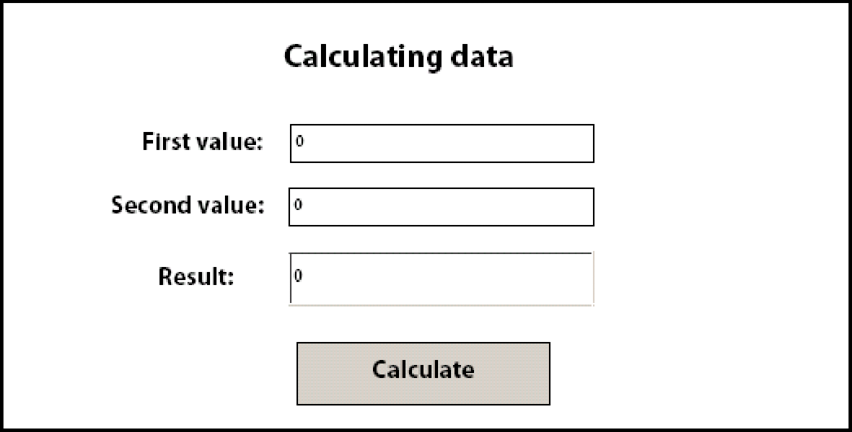

# 양식 데이터 계산 {#calculating-form-data}

**이 문서의 샘플 및 예제는 JEE 환경의 AEM Forms에 대해서만 적용됩니다.**

Forms 서비스는 사용자가 양식에 입력하는 값을 계산하고 결과를 표시할 수 있습니다. 양식 데이터를 계산하려면 두 가지 작업을 수행해야 합니다. 먼저 양식 데이터를 계산하는 양식 디자인 스크립트를 만듭니다. 양식 디자인은 세 가지 유형의 스크립트를 지원합니다. 한 스크립트 유형은 클라이언트에서 실행되고, 다른 스크립트 유형은 서버에서 실행되며, 세 번째 스크립트 유형은 서버와 클라이언트 모두에서 실행됩니다. 이 항목에서 설명하는 스크립트 유형은 서버에서 실행됩니다. 서버측 계산은 HTML, PDF 및 양식 안내서(더 이상 사용되지 않음) 변환에 대해 지원됩니다.

양식 디자인 프로세스의 일부로 계산 및 스크립트를 사용하여 더 풍부한 사용자 경험을 제공할 수 있습니다. 대부분의 양식 필드 및 개체에 계산 및 스크립트를 추가할 수 있습니다. 양식 디자인 스크립트를 만들어 사용자가 대화형 양식에 입력하는 데이터에 대한 계산 작업을 수행합니다.

양식에 값을 입력하고 계산 버튼을 클릭하여 결과를 확인합니다. 다음 프로세스에서는 사용자가 데이터를 계산할 수 있도록 하는 예제 응용 프로그램에 대해 설명합니다.

* 사용자가 웹 애플리케이션의 시작 페이지로 작동하는 StartLoan.html이라는 HTML 페이지에 액세스합니다. 이 페이지는 이라는 Java 서블릿을 호출합니다. `GetLoanForm`.
* 다음 `GetLoanForm` 서블릿은 대출 양식을 렌더링합니다. 이 양식에는 스크립트, 대화형 필드, 계산 단추 및 제출 단추가 포함되어 있습니다.
* 양식의 필드에 값을 입력하고 계산 버튼을 클릭합니다. 양식이 다음 주소로 전송됩니다. `CalculateData` 스크립트가 실행되는 Java 서블릿. 이 양식은 계산 결과가 양식에 표시된 상태로 사용자에게 다시 전송됩니다.
* 사용자는 만족스러운 결과가 표시될 때까지 값을 계속 입력하고 계산합니다. 만족하면 사용자가 제출 단추를 클릭하여 양식을 처리합니다. 양식이 이름이 인 다른 Java 서블릿으로 전송됩니다. `ProcessForm` 이는 제출된 데이터를 검색하는 역할을 합니다. (참조: [제출된 Forms 처리](/help/forms/developing/rendering-forms.md#handling-submitted-forms).)


다음 다이어그램은 애플리케이션의 논리 흐름을 보여 줍니다.


다음 표에서는 이 다이어그램의 단계에 대해 설명합니다.

<table>
 <thead>
  <tr>
   <th><p>단계</p></th>
   <th><p>설명</p></th>
  </tr>
 </thead>
 <tbody>
  <tr>
   <td><p>1</p></td>
   <td><p>다음 <code>GetLoanForm</code> Java 서블릿은 HTML 시작 페이지에서 호출됩니다. </p></td>
  </tr>
  <tr>
   <td><p>2</p></td>
   <td><p>다음 <code>GetLoanForm</code> Java 서블릿은 Forms 서비스 클라이언트 API를 사용하여 대출 양식을 클라이언트 웹 브라우저에 렌더링합니다. 서버에서 실행되도록 구성된 스크립트가 포함된 양식을 렌더링하는 것과 스크립트가 포함되지 않은 양식을 렌더링하는 것의 차이점은 스크립트를 실행하는 데 사용되는 대상 위치를 지정해야 한다는 것입니다. 대상 위치를 지정하지 않으면 서버에서 실행되도록 구성된 스크립트가 실행되지 않습니다. 예를 들어 이 섹션에 소개된 애플리케이션을 고려해 보십시오. 다음 <code>CalculateData</code> Java 서블릿은 스크립트가 실행되는 타겟 위치입니다.</p></td>
  </tr>
  <tr>
   <td><p>3</p></td>
   <td><p>사용자가 대화형 필드에 데이터를 입력하고 계산 버튼을 클릭합니다. 양식이 다음 주소로 전송됩니다. <code>CalculateData</code> 스크립트가 실행되는 Java 서블릿. </p></td>
  </tr>
  <tr>
   <td><p>4</p></td>
   <td><p>양식이 웹 브라우저로 다시 렌더링되고 계산 결과가 양식에 표시됩니다. </p></td>
  </tr>
  <tr>
   <td><p>5</p></td>
   <td><p>값이 만족스러우면 제출(Submit) 단추를 클릭합니다. 양식이 이름이 인 다른 Java 서블릿으로 전송됩니다. <code>ProcessForm</code>.</p></td>
  </tr>
 </tbody>
</table>

일반적으로 PDF 컨텐츠로 제출되는 양식에는 클라이언트에서 실행되는 스크립트가 포함됩니다. 그러나 서버측 계산도 실행할 수 있습니다. 제출 단추는 스크립트를 계산하는 데 사용할 수 없습니다. 이 경우 Forms 서비스에서 상호 작용을 완료로 간주하므로 계산이 실행되지 않습니다.

양식 디자인 스크립트의 사용을 설명하기 위해 이 섹션에서는 서버에서 실행되도록 구성된 스크립트가 포함된 간단한 대화형 양식을 검사합니다. 다음 다이어그램은 사용자가 처음 두 필드에 입력한 값을 추가하고 세 번째 필드에 결과를 표시하는 스크립트가 포함된 양식 디자인을 보여 줍니다.



**A.** NumericField1이라는 필드 **B.** NumericField2라는 필드 **C.** NumericField3이라는 필드

이 양식 디자인에서 스크립트의 구문은 다음과 같습니다.

```javascript
     NumericField3 = NumericField2 + NumericField1
```

이 양식 디자인에서 계산 버튼은 명령 버튼이고 스크립트는 이 버튼의 `Click` 이벤트. 사용자가 처음 두 필드(NumericField1 및 NumericField2)에 값을 입력하고 계산 단추를 클릭하면 양식이 Forms 서비스로 전송되고 스크립트가 실행됩니다. Forms 서비스는 NumericField3 필드에 표시된 계산 결과를 사용하여 양식을 클라이언트 장치로 다시 렌더링합니다.

>[!NOTE]
>
>양식 디자인 스크립트 만들기에 대한 자세한 내용은 [Forms 디자이너](https://www.adobe.com/go/learn_aemforms_designer_63).

>[!NOTE]
>
>Forms 서비스에 대한 자세한 내용은 [AEM Forms에 대한 서비스 참조](https://www.adobe.com/go/learn_aemforms_services_63).

## 단계 요약 {#summary-of-steps}

양식 데이터를 계산하려면 다음 작업을 수행합니다.

1. 프로젝트 파일을 포함합니다.
1. Forms 클라이언트 API 개체를 만듭니다.
1. 계산 스크립트가 포함된 양식을 검색합니다.
1. 양식 데이터 스트림을 클라이언트 웹 브라우저에 다시 씁니다.

**프로젝트 파일 포함**

개발 프로젝트에 필요한 파일을 포함하십시오. Java를 사용하여 클라이언트 응용 프로그램을 만드는 경우 필요한 JAR 파일을 포함합니다. 웹 서비스를 사용하는 경우 프록시 파일을 포함해야 합니다.

**Forms 클라이언트 API 개체 만들기**

Forms 서비스 클라이언트 API 작업을 프로그래밍 방식으로 수행하려면 먼저 Forms 서비스 클라이언트를 만들어야 합니다. Java API를 사용하는 경우 `FormsServiceClient` 개체. Forms 웹 서비스 API를 사용하는 경우 `FormsServiceService` 개체.

**계산 스크립트가 포함된 양식 검색**

Forms 서비스 클라이언트 API를 사용하여 서버에서 실행되도록 구성된 스크립트가 포함된 양식을 처리하는 애플리케이션 논리를 생성합니다. 이 프로세스는 제출된 양식을 처리하는 것과 유사합니다. (참조: [제출된 Forms 처리](/help/forms/developing/handling-submitted-forms.md).)

제출된 양식과 연결된 처리 상태가 `1` `(Calculate)`즉, Forms 서비스가 양식 데이터에 대한 계산 작업을 수행하고 있으며 결과를 사용자에게 다시 기록해야 합니다. 이 경우 서버에서 실행되도록 구성된 스크립트가 자동으로 실행됩니다.

**양식 데이터 스트림을 클라이언트 웹 브라우저에 다시 씁니다.**

제출된 양식과 관련된 처리 상태를 확인한 후 `1`클라이언트 웹 브라우저에 결과를 다시 작성해야 합니다. 양식이 표시되면 계산된 값이 해당 필드에 나타납니다.

**추가 참조**

[AEM Forms Java 라이브러리 파일 포함](/help/forms/developing/invoking-aem-forms-using-java.md#including-aem-forms-java-library-files)
[Java API를 사용하여 양식 데이터 계산](/help/forms/developing/calculating-form-data.md#calculate-form-data-using-the-java-api)
[웹 서비스 API를 사용하여 양식 데이터 계산](/help/forms/developing/calculating-form-data.md#calculate-form-data-using-the-web-service-api)
[연결 속성 설정](/help/forms/developing/invoking-aem-forms-using-java.md#setting-connection-properties)
[Forms 서비스 API 빠른 시작](/help/forms/developing/forms-service-api-quick-starts.md#forms-service-api-quick-starts)
[대화형 PDF forms 렌더링](/help/forms/developing/rendering-interactive-pdf-forms.md)
[Forms을 렌더링하는 웹 애플리케이션 만들기](/help/forms/developing/creating-web-applications-renders-forms.md)

## Java API를 사용하여 양식 데이터 계산 {#calculate-form-data-using-the-java-api}

Forms API(Java)를 사용하여 양식 데이터 계산:

1. 프로젝트 파일 포함

   Java 프로젝트의 클래스 경로에 adobe-forms-client.jar과 같은 클라이언트 JAR 파일을 포함합니다.

1. Forms 클라이언트 API 개체 만들기

   * 만들기 `ServiceClientFactory` 연결 속성을 포함하는 개체입니다.
   * 만들기 `FormsServiceClient` 개체를 생성자를 사용하고 `ServiceClientFactory` 개체.

1. 계산 스크립트가 포함된 양식 검색

   * 계산 스크립트가 포함된 양식 데이터를 검색하려면 `com.adobe.idp.Document` 개체를 만들 때 `javax.servlet.http.HttpServletResponse` 개체 `getInputStream` 생성자 내의 메서드입니다.
   * 호출 `FormsServiceClient` 개체 `processFormSubmission` 메서드를 실행하고 다음 값을 전달합니다.

      * 다음 `com.adobe.idp.Document` 양식 데이터가 포함된 개체입니다.
      * 모든 관련 HTTP 헤더를 포함하는 환경 변수를 지정하는 문자열 값입니다. 에 대해 하나 이상의 값을 지정하여 처리할 콘텐츠 유형을 지정합니다. `CONTENT_TYPE` 환경 변수입니다. 예를 들어 XML 및 PDF 데이터를 처리하려면 이 매개 변수에 대해 다음 문자열 값을 지정합니다. `CONTENT_TYPE=application/xml&CONTENT_TYPE=application/pdf`
      * 다음을 지정하는 문자열 값 `HTTP_USER_AGENT` 헤더 값, 예: `Mozilla/4.0 (compatible; MSIE 6.0; Windows NT 5.1; SV1; .NET CLR 1.1.4322)`.
      * A `RenderOptionsSpec` 런타임 옵션을 저장하는 개체입니다.

     다음 `processFormSubmission` 메서드가 을 반환합니다. `FormsResult` 양식 제출 결과를 포함하는 개체입니다.

   * 제출된 양식과 연결된 처리 상태가 `1` 를 호출하여 `FormsResult` 개체 `getAction` 메서드를 사용합니다. 이 메서드가 값을 반환하는 경우 `1`를 사용하여 계산을 수행했으며 클라이언트 웹 브라우저에 데이터를 다시 쓸 수 있습니다.

1. 양식 데이터 스트림을 클라이언트 웹 브라우저에 다시 씁니다.

   * 만들기 `javax.servlet.ServletOutputStream` 양식 데이터 스트림을 클라이언트 웹 브라우저로 전송하는 데 사용되는 개체입니다.
   * 만들기 `com.adobe.idp.Document` 를 호출하여 개체 `FormsResult` 의 오브젝트 `getOutputContent` 메서드를 사용합니다.
   * 만들기 `java.io.InputStream` 를 호출하여 개체 `com.adobe.idp.Document` 개체 `getInputStream` 메서드를 사용합니다.
   * 바이트 배열을 만들고 `InputStream` 개체 `read` 메서드에서 바이트 배열을 인수로 전달합니다.
   * 호출 `javax.servlet.ServletOutputStream` 개체 `write` 클라이언트 웹 브라우저에 양식 데이터 스트림을 전송하는 방법입니다. 바이트 배열을 로 전달 `write` 메서드를 사용합니다.

**추가 참조**


[AEM Forms Java 라이브러리 파일 포함](/help/forms/developing/invoking-aem-forms-using-java.md#including-aem-forms-java-library-files)
[연결 속성 설정](/help/forms/developing/invoking-aem-forms-using-java.md#setting-connection-properties)

## 웹 서비스 API를 사용하여 양식 데이터 계산 {#calculate-form-data-using-the-web-service-api}

Forms API(웹 서비스)를 사용하여 양식 데이터 계산:

1. 프로젝트 파일 포함

   * Forms 서비스 WSDL을 사용하는 Java 프록시 클래스를 만듭니다.
   * 클래스 경로에 Java 프록시 클래스를 포함합니다.

1. Forms 클라이언트 API 개체 만들기

   만들기 `FormsService` 개체로 설정하고 인증 값을 설정합니다.

1. 계산 스크립트가 포함된 양식 검색

   * Java 서블릿에 게시된 양식 데이터를 검색하려면 `BLOB` 개체를 만들 때 사용됩니다.
   * 만들기 `java.io.InputStream` 을 사용하여 개체 `javax.servlet.http.HttpServletResponse` 개체 `getInputStream` 메서드를 사용합니다.
   * 만들기 `java.io.ByteArrayOutputStream` 개체를 생성자를 사용하고 `java.io.InputStream` 개체.
   * 의 내용을 복사합니다. `java.io.InputStream` 에 대한 오브젝트 `java.io.ByteArrayOutputStream` 개체.
   * 를 호출하여 바이트 배열 만들기 `java.io.ByteArrayOutputStream` 개체 `toByteArray` 메서드를 사용합니다.
   * 채우기 `BLOB` 개체 `setBinaryData` 메서드에서 바이트 배열을 인수로 전달합니다.
   * 만들기 `RenderOptionsSpec` 개체를 만들 때 사용됩니다. 를 호출하여 로케일 값 설정 `RenderOptionsSpec` 개체 `setLocale` 메서드 및 로케일 값을 지정하는 문자열 값 전달
   * 호출 `FormsServiceClient` 개체 `processFormSubmission` 메서드를 실행하고 다음 값을 전달합니다.

      * 다음 `BLOB` 양식 데이터가 포함된 개체입니다.
      * 환경 변수를 지정하는 문자열 값은 모든 관련 HTTP 헤더를 포함합니다. 예를 들어 다음 문자열 값을 지정할 수 있습니다. `HTTP_REFERER=referrer&HTTP_CONNECTION=keep-alive&CONTENT_TYPE=application/xml`
      * 다음을 지정하는 문자열 값 `HTTP_USER_AGENT` 헤더 값, 예: `Mozilla/4.0 (compatible; MSIE 6.0; Windows NT 5.1; SV1; .NET CLR 1.1.4322)`.
      * A `RenderOptionsSpec` 런타임 옵션을 저장하는 개체입니다. 자세한 내용은 .
      * 비어 있음 `BLOBHolder` 메서드에서 채운 개체입니다.
      * 비어 있음 `javax.xml.rpc.holders.StringHolder` 메서드에서 채운 개체입니다.
      * 비어 있음 `BLOBHolder` 메서드에서 채운 개체입니다.
      * 비어 있음 `BLOBHolder` 메서드에서 채운 개체입니다.
      * 비어 있음 `javax.xml.rpc.holders.ShortHolder` 메서드에서 채운 개체입니다.
      * 비어 있음 `MyArrayOf_xsd_anyTypeHolder` 메서드에서 채운 개체입니다. 이 매개 변수는 양식과 함께 제출되는 첨부 파일을 저장하는 데 사용됩니다.
      * 비어 있음 `FormsResultHolder` 제출된 양식으로 메서드에 의해 채워지는 개체입니다.

     다음 `processFormSubmission` 메서드는 `FormsResultHolder` 양식 제출 결과가 포함된 매개변수 다음 `processFormSubmission` 메서드가 을 반환합니다. `FormsResult` 양식 제출 결과를 포함하는 개체입니다.

   * 제출된 양식과 연결된 처리 상태가 `1` 를 호출하여 `FormsResult` 개체 `getAction` 메서드를 사용합니다. 이 메서드가 값을 반환하는 경우 `1`를 사용하여 계산을 수행했으며 클라이언트 웹 브라우저에 데이터를 다시 쓸 수 있습니다.

1. 양식 데이터 스트림을 클라이언트 웹 브라우저에 다시 씁니다.

   * 만들기 `javax.servlet.ServletOutputStream` 양식 데이터 스트림을 클라이언트 웹 브라우저로 전송하는 데 사용되는 개체입니다.
   * 만들기 `BLOB` 를 호출하여 양식 데이터를 포함하는 개체 `FormsResult` 개체 `getOutputContent` 메서드를 사용합니다.
   * 바이트 배열을 만들고 `BLOB` 개체 `getBinaryData` 메서드를 사용합니다. 이 작업은 의 콘텐츠를 할당합니다. `FormsResult` 개체를 바이트 배열에 추가합니다.
   * 호출 `javax.servlet.http.HttpServletResponse` 개체 `write` 클라이언트 웹 브라우저에 양식 데이터 스트림을 전송하는 방법입니다. 바이트 배열을 로 전달 `write` 메서드를 사용합니다.

**참조:**
[Base64 인코딩을 사용하여 AEM Forms 호출](/help/forms/developing/invoking-aem-forms-using-web.md#invoking-aem-forms-using-base64-encoding)
