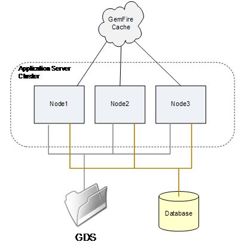

# JEE 서버 클러스터에서 AEM Forms 구성 및 문제 해결 {#configuring-troubleshooting-aem-forms-jee-server-cluster}

## 전제 조건 지식 {#prerequisites}

JEE, JBoss, WebSphere 및 Weblogic 응용 프로그램 서버, Red Hat Linux, SUSE Linux, Microsoft Windows, IBM AIX 또는 Sun Solaris 운영 체제, Oracle, IBM DB2 또는 SQL Server 데이터베이스 서버 및 웹 환경에 익숙한 AEM Forms

## 사용자 수준 {#user-level}

고급

JEE 클러스터의 AEM Forms은 JEE의 AEM Forms이 클러스터 노드의 실패에 탄력적으로 대응할 수 있고, 단일 노드의 능력을 넘어 시스템 용량을 확장할 수 있도록 설계된 토폴로지입니다. 클러스터는 여러 노드를 하나의 논리 시스템으로 결합하여 데이터를 공유하고 트랜잭션이 실행에서 여러 노드에 걸쳐 있을 수 있도록 합니다. 클러스터는 JEE에서 AEM Forms을 확장하는 가장 일반적인 방법으로, 모든 작업 로드 조합을 처리하는 모든 서비스의 조합이 지원됩니다. JEE 클러스터의 AEM Forms이 모든 유형의 배포에 가장 적합한 것은 아니며, 특히 클러스터되지 않은 서버 부하 분산 아키텍처가 많은 경우 적절할 수 있습니다.

이 문서의 목적은 JEE 클러스터의 AEM Forms과 발생할 수 있는 특정 구성 요구 사항과 잠재적인 문제 영역에 대해 토론하는 것입니다.

## 클러스터에 무엇이 있습니까? {#what-is-in-cluster}

JEE 클러스터 노드의 AEM Forms은 서로 통신하고 정보를 공유하여 전체 클러스터에서 단일 일관된 구성 및 애플리케이션 상태를 가질 수 있도록 합니다. 클러스터 내의 정보 공유는 서로 다른 컨텍스트에서 사용되는 여러 가지 방법으로 동시에 수행됩니다. 기본 정보 공유 방법은 아래 그림에 나와 있습니다.



### 응용 프로그램 서버 클러스터 {#application-server-cluster}

JEE 클러스터의 AEM Forms은 기본 애플리케이션 서버의 클러스터링 기능을 사용합니다. 응용 프로그램 서버 클러스터는 클러스터 구성을 전체적으로 관리할 수 있도록 하며 소프트웨어 구성 요소가 클러스터 내에서 서로를 찾을 수 있도록 하는 JNDI(Java Naming and Directory Interface)와 같은 저수준 클러스터 서비스를 제공합니다. 클러스터 서비스의 정교성과 응용 프로그램 서버가 응용 프로그램 서버에 종속되어 있는 기본 기술 종속성은 다음과 같습니다. WebSphere 및 WebLogic은 클러스터를 위한 정교한 관리 기능을 갖추고 있지만 JBoss는 매우 기본적인 접근 방식을 제공합니다.

### GemFire 캐시 {#gemfire-cache}

GemFire 캐시는 각 클러스터 노드에 구현되는 분산 캐시 메커니즘입니다. 노드는 서로 찾아 노드 간에 일관성을 유지하는 단일 논리 캐시를 만듭니다. 그림 1에서 클라우드로 표시되는 단일 노드 캐시를 유지하기 위해 서로 다른 노드를 찾는 노드들이 함께 결합됩니다. GDS 및 데이터베이스와 달리 캐시는 완전히 새로운 엔티티입니다. 실제 캐시된 컨텐츠는 각 클러스터 노드의 `LC_TEMP` 디렉토리 및 메모리에 저장됩니다.

### 데이터베이스 {#database}

JDBC 데이터 소스 IDP_DS, EDC_DS 등을 통해 액세스하는 JEE의 AEM Forms 데이터베이스는 클러스터의 모든 노드에서 공유됩니다. 진행 중인 트랜잭션, 진행 중인 트랜잭션과 연관된 사용자 데이터, 시스템 설정 방식에 대한 데이터 등 JEE의 AEM Forms 상태와 관련된 대부분의 영구 데이터가 이 데이터베이스에 있습니다.

### 글로벌 문서 저장소 {#global-document-storage}

GDS(Global Document Storage)는 JEE의 AEM Forms 내에서 IDPDocument 클래스(Document Manager)가 사용하는 파일 시스템 기반 저장 영역입니다. GDS는 클러스터의 모든 노드에서 액세스할 수 있어야 하는 단기 및 장기 파일을 저장합니다.

### 기타 항목 {#other-items}

이러한 기본 공유 리소스 외에 Quartz와 같은 특정 클러스터 동작이 있는 다른 항목이 있습니다. Quartz는 JEE의 AEM Forms에서 사용하는 스케줄러 하위 시스템이며 데이터베이스 테이블을 사용하여 예약한 내용과 실행 중인 예약된 활동에 대한 지식을 보유합니다. 쿼츠는 단일 노드 설치 및 클러스터에 대해 다르게 구성해야 하며, JEE 설정의 다른 AEM Forms에서 큐를 가져옵니다.

## 일반적인 구성 문제 {#common-configuration}

JEE 클러스터에서 AEM Forms 유지 관리 또는 문제 해결에 대한 가장 좌절스러운 사항 중 하나는 클러스터가 올바른지 확인할 단일 위치가 없다는 것입니다. 클러스터의 모든 상태가 양호한지 확인하기 위해 일부 조사 및 분석이 필요하며, 클러스터 구성의 문제점에 따라 클러스터 작업에 몇 가지 실패 모드가 있습니다. 아래 그림은 공유 리소스 중 일부가 잘못 공유된 잘못 구성된 클러스터를 보여줍니다.


기억해야 할 흥미롭고 중요한 사항은 클러스터에서 AEM Forms을 실행하지 않으려는 경우에도 클러스터링이 작동하는 방식과 클러스터에서 찾고 확인할 사항 종류를 숙지해야 한다는 것입니다. 이는 JEE의 AEM Forms의 일부 부분이 클러스터에서 잘못 작동하는 신호를 가져다가 예상하지 못한 클러스터 동작을 취할 수 있기 때문입니다.

위의 그림에서 공유 구성은 어떻게 됩니까? 다음 섹션에서는 문제에 대해 설명합니다.

### (1) GemFire 클러스터 구성 {#gemfire-cluster-configuration}

Gemfire 캐시에 몇 가지 문제가 있을 수 있습니다. 두 가지 일반적인 시나리오는 다음과 같습니다.

* 서로를 찾을 수 있어야 하는 노드는 그렇게 할 수 없습니다.

* 클러스터링되지 않아야 하는 노드는 서로를 찾고, 그렇지 않으면 캐시를 공유합니다.

클러스터링하려는 노드가 있는 경우 네트워크에서 서로 찾아야 합니다. 기본적으로 멀티캐스트 UDP 메시지를 통해 이 작업을 수행합니다. 각 노드는 자신이 존재하는 브로드캐스트 메시지를 전송하고, 그러한 메시지를 수신한 모든 노드는 다른 노드에 접속하기 시작합니다. 이런 종류의 자동 탐색 방법은 매우 일반적이며, 많은 종류의 소프트웨어와 가전제품들이 이것을 합니다.

자동 검색의 한 가지 일반적인 문제는 멀티캐스트 메시지가 네트워크 정책의 일부나 소프트웨어 방화벽 규칙으로 인해 네트워크에 의해 필터링되거나 노드 간에 존재하는 네트워크를 통해 라우팅되지 못할 수 있다는 것입니다. UDP 자동 검색이 복잡한 네트워크에서 작동하기 어려운 일반적인 문제로 인해, 대체 검색 방법을 사용하는 프로덕션 배포는 일반적인 방법입니다. TCP 로케이터입니다. TCP 로케이터에 대한 일반적인 논의는 참조에서 찾을 수 있습니다.

**로케이터나 UDP를 사용하고 있는지 어떻게 알 수 있습니까?**

다음 JVM 속성은 GemFire 캐시가 다른 노드를 찾는 데 사용하는 방법을 제어합니다.

멀티캐스트 설정:

* `adobe.cache.multicast-port`: 분산 시스템의 다른 구성원과 통신하는 데 사용되는 멀티캐스트 포트입니다. 0으로 설정하면 멤버 검색과 배포 모두에 대해 멀티캐스트를 사용할 수 없습니다.

* `gemfire.mcast-address` (선택 사항): Gemfire에서 사용하는 기본 IP 주소를 무시합니다.

TCP 로케이터 설정:

* `adobe.cache.cluster-locators`: 시스템 구성원이 실행 중인 로케이터와 통신하기 위해 사용하는 모든 로케이터에 대한 TCP 로케이터 및 TCP 로케이터 포트의 IP 주소/호스트 이름입니다.

목록에는 현재 사용 중인 모든 위치가 포함되어야 하며 클러스터 시스템의 모든 구성원에 대해 일관되게 구성해야 합니다.

TCP 로케이터 목록이 비어 있으면 로케이터가 사용되지 않고 대신 멀티캐스트 방법이 사용됩니다.

**TCP 로케이터가 실행 중인지 확인하려면 어떻게 해야 합니까?**

먼저 TCP 로케이터가 사용 중인 경우 모든 클러스터 노드의 다음 JVM 속성에 나열된 TCP 로케이터가 있어야 합니다.

`-Dadobe.cache.cluster-locators=aix01.adobe.com[22345],aix02.adobe.com[22345]`

JEE 클러스터 노드의 AEM Forms에서 로케이터를 실행할 필요가 없습니다. 필요한 경우 클러스터와 별도의 다른 시스템에서 실행할 수 있습니다. 두 개 이상의 시스템에서 로케이터를 실행할 수 있으며, 일반적으로 로케이터의 단일 오류로 인해 클러스터 재시작 문제가 발생할 수 있는 가능성에 대비하여 두 위치에서 로케이터를 실행하는 것이 가장 좋습니다. Locators를 실행하는 각 시스템에서 해당 시스템에서 다음 명령을 사용하여 실행 중인지 확인할 수 있습니다.

`netstat -an | grep 22345`

예상 응답은 다음과 같습니다.

`tcp 0 0 *.22345 *.* LISTEN`

다른 확인 명령은 다음과 같습니다.

`ps -ef | grep gemfire`

예상 응답은 다음과 같습니다.

`livecycl 331984 1 0 10:14:51 pts/0 0:03 java -cp ./gemfire.jar: -Dgemfire.license-type=production -Dlocators=localhost[22345] com.gemstone.gemfire.distributed.Locator 22345`

**GemFire가 클러스터에 있다고 생각하는 노드를 보려면 어떻게 해야 합니까?**

GemFire는 GemFire 캐시에서 발견되고 채택된 클러스터 멤버를 진단하는 데 사용할 수 있는 로깅 정보를 생성합니다. 이 옵션을 사용하여 올바른 모든 클러스터 멤버가 검색되고 추가 또는 잘못된 클러스터 노드 검색이 발생하지 않는지 확인할 수 있습니다. GemFire용 로그 파일은 JEE 임시 디렉토리에 구성된 AEM Forms에 있습니다.

`.../LC_TEMP/adobeZZ__123456/Caching/Gemfire.log`

`adobeZZ_` 뒤의 숫자 문자열은 서버 노드에 고유하므로 임시 디렉토리의 실제 컨텐츠를 검색해야 합니다. `adobe` 뒤의 두 문자는 애플리케이션 서버 유형에 따라 달라집니다. `wl`, `jb` 또는 `ws` 중 하나를 선택합니다.

다음 샘플 로그는 두 노드 클러스터가 자신을 찾을 때 발생하는 작업을 보여줍니다.

첫 번째 노드에서 AP-HP8:

```xml
[config 2011/08/05 09:28:09.143 EDT GemfireCacheAdapter <server.startup : 0> tid=0x65] This member, ap-hp8(4268):18763, is becoming group coordinator.
[info 2011/08/05 09:28:09.151 EDT GemfireCacheAdapter <server.startup : 0> tid=0x65] Entered into membership in group GF6.5.1.17 with ID ap-hp8(4268)<v0>:18763/56449.
[info 2011/08/05 09:28:09.152 EDT GemfireCacheAdapter <server.startup : 0> tid=0x65] Starting DistributionManager ap-hp8(4268)<v0>:18763/56449.
[info 2011/08/05 09:28:09.153 EDT GemfireCacheAdapter <server.startup : 0> tid=0x65] Initial (membershipManager) view =  [ap-hp8(4268)<v0>:18763/56449]
[info 2011/08/05 09:28:09.153 EDT GemfireCacheAdapter <server.startup : 0> tid=0x65] Admitting member <ap-hp8(4268)<v0>:18763/56449>. Now there are 1 non-admin member(s).
[info 2011/08/05 09:28:09.154 EDT GemfireCacheAdapter <server.startup : 0> tid=0x65] ap-hp8(4268)<v0>:18763/56449 is the elder and the only member.
[info 2011/08/05 09:28:09.163 EDT GemfireCacheAdapter <server.startup : 0> tid=0x65] Did not hear back from any other system. I am the first one.
[info 2011/08/05 09:28:09.164 EDT GemfireCacheAdapter <server.startup : 0> tid=0x65] DistributionManager ap-hp8(4268)<v0>:18763/56449 started on 239.192.81.1[33456]. There were 0 other DMs. others: []
[info 2011/08/05 09:28:20.841 EDT GemfireCacheAdapter <Pooled Message Processor 1> tid=0xc4] New administration member detected at ap-hp7(2821)<v1>:19498/59136.
```

다른 노드에서 AP-HP7:

```xml
[info 2011/08/05 09:28:09.830 EDT GemfireCacheAdapter <server.startup : 0> tid=0x64] Attempting to join distributed system whose membership coordinator is ap-hp8(4268)<v0>:18763 using membership ID ap-hp7(2821):19498
[info 2011/08/05 09:28:10.058 EDT GemfireCacheAdapter <server.startup : 0> tid=0x64] Entered into membership in group GF6.5.1.17 with ID ap-hp7(2821)<v1>:19498/59136.
[info 2011/08/05 09:28:10.059 EDT GemfireCacheAdapter <server.startup : 0> tid=0x64] Starting DistributionManager ap-hp7(2821)<v1>:19498/59136.
[info 2011/08/05 09:28:10.060 EDT GemfireCacheAdapter <server.startup : 0> tid=0x64] Initial (membershipManager) view =  [ap-hp8(4268)<v0>:18763/56449, ap-hp7(2821)<v1>:19498/59136]
[info 2011/08/05 09:28:10.060 EDT GemfireCacheAdapter <server.startup : 0> tid=0x64] Admitting member <ap-hp8(4268)<v0>:18763/56449>. Now there are 1 non-admin member(s).
[info 2011/08/05 09:28:10.060 EDT GemfireCacheAdapter <server.startup : 0> tid=0x64] Admitting member <ap-hp7(2821)<v1>:19498/59136>. Now there are 2 non-admin member(s).
[info 2011/08/05 09:28:10.128 EDT GemfireCacheAdapter <server.startup : 0> tid=0x64] DistributionManager ap-hp7(2821)<v1>:19498/59136 started on 239.192.81.1[33456]. There were 1 other DMs. others: [ap-hp8(4268)<v0>:18763/56449]
```

**GemFire가 그렇지 않아야 하는 노드를 찾고 있다면 어떻게 됩니까?**

회사 네트워크를 공유하는 각 개별 클러스터는 TCP 로케이터가 사용되는 경우 별도의 TCP 로케이터 집합을 사용하거나 멀티캐스트 UDP 구성이 사용되는 경우 별도의 UDP 포트 번호를 사용해야 합니다. UDP autodiscovery는 JEE의 AEM Forms에 대한 기본 구성이며 동일한 기본 포트 33456이 여러 클러스터에서 사용 중일 수 있으므로, 전송을 시도하지 않아야 하는 클러스터가 예기치 않게 사용 중일 수 있습니다. 예를 들어, 프로덕션 및 QA 클러스터는 별도의 상태로 유지되지만 UDP 멀티캐스트를 통해 서로 연결할 수 있습니다.

클러스터의 부트스트랩 중에 GemFire가 부적절하게 클러스터링되는 네트워크에서 중복 포트를 찾을 수 있는 가장 일반적인 상황입니다. 부트스트랩 프로세스가 명확한 이유 없이 실패한다는 것을 알 수 있습니다. 일반적으로 다음과 같은 오류가 표시됩니다.

```xml
Caused by: com.ibm.ejs.container.UnknownLocalException: nested exception is: com.adobe.pof.schema.ObjectTypeNotFoundException: Object Type: dsc.sc_service_configuration not found.
                at com.adobe.pof.schema.POFDefaultDomain.getObjectType(POFDefaultDomain.java:93)
                at com.adobe.idp.dsc.initializer.DSCInitializerBean.serviceConfigAuditAttributeExists(DSCInitializerBean.java:225)
                at com.adobe.idp.dsc.initializer.DSCInitializerBean.installSchema(DSCInitializerBean.java:186)
                at com.adobe.idp.dsc.initializer.DSCInitializerBean.bootstrap(DSCInitializerBean.java:94)
                at com.adobe.idp.dsc.initializer.EJSLocalStatelessDSCInitializerBeanLocalEJB_7bb34e85.bootstrap(Unknown Source)
                at com.adobe.livecycle.bootstrap.bootstrappers.DSCBootstrapper.bootstrap(DSCBootstrapper.java:68)
```

이 경우 부트스트래퍼는 GemFire와 함께 필수 테이블에 액세스하는 작업을 하고 있으며 JDBC를 통해 액세스한 테이블과 다른 기본 데이터베이스가 있는 다른 클러스터에서 반환되는 GemFire에서 반환되는 캐시된 테이블 정보 간에 불일치가 발생합니다.

부트스트랩 중에 중복 포트가 두드러지는 경우가 많지만, 다른 클러스터의 부트스트랩이 발생한 후 클러스터를 다시 시작할 때 또는 이전에 분리된 클러스터를 멀티캐스트 목적으로 서로 보이도록 네트워크 구성을 변경할 때 나중에 이러한 상황이 표시될 수 있습니다.

이러한 상황을 진단하려면 GemFire 로그를 확인하고 예상 노드만 발견되는지 여부를 신중하게 고려하는 것이 가장 좋습니다. 문제를 해결하려면

`adobe.cache.multicast-port`

속성을 클러스터 중 하나 또는 둘 다에 있는 다른 값으로 설정합니다.

### 2) GDS 공유 {#gds-sharing}

GDS 공유는 모든 클러스터 노드에서 사용할 수 있도록 동일한 공유 디렉토리 구조를 배치해야 하는 O/S 수준에서 JEE 자체의 AEM Forms 외부에서 구성됩니다. Windows 유형 시스템에서는 일반적으로 한 노드에서 다른 노드로 또는 NAS 어플라이언스와 같은 원격 파일 시스템에서 모든 노드로 파일 공유를 설정하여 이러한 작업을 수행합니다. UNIX 시스템에서 GDS 공유는 일반적으로 한 노드에서 다른 노드로 또는 NAS 어플라이언스에서 NFS 파일 공유를 통해 수행됩니다.

이 원격 파일 공유를 사용할 수 없거나 미묘한 문제가 있는 경우 클러스터의 가능한 실패 모드입니다. 네트워크 문제, 보안 설정 또는 잘못된 구성으로 인해 원격 마운트가 실패할 수 있습니다. 시스템을 다시 부팅하면 구성 변경 사항이 며칠 또는 몇 주 전에 적용되므로 예상치 못한 상황이 발생할 수 있습니다.

**NFS 공유가 마운트되지 않으면 어떻게 됩니까?**

UNIX에서 NFS 마운트가 디렉토리 구조에 매핑되는 방식을 사용하면 마운트에 장애가 발생하더라도 사용 가능한 GDS 디렉토리를 사용할 수 있습니다. 다음 사항을 고려하십시오.

* NAS 서버: NFS 공유 폴더 /u01/iapply/livecycle_gds
* 노드 1: 여기에 있는 공유 폴더(DB 서버에 호스트됨)에 마운트 지점: /u01/iapply/livecycle_gds
* 노드 2: 여기에 있는 공유 폴더(DB 서버에 호스트됨)에 마운트 지점: /u01/iapply/livecycle_gds

* LCES는 GDS의 경로를 지정합니다. /u01/iapply/livecycle_gds

노드 1의 마운트가 실패하면 디렉토리 구조에는 여전히 빈 마운트 지점에 대한 /u01/iapply/livecycle_gds 경로가 포함되며 노드가 올바르게 실행되는 것으로 나타납니다. 그러나 GDS 컨텐츠가 실제로 다른 노드와 공유되지 않으므로 클러스터가 제대로 작동하지 않습니다. 이것은 일어날 수 있고 일어날 수 있습니다. 그리고 그 결과는 클러스터가 불가사의한 방식으로 실패했다는 것입니다.

Linux 마운트 지점이 GDS의 루트로 사용되지 않고, 그 내의 일부 디렉토리가 GDS 루트로 사용되도록 하는 것이 가장 좋습니다.

* NFS 서버가 있는 경우 다음 디렉토리가 있을 수 있습니다. /some/storage/lc_cluster_dev/LC_GDS
* 클러스터 노드에는 마운트 지점이 있습니다. /u01/iapply/shared
* nfs_server 마운트: /some/storage/lc_cluster_dev/u01/iapply/shared
* GDS를 /u01/iapply/shared/LC_GDS로 가리킵니다.

이제 어떤 이유로 마운트가 성공하지 못하는 경우, GDS를 전혀 찾을 수 없으므로 BARE 마운트 지점에 LC_GDS 디렉토리가 포함되지 않으며 클러스터는 예상대로 실패합니다.

**모든 노드에 동일한 GDS가 표시되고 권한이 있는지 확인하려면 어떻게 해야 합니까?**

GDS 액세스 및 공유 확인은 SSH 또는 텔넷을 통해 각 노드를 대화형 사용자로 액세스하거나, UNIX 노드에 액세스하거나, 원격 데스크탑을 통해 Windows 시스템에 액세스하는 것이 가장 좋습니다. 각 노드에서 구성된 GDS 디렉토리 또는 파일 시스템으로 이동하고 다른 모든 노드에 표시되는 모든 노드에서 테스트 파일을 만들 수 있습니다.

JEE에서 AEM Forms이 작동하는 사용자 ID에 주의하십시오. Windows 턴키 설치에서는 로컬 관리자입니다. UNIX에서는 시작 스크립트나 응용 프로그램 서버 구성에 구성된 특정 서비스 사용자로 구성될 수 있습니다. 이 사용자 ID는 모든 노드에서 동일하게 GDS 파일을 만들고 조작할 수 있어야 합니다.

UNIX 시스템에서 NFS 구성은 파일 및 객체에 대한 루트 소유권 또는 루트 액세스 권한을 불신하는 경우가 많습니다. 응용 프로그램 서버를 루트 사용자로 실행 중인 경우 NFS 서버의 옵션, 파일을 마운트하는 노드 또는 두 옵션을 모두 지정하여 한 노드에서 만들어 다른 노드에서 액세스한 파일을 상호 액세스하고 제어할 수 있도록 해야 합니다.

### (3) 데이터베이스 공유 {#database-sharing}

클러스터가 올바르게 작동하려면 모든 클러스터 멤버가 동일한 데이터베이스를 공유해야 합니다. 이를 잘못하기 위한 범위는 대략 다음과 같습니다.

* 실수로 IDP_DS, EDC_DS, AdobeDefaultSA_DS 또는 기타 필수 데이터 소스를 별도의 클러스터 노드에서 다르게 설정하여 노드가 다른 데이터베이스를 가리키도록 합니다.
* 실수로 데이터베이스를 공유하지 않도록 여러 개의 개별 노드를 설정합니다.

응용 프로그램 서버에 따라 클러스터 범위에서 JDBC 연결이 정의되므로 다른 노드에서 다른 정의를 사용할 수 없습니다. 그러나 Jboss에서는 IDP_DS와 같은 데이터 소스가 노드 1의 한 데이터베이스를 가리키지만 노드 2의 다른 데이터베이스를 가리키도록 설정을 완전히 할 수 있습니다.

역방향 문제는 실제로 더 일반적입니다. 즉, JEE 노드의 여러 독립 실행형(또는 클러스터) AEM Forms이 의도하지 않은 경우 동일한 스키마를 실수로 가리키는 경우입니다. 이러한 일은 DBA가 자신도 모르게 DEV 및 QA 설정 팀에 JEE 데이터베이스의 연결 정보 하나를 JEE 데이터베이스에 단일 AEM Forms에 제공할 때 발생합니다. 이들 중 어느 것도 DEV 및 QA 인스턴스가 별도의 데이터베이스를 필요로 한다는 것을 알지 못합니다.

## 응용 프로그램 서버 클러스터 {#application-server-cluster-1}

JEE 클러스터에서 성공적인 AEM Forms을 사용하려면 애플리케이션 서버를 클러스터로 구성하고 제대로 작동해야 합니다. WebSphere와 Weblogic에서 이는 문서화된 간단한 프로세스입니다. Jboss에서 클러스터 구성은 약간 더 현재진행형이며, 노드가 클러스터로 작동하도록 구성되어 있고 실제로 서로를 찾고 통신하는 것은 어려운 일이 될 수 있습니다. JBoss는 내부적으로 UDP 멀티캐스트를 사용하여 피어 노드를 찾아 조정하는 JGroups에 의존하며, GemFire와 관련하여 언급된 몇 가지 문제(예: 필요할 때 서로를 찾지 못하거나 그렇지 않을 때 서로를 찾는 문제)가 발생할 수 있습니다.

참조:

* [JBoss 클러스터를 통한 고가용성 엔터프라이즈 서비스](https://docs.jboss.org/jbossas/jboss4guide/r4/html/cluster.chapt.html)

* [Oracle WebLogic Server - 클러스터 사용](https://docs.oracle.com/cd/E12840_01/wls/docs103/pdf/cluster.pdf)

### JBoss가 클러스터링을 올바르게 수행하고 있는지 확인하려면 어떻게 해야 합니까? {#check-jboss-clustering}

JBoss가 시작되면 클러스터 멤버가 검색되면 클러스터에 참여하는 노드에 대한 INFO 레벨 메시지가 로그 파일/콘솔에 기록됩니다.

실행 시 -g 명령줄 옵션을 통해 클러스터 이름이 지정된 경우 다음과 유사한 메시지가 표시됩니다.

```xml
GMS: address is 10.36.34.44:55200 (cluster=QE_cluster)
GMS: address is 10.36.34.44:55200 (cluster=QE_cluster-HAPartitionCache)
and ones like:

[org.jboss.ha.framework.interfaces.HAPartition.QE_cluster] (JBoss System Threads(1)-3) Number of cluster members: 1
2011-07-14 11:34:03,072 INFO  [org.jboss.ha.framework.interfaces.HAPartition.QE_cluster] (JBoss System Threads(1)-3) Other members: 0
2011-07-14 11:34:03,138 INFO  [org.jboss.cache.RPCManagerImpl] (main) Received new cluster view: [10.36.34.44:55200|0] [10.36.34.44:55200]
2011-07-14 11:34:03,139 INFO  [org.jboss.cache.RPCManagerImpl] (main) Cache local address is 10.36.34.44:55200
```

### Quartz 스케줄러 {#quartz-scheduler}

대부분의 경우, 클러스터에서 JEE의 내부 Quartz 스케줄러를 사용하는 AEM Forms은 일반적으로 JEE에서 AEM Forms의 전역 클러스터 구성을 자동으로 따르도록 되어 있습니다. 그러나 멀티캐스트 자동 검색 대신 Gemfire에 TCP 로케이터를 사용하는 경우 Quartz의 자동 클러스터 구성이 실패하는 버그가 #2794033. 이 경우 Quartz는 비클러스터형 모드에서 잘못 실행됩니다. 이렇게 하면 Quartz 테이블에서 교착 상태 및 데이터 손상이 생성됩니다. Quartz는 많이 사용되지 않지만 여전히 사용 중이므로 버전 8.2.x가 9.0보다 더 나쁜 영향을 줍니다.

이 문제에 대해서는 다음과 같이 수정 사항을 사용할 수 있습니다. 8.2.1.2QF2.143 및 9.0.0.2QF2.44.

다음 두 속성을 모두 설정하는 작업 영역도 있습니다.

* `-Dadobe.cache.cluster.locators=xxx`

* `-Dadobe.cache.cluster-locators=xxx`

한 설정에서는 &quot;cluster&quot;와 &quot;locators&quot; 사이의 마침표를 사용하고 다른 설정은 하이픈을 사용합니다. 소프트웨어 패치를 적용하는 것보다 쉽게 구현할 수 있고 위험도가 덜하지만 이름을 잘못 지정한 추가 구성 설정을 인위적으로 만들어야 합니다.

### Quartz가 단일 노드 또는 클러스터로 실행 중인지 확인하려면 어떻게 합니까? {#check-quartz}

Quartz가 자체적으로 구성된 방법을 결정하려면 시작 중에 JEE Scheduler 서비스에서 AEM Forms이 생성한 메시지를 확인해야 합니다. 이러한 메시지는 INFO 심각도에서 생성되며 로그 수준을 조정하고 다시 시작해야 메시지를 가져올 수 있습니다. JEE의 AEM Forms 시작 시퀀스 내에서 Quartz 초기화는 다음 줄로 시작됩니다.

INFO `[com.adobe.idp.scheduler.SchedulerServiceImpl]` IDPSschedulerService onLoad
일부 애플리케이션 서버에서도 Quartz를 사용하므로 해당 Quartz 인스턴스를 JEE Scheduler Service에서 AEM Forms이 사용하는 인스턴스와 혼동해서는 안 되므로 로그에서 이 첫 번째 줄을 찾는 것이 중요합니다. 이는 스케줄러 서비스가 시작됨을 나타내며 다음에 오는 줄은 클러스터 모드에서 제대로 시작하는지 여부를 알려줍니다. 여러 메시지가 이 시퀀스에 표시되며 Quartz 구성 방법을 보여주는 마지막 &quot;시작&quot; 메시지입니다.

여기서는 Quartz 인스턴스의 이름이 지정됩니다. `IDPSchedulerService_$_ap-hp8.ottperflab.adobe.com1312883903975` 스케줄러의 Quartz 인스턴스의 이름은 항상 `IDPSchedulerService_$_` 문자열로 시작됩니다. 이 끝단에 추가된 문자열은 Quartz가 클러스터된 모드에서 실행 중인지 여부를 알려줍니다. 노드의 호스트 이름에서 생성된 긴 고유 식별자와 여기서 `ap-hp8.ottperflab.adobe.com1312883903975` 의 긴 자릿수는 클러스터에서 작동 중임을 나타냅니다. 단일 노드로 작동하는 경우 식별자는 두 자리 숫자인 &quot;20&quot;이 됩니다.

정보 `[org.quartz.core.QuartzScheduler]` 스케줄러 `IDPSchedulerService_$_20`가 시작되었습니다.
각 노드의 스케줄러가 독립적으로 클러스터 모드에서 작동 여부를 결정하므로 이 검사는 모든 클러스터 노드에서 별도로 수행해야 합니다.

### Quartz가 잘못된 모드로 실행 중이면 어떤 종류의 문제가 발생합니까? {#quartz-running-in-wrong-mode}

Quartz가 단일 노드로 실행되도록 설정되어 있지만, 실제로 클러스터에서 실행되고 다른 노드와 Quartz 데이터베이스 테이블을 공유하는 경우 이 경우 JEE Scheduler 서비스에서 AEM Forms이 신뢰할 수 없는 작업을 수행하며 일반적으로 데이터베이스 데드록과 함께 사용됩니다. 이것은 이 상황에서 볼 수 있는 상당히 일반적인 스택 추적입니다.

```xml
[1/20/11 10:40:57:584 EST] 00000035 ErrorLogger   E org.quartz.core.ErrorLogger schedulerError An error occured while marking executed job complete. job= 'Asynchronous.TaskFormDataSaved:12955380518320.5650479324757354'
 org.quartz.JobPersistenceException: Couldn't remove trigger: ORA-00060: deadlock detected while waiting for resource  [See nested exception: java.sql.SQLException: ORA-00060: deadlock detected while waiting for resource ]
        at org.quartz.impl.jdbcjobstore.JobStoreSupport.removeTrigger(JobStoreSupport.java:1405)
        at org.quartz.impl.jdbcjobstore.JobStoreSupport.triggeredJobComplete(JobStoreSupport.java:2888)
        at org.quartz.impl.jdbcjobstore.JobStoreSupport$38.execute(JobStoreSupport.java:2872)
        at org.quartz.impl.jdbcjobstore.JobStoreSupport$40.execute(JobStoreSupport.java:3628)
        at org.quartz.impl.jdbcjobstore.JobStoreSupport.executeInNonManagedTXLock(JobStoreSupport.java:3662)
        at org.quartz.impl.jdbcjobstore.JobStoreSupport.executeInNonManagedTXLock(JobStoreSupport.java:3624)
        at org.quartz.impl.jdbcjobstore.JobStoreSupport.triggeredJobComplete(JobStoreSupport.java:2868)
        at org.quartz.core.QuartzScheduler.notifyJobStoreJobComplete(QuartzScheduler.java:1698)
        at org.quartz.core.JobRunShell.run(JobRunShell.java:273)
        at org.quartz.simpl.SimpleThreadPool$WorkerThread.run(SimpleThreadPool.java:529)
Caused by: java.sql.SQLException: ORA-00060: deadlock detected while waiting for resource
```

### 클러스터에서 시스템 시계를 동기화하려면 어떻게 해야 합니까? {#ynchronize-system-clocks-cluster}

클러스터가 원활하게 작동하기 위해서는 모든 클러스터 노드의 클럭이 밀접하게 동기화되어야 합니다. 이 작업은 직접 수행할 수 없으며 매우 정기적으로 실행되는 일종의 시간 동기화 서비스로 수행해야 합니다. 모든 노드의 시계는 서로 1초 이내에 있어야 합니다. Best Practice 는 클러스터 노드뿐만 아니라 로드 밸런서, 데이터베이스 서버, GDS NAS 서버 및 기타 모든 구성 요소도 모두 동기화되도록 지시합니다.

Windows 시간 동기화는 도메인 컨트롤러에 있는 경향이 있습니다. UNIX 시스템은 NTP를 사용하여 다른 시간 소스와 동기화할 수 있습니다. JEE 노드의 AEM Forms 및 기타 시스템 구성 요소 모두가 가능한 경우 동일한 소스와 동기화하는 것이 가장 좋습니다.

가장 일시적인 테스트 환경에서도 노드에 대한 클럭을 수동으로 설정하기에 충분하지 않습니다. 시계를 수동으로 설정하는 것은 정확한 동기를 주지 않으며, 두 노드의 시계는 단 하루 동안만 서로 상대적인 방향으로 불가피하게 이동하게 된다. 활성 시간 동기화 메커니즘은 안정적인 클러스터 작업에 필수입니다.

### 로드 밸런서 {#load-balancer}

사용자 대화형 서비스를 제공하는 클러스터의 일반적인 요구 사항은 HTTP 요청을 클러스터 전체에 배포하는 HTTP 로드 밸런서입니다. JEE 클러스터에서 AEM Forms과 로드 밸런서를 성공적으로 사용하려면 다음을 구성해야 합니다.

* 세션 고착성

* URL 재작성 규칙

* 노드 상태 검사

### 로드 밸런서 상태 확인 기능은 어떻게 해야 합니까? {#load-balancer-health-check}

일부 로드 밸런서는 로드 밸런싱되는 노드에서 주기적 상태 검사를 수행하도록 구성할 수 있습니다. 일반적으로 로드 밸런서에서 액세스를 시도하는 응용 프로그램 함수의 URL입니다. 로드가 성공하면 노드가 정상 상태인 것으로 간주되어 로드 밸런싱 세트에 유지됩니다. URL이 로드되지 않으면 노드가 잘못된 것으로 간주되며 세트에서 제거됩니다. 일반적으로 상태 확인 URL은 JEE AdminUI 로그인 페이지의 AEM Forms에 간단히 연결됩니다. 이는 클러스터 멤버에 대한 이상적인 상태 검사가 아니므로 단기 프로세스를 구현하고 REST API URL을 상태 확인 기능으로 사용하는 것이 좋습니다.

## 임시 파일 경로 및 유사한 클러스터 설정 {#temporary-file-path-cluster-settings}

JEE의 AEM Forms 내 특정 파일 경로 설정은 클러스터 전체에 설정되며 모든 노드에서 동일한 유효한 설정을 가지지만 로컬 파일을 참조하도록 각 노드에서 독립적으로 해석됩니다. 고려해야 할 주요 사항은 글꼴 경로 설정과 임시 디렉토리 설정입니다. AdminUI 핵심 구성 화면(홈 > 설정 > 코어 시스템 > 핵심 구성)으로 이동합니다.

다음 설정을 선택해야 합니다.

1. 임시 디렉터리 위치
1. Adobe 서버 Fonts 디렉토리의 위치
1. Customer Fonts 디렉토리의 위치
1. System Fonts 디렉토리의 위치
1. 데이터 서비스 구성 파일의 위치

클러스터에는 이러한 각 구성 설정에 대해 단일 경로 설정만 있습니다. 예를 들어 Temp 디렉토리 위치는 `/home/project/QA2/LC_TEMP`일 수 있습니다. 클러스터에서 각 노드에 실제로 이 특정 경로가 액세스할 수 있어야 합니다. 한 노드에 예상 임시 파일 경로가 있고 다른 노드가 표시되지 않으면 작동하지 않는 노드가 제대로 작동하지 않습니다.

이러한 파일 및 경로는 노드 간에 공유되거나, 노드 간에 별도로 위치하거나, 원격 파일 시스템에서 공유할 수 있지만 일반적으로 로컬 노드의 디스크 스토리지에서 로컬 복제본인 것이 좋습니다.

특히 임시 디렉토리 경로는 노드 간에 공유하면 안 됩니다. GDS를 검증하기 위해 설명한 것과 유사한 절차를 사용하여 임시 디렉토리가 공유되지 않고 있는지 확인합니다. 각 노드로 이동하고 경로 설정으로 표시된 경로에 임시 파일을 만든 다음 다른 노드가 파일을 공유하지 않는지 확인합니다. 임시 디렉토리 경로는 가능한 경우 각 노드의 로컬 디스크 스토리지를 참조하며 선택해야 합니다.

각 경로 설정에 대해 JEE에서 AEM Forms이 실행되는 유효한 사용 ID를 사용하여 경로가 실제로 존재하며 클러스터의 각 노드에서 액세스할 수 있는지 확인하십시오. 글꼴 디렉터리 내용을 읽을 수 있어야 합니다. temp 디렉터리는 읽기, 쓰기 및 제어를 허용해야 합니다.
