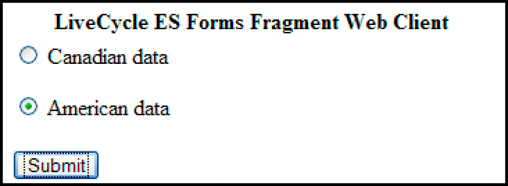
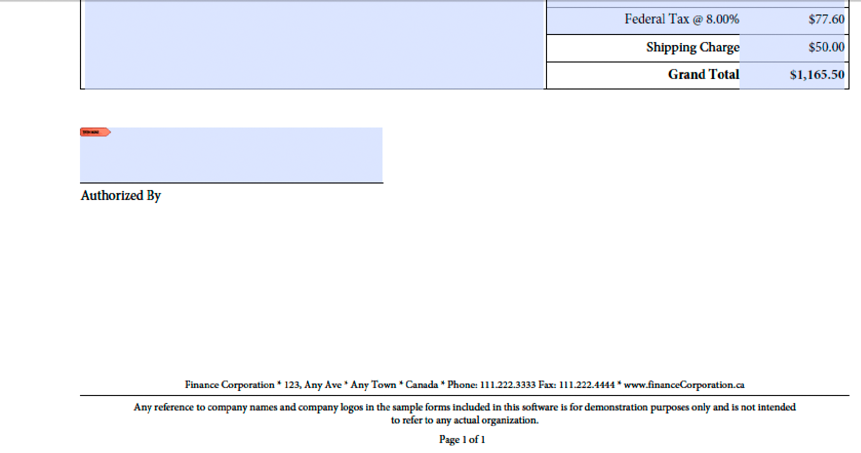

# Forms을 렌더링하는 웹 애플리케이션 만들기 {#creating-web-applications-thatrenders-forms}

**이 문서의 샘플 및 예제는 JEE 환경의 AEM Forms에 대해서만 적용됩니다.**

## Forms을 렌더링하는 웹 애플리케이션 만들기 {#creating-web-applications-that-renders-forms}

Java 서블릿을 사용하여 Forms 서비스를 호출하고 양식을 렌더링하는 웹 기반 애플리케이션을 만들 수 있습니다. Java™ 서블릿을 사용하는 장점은 프로세스의 반환 값을 클라이언트 웹 브라우저에 작성할 수 있다는 것입니다. 즉, Java 서블릿을 양식을 반환하는 Forms 서비스와 클라이언트 웹 브라우저 간의 링크로 사용할 수 있습니다.

>[!NOTE]
>
>이 섹션에서는 Forms 서비스를 호출하고 조각을 기반으로 양식을 렌더링하는 Java 서블릿을 사용하는 웹 기반 애플리케이션을 만드는 방법에 대해 설명합니다. (참조: [조각을 기반으로 Forms 렌더링](/help/forms/developing/rendering-forms-based-fragments.md).)

Java 서블릿을 사용하여 고객이 데이터를 보고 양식에 입력할 수 있도록 클라이언트 웹 브라우저에 양식을 작성할 수 있습니다. 데이터로 양식을 채운 후 웹 사용자는 양식에 있는 제출 단추를 클릭하여 정보를 다시 Java 서블릿으로 보내어 데이터를 검색하고 처리할 수 있습니다. 예를 들어 데이터를 다른 프로세스로 보낼 수 있습니다.

이 섹션에서는 다음 그림과 같이 사용자가 미국 기반 양식 데이터 또는 캐나다 기반 양식 데이터를 선택할 수 있는 웹 기반 응용 프로그램을 만드는 방법에 대해 설명합니다.



렌더링되는 양식은 조각을 기반으로 하는 양식입니다. 즉, 사용자가 미국 데이터를 선택하면 반환된 양식은 미국 데이터를 기반으로 하는 조각을 사용합니다. 예를들어 폼의 바닥글에는 다음 그림과 같이 미국 주소가 들어 있습니다.


마찬가지로 사용자가 캐나다 데이터를 선택하면 다음 그림과 같이 반환된 양식에 캐나다 주소가 포함됩니다.



>[!NOTE]
>
>조각을 기반으로 양식 디자인을 만드는 방법에 대한 자세한 내용은 [Forms 디자이너](https://www.adobe.com/go/learn_aemforms_designer_63).

**샘플 파일**

이 섹션에서는 다음 위치에 있을 수 있는 샘플 파일을 사용합니다.

&lt;*Forms Designer 설치 디렉터리*>/Samples/Forms/Purchase Order/Form Fragments

여기서 &lt;*설치 디렉토리*> 는 설치 경로입니다. 클라이언트 응용 프로그램을 위해 이 설치 위치에서 Dynamic.xdp 파일을 복사하고 이름이 인 Forms 응용 프로그램에 배포했습니다. *Applications/FormsApplication*. 구매 주문 Dynamic.xdp 파일은 FormsFolder라는 폴더에 배치됩니다. 마찬가지로 조각은 다음 그림과 같이 Fragments라는 폴더에 배치됩니다.


구매 주문 Dynamic.xdp 양식 디자인에 액세스하려면 다음을 지정합니다 `Applications/FormsApplication/1.0/FormsFolder/Purchase Order Dynamic.xdp` 양식 이름으로(에 전달된 첫 번째 매개 변수) `renderPDFForm` 방법) 및 `repository:///` 컨텐츠 루트 URI 값으로.

웹 응용 프로그램에서 사용하는 XML 데이터 파일이 데이터 폴더에서 로 이동되었습니다. `C:\Adobe`(AEM Forms을 호스팅하는 J2EE 애플리케이션 서버에 속하는 파일 시스템). 파일 이름은 Purchase Order입니다 *Canada.xml* 및 구매 주문 *US.xml*.

>[!NOTE]
>
>Workbench를 사용하여 Forms 애플리케이션을 만드는 방법에 대한 자세한 내용은 다음을 참조하십시오. [Workbench 도움말](https://www.adobe.com/go/learn_aemforms_workbench_63).

### 단계 요약 {#summary-of-steps}

조각을 기반으로 양식을 렌더링하는 웹 기반 응용 프로그램을 만들려면 다음 단계를 수행하십시오.

1. 웹 프로젝트를 만듭니다.
1. Java 서블릿을 나타내는 Java 애플리케이션 논리를 생성합니다.
1. 웹 응용 프로그램의 웹 페이지를 만듭니다.
1. 웹 응용 프로그램을 WAR 파일로 패키지합니다.
1. J2EE 응용 프로그램 서버에 WAR 파일을 배포합니다.
1. 웹 애플리케이션을 테스트합니다.

>[!NOTE]
>
>이러한 단계 중 일부는 AEM Forms이 배포되는 J2EE 애플리케이션에 따라 다릅니다. 예를 들어 WAR 파일을 배포하는 데 사용하는 방법은 사용 중인 J2EE 응용 프로그램 서버에 따라 다릅니다. 이 섹션에서는 AEM Forms이 JBoss®에 배포되었다고 가정합니다.

### 웹 프로젝트 만들기 {#creating-a-web-project}

Forms 서비스를 호출할 수 있는 Java 서블릿이 포함된 웹 응용 프로그램을 만드는 첫 번째 단계는 웹 프로젝트를 만드는 것입니다. 이 문서가 기반으로 하는 Java IDE는 Eclipse 3.3입니다. Eclipse IDE를 사용하여 웹 프로젝트를 만들고 필요한 JAR 파일을 프로젝트에 추가합니다. 마지막으로 다음과 같은 HTML 페이지를 추가합니다. *index.html* 프로젝트에 Java 서블릿을 추가합니다.

다음 목록은 웹 프로젝트에 추가해야 하는 JAR 파일을 지정합니다.

* adobe-forms-client.jar
* adobe-livecycle-client.jar
* adobe-usermanager-client.jar
* adobe-utilities.jar

이러한 JAR 파일의 위치는 [AEM Forms Java 라이브러리 파일 포함](/help/forms/developing/invoking-aem-forms-using-java.md#including-aem-forms-java-library-files).

**웹 프로젝트를 만들려면 다음 작업을 수행하십시오.**

1. Eclipse를 시작하고 **파일** >  **새 프로젝트**.
1. 다음에서 **새 프로젝트** 대화 상자에서 **웹** > **동적 웹 프로젝트**.
1. 유형 `FragmentsWebApplication` 을(를) 클릭하여 프로젝트의 이름을 확인한 다음 **완료**.

**프로젝트에 필요한 JAR 파일을 추가하려면 다음을 수행합니다.**

1. 프로젝트 탐색기 창에서 마우스 오른쪽 단추 클릭 `FragmentsWebApplication` 프로젝트 및 선택 **속성**.
1. 클릭 **Java 빌드 경로** 을(를) 클릭하고 **라이브러리** 탭.
1. 다음을 클릭합니다. **외부 JAR 추가** 버튼을 클릭하고 포함할 JAR 파일을 찾습니다.

**프로젝트에 Java 서블릿을 추가하려면 다음 작업을 수행하십시오.**

1. 프로젝트 탐색기 창에서 마우스 오른쪽 단추 클릭 `FragmentsWebApplication` 프로젝트 및 선택 **신규** >  **기타**.
1. 확장 **웹** 폴더, 선택 **서블릿**&#x200B;을 클릭한 다음 을 클릭합니다 **다음**.
1. Create Servlet 대화 상자에서 `RenderFormFragment` 서블릿 이름을 보려면 을(를) 클릭하십시오. **완료**.

**프로젝트에 HTML 페이지를 추가하려면 다음 작업을 수행하십시오.**

1. 프로젝트 탐색기 창에서 마우스 오른쪽 단추 클릭 `FragmentsWebApplication` 프로젝트 및 선택 **신규** > **기타**.
1. 확장 **웹** 폴더, 선택 **HTML**, 및 클릭 **다음**.
1. 새 HTML 대화 상자에서 `index.html` 을 클릭하여 파일 이름을 확인한 다음 **완료**.

>[!NOTE]
>
>를 호출하는 HTML 페이지 생성에 대한 자세한 내용은 `RenderFormFragment` Java 서블릿, 참조 [웹 페이지 만들기](/help/forms/developing/rendering-forms.md#creating-the-web-page).

### 서블릿에 대한 Java 애플리케이션 논리 생성 {#creating-java-application-logic-for-the-servlet}

Java 서블릿 내에서 Forms 서비스를 호출하는 Java 애플리케이션 논리를 생성합니다. 다음 코드는 의 구문을 보여줍니다. `RenderFormFragment` Java 서블릿:

```java
     public class RenderFormFragment extends HttpServlet implements Servlet {
         public void doGet(HttpServletRequest req, HttpServletResponse resp
         throws ServletException, IOException {
         doPost(req,resp);
 
         }
         public void doPost(HttpServletRequest req, HttpServletResponse resp
         throws ServletException, IOException {
             //Add code here to invoke the Forms service
             }
```

일반적으로 Java 서블릿 내에 클라이언트 코드를 배치하지는 않습니다. `doGet` 또는 `doPost` 메서드를 사용합니다. 더 나은 프로그래밍 방법은 이 코드를 별도의 클래스 내에 배치하고 내에서 클래스를 인스턴스화하는 것입니다. `doPost` 방법(또는 `doGet` 메서드)를 클릭하고 적절한 메서드를 호출하십시오. 그러나 코드 간결성을 위해 이 섹션의 코드 예는 최소한으로 유지되며 코드 예는 `doPost` 메서드를 사용합니다.

Forms 서비스 API를 사용하여 조각을 기반으로 양식을 렌더링하려면 다음 작업을 수행하십시오.

1. Java 프로젝트의 클래스 경로에 adobe-forms-client.jar과 같은 클라이언트 JAR 파일을 포함합니다. 이러한 파일의 위치에 대한 자세한 내용은 [AEM Forms Java 라이브러리 파일 포함](/help/forms/developing/invoking-aem-forms-using-java.md#including-aem-forms-java-library-files).
1. HTML 양식에서 제출된 라디오 버튼의 값을 검색하고 미국 데이터를 사용할지 캐나다 데이터를 사용할지 지정합니다. American 이 제출되면 `com.adobe.idp.Document` 에 데이터를 저장하는 *구매 주문 US.xml*. 마찬가지로 캐나다인이면 다음을 생성합니다. `com.adobe.idp.Document` 에 데이터를 저장하는 *구매 주문 Canada.xml* 파일.
1. 만들기 `ServiceClientFactory` 연결 속성을 포함하는 개체입니다. (참조: [연결 속성 설정](/help/forms/developing/invoking-aem-forms-using-java.md#setting-connection-properties).)
1. 만들기 `FormsServiceClient` 개체를 생성자를 사용하고 `ServiceClientFactory` 개체.
1. 만들기 `URLSpec` 생성자를 사용하여 URI 값을 저장하는 개체입니다.
1. 호출 `URLSpec` 개체 `setApplicationWebRoot` 메서드에서 응용 프로그램의 웹 루트를 나타내는 문자열 값을 전달합니다.
1. 호출 `URLSpec` 개체 `setContentRootURI` 컨텐츠 루트 URI 값을 지정하는 문자열 값을 전달합니다. 양식 디자인과 조각이 컨텐츠 루트 URI에 있는지 확인합니다. 그렇지 않으면 Forms 서비스에서 예외가 발생합니다. AEM Forms 저장소를 참조하려면 다음을 지정합니다 `repository://`.
1. 호출 `URLSpec` 개체 `setTargetURL` 메서드, 대상 URL 값을 지정하는 문자열 값을 양식 데이터가 게시되는 위치에 전달합니다. 양식 디자인에서 대상 URL을 정의하는 경우 빈 문자열을 전달할 수 있습니다. 계산을 수행하기 위해 양식을 전송할 URL을 지정할 수도 있습니다.
1. 호출 `FormsServiceClient` 개체 `renderPDFForm` 메서드를 실행하고 다음 값을 전달합니다.

   * 파일 이름 확장명을 포함하여 양식 디자인 이름을 지정하는 문자열 값입니다.
   * A `com.adobe.idp.Document` 양식과 병합할 데이터가 포함된 개체(2단계에서 작성).
   * A `PDFFormRenderSpec` 런타임 옵션을 저장하는 개체입니다. 자세한 내용은 [AEM Forms API 참조](https://www.adobe.com/go/learn_aemforms_javadocs_63_en).
   * A `URLSpec` Forms 서비스에서 조각을 기반으로 양식을 렌더링하는 데 필요한 URI 값을 포함하는 개체입니다.
   * A `java.util.HashMap` 첨부 파일을 저장하는 객체입니다. 이는 선택적 매개 변수이며 다음을 지정할 수 있습니다 `null` 양식에 파일을 첨부하지 않으려면.

   다음 `renderPDFForm` 메서드가 을 반환합니다. `FormsResult` 클라이언트 웹 브라우저에 작성해야 하는 양식 데이터 스트림이 포함된 개체입니다.

1. 만들기 `com.adobe.idp.Document` 를 호출하여 개체 `FormsResult` 개체 &#39;s `getOutputContent` 메서드를 사용합니다.
1. 의 콘텐츠 유형 가져오기 `com.adobe.idp.Document` 개체 `getContentType` 메서드를 사용합니다.
1. 설정 `javax.servlet.http.HttpServletResponse` 를 호출하여 객체의 콘텐츠 유형 `setContentType` 메서드와 의 콘텐츠 유형 전달 `com.adobe.idp.Document` 개체.
1. 만들기 `javax.servlet.ServletOutputStream` 개체를 사용하여 클라이언트 웹 브라우저에서 `javax.servlet.http.HttpServletResponse` 개체 `getOutputStream` 메서드를 사용합니다.
1. 만들기 `java.io.InputStream` 를 호출하여 개체 `com.adobe.idp.Document` 개체 `getInputStream` 메서드를 사용합니다.
1. 바이트 배열을 만들어 양식 데이터 스트림으로 채웁니다. `InputStream` 개체 `read`메서드에서 바이트 배열을 인수로 전달합니다.
1. 호출 `javax.servlet.ServletOutputStream` 개체 `write` 클라이언트 웹 브라우저에 양식 데이터 스트림을 전송하는 방법입니다. 바이트 배열을 로 전달 `write` 메서드를 사용합니다.

다음 코드 예는 Forms 서비스를 호출하고 조각을 기반으로 양식을 렌더링하는 Java 서블릿을 나타냅니다.

```java
 /*
     * This Java Quick Start uses the following JAR files
     * 1. adobe-forms-client.jar
     * 2. adobe-livecycle-client.jar
     * 3. adobe-usermanager-client.jar
     *
     * (Because Forms quick starts are implemented as Java servlets, it is
     * not necessary to include J2EE specific JAR files - the Java project
     * that contains this quick start is exported as a WAR file which
     * is deployed to the J2EE application server)
     *
     * These JAR files are in the following path:
     * <install directory>/sdk/client-libs
     *
     * For complete details about the location of these JAR files,
     * see "Including AEM Forms library files" in Programming with AEM forms
     */
 import java.io.File;
 import java.io.FileInputStream;
 import java.io.IOException;
 import java.io.PrintWriter;
 
 import javax.servlet.Servlet;
 import javax.servlet.ServletException;
 import javax.servlet.ServletOutputStream;
 import javax.servlet.http.HttpServlet;
 import javax.servlet.http.HttpServletRequest;
 import javax.servlet.http.HttpServletResponse;
 import com.adobe.livecycle.formsservice.client.*;
 import java.util.*;
 import java.io.InputStream;
 import java.net.URL;
 
 import com.adobe.idp.Document;
 import com.adobe.idp.dsc.clientsdk.ServiceClientFactory;
 import com.adobe.idp.dsc.clientsdk.ServiceClientFactoryProperties;
 
 public class RenderFormFragment extends HttpServlet implements Servlet {
 
     public void doGet(HttpServletRequest req, HttpServletResponse resp)
         throws ServletException, IOException {
             doPost(req,resp);
 
     }
     public void doPost(HttpServletRequest req, HttpServletResponse resp)
     throws ServletException, IOException {
 
 
 
         try{
             //Set connection properties required to invoke AEM Forms
             Properties connectionProps = new Properties();
             connectionProps.setProperty(ServiceClientFactoryProperties.DSC_DEFAULT_SOAP_ENDPOINT, "https://'[server]:[port]'");
             connectionProps.setProperty(ServiceClientFactoryProperties.DSC_TRANSPORT_PROTOCOL,ServiceClientFactoryProperties.DSC_SOAP_PROTOCOL);
             connectionProps.setProperty(ServiceClientFactoryProperties.DSC_SERVER_TYPE, "JBoss");
             connectionProps.setProperty(ServiceClientFactoryProperties.DSC_CREDENTIAL_USERNAME, "administrator");
             connectionProps.setProperty(ServiceClientFactoryProperties.DSC_CREDENTIAL_PASSWORD, "password");
 
             //Get the value of selected radio button
             String radioValue = req.getParameter("radio");
 
             //Create an Document object to store form data
             Document oInputData = null;
 
             //The value of the radio button determines the form data to use
             //which determines which fragments used in the form
             if (radioValue.compareTo("AMERICAN") == 0)            {
                 FileInputStream myData = new FileInputStream("C:\\Adobe\Purchase Order US.xml");
                 oInputData = new Document(myData);
             }
             else if (radioValue.compareTo("CANADIAN") == 0)            {
                 FileInputStream myData = new FileInputStream("C:\\Adobe\Purchase Order Canada.xml");
                 oInputData = new Document(myData);
             }
 
             //Create a ServiceClientFactory object
             ServiceClientFactory myFactory = ServiceClientFactory.createInstance(connectionProps);
 
             //Create a FormsServiceClient object
             FormsServiceClient formsClient = new FormsServiceClient(myFactory);
 
             //Set the parameter values for the renderPDFForm method
             String formName = "Applications/FormsApplication/1.0/FormsFolder/Purchase Order Dynamic.xdp";
 
             //Cache the PDF form
             PDFFormRenderSpec pdfFormRenderSpec = new PDFFormRenderSpec();
             pdfFormRenderSpec.setCacheEnabled(new Boolean(true));
 
             //Specify URI values that are required to render a form
             //design based on fragments
             URLSpec uriValues = new URLSpec();
             uriValues.setApplicationWebRoot("https://'[server]:[port]'/RenderFormFragment");
             uriValues.setContentRootURI("repository:///");
             uriValues.setTargetURL("https://'[server]:[port]'/FormsServiceClientApp/HandleData");
 
             //Invoke the renderPDFForm method and write the
             //results to a client web browser
             FormsResult formOut = formsClient.renderPDFForm(
                         formName,               //formQuery
                         oInputData,             //inDataDoc
                         pdfFormRenderSpec,      //PDFFormRenderSpec
                         uriValues,                //urlSpec
                         null                    //attachments
                         );
 
             //Create a Document object that stores form data
             Document myData = formOut.getOutputContent();
 
             //Get the content type of the response and
             //set the HttpServletResponse object’s content type
             String contentType = myData.getContentType();
             resp.setContentType(contentType);
 
             //Create a ServletOutputStream object
             ServletOutputStream oOutput = resp.getOutputStream();
 
             //Create an InputStream object
             InputStream inputStream = myData.getInputStream();
 
             //Write the data stream to the web browser
             byte[] data = new byte[4096];
             int bytesRead = 0;
             while ((bytesRead = inputStream.read(data)) > 0)
             {
                 oOutput.write(data, 0, bytesRead);
             }
 
         }catch (Exception e) {
              System.out.println("The following exception occurred: "+e.getMessage());
       }
     }
 }
```

### 웹 페이지 만들기 {#creating-the-web-page}

index.html 웹 페이지는 Java 서블릿에 대한 진입점을 제공하고 Forms 서비스를 호출합니다. 이 웹 페이지는 두 개의 라디오 버튼과 제출 버튼을 포함하는 기본 HTML 양식입니다. 라디오 버튼의 이름은 라디오입니다. 사용자가 제출 단추를 클릭하면 양식 데이터가 `RenderFormFragment` Java 서블릿.

Java 서블릿은 다음 Java 코드를 사용하여 HTML 페이지에서 게시된 데이터를 캡처합니다.

```java
             Document oInputData = null;
 
             //Get the value of selected radio button
             String radioValue = req.getParameter("radio");
 
             //The value of the radio button determines the form data to use
             //which determines which fragments used in the form
             if (radioValue.compareTo("AMERICAN") == 0)            {
                 FileInputStream myData = new FileInputStream("C:\\Adobe\Purchase Order US.xml");
                 oInputData = new Document(myData);
             }
             else if (radioValue.compareTo("CANADIAN") == 0)            {
                 FileInputStream myData = new FileInputStream("C:\\Adobe\Purchase Order Canada.xml");
                 oInputData = new Document(myData);
             }
```

다음 HTML 코드는 개발 환경을 설정하는 동안 생성된 index.html 파일에 있습니다. (참조: [웹 프로젝트 만들기](/help/forms/developing/rendering-forms.md#creating-a-web-project).)

```xml
 <!DOCTYPE html PUBLIC "-//W3C//DTD XHTML 1.0 Transitional//EN" "https://www.w3.org/TR/xhtml1/DTD/xhtml1-transitional.dtd">
 <html xmlns="https://www.w3.org/1999/xhtml">
 <head>
 <meta http-equiv="Content-Type" content="text/html; charset=utf-8" />
 <title>Untitled Document</title>
 </head>
 
 <body>
 <form name="myform" action="https://'[server]:[port]'/FragmentsWebApplication/RenderFormFragment" method="post">
      <table>
      <tr>
        <th>Forms Fragment Web Client</th>
      </tr>
      <tr>
        <td>
          <label>
          <input type="radio" name="radio" id="radio_Data" value="CANADIAN" />
          Canadian data<br />
          </label>
          <p>
            <label>
            <input type="radio" name="radio" id="radio_Data" value="AMERICAN" checked/>
            American data</label>
          </p>
        </td>
      </tr>
      <tr>
      <td>
        <label>
          <input type="submit" name="button_Submit" id="button_Submit" value="Submit" />
            </label>
            </td>
         </tr>
        </table>
      </form>
 </body>
 </html>
```

### 웹 애플리케이션 패키징 {#packaging-the-web-application}

Forms 서비스를 호출하는 Java 서블릿을 배포하려면 웹 애플리케이션을 WAR 파일로 패키징합니다. adobe-livecycle-client.jar 및 adobe-forms-client.jar와 같이 구성 요소의 비즈니스 논리가 종속되는 외부 JAR 파일도 WAR 파일에 포함되어야 합니다.

**웹 응용 프로그램을 WAR 파일로 패키지하려면 다음을 수행합니다.**

1. 다음에서 **프로젝트 탐색기** 창에서 마우스 오른쪽 단추 클릭 `FragmentsWebApplication` 프로젝트 및 선택 **내보내기** > **WAR 파일**.
1. 다음에서 **웹 모듈** 텍스트 상자, 문자 `FragmentsWebApplication` Java 프로젝트의 이름입니다.
1. 다음에서 **대상** 텍스트 상자, 문자 `FragmentsWebApplication.war`**대상:**&#x200B;파일 이름을 지정하고 WAR 파일의 위치를 지정한 다음 [마침]을 클릭합니다.

### J2EE 응용 프로그램 서버에 WAR 파일 배포 {#deploying-the-war-file-to-the-j2ee-application-server}

AEM Forms이 배포된 J2EE 응용 프로그램 서버에 WAR 파일을 배포할 수 있습니다. WAR 파일이 배포된 후 웹 브라우저를 사용하여 HTML 웹 페이지에 액세스할 수 있습니다.

**WAR 파일을 J2EE 응용 프로그램 서버에 배포하려면 다음을 수행합니다.**

* 내보내기 경로에서 WAR 파일 복사 `[Forms Install]\Adobe\Adobe Experience Manager Forms\jboss\server\all\deploy`.

### 웹 애플리케이션 테스트 {#testing-your-web-application}

웹 응용 프로그램을 배포한 후 웹 브라우저를 사용하여 테스트할 수 있습니다. AEM Forms을 호스팅하는 동일한 컴퓨터를 사용하고 있다고 가정할 경우 다음 URL을 지정할 수 있습니다.

* http://localhost:8080/FragmentsWebApplication/index.html

  라디오 단추를 선택하고 [제출] 단추를 클릭합니다. 조각을 기반으로 하는 양식이 웹 브라우저에 나타납니다. 문제가 발생하면 J2EE 애플리케이션 서버의 로그 파일을 참조하십시오.
