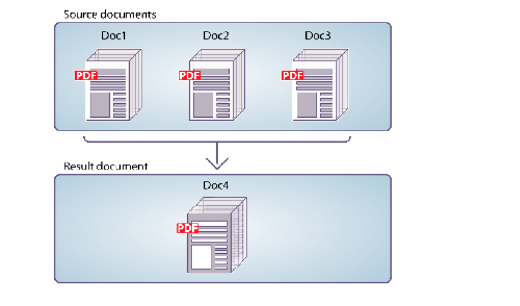

# 프로그래밍 방식으로 PDF 문서 어셈블 {#programmatically-assembling-pdf-documents}

**이 문서의 샘플과 예제는 JEE 환경의 AEM Forms에 대해서만 적용됩니다.**

어셈블러 서비스 API를 사용하여 여러 PDF 문서를 단일 PDF 문서로 어셈블할 수 있습니다. 다음 그림은 세 개의 PDF 문서가 하나의 PDF 문서로 병합되는 모습을 보여 줍니다.



두 개 이상의 PDF 문서를 단일 PDF 문서로 어셈블하려면 DDX 문서가 필요합니다. DDX 문서에서는 어셈블러 서비스가 생성하는 PDF 문서에 대해 설명합니다. 즉, DDX 문서는 어셈블러 서비스에 수행할 작업을 지시합니다.

이러한 논의를 위해 다음과 같은 DDX 문서가 사용된다고 가정하자.

```xml
 <?xml version="1.0" encoding="UTF-8"?>
 <DDX xmlns="https://ns.adobe.com/DDX/1.0/">
     <PDF result="out.pdf">
         <PDF source="map.pdf" />
         <PDF source="directions.pdf" />
     </PDF>
 </DDX>
```

이 DDX 문서는 *map.pdf* 및 *directions.pdf*&#x200B;라는 두 개의 PDF 문서를 하나의 PDF 문서로 병합합니다.

>[!NOTE]
>
>PDF 문서를 디스어셈블하는 DDX 문서를 보려면 [프로그래밍 방식으로 PDF 문서 디스어셈블](/help/forms/developing/programmatically-disassembling-pdf-documents.md#programmatically-disassembling-pdf-documents)을 참조하십시오.

>[!NOTE]
>
>어셈블러 서비스에 대한 자세한 내용은 [AEM Forms용 서비스 참조](https://www.adobe.com/go/learn_aemforms_services_63)를 참조하십시오.

>[!NOTE]
>
>DDX 문서에 대한 자세한 내용은 [어셈블러 서비스 및 DDX 참조](https://www.adobe.com/go/learn_aemforms_ddx_63)를 참조하십시오.

## 웹 서비스를 사용하여 어셈블러 서비스를 호출할 때 고려 사항 {#considerations-when-invoking-assembler-service-using-web-services}

대용량 문서를 어셈블하는 동안 머리글과 바닥글을 추가하면 `OutOfMemory` 오류가 발생하여 파일이 어셈블되지 않을 수 있습니다. 이 문제가 발생할 가능성을 줄이려면 다음 예제와 같이 DDX 문서에 `DDXProcessorSetting` 요소를 추가하십시오.

`<DDXProcessorSetting name="checkpoint" value="2000" />`

이 요소를 `DDX` 요소의 자식 또는 `PDF result` 요소의 자식으로 추가할 수 있습니다. 이 설정의 기본값은 0(영)으로, 체크포인트를 해제하고 DDX는 `DDXProcessorSetting` 요소가 없는 것처럼 동작합니다. `OutOfMemory` 오류가 발생한 경우 값을 일반적으로 500에서 5000 사이의 정수로 설정해야 할 수 있습니다. 체크포인트 값이 작을수록 체크포인트가 더 자주 발생합니다.

## 단계 요약 {#summary-of-steps}

여러 PDF 문서에서 단일 PDF 문서를 어셈블하려면 다음 작업을 수행합니다.

1. 프로젝트 파일을 포함합니다.
1. PDF 어셈블러 클라이언트를 만듭니다.
1. 기존 DDX 문서를 참조합니다.
1. 입력 PDF 문서 참조.
1. 런타임 옵션을 설정합니다.
1. 입력 PDF 문서를 어셈블합니다.
1. 결과 추출

**프로젝트 파일 포함**

개발 프로젝트에 필요한 파일을 포함합니다. Java를 사용하여 클라이언트 응용 프로그램을 만드는 경우 필요한 JAR 파일을 포함합니다. 웹 서비스를 사용하는 경우 프록시 파일을 포함해야 합니다.

프로젝트의 클래스 경로에 다음 JAR 파일을 추가해야 합니다.

* adobe-livecycle-client.jar
* adobe-usermanager-client.jar
* adobe-assembler-client.jar
* adobe-utilities.jar (AEM Forms이 JBoss에 배포된 경우 필수)
* jbossall-client.jar(AEM Forms이 JBoss에 배포된 경우 필수)

AEM Forms이 JBoss 이외의 지원되는 J2EE 애플리케이션 서버에 배포된 경우 adobe-utilities.jar 및 jbossall-client.jar 파일을 AEM Forms이 배포된 J2EE 애플리케이션 서버에 관련된 JAR 파일로 교체해야 합니다.

**PDF 어셈블러 클라이언트 만들기**

어셈블러 작업을 프로그래밍 방식으로 수행하려면 먼저 어셈블러 클라이언트를 만들어야 합니다.

**기존 DDX 문서 참조**

PDF 문서를 어셈블하려면 DDX 문서를 참조해야 합니다. 예를 들어 이 섹션에 소개된 DDX 문서를 생각해 보십시오. 이 DDX 문서는 어셈블러 서비스에 두 개의 PDF 문서를 하나의 PDF 문서로 병합하도록 지시합니다.

**입력 PDF 문서 참조**

어셈블러 서비스에 전달할 입력 PDF 문서를 참조합니다. 예를 들어 맵 및 방향이라는 두 개의 입력 PDF 문서를 전달하려면 해당 PDF 파일을 전달해야 합니다.

map.pdf 파일과 directions.pdf 파일은 모두 컬렉션 개체에 배치해야 합니다. 키 이름은 DDX 문서에 있는 PDF 소스 속성 값과 일치해야 합니다. DDX 문서의 키와 소스 속성이 일치하는 경우 PDF 파일의 이름이 무엇이든 상관없습니다.

>[!NOTE]
>
>`invokeDDX` 작업을 호출하면 컬렉션 개체가 포함된 `AssemblerResult` 개체가 반환됩니다. 이 작업은 두 개 이상의 입력 PDF 문서를 어셈블러 서비스에 전달할 때 사용됩니다. 그러나 어셈블러 서비스에 입력 PDF을 하나만 전달하고 반환 문서는 하나만 필요한 경우 `invokeOneDocument` 작업을 호출하십시오. 이 작업을 호출하면 단일 문서가 반환됩니다. 이 작업 사용에 대한 자세한 내용은 [암호화된 PDF 문서 어셈블](/help/forms/developing/assembling-encrypted-pdf-documents.md#assembling-encrypted-pdf-documents)을 참조하십시오.

**런타임 옵션 설정**

작업을 수행하는 동안 어셈블러 서비스의 동작을 제어하는 런타임 옵션을 설정할 수 있습니다. 예를 들어 오류가 발생하는 경우 어셈블러 서비스에서 작업 처리를 계속하도록 지시하는 옵션을 설정할 수 있습니다. 설정할 수 있는 런타임 옵션에 대한 자세한 내용은 [AEM Forms API 참조](https://www.adobe.com/go/learn_aemforms_javadocs_63_en)의 `AssemblerOptionSpec` 클래스 참조를 참조하십시오.

**입력 PDF 문서를 어셈블합니다**

서비스 클라이언트를 만들고, DDX 파일을 참조하고, 입력 PDF 문서를 저장하는 컬렉션 개체를 만들고, 런타임 옵션을 설정한 후 DDX 작업을 호출할 수 있습니다. 이 섹션에 지정된 DDX 문서를 사용하는 경우 map.pdf 및 direction.pdf 파일이 하나의 PDF 문서로 병합됩니다.

**결과 추출**

어셈블러 서비스에서 `AssemblerResult` 개체에서 가져올 수 있으며 작업 결과가 포함된 `java.util.Map` 개체를 반환합니다. 반환된 `java.util.Map` 개체에는 결과 문서와 모든 예외가 포함됩니다.

다음 표에서는 반환된 `java.util.Map` 개체에 포함될 수 있는 일부 키 값과 개체 형식을 요약합니다.

<table>
 <thead>
  <tr>
   <th><p>키 값</p></th>
   <th><p>오브젝트 유형</p></th>
   <th><p>설명</p></th>
  </tr>
 </thead>
 <tbody>
  <tr>
   <td><p><code><i>documentName</i></code></p></td>
   <td><p><code>com.adobe.idp.Document</code></p></td>
   <td><p>DDX 결과 요소에 지정된 결과 문서를 포함합니다.</p></td>
  </tr>
  <tr>
   <td><p><code><i>documentName</i></code></p></td>
   <td><p><code>Exception</code></p></td>
   <td><p>문서에 대한 예외를 포함합니다.</p></td>
  </tr>
  <tr>
   <td><p><code>OutputMapConstants.LOG_NAME</code></p></td>
   <td><p><code>com.adobe.idp.Documen</code></p></td>
   <td><p>작업 로그를 포함합니다.</p></td>
  </tr>
 </tbody>
</table>

**추가 참조**

[AEM Forms Java 라이브러리 파일 포함](/help/forms/developing/invoking-aem-forms-using-java.md#including-aem-forms-java-library-files)

[연결 속성 설정](/help/forms/developing/invoking-aem-forms-using-java.md#setting-connection-properties)

[프로그래밍 방식으로 PDF 문서 디스어셈블](/help/forms/developing/programmatically-disassembling-pdf-documents.md#programmatically-disassembling-pdf-documents)

## Java API를 사용하여 PDF 문서 어셈블 {#assemble-pdf-documents-using-the-java-api}

어셈블러 서비스 API(Java)를 사용하여 PDF 문서를 어셈블합니다.

1. 프로젝트 파일을 포함합니다.

   Java 프로젝트의 클래스 경로에 adobe-assembler-client.jar과 같은 클라이언트 JAR 파일을 포함합니다.

1. PDF 어셈블러 클라이언트를 만듭니다.

   * 연결 속성을 포함하는 `ServiceClientFactory` 개체를 만듭니다.
   * 생성자를 사용하고 `ServiceClientFactory` 개체를 전달하여 `AssemblerServiceClient` 개체를 만듭니다.

1. 기존 DDX 문서를 참조합니다.

   * 생성자를 사용하고 DDX 파일의 위치를 지정하는 문자열 값을 전달하여 DDX 문서를 나타내는 `java.io.FileInputStream` 개체를 만듭니다.
   * 생성자를 사용하고 `java.io.FileInputStream` 개체를 전달하여 `com.adobe.idp.Document` 개체를 만듭니다.

1. 입력 PDF 문서 참조.

   * `HashMap` 생성자를 사용하여 입력 PDF 문서를 저장하는 데 사용되는 `java.util.Map` 개체를 만듭니다.
   * 각 입력 PDF 문서에 대해 해당 생성자를 사용하고 입력 PDF 문서의 위치를 전달하여 `java.io.FileInputStream` 개체를 만듭니다.
   * 각 입력 PDF 문서에 대해 `com.adobe.idp.Document` 개체를 만들고 PDF 문서가 포함된 `java.io.FileInputStream` 개체를 전달합니다.
   * 각 입력 문서에 대해 해당 `put` 메서드를 호출하고 다음 인수를 전달하여 `java.util.Map` 개체에 항목을 추가합니다.

      * 키 이름을 나타내는 문자열 값입니다. 이 값은 DDX 문서에 지정된 PDF 원본 요소의 값과 일치해야 합니다.
      * 원본 PDF 문서가 포함된 `com.adobe.idp.Document` 개체(또는 여러 문서를 지정하는 `java.util.List` 개체)입니다.

1. 런타임 옵션을 설정합니다.

   * 생성자를 사용하여 런타임 옵션을 저장하는 `AssemblerOptionSpec` 개체를 만듭니다.
   * `AssemblerOptionSpec` 개체에 속하는 메서드를 호출하여 비즈니스 요구 사항을 충족하도록 런타임 옵션을 설정하십시오. 예를 들어 오류가 발생할 때 어셈블러 서비스에서 작업 처리를 계속하도록 하려면 `AssemblerOptionSpec` 개체의 `setFailOnError` 메서드를 호출하고 `false`을(를) 전달합니다.

1. 입력 PDF 문서를 어셈블합니다.

   `AssemblerServiceClient` 개체의 `invokeDDX` 메서드를 호출하고 다음 필수 값을 전달하십시오.

   * 사용할 DDX 문서를 나타내는 `com.adobe.idp.Document` 개체
   * 어셈블할 입력 PDF 파일이 포함된 `java.util.Map` 개체
   * 기본 글꼴 및 작업 로그 수준을 포함하여 런타임 옵션을 지정하는 `com.adobe.livecycle.assembler.client.AssemblerOptionSpec` 개체

   `invokeDDX` 메서드가 작업 결과와 발생한 모든 예외를 포함하는 `com.adobe.livecycle.assembler.client.AssemblerResult` 개체를 반환합니다.

1. 결과 추출

   새로 만든 PDF 문서를 가져오려면 다음 작업을 수행합니다.

   * `AssemblerResult` 개체의 `getDocuments` 메서드를 호출합니다. `java.util.Map` 개체를 반환합니다.
   * 결과 `com.adobe.idp.Document` 개체가 발견될 때까지 `java.util.Map` 개체를 반복합니다. (DDX 문서에 지정된 PDF 결과 요소를 사용하여 문서를 가져올 수 있습니다.)
   * `com.adobe.idp.Document` 개체의 `copyToFile` 메서드를 호출하여 PDF 문서를 추출하십시오.

   >[!NOTE]
   >
   >`LOG_LEVEL`이(가) 로그를 생성하도록 설정된 경우 `AssemblerResult` 개체의 `getJobLog` 메서드를 사용하여 로그를 추출할 수 있습니다.

**추가 참조**

[빠른 시작(SOAP 모드): Java API를 사용하여 PDF 문서 어셈블](/help/forms/developing/assembler-service-java-api-quick.md#quick-start-soap-mode-assembling-a-pdf-document-using-the-java-api)

[AEM Forms Java 라이브러리 파일 포함](/help/forms/developing/invoking-aem-forms-using-java.md#including-aem-forms-java-library-files)

[연결 속성 설정](/help/forms/developing/invoking-aem-forms-using-java.md#setting-connection-properties)

## 웹 서비스 API를 사용하여 PDF 문서 어셈블 {#assemble-pdf-documents-using-the-web-service-api}

어셈블러 서비스 API(웹 서비스)를 사용하여 PDF 문서를 어셈블합니다.

1. 프로젝트 파일을 포함합니다.

   MTOM을 사용하는 Microsoft .NET 프로젝트를 만듭니다. WSDL 정의 `http://localhost:8080/soap/services/AssemblerService?WSDL&lc_version=9.0.1`을(를) 사용하는지 확인하십시오.

   >[!NOTE]
   >
   >`localhost`을(를) AEM Forms을 호스팅하는 서버의 IP 주소로 바꾸십시오.

1. PDF 어셈블러 클라이언트를 만듭니다.

   * 기본 생성자를 사용하여 `AssemblerServiceClient` 개체를 만듭니다.
   * `System.ServiceModel.EndpointAddress` 생성자를 사용하여 `AssemblerServiceClient.Endpoint.Address` 개체를 만듭니다. WSDL을 지정하는 문자열 값을 AEM Forms 서비스에 전달합니다(예: `http://localhost:8080/soap/services/AssemblerService?blob=mtom`). `lc_version` 특성은 사용할 필요가 없습니다. 이 속성은 서비스 참조를 만들 때 사용됩니다.
   * `AssemblerServiceClient.Endpoint.Binding` 필드의 값을 가져와 `System.ServiceModel.BasicHttpBinding` 개체를 만듭니다. 반환 값을 `BasicHttpBinding`(으)로 캐스팅합니다.
   * `System.ServiceModel.BasicHttpBinding` 개체의 `MessageEncoding` 필드를 `WSMessageEncoding.Mtom`(으)로 설정합니다. 이 값은 MTOM이 사용되도록 합니다.
   * 다음 작업을 수행하여 기본 HTTP 인증을 활성화합니다.

      * `AssemblerServiceClient.ClientCredentials.UserName.UserName` 필드에 AEM Forms 사용자 이름을 지정하십시오.
      * 필드 `AssemblerServiceClient.ClientCredentials.UserName.Password`에 해당 암호 값을 지정하십시오.
      * 상수 값 `HttpClientCredentialType.Basic`을(를) 필드 `BasicHttpBindingSecurity.Transport.ClientCredentialType`에 할당합니다.
      * 상수 값 `BasicHttpSecurityMode.TransportCredentialOnly`을(를) 필드 `BasicHttpBindingSecurity.Security.Mode`에 할당합니다.

1. 기존 DDX 문서를 참조합니다.

   * 해당 생성자를 사용하여 `BLOB` 개체를 만듭니다. `BLOB` 개체는 DDX 문서를 저장하는 데 사용됩니다.
   * 해당 생성자를 호출하고 DDX 문서의 파일 위치와 파일을 열 모드를 나타내는 문자열 값을 전달하여 `System.IO.FileStream` 개체를 만듭니다.
   * `System.IO.FileStream` 개체의 내용을 저장하는 바이트 배열을 만듭니다. `System.IO.FileStream` 개체의 `Length` 속성을 가져와서 바이트 배열의 크기를 결정할 수 있습니다.
   * `System.IO.FileStream` 개체의 `Read` 메서드를 호출하고 바이트 배열, 시작 위치 및 읽을 스트림 길이를 전달하여 바이트 배열을 스트림 데이터로 채웁니다.
   * 해당 `MTOM` 속성을 바이트 배열의 내용으로 할당하여 `BLOB` 개체를 채웁니다.

1. 입력 PDF 문서 참조.

   * 각 입력 PDF 문서에 대해 해당 생성자를 사용하여 `BLOB` 개체를 만듭니다. `BLOB` 개체는 입력 PDF 문서를 저장하는 데 사용됩니다.
   * 해당 생성자를 호출하고 입력 PDF 문서의 파일 위치와 파일을 열 모드를 나타내는 문자열 값을 전달하여 `System.IO.FileStream` 개체를 만듭니다.
   * `System.IO.FileStream` 개체의 내용을 저장하는 바이트 배열을 만듭니다. `System.IO.FileStream` 개체의 `Length` 속성을 가져와서 바이트 배열의 크기를 결정할 수 있습니다.
   * `System.IO.FileStream` 개체의 `Read` 메서드를 호출하여 바이트 배열을 스트림 데이터로 채웁니다. 읽을 바이트 배열, 시작 위치 및 스트림 길이를 전달합니다.
   * 해당 `MTOM` 필드를 바이트 배열의 내용으로 할당하여 `BLOB` 개체를 채웁니다.
   * `MyMapOf_xsd_string_To_xsd_anyType` 개체를 만듭니다. 이 컬렉션 개체는 입력 PDF 문서를 저장하는 데 사용됩니다.
   * 각 입력 PDF 문서에 대해 `MyMapOf_xsd_string_To_xsd_anyType_Item` 개체를 만듭니다. 예를 들어 두 개의 입력 PDF 문서를 사용하는 경우 두 개의 `MyMapOf_xsd_string_To_xsd_anyType_Item` 개체를 만듭니다.
   * `MyMapOf_xsd_string_To_xsd_anyType_Item` 개체의 `key` 필드에 키 이름을 나타내는 문자열 값을 지정하십시오. 이 값은 DDX 문서에 지정된 PDF 원본 요소의 값과 일치해야 합니다. (각 입력 PDF 문서에 대해 이 작업을 수행합니다.)
   * PDF 문서를 저장하는 `BLOB` 개체를 `MyMapOf_xsd_string_To_xsd_anyType_Item` 개체의 `value` 필드에 할당합니다. (각 입력 PDF 문서에 대해 이 작업을 수행합니다.)
   * `MyMapOf_xsd_string_To_xsd_anyType` 개체에 `MyMapOf_xsd_string_To_xsd_anyType_Item` 개체를 추가합니다. `MyMapOf_xsd_string_To_xsd_anyType` 개체의 `Add` 메서드를 호출하고 `MyMapOf_xsd_string_To_xsd_anyType` 개체를 전달하십시오. (각 입력 PDF 문서에 대해 이 작업을 수행합니다.)

1. 런타임 옵션을 설정합니다.

   * 생성자를 사용하여 런타임 옵션을 저장하는 `AssemblerOptionSpec` 개체를 만듭니다.
   * `AssemblerOptionSpec` 개체에 속하는 데이터 멤버에 값을 할당하여 비즈니스 요구 사항에 맞게 런타임 옵션을 설정하십시오. 예를 들어 오류가 발생할 때 어셈블러 서비스에서 작업 처리를 계속하도록 하려면 `AssemblerOptionSpec` 개체의 `failOnError` 데이터 멤버에 `false`을(를) 할당합니다.

1. 입력 PDF 문서를 어셈블합니다.

   `AssemblerServiceClient` 개체의 `invoke` 메서드를 호출하고 다음 값을 전달하십시오.

   * DDX 문서를 나타내는 `BLOB` 개체입니다.
   * 입력 PDF 문서를 포함하는 `mapItem` 배열입니다. 해당 키는 PDF 원본 파일의 이름과 일치해야 하며 해당 값은 해당 파일에 해당하는 `BLOB` 개체여야 합니다.
   * 런타임 옵션을 지정하는 `AssemblerOptionSpec` 개체입니다.

   `invoke` 메서드가 작업 결과와 발생한 모든 예외를 포함하는 `AssemblerResult` 개체를 반환합니다.

1. 결과 추출

   새로 만든 PDF 문서를 가져오려면 다음 작업을 수행합니다.

   * 결과 PDF 문서가 포함된 `Map` 개체인 `AssemblerResult` 개체의 `documents` 필드에 액세스합니다.
   * 결과 문서 이름과 일치하는 키를 찾을 때까지 `Map` 개체를 반복합니다. 그런 다음 해당 배열 멤버의 `value`을(를) `BLOB`(으)로 캐스팅합니다.
   * `BLOB` 개체의 `MTOM` 속성에 액세스하여 PDF 문서를 나타내는 이진 데이터를 추출합니다. PDF 파일에 쓸 수 있는 바이트 배열이 반환됩니다.

   >[!NOTE]
   >
   >`LOG_LEVEL`이(가) 로그를 생성하도록 설정된 경우 `AssemblerResult` 개체의 `jobLog` 데이터 멤버 값을 가져와 로그를 추출할 수 있습니다.

**추가 참조**

[MTOM을 사용하여 AEM Forms 호출](/help/forms/developing/invoking-aem-forms-using-web.md#invoking-aem-forms-using-mtom)
