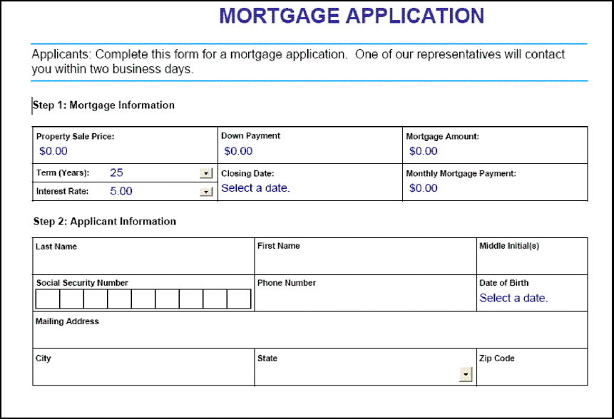

# 대화형 PDF forms 렌더링 중 {#rendering-interactive-pdf-forms}

**이 문서의 샘플과 예는 JEE 환경의 AEM Forms에만 해당됩니다.**

Forms 서비스는 대화형 PDF forms을 클라이언트 장치(일반적으로 웹 브라우저)에 렌더링하여 사용자의 정보를 수집합니다. 대화형 양식이 렌더링되면 사용자는 양식 필드에 데이터를 입력하고 양식에 있는 제출 단추를 클릭하여 정보를 Forms 서비스로 다시 보낼 수 있습니다. 인터랙티브한 PDF 양식을 표시하려면 클라이언트 웹 브라우저를 호스팅하는 컴퓨터에 Adobe Reader 또는 Acrobat을 설치해야 합니다.

>[!NOTE]
>
>Forms 서비스를 사용하여 양식을 렌더링하려면 먼저 양식 디자인을 만듭니다. 일반적으로 양식 디자인은 Designer에서 만들고 XDP 파일로 저장됩니다. 양식 디자인 만들기에 대한 자세한 내용은 [Forms 디자이너](https://www.adobe.com/go/learn_aemforms_designer_63)를 참조하십시오.

**샘플 대출 신청**

Forms 서비스가 대화형 양식을 사용하여 사용자로부터 정보를 수집하는 방법을 보여 주는 샘플 대출 응용 프로그램이 도입되었습니다. 이 응용 프로그램을 사용하면 사용자가 대출을 보호하는 데 필요한 데이터로 양식을 채우고 Forms 서비스에 데이터를 제출할 수 있습니다. 다음 다이어그램은 대출 애플리케이션의 논리 플로우를 보여줍니다.


다음 표에서는 이 다이어그램의 단계를 설명합니다.

<table>
 <thead>
  <tr>
   <th><p>단계</p></th>
   <th><p>설명</p></th>
  </tr>
 </thead>
 <tbody>
  <tr>
   <td><p>1</p></td>
   <td><p><code>GetLoanForm</code> Java 서블릿은 HTML 페이지에서 호출됩니다. </p></td>
  </tr>
  <tr>
   <td><p>2</p></td>
   <td><p><code>GetLoanForm</code> Java 서블릿은 Forms 서비스 클라이언트 API를 사용하여 대출 양식을 클라이언트 웹 브라우저에 렌더링합니다. (Java API</a>를 사용하여 대화형 PDF 양식 렌더링을 참조하십시오.)<a href="#render-an-interactive-pdf-form-using-the-java-api"></a></p></td>
  </tr>
  <tr>
   <td><p>3</p></td>
   <td><p>사용자가 대출 양식을 채우고 제출 단추를 클릭하면 데이터가 <code>HandleData</code> Java 서블릿에 제출됩니다. (<i>"대출 양식"</i>을 참조하십시오.)</p></td>
  </tr>
  <tr>
   <td><p>4</p></td>
   <td><p><code>HandleData</code> Java 서블릿은 Forms 서비스 클라이언트 API를 사용하여 양식 제출을 처리하고 양식 데이터를 검색합니다. 그러면 데이터가 엔터프라이즈 데이터베이스에 저장됩니다. (<a href="/help/forms/developing/handling-submitted-forms.md#handling-submitted-forms">제출된 Forms 처리</a>를 참조하십시오.)</p></td>
  </tr>
  <tr>
   <td><p>5</p></td>
   <td><p>확인 양식이 다시 웹 브라우저로 렌더링됩니다. 사용자의 이름 및 성과 같은 데이터는 렌더링되기 전에 양식과 병합됩니다. (<a href="/help/forms/developing/prepopulating-forms-flowable-layouts.md">플로우 가능한 레이아웃으로 Forms 미리 채우기</a>를 참조하십시오.)</p></td>
  </tr>
 </tbody>
</table>

**대출 양식**

이 대화형 대출 양식은 샘플 대출 애플리케이션의 `GetLoanForm` Java 서블릿에 의해 렌더링됩니다.



**확인 양식**

이 양식은 샘플 대출 애플리케이션의 `HandleData` Java 서블릿에 의해 렌더링됩니다.


`HandleData` Java 서블릿은 금액뿐만 아니라 사용자의 이름과 성으로 이 양식을 미리 채웁니다. 양식이 미리 채워지면 클라이언트 웹 브라우저로 전송됩니다. ([Forms에 플로우 가능한 레이아웃 미리 채우기](/help/forms/developing/prepopulating-forms-flowable-layouts.md) 참조)

**Java Servlets**

샘플 대출 애플리케이션은 Java 서블릿으로 존재하는 Forms 서비스 애플리케이션의 예입니다. Java 서블릿은 WebSphere와 같은 J2EE 응용 프로그램 서버에서 실행 중인 Java 프로그램이며 Forms 서비스 클라이언트 API 코드를 포함합니다.

다음 코드는 GetLoanForm이라는 Java 서블릿의 구문을 보여 줍니다.

```java
     public class GetLoanForm extends HttpServlet implements Servlet {
         public void doGet(HttpServletRequest req, HttpServletResponse resp
         throws ServletException, IOException {

         }
         public void doPost(HttpServletRequest req, HttpServletResponse resp
         throws ServletException, IOException {

             }
```

일반적으로 Java Servlet의 `doGet` 또는 `doPost` 메서드 내에 Forms 서비스 클라이언트 API 코드를 배치하지 않습니다. 이 코드를 별도의 클래스 내에 배치하고 `doPost` 메서드(또는 `doGet` 메서드) 내에서 클래스를 인스턴스화하고 적절한 메서드를 호출하는 것이 좋습니다. 그러나 코드 간결성의 경우 이 섹션의 코드 예는 최소로 유지되며 코드 예제는 `doPost` 메서드에 배치됩니다.

>[!NOTE]
>
>Forms 서비스에 대한 자세한 내용은 [AEM Forms용 서비스 참조](https://www.adobe.com/go/learn_aemforms_services_63)를 참조하십시오.

**단계 요약**

대화형 PDF 양식을 렌더링하려면 다음 작업을 수행합니다.

1. 프로젝트 파일 포함
1. Forms Client API 객체를 만듭니다.
1. URI 값을 지정합니다.
1. 양식에 파일 첨부(선택 사항)
1. 인터랙티브한 PDF 양식을 렌더링할 수 있습니다.
1. 양식 데이터 스트림을 클라이언트 웹 브라우저에 씁니다.

**프로젝트 파일 포함**

개발 프로젝트에 필요한 파일을 포함할 수 있습니다. Java를 사용하여 클라이언트 응용 프로그램을 만드는 경우 필요한 JAR 파일을 포함합니다. 웹 서비스를 사용하는 경우 프록시 파일을 포함해야 합니다.

**Forms 클라이언트 API 개체 만들기**

Forms 서비스 클라이언트 API 작업을 프로그래밍 방식으로 수행하려면 먼저 Forms 클라이언트 API 객체를 만들어야 합니다. Java API를 사용하는 경우 `FormsServiceClient` 개체를 만듭니다. Forms 웹 서비스 API를 사용하는 경우 `FormsService` 개체를 만듭니다.

**URI 값 지정**

양식을 렌더링하는 데 Forms 서비스에 필요한 URI 값을 지정할 수 있습니다. Forms 응용 프로그램의 일부로 저장되는 양식 디자인은 컨텐츠 루트 URI 값 `repository:///`을 사용하여 참조할 수 있습니다. 예를 들어 *FormsApplication*&#x200B;이라는 Forms 응용 프로그램 내에 있는 *Loan.xdp*&#x200B;라는 이름의 양식 디자인을 생각해 보십시오.


이 양식 디자인에 액세스하려면 양식 이름(`renderPDFForm` 메서드에 전달된 첫 번째 매개 변수)으로 `Applications/FormsApplication/1.0/FormsFolder/Loan.xdp` 을 지정하고 `repository:///`를 내용 루트 URI 값으로 지정합니다.

>[!NOTE]
>
>워크벤치를 사용하여 Forms 응용 프로그램을 만드는 방법에 대한 자세한 내용은 [워크벤치 도움말](https://www.adobe.com/go/learn_aemforms_workbench_63)을 참조하십시오.

Forms 응용 프로그램에 있는 리소스의 경로는 다음과 같습니다.

`Applications/Application-name/Application-version/Folder.../Filename`

다음 값은 URI 값의 몇 가지 예를 보여 줍니다.

* Applications/AppraisalReport/1.0/Forms/FullForm.xdp
* Applications/AnotherApp/1.1/Assets/picture.jpg
* Applications/SomeApp/2.0/Resources/Data/XSDs/MyData.xsd

대화형 양식을 렌더링할 때 양식 데이터가 게시되는 대상 URL과 같은 URI 값을 정의할 수 있습니다. 대상 URL은 다음 방법 중 하나로 정의할 수 있습니다.

* Designer에서 양식 디자인을 디자인하는 동안 전송 단추에서
* Forms 서비스 클라이언트 API 사용

대상 URL이 양식 디자인 내에 정의된 경우 Forms 서비스 클라이언트 API로 덮어쓰지 마십시오. 즉, Forms API를 사용하여 대상 URL을 설정하면 양식 디자인에 지정된 URL이 API를 사용하여 지정된 URL로 재설정됩니다. 양식 디자인에 지정된 대상 URL에 PDF 양식을 전송하려면 대상 URL을 프로그래밍 방식으로 빈 문자열로 설정합니다.

전송 단추와 계산 단추(서버에서 실행되는 해당 스크립트 포함)가 포함된 양식이 있는 경우 양식을 전송하여 스크립트를 실행할 수 있는 URL을 프로그래밍 방식으로 정의할 수 있습니다. 양식 디자인의 제출 단추를 사용하여 양식 데이터가 게시되는 URL을 지정합니다. ([양식 데이터 계산](/help/forms/developing/calculating-form-data.md)을 참조하십시오.)

>[!NOTE]
>
>XDP 파일을 참조하는 URL 값을 지정하는 대신 `com.adobe.idp.Document` 인스턴스를 Forms 서비스에 전달할 수도 있습니다. `com.adobe.idp.Document` 인스턴스에는 양식 디자인이 포함되어 있습니다. ([Forms 서비스에 문서 전달](/help/forms/developing/passing-documents-forms-service.md)을 참조하십시오.)

**양식에 파일 첨부**

양식에 파일을 첨부할 수 있습니다. 첨부 파일이 있는 PDF 양식을 렌더링할 때 사용자는 첨부 파일 창을 사용하여 Acrobat에서 첨부 파일을 검색할 수 있습니다. 텍스트 파일과 같은 양식이나 JPG 파일과 같은 이진 파일에 서로 다른 파일 유형을 첨부할 수 있습니다.

>[!NOTE]
>
>양식에 첨부 파일을 첨부하는 것은 선택 사항입니다.

**인터랙티브한 PDF 양식 렌더링**

양식을 렌더링하려면 Designer에서 만들고 XDP 또는 PDF 파일로 저장한 양식 디자인을 사용합니다. 또한 Acrobat을 사용하여 만들고 PDF 파일로 저장한 양식을 렌더링할 수 있습니다. 대화형 PDF 양식을 렌더링하려면 `FormsServiceClient` 개체의 `renderPDFForm` 메서드 또는 `renderPDFForm2` 메서드를 호출합니다.

`renderPDFForm`은 `URLSpec` 개체를 사용합니다. XDP 파일의 컨텐츠 루트는 `URLSpec` 객체의 `setContentRootURI` 메서드를 사용하여 Forms 서비스로 전달됩니다. 양식 디자인 이름( `formQuery`)은 별도의 매개 변수 값으로 전달됩니다. 두 값이 연결되어 양식 디자인에 대한 절대 참조를 가져옵니다.

`renderPDFForm2` 메서드는 렌더링할 XDP 또는 PDF 문서가 포함된 `com.adobe.idp.Document` 인스턴스를 허용합니다.

>[!NOTE]
>
>입력 문서가 PDF 문서인 경우 태그가 있는 PDF 런타임 옵션을 설정할 수 없습니다. 입력 파일이 XDP 파일인 경우 태그 있는 PDF 옵션을 설정할 수 있습니다.

## Java API {#render-an-interactive-pdf-form-using-the-java-api}를 사용하여 대화형 PDF 양식 렌더링

Forms API(Java)를 사용하여 대화형 PDF 양식을 렌더링합니다.

1. 프로젝트 파일 포함

   Java 프로젝트의 클래스 경로에 adobe-forms-client.jar 등의 클라이언트 JAR 파일을 포함합니다.

1. Forms 클라이언트 API 개체 만들기

   * 연결 속성을 포함하는 `ServiceClientFactory` 개체를 만듭니다.
   * 생성자를 사용하여 `FormsServiceClient` 개체를 만들고 `ServiceClientFactory` 개체를 전달합니다.

1. URI 값 지정

   * 생성자를 사용하여 URI 값을 저장하는 `URLSpec` 객체를 만듭니다.
   * `URLSpec` 객체의 `setApplicationWebRoot` 메서드를 호출하고 응용 프로그램의 웹 루트를 나타내는 문자열 값을 전달합니다.
   * `URLSpec` 객체의 `setContentRootURI` 메서드를 호출하고 내용 루트 URI 값을 지정하는 문자열 값을 전달합니다. 양식 디자인이 컨텐츠 루트 URI에 있는지 확인합니다. 그렇지 않은 경우 Forms 서비스에서 예외가 발생합니다. 저장소를 참조하려면 `repository:///`을 지정합니다.
   * `URLSpec` 객체의 `setTargetURL` 메서드를 호출하고 양식 데이터가 게시된 위치로 대상 URL 값을 지정하는 문자열 값을 전달합니다. 양식 디자인에서 대상 URL을 정의하는 경우 빈 문자열을 전달할 수 있습니다. 계산을 수행하기 위해 양식이 전송되는 URL을 지정할 수도 있습니다.

1. 양식에 파일 첨부

   * 생성자를 사용하여 첨부 파일을 저장할 `java.util.HashMap` 개체를 만듭니다.
   * 렌더링된 양식에 첨부할 각 파일에 대해 `java.util.HashMap` 객체의 `put` 메서드를 호출합니다. 다음 값을 이 메서드에 전달합니다.

      * 파일 이름 확장자를 포함하여 첨부 파일의 이름을 지정하는 문자열 값입니다.
   * 첨부 파일이 포함된 `com.adobe.idp.Document` 객체입니다.

   >[!NOTE]
   >
   >양식에 첨부할 각 파일에 대해 이 단계를 반복합니다. 이 단계는 선택 사항이며 첨부 파일을 보내지 않으려면 `null`을(를) 전달할 수 있습니다.

1. 인터랙티브한 PDF 양식 렌더링

   `FormsServiceClient` 객체의 `renderPDFForm` 메서드를 호출하고 다음 값을 전달합니다.

   * 파일 이름 확장자를 포함하여 양식 디자인 이름을 지정하는 문자열 값입니다. Forms 응용 프로그램에 포함된 양식 디자인을 참조하는 경우 전체 경로(예: `Applications/FormsApplication/1.0/FormsFolder/Loan.xdp`)를 지정해야 합니다.
   * 양식과 병합할 데이터가 포함된 `com.adobe.idp.Document` 개체 데이터를 병합하지 않으려면 빈 `com.adobe.idp.Document` 개체를 전달합니다.
   * 런타임 옵션을 저장하는 `PDFFormRenderSpec` 객체입니다. 이 매개 변수는 선택 사항이며 런타임 옵션을 지정하지 않으려면 `null`을 지정할 수 있습니다.
   * Forms 서비스에 필요한 URI 값이 포함된 `URLSpec` 객체입니다.
   * 첨부 파일을 저장하는 `java.util.HashMap` 객체입니다. 이 매개 변수는 선택 사항이며, 양식에 파일을 첨부하지 않으려면 `null`을 지정할 수 있습니다.

   `renderPDFForm` 메서드는 클라이언트 웹 브라우저에 작성해야 하는 양식 데이터 스트림을 포함하는 `FormsResult` 객체를 반환합니다.

1. 양식 데이터 스트림을 클라이언트 웹 브라우저에 쓰기

   * `FormsResult` 개체 &#39;s `getOutputContent` 메서드를 호출하여 `com.adobe.idp.Document` 개체를 만듭니다.
   * `getContentType` 메서드를 호출하여 `com.adobe.idp.Document` 객체의 내용 유형을 가져옵니다.
   * `setContentType` 메서드를 호출하고 `com.adobe.idp.Document` 개체의 내용 유형을 전달하여 `javax.servlet.http.HttpServletResponse` 개체의 내용 유형을 설정합니다.
   * `javax.servlet.http.HttpServletResponse` 개체의 `getOutputStream` 메서드를 호출하여 양식 데이터 스트림을 클라이언트 웹 브라우저에 쓰는 데 사용되는 `javax.servlet.ServletOutputStream` 개체를 만듭니다.
   * `com.adobe.idp.Document` 객체의 `getInputStream` 메서드를 호출하여 `java.io.InputStream` 객체를 만듭니다.
   * 바이트 배열을 만들고 `InputStream` 객체의 `read` 메서드를 호출하고 바이트 배열을 인수로 전달하여 양식 데이터 스트림으로 채웁니다.
   * 양식 데이터 스트림을 클라이언트 웹 브라우저에 보내려면 `javax.servlet.ServletOutputStream` 객체의 `write` 메서드를 호출합니다. 바이트 배열을 `write` 메서드에 전달합니다.

## 웹 서비스 API {#render-an-interactive-pdf-form-using-the-web-service-api}를 사용하여 대화형 PDF 양식 렌더링

Forms API(웹 서비스)를 사용하여 대화형 PDF 양식을 렌더링합니다.

1. 프로젝트 파일 포함

   * Forms 서비스 WSDL을 사용하는 Java 프록시 클래스를 만듭니다.
   * 클래스 경로에 Java 프록시 클래스를 포함합니다.

1. Forms 클라이언트 API 개체 만들기

   `FormsService` 개체를 만들고 인증 값을 설정합니다.

1. URI 값 지정

   * 생성자를 사용하여 URI 값을 저장하는 `URLSpec` 객체를 만듭니다.
   * `URLSpec` 객체의 `setApplicationWebRoot` 메서드를 호출하고 응용 프로그램의 웹 루트를 나타내는 문자열 값을 전달합니다.
   * `URLSpec` 객체의 `setContentRootURI` 메서드를 호출하고 내용 루트 URI 값을 지정하는 문자열 값을 전달합니다. 양식 디자인이 컨텐츠 루트 URI에 있는지 확인합니다. 그렇지 않은 경우 Forms 서비스에서 예외가 발생합니다. 저장소를 참조하려면 `repository:///`을 지정합니다.
   * `URLSpec` 객체의 `setTargetURL` 메서드를 호출하고 양식 데이터가 게시된 위치로 대상 URL 값을 지정하는 문자열 값을 전달합니다. 양식 디자인에서 대상 URL을 정의하는 경우 빈 문자열을 전달할 수 있습니다. 계산을 수행하기 위해 양식이 전송되는 URL을 지정할 수도 있습니다.

1. 양식에 파일 첨부

   * 생성자를 사용하여 첨부 파일을 저장할 `java.util.HashMap` 개체를 만듭니다.
   * 렌더링된 양식에 첨부할 각 파일에 대해 `java.util.HashMap` 객체의 `put` 메서드를 호출합니다. 다음 값을 이 메서드에 전달합니다.

      * 파일 이름 확장자를 포함하여 첨부 파일의 이름을 지정하는 문자열 값
   * 첨부 파일이 포함된 `BLOB` 개체

   >[!NOTE]
   >
   >양식에 첨부할 각 파일에 대해 이 단계를 반복합니다.

1. 인터랙티브한 PDF 양식 렌더링

   `FormsService` 객체의 `renderPDFForm` 메서드를 호출하고 다음 값을 전달합니다.

   * 파일 이름 확장자를 포함하여 양식 디자인 이름을 지정하는 문자열 값입니다. Forms 응용 프로그램에 포함된 양식 디자인을 참조하는 경우 전체 경로(예: `Applications/FormsApplication/1.0/FormsFolder/Loan.xdp`)를 지정해야 합니다.
   * 양식과 병합할 데이터가 포함된 `BLOB` 개체 데이터를 병합하지 않으려면 `null`을(를) 전달합니다.
   * 런타임 옵션을 저장하는 `PDFFormRenderSpec` 객체입니다. 이 매개 변수는 선택 사항이며 런타임 옵션을 지정하지 않으려면 `null`을 지정할 수 있습니다.
   * Forms 서비스에 필요한 URI 값이 포함된 `URLSpec` 객체입니다.
   * 첨부 파일을 저장하는 `java.util.HashMap` 객체입니다. 이 매개 변수는 선택 사항이며, 양식에 파일을 첨부하지 않으려면 `null`을 지정할 수 있습니다.
   * 메서드에 의해 채워지는 빈 `com.adobe.idp.services.holders.BLOBHolder` 객체입니다. 렌더링된 PDF 양식을 저장하는 데 사용됩니다.
   * 메서드에 의해 채워지는 빈 `javax.xml.rpc.holders.LongHolder` 객체입니다. 이 인수는 양식의 페이지 수를 저장합니다.
   * 메서드에 의해 채워지는 빈 `javax.xml.rpc.holders.StringHolder` 객체입니다. 이 인수는 로케일 값을 저장합니다.
   * 이 작업의 결과를 포함할 빈 `com.adobe.idp.services.holders.FormsResultHolder` 객체입니다.

   `renderPDFForm` 메서드는 클라이언트 웹 브라우저에 작성해야 하는 양식 데이터 스트림으로 마지막 인수 값으로 전달되는 `com.adobe.idp.services.holders.FormsResultHolder` 객체를 채웁니다.

1. 양식 데이터 스트림을 클라이언트 웹 브라우저에 쓰기

   * `com.adobe.idp.services.holders.FormsResultHolder` 개체의 `value` 데이터 멤버의 값을 가져와 `FormResult` 개체를 만듭니다.
   * `FormsResult` 개체의 `getOutputContent` 메서드를 호출하여 양식 데이터를 포함하는 `BLOB` 개체를 만듭니다.
   * `getContentType` 메서드를 호출하여 `BLOB` 객체의 내용 유형을 가져옵니다.
   * `setContentType` 메서드를 호출하고 `BLOB` 개체의 내용 유형을 전달하여 `javax.servlet.http.HttpServletResponse` 개체의 내용 유형을 설정합니다.
   * `javax.servlet.http.HttpServletResponse` 개체의 `getOutputStream` 메서드를 호출하여 양식 데이터 스트림을 클라이언트 웹 브라우저에 쓰는 데 사용되는 `javax.servlet.ServletOutputStream` 개체를 만듭니다.
   * 바이트 배열을 만들고 `BLOB` 객체의 `getBinaryData` 메서드를 호출하여 채웁니다. 이 작업은 바이트 배열에 `FormsResult` 객체의 내용을 할당합니다.
   * 양식 데이터 스트림을 클라이언트 웹 브라우저에 보내려면 `javax.servlet.http.HttpServletResponse` 객체의 `write` 메서드를 호출합니다. 바이트 배열을 `write` 메서드에 전달합니다.

**양식 데이터 스트림을 클라이언트 웹 브라우저에 쓰기**

Forms 서비스가 양식을 렌더링하면 클라이언트 웹 브라우저에 작성해야 하는 양식 데이터 스트림을 반환합니다. 클라이언트 웹 브라우저에 작성할 때 양식이 사용자에게 표시됩니다.
