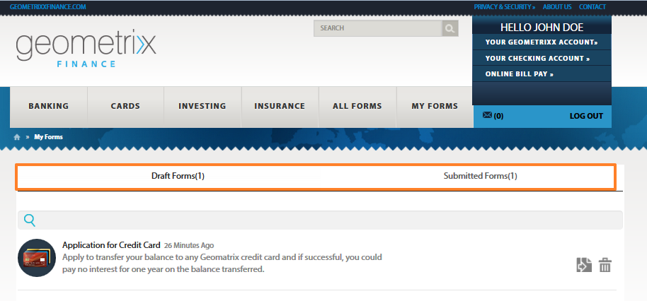

# 게시된 양식 액세스 및 채우기{#accessing-and-filling-published-forms}

양식 중심의 포털 배포 설정에서 양식 개발 및 포털 개발은 두 가지 별개의 활동입니다. 양식 디자이너가 양식을 디자인하고 저장소에 저장하는 동안 웹 개발자는 양식을 나열하고 제출을 처리하는 웹 애플리케이션을 만듭니다. 그런 다음 양식 저장소와 웹 애플리케이션 간에 통신이 없으므로 Forms이 웹 계층으로 복사됩니다.

이로 인해 설치 및 제작 지연을 관리하는 데 문제가 발생하는 경우가 많습니다. 예를 들어, 저장소에서 최신 버전의 양식을 사용할 수 있는 경우, 양식 디자이너는 웹 계층의 양식을 교체하고 웹 응용 프로그램을 수정하며 공개 사이트에서 양식을 다시 배포합니다. 웹 응용 프로그램을 다시 배포하면 일부 서버 다운타임이 발생할 수 있습니다. 서버 다운타임은 계획된 작업이므로 변경 사항을 즉시 공개 사이트로 푸시할 수 없습니다.

Forms 포털은 관리 오버헤드 및 제작 지연을 줄이고 있습니다. 웹 개발자는 Adobe Experience Manager(AEM)을 사용하여 제작된 웹 사이트에서 양식 포털을 제작하고 사용자 정의할 수 있는 구성 요소를 제공합니다.

양식 포털 및 해당 기능에 대한 자세한 내용은 [포털](/help/forms/using/introduction-publishing-forms.md)에 양식 게시 소개를 참조하십시오.

## 양식 포털 {#getting-started-with-forms-portal} 시작하기

게시된 양식 포털 페이지로 이동합니다. 양식 포털 페이지 만들기에 대한 자세한 내용은 [양식 포털 페이지 만들기](../../forms/using/creating-form-portal-page.md)를 참조하십시오.

roms 포털의 검색 및 라이브러리 구성 요소는 AEM 서버의 게시 인스턴스에서 사용할 수 있는 양식을 표시합니다. 이 목록에는 양식 포털 페이지를 작성할 때 필터에 정의된 모든 양식 또는 양식이 포함되어 있습니다. 양식 포털 페이지는 다음 이미지와 비슷합니다.

샘플 양식 포털 페이지

### 검색 및 목록 {#search-and-lister}

검색 및 라이브러리 구성 요소를 사용하면 양식 포털에 다음 기능을 추가할 수 있습니다.

* 패널, 카드 또는 격자 보기에서 즉시 사용할 수 있는 양식을 나열합니다. 또한 사용자 지정 템플릿Forms 관리자의 특정 폴더의 양식을 나열합니다.
* 양식의 렌더링 방법(HTML5, PDF 또는 둘 다)을 지정합니다.
* PDF 및 XFA 양식의 렌더링 방법(HTML5, PDF 또는 둘 다)을 지정합니다. XFA가 아닌 양식을 HTML5로
* 양식 속성, 메타데이터 및 태그와 같은 기준을 기반으로 양식 검색을 활성화합니다.
* 양식 데이터를 서블릿에 제출합니다.
* 맞춤형 스타일 시트(CSS)를 사용하여 포털의 모양과 느낌을 사용자 요구에 맞게 변경할 수 있습니다.
* 양식에 대한 링크를 만듭니다.

다음 옵션을 사용하여 Forms 포털 페이지에서 양식을 검색할 수 있습니다.

* 전체 텍스트 검색
* 고급 검색

전체 텍스트 검색을 사용하면 지정된 키워드를 기반으로 양식을 찾아 표시할 수 있습니다.

고급 검색 대화 상자

고급 검색을 사용하면 지정된 양식 속성을 기반으로 양식을 검색할 수 있습니다. 전체 텍스트 검색보다 더 구체적인 결과를 제공합니다. 고급 검색에는 태그, 속성(예: 작성자, 설명 및 제목), 수정 날짜 및 전체 텍스트를 기반으로 한 검색이 포함됩니다.

Lister는 검색 매개 변수를 기반으로 양식을 표시합니다. 검색 결과의 각 양식은 연결된 양식에 하이퍼링크된 아이콘으로 표시됩니다. 아이콘을 클릭하여 연결된 양식을 열고 작업할 수 있습니다.

### 양식 {#filling-a-form} 채우기

샘플 적응형 양식

이 양식은 페이지의 검색 및 라이브러리 구성 요소의 양식과 함께 제공된 링크에서 액세스할 수 있습니다.

각 양식에는 사용자가 양식을 채울 수 있는 도움말 정보가 포함되어 있습니다.

#### 초안 및 제출 {#drafts-and-submission}

사용자는 저장 단추를 클릭하여 양식 초안을 저장할 수 있습니다. 따라서 사용자는 양식을 제출하기 전에 일정 기간 동안 양식 작업을 수행할 수 있습니다.

양식에 입력된 데이터(첨부 파일 포함)는 서버의 초안으로 저장됩니다. 양식 초안은 여러 번 저장할 수 있습니다. 저장된 양식은 페이지의 초안 및 제출 구성 요소의 초안 탭에 나타납니다.

양식 작성을 완료하면 사용자가 양식의 제출 단추를 클릭하여 양식을 제출합니다. 제출된 양식은 페이지의 초안 및 제출 구성 요소의 제출 탭에 나타납니다.

>[!NOTE]
>
>제출된 양식은 적응형 양식에 대한 제출 작업이 Forms 포털 제출 작업으로 구성된 경우에만 제출됨 Forms 탭에 나타납니다. 제출 작업에 대한 자세한 내용은 [제출 작업 구성](../../forms/using/configuring-submit-actions.md)을 참조하십시오.

초안 및 제출 구성 요소

## 제출된 양식 데이터 {#start-a-new-form-using-submitted-form-data}를 사용하여 새 양식 시작

작성해서 제출해야 하는 양식이 있습니다. 예를 들어, 세금 신고 서류는 매년 제출됩니다. 이러한 경우 양식을 작성할 때마다 일부 정보가 변경되지만 개인 및 가족 세부 사항은 변경되지 않습니다. 그러나 처음부터 전체 양식을 다시 작성해야 합니다.

AEM Forms을 사용하면 양식 채우기 경험을 최적화하고 양식을 채우고 다시 제출하는 시간을 크게 줄일 수 있습니다. 최종 사용자는 제출된 양식의 데이터를 사용하여 새 양식을 시작할 수 있습니다. 이 기능은 [초안 및 제출 구성 요소](../../forms/using/draft-submission-component.md)에 내장되어 있습니다. 양식 포털 페이지에 초안 및 제출 구성 요소를 추가하고 게시하면 최종 사용자는 제출된 Forms 및 초안 Forms 탭에서 옵션을 찾아 제출된 양식의 데이터를 사용하여 새 양식을 시작합니다. 다음 이미지는 해당 옵션을 강조 표시합니다.

단추를 클릭하여 새 양식을 시작하면 해당 제출된 양식의 데이터가 포함된 새 양식이 열립니다. 이제 필요에 따라 정보를 검토하고 업데이트하고 양식을 제출할 수 있습니다.
