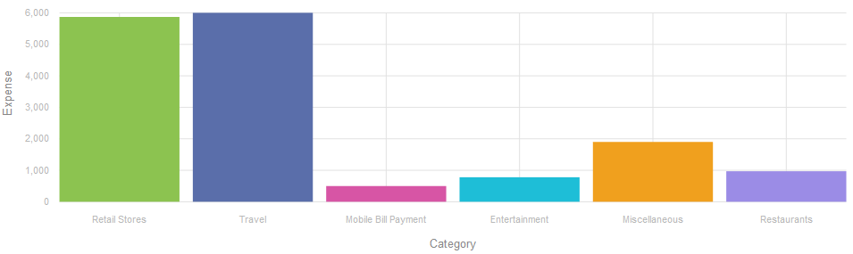
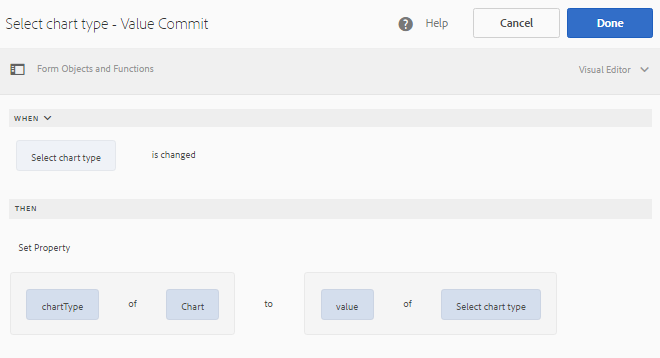
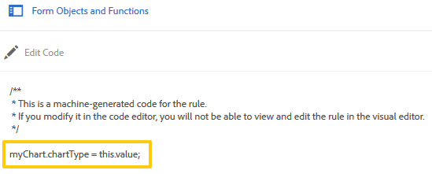

# 적응형 양식 차트 {#af-charts}


차트 또는 그래프는 데이터를 시각적으로 표현한 것입니다. 많은 양의 정보를 이해하기 쉬운 시각적 형식으로 압축할 수 있으므로 복잡한 데이터를 더 잘 시각화, 해석 및 분석할 수 있습니다.
AEM Forms 추가 기능 패키지는 기본 차트 구성 요소를 제공합니다. 적응형 양식 및 문서에서 의 2차원 데이터를 시각적으로 나타낼 수 있습니다 **반복 가능한 패널** 및 **표**. 차트 구성 요소를 사용하여 다음 유형의 차트를 추가하고 구성할 수 있습니다.

1. 파이
1. 열
1. 도넛
1. 막대
1. 선
1. 선 및 점
1. 점
1. 영역

차트 구성 요소는 차트에서 값을 계산하고 그래프로 나타낼 수 있는 내장 통계 함수(합계, 평균, 최대, 최소, 모드, 중간값, 범위 및 빈도)를 지원하고 제공합니다. 즉시 사용할 수 있는 함수 외에도 사용자 정의 함수를 작성하여 차트에서 사용할 수 있도록 할 수 있습니다.

이제 차트 구성 요소를 추가하고 구성하는 방법을 살펴보겠습니다.

## 차트 추가 {#add-chart}

차트 구성 요소는 기본적으로 AEM 사이드바에서 사용할 수 있습니다. 작성 모드에서 차트 구성 요소를 AEM 사이드바에서 적응형 양식 또는 문서로 드래그 앤 드롭할 수 있습니다. 구성 요소를 놓으면 차트의 자리 표시자가 만들어집니다.

## 차트 구성 {#configure-chart}

>[!NOTE]
> 
> 차트를 구성하기 전에 차트를 구성할 패널 또는 테이블 행이 반복 가능으로 설정되어 있는지 확인하십시오. 구성 요소 편집 대화 상자의 반복 설정 탭에서 반복 가능한 패널 또는 테이블 행에 대해 최소 및 최대 개수를 지정할 수 있습니다.

차트를 구성하려면 차트 구성 요소를 클릭하고  차트 편집 대화 상자를 엽니다. 이 대화 상자에는 차트를 구성할 수 있는 제목 및 텍스트, 구성, 고급 옵션 및 스타일 지정 탭이 포함되어 있습니다.

### 기본 {#basic}

기본 탭에서 다음 속성을 구성할 수 있습니다.


* **요소 이름**: JCR 콘텐츠 구조의 차트 요소에 대한 식별자입니다. 차트에 표시되지는 않지만 다른 구성 요소, 스크립트 및 SOM 표현식에서 요소를 참조할 때 도움이 됩니다.
* **차트 유형**: 생성하려는 차트 유형을 지정합니다. 사용 가능한 옵션은 원형, 도넛, 막대, 열, 선, 선 및 점, 점 및 영역입니다. 이 예에서 차트 유형은 열입니다.
* **데이터 소스에 대해 행 이름 또는 패널 이름 반복**: 데이터를 소싱할 테이블 행 또는 반복 가능 패널의 요소 이름을 지정합니다. 예제에서 statementDetails는 Statement Details 테이블에서 반복 가능한 행의 요소 이름입니다.
* **X축 > 제목**: X축의 제목을 지정합니다. 이 예에서 X축의 제목은 범주입니다.
* **X축 > 필드**: X축에 표시되는 필드(또는 테이블의 셀)의 요소 이름을 지정합니다. 이 예에서는 범주가 X축에 구성됩니다. 예제 테이블의 범주 열에 있는 테이블 셀의 요소 이름은 범주입니다.
* **X축 > 함수 사용**: X축의 값을 계산하는 데 사용할 통계 함수를 지정합니다. 이 예제에서 선택한 옵션은 없음입니다. 함수에 대한 자세한 내용은 차트에서 함수 사용을 참조하십시오.
* **Y축 > 제목**: Y축의 제목을 지정합니다. 이 예제에서 Y축의 제목은 Expense입니다.
* **Y축 > 필드**: Y축에 표시되는 필드(또는 테이블의 셀)의 요소 이름을 지정합니다. 이 예에서 Y축에 대한 금액을 구성합니다. 예제 테이블의 금액 열에 있는 테이블 셀의 요소 이름은 금액입니다.
* **Y축 > 함수 사용**: Y축의 값을 계산하는 데 사용할 통계 함수를 지정합니다. 이 예에서는 각 범주에서 소비한 금액이 추가되고 계산된 값이 Y축에 표시됩니다. 따라서 함수 사용 드롭다운 목록에서 합계를 선택합니다. 함수에 대한 자세한 내용은 차트에서 함수 사용을 참조하십시오.
* **범례 위치**: 차트와 관련하여 범례의 위치를 지정합니다. 사용 가능한 옵션은 오른쪽, 왼쪽, 위쪽 및 아래입니다.
* **범례 표시**: 활성화되면 차트에 대한 범례를 표시합니다.
* **툴팁**: 차트의 데이터 포인트에서 마우스오버에 도구 설명이 표시되는 형식을 지정합니다. 기본값은 입니다. **\${x}(\${y})**. 차트 유형에 따라 차트에서 마우스가 한 점, 막대 또는 슬라이스를 가리키면 변수가 달라집니다 **\${x}** 및 **\${y}** 는 X축 및 Y축의 해당 값으로 동적으로 대체되고 도구 설명에 표시됩니다. 아래 예에 표시된 대로 도구 팁은 다음과 같이 표시됩니다. **소매점(5870)** 소매 저장소 열을 마우스로 가리키고 있는 경우. 툴팁을 비활성화하려면 툴팁 필드를 비워 둡니다. 이 옵션은 선 및 영역 차트에 적용할 수 없습니다.
* **차트별 구성**: 일반적인 구성 외에도 다음과 같은 차트별 구성을 사용할 수 있습니다.
* **내측 반경**: 도넛 차트에서 차트에 있는 내부 원의 반경(픽셀 단위)을 지정할 수 있습니다.
* **선 색상**: 선, 선, 점 및 영역 차트에 사용할 수 있으며 차트에서 선의 16진수 색상 값을 지정합니다.
* **점 색상**: 점, 선 및 점 차트에서 차트의 점에 대한 색상의 16진수 값을 지정할 수 있습니다.
* **영역 색상**: 영역 차트에서 차트의 선 아래에 있는 영역에 대한 색상의 16진수 값을 지정할 수 있습니다.
* **CSS 클래스**: 차트에 사용자 지정 스타일을 적용할 CSS 클래스 필드의 CSS 클래스 이름을 지정합니다.

### 구성 {#configuration}

기본 탭에서 차트 유형, 데이터가 포함된 소스 패널 또는 테이블 행, 차트의 X축 및 Y축에 표시되는 값, 선택적으로 차트에 표시되는 플로팅의 값을 계산하는 통계 함수를 정의합니다.

신용 카드 설명서에 있는 반복 가능한 테이블의 예를 통해 이 탭에 나타나는 정보에 대해 자세히 알아보겠습니다. 아래와 같이 신용 카드 명세서의 명세서 세부 정보 섹션에 총 경비를 다른 범주로 표시하고 상호 연관시킬 차트를 생성한다고 가정해 보겠습니다.

이를 위해서는 X축에 범주를 그리고 Y축에 각 범주의 총 지출을 그려야 합니다.


이 예에 사용된 신용 카드 명령문은 적응형 양식 문서이고 명령문 세부 사항 섹션은 작성 모드에서 다음과 같이 표시되는 테이블입니다.


차트를 생성하기 위한 다음 요구 사항 및 조건을 고려하겠습니다.

* 이 차트는 명세서 상세내역 테이블의 각 범주의 총 비용을 표시합니다.
* 차트 유형은 열이지만 필요에 따라 다른 차트 유형을 선택할 수 있습니다.
* 문 세부 사항 테이블의 테이블 행은 반복 가능합니다. 테이블 행 등록 정보의 반복 설정 필드에서 구성할 수 있습니다.
* 행의 요소 이름은 명령문 세부 정보입니다. 표 행 속성에서 구성할 수 있습니다.
* 범주 열의 테이블 셀에 대한 요소 이름은 범주입니다. 인라인으로 지정할 수 있습니다. 셀을 선택하고 편집 버튼을 탭합니다.
* 금액 열의 테이블 셀에 대한 요소 이름은 금액입니다. 또한 금액 열의 테이블 셀은 숫자 상자입니다.
* 지정된 구성을 사용하면 예제의 열 차트가 다음과 같이 표시됩니다. 각 색상은 범주를 나타내며 범주에 대한 개별 라인 항목 또는 금액이 차트에 추가됩니다.

  

범례와 도구 팁은 다음과 같이 표시됩니다.


### 스타일링 {#styling}

스타일 모드에서는 차트의 폭(폼이나 문서에서 사용할 수 있는 총 폭의 백분율)과 높이(픽셀 단위)를 구성할 수 있습니다. 기타 옵션에는 텍스트, 배경, 테두리, 효과 및 CSS 무시가 포함됩니다.

스타일 모드로 전환하려면 페이지 도구 모음에서 **탭>>스타일**.


## 차트에서 함수 사용 {#use-functions}

차트에서 플로팅할 소스 데이터의 값을 계산하기 위해 통계 함수를 사용하도록 차트를 구성할 수 있습니다. 차트 구성 요소에는 몇 가지 내장 함수가 있지만 사용자 고유의 함수를 작성하여 차트 구성에서 사용할 수 있도록 할 수 있습니다.

>[!NOTE]
>
> 함수를 사용하여 차트에서 X축 또는 Y축에 대한 값을 계산할 수 있습니다.

### 기본 함수 {#default-functions}

차트 구성 요소에서는 기본적으로 다음 기능을 사용할 수 있습니다.

* **평균**: 다른 축에 있는 주어진 값에 대한 X 또는 Y 축 값의 평균을 반환합니다.
* **합계**: 다른 축의 주어진 값에 대한 X 또는 Y 축의 모든 값 합계를 반환합니다.
* **최대**: 다른 축의 주어진 값에 대한 X 또는 Y 축의 최대 값 반환
* **빈도**: 다른 축의 주어진 값에 대한 X 또는 Y 축의 값 수를 반환합니다.
* **범위**: 다른 축에 있는 주어진 값에 대한 X 또는 Y 축 값의 최대 및 최소 간 차이를 반환합니다.
* **중간값**: 다른 축의 주어진 값에 대해 X 또는 Y축에서 높은 값과 낮은 값을 반으로 구분하는 값을 반환합니다.
* **최소**: 다른 축의 지정된 값에 대한 X 또는 Y 축의 최소 값 반환
* **모드**: 다른 축의 주어진 값에 대해 X 또는 Y축에서 가장 많이 발생하는 값을 반환합니다.

### 사용자 정의 함수 {#custom-functions}

차트에서 기본 함수를 사용할 수 있을 뿐만 아니라 [사용자 정의 함수](/help/forms/using/rule-editor.md#custom-functions-in-rule-editor-custom-functions) JavaScript에서 제공되고 차트 구성 요소의 함수 목록에서 사용할 수 있습니다.

함수는 배열 또는 값과 카테고리 이름을 입력으로 취하여 값을 반환합니다. 예:

```
Multiply(valueArray, category) {
    var val = 1;
    _.each(valueArray, function(value) {
        val = val * value;
    });
    return val;
}
```

사용자 지정 함수를 작성했으면 다음을 수행하여 차트 구성에서 사용할 수 있도록 합니다.

1. 적응형 양식 또는 문서와 연결된 클라이언트 라이브러리에 사용자 지정 기능을 추가합니다.
1. CRXDE Lite에서 다음 속성을 사용하여 apps 폴더에 nt:unstructured 노드를 만듭니다.
   * guideComponentType을 fd/af/reducer로 설정합니다. (필수)
   * 값을 사용자 지정 JavaScript 함수의 정규화된 이름으로 설정합니다. (필수)
   * jcr:description을 의미 있는 이름으로 설정합니다. 다음 위치에 표시됩니다. **함수 사용** 드롭다운 목록입니다. 예를 들어, **곱하기**.
   * qtip을 함수에 대한 간단한 설명으로 설정합니다. 함수 사용 드롭다운 목록에서 함수 이름 위로 포인터를 가져가면 도구 설명으로 표시됩니다.
   * 클릭 **모두 저장** 구성을 저장합니다.
   * 이제 함수를 차트에서 사용할 수 있습니다.


## 차트 자동 새로 고침 {#auto-refresh-chart}

사용자가 다음 중 하나를 수행하면 차트가 자동으로 새로 고쳐집니다.
* 데이터 소스 패널 또는 테이블 행의 인스턴스를 추가하거나 제거합니다.
* 데이터 소스 패널 또는 테이블 행에서 X 또는 Y 축에 표시되는 값을 변경합니다.
* 차트 유형을 변경합니다.

## 적응형 양식 규칙에서 차트 유형 사용 {#chart-in-rules}

chartType 속성은 차트의 유형을 지정합니다. 가능한 값은 원형, 도넛, 막대, 선, 선점, 점 및 영역입니다. 이는 스크립팅 가능한 속성이므로 다음에서 사용할 수 있습니다. [적응형 양식 규칙](/help/forms/using/rule-editor.md) 차트 구성을 조작합니다. 예시의 도움을 받아 그것을 이해해봅시다.

세로 막대형 차트를 구성했다고 가정합니다. 그러나 드롭다운 목록에서 다른 차트 유형을 선택하고 차트를 다시 그릴 수 있는 옵션을 사용자에게 제공할 수도 있습니다. 다음과 같이 규칙의 chartType 속성을 사용하여 이를 수행할 수 있습니다.

1. 적응형 양식의 AEM 사이드바에서 드롭다운 목록 구성 요소를 드래그 앤 드롭합니다.
1. 구성 요소를 선택하고 을 누릅니다 .
1. 드롭다운 목록의 제목을 지정합니다. 예를 들어 차트 유형을 선택합니다.
1. 항목 섹션에 지원되는 차트 유형을 추가하여 드롭다운 목록을 채웁니다. **완료**를 클릭합니다.
   

1. 드롭다운 구성 요소를 선택하고 을 누릅니다 . 규칙 편집기에서 아래와 같이 시각적 규칙 편집기에서 규칙을 작성합니다.
   

   이 예에서 차트 구성 요소의 요소 이름은 입니다. **myChart**.

   또는 코드 편집기에서 다음 규칙을 작성할 수 있습니다.

   

   규칙 작성에 대한 자세한 내용은 [규칙 편집기](/help/forms/using/rule-editor.md)

1. 완료 를 클릭하여 규칙을 저장합니다.

이제 드롭다운 목록에서 차트 유형을 선택하고 새로 고침 을 클릭하여 차트를 다시 그릴 수 있습니다.
