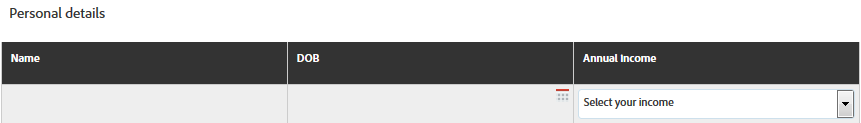
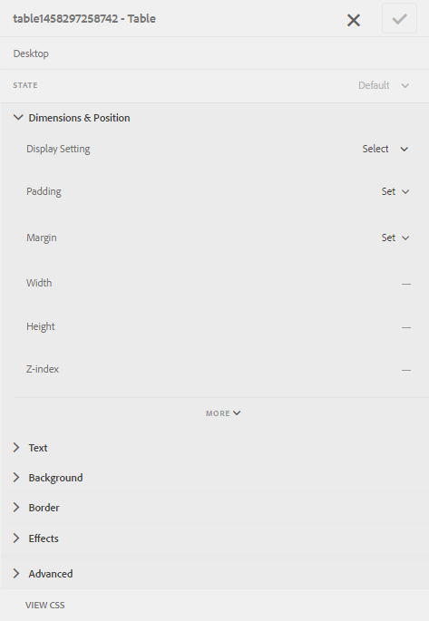
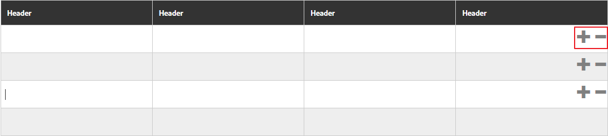

# 적응형 양식의 표{#tables-in-adaptive-forms}

표를 사용하는 것은 복잡한 데이터를 효과적으로, 단순화하고, 체계적으로 제공하는 방법입니다. 이 플러그인을 사용하면 정보를 쉽게 식별하고 행과 열의 정렬된 정렬로 입력을 제공할 수 있습니다. 금융 서비스 및 공공 기관의 대부분의 양식은 숫자를 입력하고 계산을 수행하기 위해 대용량 데이터 테이블을 필요로 합니다.

AEM Forms은 적응형 양식으로 표를 만들 수 있는 세로 막대의 구성 요소 브라우저에서 표 구성 요소를 제공합니다. 이 기능이 제공하는 주요 기능 중 일부는 다음과 같습니다.

* 모바일 디바이스에서 반응형 레이아웃 제작
* 구성 가능한 행 및 열
* 런타임에 동적으로 행 추가 및 삭제
* 셀 결합 또는 병합 및 분할
* 화면 판독기를 통해 액세스 가능
* CSS를 사용한 사용자 정의 레이아웃
* XDP 표 구성 요소와 호환 및 매핑
* XSD 복합 유형 요소를 사용하여 행 또는 셀 추가 지원
* XML 파일의 데이터 병합

## {#create-a-table} 표 만들기

표를 만들려면 적응형 양식의 사이드 킥의 구성 요소 브라우저에서 표 구성 요소를 드래그하여 놓습니다. 기본적으로 테이블에는 머리글 행을 포함하여 2개의 열과 3개의 행이 있습니다.


### 머리글 및 본문 셀 정보 {#about-header-and-body-cells}

머리글 셀은 텍스트 필드입니다. 헤더의 레이블을 변경하려면 헤더 셀을 마우스 오른쪽 단추로 클릭하고 **편집**&#x200B;을 클릭합니다. 편집 대화 상자에서 **값** 필드에 레이블을 업데이트하고 **확인**&#x200B;을 클릭합니다.

본문 셀은 기본적으로 텍스트 상자입니다. 본문 셀을 숫자 상자, 날짜 선택기 또는 드롭다운 목록과 같이 사이드 킥에서 사용할 수 있는 다른 적응형 양식 구성 요소로 바꿀 수 있습니다.

예를 들어 다음 표의 첫 번째 본문 행은 텍스트 상자, 날짜 선택기 및 드롭다운 목록 구성 요소를 셀로 포함합니다.



병합할 셀을 선택하고 마우스 오른쪽 단추를 클릭한 다음 **병합**&#x200B;을 선택하여 두 개 이상의 본문 셀을 병합할 수 있습니다. 병합된 셀을 마우스 오른쪽 단추로 클릭하고 **셀 분할**&#x200B;을 선택하여 분할할 수도 있습니다.

### 행 및 열 추가, 삭제, 이동 {#add-delete-move-rows-and-columns}

행이나 열을 추가 및 삭제하고 표에서 행을 위아래로 이동할 수 있습니다.

행 또는 열을 추가 또는 삭제하거나 행을 이동하려면 행 또는 열의 셀을 클릭합니다. 드롭다운 메뉴가 열 위쪽과 행 왼쪽에 표시됩니다. 맨 위의 메뉴에서는 열을 추가하거나 삭제할 수 있는 옵션을 제공하며 왼쪽의 메뉴에서는 행을 추가, 삭제 또는 이동할 수 있습니다.

* 추가 작업은 선택한 행 또는 열의 오른쪽에 행 또는 열을 추가합니다.
* 삭제 작업은 선택한 행 또는 열을 삭제합니다.
* 위로 이동 및 아래로 이동 작업은 선택한 행을 위아래로 이동합니다.

행의 드롭다운 메뉴에서는 행 속성, 설정 및 스타일 지정 옵션을 편집하는 편집 작업도 제공합니다.


>[!NOTE]
>
>테이블에 원하는 수의 행을 추가할 수 있지만 추가할 수 있는 최대 열 수는 6개입니다. 또한 표에서 머리글 행을 삭제할 수 없습니다.

### 테이블 설명 {#add-table-description} 추가

표 설명을 추가하여 화면 판독기가 해석하고 읽을 수 있도록 정보가 구성되는 방법을 설명할 수 있습니다. 설명을 추가하려면:

1. 표를 선택하고 을 탭하여 세로 막대에서 해당 속성을 확인합니다.
1. [액세서빌러티] 탭에서 요약을 지정합니다.
1. **완료**&#x200B;를 클릭합니다.

### {#sortcolumnstable} 테이블의 열 정렬

적응형 양식의 표에 있는 열을 기준으로 데이터를 정렬할 수 있습니다. 열의 값은 오름차순이나 내림차순으로 정렬할 수 있습니다.

정렬은 다음을 포함하는 테이블 열에 적용할 수 있습니다.

* 정적 텍스트
* 데이터 모델 개체 속성
* 정적 텍스트와 데이터 모델 개체 속성의 조합

표 열에 정렬을 적용하려면 표 열 셀에 다음 구성 요소 중 하나가 포함되어야 합니다.숫자 상자, 숫자 스테퍼, 날짜 입력 필드, 날짜 선택기, 텍스트 또는 텍스트 상자.

정렬을 활성화하려면:

1. 테이블을 선택하고 (구성)을 누릅니다. 대화형 통신 사이드 킥의 **컨텐트** 브라우저를 사용하여 표를 선택할 수도 있습니다.
1. **정렬 사용**&#x200B;을 선택합니다.
1. 을 눌러 표 속성을 저장합니다. 열 머리글의 위쪽 및 아래쪽 화살표는 정렬이 활성화되었음을 나타냅니다.

   

1. 출력을 보려면 **미리 보기** 모드로 전환합니다. 표는 표의 첫 번째 열을 기준으로 자동으로 정렬됩니다.
1. 열 헤더를 클릭하여 열을 기준으로 값을 정렬합니다.

   위쪽 화살표가 있는 열 헤더는 해당 열을 기준으로 표가 정렬되었음을 나타냅니다. 또한 열의 값은 오름차순으로 표시됩니다.

   

   마찬가지로 아래쪽 화살표가 있는 열 헤더는 열의 값이 내림차순으로 표시됨을 나타냅니다.

   **미리 보기** 모드에서 표를 변경하고 열 헤더를 다시 클릭하여 열 값을 정렬할 수도 있습니다.

## {#set-column-width} 표의 열 너비를 설정합니다.

표의 열 너비를 설정하려면 다음 단계를 수행합니다.

1. **[!UICONTROL 컨텐트]** 탭에서 **[!UICONTROL 표]** 구성 요소를 탭하고 구성() 아이콘을 탭합니다.

1. 표의 각 열에 비례하는 너비를 지정하려면 **[!UICONTROL 열 너비]** 필드에 쉼표로 구분된 값 목록을 입력합니다. 예를 들어 3개의 열이 포함된 테이블의 경우, **[!UICONTROL 열 너비]** 필드에 2,4,6을 값으로 지정하면 첫 번째 열에는 2/12가 되고, 두 번째 열에는 4/12가 되고, 세 번째 열에는 6/12가 설정됩니다. 첫 번째 열의 너비로서 2/12는 표 너비의 1/6을 나타냅니다. 마찬가지로, 4/12는 두 번째 열 너비를 표 너비의 1/3으로 설정하고 6/12는 세 번째 열 너비를 표 너비의 반으로 설정합니다.

## 표 스타일 {#configure} 구성

페이지 도구 모음에서 스타일 모드를 사용하여 표의 스타일을 정의할 수 있습니다. 스타일 모드로 전환하고 표 스타일을 편집하려면 다음 단계를 수행하십시오

1. 페이지 도구 모음의 미리 보기 전에  > **스타일**&#x200B;을 탭합니다.

1. 사이드바에서 표를 선택하고 편집 단추 를 누릅니다.
세로 막대에서 스타일 속성을 볼 수 있습니다.



>[!NOTE]
>
>LESS 변수의 값을 변경하여 머리글 및 본문 행의 색상 테마를 변경할 수 있습니다. 자세한 내용은 AEM Forms](/help/forms/using/themes.md) [](/help/forms/using/creating-custom-adaptive-form-themes.md)의 [테마를 참조하십시오.

## 동적으로 {#add-or-delete-a-row-dynamically} 행 추가 또는 삭제

표는 런타임에 행을 동적으로 추가하거나 삭제할 수 있도록 기본적으로 지원합니다.

1. 표 행을 선택하고 을 누릅니다.
1. 반복 설정 탭에서 표의 행 수를 제한할 최소 및 최대 수를 지정합니다.
1. **완료**&#x200B;를 클릭합니다.

런타임에 행을 추가하거나 삭제할 **+** 및 *-* 단추가 표시됩니다.



>[!NOTE]
>
>표의 왼쪽 모바일 레이아웃의 머리글에서 동적으로 행을 추가하거나 삭제하는 것은 지원되지 않습니다.

## 테이블 {#expressions-in-a-table}의 표현식

적응형 양식의 표를 사용하면 JavaScript에서 표현식을 작성하여 표 또는 행을 표시하거나 숨기고, 모든 숫자를 추가하고, 셀의 합계를 표시하거나, 셀을 활성화 또는 비활성화하고, 사용자 입력을 확인하는 등의 동작을 유도할 수 있습니다. 이러한 표현식은 적응형 양식 스크립팅 모델 API를 사용합니다.

표 및 행에서는 표현식에서 반환된 값을 기반으로 가시성을 제어하기 위해 가시성 표현식만 지원하지만 셀에서는 다음 표현식을 지원합니다.

* **초기화 스크립트:** 필드의 초기화 작업을 수행하려면
* **값 커밋 스크립트:** 필드 값이 변경된 후 양식의 구성 요소를 변경합니다.

>[!NOTE]
>
>XFA 변경/종료 스크립트가 같은 필드에도 적용되면 XFA 변경/종료 스크립트가 값 커밋 스크립트 전에 실행됩니다.

* **표현식** 계산:을 클릭하여 필드의 값을 자동으로 계산합니다.
* **유효성 검사 표현식**:을 클릭하여 필드를 확인합니다.
* **액세스 표현식**:을 클릭하여 필드를 활성화/비활성화합니다.
* **가시성 표현식**:필드 및 패널의 가시성을 제어합니다.

표 또는 행의 가시성 표현식은 해당 구성 요소 편집 대화 상자의 패널 속성 탭에서 정의할 수 있습니다. 셀의 표현식은 구성 요소 편집 대화 상자의 스크립트 탭에서 정의할 수 있습니다.

응용 양식 클래스, 이벤트, 개체 및 공용 API의 전체 목록은 적응형 양식](https://helpx.adobe.com/experience-manager/6-5/forms/javascript-api/index.html)에 대한 [JavaScript 라이브러리 API 참조를 참조하십시오.

## 모바일 레이아웃 {#mobile-layouts}

적응형 양식의 표는 유동적이고 응답형 레이아웃으로 인해 탁월한 모바일 장치를 제공합니다. AEM Forms은 표에 대한 두 가지 유형의 모바일 레이아웃(왼쪽 및 축소 가능 열에 머리글)을 제공합니다.

표에 대한 구성 요소 편집 대화 상자의 스타일 지정 탭에서 표에 대한 모바일 레이아웃을 구성할 수 있습니다.

### 왼쪽 {#headers-on-left}의 머리글

왼쪽 레이아웃의 헤더에서 표의 헤더는 머리글에 대해 하나의 셀만 나타나는 왼쪽 위에 배치됩니다. 이 레이아웃의 각 행은 별개의 섹션으로 표시됩니다. 다음 이미지는 데스크탑의 표를 모바일 장치의 테이블과 비교합니다.


왼쪽 레이아웃에 머리글이 있는 표의 데스크탑 보기


왼쪽 레이아웃에 머리글이 있는 표의 모바일 보기

### 축소 가능한 열 레이아웃 {#collapsible-columns-layout}

축소 가능 열 레이아웃에서는 장치 크기에 따라 표의 열이 축소되어 하나 또는 2개의 열이 표시되는 반면 다른 열은 축소됩니다. 테이블의 다른 열을 보려면 축소/확장 아이콘을 클릭할 수 있습니다.

>[!NOTE]
>
>축소 가능 열 레이아웃은 모바일 장치에 최적화되어 있지만 사용 가능한 너비가 표의 모든 열을 표시하도록 충분하지 않을 경우 데스크톱에서도 작동합니다.

다음 이미지는 축소되거나 확장된 열이 있는 장치에서 표가 표시되는 방식을 비교합니다.


모바일 장치에 열이 2개밖에 나타나지 않는 표의 축소된 열


모바일 장치에서 표의 확장된 열

## {#merge-data-in-a-table} 테이블의 데이터 병합

적응형 양식의 표를 사용하면 XML 파일의 데이터를 사용하여 런타임에 표를 채울 수 있습니다. 데이터 XML 파일은 AEM Forms 서버가 실행 중인 컴퓨터의 로컬 파일 시스템 또는 CRX 저장소에 있을 수 있습니다.

XML 파일의 데이터로 채울 다음 은행 거래 요약 테이블을 예로 들어 보겠습니다.


이 예에서 요소 이름 속성은 다음과 같습니다.

* 행은 **Row1**&#x200B;입니다.
* 거래 날짜 아래의 본문 셀은 **tableItem1**&#x200B;입니다.
* 설명 아래의 본문 셀은 **tableItem2**&#x200B;입니다.
* 거래 유형 아래의 본문 셀은 **type**&#x200B;입니다.
* USD의 금액 아래의 본문 셀은 **tableItem3**&#x200B;입니다.

다음 형식의 데이터를 포함하는 XML 파일:

```xml
<?xml version="1.0" encoding="UTF-8"?><afData>
  <afUnboundData>
    <data>
 <typeSelect>0</typeSelect>
 <Row1>
      <tableItem1>2015-01-08</tableItem1>
      <tableItem2>Purchase laptop</tableItem2>
      <type>0</type>
      <tableItem3>12000</tableItem3>
 </Row1>
 <Row1>
      <tableItem1>2015-01-05</tableItem1>
      <tableItem2>Transport expense</tableItem2>
      <type>0</type>
      <tableItem3>120</tableItem3>
 </Row1>
 <Row1>
      <tableItem1>2014-01-08</tableItem1>
      <tableItem2>Laser printer</tableItem2>
      <type>0</type>
      <tableItem3>500</tableItem3>
 </Row1>
 <Row1>
      <tableItem1>2014-12-08</tableItem1>
      <tableItem2>Credit card payment</tableItem2>
      <type>0</type>
      <tableItem3>300</tableItem3>
 </Row1>
 <Row1>
      <tableItem1>2015-01-06</tableItem1>
      <tableItem2>Interest earnings</tableItem2>
      <type>1</type>
      <tableItem3>12000</tableItem3>
 </Row1>
 <Row1>
      <tableItem1>2015-01-05</tableItem1>
      <tableItem2>Payment from a client</tableItem2>
      <type>1</type>
      <tableItem3>500</tableItem3>
 </Row1>
 <Row1>
      <tableItem1>2015-01-08</tableItem1>
      <tableItem2>Food expense</tableItem2>
      <type>0</type>
      <tableItem3>120</tableItem3>
 </Row1>
 </data>
  </afUnboundData>
  <afBoundData>
    <data/>
  </afBoundData>
  <afBoundData/>
</afData>
```

샘플 XML에서 행의 데이터는 테이블의 행에 대한 요소 이름인 `<Row1>` 태그로 정의됩니다. `<Row1>` 태그 내에서 각 셀의 데이터는 `<tableItem1>`, `<tableItem2>`, `<tableItem3>` 및 `<type>` 등의 해당 요소 이름에 대한 태그 내에 정의됩니다.

런타임 시 이 데이터를 테이블과 병합하려면 표를 포함하는 응용 양식을 wcmmode가 비활성화된 절대 XML 위치로 지정해야 합니다. 예를 들어 적응형 양식이 *https://localhost:4502/myForms/bankTransaction.html*&#x200B;에 있고 데이터 XML 파일이 *C:/myTransactions/bankSummary.xml*&#x200B;에 저장되어 있는 경우 다음 URL에서 데이터가 있는 테이블을 볼 수 있습니다.

*https://localhost:4502/myForms/bankTransaction.html?dataRef=file:/// C:/myTransactions/bankSummary.xml&amp;wcmmode=disabled*


## XDP 구성 요소 및 XSD 복합 유형 {#use-xdp-components-and-xsd-complex-types} 사용

XFA 양식 템플릿을 기반으로 적응형 양식을 만든 경우 AEM Content Finder의 데이터 모델 탭에서 XFA 요소를 사용할 수 있습니다. 표를 포함한 이러한 XFA 요소를 적응형 양식으로 드래그하여 놓을 수 있습니다.

XFA 테이블 요소는 표 구성 요소에 매핑되고 적응형 양식에서 기본 설정으로 작동합니다. XDP 테이블의 모든 속성 및 기능은 적응형 양식으로 이동될 때 그대로 유지되며 기본 적응형 양식 표를 사용하는 것처럼 이 표에서 모든 작업을 수행할 수 있습니다. 예를 들어 XDP 테이블의 행이 반복 가능한 것으로 표시된 경우 적응형 양식에서 드롭될 때도 반복됩니다.

또한 XDP 하위 양식을 드래그하여 테이블에 새 행을 추가할 수도 있습니다. 그러나 중첩된 하위 폼을 놓을 수는 없습니다.

>[!NOTE]
>
>머리글 행이 없는 XDP 테이블은 적응형 양식 표 구성 요소에 매핑되지 않습니다. 대신 유동 레이아웃을 사용하여 적응형 양식 패널 구성 요소에 매핑됩니다. 또한 XDP에서 응용 형식으로 중첩된 표를 추가하면 외부 테이블이 내부 표를 유지하면서 패널로 변환됩니다.

또한 XSD 복합 형식 요소 그룹을 드래그 드롭하여 표 행을 만들 수도 있습니다. 요소를 삭제한 행 바로 아래에 새 행이 만들어집니다. XSD 복합 형식 요소를 사용하여 만든 셀에는 XSD에 대한 바인딩 참조가 유지됩니다. 요소를 셀에 놓아 본문 셀을 XSD 복합 형식 요소로 바꿀 수도 있습니다.

>[!NOTE]
>
>XDP 테이블 구성 요소, 하위 폼 또는 XSD 복합 형식의 요소 수는 행의 셀 수를 초과할 수 없습니다. 예를 들어 셀이 3개밖에 없는 행에 4개의 요소를 놓을 수 없습니다. 오류가 발생합니다.
>
>요소 수가 행의 셀 수보다 적으면 새 행이 먼저 요소를 기준으로 셀을 추가한 다음 기본 셀이 행의 나머지 셀을 채우도록 추가됩니다. 예를 들어 4개의 셀이 있는 행에 3개의 요소 그룹을 놓을 경우, 처음 3개의 셀은 삭제한 요소를 기반으로 하고 나머지 한 셀은 기본 표 셀이 됩니다.

## 주요 고려 사항 {#key-considerations}

* XSD 기반 테이블을 작성하는 동안 행을 위아래로 이동하는 경우, 양식 제출 시 생성된 데이터 XML에서 테이블 행에서 일부 데이터 손실이 표시됩니다.
* 기본 테이블의 각 본문 셀에 연관된 사전 정의된 요소 이름이 있습니다. 적응형 양식에 다른 표를 추가하면 새 테이블의 기본 본문 셀에 첫 번째 테이블과 동일한 요소 이름이 지정됩니다. 이러한 시나리오에서 양식 제출 시 생성된 데이터는 테이블 중 하나만 있는 기본 본문 셀에 데이터를 포함합니다. 따라서 기본 본문 셀의 요소 이름을 변경하여 표 간에 요소를 고유하게 유지하고 데이터 손실을 방지해야 합니다.

   기본 본문 셀에만 적용할 수 있습니다. 표에 행이나 열을 더 추가하면 기본이 아닌 본문 셀에 대한 고유한 요소 이름이 자동으로 생성됩니다.

