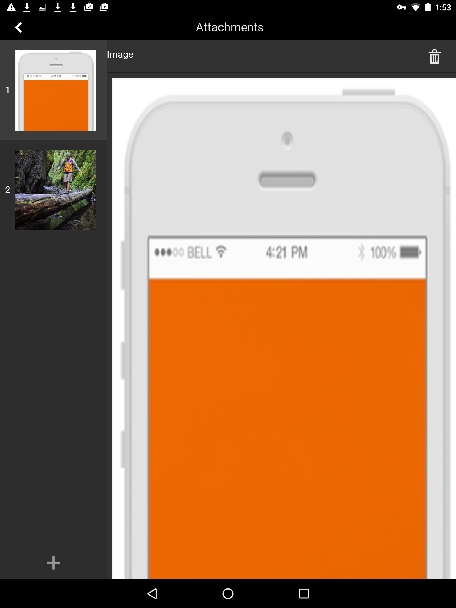

# 첨부 파일 추가{#adding-attachments}

## AEM Forms 워크플로우 서버와 동기화된 양식에 첨부 파일 추가(JEE의 AEM Forms) {#adding-annotations}

AEM Forms 앱을 사용하면 AEM Forms JEE 서버와 동기화된 양식에 이미지, 스크리블 메모 및 텍스트 메모를 첨부할 수 있습니다. AEM Forms Workflow 서버에서 양식을 로드하면 첨부 파일이 양식에 추가됩니다. 첨부 단추를 누를 수 있습니다  모든 첨부 파일을 함께 볼 수 있습니다. 빨간색 알림은 양식의 첨부 파일 수를 지정합니다. 양식에 첨부 파일이 없으면 빨간색 알림 단추가 표시되지 않습니다. 양식에 첨부 파일이 없는 경우 첨부 파일 단추를 누릅니다 사진 또는 스크리블을 첨부할 수 있습니다.

옵션은 다음과 같습니다.

* **갤러리**: 장치에 저장된 그림에서 그림을 추가할 수 있습니다.

* **카메라**: 사진을 찍어 양식에 추가할 수 있습니다.

* **참고**: 스크리블 또는 텍스트 메모를 추가할 수 있습니다. 사용  스크리블을 추가하려면  텍스트 메모를 추가하려면

>[!NOTE]
>
>한 사용자가 추가한 첨부 파일은 다른 AEM Forms 앱 사용자에게 표시됩니다. 다른 사용자는 사용자가 추가한 첨부 파일을 삭제할 수 없습니다.

### 첨부 파일 화면 {#the-attachments-screen}

모든 첨부 파일을 한 위치에 보려면 . 여기에서 첨부 파일을 추가, 이름 변경 및 삭제할 수 있습니다.

를 사용할 수 있습니다 **+** 다른 그림, 스크리블 또는 텍스트를 첨부하기 위한 단추를 클릭합니다.

### 사진 추가 {#adding-a-photograph}

모바일 장치의 카메라 또는 장치에 저장된 사진을 사용하여 양식에 사진을 첨부할 수 있습니다.

1. 첨부 파일 단추를 누릅니다  창 하단에 있습니다.
1. 탭 **갤러리** 또는 **카메라** 팝업에 나타납니다.
1. 선택한 옵션에 따라 다음을 수행합니다.

   1. 선택하는 경우 **카메라**.

      사진을 찍으세요. 그런 다음 **사용**  버튼을 클릭합니다.

      또는 **다시 시작**  단추를 클릭하여 사진을 다시 가져옵니다.

   1. 선택하는 경우 **갤러리**.

      장치의 이미지 브라우저가 나타납니다. 장치의 그림 브라우저에서 첨부할 그림을 누릅니다.

### 메모 추가 {#adding-a-note}

다음 **참고** 옵션을 사용하면 자유 필기장 및 텍스트 첨부 파일을 양식에 추가할 수 있습니다.

1. 첨부 파일 단추를 누릅니다  창 하단에 있습니다.
1. 탭 **참고** 팝업에 나타납니다.
1. 시작한 Notes 사용자 인터페이스에서 자유롭게 스크리블할 수 있습니다.

   

   스크리블

   스크리블 인터페이스에서 다음 옵션을 사용할 수 있습니다.

   * **지우기**: 화면을 지웁니다.
   * **완료 단추**: 현재 스크리블을 첨부합니다.
   * **취소 단추**: 현재 스크리블을 삭제하고 스크리블 사용자 인터페이스를 종료합니다.
   * : 스크리블을 지우고 텍스트 메모를 추가할 수 있도록 합니다.

   

## AEM Forms 워크플로우 없이 AEM Forms 서버와 동기화된 양식의 첨부 파일(OSGi의 AEM Forms) {#attachments-in-forms-synced-with-the-aem-forms-servers-without-aem-forms-workflow-aem-forms-on-osgi}

AEM Forms OSGi 서버와 동기화된 모바일 양식에 대한 첨부 파일은 AEM Forms JEE 서버와 유사하게 작동합니다.

AEM Forms OSGi 서버에서 앱에 로드되는 적응형 양식에 양식 수준 첨부 파일은 지원되지 않습니다. 이미지나 텍스트 메모를 첨부하려면 작성 시 양식의 필드 수준 첨부 파일을 활성화합니다. 필드의 구성 요소 브라우저에서 첨부 파일 구성 요소를 드래그하여 놓습니다.

적응형 양식의 경우 레코드 문서(DoR)에서 첨부된 파일을 볼 수 있습니다. 참조, [XFA가 아닌 적응형 양식에 대한 기록 문서 생성](../../forms/using/generate-document-of-record-for-non-xfa-based-adaptive-forms.md).
