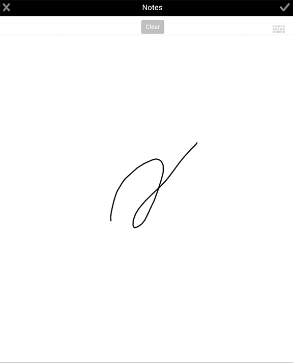

# 첨부 파일 추가{#adding-attachments}

## AEM Forms Workflow Server(JEE의 AEM Forms)과 동기화된 양식에 첨부 파일 추가 {#adding-annotations}

AEM Forms 앱을 사용하면 AEM Forms JEE 서버와 동기화된 양식에 이미지, 낙서 메모 및 텍스트 노트를 첨부할 수 있습니다. AEM Forms Workflow 서버에서 양식을 불러오면 첨부 파일이 양식에 추가됩니다. 첨부 파일 버튼 을 탭하여 양식의 모든 첨부 파일을 함께 볼 수 있습니다. 빨간색 알림은 양식의 첨부 파일 수를 지정합니다. 양식에 첨부 파일이 없으면 빨간색 알림 단추를 볼 수 없습니다. 양식에 첨부 파일이 없는 경우 첨부 파일 단추 를 누르면 사진 또는 낙서를 첨부할 수 있는 옵션이 표시됩니다.

옵션은 다음과 같습니다.

* **갤러리**:장치에 저장된 그림에서 사진을 추가할 수 있습니다.

* **카메라**:사진을 찍어 양식에 추가할 수 있습니다.

* **참고**:스크리블 또는 텍스트 메모를 추가할 수 있습니다. 를 사용하여 낙서를 추가하고 를 사용하여 텍스트 노트를 추가합니다.

>[!NOTE]
>
>한 사용자가 추가한 첨부 파일은 다른 AEM Forms 앱 사용자가 볼 수 있습니다. 다른 사용자는 사용자가 추가한 첨부 파일을 삭제할 수 없습니다.

### 첨부 파일 화면 {#the-attachments-screen}

한 위치에 모든 첨부 파일을 보려면 을(를) 탭합니다. 여기에서 첨부 파일을 추가, 이름 변경 및 삭제할 수 있습니다.

첨부 파일 화면에서 **+** 단추를 사용하여 다른 그림, 문지르기 또는 텍스트를 첨부할 수 있습니다.

### 사진 {#adding-a-photograph} 추가

모바일 장치의 카메라를 사용하거나 장치에 저장된 사진을 사용하여 양식에 사진을 첨부할 수 있습니다.

1. 창 아래쪽에 있는 첨부 단추 를 누릅니다.
1. 나타나는 팝업에서 **갤러리** 또는 **카메라**&#x200B;를 누릅니다.
1. 선택한 옵션에 따라 다음을 수행합니다.

   1. **카메라**&#x200B;를 선택하는 경우.

      사진을 찍으세요. 그런 다음 **사용**  단추를 누릅니다.

      또는 **다시 시작**  단추를 눌러 사진을 다시 선택합니다.

   1. **갤러리**&#x200B;를 선택하는 경우.

      장치의 이미지 브라우저가 표시됩니다. 장치의 사진 브라우저에서 첨부할 사진을 누릅니다.

### 참고 {#adding-a-note} 추가

**메모** 옵션을 사용하면 양식에 자유 글리프 및 텍스트 첨부 파일을 추가할 수 있습니다.

1. 창 아래쪽에 있는 첨부 단추 를 누릅니다.
1. 나타나는 팝업에서 **노트**&#x200B;를 누릅니다.
1. 시작한 노트 사용자 인터페이스에서 자유롭게 자유롭게 문지할 수 있습니다.

   

   문지르기

   자유 인터페이스에서 다음 옵션을 사용할 수 있습니다.

   * **지우기**:화면을 지웁니다.
   * **완료 단추**:현재 낙서를 첨부합니다.
   * **취소 단추**:현재 낙서를 무시하고 자유 사용자 인터페이스를 종료합니다.
   * :스크리블을 지우고 텍스트 노트를 추가할 수 있습니다.

   

## AEM Forms 워크플로우 없이 AEM Forms 서버와 동기화된 양식의 첨부 파일(OSGi의 AEM Forms) {#attachments-in-forms-synced-with-the-aem-forms-servers-without-aem-forms-workflow-aem-forms-on-osgi}

AEM Forms OSGi 서버와 동기화된 모바일 양식의 첨부 파일은 AEM Forms JEE 서버와 비슷하게 작동합니다.

양식 수준 첨부 파일은 AEM Forms OSGi 서버에서 앱에 로드된 적응형 양식에 대해 지원되지 않습니다. 이미지 또는 텍스트 노트를 첨부하려면 작성 시 양식의 필드 수준 첨부 파일을 활성화합니다. 필드의 구성 요소 브라우저에서 첨부 파일 구성 요소를 드래그하여 놓습니다.

적응형 양식의 경우 첨부 파일을 레코드 문서(DoR)로 볼 수 있습니다. XFA가 아닌 응용 양식에 대해서는 [기록 문서 생성](../../forms/using/generate-document-of-record-for-non-xfa-based-adaptive-forms.md)을 참조하십시오.
