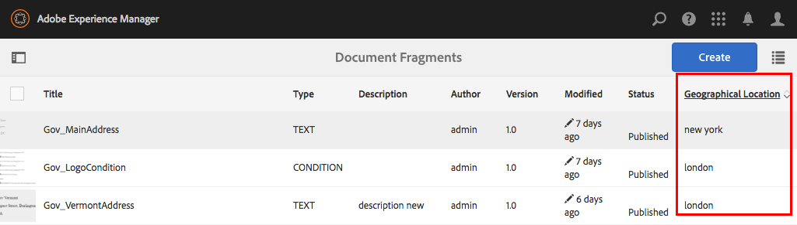

# 메일 관리 자산에 사용자 지정 속성 추가{#add-custom-properties-to-correspondence-management-assets}

## 개요 {#overview}

통신 관리 사용자 인터페이스를 사용자 정의하고 사용자 정의 속성 및 탭을 표시할 수 있습니다. 이러한 사용자 지정 기능에는 특정 자산 유형/문자 또는 모든 자산 유형 및 문자에 사용자 지정 필드/속성 및 탭을 추가하는 기능이 포함됩니다.

## 메일 관리 자산 {#adding-custom-properties-to-correspondence-management-assets}에 사용자 지정 속성 추가

다음 시나리오에서는 통신 관리 자산 및 서신에 속성/탭을 추가할 수 있는 방법을 보여줍니다.

* 모든 자산 유형에 공통 속성 추가
* 모든 자산 유형에 공통 탭 추가
* 특정 자산 유형에 사용자 지정 속성 추가

이러한 시나리오에서 속성, 경로 및 값을 수정함으로써 요구 사항에 따라 사용자 정의 속성 및 탭을 다른 자산 세트에 추가할 수 있습니다.

### 시나리오:모든 자산 유형 {#scenario-adding-a-common-field-property-to-all-the-asset-types}에 공통 필드(속성) 추가

이 시나리오는 사용자 지정 속성을 모든 자산 유형(텍스트, 목록, 조건 및 레이아웃 조각)과 글자에 추가하는 방법을 보여줍니다. 이 시나리오를 사용하면 모든 자산 및 서신에 수신자의 위치 속성을 추가할 수 있습니다. [받는 사람 위치] 속성은 자산 또는 서신이 어느 지역과 관련이 있는지 식별하는 데 도움이 됩니다.

>[!NOTE]
>
>사용자 지정 속성을 이미 추가한 경우 자산 생성 페이지에 속성이 나타납니다. 이러한 속성을 숨기려면 자산 만들기 및 속성 페이지에서 사용자 지정 속성 표시/숨기기를 참조하십시오.


다음 단계를 완료하여 모든 에셋 유형과 글자에 사용자 지정 속성을 추가합니다.

1. `https://'[server]:[port]'/[ContextPath]/crx/de`으로 이동하여 관리자로 로그인합니다.
1. 앱 폴더에서 다음 단계를 사용하여 css 폴더(ccrui 폴더에 있음)와 유사한 경로/구조가 있는 css 폴더를 만듭니다.

   1. 다음 경로에서 항목 폴더를 마우스 오른쪽 단추로 클릭하고 **오버레이 노드**&#x200B;를 선택합니다.

      `/libs/fd/cm/ma/gui/content/cmmetadataproperties/commonproperties/col1/items`

      

   1. [오버레이 노드] 대화 상자에 다음 값이 있는지 확인합니다.

      **경로:** /libs/fd/cm/ma/gui/content/cmmetadataproperties/commonproperties/col1/items

      **위치:** /apps/

      **노드 유형 일치:** 선택됨

      

   1. **확인**&#x200B;을 클릭합니다. 폴더 구조는 앱 폴더에 생성됩니다.

   1. **모두 저장**&#x200B;을 클릭합니다.

1. 새로 만든 항목 폴더 아래에서 모든 자산의 사용자 지정 속성에 대한 노드를 추가합니다(예:GeoLocation) 다음 단계를 사용합니다.

   1. 항목 폴더를 마우스 오른쪽 단추로 클릭하고 **만들기** > **노드 만들기**&#x200B;를 선택합니다.

      

   1. 노드 만들기 대화 상자에 다음 값이 있는지 확인하고 **확인**&#x200B;을 클릭합니다.

      **이름:** GeoLocation(또는 이 속성에 지정할 이름)

      **문자:** nt:unstructured

      

   1. 만든 새 노드(여기에서 GeoLocation)를 클릭합니다. CRX에 노드의 속성이 표시됩니다.
   1. 노드에 다음 속성을 추가합니다(여기서 GeoLocation).

      | **이름** | **유형** | **값** |
      |---|---|---|
      | fieldLabel | 문자열 | 필드/속성을 지정할 이름입니다. (여기:수신자의 위치) |
      | 이름 | 문자열 | `./extendedproperties/GeoLocation` (값을 항목 노드 아래에 만든 필드 이름과 동일하게 유지) |
      | renderReadOnly | 부울 | true |
      | sling:resourceType | 문자열 | `granite/ui/components/coral/foundation/form/textfield` |

   1. **모두 저장**&#x200B;을 클릭합니다.

1. 사용자 지정을 보려면 자산(텍스트, 목록, 조건 또는 레이아웃 조각) 또는 문자 위에 마우스를 놓고 **속성 보기**&#x200B;를 클릭한 다음 **편집**&#x200B;을 클릭합니다. 새 필드(받는 사람의 위치)는 자산/문자 속성의 기본 탭에 표시됩니다.

   >[!NOTE]
   >
   >사용자 지정이 UI에 표시되기 전에 브라우저 캐시를 지워야 할 수 있습니다.

   

   >[!NOTE]
   >
   >추가한 모든 자산에 대한 공통 속성은 자산 속성의 기본 탭에 표시됩니다. 기본적으로 모든 자산에 대해 추가된 공통 속성은 자산 만들기 페이지뿐만 아니라 속성 페이지에 표시됩니다. 공통 속성을 숨기려면 <!--link to show / hide properties]-->이(가) 필요합니다.

### 시나리오:사용자 지정 드롭다운 및 값을 사용자 지정 속성/필드 {#scenario-add-custom-drop-down-and-values-to-a-custom-property-field}에 추가

이 시나리오는 사용자 지정 속성을 모든 자산 유형에 추가하고 드롭다운 값을 추가하는 방법을 보여줍니다.

1. 다음 경로에서 항목 폴더를 마우스 오른쪽 단추로 클릭하고 **오버레이 노드**&#x200B;를 선택합니다.

   `/libs/fd/cm/ma/gui/content/cmmetadataproperties/commonproperties/col1/items`

1. 새로 만든 오버레이 노드(/apps/fd/cm/ma/gui/content/cmmetadataproperties/commonproperties/col1/items) 아래
nt:unstructured 유형의 드롭다운(여기서 `geographicallocation`)을 생성해야 하는 각 속성(필드)의 노드를 만듭니다.
1. 노드에 다음 속성을 추가하고(여기서 지리적 할당) **모두 저장**&#x200B;을 클릭합니다.

   <table>
   <tbody>
   <tr>
      <td><strong>이름</strong></td>
      <td><strong>유형</strong></td>
      <td><strong>값</strong></td>
   </tr>
   <tr>
      <td>fieldLabel</td>
      <td>문자열</td>
      <td>필드/속성을 지정할 이름입니다. (여기:지리적 할당</td>
   </tr>
   <tr>
      <td>이름</td>
      <td>문자열</td>
      <td>./extendproperties/geographicallocation(값을 항목 노드 아래에 만든 필드 이름과 동일하게 유지)</td>
   </tr>
   <tr>
      <td>renderReadOnly</td>
      <td>부울</td>
      <td>true</td>
   </tr>
   <tr>
      <td>sling:resourceType</td>
      <td>문자열</td>
      <td>granite/ui/components/coral/foundation/form/select<br /> </td>
   </tr>
   </tbody>
   </table>

1. 속성 노드(여기지리적 할당)에서 이름이 `items`인 새 노드를 추가합니다. 항목 노드 아래에서 드롭다운에 있는 값에 대해 각 노드를 추가합니다. 드롭다운의 기본값으로 사용할 첫 번째 노드를 공백으로 추가하고 사용자가 필드에 값을 지정하지 않도록 하는 옵션을 지정하는 것이 좋습니다. 여러 옵션/드롭다운 값을 추가하려면 다음 단계를 반복합니다.

   1. 속성 노드(위치 지리적 할당)를 마우스 오른쪽 단추로 클릭하고 **만들기** > **노드 만들기**&#x200B;를 선택합니다.
   1. `item1,` 유형이 nt:unstructured로 유지되도록 필드 이름을 입력하고 **확인**&#x200B;을 클릭합니다.
   1. 새로 만든 노드(here item1)에 다음 속성을 추가한 다음 **모두 저장**&#x200B;을 클릭합니다.

      <table>
         <tbody>
         <tr>
          <td><strong>이름</strong></td>
          <td><strong>유형</strong></td>
          <td><strong>값</strong></td>
         </tr>
         <tr>
          <td>text</td>
          <td>문자열</td>
          <td>사용자가 볼 수 있는 드롭다운 옵션의 값입니다. 빈(기본값) 값을 비워 두거나 <strong>International</strong> 또는 <strong>Within US</strong>.<br /> </td>
         </tr>
         <tr>
          <td>정렬 단추</td>
          <td>문자열</td>
          <td>텍스트의 CRXDE에 저장된 값입니다. 고유한 키워드를 입력합니다.<br /> </td>
         </tr>
         </tbody>
   </table>

   

사용자 지정 드롭다운은 자산 속성에 다음과 같이 표시됩니다.


### 시나리오:모든 자산 유형 {#scenario-common-tab-for-all-asset-types}에 대한 공통 탭

이 시나리오는 사용자 지정 탭, 수신자를 모든 자산 유형(텍스트, 목록, 조건 및 레이아웃 조각)과 글자에 추가하는 방법을 보여줍니다. 수신자 탭에서는 수신자와 관련된 모든 사용자 지정 속성을 배치할 수 있습니다.


다음 절차를 사용하여 필드가 있는 탭을 모든 자산에 추가할 수 있습니다.

1. `https://'[server]:[port]'/[ContextPath]/crx/de`으로 이동하여 관리자로 로그인합니다.
1. apps 폴더에서 다음 단계를 사용하여 경로/구조가 cmmetadataproperties 폴더(콘텐트 폴더에 있음)와 유사한 cmmetadataproperties라는 폴더를 만듭니다.

   1. 다음 경로에서 cmmetadataproperties 폴더를 마우스 오른쪽 단추로 클릭하고 **오버레이 노드**&#x200B;를 선택합니다.

      `/libs/fd/cm/ma/gui/content/cmmetadataproperties`

      

   1. [오버레이 노드] 대화 상자에 다음 값이 있는지 확인합니다.

      **경로:** /libs/fd/cm/ma/gui/content/cmmetadataproperties

      **위치:** /apps/

      **노드 유형 일치:** 선택됨

   1. **확인**&#x200B;을 클릭합니다. 폴더 구조는 앱 폴더에 생성됩니다.

      

      **모두 저장**&#x200B;을 클릭합니다.

1. commetadataproperties 폴더 아래에서 모든 자산에 대한 사용자 정의 탭을 만들기 위한 노드를 추가합니다(예:[일반] 탭 사용):

   1. cmmetadataproperties 폴더를 마우스 오른쪽 단추로 클릭하고 **만들기** > **노드 만들기**&#x200B;를 선택합니다.

      

   1. 노드 만들기 대화 상자에 다음 값이 있는지 확인하고 **확인**&#x200B;을 클릭합니다.

      **이름:** commontab(또는 이 속성에 지정할 이름)

      **문자:** nt:unstructured

   1. 생성한 새 노드(여기 공통 탭)를 클릭합니다. CRX에 노드의 속성이 표시됩니다.
   1. 노드에 다음 속성을 추가합니다(여기 공통 탭).

      <table>
         <tbody>
         <tr>
          <td><strong>이름</strong></td>
          <td><strong>유형</strong></td>
          <td><strong>값</strong></td>
         </tr>
         <tr>
          <td>jcr:title</td>
          <td>문자열</td>
          <td>열을 지정할 이름입니다. (여기:받는 사람)</td>
         </tr>
         <tr>
          <td>sling:resourceType</td>
          <td>문자열</td>
          <td>granite/ui/components/coral/foundation/container<br /> </td>
   </tr>
         </tbody>
       </table>

   1. **모두 저장**&#x200B;을 클릭합니다.

1. 마지막 단계에서 생성된 탭 노드(여기 공통 탭)에 대해 다음 단계를 사용하여 항목이라는 노드를 만듭니다.

   1. 관련 노드(여기 공통 탭)를 마우스 오른쪽 단추로 클릭하고 **만들기** > **노드 만들기**&#x200B;를 선택합니다.
   1. 노드 만들기 대화 상자에 다음 값이 있는지 확인하고 **확인**&#x200B;을 클릭합니다.

      **이름:** 항목

      **문자:** nt:unstructured

   1. **모두 저장:**&#x200B;을 클릭합니다.

1. 이전 단계(공통 탭 아래)에서 만든 항목 노드에서 다음 단계를 사용하여(열을 더 추가하려면 이 단계를 반복합니다). 사용자 지정 탭(공통 탭)에서 열을 만들기 위한 노드를 추가합니다(열을 더 추가하려면 이 단계를 반복합니다).

   1. 항목 노드를 마우스 오른쪽 단추로 클릭하고 **만들기** > **노드 만들기**&#x200B;를 선택합니다.
   1. 노드 만들기 대화 상자에 다음 값이 있는지 확인하고 **확인**&#x200B;을 클릭합니다.

      **이름:** Column1(노드에 지정할 이름 - 이 이름은 사용자 인터페이스에 표시되지 않습니다.)

      **문자:** nt:unstructured

   1. 노드에 다음 속성을 추가한 다음(Here Column1) **모두 저장**&#x200B;을 클릭합니다.

      <table>
         <tbody>
         <tr>
           <td><strong>이름</strong></td>
           <td><strong>유형</strong></td>
           <td><strong>값</strong></td>
         </tr>
         <tr>
           <td>sling:resourceType</td>
           <td>문자열</td>
           <td>granite/ui/components/coral/foundation/container<br /> </td>
         </tr>
         </tbody>
       </table>

1. 이전 단계에서 생성한 노드(여기 열1)에서 다음 단계를 사용하여 항목이라는 노드를 추가합니다.

   1. 노드를 마우스 오른쪽 단추로 클릭하고(여기 Column1) **만들기** > **노드 만들기**&#x200B;를 선택합니다.
   1. 노드 만들기 대화 상자에 다음 값이 있는지 확인하고 **확인**&#x200B;을 클릭합니다.

      **이름:** 항목

      **문자:** nt:unstructured

   1. **모두 저장**&#x200B;을 클릭합니다.

1. 사용자 지정 탭(여기서 수신자)에서 필드를 만들려면 노드(여기서 GeographicLocation)를 추가합니다. 이 속성은 만든 열에 해당합니다. 다음 단계를 사용하여 필드를 만듭니다(더 많은 필드/노드를 만들려면 이 단계를 반복합니다.).:

   1. 항목 노드를 마우스 오른쪽 단추로 클릭하고 **만들기** > **노드 만들기**&#x200B;를 선택합니다.
   1. 노드 만들기 대화 상자에 다음 값이 있는지 확인하고 **확인**&#x200B;을 클릭합니다.

      **이름:** GeographicLocation(또는 필드 속성의 다른 이름)

      **문자:** nt:unstructured

   1. 필드 노드(여기서 GeographicLocation)에 다음 속성을 추가하고 **모두 저장**&#x200B;을 클릭합니다.

      | **이름** | **유형** | **값** |
      |---|---|---|
      | fieldLabel | 문자열 | 받는 사람의 위치(또는 필드를 부여할 이름). |
      | 이름 | 문자열 | ./extendproperties/GeographyLocation |
      | renderReadOnly | 부울 | true |
      | sling:resourceType | 문자열 | `/libs/granite/ui/components/coral/foundation/form/textfield` |

1. [문자]에 이 탭을 추가하려면 다음 경로의 다음 항목 폴더와 유사한 경로/구조가 있는 오버레이 폴더를 만드십시오.

   `/libs/fd/cm/ma/gui/content/cmmetadataproperties/properties/letter/items/tabs/items`

   문자 또는 다른 자산에 대한 오버레이를 만들려면 [assettype]을 텍스트, 조건, 목록, 데이터 사전 또는 조각으로 대체하여 다음 경로를 사용합니다.

   `/libs/fd/cm/ma/gui/content/cmmetadataproperties/properties/[assettype]/items/tabs/items`

   1. 다음 경로에서 항목 폴더를 마우스 오른쪽 단추로 클릭하고 **오버레이 노드**&#x200B;를 선택합니다.

      `/libs/fd/cm/ma/gui/content/cmmetadataproperties/properties/letter/items/tabs/items`

   1. [오버레이 노드] 대화 상자에 다음 값이 있는지 확인합니다.

      **경로:** `/libs/fd/cm/ma/gui/content/cmmetadataproperties/properties/letter/items/tabs/items`

      **위치:** /apps/

      **노드 유형 일치:** 선택됨

   1. **확인**&#x200B;을 클릭합니다. 폴더가 생성됩니다. **모두 저장**&#x200B;을 클릭합니다.

1. 새로 만든 항목 폴더에서 다음 단계를 사용하여 자산의 사용자 정의 탭에 대한 노드를 추가합니다(여기 mytab - 이 이름은 사용자 인터페이스에 표시되지 않음).

   1. 항목 폴더를 마우스 오른쪽 단추로 클릭하고 **만들기** > **노드 만들기**&#x200B;를 선택합니다.
   1. 노드 만들기 대화 상자에 다음 값이 있는지 확인하고 **확인**&#x200B;을 클릭합니다.

      **이름:** mytab(또는 이 속성에 지정할 이름)

      **문자:** nt:unstructured

   1. 만든 새 노드(여기 mytab)를 클릭합니다. CRX에 노드의 속성이 표시됩니다.
   1. 노드에 다음 2개의 속성을 추가합니다(여기서 customtab).

      <table>
         <tbody>
         <tr>
           <td><strong>이름</strong></td>
           <td><strong>유형</strong></td>
           <td><strong>값</strong></td>
         </tr>
         <tr>
           <td>경로<br /> </td>
           <td>문자열</td>
           <td>fd/cm/ma/gui/content/cmmetadataproperties/commontab<br /> </td>
         </tr>
         <tr>
           <td>sling:resourceType</td>
           <td>문자열</td>
           <td>granite/ui/components/coral/foundation/include<br /> </td>
         </tr>
         </tbody>
       </table>

   1. **모두 저장**&#x200B;을 클릭합니다.

1. 사용자 지정을 보려면 관련 에셋(여기에 글자 한 장)을 가리키고 속성 보기를 클릭한 다음 **편집**&#x200B;을 클릭합니다. 사용자 인터페이스에 새 탭(수신자) 및 필드(수신자 위치)가 표시됩니다.

   >[!NOTE]
   >
   >사용자 지정이 UI에 표시되기 전에 브라우저 캐시를 지워야 할 수 있습니다.

   

### 시나리오:특정 자산 유형 {#scenario-adding-custom-properties-for-specific-asset-types}에 대한 사용자 지정 속성 추가

이 시나리오는 모든 텍스트 자산에 대한 필드와 같이 특정 자산 유형에 속성을 추가할 수 있는 방법을 보여줍니다. 이 프로세스를 사용하여 다음 중 하나에 속성을 추가할 수 있습니다.

* 텍스트
* 조건
* 목록
* 레이아웃 단편
* 데이터 사전
* 편지

예를 들어 텍스트 자산에만 해당하는 자산의 위치 속성을 추가하여 자산이 관련된 지리적 영역을 식별할 수 있습니다.  

자산 유형에 속성을 추가하려면 다음 단계를 완료하십시오.

1. `https://'[server]:[port]'/[ContextPath]/crx/de`으로 이동하여 관리자로 로그인합니다.
1. 자산 유형(예: 텍스트)에서 탭을 만들려면 앱 폴더에 다음 폴더 구조를 만듭니다.

   `/libs/fd/cm/ma/gui/content/cmmetadataproperties/properties/[AssetType]/items/tabs/items`

   [AssetType] = 텍스트, 조건, 목록, 문자, 데이터 사전 또는 조각

   이 폴더 구조를 만드는 단계는 다음과 같습니다.

   1. 다음 경로에서 항목 폴더를 마우스 오른쪽 단추로 클릭하고 **오버레이 노드**&#x200B;를 선택합니다.

      `/libs/fd/cm/ma/gui/content/cmmetadataproperties/properties/[AssetType]/items/tabs/items`

      예를 들어 텍스트 자산에 대한 속성을 만들려면 다음 폴더를 선택합니다.

      `/libs/fd/cm/ma/gui/content/cmmetadataproperties/properties/text/items/tabs/items`

      

   1. [오버레이 노드] 대화 상자에 다음 값이 있는지 확인합니다.

      **경로:** /libs/fd/cm/ma/gui/content/cmmetadataproperties/properties/[AssetType]/items/tab/items

      **위치:** /apps/

      **노드 유형 일치:** 선택됨

   1. **확인**&#x200B;을 클릭합니다. 폴더 구조는 앱 폴더에 생성됩니다.

      **모두 저장**&#x200B;을 클릭합니다.

1. 새로 만든 항목 폴더에서 자산의 사용자 지정 탭에 대한 노드를 추가합니다(예:사용자 지정 탭)에서 다음 단계를 수행합니다.

   1. 항목 폴더를 마우스 오른쪽 단추로 클릭하고 **만들기** > **노드 만들기**&#x200B;를 선택합니다.
   1. 노드 만들기 대화 상자에 다음 값이 있는지 확인하고 **확인**&#x200B;을 클릭합니다.

      **이름:** 사용자 지정 탭(또는 이 속성에 지정할 이름)

      **문자:** nt:unstructured

   1. 생성한 새 노드(여기에서 사용자 정의 탭)를 클릭합니다. CRX에 노드의 속성이 표시됩니다.
   1. 노드에 다음 2개의 속성을 추가합니다(여기서 customtab).

      | **이름** | **유형** | **값** |
      |---|---|---|
      | sling:resourceType | 문자열 | granite/ui/components/coral/foundation/container |
      | jcr:title | 문자열 | 사용자 인터페이스의 필드 이름(내 탭) |

   1. **모두 저장**&#x200B;을 클릭합니다.

1. 이전 단계에서 생성한 노드(여기에서 사용자 정의 탭)에서 다음 단계를 사용하여 항목 노드를 추가합니다.

   1. 노드를 마우스 오른쪽 단추로 클릭하고(여기 사용자 지정 탭) **만들기** > **노드 만들기**&#x200B;를 선택합니다.
   1. 노드 만들기 대화 상자에 다음 값이 있는지 확인하고 **확인**&#x200B;을 클릭합니다.

      **이름:** 항목

      **문자:** nt:unstructured

   1. **모두 저장**&#x200B;을 클릭합니다.

1. 이전 단계(사용자 정의 탭 아래)에서 만든 항목 노드에서 다음 단계를 사용하여 사용자 정의 탭에 열을 만들기 위한 노드(열1 위치)를 추가합니다(열을 더 추가하려면 이 단계를 반복합니다).

   1. 항목 노드를 마우스 오른쪽 단추로 클릭하고 **만들기** > **노드 만들기**&#x200B;를 선택합니다.
   1. 노드 만들기 대화 상자에 다음 값이 있는지 확인하고 **확인**&#x200B;을 클릭합니다.

      **이름:** Column1(또는 노드에 지정할 이름)

      **문자:** nt:unstructured

   1. 다음 속성을 노드에 추가한 다음(Here Column1) **모두 저장**&#x200B;을 클릭합니다.

      <table>
         <tbody>
         <tr>
           <td><strong>이름</strong></td>
           <td><strong>유형</strong></td>
           <td><strong>값</strong></td>
         </tr>
         <tr>
           <td>sling:resourceType</td>
           <td>문자열</td>
           <td>granite/ui/components/coral/foundation/container<br /> </td>
         </tr>
         </tbody>
       </table>

1. 생성하는 각 열(이전 단계에서 지정한 대로 - 여기 열1)에 대해 다음 단계를 사용하여 항목이라는 노드를 만듭니다.

   1. 관련 열 노드(여기 Column1)를 마우스 오른쪽 단추로 클릭하고 **만들기** > **노드 만들기**&#x200B;를 선택합니다.
   1. 노드 만들기 대화 상자에 다음 값이 있는지 확인하고 **확인**&#x200B;을 클릭합니다.

      **이름:** 항목

      **문자:** nt:unstructured

   1. **모두 저장:**&#x200B;을 클릭합니다.

1. 만들어진 각 열에 대해 항목 노드 아래에 노드를 만들어 사용자 인터페이스의 새 탭에 필드를 만듭니다. 이 단계를 반복하여 열에 더 많은 필드를 만듭니다.

   1. 관련 노드(열1 아래의 항목)를 마우스 오른쪽 단추로 클릭하고 **만들기** > **노드 만들기**&#x200B;를 선택합니다.
   1. 노드 만들기 대화 상자에 다음 값이 있는지 확인하고 **확인**&#x200B;을 클릭합니다.

      **이름:** 선택한 이름(GeoLocation)

      **문자:** nt:unstructured

   1. 다음 속성을 노드에 추가한 다음 **모두 저장**&#x200B;을 클릭합니다.

      | **이름** | **유형** | **값** |
      |---|---|---|
      | fieldLabel | 문자열 | 받는 사람의 위치(또는 필드를 부여할 이름). |
      | 이름 | 문자열 | `./extendedproperties/GeoLocation` |
      | renderReadOnly | 부울 | true |
      | sling:resourceType | 문자열 | granite/ui/components/coral/foundation/form/textfield |

1. 사용자 지정을 보려면 관련 자산(텍스트 위치)을 마우스로 가리키고 속성 보기를 클릭한 다음 **편집**&#x200B;을 클릭합니다. 새 탭 및 필드(수신자 위치)가 사용자 인터페이스에 표시됩니다.

   >[!NOTE]
   >
   >사용자 지정이 UI에 표시되기 전에 브라우저 캐시를 지워야 할 수 있습니다.

   

### 자산 생성 페이지 {#display-custom-properties-on-the-asset-creation-page}에 사용자 지정 속성 표시

기본적으로 새 탭에 추가된 사용자 지정 속성은 자산 생성 페이지에 탭 레이아웃이 없으므로 속성 페이지에서만 볼 수 있고 자산 생성 페이지에는 표시되지 않습니다. 자산 만들기 페이지에 다른 속성과 함께 사용자 지정 속성을 표시하려면 다음을 수행해야 합니다.

1. 다음 경로에서 항목 폴더를 마우스 오른쪽 단추로 클릭하고 **오버레이 노드**&#x200B;를 선택합니다.

   `/libs/fd/cm/ma/gui/content/createasset/createletter/jcr:content/body/items/form/items/letterWizard/items/properties/items/properties/items/letterproperties/items`

1. [오버레이 노드] 대화 상자의 문자 값은 다음과 같습니다. 다른 자산 유형의 경우 경로는 다음 표에 지정되어 있습니다.

   **경로:** /libs/fd/cm/gui/content/createasset/createletter/jcr:content/body/items/form/items/letterWizard/properties/properties/properties/items/properties/items/letterproperties/items/letterproperties/items/items

   **위치:** /apps/

   **노드 유형 일치:** 선택됨

   자산 유형에 따라 경로는 다음과 같아야 합니다.

   | **에셋/문서 유형** | **추가할 경로** |
   |---|---|
   | 텍스트 | /libs/fd/cm/content/createset/creattetext/jcr:content/body/items/form/items/textwizard/items/editproperties/items/properties/items/items/items/tab/tab1/items |
   | 목록 | /libs/fd/cm/content/createasset/createlist/jcr:content/body/items/form/items/listwizard/items/editproperties/items/properties/items/items/items/items/tab/tab1/items |
   | 조건 | /libs/fd/cm/content/createset/createcondition/jcr:content/body/items/form/conditionwizard/items/editproperties/items/properties/items/items/items/tab/tab1/items |
   | 조각 | /libs/fd/cm/content/createasset/createfragment/jcr:content/body/items/form/items/fragmentwizard/items/properties/items/properties/items/items/items/items/items/items/tab2/items/tab1/items |
   | 편지 | /libs/fd/cm/content/createasset/createletter/jcr:content/body/items/form/items/letterWizard/items/properties/items/properties/items/items/letterproperties/items/letterproperties/items/letterproperties/items/items |

1. **확인**&#x200B;을 클릭합니다. 폴더 구조는 앱 폴더에 생성됩니다.

1. 만든 오버레이 항목 노드에서 col4(또는 다른 이름)의 노드를 만들고 **모두 저장**&#x200B;을 클릭합니다.

   예를 들어, 다음은 글자에 대해 만들어진 오버레이 노드입니다.

   `/apps/fd/cm/ma/gui/content/createasset/createletter/jcr:content/body/items/form/items/letterWizard/items/properties/items/properties/items/letterproperties/items`

1. 새로 만든 노드(여기 col4)에 다음 속성을 추가하고 **모두 저장**&#x200B;을 클릭합니다.

<table>
 <tbody>
  <tr>
   <td><strong>이름</strong></td>
   <td><strong>유형</strong></td>
   <td><strong>값</strong></td>
  </tr>
  <tr>
   <td>경로</td>
   <td>문자열</td>
   <td><p>이 경로는</p>
    <ul>
     <li>모든 자산 유형에 대한 공통 탭의 경우:/apps/fd/cm/ma/gui/content/cmmetadataproperties/commontab/items/col1</li>
     <li>다양한 자산 유형에 대한 다른 속성의 경우:/apps/fd/cm/gui/content/cmmetadataproperties/properties//items/tabs/items/customtab/items/col1</li>
    </ul> </td>
  </tr>
  <tr>
   <td>sling:resourceType</td>
   <td>문자열</td>
   <td> granite/ui/components/coral/foundation/include<br /> </td>
  </tr>
 </tbody>
</table>


사용자 지정 속성, 언어, 문자 작성을 위해 UI에 표시

## 사용자 지정 속성 {#customize-the-list-view-to-show-custom-properties}을 표시하도록 목록 보기를 사용자 정의합니다.

사용자 지정 속성을 메일 관리 자산에 추가한 후 CRX/DE를 추가로 변경하여 사용자 지정 속성이 메일 관리 UI에 표시되도록 해야 합니다.

메일 관리의 자산 목록 UI에 사용자 지정 속성을 표시하려면 다음 단계를 완료하십시오.

1. `https://'[server]:[port]'/[ContextPath]/crx/de`으로 이동하여 관리자로 로그인합니다.
1. 앱 폴더에 다음 폴더 구조를 만듭니다.

   `/libs/fd/cm/ma/gui/content/cmassets/jcr:content/views/lists/columns`

   이 폴더 구조를 만드는 단계는 다음과 같습니다.

   1. 다음 경로의 열 폴더를 마우스 오른쪽 단추로 클릭하고 **오버레이 노드**&#x200B;를 선택합니다.

      `/libs/fd/cm/ma/gui/content/cmassets/jcr:content/views/lists/columns`

   1. [오버레이 노드] 대화 상자에 다음 값이 있는지 확인합니다.

      **경로:** /libs/fd/cm/ma/gui/content/csets/jcr:content/views/lists/columns

      **위치:** /apps/

      **노드 유형 일치:** 선택됨

   1. **확인**&#x200B;을 클릭합니다. 폴더 구조는 앱 폴더에 생성됩니다.

      **모두 저장**&#x200B;을 클릭합니다.

1. 생성된 각 속성에 대해 열 노드 아래에 노드를 만들어 사용자 인터페이스에서 열을 생성합니다. UI에 열을 더 만들려면 이 단계를 반복합니다.

   1. 관련 노드(열)를 마우스 오른쪽 단추로 클릭하고 **만들기** > **노드 만들기**&#x200B;를 선택합니다.
   1. 노드 만들기 대화 상자에 다음 값이 있는지 확인하고 **확인**&#x200B;을 클릭합니다.

      **이름:** 선택한 이름(여기서 GeographicLocation)

      **문자:** nt:unstructured

   1. 다음 속성을 노드에 추가한 다음 **모두 저장**&#x200B;을 클릭합니다.

      <table>
         <tbody>
         <tr>
           <td><strong>이름</strong></td>
           <td><strong>유형</strong></td>
           <td><strong>값</strong></td>
         </tr>
         <tr>
           <td>jcr:primaryType</td>
           <td>이름</td>
           <td><p>nt:unstructured</p> </td>
         </tr>
         <tr>
           <td>jcr:title</td>
           <td>문자열</td>
           <td><p>지리적 위치</p> <p>이 값은 UI에 열 머리글로 나타납니다. </p> </td>
         </tr>
         <tr>
           <td>정렬 가능</td>
           <td>부울</td>
           <td><p>true</p> <p>true 값은 사용자가 이 열의 값을 정렬할 수 있음을 의미합니다. </p> </td>
         </tr>
         </tbody>
       </table>

1. 앱 폴더에 다음 폴더 구조를 만듭니다.

   `/libs/fd/cm/ma/gui/components/admin/childpagerenderer/childlistpage`

   이 폴더 구조를 만드는 단계는 다음과 같습니다.

   1. 다음 경로의 열 폴더를 마우스 오른쪽 단추로 클릭하고 **오버레이 노드**&#x200B;를 선택합니다.

      `/libs/fd/cm/ma/gui/components/admin/childpagerenderer/childlistpage`

   1. [오버레이 노드] 대화 상자에 다음 값이 있는지 확인합니다.

      **경로:** /libs/fd/cm/ma/gui/components/admin/childpagenderer/chillistpage

      **위치:** /apps/

      **노드 유형 일치:** 선택됨

   1. **확인**&#x200B;을 클릭합니다. 폴더 구조는 앱 폴더에 생성됩니다.

      **모두 저장**&#x200B;을 클릭합니다.

1. 다음 위치에서 childlist page.jsp 파일을 복사합니다.

   /libs/fd/cm/ma/gui/components/admin/childpagerenderer/childlistpage/childlistpage.jsp

   다음 위치에 파일을 붙여 넣습니다.

   /apps//fd/cm/ma/gui/components/admin/childpagenderer/chillistpage/.

1. childlistpage.jsp 파일(/apps/fd/cm/ma/gui/components/admin/childpagerenderer/childlistpage/childlistpage.jsp)을 열고 다음 사항을 변경합니다.

   1. 파일의 19행에 다음을 추가합니다(저작권 설명 다음에 있음).

      ```jsp
      <%@page import="java.util.Map"%>
      ```

   1. 각 사용자 지정 속성의 값을 파일 끝에 가져오는 함수의 다음 코드를 추가합니다.

      ```jsp
      <%!
          private String getCustomPropertyValue(Map<String, Object> extendedProperties, String propertyName) {
      
              String propertyValue = "";
              if (extendedProperties.containsKey(propertyName)) {
                  propertyValue = (String) extendedProperties.get(propertyName);
              }
      
              return propertyValue;
          }
      %>
      ```

   1. &lt;tr> 태그(&lt;tr &lt;%= attrs.build() %>)의 시작 앞에 다음을 추가합니다.

      ```jsp
      <%
          String GeoLocation = "";
          if (asset != null) {
                  Map<String, Object> extendedProperties = asset.getExtendedProperties();
                  if (extendedProperties != null) {
                      GeoLocation = getCustomPropertyValue(extendedProperties,"GeoLocation");
                  }
          }
      %>
      ```

      코드에서 GeoLocation은 사용자 지정 노드/필드를 만드는 동안 name 속성에 설정한 값입니다. 사용자 지정 노드/필드를 만드는 동안 속성 이름을 로 지정합니다./extendproperties/ 접두사:./extendproperties/GeoLocation. 코드에서 접두어는 필수가 아닙니다.

   1. UI에 새 속성을 표시하려면 닫는 tr(&lt;/tr>) 태그 앞에 다음과 같이 TD 태그를 추가합니다.

      ```jsp
      <td is="coral-td" value="<%= xssAPI.encodeForHTMLAttr(geographicalLocation) %>"><%= xssAPI.encodeForHTML(geographicalLocation) %></td>
      ```

      열을 더 추가하려면 6.3 및 6.4 단계를 반복합니다.

   1. **모두 저장**&#x200B;을 클릭합니다.

1. 사용자 지정을 보려면 문서 조각의 목록 보기 또는 사용자 정의 속성을 추가한 문자를 엽니다.

   이 절차에서 추가된 UI 열과 속성은 모든 자산 유형에 대해 표시됩니다. 그러나 이러한 속성의 값은 원래 사용자 지정 속성을 추가한 자산 유형에 대해서만 입력하고 표시할 수 있습니다.

   예를 들어 시나리오 사용:텍스트 자산에 사용자 지정 속성을 추가하는 특정 자산 유형에 대한 사용자 지정 속성을 추가하면 텍스트 자산에만 사용자 지정 속성을 입력할 수 있습니다. 그러나 UI에 해당 사용자 지정 속성을 표시하면 모든 자산 유형에 대해 열이 나타납니다.

   

1. (선택 사항) 기본적으로 새 열은 UI의 마지막 열로 표시됩니다. 열을 특정 위치에 표시하려면 열 노드에 다음 속성을 추가하십시오.

<table>
 <tbody>
  <tr>
   <td><strong>이름</strong></td>
   <td><strong>유형</strong></td>
   <td><strong>값</strong></td>
  </tr>
  <tr>
   <td>sling:orderBefore</td>
   <td>문자열</td>
   <td><p>사용자 지정 열이 UI에 표시되어야 하는 경로 "/libs/fd/cm/ma/gui/content/csets/jcr:content/views/list/columns"의 열 노드의 이름입니다.</p> <p>여기에서 [지리적 위치] 열이 [버전] 열 앞(왼쪽)에 나타나도록 하려면 ""/apps/fd/cm/ma/gui/content/csets/jcr:content/views/list/columns/geoLocation" 경로의 GeoLocation 노드에 속성 sling:orderBefore를 추가하고 속성 값을 버전으로 설정합니다.</p> </td>
  </tr>
 </tbody>
</table>

sling:orderBefore 속성을 추가하여 열 위치를 지정할 때 이 절차의 6.4단계에서 지정한 해당 &lt;td> 태그의 순서를 업데이트해야 합니다. 예를 들어 이 경우 지리적 위치의 &lt;td> 태그가 버전 열의 &lt;td> 태그 앞에 배치되도록 해야 합니다.

```xml
<td is="coral-td" value="<%= xssAPI.encodeForHTMLAttr(geographicalLocation) %>"><%= xssAPI.encodeForHTML(geographicalLocation) %></td>
<td is="coral-td" value="<%= xssAPI.encodeForHTMLAttr(version) %>"><%= xssAPI.encodeForHTML(version) %></td>
```

## 사용자 지정 속성 {#enable-search-for-custom-properties} 검색 사용

기본적으로 전체 텍스트 검색에는 CRX/DE를 사용하여 UI에 추가하는 사용자 정의 속성이 포함되지 않습니다.

검색에 사용자 지정 속성을 포함하려면 사용자 지정 속성의 인덱싱을 허용해야 합니다.

사용자 지정 속성 색인화를 허용하려면 다음 단계를 완료하십시오.

1. `https://'[server]:[port]'/[ContextPath]/crx/de`으로 이동하여 관리자로 로그인합니다.
1. `/oak:index/cmLucene`으로 이동하여 그 아래에 **aggregments**&#x200B;라는 노드를 추가합니다.

   1. cmLucene 폴더를 마우스 오른쪽 단추로 클릭하고 **만들기** > **노드 만들기**&#x200B;를 선택합니다.
   1. 노드 만들기 대화 상자에 다음 값이 있는지 확인하고 **확인**&#x200B;을 클릭합니다.

      **이름:** 집계

      **문자:** nt:unstructured

   1. **모두 저장**&#x200B;을 클릭합니다.

1. 새로 만든 집계 폴더 아래에서 노드 cm:resource를 추가합니다. cm:resource 아래에서 include0이라는 노드를 추가합니다.

   1. 집계 폴더를 마우스 오른쪽 단추로 클릭하고 **만들기** > **노드 만들기**&#x200B;를 선택합니다. 노드 만들기 대화 상자에 다음 값이 있는지 확인하고 **확인**&#x200B;을 클릭합니다.

      **이름:** cm:resource

      **문자:** nt:unstructured

   1. cm:resource 폴더를 마우스 오른쪽 단추로 클릭하고 **만들기** > **노드 만들기**&#x200B;를 선택합니다. 노드 만들기 대화 상자에 다음 값이 있는지 확인하고 **확인**&#x200B;을 클릭합니다.

      **이름:** include0

      **문자:** nt:unstructured

   1. 새로 만든 노드를 클릭합니다(여기에 include0). CRX에 노드의 속성이 표시됩니다.
   1. 노드에 다음 속성을 추가합니다(여기에 include0).

      <table>
         <tbody>
         <tr>
           <td><strong>이름</strong></td>
           <td><strong>유형</strong></td>
           <td><strong>값</strong></td>
         </tr>
         <tr>
           <td>경로</td>
           <td>문자열</td>
           <td>extendedProperties<br /> </td>
         </tr>
         </tbody>
       </table>

   1. **모두 저장**&#x200B;을 클릭합니다.

1. 다음 위치의 속성으로 이동하고 그 아래에 노드 위치를 추가합니다.`/oak:index/cmLucene/indexRules/cm:resource/properties`

   검색에 추가할 각 사용자 지정 속성에 대해 이 단계를 반복합니다.

   1. 속성 폴더를 마우스 오른쪽 단추로 클릭하고 **만들기** > **노드 만들기**&#x200B;를 선택합니다.
   1. 노드 만들기 대화 상자에 다음 값이 있는지 확인하고 **확인**&#x200B;을 클릭합니다.

      **이름:** 위치(또는 검색에 추가할 사용자 지정 속성의 이름)

      **문자:** nt:unstructured

   1. 새로 만든 노드(여기 위치)를 클릭합니다. CRX에 노드의 속성이 표시됩니다.
   1. 노드에 다음 속성을 추가합니다(위치).

      | **이름** | **유형** | **값** |
      |---|---|---|
      | 분석 | 문자열 | true |
      | 이름 | 문자열 | extendedProperties/location(또는 검색에 추가할 속성의 이름) |
      | propertyIndex | 부울 | true |
      | useInSuggest | 부울 | true |

   1. **모두 저장**&#x200B;을 클릭합니다.

1. 전체 텍스트 검색에서 사용자 지정 속성 값을 사용하여 관련 에셋을 찾을 수 있습니다.

>[!NOTE]
>
>여전히 검색할 수 없는 경우 색인 문제 때문일 수 있습니다. 다시 색인화하려면 다음 노드로 이동하여 속성 &quot;다시 인덱스&quot;의 값을 true로 변경합니다.
>
>/oak:index/cmLucene&quot; 및 속성 값 변경

## 검색 페이지 {#change-default-view-of-the-search-page} 의 기본 보기 변경

1. `https://'[server]:[port]'/[ContextPath]/crx/de`으로 이동하여 관리자로 로그인합니다.
1. apps 폴더에서 /libs/granite/ui/content/shell/omnisearch/searchresults/singleresults/views에 있는 목록 폴더와 유사한 경로/구조가 있는 목록 폴더를 만듭니다.

   1. 다음 경로에서 항목 폴더를 마우스 오른쪽 단추로 클릭하고 **오버레이 노드**&#x200B;를 선택합니다.

      `/libs/granite/ui/content/shell/omnisearch/searchresults/singleresults/views/list`

   1. [오버레이 노드] 대화 상자에 다음 값이 있는지 확인합니다.

      **경로:** /libs/granite/ui/content/shell/omnisearch/searchresults/singleresults/views/list

      **위치:** /apps/

      **노드 유형 일치:** 선택됨

   1. **확인**&#x200B;을 클릭합니다. 폴더 구조는 앱 폴더에 생성됩니다.

   1. **모두 저장**&#x200B;을 클릭합니다.

1. 새로 만든 노드에서 목록을 추가하고 **모두 저장**&#x200B;을 클릭합니다.

   <table>
   <tbody>
   <tr>
      <td><strong>이름</strong></td>
      <td><strong>유형</strong></td>
      <td><strong>값</strong></td>
   </tr>
   <tr>
      <td>sling:orderBefore<br /> </td>
      <td>문자열</td>
      <td>카드</td>
   </tr>
   </tbody>
   </table>

1. 사용자 지정은 Forms 및 문서, 자산 및 사이트를 비롯한 모든 콘솔에 대한 목록 보기에서 검색 결과를 표시합니다.

## 자산 페이지 {#change-default-view-of-the-assets-page} 의 기본 보기 변경

>[!NOTE]
>
>이러한 단계는 Forms 및 문서, 자산 및 사이트와 같은 모든 콘솔의 기본 보기를 변경합니다.

1. `https://'[server]:[port]'/[ContextPath]/crx/de`으로 이동하여 관리자로 로그인합니다.
1. apps 폴더에서 다음 폴더에 있는 목록 폴더와 유사한 경로/구조가 있는 목록을 만듭니다.

   /libs/fd/cm/ma/gui/content/cmasets/jcr:content/views/

   1. 다음 경로에서 항목 폴더를 마우스 오른쪽 단추로 클릭하고 **오버레이 노드**&#x200B;를 선택합니다.

      `/libs/fd/cm/ma/gui/content/cmassets/jcr:content/views/list`

   1. [오버레이 노드] 대화 상자에 다음 값이 있는지 확인합니다.

      **경로:** /libs/fd/cm/ma/gui/content/csets/jcr:content/views/list

      **위치:** /apps/

      **노드 유형 일치:** 선택됨

   1. **확인**&#x200B;을 클릭합니다. 폴더 구조는 앱 폴더에 생성됩니다.

   1. **모두 저장**&#x200B;을 클릭합니다.

1. 새로 만든 노드에서 목록을 추가하고 **모두 저장**&#x200B;을 클릭합니다.

   <table>
   <tbody>
   <tr>
      <td><strong>이름</strong></td>
      <td><strong>유형</strong></td>
      <td><strong>값</strong></td>
   </tr>
   <tr>
      <td>sling:orderBefore<br /> </td>
      <td>문자열</td>
      <td>카드</td>
   </tr>
   </tbody>
   </table>

1. 브라우저 쿠키를 지우거나 브라우저의 cognito 모드를 사용하여 자산을 확인합니다. 기본적으로 자산 페이지가 카드 레이아웃에 나타납니다.

## 자산 만들기 및 속성 페이지 {#show-hide-custom-properties-on-asset-creation-and-properties-pages}에서 사용자 지정 속성 표시/숨기기

사용자 지정 속성을 표시하거나 숨기려면 다음 단계를 완료하십시오.

1. 지리적 할당과 같은 사용자 지정 속성 노드 아래에서 &quot;nt:unstructured&quot; 유형의 &quot;granite:rendercondition&quot;이라는 이름의 새 노드를 만듭니다.
1. 노드에 다음 속성을 추가하고 **모두 저장**&#x200B;을 클릭합니다.

   <table>
   <tbody>
   <tr>
      <td><strong>이름</strong></td>
      <td><strong>유형</strong></td>
      <td><strong>값</strong></td>
   </tr>
   <tr>
      <td>sling:resourceType<br /> </td>
      <td>문자열</td>
      <td>fd/cm/ma/gui/components/admin/assets/properties/custopropertyconfig<br /> </td>
   </tr>
   </tbody>
   </table>

1. 자산 생성 페이지에서 이 속성을 숨기려면 다음 속성을 해당 속성에 추가하고 **모두 저장**&#x200B;을 클릭합니다.

   <table>
   <tbody>
   <tr>
      <td><strong>이름</strong></td>
      <td><strong>유형</strong></td>
      <td><strong>값</strong></td>
   </tr>
   <tr>
      <td>hideOnCreate<br /> </td>
      <td>부울</td>
      <td>true<br /> </td>
   </tr>
   </tbody>
   </table>

1. 자산의 속성 페이지에서 사용자 지정 속성을 숨기려면 다음 속성을 해당 속성에 추가하고 **모두 저장**&#x200B;을 클릭합니다.

   <table>
   <tbody>
   <tr>
      <td><strong>이름</strong></td>
      <td><strong>유형</strong></td>
      <td><strong>값</strong></td>
   </tr>
   <tr>
      <td>hideOnEdit<br /> </td>
      <td>부울</td>
      <td>true<br /> </td>
   </tr>
   </tbody>
   </table>

   값을 다시 표시하려면 속성 값을 `false`으로 재설정하거나 속성 항목을 삭제합니다.
