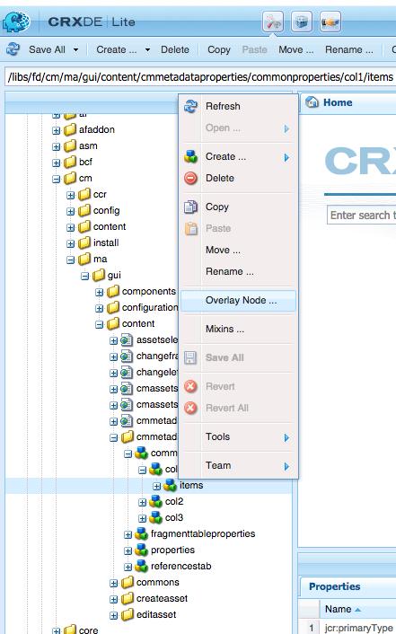
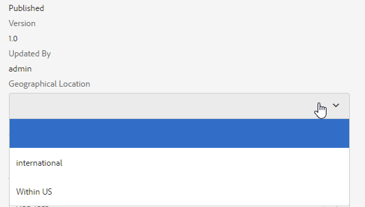

# 서신 관리 에셋에 사용자 지정 속성 추가{#add-custom-properties-to-correspondence-management-assets}

## 개요 {#overview}

서신 관리 사용자 인터페이스를 사용자 정의하고 맞춤화된 속성 및 탭 세트를 사용자에게 제공할 수 있습니다. 이 사용자 지정에는 특정 에셋 유형/문자 또는 모든 에셋 유형 및 문자에 사용자 지정 필드/속성 및 탭 추가가 포함됩니다.

## 서신 관리 에셋에 사용자 지정 속성 추가 {#adding-custom-properties-to-correspondence-management-assets}

다음 시나리오는 서신 관리 에셋 및 편지에 속성/탭을 추가하는 방법을 보여 줍니다.

* 모든 자산 유형에 공통 속성 추가
* 모든 에셋 유형에 공통 탭 추가
* 특정 자산 유형에 사용자 지정 속성 추가

이러한 시나리오에서 속성, 경로 및 값을 조정하면 요구 사항에 따라 사용자 지정 속성 및 탭을 다른 에셋 세트에 추가할 수 있습니다.

### 시나리오: 모든 자산 유형에 공통 필드(등록 정보) 추가 {#scenario-adding-a-common-field-property-to-all-the-asset-types}

이 시나리오는 모든 자산 유형(텍스트, 목록, 조건 및 레이아웃 조각) 및 문자에 사용자 지정 속성을 추가하는 방법을 보여 줍니다. 이 시나리오를 사용하면 모든 에셋 및 편지에 수신자의 위치라는 속성을 추가할 수 있습니다. 수신자 위치 속성은 에셋 또는 편지 배달의 지리적 영역을 식별하는 데 도움이 됩니다.

>[!NOTE]
>
>사용자 지정 속성을 이미 추가한 경우 속성이 자산 만들기 페이지에 표시되기 시작합니다. 이러한 속성을 숨기려면 자산 만들기 및 속성 페이지에서 사용자 지정 속성 표시/숨기기를 참조하십시오.


모든 자산 유형 및 문자에 사용자 지정 속성을 추가하려면 다음 단계를 완료하십시오.

1. 다음으로 이동 `https://'[server]:[port]'/[ContextPath]/crx/de` 관리자로 로그인합니다.
1. 앱 폴더에서 다음 단계를 사용하여 css 폴더(ccrui 폴더의)와 유사한 경로/구조를 사용하여 css라는 폴더를 만듭니다.

   1. 다음 경로에서 items 폴더를 마우스 오른쪽 단추로 클릭하고 를 선택합니다 **오버레이 노드**:

      `/libs/fd/cm/ma/gui/content/cmmetadataproperties/commonproperties/col1/items`

      

   1. 오버레이 노드 대화 상자에 다음 값이 있는지 확인합니다.

      **경로:** /libs/fd/cm/ma/gui/content/cmmetadataproperties/commonproperties/col1/items

      **위치:** /apps/

      **노드 유형 일치:** 선택됨

      

   1. 클릭 **확인**. 폴더 구조는 앱 폴더에 생성됩니다.

   1. **모두 저장**&#x200B;을 클릭합니다.

1. 새로 만든 항목 폴더 아래에 다음 단계를 사용하여 모든 에셋의 사용자 지정 속성에 대한 노드를 추가합니다(예: GeoLocation).

   1. Items 폴더를 마우스 오른쪽 단추로 클릭하고 **만들기** > **노드 만들기**.

      

   1. 노드 생성 대화 상자에 다음 값이 있는지 확인하고 **확인**:

      **이름:** GeoLocation(또는 이 속성에 지정할 이름)

      **유형:** nt:unstructured

      

   1. 만든 새 노드(여기서는 GeoLocation)를 클릭합니다. CRX는 노드의 속성을 표시합니다.
   1. 노드에 다음 속성을 추가합니다(여기서는 GeoLocation).

      | **이름** | **유형** | **값** |
      |---|---|---|
      | fieldLabel | 문자열 | 필드/속성을 지정할 이름입니다. (여기서: 수신자 위치) |
      | 이름 | 문자열 | `./extendedproperties/GeoLocation` (이 값은 항목 노드 아래에 생성한 필드 이름과 동일하게 유지) |
      | renderReadOnly | 부울 | true |
      | sling:resourceType | 문자열 | `granite/ui/components/coral/foundation/form/textfield` |

   1. **모두 저장**&#x200B;을 클릭합니다.

1. 사용자 지정을 보려면 에셋(텍스트, 목록, 조건 또는 레이아웃 조각) 또는 편지 위로 마우스를 가져간 후 **속성 보기**, 및 클릭 **편집**. 에셋/편지 속성의 기본 탭에 새 필드(수신자 위치)가 표시됩니다.

   >[!NOTE]
   >
   >사용자 지정이 UI에 표시되기 전에 브라우저 캐시를 지워야 할 수 있습니다.

   

   >[!NOTE]
   >
   >추가하는 모든 에셋에 대한 일반 속성은 에셋 속성의 기본 탭에 표시됩니다. 기본적으로 모든 에셋에 대해 추가된 공통 속성은 속성 페이지와 에셋 생성 페이지에 표시됩니다. 일반 속성을 숨기려면 다음을 수행해야 합니다 <!--link to show / hide properties]-->.

### 시나리오: 사용자 정의 속성/필드에 사용자 정의 드롭다운 및 값 추가 {#scenario-add-custom-drop-down-and-values-to-a-custom-property-field}

이 시나리오는 모든 에셋 유형에 사용자 지정 속성을 추가하고 드롭다운 값을 추가하는 방법을 보여 줍니다.

1. 다음 경로에서 items 폴더를 마우스 오른쪽 단추로 클릭하고 를 선택합니다 **오버레이 노드**:

   `/libs/fd/cm/ma/gui/content/cmmetadataproperties/commonproperties/col1/items`

1. 새로 만든 오버레이 노드(/apps/fd/cm/ma/gui/content/cmmetadataproperties/commonproperties/col1/items) 아래에 드롭다운을 생성해야 하는 각 속성(필드)에 대한 노드를 만듭니다 `geographicallocation`nt:unstructured 유형의 )
1. 다음 속성을 노드(여기서는 geographicallocation)에 추가하고 을(를) 클릭합니다 **모두 저장**:

   <table>
   <tbody>
   <tr>
      <td><strong>이름</strong></td>
      <td><strong>유형</strong></td>
      <td><strong>값</strong></td>
   </tr>
   <tr>
      <td>fieldLabel</td>
      <td>문자열</td>
      <td>필드/속성을 지정할 이름입니다. (여기서: geographicallocation)</td>
   </tr>
   <tr>
      <td>이름</td>
      <td>문자열</td>
      <td>./extendedproperties/geographicallocation(값을 항목 노드 아래에 만든 필드 이름과 동일하게 유지)</td>
   </tr>
   <tr>
      <td>renderReadOnly</td>
      <td>부울</td>
      <td>true</td>
   </tr>
   <tr>
      <td>sling:resourceType</td>
      <td>문자열</td>
      <td>granite/ui/components/coral/foundation/form/select<br /> </td>
   </tr>
   </tbody>
   </table>

1. 속성 노드(여기서는 geographicallocation) 아래에 이름을 가진 새 노드를 추가합니다 `items`. 항목 노드 아래에 드롭다운의 값에 대해 각각 노드를 추가합니다. 첫 번째 노드를 공백으로 추가하여 드롭다운의 기본값으로 사용하고 사용자가 필드에 값을 지정하지 않는 옵션을 제공하는 것이 좋습니다. 여러 옵션/드롭다운 값을 추가하려면 다음 단계를 반복합니다.

   1. 속성 노드(여기서는 geographicallocation)를 마우스 오른쪽 단추로 클릭하고 를 선택합니다 **만들기** > **노드 만들기**.
   1. 다음과 같이 필드 이름 입력 `item1,` 유형을 nt:unstructured로 유지하고 **확인**.
   1. 새로 만든 노드(여기 item1)에 다음 속성을 추가한 다음 을 클릭합니다 **모두 저장**:

      <table>
         <tbody>
         <tr>
          <td><strong>이름</strong></td>
          <td><strong>유형</strong></td>
          <td><strong>값</strong></td>
         </tr>
         <tr>
          <td>text</td>
          <td>문자열</td>
          <td>사용자가 볼 수 있는 드롭다운 옵션의 값입니다. 빈(기본값) 값에 대해 값을 비워 두거나 다음과 같이 값을 입력합니다. <strong>국제</strong> 또는 <strong>US 내</strong>.<br /> </td>
         </tr>
         <tr>
          <td>값</td>
          <td>문자열</td>
          <td>텍스트에 대해 CRXDE에 저장된 값입니다. 고유한 키워드를 입력합니다. <br /> </td>
         </tr>
         </tbody>
   </table>

   

사용자 지정 드롭다운은 자산 속성에 다음과 같이 표시됩니다.



### 시나리오: 모든 자산 유형에 대한 공통 탭 {#scenario-common-tab-for-all-asset-types}

이 시나리오는 모든 자산 유형(텍스트, 목록, 조건 및 레이아웃 조각) 및 문자에 사용자 지정 탭 수신자를 추가하는 방법을 보여 줍니다. 수신자 탭에서는 수신자와 관련된 모든 사용자 지정 속성을 배치할 수 있습니다.


다음 절차를 사용하여 필드가 있는 탭을 모든 에셋에 추가할 수 있습니다.

1. 다음으로 이동 `https://'[server]:[port]'/[ContextPath]/crx/de` 관리자로 로그인합니다.
1. 앱 폴더에서 다음 단계를 사용하여 cmmetadataproperties 폴더(컨텐츠 폴더)와 유사한 경로/구조로 cmmetadataproperties라는 폴더를 만듭니다.

   1. 다음 경로에서 cmmetadataproperties 폴더를 마우스 오른쪽 버튼으로 클릭하고 를 선택합니다 **오버레이 노드**:

      `/libs/fd/cm/ma/gui/content/cmmetadataproperties`

      

   1. 오버레이 노드 대화 상자에 다음 값이 있는지 확인합니다.

      **경로:** /libs/fd/cm/ma/gui/content/cmmetadataproperties

      **위치:** /apps/

      **노드 유형 일치:** 선택됨

   1. 클릭 **확인**. 폴더 구조는 앱 폴더에 생성됩니다.

      

      **모두 저장**&#x200B;을 클릭합니다.

1. cmmetadataproperties 폴더 아래에 다음 단계를 사용하여 모든 에셋에 대한 사용자 정의 탭을 만들기 위한 노드(예: commontab)를 추가합니다.

   1. cmmetadataproperties 폴더를 마우스 오른쪽 버튼으로 클릭하고 다음을 선택합니다. **만들기** > **노드 만들기**.

      

   1. 노드 생성 대화 상자에 다음 값이 있는지 확인하고 **확인**:

      **이름:** commontab(또는 이 속성에 지정할 이름)

      **유형:** nt:unstructured

   1. 생성한 새 노드(여기 commontab)를 클릭합니다. CRX는 노드의 속성을 표시합니다.
   1. 노드에 다음 속성을 추가합니다(여기 commontab).

      <table>
         <tbody>
         <tr>
          <td><strong>이름</strong></td>
          <td><strong>유형</strong></td>
          <td><strong>값</strong></td>
         </tr>
         <tr>
          <td>jcr:title</td>
          <td>문자열</td>
          <td>열에 지정할 이름입니다. (여기: 수신자)</td>
         </tr>
         <tr>
          <td>sling:resourceType</td>
          <td>문자열</td>
          <td>granite/ui/components/coral/foundation/container<br /> </td>
   </tr>
         </tbody>
       </table>

   1. **모두 저장**&#x200B;을 클릭합니다.

1. 마지막 단계(여기서는 commontab)에서 생성된 탭 노드의 경우, 다음 단계를 사용하여 item이라는 노드를 생성합니다.

   1. 관련 노드(여기서는 commontab)를 마우스 오른쪽 버튼으로 클릭하고 를 선택합니다. **만들기** > **노드 만들기**.
   1. 노드 생성 대화 상자에 다음 값이 있는지 확인하고 **확인**:

      **이름:** 개 항목

      **유형:** nt:unstructured

   1. 클릭 **모두 저장:**

1. 이전 단계(commontab 아래)에서 생성한 항목 노드의 다음 단계를 사용하여 사용자 정의 탭(commontab)에 열(여기서는 Column1)을 생성하기 위한 노드를 추가합니다(열을 더 추가하려면 이 단계를 반복합니다).

   1. 항목 노드를 마우스 오른쪽 버튼으로 클릭하고 를 선택합니다. **만들기** > **노드 만들기**.
   1. 노드 생성 대화 상자에 다음 값이 있는지 확인하고 **확인**:

      **이름:** Column1 (또는 노드에 지정할 이름 - 이 이름은 사용자 인터페이스에 표시되지 않습니다.)

      **유형:** nt:unstructured

   1. 다음 속성을 노드(여기 Column1)에 추가한 다음 **모두 저장**:

      <table>
         <tbody>
         <tr>
           <td><strong>이름</strong></td>
           <td><strong>유형</strong></td>
           <td><strong>값</strong></td>
         </tr>
         <tr>
           <td>sling:resourceType</td>
           <td>문자열</td>
           <td>granite/ui/components/coral/foundation/container<br /> </td>
         </tr>
         </tbody>
       </table>

1. 이전 단계(여기서는 Column1)에서 만든 노드에서 다음 단계를 사용하여 items라는 노드를 추가합니다.

   1. 노드(여기서는 Column1)를 마우스 오른쪽 단추로 클릭하고 를 선택합니다 **만들기** > **노드 만들기**.
   1. 노드 생성 대화 상자에 다음 값이 있는지 확인하고 **확인**:

      **이름:** 개 항목

      **유형:** nt:unstructured

   1. **모두 저장**&#x200B;을 클릭합니다.

1. 사용자 지정 탭(여기서는 수신자)에 필드를 만들려면 노드(여기서는 GeographyLocation)를 추가합니다. 이 속성은 사용자가 만든 열에 해당합니다. 필드를 만들려면 다음 단계를 사용하십시오(더 많은 필드/노드를 만들려면 이 단계를 반복하십시오).:

   1. 항목 노드를 마우스 오른쪽 버튼으로 클릭하고 를 선택합니다. **만들기** > **노드 만들기**.
   1. 노드 생성 대화 상자에 다음 값이 있는지 확인하고 **확인**:

      **이름:** GeographyLocation(또는 필드 속성의 다른 이름)

      **유형:** nt:unstructured

   1. 필드 노드(여기서는 GeographyLocation)에 다음 속성을 추가하고 을(를) 클릭합니다. **모두 저장**.

      | **이름** | **유형** | **값** |
      |---|---|---|
      | fieldLabel | 문자열 | 수신자 위치(또는 필드에 지정할 이름)입니다. |
      | 이름 | 문자열 | ./extendproperties/GeographyLocation |
      | renderReadOnly | 부울 | true |
      | sling:resourceType | 문자열 | `/libs/granite/ui/components/coral/foundation/form/textfield` |

1. 편지에 대해 이 탭을 추가하려면 다음 경로의 다음 항목 폴더와 유사한 경로/구조로 오버레이 폴더를 만드십시오.

   `/libs/fd/cm/ma/gui/content/cmmetadataproperties/properties/letter/items/tabs/items`

   문자나 다른 에셋에 대한 오버레이를 만들려면 다음 경로를 사용하여 [assettype] 텍스트, 조건, 목록, 데이터 사전 또는 조각 포함:

   `/libs/fd/cm/ma/gui/content/cmmetadataproperties/properties/[assettype]/items/tabs/items`

   1. 다음 경로에서 items 폴더를 마우스 오른쪽 단추로 클릭하고 를 선택합니다 **오버레이 노드**:

      `/libs/fd/cm/ma/gui/content/cmmetadataproperties/properties/letter/items/tabs/items`

   1. 오버레이 노드 대화 상자에 다음 값이 있는지 확인합니다.

      **경로:** `/libs/fd/cm/ma/gui/content/cmmetadataproperties/properties/letter/items/tabs/items`

      **위치:** /apps/

      **노드 유형 일치:** 선택됨

   1. 클릭 **확인**. 폴더가 생성됩니다. **모두 저장**&#x200B;을 클릭합니다.

1. 새로 만든 항목 폴더에서 다음 단계를 사용하여 에셋의 사용자 지정 탭에 대한 노드를 추가합니다(여기서 mytab - 이 이름은 사용자 인터페이스에 표시되지 않음).

   1. Items 폴더를 마우스 오른쪽 단추로 클릭하고 **만들기** > **노드 만들기**.
   1. 노드 생성 대화 상자에 다음 값이 있는지 확인하고 **확인**:

      **이름:** mytab(또는 이 속성에 지정할 이름)

      **유형:** nt:unstructured

   1. 만든 새 노드(여기 mytab)를 클릭합니다. CRX는 노드의 속성을 표시합니다.
   1. 노드에 다음 두 가지 속성을 추가합니다(여기서 customtab).

      <table>
         <tbody>
         <tr>
           <td><strong>이름</strong></td>
           <td><strong>유형</strong></td>
           <td><strong>값</strong></td>
         </tr>
         <tr>
           <td>경로<br /> </td>
           <td>문자열</td>
           <td>fd/cm/ma/gui/content/cmmetadataproperties/commontab<br /> </td>
         </tr>
         <tr>
           <td>sling:resourceType</td>
           <td>문자열</td>
           <td>granite/ui/components/coral/foundation/include<br /> </td>
         </tr>
         </tbody>
       </table>

   1. **모두 저장**&#x200B;을 클릭합니다.

1. 사용자 지정을 보려면 관련 에셋(여기에 있는 편지) 위로 마우스를 가져간 후 속성 보기 를 클릭한 다음 **편집**. 사용자 인터페이스에 새 탭(수신자)과 필드(수신자 위치)가 나타납니다.

   >[!NOTE]
   >
   >사용자 지정이 UI에 표시되기 전에 브라우저 캐시를 지워야 할 수 있습니다.

   

### 시나리오: 특정 자산 유형에 대한 사용자 정의 속성 추가 {#scenario-adding-custom-properties-for-specific-asset-types}

이 시나리오는 모든 텍스트 에셋에 대한 필드 같은 특정 에셋 유형에 속성을 추가하는 방법을 보여 줍니다. 이 프로세스를 사용하여 다음 중 하나에 속성을 추가할 수 있습니다.

* 텍스트
* 조건
* 목록
* 레이아웃 단편
* 데이터 사전
* 편지

예를 들어 텍스트 에셋에만 수신자의 위치 속성을 추가하여 에셋이 관련되는 지리적 영역을 식별하려고 합니다.  

에셋 유형에 속성을 추가하려면 다음 단계를 완료하십시오.

1. 다음으로 이동 `https://'[server]:[port]'/[ContextPath]/crx/de` 관리자로 로그인합니다.
1. 에셋 유형(예: 텍스트)에 탭을 만들려면 앱 폴더에 다음 폴더 구조를 만듭니다.

   `/libs/fd/cm/ma/gui/content/cmmetadataproperties/properties/[AssetType]/items/tabs/items`

   [AssetType] = text, condition, list, letter, datadictionary 또는 fragment

   이 폴더 구조를 만드는 단계는 다음과 같습니다.

   1. 다음 경로에서 items 폴더를 마우스 오른쪽 단추로 클릭하고 를 선택합니다 **오버레이 노드**:

      `/libs/fd/cm/ma/gui/content/cmmetadataproperties/properties/[AssetType]/items/tabs/items`

      예를 들어 텍스트 에셋에 대한 속성을 만들려면 다음 폴더를 선택합니다.

      `/libs/fd/cm/ma/gui/content/cmmetadataproperties/properties/text/items/tabs/items`

      

   1. 오버레이 노드 대화 상자에 다음 값이 있는지 확인합니다.

      **경로:** /libs/fd/cm/ma/gui/content/cmmetadataproperties/properties/[AssetType]/items/tab/items

      **위치:** /apps/

      **노드 유형 일치:** 선택됨

   1. 클릭 **확인**. 폴더 구조는 앱 폴더에 생성됩니다.

      **모두 저장**&#x200B;을 클릭합니다.

1. 새로 만든 항목 폴더에서 다음 단계를 사용하여 에셋의 사용자 지정 탭에 대한 노드를 추가합니다(예: customtab).

   1. Items 폴더를 마우스 오른쪽 단추로 클릭하고 **만들기** > **노드 만들기**.
   1. 노드 생성 대화 상자에 다음 값이 있는지 확인하고 **확인**:

      **이름:** customtab(또는 이 속성에 지정할 이름)

      **유형:** nt:unstructured

   1. 만든 새 노드(여기 customtab)를 클릭합니다. CRX는 노드의 속성을 표시합니다.
   1. 노드에 다음 두 가지 속성을 추가합니다(여기서 customtab).

      | **이름** | **유형** | **값** |
      |---|---|---|
      | sling:resourceType | 문자열 | granite/ui/components/coral/foundation/container |
      | jcr:title | 문자열 | 사용자 인터페이스의 필드 이름(여기 내 탭) |

   1. **모두 저장**&#x200B;을 클릭합니다.

1. 이전 단계에서 만든 노드(여기서는 customtab)에 다음 단계를 사용하여 items라는 노드를 추가합니다.

   1. 노드(여기서는 customtab)를 마우스 오른쪽 단추로 클릭하고 를 선택합니다. **만들기** > **노드 만들기**.
   1. 노드 생성 대화 상자에 다음 값이 있는지 확인하고 **확인**:

      **이름:** 개 항목

      **유형:** nt:unstructured

   1. **모두 저장**&#x200B;을 클릭합니다.

1. 이전 단계에서 만든 항목 노드(customtab 아래)의 사용자 정의 탭에서 열(여기서는 Column1)을 만들기 위한 노드를 추가하려면 다음 단계를 수행하십시오(열을 더 추가하려면 이 단계를 반복합니다).

   1. 항목 노드를 마우스 오른쪽 버튼으로 클릭하고 를 선택합니다. **만들기** > **노드 만들기**.
   1. 노드 생성 대화 상자에 다음 값이 있는지 확인하고 **확인**:

      **이름:** Column1 (또는 노드에 지정할 이름)

      **유형:** nt:unstructured

   1. 다음 속성을 노드(여기 Column1)에 추가한 다음 **모두 저장**.

      <table>
         <tbody>
         <tr>
           <td><strong>이름</strong></td>
           <td><strong>유형</strong></td>
           <td><strong>값</strong></td>
         </tr>
         <tr>
           <td>sling:resourceType</td>
           <td>문자열</td>
           <td>granite/ui/components/coral/foundation/container<br /> </td>
         </tr>
         </tbody>
       </table>

1. 생성한 각 열(이전 단계 - 여기서는 Column1에 지정된 대로)에 대해 다음 단계를 사용하여 item이라는 노드를 만듭니다.

   1. 관련 열 노드(여기서는 Column1)를 마우스 오른쪽 단추로 클릭하고 를 선택합니다 **만들기** > **노드 만들기**.
   1. 노드 생성 대화 상자에 다음 값이 있는지 확인하고 **확인**:

      **이름:** 개 항목

      **유형:** nt:unstructured

   1. 클릭 **모두 저장:**

1. 생성된 각 열에 대해 사용자 인터페이스의 새 탭에서 필드를 만들기 위해 항목 노드 아래에 노드를 만듭니다. 열에 필드를 더 만들려면 이 단계를 반복합니다.

   1. 관련 노드(여기 Column1 아래의 항목)를 마우스 오른쪽 단추로 클릭하고 를 선택합니다 **만들기** > **노드 만들기**.
   1. 노드 생성 대화 상자에 다음 값이 있는지 확인하고 **확인**:

      **이름:** 선택한 이름(여기서는 GeoLocation)

      **유형:** nt:unstructured

   1. 노드에 다음 속성을 추가하고 을 클릭합니다 **모두 저장**.

      | **이름** | **유형** | **값** |
      |---|---|---|
      | fieldLabel | 문자열 | 수신자 위치(또는 필드에 지정할 이름)입니다. |
      | 이름 | 문자열 | `./extendedproperties/GeoLocation` |
      | renderReadOnly | 부울 | true |
      | sling:resourceType | 문자열 | granite/ui/components/coral/foundation/form/textfield |

1. 사용자 지정을 보려면 관련 에셋(여기 텍스트) 위로 마우스를 가져간 후 속성 보기 를 클릭하고 **편집**. 사용자 인터페이스에 새 탭과 필드(수신자의 위치)가 나타납니다.

   >[!NOTE]
   >
   >사용자 지정이 UI에 표시되기 전에 브라우저 캐시를 지워야 할 수 있습니다.

   

### 자산 만들기 페이지에 사용자 지정 속성 표시 {#display-custom-properties-on-the-asset-creation-page}

자산 만들기 페이지에 탭 레이아웃이 없으므로 기본적으로 새 탭에 추가된 사용자 지정 속성은 자산 만들기 페이지가 아닌 속성 페이지에서만 볼 수 있습니다. 다른 속성과 함께 자산 만들기 페이지에 사용자 지정 속성을 표시하려면 다음을 수행해야 합니다.

1. 다음 경로에서 items 폴더를 마우스 오른쪽 단추로 클릭하고 를 선택합니다 **오버레이 노드**:

   `/libs/fd/cm/ma/gui/content/createasset/createletter/jcr:content/body/items/form/items/letterWizard/items/properties/items/properties/items/letterproperties/items`

1. 오버레이 노드 대화 상자에 문자에 대한 다음과 같은 값이 있는지 확인합니다. 다른 에셋 유형의 경우 다음 표에 경로가 제공됩니다.

   **경로:** /libs/fd/cm/ma/gui/content/createasset/createtter/jcr:content/body/items/form/items/letterWizard/items/properties/items/properties/items/letterproperties/items

   **위치:** /apps/

   **노드 유형 일치:** 선택됨

   에셋 유형에 따라 다음 경로가 필요합니다.

   | **에셋/문서 유형** | **추가할 경로** |
   |---|---|
   | 텍스트 | /libs/fd/cm/ma/gui/content/createasset/createtext/jcr:content/body/items/form/items/textwizard/items/editproperties/items/properties/items/tab/items/tab1/items |
   | 목록 | /libs/fd/cm/ma/gui/content/createasset/createlist/jcr:content/body/items/form/items/listwizard/items/editproperties/items/properties/items/tab/items/tab1/items |
   | 조건 | /libs/fd/cm/ma/gui/content/createasset/createcondition/jcr:content/body/items/form/items/conditionwizard/items/editproperties/items/properties/items/tab/items/tab1/items |
   | 조각 | /libs/fd/cm/ma/gui/content/createasset/createfragment/jcr:content/body/items/form/items/fragmentwizard/items/properties/items/properties/items/tab2/items/tab1/items |
   | 편지 | /libs/fd/cm/ma/gui/content/createasset/createtter/jcr:content/body/items/form/items/letterWizard/items/properties/items/properties/items/letterproperties/items |

1. 클릭 **확인**. 폴더 구조는 앱 폴더에 생성됩니다.

1. 생성한 오버레이 항목 노드 아래에 col4(또는 다른 이름)라는 이름의 노드를 생성하고 를 클릭합니다 **모두 저장**.

   예를 들어 글자에 대해 만들어진 오버레이 노드는 다음과 같습니다.

   `/apps/fd/cm/ma/gui/content/createasset/createletter/jcr:content/body/items/form/items/letterWizard/items/properties/items/properties/items/letterproperties/items`

1. 새로 만든 노드(여기서는 col4)에 다음 속성을 추가하고 을 클릭합니다. **모두 저장**:

<table>
 <tbody>
  <tr>
   <td><strong>이름</strong></td>
   <td><strong>유형</strong></td>
   <td><strong>값</strong></td>
  </tr>
  <tr>
   <td>경로</td>
   <td>문자열</td>
   <td><p>이 경로는 다음에서 만든 열에 대한 포인터입니다.</p>
    <ul>
     <li>모든 에셋 유형에 대한 일반 탭: /apps/fd/cm/ma/gui/content/cmmetadataproperties/commontab/items/col1</li>
     <li>다른 자산 유형에 대한 다른 속성의 경우: /apps/fd/cm/ma/gui/content/cmmetadataproperties/properties//items/tab/items/customtab/items/col1</li>
    </ul> </td>
  </tr>
  <tr>
   <td>sling:resourceType</td>
   <td>문자열</td>
   <td> granite/ui/components/coral/foundation/include<br /> </td>
  </tr>
 </tbody>
</table>


사용자 정의 속성, 언어, 편지 작성을 위해 UI에 표시

## 사용자 지정 속성을 표시하도록 목록 보기 사용자 지정 {#customize-the-list-view-to-show-custom-properties}

사용자 지정 속성을 서신 관리 에셋에 추가한 후에는 CRX/DE에서 추가로 변경하여 사용자 지정 속성이 서신 관리 UI에 표시되도록 해야 합니다.

다음 단계를 완료하여 서신 관리의 에셋 목록 UI에 사용자 지정 속성을 표시합니다.

1. 다음으로 이동 `https://'[server]:[port]'/[ContextPath]/crx/de` 관리자로 로그인합니다.
1. 앱 폴더에 다음 폴더 구조를 만듭니다.

   `/libs/fd/cm/ma/gui/content/cmassets/jcr:content/views/lists/columns`

   이 폴더 구조를 만드는 단계는 다음과 같습니다.

   1. 다음 경로에서 columns 폴더를 마우스 오른쪽 버튼으로 클릭하고 를 선택합니다. **오버레이 노드**:

      `/libs/fd/cm/ma/gui/content/cmassets/jcr:content/views/lists/columns`

   1. 오버레이 노드 대화 상자에 다음 값이 있는지 확인합니다.

      **경로:** /libs/fd/cm/ma/gui/content/cmassets/jcr:content/views/lists/columns

      **위치:** /apps/

      **노드 유형 일치:** 선택됨

   1. 클릭 **확인**. 폴더 구조는 앱 폴더에 생성됩니다.

      **모두 저장**&#x200B;을 클릭합니다.

1. 만들어진 각 속성에 대해 사용자 인터페이스에서 열을 만들기 위해 열 노드 아래에 노드를 만듭니다. UI에 열을 더 만들려면 이 단계를 반복합니다.

   1. 관련 노드(열)를 마우스 오른쪽 단추로 클릭하고 를 선택합니다 **만들기** > **노드 만들기**.
   1. 노드 생성 대화 상자에 다음 값이 있는지 확인하고 **확인**:

      **이름:** 선택한 이름(여기서 GeographicLocation)

      **유형:** nt:unstructured

   1. 노드에 다음 속성을 추가하고 을 클릭합니다 **모두 저장**.

      <table>
         <tbody>
         <tr>
           <td><strong>이름</strong></td>
           <td><strong>유형</strong></td>
           <td><strong>값</strong></td>
         </tr>
         <tr>
           <td>jcr:primaryType</td>
           <td>이름</td>
           <td><p>nt:unstructured</p> </td>
         </tr>
         <tr>
           <td>jcr:title</td>
           <td>문자열</td>
           <td><p>지리적 위치</p> <p>이 값은 UI에서 열 머리글로 표시됩니다. </p> </td>
         </tr>
         <tr>
           <td>정렬 가능</td>
           <td>부울</td>
           <td><p>true</p> <p>값이 true이면 사용자가 이 열의 값을 정렬할 수 있습니다. </p> </td>
         </tr>
         </tbody>
       </table>

1. 앱 폴더에 다음 폴더 구조를 만듭니다.

   `/libs/fd/cm/ma/gui/components/admin/childpagerenderer/childlistpage`

   이 폴더 구조를 만드는 단계는 다음과 같습니다.

   1. 다음 경로에서 columns 폴더를 마우스 오른쪽 버튼으로 클릭하고 를 선택합니다. **오버레이 노드**:

      `/libs/fd/cm/ma/gui/components/admin/childpagerenderer/childlistpage`

   1. 오버레이 노드 대화 상자에 다음 값이 있는지 확인합니다.

      **경로:** /libs/fd/cm/ma/gui/components/admin/childpagerenderer/childlistpage

      **위치:** /apps/

      **노드 유형 일치:** 선택됨

   1. 클릭 **확인**. 폴더 구조는 앱 폴더에 생성됩니다.

      **모두 저장**&#x200B;을 클릭합니다.

1. 다음 위치에서 childlistpage.jsp 파일을 복사합니다.

   /libs/fd/cm/ma/gui/components/admin/childpagerenderer/childlistpage/childlistpage.jsp

   파일을 다음 위치에 붙여넣습니다.

   /apps//fd/cm/ma/gui/components/admin/childpagerenderer/childlistpage/.

1. childlistpage.jsp 파일(/apps/fd/cm/ma/gui/components/admin/childpagerenderer/childlistpage/childlistpage.jsp)을 열고 다음 사항을 변경합니다.

   1. 파일의 19행에 저작권 선언문 다음에 다음을 추가합니다.

      ```jsp
      <%@page import="java.util.Map"%>
      ```

   1. 각 사용자 지정 속성에 대한 값을 가져오는 함수의 다음 코드를 파일 끝에 추가합니다.

      ```jsp
      <%!
          private String getCustomPropertyValue(Map<String, Object> extendedProperties, String propertyName) {
      
              String propertyValue = "";
              if (extendedProperties.containsKey(propertyName)) {
                  propertyValue = (String) extendedProperties.get(propertyName);
              }
      
              return propertyValue;
          }
      %>
      ```

   1. 를 시작하기 전에 다음을 추가하십시오. &lt;tr> 태그(&lt;tr attrs.build=&quot;&quot;>>):

      ```jsp
      <%
          String GeoLocation = "";
          if (asset != null) {
                  Map<String, Object> extendedProperties = asset.getExtendedProperties();
                  if (extendedProperties != null) {
                      GeoLocation = getCustomPropertyValue(extendedProperties,"GeoLocation");
                  }
          }
      %>
      ```

      코드에서 GeoLocation은 사용자 지정 노드/필드를 만드는 동안 이름 속성에 설정한 값입니다. 사용자 지정 노드/필드를 만드는 동안 가 있는 속성의 이름을 지정했습니다./extendedproperties/ 접두사: ./extendproperties/GeoLocation. 코드에서 접두사는 필요하지 않습니다.

   1. UI에 새 속성을 표시하려면 닫기 tr 앞에 다음과 같이 TD 태그를 추가합니다(&lt;/tr>) 태그:

      ```jsp
      <td is="coral-td" value="<%= xssAPI.encodeForHTMLAttr(geographicalLocation) %>"><%= xssAPI.encodeForHTML(geographicalLocation) %></td>
      ```

      열을 더 추가하려면 6.3단계와 6.4단계를 반복합니다.

   1. **모두 저장**&#x200B;을 클릭합니다.

1. 사용자 지정을 보려면 사용자 지정 속성을 추가한 문서 단편 또는 편지의 목록 보기를 엽니다.

   이 절차에서 추가된 UI 열 및 속성은 모든 자산 유형에 대해 표시됩니다. 그러나 이러한 속성의 값은 원래 사용자 지정 속성을 추가한 에셋 유형에 대해서만 입력하고 표시할 수 있습니다.

   예를 들어 시나리오: 특정 에셋 유형에 대한 사용자 지정 속성 추가 텍스트 에셋에 사용자 지정 속성을 추가하면 텍스트 에셋에만 사용자 지정 속성을 입력할 수 있습니다. 그러나 UI에 해당 사용자 지정 속성이 표시되면 열이 모든 에셋 유형에 대해 표시됩니다.

   

1. (선택 사항) 기본적으로 새 열은 UI에서 마지막 열로 표시됩니다. 열이 특정 위치에 나타나도록 하려면 열 노드에 다음 속성을 추가합니다.

<table>
 <tbody>
  <tr>
   <td><strong>이름</strong></td>
   <td><strong>유형</strong></td>
   <td><strong>값</strong></td>
  </tr>
  <tr>
   <td>sling:orderBear</td>
   <td>문자열</td>
   <td><p>사용자 정의 열이 UI에 표시되기 전에 경로 "/libs/fd/cm/ma/gui/content/cmassets/jcr:content/views/list/columns"에 있는 열 노드의 이름.</p> <p>여기서 Geography 위치 열을 Version 열 앞에 나타나게 하려면 속성 sling:orderBefore를 경로 ""/apps/fd/cm/ma/gui/content/cmassets/jcr:content/views/list/columns/GeoLocation"의 GeoLocation 노드에 추가하고 속성 값을 version으로 설정합니다.</p> </td>
  </tr>
 </tbody>
</table>

sling:orderBefore 속성을 추가하여 열 위치를 지정할 때 해당 열의 순서도 업데이트해야 합니다 &lt;td> 이 절차의 6.4단계에서 지정된 태그입니다. 예를 들어, 이 경우 &lt;td> 지리적 위치의 태그는 앞에 배치됩니다. &lt;td> 버전 열의 태그:

```xml
<td is="coral-td" value="<%= xssAPI.encodeForHTMLAttr(geographicalLocation) %>"><%= xssAPI.encodeForHTML(geographicalLocation) %></td>
<td is="coral-td" value="<%= xssAPI.encodeForHTMLAttr(version) %>"><%= xssAPI.encodeForHTML(version) %></td>
```

## 사용자 지정 속성 검색 활성화 {#enable-search-for-custom-properties}

기본적으로 전체 텍스트 검색에는 CRX/DE를 사용하여 UI에 추가하는 사용자 지정 속성이 포함되지 않습니다.

검색에 사용자 지정 속성을 포함하려면 사용자 지정 속성의 인덱싱을 허용해야 합니다.

사용자 지정 속성 인덱싱을 허용하려면 다음 단계를 완료하십시오.

1. 다음으로 이동 `https://'[server]:[port]'/[ContextPath]/crx/de` 관리자로 로그인합니다.
1. 다음으로 이동 `/oak:index/cmLucene`및 (이)라는 노드 추가 **집계** 밑에요.

   1. cmLucene 폴더를 마우스 오른쪽 단추로 클릭하고 **만들기** > **노드 만들기**.
   1. 노드 생성 대화 상자에 다음 값이 있는지 확인하고 **확인**:

      **이름:** 집계

      **유형:** nt:unstructured

   1. **모두 저장**&#x200B;을 클릭합니다.

1. 새로 만든 집계 폴더 아래에 노드 cm:resource를 추가합니다. cm:resource 아래에 include0이라는 노드를 추가합니다.

   1. 합계 폴더를 마우스 오른쪽 단추로 클릭하고 를 선택합니다. **만들기** > **노드 만들기**. 노드 생성 대화 상자에 다음 값이 있는지 확인하고 **확인**:

      **이름:** cm:resource

      **유형:** nt:unstructured

   1. cm:resource 폴더를 마우스 오른쪽 단추로 클릭하고 를 선택합니다. **만들기** > **노드 만들기**. 노드 생성 대화 상자에 다음 값이 있는지 확인하고 **확인**:

      **이름:** include0

      **유형:** nt:unstructured

   1. 만든 새 노드(여기에 포함0)를 클릭합니다. CRX는 노드의 속성을 표시합니다.
   1. 다음 속성을 노드에 추가합니다(여기서 include0).

      <table>
         <tbody>
         <tr>
           <td><strong>이름</strong></td>
           <td><strong>유형</strong></td>
           <td><strong>값</strong></td>
         </tr>
         <tr>
           <td>경로</td>
           <td>문자열</td>
           <td>extendedProperties<br /> </td>
         </tr>
         </tbody>
       </table>

   1. **모두 저장**&#x200B;을 클릭합니다.

1. 다음 위치의 속성으로 이동한 다음 그 아래에 노드 위치를 추가합니다. `/oak:index/cmLucene/indexRules/cm:resource/properties`

   검색에 추가할 각 사용자 지정 속성에 대해 이 단계를 반복합니다.

   1. 속성 폴더를 마우스 오른쪽 단추로 클릭하고 **만들기** > **노드 만들기**.
   1. 노드 생성 대화 상자에 다음 값이 있는지 확인하고 **확인**:

      **이름:** 위치(또는 검색에 추가하려는 사용자 지정 속성의 이름)

      **유형:** nt:unstructured

   1. 만든 새 노드(여기 위치)를 클릭합니다. CRX는 노드의 속성을 표시합니다.
   1. 다음 속성을 노드(여기 위치)에 추가합니다.

      | **이름** | **유형** | **값** |
      |---|---|---|
      | 분석됨 | 문자열 | true |
      | 이름 | 문자열 | extendedProperties/location(또는 검색에 추가할 속성의 이름) |
      | propertyIndex | 부울 | true |
      | useInSuggest | 부울 | true |

   1. **모두 저장**&#x200B;을 클릭합니다.

1. 이제 전체 텍스트 검색에서 사용자 지정 속성 값을 사용하여 관련 에셋을 찾을 수 있습니다.

>[!NOTE]
>
>여전히 검색할 수 없는 경우 색인 지정 문제 때문일 수 있습니다. 다시 색인화하려면 다음 노드로 이동하여 속성 &quot;re-index&quot;의 값을 true로 변경합니다.
>
>/oak:index/cmLucene&quot; 및 속성 값 변경

## 검색 페이지의 기본 보기 변경 {#change-default-view-of-the-search-page}

1. 다음으로 이동 `https://'[server]:[port]'/[ContextPath]/crx/de` 관리자로 로그인합니다.
1. 앱 폴더에서 /libs/granite/ui/content/shell/omnisearch/searchresults/singleresults/views의 목록 폴더와 유사한 경로/구조를 가진 list라는 폴더를 만듭니다.

   1. 다음 경로에서 items 폴더를 마우스 오른쪽 단추로 클릭하고 를 선택합니다 **오버레이 노드**:

      `/libs/granite/ui/content/shell/omnisearch/searchresults/singleresults/views/list`

   1. 오버레이 노드 대화 상자에 다음 값이 있는지 확인합니다.

      **경로:** /libs/granite/ui/content/shell/omnisearch/searchresults/singleresults/views/list

      **위치:** /apps/

      **노드 유형 일치:** 선택됨

   1. 클릭 **확인**. 폴더 구조는 앱 폴더에 생성됩니다.

   1. **모두 저장**&#x200B;을 클릭합니다.

1. 새로 만든 노드의 목록에서 다음 속성을 추가하고 **모두 저장**:

   <table>
   <tbody>
   <tr>
      <td><strong>이름</strong></td>
      <td><strong>유형</strong></td>
      <td><strong>값</strong></td>
   </tr>
   <tr>
      <td>sling:orderBear<br /> </td>
      <td>문자열</td>
      <td>카드</td>
   </tr>
   </tbody>
   </table>

1. 사용자 지정은 Forms 및 문서, 에셋, 사이트를 비롯한 모든 콘솔에 대한 검색 결과를 목록 보기에 표시합니다.

## 에셋 페이지의 기본 보기 변경 {#change-default-view-of-the-assets-page}

>[!NOTE]
>
>이러한 단계는 Forms 및 문서, 에셋, 사이트와 같은 모든 콘솔의 기본 보기를 변경합니다.

1. 다음으로 이동 `https://'[server]:[port]'/[ContextPath]/crx/de` 관리자로 로그인합니다.
1. 앱 폴더에서 목록 폴더와 유사한 경로/구조로 list라는 폴더를 만듭니다.

   /libs/fd/cm/ma/gui/content/cmassets/jcr:content/views/

   1. 다음 경로에서 items 폴더를 마우스 오른쪽 단추로 클릭하고 를 선택합니다 **오버레이 노드**:

      `/libs/fd/cm/ma/gui/content/cmassets/jcr:content/views/list`

   1. 오버레이 노드 대화 상자에 다음 값이 있는지 확인합니다.

      **경로:** /libs/fd/cm/ma/gui/content/cmassets/jcr:content/views/list

      **위치:** /apps/

      **노드 유형 일치:** 선택됨

   1. 클릭 **확인**. 폴더 구조는 앱 폴더에 생성됩니다.

   1. **모두 저장**&#x200B;을 클릭합니다.

1. 새로 만든 노드의 목록에서 다음 속성을 추가하고 **모두 저장**:

   <table>
   <tbody>
   <tr>
      <td><strong>이름</strong></td>
      <td><strong>유형</strong></td>
      <td><strong>값</strong></td>
   </tr>
   <tr>
      <td>sling:orderBear<br /> </td>
      <td>문자열</td>
      <td>카드</td>
   </tr>
   </tbody>
   </table>

1. 브라우저 쿠키를 지우거나 브라우저의 시크릿 모드를 사용하여 에셋을 봅니다. 기본적으로 에셋 페이지가 카드 레이아웃에 나타납니다.

## 자산 만들기 및 속성 페이지에서 사용자 지정 속성 표시/숨기기 {#show-hide-custom-properties-on-asset-creation-and-properties-pages}

사용자 지정 속성을 표시하거나 숨기려면 다음 단계를 완료하십시오.

1. geographicallocation과 같은 사용자 지정 속성 노드 아래에 &quot;nt:unstructured&quot; 유형의 &quot;granite:rendercondition&quot; 이름으로 노드를 만듭니다.
1. 다음 속성을 노드에 추가하고 **모두 저장**:

   <table>
   <tbody>
   <tr>
      <td><strong>이름</strong></td>
      <td><strong>유형</strong></td>
      <td><strong>값</strong></td>
   </tr>
   <tr>
      <td>sling:resourceType<br /> </td>
      <td>문자열</td>
      <td>fd/cm/ma/gui/components/admin/assetsproperties/custompropertyconfig<br /> </td>
   </tr>
   </tbody>
   </table>

1. 자산 만들기 페이지에서 이 속성을 숨기려면 다음 속성을 추가하고 을 클릭합니다. **모두 저장**:

   <table>
   <tbody>
   <tr>
      <td><strong>이름</strong></td>
      <td><strong>유형</strong></td>
      <td><strong>값</strong></td>
   </tr>
   <tr>
      <td>hideOnCreate<br /> </td>
      <td>부울</td>
      <td>true<br /> </td>
   </tr>
   </tbody>
   </table>

1. 자산의 속성 페이지에서 사용자 지정 속성을 숨기려면 다음 속성을 추가하고 을 클릭합니다 **모두 저장**:

   <table>
   <tbody>
   <tr>
      <td><strong>이름</strong></td>
      <td><strong>유형</strong></td>
      <td><strong>값</strong></td>
   </tr>
   <tr>
      <td>hideOnEdit<br /> </td>
      <td>부울</td>
      <td>true<br /> </td>
   </tr>
   </tbody>
   </table>

   값을 다시 표시하려면 속성 값을 로 재설정합니다. `false` 또는 속성 항목을 삭제합니다.
