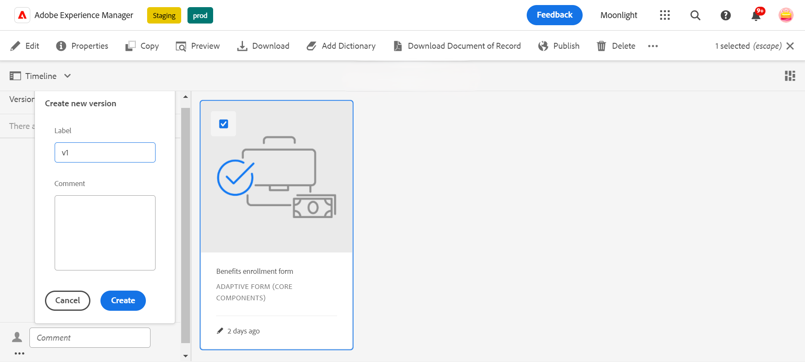

# 적응형 양식에 버전 관리, 검토 및 주석 달기

<!--
 This feature is under the early adopter program. If you’re interested in joining our early access program for this feature, send an email from your official address to aem-forms-ea@adobe.com to request access 
-->

이 기능은 기본적으로 사용할 수 없습니다. 공식 주소에서 aem-forms-ea@adobe.com에 작성하여 기능에 대한 액세스를 요청할 수 있습니다.

적응형 양식 핵심 구성 요소를 사용하여 양식 작성자는 양식에 버전 관리, 주석 및 주석을 추가할 수 있습니다. 이러한 기능을 사용하면 여러 버전을 만들고 관리하고, 주석을 통해 공동 작업하고, 특정 양식 섹션에 메모를 추가할 수 있으므로 양식 개발을 간소화할 수 있으므로 양식 작성 경험이 향상됩니다.

## 전제 조건 {#prerequisite-versioning}

적응형 양식에서 버전 관리, 댓글 달기 및 주석 기능을 사용하려면 AEM 6.5 Forms 환경에서 [적응형 양식 핵심 구성 요소](https://experienceleague.adobe.com/en/docs/experience-manager-65/content/forms/adaptive-forms-core-components/enable-adaptive-forms-core-components)가 활성화되어 있는지 확인하십시오.

## 적응형 양식 버전 관리 {#adaptive-form-versioning}

적응형 양식 버전 관리는 양식에 버전을 추가하는 데 도움이 됩니다. 양식 작성자는 양식의 여러 버전을 쉽게 만들고 마지막으로 비즈니스 목표에 적합한 버전을 사용할 수 있습니다. 또한 양식 사용자는 양식을 이전 버전으로 되돌릴 수도 있습니다. 또한 작성자가 두 버전의 양식을 미리 보고 비교할 수 있으므로 UI 관점에서 양식을 더 잘 분석할 수 있습니다. 각 적응형 양식 버전 관리 기능에 대해 자세히 살펴보겠습니다.

### 양식 버전 만들기 {#create-a-form-version}

양식의 버전을 만들려면 아래 단계를 수행하십시오.

1. AEM Forms 환경에서 **[!UICONTROL 양식]**>>**[!UICONTROL Forms 및 문서]**(으)로 이동하여 **양식**&#x200B;을(를) 선택합니다.
1. 왼쪽 패널의 선택 드롭다운에서 **[!UICONTROL 버전]**&#x200B;을 선택합니다.
   
1. 왼쪽 하단 패널에 있는 **세 점**&#x200B;을 클릭하고 **[!UICONTROL 다른 버전으로 저장]**&#x200B;을 클릭합니다.
1. 양식 버전에 레이블을 입력하면 댓글을 통해 양식에 대한 정보를 추가할 수도 있습니다.
   

### 양식 버전 업데이트 {#update-a-form-version}

양식을 편집하고 업데이트하면 양식에 새 버전을 추가합니다. 마지막 섹션에 제공된 단계에 따라 이미지에 표시된 대로 양식의 새 버전에 이름을 지정합니다.

### 양식 버전 되돌리기 {#revert-a-form-version}

양식 버전을 이전 버전으로 되돌리려면 양식 버전을 선택하고 **[!UICONTROL 이 버전으로 되돌리기]**&#x200B;를 클릭합니다.

### 양식 버전 비교 {#compare-form-versions}

양식 작성자는 미리 보기 목적으로 양식의 서로 다른 두 버전을 비교할 수 있습니다. 버전을 비교하려면 양식 버전을 선택하고 **[!UICONTROL 현재 항목과 비교]**&#x200B;를 클릭하세요. 미리 보기 모드에서 두 개의 다른 양식 버전을 보여 줍니다.

## 주석 추가 {#add-comments}

검토는 한 명 이상의 검토자가 양식에 주석을 달 수 있도록 하는 메커니즘입니다. 모든 양식 사용자는 양식에 댓글을 달거나 댓글을 통해 양식을 검토할 수 있습니다. 양식에 댓글을 달려면 **[!UICONTROL 양식]**&#x200B;을(를) 선택하고 **[!UICONTROL 댓글]**&#x200B;을 양식에 추가하십시오.

>[!NOTE]
> 위에서 설명한 대로 적응형 양식 핵심 구성 요소에서 주석을 사용하는 경우 양식 기능인 [양식에 검토자 추가](/help/forms/using/create-reviews-forms.md)가 비활성화됩니다.

## 주석 추가 {#adaptive-form-annotations}

대부분의 경우 양식 그룹 사용자는 특정 탭이나 양식의 구성 요소와 같은 검토 목적으로 양식에 주석을 추가해야 합니다. 이러한 경우 작성자는 주석을 사용할 수 있습니다.
양식에 주석을 추가하려면 다음 단계를 수행하십시오.

1. **[!UICONTROL 편집]** 모드에서 양식을 엽니다.

1. 이미지에 표시된 대로 오른쪽 위 레일에 있는 **추가 아이콘**&#x200B;을 클릭합니다.
   

1. 이제 이미지에 제공된 대로 왼쪽 위 레일에 있는 **추가 아이콘**&#x200B;을 클릭하여 주석을 추가합니다.
   

1. 이제 주석을 추가하고 여러 색상으로 스케치를 그려 구성 요소를 형성할 수 있습니다.

1. 양식에 추가된 모든 주석을 보려면 양식을 선택하면 이미지에 표시된 대로 주석이 왼쪽 패널에 추가됩니다.

   

## 추가 참조

* [적응형 Forms 핵심 구성 요소 비교](/help/forms/using/compare-forms-core-components.md)
