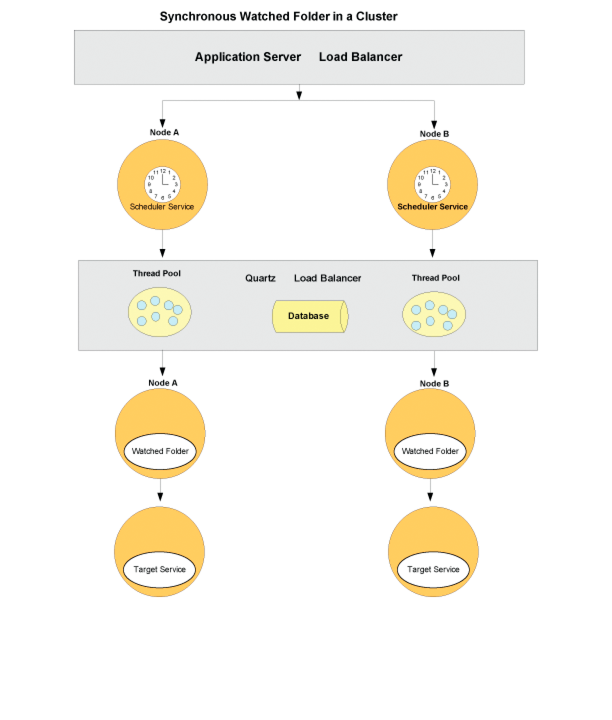

# 감시 폴더 엔드포인트 구성 {#configuring-watched-folder-endpoints}

관리자는 네트워크 폴더를 구성할 수 있습니다. *감시 폴더*&#x200B;를 사용하여 사용자가 감시 폴더에 파일(예: PDF 파일)을 배치할 때 구성된 서비스 작업이 호출되어 파일을 조작합니다. 서비스가 지정된 작업을 수행하면 수정된 파일이 지정된 출력 폴더에 저장됩니다.

## 감시 폴더 서비스 구성 {#configuring-the-watched-folder-service}

감시 폴더 끝점을 구성하기 전에 감시 폴더 서비스를 구성합니다. 감시 폴더 서비스의 구성 매개 변수에는 두 가지 목적이 있습니다.

* 모든 감시 폴더 끝점에 공통인 특성을 구성하려면
* 모든 감시 폴더 끝점에 대한 기본값을 제공하려면

감시 폴더 서비스를 구성한 후 대상 서비스에 대한 감시 폴더 끝점을 추가합니다. 끝점을 추가할 때 구성된 감시 폴더 서비스의 입력 폴더에 파일이나 폴더를 배치할 때 호출할 서비스 이름 및 작업 이름과 같은 값을 설정합니다. 감시 폴더 서비스 구성에 대한 자세한 내용은 다음을 참조하십시오 [감시 폴더 서비스 설정](/help/forms/using/admin-help/configure-service-settings.md#watched-folder-service-settings).

## 감시 폴더 만들기 {#creating-a-watched-folder}

다음 두 가지 방법으로 감시 폴더를 만들 수 있습니다.

* 감시 폴더 끝점에 대한 설정을 구성할 때 다음 예와 같이 경로 상자에 상위 디렉토리에 대한 전체 경로를 입력하고 생성할 감시 폴더의 이름을 추가합니다.
   `  C:\MyPDFs\MyWatchedFolder`MyViewedFolder 폴더가 아직 없으므로 AEM Forms는 해당 위치에 폴더를 만들려고 합니다.

* 감시 폴더 끝점을 구성하기 전에 파일 시스템에 폴더를 만든 다음 경로 상자에 전체 경로를 입력합니다.

클러스터된 환경에서 감시 폴더로 사용할 폴더는 파일 시스템 또는 네트워크에서 액세스 가능하고 쓰기 가능하며 공유되어야 합니다. 이 시나리오에서는 클러스터의 각 응용 프로그램 서버 인스턴스가 동일한 공유 폴더에 액세스할 수 있어야 합니다.

Windows에서 응용 프로그램 서버가 서비스로 실행 중인 경우 다음 방법 중 하나로 공유 폴더에 대한 적절한 액세스 권한을 사용하여 시작해야 합니다.

* 다른 이름으로 응용 프로그램 서버 서비스 로그온 구성 **매개 변수** 공유 감시 폴더에 대한 적절한 액세스 권한을 가진 특정 사용자로 시작할 수 있습니다.
* 서비스가 데스크톱과 상호 작용할 수 있도록 [응용 프로그램 서버 서비스를 [로컬 시스템으로 시작] 옵션을 구성합니다. 이 옵션을 사용하려면 공유 감시 폴더에 액세스하여 모든 사람이 쓸 수 있어야 합니다.

## 감시 폴더 결합 {#chaining-together-watched-folders}

감시 폴더를 함께 체인화할 수 있으므로 한 감시 폴더의 결과 문서가 다음 감시 폴더의 입력 문서입니다. 감시 폴더마다 다른 서비스를 호출할 수 있습니다. 이러한 방식으로 감시 폴더를 구성하면 여러 서비스를 호출할 수 있습니다. 예를 들어, 한 감시 폴더는 PDF 파일을 Adobe PostScript®로 변환할 수 있고, 두 번째 감시 폴더는 PostScript 파일을 PDF/A 형식으로 변환할 수 있습니다. 이렇게 하려면 *결과* 첫 번째 종단점에 의해 정의된 감시 폴더의 폴더를 가리키도록 *입력* 두 번째 종단점에 의해 정의된 감시 폴더의 폴더입니다.

첫 번째 전환에서 출력하면 \path\result로 이동합니다. 두 번째 변환에 대한 입력은 \path\result이고 두 번째 변환에서 출력되는 값은 \path\result\result (또는 두 번째 변환에 대한 [결과 폴더] 상자에 정의하는 디렉토리)로 이동합니다.

## 사용자가 감시 폴더와 상호 작용하는 방법 {#how-users-interact-with-watched-folders}

감시 폴더 끝점의 경우, 사용자는 데스크톱에서 감시 폴더로 입력 파일 또는 폴더를 복사하거나 드래그하여 을 수 있습니다. 그 파일들은 도착하는 순서대로 처리된다.

감시 폴더 끝점의 경우 작업에 하나의 입력 파일만 필요한 경우 사용자는 해당 파일을 감시 폴더의 루트에 복사할 수 있습니다.

작업에 두 개 이상의 입력 파일이 포함된 경우 모든 필수 파일을 포함하는 감시 폴더 계층 구조 외부에 폴더를 만들어야 합니다. 이 새 폴더에는 입력 파일(및 프로세스에 필요한 경우 DDX 파일)이 포함되어야 합니다. 작업 폴더가 만들어지면 사용자는 해당 폴더를 감시 폴더의 입력 폴더로 복사합니다.

>[!NOTE]
>
>애플리케이션 서버가 감시 폴더의 파일에 대한 액세스를 삭제했는지 확인합니다. AEM Forms가 스캔한 후 입력 폴더에서 파일을 삭제할 수 없으면 연결된 프로세스가 무기한 호출됩니다.

## 감시 폴더 출력 {#watched-folder-output}

입력이 폴더이고 출력이 여러 파일로 구성된 경우, AEM Forms는 입력 폴더와 동일한 이름으로 출력 폴더를 만들고 출력 파일을 해당 폴더로 복사합니다. 출력 프로세스의 출력과 같이 키-값 쌍이 포함된 문서 맵으로 출력이 구성되면 해당 키가 출력 파일 이름으로 사용됩니다.

끝점 프로세스에서 발생하는 출력 파일 이름에는 문자, 숫자 및 마침표(.) 이외의 문자를 사용할 수 없습니다 파일 확장자 앞에 추가합니다. AEM Forms는 다른 문자를 16진수 값으로 변환합니다.

클라이언트 응용 프로그램은 감시 폴더 결과 폴더에서 결과 문서를 선택합니다. 프로세스 오류가 감시 폴더 실패 폴더에 기록됩니다.

## 감시 폴더 작동 방식 {#how-watched-folder-works}

감시 폴더 모듈에는 다음 서비스가 포함되어 있습니다.

* 감시 폴더 서비스
* provider.file_scan_service
* provider.file_write_results_service

위에 나열된 서비스 외에도 감시 폴더는 작업 예약을 위한 스케줄러 서비스 및 대상 서비스의 비동기 호출을 지원하기 위한 작업 관리자 서비스를 비롯한 다른 서비스에 종속됩니다.

### 감시 폴더가 호출 요청을 처리하는 방법 {#how-watched-folder-processes-an-invocation-request}

감시 폴더 서비스는 끝점의 만들기, 업데이트 및 삭제를 처리합니다. 관리자가 끝점을 만들면 지정된 반복 간격 또는 크론 식을 기반으로 스케줄러 서비스에 의해 트리거되도록 예약됩니다.

이 다이어그램은 감시 폴더가 호출 요청을 처리하는 방법을 보여줍니다.

감시 폴더를 사용하여 서비스를 호출하는 프로세스는 다음과 같습니다.

1. 클라이언트 응용 프로그램은 감시 폴더 입력 폴더에 파일이나 폴더를 배치합니다.
1. 작업 검색 간격이 발생하면 스케줄러 서비스는 provider.file_scan_service를 호출하여 입력 폴더의 파일 또는 폴더를 처리합니다.
1. provider.file_scan_service는 다음 작업을 수행합니다.

   * 포함 파일 패턴과 일치하는 파일 또는 폴더의 입력 폴더를 검색하고 지정된 제외 파일 패턴의 파일 또는 폴더를 제외합니다. 가장 오래된 파일이나 폴더가 먼저 선택됩니다. 대기 시간보다 오래된 파일과 폴더도 선택됩니다. 한 번의 검사에서 처리되는 파일 또는 폴더의 수는 일괄 처리 크기에 따라 달라집니다. 파일 패턴에 대한 자세한 내용은 [파일 패턴 정보](configuring-watched-folder-endpoints.md#about-file-patterns). 배치 크기 설정에 대한 자세한 내용은 [감시 폴더 서비스 설정](/help/forms/using/admin-help/configure-service-settings.md#watched-folder-service-settings).
   * 처리할 파일이나 폴더를 선택합니다. 파일 또는 폴더가 완전히 다운로드되지 않으면 다음 검사에서 선택됩니다. 폴더가 완전히 다운로드되었는지 확인하려면 관리자는 제외 파일 패턴을 사용하여 이름이 있는 폴더를 만들어야 합니다. 폴더에 모든 파일이 있는 후에는 포함 파일 패턴에 지정된 패턴으로 이름을 변경해야 합니다. 이 단계에서는 폴더에 서비스를 호출하는 데 필요한 모든 파일이 있는지 확인합니다. 폴더가 완전히 다운로드되었는지 확인하는 방법에 대한 자세한 내용은 [감시 폴더에 대한 팁과 트릭](configuring-watched-folder-endpoints.md#tips-and-tricks-for-watched-folders).
   * 처리할 파일 또는 폴더를 선택한 후 스테이지 폴더로 이동합니다.
   * 끝점 입력 매개 변수 매핑을 기반으로 스테이지 폴더의 파일 또는 폴더를 적절한 입력으로 변환합니다. 입력 매개 변수 매핑의 예는 를 참조하십시오 [감시 폴더에 대한 팁과 트릭](configuring-watched-folder-endpoints.md#tips-and-tricks-for-watched-folders).

1. 끝점에 대해 구성된 대상 서비스는 동기식으로 또는 비동기식으로 호출됩니다. 끝점에 대해 구성된 사용자 이름 및 암호를 사용하여 대상 서비스가 호출됩니다.

   * 동기 호출은 대상 서비스를 직접 호출하고 응답을 즉시 처리합니다.
   * 비동기 호출의 경우 대상 서비스가 작업 관리자 서비스를 통해 호출되어 요청이 큐에 배치됩니다. Job Manager Service가 provider.file_write_results_service를 호출하여 결과를 처리합니다.

1. provider.file_write_results_service는 대상 서비스 호출의 응답 또는 실패를 처리합니다. 성공하면 종단점 구성에 따라 출력이 결과 폴더에 저장됩니다. 또한 provider.file_write_results_service는 끝점이 성공적으로 완료되었을 때 결과를 보존하도록 구성된 경우 소스를 유지합니다.

   대상 서비스의 호출로 인해 오류가 발생하면 provider.file_write_results_service는 failure.log 파일에 실패 이유를 기록하고 해당 파일을 실패 폴더에 배치합니다. 실패 폴더는 엔드포인트에 대해 지정된 구성 매개 변수를 기반으로 만들어집니다. 관리자가 끝점 구성에 대한 실패 시 보존 옵션을 설정하면 provider.file_write_results_service는 소스 파일도 실패 폴더로 복사합니다. 실패 폴더에서 파일을 복구하는 방법에 대한 자세한 내용은 [장애 지점 및 복구](configuring-watched-folder-endpoints.md#failure-points-and-recovery).

## 감시 폴더 끝점 설정 {#watched-folder-endpoint-settings}

다음 설정을 사용하여 감시 폴더 끝점을 구성합니다.

**이름:** (필수) 끝점을 식별합니다. Workspace에 표시되는 이름을 자릅니다. &lt; 문자는 포함하지 마십시오. URL을 끝점의 이름으로 입력하는 경우 RFC1738에 지정된 구문 규칙을 따르는지 확인하십시오.

**설명:** 끝점에 대한 설명입니다. 작업 공간에 표시되는 설명이 잘리기 때문에 &lt; 문자를 포함하지 마십시오.

**경로:** (필수) 감시 폴더 위치를 지정합니다. 클러스터된 환경에서 이 설정은 클러스터의 모든 컴퓨터에서 액세스할 수 있는 공유 네트워크 폴더를 가리켜야 합니다.

**비동기:** 호출 유형을 비동기 또는 동기식으로 식별합니다. 기본값은 비동기적입니다. 비동기식은 장기간 프로세스에 권장되지만, 임시 또는 단기 프로세스에 대해서는 동기식이 권장됩니다.

**크론 식:** 크론 표현식을 사용하여 감시 폴더를 예약해야 하는 경우 크론 표현식을 입력합니다. 이 설정을 구성하면 반복 간격이 무시됩니다.

**반복 간격:** 입력된 감시 폴더를 검색하는 간격(초)입니다. [스로틀] 설정을 사용하지 않는 경우 [반복 간격]은 평균 작업을 처리하는 시간보다 길어야 합니다. 그렇지 않으면 시스템이 오버로드될 수 있습니다. 기본값은 5입니다. 자세한 내용은 배치 크기에 대한 설명을 참조하십시오.

**반복 횟수:** 감시 폴더가 폴더 또는 디렉터리를 검색하는 횟수입니다. 값이 -1이면 무제한 검색을 나타냅니다. 기본값은 -1입니다.

**스로틀:** 이 옵션을 선택하면 AEM Forms가 지정된 시간에 처리하는 감시 폴더 작업 수를 제한합니다. 최대 작업 수는 배치 크기 값으로 결정됩니다. 제한 정보를 참조하십시오.

**사용자 이름:** (필수) 감시 폴더에서 대상 서비스를 호출할 때 사용되는 사용자 이름입니다. 기본값은 SuperAdmin입니다.

**도메인 이름:** (필수) 사용자의 도메인입니다. 기본값은 DefaultDom입니다.

**배치 크기:** 스캔당 선택할 파일 또는 폴더의 수입니다. 시스템에 과부하를 방지하는 데 사용 한 번에 너무 많은 파일을 검사하면 충돌이 발생할 수 있습니다. 기본값은 2입니다.

[반복 간격] 및 [일괄 처리 크기] 설정은 모든 검사에서 감시 폴더의 파일 수를 결정합니다. 감시 폴더는 Quartz 스레드 풀을 사용하여 입력 폴더를 검색합니다. 스레드 풀은 다른 서비스와 공유됩니다. 검색 간격이 작은 경우 스레드가 입력 폴더를 자주 스캔합니다. 파일이 자주 감시 폴더에 드롭되는 경우 스캔 간격을 작게 유지해야 합니다. 파일을 자주 삭제하는 경우 다른 서비스에서 스레드를 사용할 수 있도록 더 큰 검색 간격을 사용하십시오.

많은 수의 파일을 삭제하는 경우 일괄 처리 크기를 크게 만듭니다. 예를 들어, 감시 폴더 끝점에 의해 호출된 서비스가 분당 700개의 파일을 처리할 수 있고 사용자가 파일을 입력 폴더에 같은 속도로 삭제한 경우 배치 크기를 350으로 설정하고 반복 간격을 30초로 설정하면 감시 폴더를 너무 자주 스캔하지 않고도 감시 폴더 성능이 향상됩니다.

파일이 감시 폴더에 드롭되면 입력에 파일이 나열되므로 스캔이 발생하는 경우 초당 성능이 저하될 수 있습니다. 스캔 간격을 늘리면 성능이 향상됩니다. 삭제되는 파일의 볼륨이 작은 경우 그에 따라 [일괄 처리 크기] 및 [반복 간격]을 조정합니다. 예를 들어 매 초마다 10개의 파일이 삭제되는 경우 반복 간격을 1초로 설정하고 배치 크기를 10으로 설정합니다.

**대기 시간:** 폴더나 파일을 만든 후 스캔하기 전에 대기할 시간(밀리초)입니다. 예를 들어 대기 시간이 3,600,000밀리초(1시간)이고 파일이 1분 전에 만들어진 경우 이 파일은 59분 이상 경과하면 선택됩니다. 기본값은 0입니다.

이 설정은 파일이나 폴더가 입력 폴더에 완전히 복사되도록 하는 데 유용합니다. 예를 들어 처리할 대용량 파일이 있고 파일을 다운로드하는 데 10분이 걸리는 경우 대기 시간을 10&amp;ast;60 &amp;ast;1000밀리초로 설정합니다. 이렇게 하면 감시 폴더가 10분이 채 되지 않은 경우 해당 파일을 스캔하지 못합니다.

**제외 파일 패턴:** 세미콜론 **;** 감시 폴더에서 검색하고 선택할 파일과 폴더를 결정하는 데 사용하는 구분된 패턴 목록입니다. 이 패턴이 있는 파일 또는 폴더는 처리를 위해 검사되지 않습니다.

이 설정은 입력이 여러 파일이 있는 폴더일 때 유용합니다. 폴더의 컨텐츠를 감시 폴더에서 선택할 이름의 폴더에 복사할 수 있습니다. 이렇게 하면 폴더가 입력 폴더에 완전히 복사되기 전에 감시 폴더가 처리할 폴더를 선택하지 못합니다.

파일 패턴을 사용하여 다음을 제외할 수 있습니다.

* 특정 파일 이름 확장자를 갖는 파일 예: &amp;ast;.dat, &amp;ast;.xml, &amp;ast;.pdf
* 특정 이름을 갖는 파일 예를 들어, 데이터.&amp;ast; 는 *data1*, *data2*&#x200B;등
* 다음 예와 같이 이름 및 확장명에 복합 표현식이 있는 파일:

   * 데이터[0-9][0-9][0-9].[dD][aA]&#39;port&#39;
   * ast;(&amp;A)[dD][Aa]&#39;port&#39;
   * ast;(&amp;A)[Xx][Mm][Ll]

파일 패턴에 대한 자세한 내용은 [파일 패턴 정보](configuring-watched-folder-endpoints.md#about-file-patterns).

**파일 패턴 포함:** (필수) 세미콜론 **;** 감시 폴더에서 검색하고 선택할 폴더와 파일을 결정하는 데 사용하는 패턴의 구분된 목록입니다. 예를 들어, 파일 패턴 포함 이 입력 및 상태인 경우 input&amp;ast와 일치하는 모든 파일 및 폴더 다 찍혔어 여기에는 input1, input2 등의 파일과 폴더가 포함됩니다.

기본값은 &amp;ast;입니다. 및 은 모든 파일과 폴더를 나타냅니다.

파일 패턴을 사용하여 다음을 포함할 수 있습니다.

* 특정 파일 이름 확장자를 갖는 파일 예: &amp;ast;.dat, &amp;ast;.xml, &amp;ast;.pdf
* 특정 이름을 갖는 파일 예를 들어, 데이터.&amp;ast; 에는 *data1*, *data2*&#x200B;등
* 다음 예와 같이 이름 및 확장명에 복합 표현식이 있는 파일:

   * 데이터[0-9][0-9][0-9].[dD][aA]&#39;port&#39;
   * ast;(&amp;A)[dD][Aa]&#39;port&#39;
   * ast;(&amp;A)[Xx][Mm][Ll]

파일 패턴에 대한 자세한 내용은 [파일 패턴 정보](configuring-watched-folder-endpoints.md#about-file-patterns).

**결과 폴더:** 저장된 결과가 저장되는 폴더입니다. 결과가 이 폴더에 나타나지 않으면 실패 폴더를 확인하십시오. 읽기 전용 파일은 처리되지 않고 실패 폴더에 저장됩니다. 이 값은 다음 파일 패턴을 사용하는 절대 또는 상대 경로일 수 있습니다.

* %F = 파일 이름 접두사
* %E = 파일 이름 확장명
* %Y = 년(전체)
* %y = 년(마지막 두 자리)
* %M = 월
* %D = 월 중 일
* %d = 일
* %H = 시간(24시간)
* %h = 시간(12시간)
* %m = 분
* %s = 초
* %l = 밀리초
* %R = 난수(0에서 9 사이)
* %P = 프로세스 또는 작업 ID

예를 들어, 2009년 7월 17일 오후 8시이고 `C:/Test/WF0/failure/%Y/%M/%D/%H/`, 결과 폴더는 다음과 같습니다. `C:/Test/WF0/failure/2009/07/17/20`.

경로가 절대 경로가 아니라 상대적 경로인 경우 감시 폴더 내에 폴더가 만들어집니다. 기본값은 감시 폴더 내의 결과 폴더인 결과/%Y/%M/%D/ 입니다. 파일 패턴에 대한 자세한 내용은 [파일 패턴 정보](configuring-watched-folder-endpoints.md#about-file-patterns).

>[!NOTE]
>
>결과 폴더의 크기가 작을수록 더 나은 감시 폴더 성능이 유지됩니다. 예를 들어 감시 폴더의 예상 로드가 매시간마다 1000개의 파일인 경우 다음과 같은 패턴을 시도하십시오 `result/%Y%M%D%H` 따라서 매시간마다 새 하위 폴더가 생성됩니다. 로드가 작은 경우(예: 하루에 1000개 파일) 다음과 같은 패턴을 사용할 수 있습니다 `result/%Y%M%D`.

**폴더 유지:** 스캔 및 픽업 후 파일이 저장되는 위치입니다. 경로는 절대, 상대 또는 null 디렉토리 경로일 수 있습니다. 결과 폴더에 대해 설명된 대로 파일 패턴을 사용할 수 있습니다. 기본값은 preserve/%Y/%M/%D/입니다.

**실패 폴더:** 실패 파일이 저장되는 폴더입니다. 이 위치는 항상 감시 폴더를 기준으로 합니다. 결과 폴더에 대해 설명된 대로 파일 패턴을 사용할 수 있습니다.

읽기 전용 파일은 처리되지 않고 실패 폴더에 저장됩니다.

기본값은 오류입니다/%Y/%M/%D/.

**실패 시 보존:** 서비스에서 작업을 실행하지 못하는 경우 입력 파일을 유지합니다. 기본값은 true입니다.

**중복 파일 이름 덮어쓰기:** True로 설정하면 결과 폴더 및 보존 폴더의 파일을 덮어씁니다. False로 설정하면 이름에 숫자 인덱스 접미어가 있는 파일 및 폴더가 사용됩니다. 기본값은 False입니다.

**삭제 기간:** (필수) 결과 폴더의 파일과 폴더는 이 값보다 오래되면 제거됩니다. 이 값은 일 단위로 측정됩니다. 이 설정은 결과 폴더가 꽉 차지 않도록 하는 데 유용합니다.

-1일 값은 결과 폴더를 삭제하지 않음을 나타냅니다. 기본값은 -1입니다.

**작업 이름:** (필수) 감시 폴더 끝점에 지정할 수 있는 작업 목록입니다.

**입력 매개 변수 매핑:** 서비스 및 작업을 처리하는 데 필요한 입력을 구성하는 데 사용됩니다. 사용 가능한 설정은 감시 폴더 끝점을 사용하는 서비스에 따라 다릅니다. 입력 유형은 다음과 같습니다.

**리터럴:** 감시 폴더는 표시된 대로 필드에 입력한 값을 사용합니다. 모든 기본 Java 유형이 지원됩니다. 예를 들어 API가 String, long, int 및 Boolean과 같은 입력을 사용하는 경우 문자열이 적절한 유형으로 변환되고 서비스가 호출됩니다.

**변수:** 입력한 값은 감시 폴더에서 입력을 선택하는 데 사용하는 파일 패턴입니다. 예를 들어, 암호 암호화 서비스의 경우, 입력 문서가 PDF 파일이어야 하는 경우 파일 패턴으로 &amp;ast;.pdf를 사용할 수 있습니다. 감시 폴더는 이 패턴과 일치하는 감시 폴더의 모든 파일을 선택하고 각 파일에 대해 서비스를 호출합니다. 변수를 사용하면 모든 입력 파일이 문서로 변환됩니다. 문서를 입력 유형으로 사용하는 API만 지원됩니다.

**출력 매개 변수 매핑:** 서비스 및 작업의 출력을 구성하는 데 사용됩니다. 사용 가능한 설정은 감시 폴더 끝점을 사용하는 서비스에 따라 다릅니다.

감시 폴더 출력은 단일 문서, 문서 목록 또는 문서 맵일 수 있습니다. 그런 다음 출력 매개변수 매핑에 지정된 패턴을 사용하여 결과 폴더에 이러한 출력 문서가 저장됩니다.

>[!NOTE]
>
>고유한 출력 파일 이름을 생성하는 이름을 지정하면 성능이 향상됩니다. 예를 들어, 서비스가 하나의 출력 문서를 반환하고 출력 매개 변수 매핑이 이를 `%F.%E` (입력 파일의 파일 이름 및 확장명) 이 경우 사용자가 분당 동일한 이름의 파일을 삭제하고 결과 폴더가 `result/%Y/%M/%D`과 같은 위치에 있고 중복 파일 이름 덮어쓰기 설정이 꺼져 있으면 감시 폴더는 중복 파일 이름을 확인하려고 합니다. 중복 파일 이름을 확인하는 프로세스는 성능에 영향을 줄 수 있습니다. 이 경우 출력 매개 변수 매핑을 `%F_%h_%m_%s_%l` 이름에 시간, 분, 초 및 밀리초를 추가하거나 드롭된 파일의 이름이 고유한지 확인하려면 성능이 향상됩니다.

## 파일 패턴 정보 {#about-file-patterns}

관리자는 서비스를 호출할 수 있는 파일 유형을 지정할 수 있습니다. 감시 폴더별로 여러 파일 패턴을 설정할 수 있습니다. 파일 패턴은 다음 파일 속성 중 하나일 수 있습니다.

* 특정 파일 이름 확장자를 가진 파일 예: &amp;ast;.dat, &amp;ast;.xml, &amp;ast;.pdf,;
* 특정 이름을 갖는 파일 예를 들어, 데이터.&amp;ast;
* 다음 예와 같이 이름 및 확장명에 복합 표현식이 있는 파일:

   * 데이터[0-9][0-9][0-9].[dD][aA]&#39;port&#39;
   * ast;(&amp;A)[dD][Aa]&#39;port&#39;
   * ast;(&amp;A)[Xx][Mm][Ll]

관리자는 결과를 저장할 출력 폴더의 파일 패턴을 정의할 수 있습니다. 출력 폴더(결과, 보존 및 실패)에 대해 관리자는 다음 파일 패턴을 지정할 수 있습니다.

* %Y = 년(전체)
* %y = 년(마지막 두 자리)
* %M = 월,
* %D = 월 중 일,
* %d = 일,
* %h = 시간,
* %m = 분,
* %s = 초,
* %R = 0-9 사이의 난수
* %J = 작업 이름

예를 들어 결과 폴더의 경로는 다음과 같습니다 `C:\Adobe\Adobe_Experience_Manager_forms\BarcodedForms\%y\%m\%d`.

출력 매개 변수 매핑은 다음과 같은 추가 패턴을 지정할 수도 있습니다.

* %F = 소스 파일 이름
* %E = 원본 파일 이름 확장명

출력 매개 변수 매핑 패턴이 &quot;File.separator&quot;(경로 구분 기호)로 끝나는 경우 폴더가 만들어지고 해당 컨텐츠가 해당 폴더에 복사됩니다. 패턴이 &quot;File.separator&quot;로 끝나지 않으면 콘텐츠(결과 파일 또는 폴더)가 해당 이름으로 만들어집니다. 출력 매개 변수 매핑에 대한 자세한 내용은 [감시 폴더에 대한 팁과 트릭](configuring-watched-folder-endpoints.md#tips-and-tricks-for-watched-folders).

## 제한 정보 {#about-throttling}

감시 폴더 끝점에 대해 제한이 활성화되면 지정된 시간에 처리할 수 있는 감시 폴더 작업 수를 제한합니다. 최대 작업 수는 일괄 처리 크기 값에 의해 결정되며, 감시 폴더 끝점에서도 구성할 수 있습니다. 제한 제한에 도달했을 때 감시 폴더의 입력 디렉터리에 있는 수신 문서는 폴링되지 않습니다. 또한 해당 문서는 다른 감시 폴더 작업이 완료되고 다른 폴링 시도가 수행될 때까지 입력 디렉토리에 유지됩니다. 동기 처리의 경우 단일 스레드에서 작업이 연속적으로 처리되는 경우에도 단일 폴링에서 처리된 모든 작업이 제한 제한에 도달합니다.

>[!NOTE]
>
>클러스터로 인해 제한이 확장되지 않습니다. 조절이 활성화되면 전체 클러스터는 지정된 시간에 일괄 처리 크기에 지정된 작업 수보다 많은 작업을 처리하지 않습니다. 이 제한은 클러스터 전체에 해당하며 클러스터의 각 노드에만 국한되지 않습니다. 예를 들어, 일괄 처리 크기가 2인 경우 두 개의 작업을 처리하는 단일 노드에서 제한 제한에 도달할 수 있으며, 작업 중 하나가 완료될 때까지 다른 노드는 입력 디렉토리를 폴링하지 않습니다.

### 조절 작동 방식 {#how-throttling-works}

감시 폴더는 각 반복 간격에서 입력 폴더를 검색하고, 배치 크기에 지정된 파일 수를 선택하고, 이러한 각 파일에 대한 대상 서비스를 호출합니다. 예를 들어 일괄 처리 크기가 4인 경우 각 검사에서 감시 폴더는 4개의 파일을 선택하고 4개의 호출 요청을 만들고 대상 서비스를 호출합니다. 이러한 요청이 완료되기 전에 Viewed Folder가 호출되면 이전 4개의 작업이 완료되었는지 여부에 관계없이 4개의 작업이 다시 시작됩니다.

전송률 조절은 이전 작업이 완료되지 않은 경우 감시 폴더가 새 작업을 호출하지 못하도록 합니다. 감시 폴더는 진행 중인 작업을 감지하고 진행 중인 작업을 제외한 일괄 처리 크기에 따라 새 작업을 처리합니다. 예를 들어, 두 번째 호출에서 완료된 작업 수가 3개이고 작업이 아직 진행 중인 경우 감시 폴더는 3개의 작업만 추가로 호출합니다.

* 감시 폴더는 진행 중인 작업 수를 확인하기 위해 단계 폴더에 있는 파일 수를 사용합니다. 스테이지 폴더에서 파일이 처리되지 않은 상태로 남아 있는 경우 감시 폴더는 더 이상 작업을 호출하지 않습니다. 예를 들어 일괄 처리 크기가 4개 및 3개의 작업이 정지된 경우 Viewed Folder는 후속 호출에서 한 개의 작업만 호출합니다. 스테이지 폴더에서 파일이 처리되지 않은 상태로 유지될 수 있는 여러 가지 시나리오가 있습니다. 작업이 정지된 경우 Viewed Folder가 파일을 스테이지 폴더 밖으로 이동하도록 관리자가 Forms Workflow 관리 페이지에서 프로세스를 종료할 수 있습니다.
* Viewed Folder가 작업을 호출하기 전에 Forms 서버가 다운되면 관리자는 파일을 스테이지 폴더에서 이동할 수 있습니다. 자세한 내용은 [장애 지점 및 복구](configuring-watched-folder-endpoints.md#failure-points-and-recovery).
* Forms 서버가 실행 중이지만 Job Manager 서비스가 다시 호출될 때 Watched Folder가 실행되고 있지 않으면, 이 작업은 순서가 지정된 시퀀스에서 서비스가 시작되지 않을 때 발생합니다. 관리자는 파일을 스테이지 폴더에서 이동할 수 있습니다. 자세한 내용은 [장애 지점 및 복구](configuring-watched-folder-endpoints.md#failure-points-and-recovery).

## 성능 및 확장성 {#performance-and-scalability}

감시 폴더는 하나의 노드에서 총 100개의 폴더를 제공할 수 있습니다. 감시 폴더의 성능은 Forms 서버의 성능에 따라 다릅니다. 비동기 호출의 경우 성능은 작업 관리자 큐에 있는 시스템 로드 및 작업에 더 의존합니다.

클러스터에 노드를 추가하여 감시 폴더 성능을 향상시킬 수 있습니다. 감시 폴더 작업은 Quartz 스케줄러에 의해 클러스터 노드 전체에 배포되며 비동기 요청의 경우 Job Manager 서비스에 의해 배포됩니다. 모든 작업은 데이터베이스에 유지됩니다.

감시 폴더는 작업을 예약, 예약 취소 및 예약하기 위한 스케줄러 서비스에 따라 다릅니다. Scheduler 서비스 스레드 풀을 공유하는 Event Management Service, User Manager Service 및 Email Provider Service와 같은 기타 서비스를 사용할 수 있습니다. 이는 감시 폴더 성능에 영향을 줄 수 있습니다. 모든 서비스가 스케줄러 서비스 스레드 풀 사용을 시작할 때 스케줄러 서비스 스레드 풀 튜닝을 수행해야 합니다.

## 클러스터의 감시 폴더 {#watched-folders-in-a-cluster}

클러스터에서 감시 폴더는 로드 밸런싱 및 페일오버를 위한 Quartz 스케줄러와 Job Manager 서비스에 따라 달라집니다. Quartz 클러스터 동작에 대한 자세한 내용은 [Quartz 설명서](https://www.quartz-scheduler.org/documentation).

감시 폴더는 각 폴링에서 다음 세 가지 주요 작업을 수행합니다.

* 폴더 스캔
* 대상 서비스 호출
* 결과 처리

로드 밸런싱 및 장애 조치 동작은 감시 폴더가 동기식 또는 비동기식 호출을 위해 구성되어 있는지 여부에 따라 변경됩니다.

### 클러스터의 동기식 감시 폴더 {#synchronous-watched-folder-in-a-cluster}

동기 호출의 경우, Quartz 로드 밸런서는 폴링 이벤트를 가져올 노드를 결정합니다. 폴링 이벤트를 가져오는 노드는 다음과 같은 모든 작업을 수행합니다. 폴더를 검색하고 대상 서비스를 호출한 다음 결과를 처리합니다.

동기 호출의 경우, 한 노드가 실패하면 Quartz 스케줄러가 다른 노드에 새 폴링 이벤트를 보냅니다. 실패한 노드에서 시작된 호출은 손실됩니다. 실패한 작업과 연결된 파일을 복구하는 방법에 대한 자세한 내용은 [장애 지점 및 복구](configuring-watched-folder-endpoints.md#failure-points-and-recovery).

### 클러스터의 비동기 감시 폴더 {#asynchronous-watched-folder-in-a-cluster}

비동기 호출의 경우 Quartz 로드 밸런서에서 폴링 이벤트를 가져올 노드를 결정합니다. 폴링 이벤트를 가져오는 노드는 입력 폴더를 검색하고 작업 관리자 서비스 큐에 요청을 배치하여 대상 서비스를 호출합니다. Job Manager 서비스 로드 밸런서는 호출 요청을 처리할 노드를 결정합니다. 노드 A가 호출 요청을 만들었더라도 노드 B가 요청 처리를 종료할 수 있습니다. 또는 호출 요청을 시작한 노드가 요청 처리를 종료할 수도 있습니다.

비동기 호출의 경우 한 노드가 실패하면 Quartz 스케줄러가 다른 노드에 새 폴링 이벤트를 보냅니다. 실패한 노드에서 만든 호출 요청은 작업 관리자 서비스 큐에 있으며 처리를 위해 다른 노드로 전송됩니다. 호출 요청이 만들어지지 않은 파일은 스테이지 폴더에 유지됩니다. 실패한 작업과 연결된 파일을 복구하는 방법에 대한 자세한 내용은 [장애 지점 및 복구](configuring-watched-folder-endpoints.md#failure-points-and-recovery).

## 장애 지점 및 복구 {#failure-points-and-recovery}

각 폴링 이벤트에서 감시 폴더는 입력 폴더를 잠기고 포함 파일 패턴과 일치하는 파일을 스테이지 폴더로 이동한 다음 입력 폴더를 잠금 해제합니다. 두 스레드에서 동일한 파일 세트를 선택하고 두 번 처리하지 않도록 잠금이 필요합니다. 이러한 상황이 발생할 가능성은 작은 반복 간격과 큰 일괄 처리 크기로 증가합니다. 파일이 스테이지 폴더로 이동되면 다른 스레드가 폴더를 검사할 수 있도록 입력 폴더의 잠금이 해제됩니다. 이 단계는 한 스레드가 파일을 처리하는 동안 다른 스레드가 스캔할 수 있으므로 높은 처리량을 제공하는 데 도움이 됩니다.

파일이 스테이지 폴더로 이동되면 각 파일에 대한 호출 요청이 생성되고 대상 서비스가 호출됩니다. 감시 폴더가 스테이지 폴더의 파일을 복구할 수 없는 경우가 있을 수 있습니다.

* Watched Folder가 호출 요청을 만들기 전에 서버가 다운되면 스테이지 폴더의 파일이 스테이지 폴더에 남아 있고 복구되지 않습니다.
* Viewed Folder가 스테이지 폴더의 각 파일에 대한 호출 요청을 성공적으로 만들고 서버가 충돌하는 경우 호출 유형에 따라 두 가지 동작이 있습니다.

**동기:** 감시 폴더가 서비스를 동기식으로 호출하도록 구성된 경우 스테이지 폴더의 모든 파일은 스테이지 폴더에서 처리되지 않은 상태로 유지됩니다.

**비동기:** 이 경우 감시 폴더는 작업 관리자 서비스에 의존합니다. 작업 관리자 서비스가 감시 폴더를 호출하면 단계 폴더의 파일이 호출 결과에 따라 보존 또는 실패 폴더로 이동됩니다. 작업 관리자 서비스가 감시 폴더를 호출하지 않으면 파일은 스테이지 폴더에서 처리되지 않은 상태로 유지됩니다. 이 상황은 작업 관리자가 다시 호출할 때 감시 폴더가 실행되고 있지 않을 때 발생합니다.

### 스테이지 폴더에서 처리되지 않은 소스 파일을 복구하는 중 {#recovering-unprocessed-source-files-in-the-stage-folder}

감시 폴더가 스테이지 폴더에서 소스 파일을 처리할 수 없는 경우 처리되지 않은 파일을 복구할 수 있습니다.

1. 응용 프로그램 서버 또는 노드를 다시 시작합니다.
1. (선택 사항) 감시 폴더의 새 입력 파일 처리를 중지합니다. 이 단계를 건너뛸 경우 단계 폴더에서 처리되지 않은 파일을 확인하는 것이 훨씬 어렵습니다. 감시 폴더에서 새 입력 파일을 처리하지 못하게 하려면 다음 작업 중 하나를 수행합니다.

   * 애플리케이션 및 서비스에서 감시 폴더 끝점에 대한 포함 파일 패턴 매개 변수를 새 입력 파일과 일치하지 않는 항목으로 변경합니다(예: `NOMATCH`).
   * 새 입력 파일을 만드는 프로세스를 일시 중지합니다.
   AEM Forms가 모든 파일을 복구하고 처리할 때까지 기다립니다. 대부분의 파일은 복구되고 새 입력 파일은 올바르게 처리되어야 합니다. 감시 폴더에서 파일을 복구하고 처리할 때까지 대기하는 시간은 호출하는 작업의 길이와 복구할 파일 수에 따라 달라집니다.

1. 처리할 수 없는 파일을 확인합니다. 적절한 시간을 기다린 후 이전 단계를 완료하고 단계 폴더에 아직 처리되지 않은 파일이 남아 있는 경우 다음 단계로 이동합니다.

   >[!NOTE]
   >
   >스테이지 디렉토리에서 파일의 날짜 및 타임스탬프를 확인할 수 있습니다. 파일 수와 일반 처리 시간에 따라 어떤 파일이 보류로 간주될 수 있는지 확인할 수 있습니다.

1. 처리되지 않은 파일을 스테이지 디렉토리에서 입력 디렉토리로 복사합니다.
1. 감시 폴더에서 2단계의 새 입력 파일을 처리하지 못한 경우 포함 파일 패턴을 이전 값으로 변경하거나 비활성화한 프로세스를 다시 활성화합니다.

## 감시 폴더의 보안 고려 사항 {#security-considerations-for-watched-folders}

감시된 각 폴더는 사용자 이름과 암호로 구성됩니다. 이러한 자격 증명은 서비스를 호출할 때 사용됩니다. 감시 폴더는 공유 폴더가 기본 보안 파일 시스템으로 보호되어 있으므로 감시 폴더의 소유자만 공유 폴더에 액세스할 수 있습니다.

## 감시 폴더에 대한 팁과 트릭 {#tips-and-tricks-for-watched-folders}

다음은 감시 폴더 엔드포인트를 구성할 때의 팁과 트릭입니다.

* Windows에서 이미지 파일을 처리하는 감시 폴더가 있는 경우 Windows 자동 생성된 Thumbs.db 파일이 감시 폴더에 의해 폴링되지 않도록 [파일 패턴 포함] 또는 [파일 패턴 제외] 옵션의 값을 지정하십시오.
* cron 표현식을 지정하면 반복 간격이 무시됩니다. cron 표현식 사용은 Quartz 오픈 소스 작업 예약 시스템 버전 1.4.0을 기반으로 합니다.
* 일괄 처리 크기는 감시 폴더의 각 검사에서 선택할 파일 또는 폴더의 수입니다. 일괄 처리 크기가 2개 및 10개의 파일 또는 폴더가 감시 폴더 입력 폴더에 있는 경우 각 검사에서는 2개만 선택됩니다. 다음 검사에서는 반복 간격에 지정된 시간 이후에 발생할 다음 두 파일이 선택됩니다.
* 파일 패턴의 경우 관리자는 와일드카드 패턴을 추가로 지원하여 파일 패턴을 지정하는 정규 표현식을 지정할 수 있습니다. 감시 폴더는 &amp;ast;와 같은 와일드카드 패턴을 지원하도록 정규 표현식을 수정합니다.&amp;ast; 또는 &amp;ast;.pdf 이러한 와일드카드 패턴은 정규 표현식에서 지원되지 않습니다.
* 감시 폴더는 입력에 대한 입력 폴더를 검사하며, 파일 또는 폴더 처리를 시작하기 전에 소스 파일 또는 폴더가 입력 폴더에 완전히 복사되었는지 여부를 알 수 없습니다. 파일 또는 폴더를 선택하기 전에 소스 파일 또는 폴더가 감시 폴더의 입력 폴더에 완전히 복사되도록 하려면 다음 작업을 수행합니다.

   * 대기 시간 을 사용합니다. 이 시간은 감시 폴더가 마지막으로 수정한 시간부터 기다리는 시간(밀리초)입니다. 처리할 파일이 큰 경우 이 기능을 사용하십시오. 예를 들어 파일을 다운로드하는 데 10분이 걸리는 경우 대기 시간을 10&amp;ast;60 &amp;ast;1000밀리초로 지정합니다. 이렇게 하면 감시 폴더가 10분 이상 되지 않은 경우 해당 파일을 선택하지 않습니다.
   * 제외 파일 패턴을 사용하고 파일 패턴을 포함합니다. 예를 들어 제외 파일 패턴이 `ex*` 포함 파일 패턴은 다음과 같습니다. `in*`: 감시 폴더는 &quot;in&quot;으로 시작하는 파일을 선택하며 &quot;ex&quot;로 시작하는 파일을 선택하지 않습니다. 큰 파일 또는 폴더를 복사하려면 먼저 파일 또는 폴더의 이름을 변경하여 이름이 &quot;ex&quot;로 시작하도록 하십시오. 이름이 &quot;ex&quot;인 파일 또는 폴더가 감시 폴더에 완전히 복사된 후 이름을 &quot;in&amp;ast;&quot;로 변경합니다.

* 결과 폴더를 지우려면 제거 기간을 사용하십시오. 감시 폴더는 제거 기간에 언급된 기간보다 오래된 모든 파일을 정리합니다. 기간은 일 단위입니다.
* 감시 폴더 끝점을 추가할 때 작업 이름을 선택하면 입력 매개 변수 매핑이 채워집니다. 작업의 각 입력에 대해 하나의 입력 매개변수 매핑 필드가 생성됩니다. 다음은 입력 매개 변수 매핑의 예입니다.

   * 대상 `com.adobe.idp.Document` 입력: 서비스 작업에 유형이 입력되어 있는 경우 `Document`을 지정하는 경우 관리자는 매핑 유형을 `Variable`. 감시 폴더는 입력 매개 변수에 대해 지정된 파일 패턴을 기반으로 감시 폴더의 입력 폴더에서 입력을 선택합니다. 관리자가 `*.pdf` 매개 변수로서 확장명이 .pdf인 각 파일을 선택하여 로 변환됩니다 `com.adobe.idp.Document`, 및 서비스가 호출됩니다.
   * 대상 `java.util.Map` 입력: 서비스 작업에 유형이 입력되어 있는 경우 `Map`을 지정하는 경우 관리자는 매핑 유형을 `Variable` 패턴과 같은 매핑 값을 입력합니다 `*.pdf`. 예를 들어, 서비스에는 2의 맵이 필요합니다 `com.adobe.idp.Document` 입력 폴더에 있는 1.pdf 및 2.pdf와 같은 두 파일을 나타내는 개체입니다. 감시 폴더 는 키가 파일 이름과 값이 인 맵을 만듭니다 `com.adobe.idp.Document`.
   * 대상 `java.util.List` 입력: 서비스 작업에 목록 유형의 입력이 있는 경우, 관리자는 매핑 유형을 `Variable` 패턴과 같은 매핑 값을 입력합니다 `*.pdf`. PDF 파일이 입력 폴더에 삭제되면 감시 폴더는 `com.adobe.idp.Document` 이러한 파일을 나타내고 대상 서비스를 호출하는 개체입니다.
   * 대상 `java.lang.String`: 관리자에게는 두 가지 옵션이 있습니다. 먼저 관리자는 매핑 유형을 `Literal` 을 입력하고 매핑 값을 다음과 같은 문자열로 입력합니다. `hello.` 감시 폴더는 문자열을 사용하여 서비스를 호출합니다 `hello`. 둘째, 관리자는 매핑 유형을 `Variable` 패턴과 같은 매핑 값을 입력합니다 `*.txt`. 후자의 경우 확장자가 .txt인 파일은 서비스를 호출하는 문자열로 강제 전달된 문서로 읽습니다.
   * Java 기본 유형: 관리자는 매핑 유형을 `Literal` 값을 제공합니다. 감시 폴더는 지정된 값으로 서비스를 호출합니다.

* 감시 폴더는 문서 작업을 위한 것입니다. 지원되는 출력은 다음과 같습니다 `com.adobe.idp.Document`, `org.w3c.Document`, `org.w3c.Node`뿐만 아니라 이러한 유형의 목록과 맵도 포함되어 있습니다. 다른 모든 형식은 실패 폴더에서 오류 출력을 생성합니다.
* 결과 폴더에 결과가 없으면 오류 폴더를 확인하여 오류가 발생했는지 확인합니다.
* 감시 폴더는 비동기 모드에서 사용하는 경우 가장 잘 작동합니다. 이 모드에서는 감시 폴더는 호출 요청을 큐에 넣고 다시 호출합니다. 그런 다음 큐가 비동기식으로 처리됩니다. 비동기 옵션이 설정되지 않은 경우 감시 폴더는 대상 서비스를 동기적으로 호출하고 프로세스 엔진은 서비스가 요청과 결과가 생성될 때까지 대기합니다. 대상 서비스가 요청을 처리하는 데 시간이 오래 걸리면 감시 폴더에 시간 초과 오류가 발생할 수 있습니다.
* 가져오기 및 내보내기 작업을 위해 감시 폴더를 만들면 파일 이름 확장명을 추출할 수 없습니다. 감시 폴더를 사용하여 양식 데이터 통합 서비스를 호출할 때 출력 파일의 파일 확장명 유형이 문서 객체 유형의 원하는 출력 형식과 일치하지 않을 수 있습니다. 예를 들어 내보내기 작업을 호출하는 감시 폴더에 대한 입력 파일이 데이터가 포함된 XFA 양식인 경우 출력은 XDP 데이터 파일이어야 합니다. 올바른 파일 이름 확장명을 갖는 출력 파일을 가져오려면 출력 매개 변수 매핑에서 지정할 수 있습니다. 이 예제에서는 출력 매개 변수 매핑에 %F.xdp를 사용할 수 있습니다.
* 감시 폴더는 입력 파일을 폴더에 완전히 복사하기 전에 처리할 수 있습니다. Windows에서는 파일 잠금이 필수가 아닙니다. 따라서 파일이 감시 폴더에 복사되는 경우 감시 폴더는 파일 복사본이 완료될 때까지 기다리지 않고 파일을 스테이지로 이동할 수 있습니다. 이 동작으로 인해 입력 파일의 일부만 처리됩니다. 현재 두 가지 해결 방법이 있습니다.

   * 해결 방법 1

      1. temp&amp;ast;.ps와 같이 제외 파일 패턴에 대한 패턴을 지정합니다.
      1. temp(예: temp1.ps)로 시작하는 파일을 감시 폴더로 복사합니다.
      1. 파일이 감시 폴더에 완전히 복사된 후 파일 이름을 포함 파일 패턴에 대해 지정된 패턴과 일치하도록 변경합니다. 그런 다음 감시 폴더를 사용하여 완료된 파일을 스테이지로 이동합니다.
   * 해결 방법 2

      파일을 감시 폴더에 복사하는 데 걸리는 최대 시간을 알고 있는 경우 대기 시간을 초 단위로 지정합니다. 그러면 감시 폴더는 파일을 스테이지로 이동하기 전에 지정된 시간을 기다립니다.

      Windows에서는 한 스레드가 작성될 때 파일을 잠그는 문제가 되지 않습니다. 그러나 이 문제는 Windows에서 폴더에 문제가 됩니다. 폴더의 경우 해결 방법 1의 단계를 수행해야 합니다.

* 감시 폴더의 폴더 이름 보존 끝점 속성이 null 디렉토리 경로로 설정된 경우 스테이징 디렉토리가 제대로 정리되지 않습니다. 디렉토리에 여전히 처리된 파일과 임시 폴더가 포함됩니다.

## 감시 폴더에 대한 서비스 특정 권장 사항 {#service-specific-recommendations-for-watched-folders}

모든 서비스의 경우, 감시 폴더에서 처리할 새 파일 및 폴더를 선택하는 속도가 AEM Forms 서버에서 처리할 수 있는 작업 비율을 초과하지 않도록 감시 폴더의 배치 크기 및 반복 간격을 조정해야 합니다. 사용할 실제 매개 변수는 얼마나 많은 감시 폴더를 구성했는지, 어느 서비스가 감시 폴더를 사용하고 있는지, 그리고 처리기에서 작업이 얼마나 많은 지에 따라 달라질 수 있습니다.

### PDF 서비스 권장 사항 생성 {#generate-pdf-service-recommendations}

* PDF 생성 서비스는 이러한 파일 유형에 대해 한 번에 하나의 파일만 변환할 수 있습니다. Microsoft Word, Microsoft Excel, Microsoft PowerPoint, Microsoft Project, AutoCAD, Adobe Photoshop®, Adobe FrameMaker® 및 Adobe PageMaker®. 이들은 오랫동안 일하는 직업들이다. 따라서 일괄 처리 크기를 낮게 설정해야 합니다. 또한 클러스터에 노드가 더 있으면 반복 간격을 늘립니다.
* PostScript(PS), Encapsulated PostScript(EPS) 및 이미지 파일 유형의 경우, PDF 생성 서비스는 여러 파일을 동시에 처리할 수 있습니다. 서버의 용량 및 클러스터의 노드 수에 따라 세션 Bean 풀 크기(동시에 수행되는 변환 수를 제어하는)를 신중하게 조정해야 합니다. 그런 다음 일괄 처리 크기를 변환하려는 파일 형식의 세션 Bean 풀 크기와 같은 숫자로 늘립니다. 폴링 빈도는 클러스터의 노드 수에 의해 조정되어야 합니다. 그러나 PDF 생성 서비스는 이러한 유형의 작업을 매우 빠르게 처리하므로 반복 간격을 5 또는 10과 같은 낮은 값으로 구성할 수 있습니다.
* PDF 생성 서비스는 한 번에 하나의 OpenOffice 파일만 변환할 수 있지만 변환 속도가 매우 빠릅니다. PS, EPS 및 이미지 전환에 대한 위의 로직도 OpenOffice 변환에 적용됩니다.
* 클러스터에서 균일한 로드 분포를 사용하려면 배치 크기를 낮게 유지하고 반복 간격을 늘립니다.

### 바코드 양식 서비스 권장 사항 {#barcoded-forms-service-recommendations}

* 바코드 양식(작은 파일)을 처리할 때 최상의 성능을 얻으려면 다음을 입력합니다. `10` 배치 크기 및 `2` 반복 간격.
* 입력 폴더에 많은 파일이 배치되면 숨겨진 파일이 *thumbs.db* 발생할 수 있습니다. 따라서 포함 파일에 대한 포함 파일 패턴 을 입력 변수에 지정된 동일한 값으로 설정하는 것이 좋습니다(예: `*.tiff`). 이로 인해 감시 폴더가 DB 파일을 처리하지 못합니다.
* 일괄 처리 크기 값 `5` 및 반복 간격 `2` Barcoded Forms 서비스는 일반적으로 하나의 바코드를 처리하는 데 약 .5초가 걸리기 때문에 일반적으로 충분합니다.
* 감시 폴더는 새 파일 또는 폴더를 선택하기 전에 프로세스 엔진이 작업을 완료할 때까지 기다리지 않습니다. 계속 감시 폴더를 스캔하고 대상 서비스를 호출합니다. 이 동작은 엔진에 오버로드되어 리소스 문제 및 시간 초과를 초래할 수 있습니다. 반복 간격 및 배치 크기를 사용하여 감시 폴더 입력을 조절해야 합니다. 더 많은 감시 폴더가 있는 경우 반복 간격을 늘리고 배치 크기를 줄일 수 있으며 엔드포인트에서 조절을 활성화할 수 있습니다. 전송률 조절에 대한 자세한 내용은 [제한 정보](configuring-watched-folder-endpoints.md#about-throttling).
* 감시 폴더는 사용자 이름 및 도메인 이름에 지정된 사용자를 가장합니다. 감시 폴더는 직접 호출되거나 프로세스가 단기 상태인 경우 이 사용자로 서비스를 호출합니다. 장기 프로세스의 경우 프로세스가 시스템 컨텍스트에서 호출됩니다. 관리자는 감시 폴더에 대한 운영 체제 정책을 설정하여 액세스를 허용 또는 거부할 사용자를 결정할 수 있습니다.
* 파일 패턴을 사용하여 결과, 실패 및 폴더를 구성합니다. (자세한 내용은 [파일 패턴 정보](configuring-watched-folder-endpoints.md#about-file-patterns))

* 감시 폴더는 감시 폴더를 스캔하기 위해 Quartz 스케줄러를 사용합니다. Quartz 스케줄러에는 스캔할 스레드 풀이 있습니다. 감시 폴더의 반복 간격이 매우 낮으며(5초 미만) 배치 크기가 높으면(> 2) 경합 조건이 발생할 수 있습니다. 이 조건이 발생하면 두 Quartz 스레드에 의해 한 파일이 선택됩니다.

   * 스레드 중 하나가 파일을 찾고 파일을 사용하여 대상 서비스를 호출합니다.
   * 두 번째 스레드는 파일을 표시하지만 파일이 유효한지(읽기 또는 쓰기 파일)를 확인하려고 시도하면 실패합니다. 이로 인해 파일이 읽기 전용이므로 처리할 수 없다는 잘못된 오류가 발생합니다. 이 문제는 반복 간격이 낮고 일괄 처리 크기가 높아야 발생합니다.
