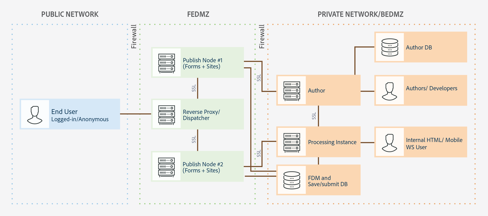

# AEM Forms을 위한 아키텍처 및 배포 토폴로지 {#architecture-and-deployment-topologies-for-aem-forms}

## 아키텍처 {#architecture}

AEM Forms은 AEM as a AEM 패키지에 배포된 애플리케이션입니다. 패키지를 AEM Forms 추가 기능 패키지로 합니다. AEM Forms 추가 기능 패키지에는 AEM OSGi 컨테이너에 배포되는 서비스(API 공급자)와 AEM Sling 프레임워크에서 관리하는 서블릿 또는 JSP(프런트엔드 및 REST API 기능 모두 제공)가 들어, 다음 다이어그램은 이 설정을 나타냅니다.

AEM Forms용 아키텍처에는 다음 구성 요소가 포함되어 있습니다.

* **핵심 AEM 서비스:** AEM이 배포된 응용 프로그램에 제공하는 기본 서비스입니다. 이러한 서비스에는 JCR 준수 컨텐츠 저장소, OSGI 서비스 컨테이너, 워크플로우 엔진, 신뢰 저장소, 키 저장소 등이 포함됩니다. 이러한 서비스는 AEM Forms 애플리케이션에서 사용할 수 있지만 AEM Forms 패키지에서 제공되지는 않습니다. 이러한 서비스는 전체 AEM 스택의 필수적인 부분이며 다양한 AEM Forms 구성 요소는 이러한 서비스를 사용합니다.
* **Forms 서비스:** PDF 문서 작성, 조합, 배포 및 보관, 문서 액세스를 제한하는 디지털 서명 추가, 바코드 양식 디코딩 등 양식 관련 기능을 제공합니다. 이러한 서비스는 AEM에 공동 배포되는 사용자 지정 코드에 의해 공개적으로 소비될 수 있습니다.
* **웹 레이어:** 공통 및 forms 서비스를 통해 구축된 JSP 또는 서블릿은 다음과 같은 기능을 제공합니다.

   * **작성 프런트 엔드**: 양식 작성 및 양식 관리 사용자 인터페이스로 양식을 작성하고 관리할 수 있습니다.
   * **양식 표현물 및 제출 프런트 엔드**: AEM Forms 최종 사용자가 사용할 최종 사용자 인터페이스(예: 정부 웹 사이트에 액세스하는 시민)입니다. 양식 표현물(웹 브라우저에 양식 표시) 및 제출 기능을 제공합니다.
   * **REST API**: JSP 및 서블릿은 forms mobile SDK와 같은 HTTP 기반 클라이언트가 원격 사용을 위해 양식 서비스의 하위 집합을 내보냅니다.

**OSGi의 AEM Forms:** OSGi 환경의 AEM Forms은 표준 AEM 작성자 또는 AEM Forms 패키지가 배포되는 AEM 게시입니다. OSGi에서 AEM Forms을 실행할 수 있습니다 [단일 서버 환경, 팜 및 클러스터형 설정](/help/sites-deploying/recommended-deploys.md). 클러스터 설정은 AEM 작성자 인스턴스에만 사용할 수 있습니다.

**JEE의 AEM Forms:** JEE의 AEM Forms은 JEE 스택에서 실행되는 AEM Forms 서버입니다. 여기에는 AEM Forms 추가 기능 패키지가 포함된 AEM 작성자 및 애플리케이션 서버에서 실행되는 단일 JEE 스택에 함께 배포되는 추가 AEM Forms JEE 기능이 있습니다. 단일 서버 및 클러스터된 설정에서 JEE에서 AEM Forms을 실행할 수 있습니다. AEM Forms on JEE는 문서 보안, 프로세스 관리 및 AEM Forms으로 업그레이드하는 LiveCycle 고객의 경우에만 필요합니다. 다음은 JEE에서 AEM Forms을 사용할 몇 가지 추가 시나리오입니다.

* **HTML 작업 공간 지원(HTML 작업 공간을 사용하는 고객):** AEM Forms on JEE를 사용하면 처리 인스턴스에서 단일 사인온을 사용할 수 있고, 처리 인스턴스에서 렌더링되는 특정 자산을 제공하고, HTML 작업 공간에서 렌더링되는 양식 제출을 처리합니다.
* **고급 추가 양식/대화형 통신 데이터 처리**: 고급 프로세스 관리 기능이 필요한 복잡한 사용 사례에서 양식/대화형 통신 데이터를 추가 처리(및 결과를 적절한 데이터 저장소에 저장)하는 데 JEE의 AEM Forms을 사용할 수 있습니다.

AEM 구성 요소에 대해 다음과 같은 지원 서비스를 제공하는 JEE의 AEM Forms도 포함되어 있습니다.

* **통합 사용자 관리:** JEE의 AEM Forms 사용자가 OSGi 사용자에서 AEM Forms로 인식될 수 있도록 하고 OSGi 및 JEE 사용자 둘 다에 대해 SSO를 활성화하는 데 도움이 됩니다. OSGi의 AEM Forms와 JEE의 AEM Forms 간에 단일 사인온이 필요한 시나리오(예: HTML 작업 공간)에 필요합니다.
* **자산 호스팅:** JEE의 AEM Forms은 OSGi의 AEM Forms에서 렌더링된 자산(예: HTML5 양식)을 제공할 수 있습니다.

AEM Forms 작성 사용자 인터페이스는 DOR(Document of Record), PDF forms 및 HTML5 Forms 만들기를 지원하지 않습니다. 이러한 자산은 독립형 Forms Designer 애플리케이션을 사용하여 디자인되며 AEM Forms Manager에 개별적으로 업로드됩니다. 또는 JEE의 AEM Forms용 양식을 애플리케이션(AEM Forms Workbench)으로 디자인하고 JEE 서버의 AEM Forms에 배포할 수 있습니다.

AEM Forms on OSGi 및 JEE의 AEM Forms에는 모두 워크플로우 기능이 있습니다. JEE에 AEM Forms의 완전한 프로세스 관리 기능을 설치하지 않고도 OSGi의 AEM Forms에서 다양한 작업에 대한 기본 워크플로우를 신속하게 작성하고 배포할 수 있습니다. 그 안에는 어떤 차이가 있다 [OSGi에서 AEM Forms의 양식 중심의 워크플로우 기능 및 JEE에서 AEM Forms의 프로세스 관리 기능](capabilities-osgi-jee-workflows.md). OSGi에서 AEM Forms의 양식 중심의 워크플로우를 개발 및 관리하여 익숙한 AEM Workflow 및 AEM 받은 편지함 기능을 사용합니다.

## 용어 {#terminologies}

다음 이미지는 일반적인 AEM Forms 배포에서 사용되는 다양한 AEM Form 서버 구성 및 해당 구성 요소를 표시합니다.

**작성자:** 작성자 인스턴스는 표준 작성자 실행 모드에서 실행되는 AEM Forms 서버입니다. JEE의 AEM Forms 또는 OSGi 환경의 AEM Forms일 수 있습니다. 내부 사용자, 양식 및 대화형 통신 디자이너, 개발자를 위한 것입니다. 다음과 같은 기능을 사용할 수 있습니다.

* **양식 및 대화형 커뮤니케이션 작성 및 관리:** 디자이너와 개발자는 적응형 양식 및 대화형 커뮤니케이션을 작성 및 편집하고, 외부에서 만들어지는 다른 양식(예: Adobe Forms Designer에서 만든 양식)을 업로드하고, Forms Manager 콘솔을 사용하여 이러한 자산을 관리할 수 있습니다.
* **양식 및 대화형 통신 게시:** 작성자 인스턴스에 호스팅된 자산을 게시 인스턴스에 게시하여 런타임 작업을 수행할 수 있습니다. 자산 게시에서는 AEM 복제 기능을 사용합니다. Adobe은 게시된 양식을 처리 인스턴스에 수동으로 푸시하도록 복제 에이전트가 모든 작성자 인스턴스에 구성되고, 다른 복제 에이전트가 를 사용하여 처리 인스턴스에 구성할 것을 권장합니다 *수신 시* 수신된 양식을 게시 인스턴스에 자동으로 복제하도록 트리거가 활성화됩니다.

**게시:** 게시 인스턴스는 표준 게시 실행 모드에서 실행되는 AEM Forms 서버입니다. 게시 인스턴스는 양식 기반 응용 프로그램의 최종 사용자를 위한 것입니다. 예를 들어 공개 웹 사이트에 액세스하고 양식을 제출하는 사용자가 여기에 해당합니다. 다음과 같은 기능을 사용할 수 있습니다.

* 최종 사용자를 위한 Forms 렌더링 및 제출.
* 최종 기록 시스템에서 추가 처리 및 스토리지를 위해 제출된 원시 양식 데이터를 처리 인스턴스로 전송합니다. AEM Forms에 제공된 기본 구현은 AEM의 역복제 기능을 사용하여 구현됩니다. 대체 구현은 양식 데이터를 먼저 저장하는 대신 처리 서버로 직접 푸시할 수도 있습니다(후자는 역방향 복제를 활성화하기 위한 전제 조건임). 게시 인스턴스에서 중요한 데이터의 저장에 대한 우려가 있는 고객은 이 옵션을 선택할 수 있습니다 [대체 구현](/help/forms/using/configuring-draft-submission-storage.md)처리 인스턴스는 일반적으로 더 안전한 영역에 있으므로 가 문제가 되지 않습니다.
* 대화형 커뮤니케이션 및 문자 렌더링 및 제출: 대화형 통신 및 문자가 게시 인스턴스에 렌더링되고 해당 데이터가 저장 및 사후 처리를 위해 처리 인스턴스에 제출됩니다. 데이터는 게시 인스턴스에 로컬로 저장하고 나중에 처리 인스턴스(기본 옵션)에 다시 복제하거나 게시 인스턴스에 저장하지 않고 처리 인스턴스에 직접 푸시할 수 있습니다. 후자의 구현은 보안에 민감한 고객에게 유용합니다.

**처리 중:** Forms-manager 그룹에 지정된 사용자가 없는 작성자 실행 모드에서 실행되는 AEM Forms 인스턴스. OSGi의 JEE에 AEM Forms 또는 AEM Forms을 처리 인스턴스로 배포할 수 있습니다. 양식 작성 및 관리 활동이 처리 인스턴스에서 수행되지 않고 작성자 인스턴스에서만 발생하도록 사용자가 할당되지 않습니다. 처리 인스턴스를 사용하면 다음 기능을 사용할 수 있습니다.

* **게시 인스턴스에서 도착하는 원시 양식 데이터 처리:** 이 작업은 주로 데이터가 도착할 때 트리거되는 AEM 워크플로우를 통한 처리 인스턴스에서 수행됩니다. 워크플로우는 즉시 제공되는 양식 데이터 모델 단계를 사용하여 데이터나 문서를 적절한 데이터 저장소에 보관할 수 있습니다.
* **양식 데이터의 보안 저장**: 처리에서는 사용자와 격리된 원시 양식 데이터를 위한 방화벽 뒤 저장소를 제공합니다. 작성자 인스턴스의 양식 디자이너나 게시 인스턴스의 최종 사용자는 이 리포지토리에 액세스할 수 없습니다.

   >[!NOTE]
   >
   >Adobe은 AEM 저장소를 사용하는 대신 타사 데이터 저장소를 사용하여 최종 처리된 데이터를 저장하는 것을 권장합니다.

* **게시 인스턴스에서 도착하는 서신 데이터의 저장 및 사후 처리:** AEM 워크플로우에서는 해당 편지 정의(옵션)의 사후 처리를 수행합니다. 이러한 워크플로우는 최종 처리된 데이터를 적절한 외부 데이터 저장소에 저장할 수 있습니다.

* **HTML 작업 공간 호스팅**: 처리 인스턴스는 HTML 작업 공간의 프론트런트를 호스팅합니다. HTML 작업 공간에서는 검토 및 승인 프로세스를 위한 관련 작업/그룹 지정에 대한 UI를 제공합니다.

다음 이유로 인해 처리 인스턴스가 작성자 실행 모드에서 실행되도록 구성됩니다.

* 게시 인스턴스에서 원시 양식 데이터를 역복제할 수 있습니다. 기본 데이터 저장소 처리기에는 역복제 기능이 필요합니다.
* 게시 인스턴스에서 도착하는 원시 양식 데이터를 처리하는 주요 수단인 AEM 워크플로우는 작성자 스타일 시스템에서 실행하는 것이 좋습니다.

## JEE에서 AEM Forms용 샘플 물리적 토폴로지 {#sample-physical-topologies-for-aem-forms-on-jee}

아래 권장되는 JEE 토폴로지의 AEM Forms은 주로 LiveCycle 또는 JEE의 이전 버전의 AEM Forms에서 업그레이드하는 고객을 위한 것입니다. Adobe은 새로 설치하는 경우 OSGi에서 AEM Forms을 사용하는 것이 좋습니다. 문서 보안 및 프로세스 관리 기능을 사용하는 경우에만 JEE에 AEM Forms을 새로 설치하는 것이 좋습니다.

### 문서 서비스 또는 문서 보안 기능을 사용하기 위한 토폴로지 {#topology-for-using-document-services-or-document-security-capabilities}

AEM Forms 고객은 문서 서비스나 문서 보안 기능만 사용하려는 경우 아래 표시된 토폴로지와 유사한 토폴로지를 사용할 수 있습니다. 이 토폴로지는 AEM Forms의 단일 인스턴스를 사용하는 것이 좋습니다. 필요한 경우 AEM Forms 서버의 클러스터 또는 팜을 만들 수도 있습니다. 이 토폴로지는 대부분의 사용자가 프로그래밍 방식으로 AEM Forms 서버의 기능에 액세스하고 사용자 인터페이스를 통한 개입이 최소한으로 예상되는 경우 권장됩니다. 토폴로지는 문서 서비스의 일괄 처리 작업에 유용합니다. 예를 들어 출력 서비스를 사용하여 매일 수백 개의 편집 불가능한 PDF 문서를 만들 수 있습니다.

AEM Forms을 사용하면 단일 서버에서 모든 기능을 설정 및 실행할 수 있지만 용량 계획, 로드 밸런싱 및 프로덕션 환경의 특정 기능에 대한 전용 서버를 설정해야 합니다. 예를 들어, PDF 생성기 서비스를 사용하여 하루에 수천 개의 페이지를 변환하고 디지털 서명을 추가하여 문서에 대한 액세스를 제한하고, PDF 생성기 서비스 및 디지털 서명 기능을 위해 별도의 AEM Forms 서버를 설정합니다. 최적의 성능을 제공하고 서로 독립적으로 서버를 확장할 수 있습니다.

### AEM Forms 프로세스 관리 사용을 위한 토폴로지 {#topology-for-using-aem-forms-process-management}

AEM Forms 고객은 AEM Forms 프로세스 관리 기능을 사용할 계획입니다. 예를 들어, HTML Workspace는 아래 표시된 토폴로지와 유사한 토폴로지를 가질 수 있습니다. JEE 서버의 AEM Forms은 단일 서버 또는 클러스터 구성에 있을 수 있습니다.

LiveCycle ES4에서 업그레이드하는 경우, 이 토폴로지는 JEE의 AEM Forms에 내장된 AEM 작성자를 추가하는 것을 제외하고 LiveCycle에 이미 있는 것과 밀접하게 미러링합니다. 또한 업그레이드를 수행하는 고객의 클러스터링 요구 사항은 변경되지 않습니다. 클러스터된 환경에서 AEM Forms을 사용하는 경우 AEM 6.5 Forms에서 계속 이를 사용할 수 있습니다. HTML 작업 공간을 사용하기 위해 JEE의 AEM Forms을 새로 설치하는 경우, JEE 환경에 내장된 AEM 작성자 인스턴스를 실행하는 것이 좋습니다.

양식 데이터 저장소는 양식 및 대화형 커뮤니케이션의 최종 처리 데이터를 저장하는 데 사용되는 타사 데이터 저장소입니다. 토폴로지에서 선택적 요소입니다. 필요한 경우 처리 인스턴스를 설정하고 해당 리포지토리를 최종 기록 시스템으로 사용하도록 선택할 수도 있습니다.

게시 처리, 적응형 양식, HTML5 양식 및 대화형 커뮤니케이션 기능을 사용하지 않고 JEE 서버에서 프로세스 관리 기능(HTML 작업 공간)을 위해 AEM Forms을 사용하려는 고객이 토폴로지를 사용하는 것이 좋습니다.

### 적응형 양식, HTML5 양식, 대화형 통신 기능을 사용하기 위한 토폴로지 {#topology-for-using-adaptive-forms-html-forms-interactive-communication-capabilities}

AEM Forms 고객이 AEM Forms 데이터 캡처 기능(예: 적응형 양식, HTML5 Forms, PDF forms)을 사용하려는 경우 아래에 표시된 토폴로지와 유사한 토폴로지를 사용할 수 있습니다. 이 토폴로지는 AEM Forms의 대화형 통신 기능을 사용하는 데에도 권장됩니다.

위의 권장 토폴로지에 대해 다음과 같은 변경/사용자 지정을 수행할 수 있습니다.

* HTML 작업 공간 및 AEM Forms 앱을 사용하려면 AEM 작성자 또는 처리 인스턴스가 필요합니다. 추가적인 외부 AEM 작성자 서버를 설정하는 대신 JEE 서버의 AEM Forms에 내장된 AEM 작성자 인스턴스를 사용할 수 있습니다.
* AEM 작성자 또는 처리 인스턴스는 OSGi, 적응형 양식, 양식 포털 및 대화형 커뮤니케이션의 Forms 중심 워크플로우에만 필요합니다.
* 대화형 통신 에이전트 UI는 일반적으로 조직 내에서 실행됩니다. 따라서 개인 네트워크 내에 에이전트 UI용 게시 서버를 유지할 수 있습니다.
* JEE 서버의 AEM Forms에 내장된 OSGi 인스턴스의 AEM Forms는 OSGi 및 감시 폴더에서 Forms 중심 워크플로우를 실행할 수도 있습니다.

## OSGi에서 AEM Forms을 사용하기 위한 샘플 물리적 토폴로지 {#sample-physical-topologies-for-using-aem-forms-on-osgi}

### 데이터 캡처, 대화형 커뮤니케이션, OSGi의 양식 중심의 워크플로우를 위한 토폴로지 {#topology-for-data-capture-interactive-communication-form-centric-workflow-on-osgi-capabilities}

AEM Forms 고객이 AEM Forms 데이터 캡처 기능(예: 적응형 양식, HTML5 Forms, PDF forms)을 사용하려는 경우 아래에 표시된 토폴로지와 유사한 토폴로지를 사용할 수 있습니다. 또한 이 토폴로지는 OSGi 기능에서 대화형 통신 및 Forms 중심의 워크플로우(예: 비즈니스 프로세스 워크플로우에 AEM 받은 편지함 및 AEM Forms 앱 사용)를 사용하는 데에도 권장됩니다.

### 오프라인 일괄 처리를 위해 감시 폴더 기능을 사용하는 토폴로지 {#topology-for-using-watched-folder-capabilities-for-offline-batch-processing}

일괄 처리를 위해 감시 폴더를 사용하려는 AEM Forms 고객은 아래 표시된 토폴로지와 유사한 토폴로지를 사용할 수 있습니다. 토폴로지에는 클러스터된 환경이 표시되지만 로드에 따라 단일 인스턴스 또는 AEM Forms 서버 팜을 사용하기로 결정합니다. 타사 데이터 소스는 고유한 기록 시스템입니다. 감시 폴더의 입력 소스 역할을 합니다. 또한 토폴로지는 인쇄 파일 형태로 출력을 표시합니다. 출력 컨텐츠를 파일 시스템에 저장하고, 이메일을 통해 전송하며, 다른 사용자 지정 방법을 사용하여 출력을 사용할 수도 있습니다.

### 오프라인 API 기반 처리를 위한 문서 서비스 기능을 사용하는 토폴로지 {#topology-for-using-document-services-capabilities-for-offline-api-based-processing}

AEM Forms 고객은 문서 서비스 기능만 사용하려는 경우 아래 표시된 토폴로지와 유사한 토폴로지를 사용할 수 있습니다. 이 토폴로지는 OSGi 서버에서 AEM Forms 클러스터를 사용하는 것이 좋습니다. 이 토폴로지는 대부분의 사용자가 프로그래밍 방식으로(API 사용) AEM Forms 서버의 액세스 기능을 사용하고 사용자 인터페이스를 통한 개입이 최소한으로 필요한 경우 권장됩니다. 토폴로지는 여러 소프트웨어 클라이언트 시나리오에 매우 유용합니다. 예를 들어 PDF 생성기 서비스를 사용하여 요청 시 PDF 문서를 생성하는 여러 클라이언트가 있습니다.

AEM Forms을 통해 단일 서버에서 모든 기능을 설정 및 실행할 수 있지만 용량 계획, 로드 밸런싱 및 프로덕션 환경의 특정 기능에 대한 전용 서버를 설정해야 합니다. 예를 들어 PDF 생성기 서비스를 사용하여 하루에 수천 개의 페이지를 변환하고 여러 적응형 양식을 사용하여 데이터를 캡처하는 환경의 경우 PDF 생성기 서비스 및 적응형 양식 기능에 대해 별도의 AEM Forms 서버를 설정합니다. 최적의 성능을 제공하고 서로 독립적으로 서버를 확장할 수 있습니다.

