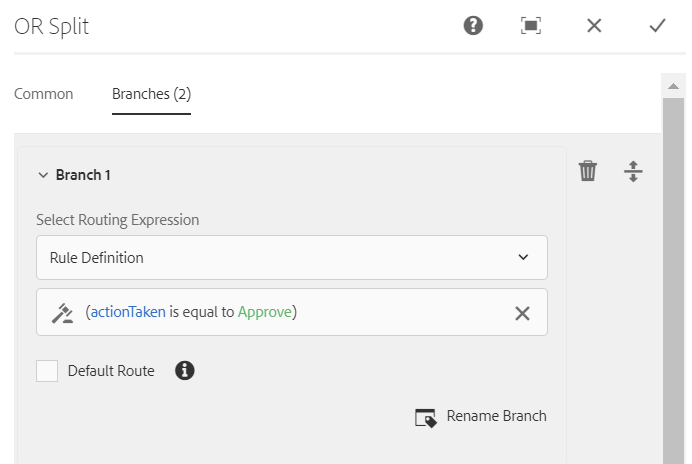

# OSGi의 Forms 중심 워크플로우{#forms-centric-workflow-on-osgi}


기업은 수백, 수천 개의 양식, 다양한 백엔드 시스템, 온라인 또는 오프라인 데이터 소스에서 데이터를 수집합니다. 또한 동적 사용자 집합을 사용하여 반복적인 검토 및 승인 프로세스를 포함하는 데이터에 대한 결정을 내릴 수 있습니다.

내부 및 외부 대상에 대한 검토 및 승인 워크플로우와 함께 대규모 조직 및 기업에는 반복 작업이 있습니다. 예를 들어 PDF 문서를 다른 형식으로 변환하는 작업이 있습니다. 수동으로 완료하면 이러한 작업에 많은 시간과 리소스가 필요합니다. 또한 기업은 사전 정의된 형식으로 나중에 사용할 수 있도록 문서를 디지털 서명하고 양식 데이터를 아카이브하는 법적 요구 사항을 가지고 있습니다.

## OSGi에서 Forms 중심의 워크플로우 소개 {#introduction-to-forms-centric-workflow-on-osgi}

AEM 워크플로우를 사용하여 적응형 양식 기반 워크플로우를 신속하게 구축할 수 있습니다. 이러한 워크플로우는 검토 및 승인, 비즈니스 프로세스 흐름, 문서 서비스 시작, Adobe Sign 서명 워크플로우와 통합 및 유사한 작업에 사용할 수 있습니다. 예를 들어, 신용 카드 신청 처리, 직원이 승인 작업 과정을 중단하고 양식을 PDF 문서로 저장합니다. 또한 이러한 워크플로우는 조직 내부 또는 네트워크 방화벽에서 사용할 수 있습니다.

OSGi의 Forms 중심 워크플로우를 사용하면 JEE 스택에 완전한 프로세스 관리 기능을 설치하지 않고도 OSGi 스택에서 다양한 작업에 대한 워크플로우를 신속하게 작성하고 배포할 수 있습니다. 워크플로우의 개발 및 관리에서는 익숙한 AEM 워크플로우 및 AEM 받은 편지함 기능을 사용합니다. 워크플로우는 여러 소프트웨어 시스템, 네트워크, 부서 및 조직에 걸쳐 이루어지는 실제 업무 프로세스를 자동화하는 기초입니다.

설정되면, 사용자가 양식을 제출하거나 또는 [서신 관리](/help/forms/using/cm-overview.md) 편지. 향상된 AEM 워크플로우 기능을 통해 AEM Forms은 서로 다른 두 가지 기능을 제공하면서도 유사한 기능을 제공합니다. 배포 전략의 일부로 사용자에게 적합한 배포 방법을 결정해야 합니다. 다음을 참조하십시오 [비교](capabilities-osgi-jee-workflows.md) OSGi 및 JEE의 프로세스 관리에 대한 Forms 중심의 AEM 워크플로우입니다. 또한 배포 토폴로지에 대해서는 다음을 참조하십시오. [AEM Forms을 위한 아키텍처 및 배포 토폴로지](/help/forms/using/aem-forms-architecture-deployment.md).

OSGi에서 Forms 중심의 워크플로우 확장 [AEM 받은 편지함](/help/sites-authoring/inbox.md) 및 은 AEM Forms 중심의 워크플로우에 대한 지원을 추가하기 위해 AEM 워크플로우 편집기에 대한 추가 구성 요소(단계)를 제공합니다. 확장된 AEM 받은 편지함에는 다음과 유사한 기능이 있습니다 [AEM Forms 작업 공간](introduction-html-workspace.md). 인간 중심 워크플로우 관리(승인, 검토 등)와 함께 AEM 워크플로우를 사용하여 자동화할 수 있습니다 [문서 서비스](/help/sites-developing/workflows-step-ref.md)-관련 작업(예: PDF 생성) 및 전자 서명(Adobe Sign) 문서.

모든 AEM Forms 워크플로우 단계는 변수 사용을 지원합니다. 변수를 사용하면 런타임 시 여러 단계에서 메타데이터를 일시 중단 및 전달하는 워크플로우 단계를 사용할 수 있습니다. 다양한 유형의 데이터를 저장할 다른 유형의 변수를 만들 수 있습니다. 같은 형식의 관련 데이터의 여러 인스턴스를 저장하는 변수 컬렉션(배열)을 만들 수도 있습니다. 일반적으로, 보유하는 값을 기반으로 결정하거나 나중에 프로세스에서 필요한 정보를 저장하기 위해 필요한 경우 변수나 변수 컬렉션을 사용합니다. 이러한 Forms 중심의 워크플로우 구성 요소(단계)에서 변수를 사용하는 방법에 대한 자세한 내용은 다음을 참조하십시오 [OSGi의 Forms 중심 워크플로우 - 단계 참조](../../forms/using/aem-forms-workflow-step-reference.md). 변수 만들기 및 관리에 대한 자세한 내용은 [AEM 워크플로우의 변수](../../forms/using/variable-in-aem-workflows.md).

다음 다이어그램은 OSGi에서 Forms 중심의 워크플로우를 작성, 실행 및 모니터링하는 종단 간 절차를 설명합니다.


## 시작하기 전 {#before-you-start}

* 워크플로우는 실제 비즈니스 프로세스를 나타냅니다. 실제 비즈니스 프로세스와 비즈니스 프로세스 참가자 목록을 준비하십시오. 또한 워크플로우를 만들기 전에 자료(적응형 양식, PDF 문서 등)를 준비할 수 있습니다.
* 워크플로우에는 여러 단계가 있을 수 있습니다. 이러한 단계는 AEM 받은 편지함에 표시되며 워크플로우의 진행 상황을 보고하는 데 도움이 됩니다. 비즈니스 프로세스를 논리적 단계로 나눕니다.
* AEM Workflows의 작업 할당 단계를 구성하여 사용자 또는 담당자에게 이메일 알림을 전송할 수 있습니다. 그래서 [이메일 알림 활성화](#configure-email-service).
* 워크플로우에서는 디지털 서명에 Adobe 기호를 사용할 수도 있습니다. 워크플로우에서 Adobe Sign을 사용하려는 경우, [AEM Forms용 Adobe Sign 구성](../../forms/using/adobe-sign-integration-adaptive-forms.md) 워크플로우에서 사용하기 전에

## 워크플로우 모델 만들기 {#create-a-workflow-model}

워크플로우 모델은 비즈니스 프로세스의 로직과 흐름으로 구성됩니다. 일련의 단계로 구성되어 있습니다. 이러한 단계는 AEM 구성 요소입니다. 필요에 따라 매개 변수 및 스크립트로 워크플로우 단계를 확장하여 더 많은 기능과 제어를 제공할 수 있습니다. AEM Forms에서는 즉시 사용 가능한 AEM 단계과 몇 가지 단계를 제공합니다. AEM 및 AEM Forms 단계의 세부 목록에 대해서는 다음을 참조하십시오 [AEM 워크플로우 단계 참조](/help/sites-developing/workflows-step-ref.md) 및 [OSGi의 Forms 중심 워크플로우 - 단계 참조](../../forms/using/aem-forms-workflow.md).

AEM은 제공된 워크플로우 단계를 사용하여 워크플로우 모델을 만드는 직관적인 사용자 인터페이스를 제공합니다. 워크플로우 모델을 만드는 단계별 지침은 [워크플로우 모델 만들기](/help/sites-developing/workflows-models.md). 다음 예제에서는 승인 및 검토 작업 과정에 대한 워크플로우 모델을 만드는 단계별 지침을 제공합니다.

>[!NOTE]
>
>워크플로우 모델을 만들거나 편집하려면 워크플로우 편집기 그룹의 구성원이어야 합니다.

### 승인 및 검토 작업 과정에 대한 모델 만들기 {#create-a-model-for-an-approval-and-review-workflow}

승인 및 검토 작업 과정은 사람의 개입이 필요한 작업을 위한 것입니다. 다음 예제에서는 프론트 오피스 뱅킹 에이전트가 채울 대출 신청 워크플로우 모델을 생성합니다. 신청서를 작성하면 승인을 위해 전송됩니다. 나중에 승인된 신청은 Adobe Sign을 사용하여 전자 서명을 신청한 사람에게 전송됩니다.

이 예는 아래에 첨부된 패키지로 사용할 수 있습니다. 패키지 관리자를 사용하여 예제를 가져오고 설치합니다. 다음 단계를 수행하여 애플리케이션에 대한 워크플로우 모델을 수동으로 만들 수도 있습니다.

이 예제에서는 프런트오피스 뱅킹 에이전트가 채울 모기지 응용 프로그램을 워크플로 모델을 만듭니다. 신청서를 작성하면 승인을 위해 전송됩니다. 나중에 승인된 애플리케이션은 Adobe Sign을 사용하여 고객에게 전자 서명을 위해 전송됩니다. 패키지 관리자를 사용하여 예제를 가져오고 설치할 수 있습니다.

[파일 가져오기](assets/example-mortgage-loan-application.zip)

1. 워크플로우 모델 콘솔을 엽니다. 기본 URL은 `https://[server]:[port]/libs/cq/workflow/admin/console/content/models.html/etc/workflow/models`
1. 선택 **만들기**, 그런 다음 **모델 만들기**. 워크플로우 모델 추가 대화 상자가 나타납니다.
1. 을(를) 입력합니다. **제목** 및 **이름** (선택 사항). 예를 들어, 담보 대출 신청입니다. **Done**&#x200B;을 누릅니다.
1. 새로 만든 워크플로우 모델을 선택하고 탭합니다 **편집**. 이제 워크플로우 단계를 추가하여 비즈니스 논리를 작성할 수 있습니다. 워크플로우 모델을 처음 만들면 다음과 같은 내용이 포함됩니다.

   * 단계: 흐름 시작 및 흐름 종료. 이러한 단계는 워크플로우의 시작과 끝을 나타냅니다. 이러한 단계는 필수 사항이며 편집하거나 제거할 수 없습니다.
   * 단계 1이라는 참가자 단계의 예입니다. 이 단계는 관리자 사용자에게 작업 항목을 할당하도록 구성되어 있습니다. 이 단계를 제거합니다.

1. 이메일 알림을 활성화합니다. OSGi에서 Forms 중심의 워크플로우를 구성하여 사용자 또는 담당자에게 이메일 알림을 보낼 수 있습니다. 이메일 알림을 활성화하려면 다음 구성을 수행하십시오.

   1. 의 AEM 구성 관리자로 이동합니다. `https://[server]:[port]/system/console/configMgr`.
   1. 를 엽니다. **[!UICONTROL 일 CQ 메일 서비스]** 구성. 에 사용할 값을 지정합니다. **[!UICONTROL SMTP 서버 호스트 이름]**, **[!UICONTROL SMTP 서버 포트,]** 및 **[!UICONTROL &quot;보낸 사람&quot; 주소]** 필드. **[!UICONTROL 저장]**&#x200B;을 클릭합니다.
   1. 를 엽니다. **[!UICONTROL Day CQ Link Externalizer]** 구성. 에서 **[!UICONTROL 도메인]** 필드에서 로컬, 작성자 및 게시 인스턴스에 대한 실제 호스트 이름/IP 주소 및 포트 번호를 지정합니다. **[!UICONTROL 저장]**&#x200B;을 클릭합니다.

1. 워크플로우 단계를 만듭니다. 워크플로우에는 여러 단계가 있을 수 있습니다. 이러한 단계는 AEM 받은 편지함에 표시되며 워크플로우의 진행 상태를 보고합니다.

   스테이지를 정의하려면  아이콘 을 클릭하여 워크플로우 모델 속성을 열고 **단계** 탭하고 워크플로우 모델의 단계를 추가하고 탭합니다 **저장 및 닫기**. 예를 들어 담보 대출 애플리케이션의 경우 단계를 생성합니다. 대출 요청, 대출 요청 상태, 서명 문서 및 서명된 대출 문서

1. 드래그 앤 드롭 **작업 할당** 워크플로우 모델에 대한 단계 브라우저. 모델의 첫 번째 단계로 만듭니다.

   작업 할당 구성 요소는 워크플로우로 만든 작업을 사용자 또는 그룹에 할당합니다. 작업 할당과 함께 구성 요소를 사용하여 작업에 적응형 양식 또는 비대화형 PDF을 지정할 수 있습니다. 적응형 양식은 사용자의 입력을 수용하기 위해 필요하며 비대화형 PDF 또는 읽기 전용 적응형 양식은 검토 전용 워크플로우에 사용됩니다.

   이 단계를 사용하여 작업의 동작을 제어할 수도 있습니다. 예를 들어, 자동 레코드 문서를 만들고, 특정 사용자 또는 그룹에 작업을 할당하고, 제출된 데이터의 경로, 미리 채울 데이터 경로 및 기본 작업을 지정할 수 있습니다. 작업 할당 단계의 옵션에 대한 자세한 내용은 [OSGi의 Forms 중심 워크플로우 - 단계 참조](../../forms/using/aem-forms-workflow.md) 문서.

   

   모기지 애플리케이션 예제의 경우 작업이 완료되면 읽기 전용 적응형 양식을 사용하도록 지정 작업 단계를 구성하고 PDF 문서를 표시합니다. 또한, 대출 요청을 승인할 수 있는 사용자 그룹으로 을 선택합니다. 설정 **작업** 탭에서 비활성화하십시오 **제출** 선택 사항입니다. 만들기 **actionTake** 변수 of String 데이터 유형 및 변수를 **경로 변수**. 예: actionTake. 또한 승인 및 거부 경로를 추가합니다. 경로는 AEM 받은 편지함에 별도의 작업(단추)으로 표시됩니다. 워크플로우는 사용자가 누르는 작업(단추)을 기반으로 분기를 선택합니다.

   예제 패키지를 가져올 수 있습니다. 이 패키지는 섹션의 시작 부분에서 다운로드할 수 있습니다. 여기에는 담보 대출 응용 프로그램과 같이 구성된 작업 단계의 모든 필드의 전체 값 세트가 포함됩니다.

1. OR 분할 구성 요소를 단계 브라우저에서 워크플로우 모델로 끌어다 놓습니다. OR 분할은 워크플로우에서 분할을 만들며, 그 뒤에는 하나의 분기만 활성화됩니다. 이 단계를 통해 워크플로우에 조건부 처리 경로를 도입할 수 있습니다. 필요에 따라 각 분기에 워크플로우 단계를 추가합니다.

   규칙 정의, ECMA 스크립트 또는 외부 스크립트를 사용하여 분기에 대한 라우팅 표현식을 정의할 수 있습니다.

   표현식 편집기를 사용하여 분기 1 및 분기 2에 대한 라우팅 표현식을 생성합니다. 이러한 라우팅 표현식은 AEM 받은 편지함의 사용자 작업을 기반으로 분기를 선택하는 데 도움이 됩니다.

   **분기 1에 대한 라우팅 표현식**

   사용자가 탭할 때 **승인** AEM 받은 편지함에서 분기 1이 활성화됩니다.

   

   **분기 2에 대한 라우팅 표현식**

   사용자가 탭할 때 **거부** AEM 받은 편지함에서 분기 2가 활성화됩니다.

   

   변수를 사용하여 라우팅 표현식 만들기에 대한 자세한 내용은 [AEM Forms 워크플로우의 변수](../../forms/using/variable-in-aem-workflows.md).

1. 다른 워크플로우 단계를 추가하여 비즈니스 논리를 작성합니다.

   담보 대출 예제의 경우, 아래 이미지에 표시된 대로 레코드의 생성 문서, 두 개의 지정 작업 단계 및 서명 문서 단계를 모델의 분기 1에 추가합니다. 작업 지정 단계 하나는 표시 및 전송입니다 **지원자에게 대출 서류에 서명하다** 그리고 다른 할당 작업 구성 요소 **서명된 문서를 표시합니다.**. 또한 2분기에 작업 구성 요소 할당을 추가합니다. 사용자가 AEM 받은 편지함에서 거부 를 탭하면 활성화됩니다.

   할당 작업 단계, 레코드 단계 문서 및 담보 대상 응용 프로그램과 같이 구성된 서명 문서 단계의 모든 필드의 전체 값 세트에 대해 이 섹션의 시작 부분에서 다운로드할 수 있는 예제 패키지를 가져옵니다.

   워크플로우 모델이 준비되었습니다. 다양한 방법을 통해 워크플로우를 시작할 수 있습니다. 자세한 내용은 [OSGi에서 Forms 중심의 워크플로우 시작](#launch).

   

## Forms 중심의 워크플로우 애플리케이션 만들기 {#create-a-forms-centric-workflow-application}

애플리케이션이 워크플로우와 연관된 적응형 양식입니다. 받은 편지함을 통해 애플리케이션을 제출하면 연관된 워크플로우가 시작됩니다. AEM 받은 편지함 및 AEM Forms 앱에서 Forms 워크플로우를 응용 프로그램으로 사용할 수 있도록 하려면 다음을 수행하여 워크플로우 애플리케이션을 만듭니다.

>[!NOTE]
>
>워크플로 응용 프로그램을 만들고 관리하려면 fd-administrator 그룹의 구성원이어야 합니다.

1. AEM 작성자 인스턴스에서  > **[!UICONTROL Forms]** > **[!UICONTROL 워크플로우 애플리케이션 관리]** 및 탭 **[!UICONTROL 만들기]**.
1. 워크플로우 응용 프로그램 생성 창에서 다음 필드에 대한 입력 및 탭을 제공합니다 **만들기**. 새 응용 프로그램이 만들어지고 워크플로 응용 프로그램 화면에 나열됩니다.

<table>
 <tbody>
  <tr>
   <td>필드</td>
   <td>설명</td>
  </tr>
  <tr>
   <td>제목</td>
   <td>제목은 AEM 받은 편지함에 표시되며 사용자가 애플리케이션을 선택하는 데 도움이 됩니다. 설명적으로 보관하세요. 예를 들어, 저축 계정 개설 애플리케이션이 있습니다.<br /> </td>
  </tr>
  <tr>
   <td>이름 </td>
   <td>응용 프로그램의 이름을 지정합니다. 알파벳, 숫자, 하이픈 및 밑줄을 제외한 모든 문자는 하이픈으로 바뀝니다. </td>
  </tr>
  <tr>
   <td>설명</td>
   <td>설명은 AEM 받은 편지함에 표시됩니다. 설명 필드에 응용 프로그램에 대한 자세한 정보를 제공합니다. 예를 들어 응용 프로그램의 목적입니다.<br /> </td>
  </tr>
  <tr>
   <td>적응형 양식</td>
   <td><p>적응형 양식의 경로를 지정합니다. 사용자가 애플리케이션을 시작하면 지정된 적응형 양식이 표시됩니다.</p> <p><strong>참고</strong>: 워크플로우 애플리케이션은 한 페이지 이상이거나 Apple iPad에서 스크롤해야 하는 양식 및 PDF 문서를 지원하지 않습니다. 애플리케이션이 Apple iPad에서 열리고 적응형 양식 또는 PDF 문서가 페이지보다 긴 경우 두 번째 페이지의 양식 필드와 컨텐츠가 유실됩니다.</p> </td>
  </tr>
  <tr>
   <td>그룹 액세스</td>
   <td><p>그룹을 선택합니다. 선택한 그룹의 구성원에게만 AEM 받은 편지함에 응용 프로그램이 표시됩니다. 액세스 그룹 옵션을 사용하면 워크플로 사용자 그룹의 모든 그룹을 선택할 수 있습니다. </p> <br /> </td>
  </tr>
  <tr>
   <td>미리 채우기 서비스</td>
   <td>선택 <a href="../../forms/using/prepopulate-adaptive-form-fields.md#aem-forms-custom-prefill-service" target="_blank">미리 채우기 서비스</a> 적응형 양식에 사용할 수 있습니다.<br /> </td>
  </tr>
  <tr>
   <td>워크플로우 모델</td>
   <td>선택 <a href="../../forms/using/aem-forms-workflow.md#create-a-workflow-model">워크플로우 모델</a> 참조하십시오. 워크플로우 모델은 비즈니스 프로세스의 로직과 흐름으로 구성됩니다. </td>
  </tr>
  <tr>
   <td>데이터 파일 경로</td>
   <td>crx-repository에서 데이터 파일의 경로를 지정합니다. 이 경로는 적응형 양식 페이로드를 기준으로 하며 데이터 파일의 이름을 포함합니다. 해당되는 경우 항상 확장자를 포함한 파일의 전체 이름을 포함하십시오. 예: [payload]/data.xml </td>
  </tr>
  <tr>
   <td>첨부 파일 경로</td>
   <td>crx-repository에서 첨부 파일 폴더의 경로를 지정합니다. 첨부 파일 경로는 페이로드 위치에 상대적입니다. 예: [payload]/data.xml </td>
  </tr>
  <tr>
   <td>기록 문서 경로</td>
   <td>crx-repository에 있는 레코드 문서 파일의 경로를 지정합니다. 경로는 적응형 양식 페이로드 위치에 상대적입니다. 해당되는 경우 항상 확장자를 포함한 파일의 전체 이름을 포함하십시오. 예: [payload]/DOR/creditcard.pdf</td>
  </tr>
 </tbody>
</table>

## OSGi에서 Forms 중심의 워크플로우 시작 {#launch}

다음을 통해 Forms 중심의 워크플로우를 시작하거나 트리거할 수 있습니다.

* [AEM 받은 편지함에서 애플리케이션 제출](#inbox)
* [AEM Forms 앱에서 애플리케이션 제출](#afa)

* [적응형 양식 제출](#af)
* [감시 폴더 사용](#watched)

* [대화형 통신 또는 편지 제출](#letter)

### AEM 받은 편지함에서 애플리케이션 제출 {#inbox}

만든 워크플로 응용 프로그램은 받은 편지함에서 응용 프로그램으로 사용할 수 있습니다. 워크플로우 사용자 그룹의 구성원인 사용자는 관련 워크플로우를 트리거하는 애플리케이션을 작성하고 제출할 수 있습니다. AEM 받은 편지함을 사용하여 응용 프로그램을 제출하고 작업을 관리하는 방법에 대한 자세한 내용은 [AEM 받은 편지함에서 Forms 애플리케이션 및 작업 관리](../../forms/using/manage-applications-inbox.md).

### AEM Forms 앱에서 애플리케이션 제출 {#afa}

AEM Forms 앱은 AEM Forms 서버와 동기화되며 계정에서 양식 데이터, 작업, 워크플로우 애플리케이션 및 저장된 정보(초안/템플릿)를 변경할 수 있습니다. 자세한 내용은 [AEM Forms 앱](/help/forms/using/aem-forms-app.md) 및 관련 문서.

### 적응형 양식 제출 {#af}

적응형 양식 제출 시 워크플로우를 시작하도록 적응형 양식의 제출 작업을 구성할 수 있습니다. 적응형 양식은 다음을 제공합니다. **AEM 워크플로우 호출** 작업을 제출하여 적응형 양식 제출 시 워크플로우를 시작합니다. 제출 작업에 대한 자세한 내용은 [제출 작업 구성](../../forms/using/configuring-submit-actions.md). AEM Forms 앱을 통해 적응형 양식을 제출하려면 적응형 양식 속성에서 AEM Forms 앱과 동기화 를 활성화합니다.

AEM Forms 앱에서 워크플로우를 동기화, 제출 및 트리거하도록 적응형 양식을 구성할 수 있습니다. 자세한 내용은 [양식 작업](/help/forms/using/working-with-form.md).

### 감시 폴더 사용 {#watched}

관리자(fd-administrators 그룹의 구성원)는 사용자가 폴더에 파일(예: PDF 파일)을 배치할 때 미리 구성된 워크플로우를 실행하도록 네트워크 폴더를 구성할 수 있습니다. 워크플로우가 완료되면 결과 파일을 지정된 출력 폴더에 저장할 수 있습니다. 이러한 폴더를 [감시 폴더](../../forms/using/watched-folder-in-aem-forms.md). 워크플로우를 시작할 감시 폴더를 구성하려면 다음 절차를 수행하십시오.

1. AEM 작성자 인스턴스에서  > **[!UICONTROL Forms]** > **[!UICONTROL 감시 폴더 구성]**. 이미 구성된 감시 폴더 목록이 표시됩니다.
1. 탭 **[!UICONTROL 새로 만들기]**. 필드 목록이 표시됩니다. 워크플로우에 대한 감시 폴더를 구성할 다음 필드에 값을 지정합니다.

<table>
 <tbody>
  <tr>
   <td>필드</td>
   <td>설명</td>
  </tr>
  <tr>
   <td><span class="uicontrol">이름</code></td>
   <td>감시 폴더의 이름을 지정합니다. 이 필드는 영숫자만 지원합니다.</td>
  </tr>
  <tr>
   <td><span class="uicontrol">경로</code></td>
   <td>감시 폴더의 실제 위치를 지정합니다. 클러스터형 환경에서는 AEM 클러스터 노드에서 액세스할 수 있는 공유 네트워크 폴더를 사용합니다.</td>
  </tr>
  <tr>
   <td><span class="uicontrol">사용 중인 파일 처리</code></td>
   <td>을(를) 선택합니다 <span class="uicontrol">워크플로우 </code>선택 사항입니다. </code></td>
  </tr>
  <tr>
   <td><span class="uicontrol">워크플로우 모델</code></td>
   <td>워크플로우 모델을 선택합니다.<br /> </td>
  </tr>
  <tr>
   <td><span class="uicontrol">출력 파일 패턴</code></td>
   <td>출력 파일 및 디렉토리의 디렉토리 구조를 지정합니다. 을(를) 지정할 수도 있습니다 <a href="/help/forms/using/admin-help/configuring-watched-folder-endpoints.md" target="_blank">출력 파일 및 디렉토리의 패턴</a>.</td>
  </tr>
 </tbody>
</table>

1. 탭 **고급**. 다음 필드 및 탭 값을 지정합니다 **만들기**. 감시 폴더는 워크플로우를 시작하도록 구성되어 있습니다. 이제 감시 폴더의 입력 디렉토리에 파일이 배치될 때마다 지정된 워크플로우가 트리거됩니다.

   | 필드 | 설명 |
   |---|---|
   | 페이로드 매퍼 필터  | 감시 폴더를 만들면 crx-repository에 폴더 구조가 만들어집니다. 폴더 구조는 워크플로우에 대한 페이로드 역할을 할 수 있습니다. AEM Workflow를 매핑하여 감시 폴더 구조의 입력을 허용하는 스크립트를 작성할 수 있습니다. 즉시 구현할 수 있으며 페이로드 매퍼 필터에 나열됩니다. 사용자 지정 구현이 없는 경우 기본 구현을 선택합니다. |

   고급 탭에는 더 많은 필드가 포함되어 있습니다. 이러한 필드 대부분은 기본값을 포함합니다. 모든 필드에 대해 알아보려면 [감시 폴더 만들기 또는 구성](/help/forms/using/admin-help/configuring-watched-folder-endpoints.md) 문서.

### 대화형 통신 또는 편지 제출 {#letter}

대화형 통신 또는 편지를 제출할 때 OSGi에서 Forms 중심의 워크플로우를 연결 및 실행할 수 있습니다. 서신 관리 워크플로우에서는 사후 처리 대화형 커뮤니케이션 및 편지에 사용됩니다. 예를 들어, 최종 문자를 전자 메일, 인쇄, 팩스 또는 아카이빙할 수 있습니다. 자세한 단계는 [인터랙티브 통신 및 문자 사후 처리](../../forms/using/submit-letter-topostprocess.md).

## 추가 구성 {#additional-configurations}

### 이메일 서비스 구성 {#configure-email-service}

AEM Workflows의 작업 할당 및 이메일 보내기 단계를 사용하여 이메일을 보낼 수 있습니다. 전자 메일을 보내는 데 필요한 전자 메일 서버 및 기타 구성을 지정하려면 다음 단계를 수행하십시오.

1. 의 AEM 구성 관리자로 이동합니다. `https://[server]:[port]/system/console/configMgr`.
1. 를 엽니다. **[!UICONTROL 일 CQ 메일 서비스]** 구성. 에 사용할 값을 지정합니다. **[!UICONTROL SMTP 서버 호스트 이름]**, **[!UICONTROL SMTP 서버 포트,]** 및 **[!UICONTROL &quot;보낸 사람&quot; 주소]** 필드. **[!UICONTROL 저장]**&#x200B;을 클릭합니다.
1. 를 엽니다. **[!UICONTROL Day CQ Link Externalizer]** 구성. 에서 **[!UICONTROL 도메인]** 필드에서 로컬, 작성자 및 게시 인스턴스에 대한 실제 호스트 이름/IP 주소 및 포트 번호를 지정합니다. **[!UICONTROL 저장]**&#x200B;을 클릭합니다.

### 워크플로우 인스턴스 제거 {#purge-workflow-instances}

워크플로우 인스턴스 수를 최소화하면 워크플로우 엔진의 성능이 높아지므로 리포지토리에서 완료되거나 실행되는 워크플로우 인스턴스를 정기적으로 제거할 수 있습니다. 자세한 내용은 다음을 참조하십시오. [워크플로우 인스턴스 일반 삭제](/help/sites-administering/workflows-administering.md#regular) 워크플로우 인스턴스 삭제

## 중요 데이터를 워크플로우 변수에 매개 변수화하고 외부 데이터 저장소에 저장합니다 {#externalize-wf-variables}

적응형 양식에서 로 전송되는 모든 데이터 [!DNL Experience Manager] 워크플로우에는 비즈니스 최종 사용자의 PII(개인 식별 정보) 또는 SPD(중요 개인 데이터)가 있을 수 있습니다. 그러나 데이터를에 저장해야 하는 것은 아닙니다 [!DNL Adobe Experience Manager] [JCR 저장소](https://experienceleague.adobe.com/docs/experience-manager-learn/cloud-service/underlying-technology/introduction-jcr.html). 정보를 로 매개 변수화하여 최종 사용자 데이터의 저장소를 관리 데이터 저장소(예: Azure blob 저장소)에 외부화할 수 있습니다 [워크플로우 변수](/help/forms/using/variable-in-aem-workflows.md).

에서 [!DNL Adobe Experience Manager] Forms 워크플로우에서 데이터는 워크플로우 변수를 통해 일련의 워크플로우 단계를 거쳐 처리 및 전달됩니다. 이러한 변수는 워크플로우 인스턴스 메타데이터 노드에 저장되는 이름 속성 또는 키-값 쌍입니다. 예 `/var/workflow/instances/<serverid>/<datebucket>/<uniquenameof model>_<id>/data/metaData`. 이러한 워크플로우 변수는 JCR 이외의 별도의 리포지토리로 표면화한 다음 [!DNL Adobe Experience Manager] 워크플로우. [!DNL Adobe Experience Manager] API 제공 `[!UICONTROL UserMetaDataPersistenceProvider]` 워크플로우 변수를 관리되는 외부 저장소에 저장 에서 고객이 소유한 데이터 저장소에 대한 워크플로우 변수 사용에 대해 자세히 알아보려면 [!DNL Adobe Experience Manager]를 참조하십시오. [외부 데이터 저장소에 대한 워크플로우 변수 관리](/help/sites-administering/workflows-administering.md#using-workflow-variables-customer-datastore).
[!DNL Adobe] 은 다음 정보를 제공합니다 [샘플](https://github.com/adobe/workflow-variable-externalizer) API를 사용하여 워크플로우 메타데이터 맵에서 Azure blob 저장 공간에 변수를 저장하려면 [UserMetaDataPersistenceProvider](https://github.com/adobe/workflow-variable-externalizer/blob/master/README.md). 유사한 라인에서 샘플을 사용 안내서로 사용할 수 있습니다 [UserMetaDataPersistenceProvider] 외부 다른 데이터 저장소에서 워크플로우 변수를 외부화할 API입니다. [!DNL Adobe Experience Manager] 도 동일하게 관리할 수 있습니다.

>[!NOTE]
>
>워크플로우 변수를 외부 데이터 저장소에 저장할 때 [워크플로우 외부 데이터 저장소 지침](#guidelines-workflows-external-data-storage).

### 워크플로우 API 샘플 구현 설치

관리되는 Azure blob 저장소에 워크플로우 변수를 저장하려면 다음을 수행하십시오.
1. 설치 [샘플](https://github.com/adobe/workflow-variable-externalizer) 워크플로우 API [UserMetaDataPersistenceProvider](https://github.com/adobe/workflow-variable-externalizer/blob/master/README.md) 아래와 같이 변경하는 것을 의미합니다.

   1. 프로젝트 루트 디렉토리에서 다음을 실행합니다. `mvn clean install` maven 3을 사용하는 명령.

   1. 작성자에게 번들 및 컨텐츠 패키지를 배포하려면 을 실행하십시오 `mvn clean install -PautoInstallPackage`.

   1. 작성자에게 번들만 배포하려면 를 실행하십시오 `mvn clean install -PautoInstallBundle`.

1. Externalizer OSGi 구성 파일에서 다음 속성을 `ui.config` 컨텐츠 패키지:

   ```JQL
      accountKey=""
      accountName=""
      endpointSuffix=""
      containerName=""
      protocol=""
   ```

다음은 이러한 속성의 목적(및 예)입니다.

* **accountKey** 은 액세스를 승인하는 비밀 키입니다.

* **accountName** 는 데이터를 저장해야 하는 azure 계정입니다.

* **endpointSuffix**, 예 `core.windows.net`.

* **containerName** 는 데이터를 저장해야 하는 계정의 컨테이너입니다. 이 샘플은 컨테이너가 존재하는 것으로 가정합니다.

* **프로토콜**, 예 `https` 또는 `http`.

1. 에서 워크플로우 모델 구성 [!DNL Adobe Experience Manager]. 외부 스토리지에 대한 워크플로우 모델을 구성하는 방법은 다음을 참조하십시오 [워크플로우 모델 구성](#configure-aem-wf-model).

### 에서 워크플로우 모델 구성 [!DNL Adobe Experience Manager] 외부 데이터 저장소 {#configure-aem-wf-model}

외부 데이터 저장소에 대한 AEM 워크플로우 모델을 구성하려면 다음을 수행하십시오.

1. 다음으로 이동 **[!UICONTROL 도구]** > **[!UICONTROL 워크플로우]** > **[!UICONTROL 모델]**.

1. 모델 이름을 선택하고 을 선택합니다 **[!UICONTROL 편집]**.

1. 페이지 정보 아이콘을 선택하고 을 선택합니다 **[!UICONTROL 속성 열기]**.

1. 선택 **[!UICONTROL 워크플로우 데이터 저장소 외부화]**.

1. 선택 **[!UICONTROL 저장 및 닫기]** 속성을 저장합니다.

### 외부 데이터 저장소를 위한 AEM 워크플로우 지침 {#guidelines-workflows-external-data-storage}

사용 중인 지침은 다음과 같습니다 [!DNL Adobe Experience Manager] 워크플로우 및 외부 데이터 저장소에 데이터 저장(예: Microsoft Azure 저장소 서버):

* 워크플로우 모델 단계에서 입출력 데이터 파일과 첨부 파일을 정의하는 동안 변수를 사용하여 데이터를 저장합니다. 선택하지 않음 **[!UICONTROL 페이로드에 대한 상대]** 및 **[!UICONTROL 절대 경로에서 사용 가능]** 옵션. 다음 **[!UICONTROL 페이로드에 대한 상대]** 및 **[!UICONTROL 절대 경로에서 사용 가능]** 옵션이 자동으로 표시되지 않음 [구성 [!DNL Adobe Experience Manager] 외부 데이터 스토리지를 위한 워크플로우 모델](#configure-aem-wf-model).

* 적응형 양식을 AEM Workflow에 제출하는 동안 변수를 사용하여 데이터 파일과 첨부 파일을 저장합니다. 선택하지 않음 **[!UICONTROL 페이로드에 대한 상대]** 적응형 양식을 [!DNL Adobe Experience Manager] 워크플로우. 다음 **[!UICONTROL 페이로드에 대한 상대]** 옵션이 자동으로 표시되지 않음 [구성 [!DNL Adobe Experience Manager] 외부 데이터 스토리지를 위한 워크플로우 모델](#configure-aem-wf-model).

* 사용자 지정 안 함 [!DNL Adobe Experience Manager] 워크플로우 모델에서 데이터를 [!UICONTROL CRX DE] 저장소.

* 다음 경우에 [구성 [!DNL Adobe Experience Manager] 외부 데이터 스토리지를 위한 워크플로우 모델](#configure-aem-wf-model)에 대한 사용자 지정 열을 만들지 않습니다. [!DNL Adobe Experience Manager] [!UICONTROL 받은 편지함] 사용자 지정 열의 값은 [!DNL Adobe Experience Manager] [!UICONTROL 받은 편지함] 외부 스토리지로 표시된 워크플로우에 속합니다.
