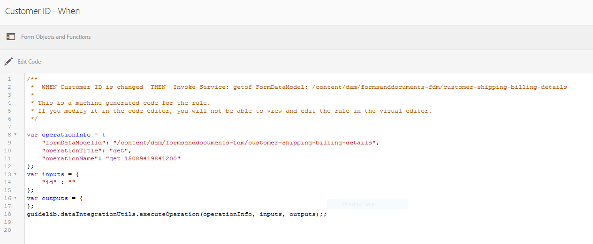

# 자습서:적응형 양식 필드에 규칙 적용 {#tutorial-apply-rules-to-adaptive-form-fields}


이 자습서는 [첫 번째 적응형 양식 만들기](/help/forms/using/create-your-first-adaptive-form.md) 시리즈의 단계입니다. Adobe은 전체 자습서 사용 사례를 이해하고, 수행하고, 시연하기 위해 시리즈를 시간 순서대로 따르는 것을 권장합니다.

## 자습서 {#about-the-tutorial} 정보

규칙을 사용하여 적응형 양식에 대화형, 비즈니스 논리 및 스마트 유효성 검사를 추가할 수 있습니다. 적응형 양식에는 기본 제공 규칙 편집기가 있습니다. 규칙 편집기는 안내식 투어와 유사한 드래그 앤 드롭 기능을 제공합니다. 드래그 앤 드롭 방법은 규칙을 만드는 가장 빠르고 쉬운 방법입니다. 또한 규칙 편집기는 코딩 기술을 테스트하거나 규칙을 한 차원 끌어올리는 데 관심이 있는 사용자를 위한 코드 창도 제공합니다.

[적응형 Forms 규칙 편집기](/help/forms/using/rule-editor.md)에서 규칙 편집기에 대해 자세히 알 수 있습니다.

자습서를 마치면 규칙을 만드는 방법을 알아봅니다.

* 데이터베이스에서 데이터를 검색하려면 양식 데이터 모델 서비스를 호출하십시오
* 데이터 모델 서비스를 호출하여 데이터베이스에 데이터를 추가합니다
* 유효성 검사 검사 실행 및 오류 메시지 표시

자습서의 각 섹션 끝에 있는 대화형 GIF 이미지는 빌드하고 있는 양식의 기능을 즉시 학습하고 확인할 수 있도록 도와줍니다.

## 1단계:데이터베이스 {#retrieve-customer-record}에서 고객 레코드 검색

[양식 데이터 모델 만들기](/help/forms/using/create-form-data-model.md) 문서에 따라 양식 데이터 모델을 만들었습니다. 이제 규칙 편집기를 사용하여 Forms 데이터 모델 서비스를 호출하여 정보를 검색하고 데이터베이스에 추가할 수 있습니다.

모든 고객에게는 데이터베이스에서 관련 고객 데이터를 식별하는 데 도움이 되는 고유한 고객 ID 번호가 지정됩니다. 아래 절차는 고객 ID를 사용하여 데이터베이스에서 정보를 검색합니다.

1. 편집할 적응형 양식을 엽니다.

   [http://localhost:4502/editor.html/content/forms/af/change-billing-shipping-address.html](http://localhost:4502/editor.html/content/forms/af/change-billing-shipping-address.html)

1. **[!UICONTROL 고객 ID]** 필드를 탭하고 **[!UICONTROL 규칙 편집]** 아이콘을 탭합니다. 규칙 편집기 창이 열립니다.
1. **[!UICONTROL + 만들기]** 아이콘을 탭하여 규칙을 추가합니다. 시각적 편집기가 열립니다.

   시각적 편집기에서 기본적으로 **[!UICONTROL WHEN]** 문이 선택됩니다. 또한 규칙 편집기를 시작한 양식 개체(이 경우 **[!UICONTROL 고객 ID]**)는 **[!UICONTROL WHEN]** 문에 지정됩니다.

1. **[!UICONTROL 상태 선택]** 드롭다운을 탭하고 **[!UICONTROL 가 변경됨]**&#x200B;을 선택합니다.

   

1. **[!UICONTROL THEN]** 문에서 **[!UICONTROL Invoke Service]** Select Action ]**드롭다운에서 을 선택합니다.**[!UICONTROL 
1. **[!UICONTROL 선택]** 드롭다운에서 **[!UICONTROL 배송 주소 검색]** 서비스를 선택합니다.
1. 양식 개체 탭에서 **[!UICONTROL 고객 ID]** 필드를 **[!UICONTROL 개체 끌어 놓거나**[!UICONTROL  INPUT ]**상자에서 여기]** 필드를 선택합니다.

   

1. 양식 개체 탭의 **[!UICONTROL 개체 끌어 놓기 필드에**[!UICONTROL &#x200B;고객 ID, 이름, 배송 주소, 상태 및 우편 번호&#x200B;]**필드를 끌어다 놓거나**[!UICONTROL &#x200B;출력&#x200B;]**상자에서 여기]** 필드를 선택합니다.

   

   **[!UICONTROL 완료]**&#x200B;를 눌러 규칙을 저장합니다. 규칙 편집기 창에서 **[!UICONTROL 닫기]**&#x200B;를 누릅니다.

1. 적응형 양식을 미리 봅니다. **[!UICONTROL 고객 ID]** 필드에 ID를 입력합니다. 이제 양식에서 데이터베이스에서 고객 세부 사항을 검색할 수 있습니다.

   

## 2단계:업데이트된 고객 주소를 데이터베이스에 추가 {#updated-customer-address}

데이터베이스에서 고객 세부 정보를 검색한 후 배송 주소, 상태 및 우편 번호를 업데이트할 수 있습니다. 아래 절차는 Form Data Model 서비스를 호출하여 고객 정보를 데이터베이스로 업데이트합니다.

1. **[!UICONTROL Submit]** 필드를 선택하고 **[!UICONTROL 규칙 편집]** 아이콘을 탭합니다. 규칙 편집기 창이 열립니다.
1. **[!UICONTROL 제출 -]** 규칙을 선택하고 **[!UICONTROL 편집]** 아이콘을 탭합니다. 전송 규칙을 편집하는 옵션이 나타납니다.

   

   WHEN 옵션에서 **[!UICONTROL Submit]** 및 **[!UICONTROL 를 클릭한 경우]** 옵션이 이미 선택되어 있습니다.

   

1. **[!UICONTROL THEN]** 옵션에서 **[!UICONTROL + 문 추가]** 옵션을 탭합니다. **[!UICONTROL 작업 선택]** 드롭다운에서 **[!UICONTROL 서비스 호출]**&#x200B;을 선택합니다.
1. **[!UICONTROL 선택]** 드롭다운에서 **[!UICONTROL 배송 주소 업데이트]** 서비스를 선택합니다.

   

   

1. [!UICONTROL Form Objects] 탭의 **[!UICONTROL Shipping Address, State 및 Zip 코드]** 필드를 **[!UICONTROL Drop 개체의 해당 tabename.property(예: customerdetails.shippingAddress)로 끌어다 놓거나**[!UICONTROL  INPUT ]**상자의]** 필드를 선택합니다. 테이블 이름(예: 이 사용 사례의 customerdetails) 접두사가 있는 모든 필드는 업데이트 서비스에 대한 입력 데이터로 사용됩니다. 이러한 필드에 제공된 모든 컨텐츠는 데이터 소스에서 업데이트됩니다.

   >[!NOTE]
   >
   >**[!UICONTROL Name]** 및 **[!UICONTROL Customer ID]** 필드를 해당하는 tablename.property(예: customerdetails.name)로 끌어다 놓지 마십시오. 실수로 고객의 이름과 ID를 업데이트하지 않는 데 도움이 됩니다.

1. [!UICONTROL 양식 개체] 탭의 **[!UICONTROL 고객 ID]** 필드를 **[!UICONTROL INPUT]** 상자의 id 필드로 드래그하여 놓습니다. 접두사가 없는 필드(예: 이 사용 사례의 customerdetails)는 업데이트 서비스의 검색 매개 변수로 사용됩니다. 이 사용 사례의 **[!UICONTROL id]** 필드는 **customerdetails** 테이블에서 레코드를 고유하게 식별합니다.
1. **[!UICONTROL 완료]**&#x200B;를 눌러 규칙을 저장합니다. 규칙 편집기 창에서 **[!UICONTROL 닫기]**&#x200B;를 누릅니다.
1. 적응형 양식을 미리 봅니다. 고객의 세부 사항을 검색하고 배송 주소를 업데이트한 다음 양식을 제출합니다. 동일한 고객의 상세내역을 다시 읽어들일 때 갱신된 배송 주소가 표시됩니다.

## 3단계:(보너스 섹션) 코드 편집기를 사용하여 유효성 검사를 실행하고 오류 메시지 {#step-bonus-section-use-the-code-editor-to-run-validations-and-display-error-messages} 를 표시합니다.

양식에서 유효성 검사를 실행하여 양식에 입력한 데이터가 올바르고 데이터가 잘못된 경우 오류 메시지가 표시되는지 확인해야 합니다. 예를 들어 기존 고객 ID가 아닌 ID를 양식에 입력한 경우 오류 메시지가 표시됩니다.

적응형 양식은 일반적인 사용 사례에 사용할 수 있는 기본 제공 유효성 검사, 예를 들어 이메일 및 숫자 필드를 제공합니다. 예를 들어, 고급 사용 사례에 규칙 편집기를 사용하여 데이터베이스가 0(0) 레코드(레코드 없음)를 반환하는 경우 오류 메시지를 표시합니다.

다음 절차에서는 양식에 입력한 고객 ID가 데이터베이스에 없는 경우 오류 메시지를 표시하는 규칙을 만드는 방법을 보여 줍니다. 또한 이 규칙은 포커스를 로 가져와서 **[!UICONTROL 고객 ID]** 필드를 재설정합니다. 이 규칙은 데이터 모델 서비스](/help/forms/using/invoke-form-data-model-services.md)의 dataIntegrationUtils API를 사용하여 고객 ID가 데이터베이스에 있는지 확인합니다.[

1. **[!UICONTROL 고객 ID]** 필드를 탭하고 `Edit Rules` 아이콘을 탭합니다. [!UICONTROL 규칙 편집기] 창이 열립니다.
1. **[!UICONTROL + 만들기]** 아이콘을 탭하여 규칙을 추가합니다. 시각적 편집기가 열립니다.

   시각적 편집기에서 기본적으로 **[!UICONTROL WHEN]** 문이 선택됩니다. 또한 규칙 편집기를 시작한 양식 개체(이 경우 **[!UICONTROL 고객 ID]**)는 **[!UICONTROL WHEN]** 문에 지정됩니다.

1. **[!UICONTROL 상태 선택]** 드롭다운을 탭하고 **[!UICONTROL 가 변경됨]**&#x200B;을 선택합니다.

   

   **[!UICONTROL THEN]** 문에서 **[!UICONTROL Invoke Service]** Select Action ]**드롭다운에서 을 선택합니다.**[!UICONTROL 

1. **[!UICONTROL Visual Editor]**&#x200B;에서 **[!UICONTROL 코드 편집기]**&#x200B;로 전환합니다. 창 오른쪽에 스위치 컨트롤이 있습니다. 코드 편집기가 열리고 다음과 유사한 코드가 표시됩니다.

   

1. 입력 변수 섹션을 다음 코드로 바꿉니다.

   ```javascript
   var inputs = {
       "id" : this
   };
   ```

1. `guidelib.dataIntegrationUtils.executeOperation (operationInfo, inputs, outputs)` 섹션을 다음 코드로 바꿉니다.

   ```javascript
   guidelib.dataIntegrationUtils.executeOperation(operationInfo, inputs, outputs, function (result) {
     if (result) {
         result = JSON.parse(result);
       customer_Name.value = result.name;
       customer_Shipping_Address = result.shippingAddress;
     } else {
       if(window.confirm("Invalid Customer ID. Provide a valid customer ID")) {
             customer_Name.value = " ";
            guideBridge.setFocus(customer_ID);
       }
     }
   });
   ```

1. 적응형 양식을 미리 봅니다. 잘못된 고객 ID를 입력합니다. 오류 메시지가 나타납니다.

   
