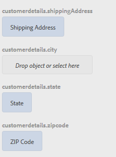

# 자습서: 적응형 양식 필드에 규칙 적용 {#tutorial-apply-rules-to-adaptive-form-fields}


이 자습서는 [첫 번째 적응형 양식을 만들기](/help/forms/using/create-your-first-adaptive-form.md) 시리즈의 단계입니다. Adobe은 전체 자습서 사용 사례를 이해하고, 수행하고, 보여주기 위해 연대순으로 시리즈를 따르는 것을 권장합니다.

## 튜토리얼 기본 정보 {#about-the-tutorial}

규칙을 사용하여 적응형 양식에 대화형, 비즈니스 논리 및 스마트 유효성 검사를 추가할 수 있습니다. 적응형 양식에는 규칙 편집기가 내장되어 있습니다. 규칙 편집기는 안내식 둘러보기와 유사한 드래그 앤 드롭 기능을 제공합니다. 드래그 앤 드롭 방법은 규칙을 만드는 가장 빠르고 쉬운 방법입니다. 규칙 편집기는 코딩 기술을 테스트하거나 규칙을 다음 수준으로 이행하는 데 관심이 있는 사용자를 위한 코드 창도 제공합니다.

규칙 편집기에 대한 자세한 내용은 [적응형 Forms 규칙 편집기](/help/forms/using/rule-editor.md)를 참조하세요.

자습서가 끝날 때까지 규칙을 만들어 다음을 수행하는 방법을 배웁니다.

* 데이터베이스에서 데이터를 검색하려면 양식 데이터 모델 서비스를 호출하십시오
* 양식 데이터 모델 서비스를 호출하여 데이터베이스에 데이터 추가
* 유효성 검사 실행 및 오류 메시지 표시

자습서의 각 섹션 끝에 있는 대화형 GIF 이미지를 통해 즉석에서 작성하고 있는 양식의 기능을 학습하고 확인할 수 있습니다.

## 1단계: 데이터베이스에서 고객 레코드 검색 {#retrieve-customer-record}

[양식 데이터 모델 만들기](/help/forms/using/create-form-data-model.md) 문서에 따라 양식 데이터 모델을 만들었습니다. 이제 규칙 편집기를 사용하여 Forms 데이터 모델 서비스를 호출하여 정보를 검색하고 데이터베이스에 추가할 수 있습니다.

모든 고객에게는 고유한 고객 ID 번호가 할당되어 데이터베이스의 관련 고객 데이터를 식별하는 데 도움이 됩니다. 아래 절차에서는 고객 ID를 사용하여 데이터베이스에서 정보를 검색합니다.

1. 편집할 적응형 양식을 엽니다.

   [http://localhost:4502/editor.html/content/forms/af/change-billing-shipping-address.html](http://localhost:4502/editor.html/content/forms/af/change-billing-shipping-address.html)

1. **[!UICONTROL 고객 ID]** 필드를 선택하고 **[!UICONTROL 규칙 편집]** 아이콘을 선택합니다. 규칙 편집기 창이 열립니다.
1. **[!UICONTROL + 만들기]** 아이콘을 선택하여 규칙을 추가합니다. 비주얼 편집기가 열립니다.

   비주얼 편집기에서 기본적으로 **[!UICONTROL WHEN]** 문이 선택됩니다. 또한 규칙 편집기를 시작한 폼 개체(이 경우 **[!UICONTROL 고객 ID]**)는 **[!UICONTROL WHEN]** 문에 지정됩니다.

1. **[!UICONTROL 상태 선택]** 드롭다운을 선택하고 **[!UICONTROL 변경됨]**&#x200B;을 선택합니다.

   

1. **[!UICONTROL THEN]** 문의 **[!UICONTROL 작업 선택]** 드롭다운에서 **[!UICONTROL 서비스 호출]**&#x200B;을 선택합니다.
1. **[!UICONTROL 선택]** 드롭다운에서 **[!UICONTROL 배송 주소 검색]** 서비스를 선택합니다.
1. 양식 개체 탭에서 **[!UICONTROL 고객 ID]** 필드를 **[!UICONTROL 입력]** 상자의 **[!UICONTROL 개체 놓기 또는 여기에서 선택]** 필드로 드래그 앤 드롭하십시오.

   

1. 양식 개체 탭에서 **[!UICONTROL 고객 ID, 이름, 배송 주소, 상태 및 우편 번호]** 필드를 **[!UICONTROL OUTPUT]** 상자의 **[!UICONTROL 개체 놓기 또는 여기를 선택]** 필드로 드래그 앤 드롭하십시오.

   

   **[!UICONTROL 완료]**&#x200B;를 선택하여 규칙을 저장합니다. 규칙 편집기 창에서 **[!UICONTROL 닫기]**&#x200B;를 선택합니다.

1. 적응형 양식을 미리 봅니다. **[!UICONTROL 고객 ID]** 필드에 ID를 입력하십시오. 이제 양식에서 데이터베이스에서 고객 세부 정보를 검색할 수 있습니다.

   

## 2단계: 업데이트된 고객 주소를 데이터베이스에 추가 {#updated-customer-address}

데이터베이스에서 고객 세부 정보를 검색한 후 배송 주소, 상태 및 우편 번호를 업데이트할 수 있습니다. 다음 절차는 양식 데이터 모델 서비스를 호출하여 고객 정보를 데이터베이스에 업데이트합니다.

1. **[!UICONTROL 제출]** 필드를 선택하고 **[!UICONTROL 규칙 편집]** 아이콘을 선택합니다. 규칙 편집기 창이 열립니다.
1. **[!UICONTROL 제출 - 클릭]** 규칙을 선택하고 **[!UICONTROL 편집]** 아이콘을 선택합니다. 제출 규칙을 편집할 수 있는 옵션이 나타납니다.

   

   WHEN 옵션에서 **[!UICONTROL 제출]** 및 **[!UICONTROL 클릭]** 옵션이 이미 선택되었습니다.

   

1. **[!UICONTROL THEN]** 옵션에서 **[!UICONTROL + 문 추가]** 옵션을 선택합니다. **[!UICONTROL 작업 선택]** 드롭다운에서 **[!UICONTROL 서비스 호출]**&#x200B;을 선택합니다.
1. **[!UICONTROL 선택]** 드롭다운에서 **[!UICONTROL 배송 주소 업데이트]** 서비스를 선택하십시오.

   

   

1. [!UICONTROL 양식 개체] 탭의 **[!UICONTROL 배달 주소, 상태 및 우편번호]** 필드를 **[!UICONTROL 개체 삭제의 해당 tablename .property(예: customerdetails .shippingAddress)로 끌어서 놓거나**&#x200B;[!UICONTROL &#x200B; INPUT &#x200B;]&#x200B;**상자에서]** 필드를 선택하십시오. tablename 접두사가 붙은 모든 필드(예: 이 사용 사례의 경우 customerdetails)는 업데이트 서비스의 입력 데이터 역할을 합니다. 이 필드에 제공된 모든 콘텐츠는 데이터 소스에서 업데이트됩니다.

   >[!NOTE]
   >
   >**[!UICONTROL 이름]** 및 **[!UICONTROL 고객 ID]** 필드를 해당 tablename.property(예: customerdetails.name)로 드래그 앤 드롭하지 마십시오. 실수로 고객의 이름과 ID를 업데이트하지 않도록 도와줍니다.

1. [!UICONTROL 양식 개체] 탭에서 **[!UICONTROL 고객 ID]** 필드를 **[!UICONTROL 입력]** 상자의 ID 필드로 끌어서 놓습니다. 접두사가 있는 tablename이 없는 필드(예: 이 사용 사례의 경우 customerdetails)는 업데이트 서비스의 검색 매개 변수 역할을 합니다. 이 사용 사례의 **[!UICONTROL id]** 필드는 **customerdetails** 테이블의 레코드를 고유하게 식별합니다.
1. **[!UICONTROL 완료]**&#x200B;를 선택하여 규칙을 저장합니다. 규칙 편집기 창에서 **[!UICONTROL 닫기]**&#x200B;를 선택합니다.
1. 적응형 양식을 미리 봅니다. 고객의 세부 정보를 검색하고 배송 주소를 업데이트한 다음 양식을 제출합니다. 동일한 고객의 세부 정보를 다시 검색하면 업데이트된 배송 주소가 표시됩니다.

## 3단계: (보너스 섹션) 코드 편집기를 사용하여 유효성 검사를 실행하고 오류 메시지를 표시하십시오 {#step-bonus-section-use-the-code-editor-to-run-validations-and-display-error-messages}

양식에 입력한 데이터가 올바른지, 그리고 잘못된 데이터가 있는 경우 오류 메시지가 표시되는지 확인하기 위해 양식에 대한 유효성 검사를 실행해야 합니다. 예를 들어, 존재하지 않는 고객 ID를 양식에 입력한 경우, 오류 메시지가 표시되어야 합니다.

적응형 양식은 일반적인 사용 사례에 사용할 수 있는 이메일 및 숫자 필드 등 여러 구성 요소에 내장된 유효성 검사를 제공합니다. 고급 사용 사례에 규칙 편집기를 사용하십시오. 예를 들어, 데이터베이스가 레코드 없이 0개의 레코드를 반환할 때 오류 메시지를 표시합니다.

다음 절차에서는 양식에 입력한 고객 ID가 데이터베이스에 없는 경우 오류 메시지를 표시하는 규칙을 만드는 방법을 보여 줍니다. 또한 규칙은 **[!UICONTROL 고객 ID]** 필드에 초점을 맞추고 다시 설정합니다. 규칙은 [양식 데이터 모델 서비스](/help/forms/using/invoke-form-data-model-services.md)의 dataIntegrationUtils API를 사용하여 데이터베이스에 고객 ID가 있는지 확인합니다.

1. **[!UICONTROL 고객 ID]** 필드를 선택하고 `Edit Rules` 아이콘을 선택합니다. [!UICONTROL 규칙 편집기] 창이 열립니다.
1. **[!UICONTROL + 만들기]** 아이콘을 선택하여 규칙을 추가합니다. 비주얼 편집기가 열립니다.

   비주얼 편집기에서 기본적으로 **[!UICONTROL WHEN]** 문이 선택됩니다. 또한 규칙 편집기를 시작한 폼 개체(이 경우 **[!UICONTROL 고객 ID]**)는 **[!UICONTROL WHEN]** 문에 지정됩니다.

1. **[!UICONTROL 상태 선택]** 드롭다운을 선택하고 **[!UICONTROL 변경됨]**&#x200B;을 선택합니다.

   

   **[!UICONTROL THEN]** 문의 **[!UICONTROL 작업 선택]** 드롭다운에서 **[!UICONTROL 서비스 호출]**&#x200B;을 선택합니다.

1. **[!UICONTROL 비주얼 편집기]**&#x200B;에서 **[!UICONTROL 코드 편집기]**(으)로 전환합니다. 스위치 컨트롤은 창의 오른쪽에 있습니다. 코드 편집기가 열리고 다음과 유사한 코드가 표시됩니다.

   

1. 입력 변수 섹션을 다음 코드로 바꿉니다.

   ```javascript
   var inputs = {
       "id" : this
   };
   ```

1. `guidelib.dataIntegrationUtils.executeOperation (operationInfo, inputs, outputs)` 섹션을 다음 코드로 바꿉니다.

   ```javascript
   guidelib.dataIntegrationUtils.executeOperation(operationInfo, inputs, outputs, function (result) {
     if (result) {
         result = JSON.parse(result);
       customer_Name.value = result.name;
       customer_Shipping_Address = result.shippingAddress;
     } else {
       if(window.confirm("Invalid Customer ID. Provide a valid customer ID")) {
             customer_Name.value = " ";
            guideBridge.setFocus(customer_ID);
       }
     }
   });
   ```

1. 적응형 양식을 미리 봅니다. 잘못된 고객 ID를 입력하십시오. 오류 메시지가 나타납니다.

   
