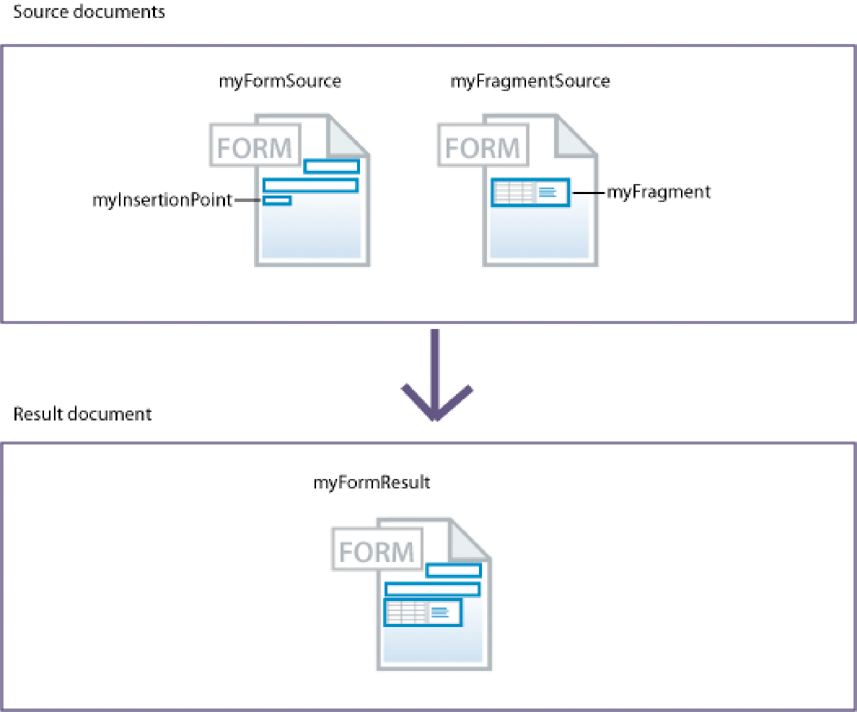

# 어셈블러 서비스 사용{#using-assembler-service}

Assembler 서비스를 사용하면 PDF 및 XDP 문서를 결합, 재정렬 및 보강하고 PDF 문서에 대한 정보를 얻을 수 있습니다. 어셈블러 서비스에 제출된 각 작업에는 DCX(Document Description XML) 문서, 소스 문서 및 외부 리소스(문자열 및 그래픽)가 포함됩니다. 어셈블러 서비스에 대한 자세한 내용은 [어셈블러 서비스 개요](../../forms/using/overview-aem-document-services.md#p-assembler-service-p)를 참조하십시오.

다음 작업에 조합 서비스를 사용할 수 있습니다.

## PDF 문서 조합 {#assemble-pdf-documents}

어셈블러 서비스를 사용하여 두 개 이상의 PDF 문서를 하나의 PDF 문서 또는 PDF Portfolio으로 결합할 수 있습니다. 또한 PDF 문서에 탐색 또는 보안을 강화하는 기능을 적용할 수 있습니다. 다음은 PDF 문서를 취합할 수 있는 몇 가지 방법입니다.

### 간단한 PDF 문서 구성 {#assemble-a-simple-pdf-document}

다음 그림은 하나의 결과 문서로 병합되는 3개의 소스 문서를 보여줍니다.


여러 PDF 문서에서 간단한 PDF 문서 취합

다음 예제는 문서를 조합하는 데 사용되는 간단한 DCX 문서입니다. 결과 문서를 만드는 데 사용되는 소스 문서의 이름과 결과 문서의 이름을 지정합니다.

```xml
<PDF result="Doc4">
<PDF source="Doc1"/>
<PDF source="Doc2"/>
<PDF source="Doc3"/>
</PDF>
```

문서 어셈블리는 다음 내용이 포함된 결과 문서를 만듭니다.\
특성:

* 각 소스 문서의 전체 또는 일부
* 어셈블된 결과 문서에 대해 표준화된 각 소스 문서의 책갈피 전체 또는 일부
* 메타데이터, 페이지 레이블 및 페이지 크기 등 기본 문서(Doc1)에서 채택되는 기타 특성
* 선택적으로, 결과 문서에는 소스 문서의 책갈피에서 만들어진 목차가 포함됩니다

### PDF Portfolio 만들기 {#create-a-pdf-portfolio}

어셈블러 서비스는 문서 모음과 선택된 포함된 사용자 인터페이스를 포함하는 PDF Portfolio을 만들 수 있습니다. 이 인터페이스를 PDF Portfolio 레이아웃 또는 PDF Portfolio 탐색기(내비게이터)라고 합니다. PDF Portfolio은 내비게이터, 폴더 및 시작 페이지를 추가하여 PDF 패키지의 기능을 확장합니다. 인터페이스는 지역화된 텍스트 문자열, 사용자 정의 색상 구성표 및 그래픽 리소스를 활용하여 사용자 경험을 향상시킬 수 있습니다. PDF Portfolio에는 포트폴리오의 파일을 구성하기 위한 폴더가 포함될 수도 있습니다.

어셈블러 서비스에서 다음 DDX 문서를 해석하면 PDF Portfolio 탐색기와 2개의 파일 패키지를 포함하는 PDF Portfolio을 어셈블합니다. 서비스는 myNavigator 소스에서 지정한 위치에서 탐색기를 가져옵니다. 탐색기의 기본 색상 구성표를 pinkScheme 색상 구성표로 변경합니다.

```xml
<DDX xmlns="https://ns.adobe.com/DDX/1.0/">
<PDF result="Untitled 1">
<Portfolio>
<Navigator source="myNavigator"/>
<ColorScheme scheme="pinkScheme"/>
</Portfolio>
<PackageFiles>
<PDF source="sourcePDF1"/>
<PDF source="sourcePDF2"/>
</PackageFiles>
</PDF>
</DDX>
```

### 암호화된 문서 조합 {#assemble-encrypted-documents}

문서를 취합할 때 암호로 PDF 문서를 암호화할 수도 있습니다. PDF 문서가 암호로 암호화된 후 Adobe Reader 또는 Acrobat에서 PDF 문서를 보려면 암호를 지정해야 합니다. 암호로 PDF 문서를 암호화하려면 PDF 문서를 암호화하는 데 필요한 암호화 요소 값을 DCX 문서에 포함해야 합니다.

암호화 서비스는 암호로 PDF 문서를 암호화하기 위해 LiveCycle 설치에 포함되지 않아도 됩니다.

하나 이상의 입력 문서가 암호화되어 있는 경우 DCX의 일부로 문서를 여는 암호를 제공하십시오.

### {#assemble-documents-using-bates-numbering} Bates 번호 매기기를 사용하여 문서 조합

문서를 취합할 때 Bates 번호 매기기를 사용하여 각 페이지에 고유한 페이지 식별자를 적용할 수 있습니다. Bates 번호 매기기를 사용하는 경우 문서(또는 문서 집합)의 각 페이지에 페이지를 고유하게 식별하는 번호가 할당됩니다. 예를 들어 BOM 정보가 들어 있고 어셈블리 생산과 연관된 제조 문서에는 식별자가 포함될 수 있습니다. Bates 번호에는 순차적으로 증가하는 숫자 값과 선택적 접두어와 접미어가 포함됩니다. 접두어 + 숫자 값 + 접미어를 bates 패턴이라고 합니다.

다음 그림은 문서 헤더에 있는 고유 식별자를 포함하고 있는 PDF 문서를 보여줍니다.


문서 헤더에 있는 고유 식별자가 들어 있는 PDF 문서

### 문서 병합 및 조합 {#flatten-and-assemble-documents}

Assembler 서비스를 사용하여 대화형 PDF 문서(예: 양식)를 비대화형 PDF 문서로 변환할 수 있습니다. 인터랙티브한 PDF 문서를 사용하면 PDF 문서 필드에 있는 데이터를 입력하거나 수정할 수 있습니다. 대화형 PDF 문서를 비대화형 PDF 문서로 변환하는 과정을 병합이라고 합니다. PDF 문서를 분리하면 양식 필드는 그래픽 모양으로 유지되지만 더 이상 인터랙티브하지 않습니다. PDF 문서를 병합하는 한 가지 이유는 데이터를 수정할 수 없기 때문입니다. 또한 필드와 관련된 스크립트가 더 이상 작동하지 않습니다.

대화형 PDF 문서에서 어셈블된 PDF 문서를 만들 때 Assembler 서비스는 결과 문서에 어셈블하기 전에 해당 양식을 병합합니다.

>[!NOTE]
>
>어셈블러 서비스는 출력 서비스를 사용하여 동적 XFA 양식을 병합합니다. Assembler 서비스가 XFA 동적 양식을 병합해야 하는 DDX를 처리하고 출력 서비스를 사용할 수 없는 경우 예외가 발생합니다. Assembler 서비스는 출력 서비스를 사용하지 않고 Acrobat 양식 또는 정적 XFA 양식을 병합할 수 있습니다.

## XDP 문서 조합 {#assemble-xdp-documents}

Assembler 서비스를 사용하여 여러 XDP 문서를 단일 XDP 문서 또는 PDF 문서로 결합할 수 있습니다. 삽입 지점이 포함된 소스 XDP 파일의 경우 삽입할 조각을 지정할 수 있습니다.

다음은 XDP 문서를 취합할 수 있는 몇 가지 방법입니다.

### 간단한 XDP 문서 {#assemble-a-simple-xdp-document} 조합

다음 그림은 단일 결과 XDP 문서로 취합되는 3개의 소스 XDP 문서를 보여줍니다. 결과 XDP 문서에는 연결된 데이터를 포함한 3개의 소스 XDP 문서가 포함되어 있습니다. 결과 문서는 첫 번째 소스 XDP 문서인 기본 문서에서 기본 속성을 가져옵니다.


여러 XDP 문서에서 간단한 XDP 문서 취합

다음은 위의 결과를 보여 주는 DCX 문서입니다.

```xml
<DDX xmlns="https://ns.adobe.com/DDX/1.0/">
<XDP result="MyXDPResult">
<XDP source="sourceXDP1"/>
<XDP source="sourceXDP2"/>
<XDP source="sourceXDP3"/>
</XDP>
</DDX>
```

### 어셈블리 {#resolving-references-during-assembly} 중 참조 확인

일반적으로 XDP 문서에는 절대 참조나 상대 참조를 통해 참조된 이미지가 포함될 수 있습니다. 어셈블러 서비스는 기본적으로 결과 XDP 문서의 이미지에 대한 참조를 유지합니다.

어셈블을 할 때 XDP 파일의 절대 참조나 상대 참조를 통해 소스 XDP 문서에서 참조된 이미지를 처리하는 방식을 지정할 수 있습니다. 결과물에 상대 또는 절대 참조가 없도록 모든 이미지가 포함되도록 선택할 수 있습니다. 다음 옵션을 사용할 수 있는 resolveAssets 태그의 값을 설정하여 이 값을 정의합니다. 기본적으로 결과 문서에는 참조가 확인되지 않습니다.

<table>
 <tbody> 
  <tr> 
   <th>값</th> 
   <th>설명</th> 
  </tr> 
  <tr> 
   <td>없음</td> 
   <td>참조를 확인하지 않습니다.</td> 
  </tr> 
  <tr> 
   <td>모두</td> 
   <td>소스 XDP 문서에 참조된 모든 이미지를 포함합니다.</td> 
  </tr> 
  <tr> 
   <td>상대적</td> 
   <td>소스 XDP<br /> 문서의 상대 참조를 통해 참조되는 모든 이미지를 포함합니다.</td> 
  </tr> 
  <tr> 
   <td>절대</td> 
   <td>소스 XDP<br /> 문서에서 절대 참조를 통해 참조된 모든 이미지를 포함합니다.</td> 
  </tr> 
 </tbody> 
</table>

XDP 소스 태그나 상위 XDP 결과 태그에서 resolveAssets 속성 값을 지정할 수 있습니다. 속성이 XDP 결과 태그에 지정된 경우 XDP 결과의 자식인 모든 XDP 소스 요소에 의해 상속됩니다. 그러나 소스 요소에 대한 속성을 명시적으로 지정하면 해당 소스 문서에 대한 결과 요소의 설정만 재정의됩니다.

#### XDP 문서 {#resolve-all-source-references-in-an-xdp-document}의 모든 소스 참조 확인

소스 XDP 문서의 모든 참조를 해결하려면\
아래 예와 같이 결과 문서를 모든 사람에게 전송합니다.

```xml
<DDX xmlns="https://ns.adobe.com/DDX/1.0/">
<XDP result="result.xdp" resolveAssets="all">
<XDP source="input1.xdp" />
<XDP source="input2.xdp" />
<XDP source="input3.xdp" />
</XDP>
</DDX
```

모든 소스 XDP 문서에 대한 속성을 개별적으로 지정하여\
결과.

```xml
<DDX xmlns="https://ns.adobe.com/DDX/1.0/">
<XDP result="result.xdp">
<XDP source="input1.xdp" resolveAssets="all"/>
<XDP source="input2.xdp" resolveAssets="all"/>
<XDP source="input3.xdp" resolveAssets="all"/>
</XDP>
</DDX>
```

#### XDP 문서 {#resolve-selected-source-references-in-an-xdp-document}에서 선택한 소스 참조를 확인합니다.

resolveAssets 속성을 지정하여 해결할 소스 참조를 선택적으로 지정할 수 있습니다. 개별 소스 문서의 특성은 결과 XDP 문서의 설정을 덮어씁니다. 이 예에서 포함된 조각도 확인됩니다.

```xml
<DDX xmlns="https://ns.adobe.com/DDX/1.0/">
<XDP result="result.xdp" resolveAssets="all">
<XDP source="input1.xdp" >
<XDPContent source="fragment.xdp" insertionPoint="MyInsertionPoint"
fragment="myFragment"/>
</XDP>
<XDP source="input2.xdp" />
</XDP>
</DDX>
```

#### 절대 또는 상대 참조({#selectively-resolve-absolute-or-relative-references})를 선택적으로 해결

아래 예와 같이 소스 문서의 전체 또는 일부에 있는 절대 또는 상대 참조를 선택적으로 해결할 수 있습니다.

```xml
<DDX xmlns="https://ns.adobe.com/DDX/1.0/">
<XDP result="result.xdp" resolveAssets="absolute">
<XDP source="input1.xdp" />
<XDP source="input2.xdp" />
</XDP>
</DDX
```

### 양식 조각을 XFA 양식 {#dynamically-insert-form-fragments-into-an-xfa-form}에 동적으로 삽입

Assembler 서비스를 사용하여 단편이 삽입되는 다른 XFA 양식에서 만든 XFA 양식을 만들 수 있습니다. 이 기능을 사용하면 조각을 사용하여 여러 양식을 만들 수 있습니다.

양식 조각의 동적 삽입 기능은 단일 소스 제어를 지원합니다. 일반적으로 사용되는 구성 요소의 단일 소스를 유지 관리합니다. 예를 들어 회사 배너용 조각을 만들 수 있습니다. 배너가 변경되면 조각을 수정하기만 하면 됩니다. 조각을 포함하는 다른 양식은 변경되지 않습니다.

양식 디자이너는 LiveCycle 디자이너를 사용하여 양식 조각을 만듭니다. 이러한 조각은 XFA 양식 내에서 고유한 하위 형식으로 지정됩니다. 양식 디자이너는 또한 Designer를 사용하여 고유한 이름의 삽입점을 갖는 XFA 양식을 만듭니다. (프로그래머)는 XFA 양식에 조각을 삽입하는 방법을 지정하는 DDX 문서를 작성합니다.

다음 그림은 두 개의 XML 양식(XFA 템플릿)을 보여줍니다. 왼쪽에 있는 양식에는 myInsertionPoint라는 삽입 포인터가 있습니다. 오른쪽의 양식에는 myFragment라는 조각이 포함되어 있습니다.



양식 조각을 XFA 양식에 삽입

어셈블러 서비스에서 다음 DDX 문서를 해석하면 다른 XML 양식이 포함된 XML 양식이 만들어집니다. myFragmentSource 문서의 myFragment 하위 양식이 myFormSource 문서의 myInsertionPoint에 삽입됩니다.

```xml
<DDX xmlns="https://ns.adobe.com/DDX/1.0/">
<XDP result="myFormResult">
<XDP source="myFormSource">
<XDPContent fragment="myFragment" insertionPoint="myInsertionPoint"
source="myFragmentSource"/>
</XDP>
</XDP>
</DDX
```

### XDP 문서를 PDF {#package-an-xdp-document-as-pdf}로 패키징

이 DDX 문서에 표시된 대로 Assembler 서비스를 사용하여 XDP 문서를 PDF 문서로 패키지화할 수 있습니다.

```xml
<DDX xmlns="https://ns.adobe.com/DDX/1.0/">
<PDF result="Untitled 1" encryption="passEncProfile1">
<XDP>
<XDP source="sourceXDP3"/>
<XDP source="sourceXDP4"/>
</XDP>
</PDF>
</DDX>
```

## PDF 문서 제거 {#disassemble-pdf-documents}

Assembler 서비스를 사용하여 PDF 문서를 분해할 수 있습니다. 이 서비스는 소스 문서에서 페이지를 추출하거나 책갈피를 기반으로 소스 문서를 나눌 수 있습니다. 일반적으로 이 작업은 PDF 문서가 문 모음과 같은 여러 개별 문서에서 처음 만들어진 경우에 유용합니다.

### 소스 문서 {#extract-pages-from-a-source-document}에서 페이지 추출

다음 그림에서 1-3페이지는 소스 문서에서 추출되어 새 결과 문서에 배치됩니다.


소스 문서에서 특정 페이지 추출

다음 예제는 문서를 분해하는 데 사용되는 DCX 문서입니다.

```xml
<PDF result="Doc4">
<PDF source="Doc2" pages="1-3"/>
</PDF>
```

### 책갈피 {#divide-a-source-document-based-on-bookmarks} 기반 소스 문서 나누기

다음 그림에서 DocA는 여러 결과 문서로 분할됩니다. 페이지의 첫 번째 수준 1 책갈피는 새 결과 문서의 시작을 나타냅니다.


책갈피를 기반으로 하는 소스 문서를 여러 문서로 나누기

다음 예제는 책갈피를 사용하여 소스 문서를 분해하는 DCX 문서입니다.

```xml
<PDFsFromBookmarks prefix="A">
<PDF source="DocA"/>
</PDFsFromBookmarks>
```

## 문서가 PDF/A 규격 {#determine-whether-documents-are-pdf-a-compliant} 인지 확인

Assembler 서비스를 사용하여 PDF 문서가 PDF/A 규격인지 확인할 수 있습니다. PDF/A는 문서 컨텐츠를 장기간 보존하기 위한 보관 포맷입니다. 글꼴은 문서 내에 포함되고 파일의 압축이 해제됩니다. 따라서 PDF/A 문서는 일반적으로 표준 PDF 문서보다 큽니다. 또한 PDF/A 문서에는 오디오 및 비디오 내용이 포함되어 있지 않습니다.

## PDF 문서 {#obtain-information-about-a-pdf-document}에 대한 정보 얻기

Assembler 서비스를 사용하여 PDF 문서에 대한 다음 정보를 얻을 수 있습니다.

* 텍스트 정보.

   * 문서의 각 페이지에 있는 단어
   * 문서의 각 페이지에 있는 각 단어의 위치
   * 문서 각 페이지의 각 단락에 있는 문장

* 페이지 번호, 제목, 대상 및 모양을 비롯한 책갈피입니다. 이 파일을 내보낼 수 있습니다\
   데이터를 PDF 문서로 가져와서 PDF 문서로 가져올 수 있습니다.

* 파일 정보를 포함한 첨부 파일. 페이지 수준 첨부 파일의 경우\
   첨부 파일 주석의 위치입니다. 이 데이터를 PDF 문서에서 내보낼 수 있으며\
   PDF 문서로 가져올 수 있습니다.

* 파일 정보, 폴더, 패키지, 스키마 및 필드 데이터를 비롯한 파일을 패키지화할 수 있습니다. 이 데이터를 PDF 문서에서 내보내고 PDF 문서로 가져올 수 있습니다.

## DCX 문서 유효성 검사 {#validate-ddx-documents}

Assembler 서비스를 사용하여 DDX 문서가 유효한지 확인할 수 있습니다. 예를 들어 이전 LiveCycle 버전에서 업그레이드한 경우 유효성 검사를 통해 DDX 문서가 유효한지 확인합니다.

## 다른 서비스 {#call-other-services} 호출

어셈블러 서비스에서 다음 LiveC 사이클 서비스를 호출하도록 하는 DDX 문서를 사용할 수 있습니다. 어셈블러 서비스는 LiveCycle과 함께 설치된 서비스만 호출할 수 있습니다.

**Reader 확장 서비스**:결과 PDF 문서에 디지털 서명을 할 수 있습니다.

**Forms 서비스**:XDP 파일과 XML 데이터 파일을 병합하여 채워진 대화형 양식이 포함된 PDF 문서를 만듭니다.

**출력 서비스**:동적 XML 양식을 비대화형 양식을 포함하는 PDF 문서로 변환합니다(양식 병합). 어셈블러 서비스는 출력 서비스를 호출하지 않고 정적 XML 양식과 Acrobat 양식을 병합합니다.

```xml
<?xml version="1.0" encoding="UTF-8"?>
<DDX xmlns="https://ns.adobe.com/DDX/1.0/">
<PDF result="outDoc">
<PDF source="doc1"/>
<PDF source="doc2"/>
<ReaderRights
credentialAlias="LCESCred"
digitalSignatures="true"/>
</PDF>
</DDX>
```

DDC와 Assembler 서비스를 사용하여 다른 LiveC 사이클 서비스를 호출하면 프로세스 다이어그램을 단순화할 수 있습니다. 또한 워크플로우를 맞춤화하는 데 소요되는 시간을 줄일 수 있습니다. (참고 항목
