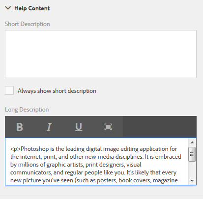
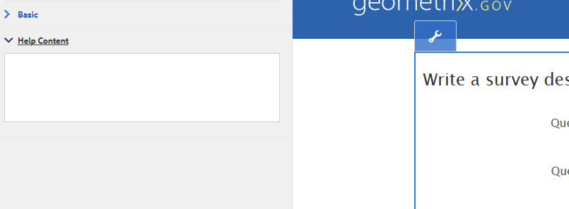

# 양식 필드에 대한 컨텍스트 내 도움말 작성{#authoring-in-context-help-for-form-fields}

## 소개 {#introduction}

최종 사용자가 특정 양식 필드에 세부 사항을 입력하는 방법을 모를 때 이 문제가 발생합니다. 이러한 문제를 해결하기 위해 적응형 양식에서는 양식 필드에 텍스트나 풍부한 컨텍스트 내 도움말을 추가하는 지원을 제공합니다. 양식 채우기 환경을 개선하고 최종 사용자가 모호하지 않도록 해줍니다.

이 문서에서는 양식 작성자가 적응형 Forms 작성 시 상황에 맞는 도움말을 추가하는 방법에 대해 설명합니다.

## 상황에 맞는 도움말 {#add-in-context-help} 추가

사이드바의 속성 탭에 있는 도움말 컨텐츠 섹션에서 다음 옵션을 사용하여 상황에 맞는 도움말을 지정할 수 있습니다.

* [간단한 설명입니다](../../forms/using/authoring-in-field-help.md#p-short-description-p)
* [자세한 설명](../../forms/using/authoring-in-field-help.md#p-long-description-p)

>[!NOTE]
>
>자세한 설명은 짧은 설명을 무시합니다. 둘 다 지정한 경우 긴 설명만 표시됩니다.

### 간단한 설명입니다 {#short-description}

간단한 설명 필드는 양식 필드 채우기에 대한 빠른 힌트를 제공하는 것입니다. [짧은 설명] 필드에 지정된 텍스트는 마우스를 필드 위에 놓을 때 도구 설명으로 표시됩니다.

>[!NOTE]
>
>필드 아래에 도움말 텍스트를 영구적으로 표시하려면 **항상 짧은 설명 표시**&#x200B;를 선택합니다.

### 자세한 설명 {#long-description}

자세한 설명 필드를 사용하여 긴 텍스트를 지정하거나 상황에 맞는 도움말과 같이 비디오를 비롯한 리치 미디어 컨텐츠를 포함할 수 있습니다. 예를 들어 다음 이미지는 컨텍스트 내 도움말로 비디오를 포함할 수 있는 방법을 보여줍니다.

긴 설명을 추가하면 **이(가) 표시됩니까?** 아이콘을 클릭합니다. 아이콘을 클릭하면 긴 설명 섹션에 추가된 컨텐츠가 표시됩니다.

### 패널 수준 도움말 {#panel-level-help}

양식 필드에 대한 컨텍스트 내 도움말 외에도 패널 편집 대화 상자의 도움말 내용 탭에서 패널 수준에서 도움말을 지정할 수 있습니다.

패널에 대한 도움말을 추가하면 **이(가) 표시됩니까?** 아이콘을 클릭합니다. 아이콘을 클릭하면 패널 편집 대화 상자의 도움말 내용 섹션에 추가된 컨텐츠가 표시됩니다.

