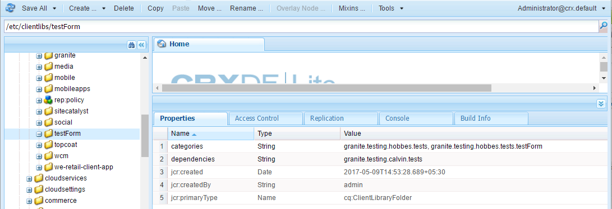
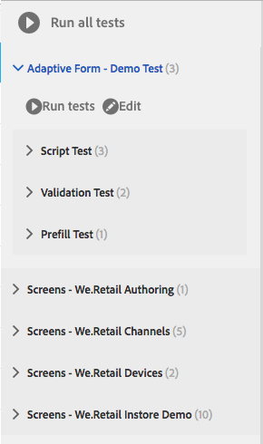

# 적응형 양식 테스트 자동화{#automate-testing-of-adaptive-forms}

## 개요 {#overview}

적응형 양식은 고객과의 상호 작용에 없어서는 안 될 요소입니다. 새로운 수정 팩을 롤아웃하거나 양식의 규칙을 변경하는 등 양식 변경 사항에 따라 적응형 양식을 테스트하는 것이 중요합니다. 그러나 적응형 양식과 그 안에 있는 모든 필드의 기능 테스트는 지루할 수 있습니다.

Calvin을 사용하면 웹 브라우저에서 적응형 양식 테스트를 자동화할 수 있습니다. Calvin은 [Hobes](/help/sites-developing/hobbes.md) 사용자 인터페이스를 사용하여 테스트를 실행하고 다음 도구를 제공합니다.

* 테스트 만들기를 위한 JavaScript API.
* 테스트 실행을 위한 사용자 인터페이스입니다.

Calvin을 사용하면 CRXDE에서 테스트 케이스를 작성하고 웹 브라우저에서 직접 UI 테스트를 실행하여 적응형 양식의 다음 측면을 철저히 테스트할 수 있습니다.

<table>
 <tbody>
  <tr>
   <td><strong>테스트를 위한 적응형 양식 종횡비</strong></td>
   <td><strong>설명</strong></td>
  </tr>
  <tr>
   <td>적응형 양식의 자동 완성 경험</td>
   <td>
    <ul>
     <li>데이터 모델 유형을 기반으로 양식이 예상대로 미리 채워지나요?</li>
     <li>양식 객체의 기본값이 예상대로 미리 입력됩니까?</li>
    </ul> </td>
  </tr>
  <tr>
   <td>적응형 양식의 경험 제출</td>
   <td>
    <ul>
     <li>제출 시 올바른 데이터가 생성됩니까?</li>
     <li>제출 중에 서버에서 양식의 유효성을 다시 검사합니까?</li>
     <li>전송 작업이 실행 중인 양식에 대해 구성되어 있습니까?</li>
    </ul> </td>
  </tr>
  <tr>
   <td><p>표현식 규칙</p> <p> </p> </td>
   <td>
    <ul>
     <li>관련 UI 작업을 수행한 후 실행되는 필드 종료 후 계산, 표시, 스크립트 실행 등 양식 객체와 연관된 표현식이 있습니까?<br /> </li>
    </ul> </td>
  </tr>
  <tr>
   <td>유효성 검사</td>
   <td>
    <ul>
     <li>작업을 수행한 후 필드 유효성 검사가 예상대로 실행됩니까?</li>
    </ul> </td>
  </tr>
  <tr>
   <td><p>레이지 로딩</p> <p> </p> </td>
   <td>
    <ul>
     <li>탭(또는 패널의 탐색 항목)을 클릭하면 서버에서 레이지 로드 구성에 따라 HTML을 가져오는 것입니까?</li>
    </ul></td>
  </tr>
  <tr>
   <td><p>UI 상호 작용</p> </td>
   <td>
    <ul>
     <li><a href="https://helpx.adobe.com/aem-forms/6-3/calvin-sdk-javascript-api/calvin.html#toc2__anchor" target="_blank">적응형 양식 개체와 UI 상호 작용 테스트</a></li>
    </ul> </td>
  </tr>
 </tbody>
</table>

### 전제 조건 {#prerequisites}

이 아티클을 사용하여 테스트 케이스를 만들기 전에 다음을 알아야 합니다.

* [Hobes](https://docs.adobe.com/docs/en/aem/6-3/develop/components/hobbes.html)을(를) 사용하여 테스트 세트 만들기 및 테스트 케이스 실행
* [Hobes JavaScript API](https://docs.adobe.com/docs/en/aem/6-2/develop/ref/test-api/index.html)
* [Calvin JavaScript API](https://helpx.adobe.com/aem-forms/6-3/calvin-sdk-javascript-api/calvin.html)

## 예:Hobes를 테스트 프레임워크 {#example-create-a-test-suite-for-an-adaptive-form-using-hobbes-as-testing-framework}으로 사용하여 적응형 양식에 대한 테스트 세트를 만듭니다.

다음 예제에서는 여러 적응형 양식을 테스트하는 테스트 세트 생성을 안내합니다. 테스트해야 하는 각 양식에 대해 별도의 테스트 케이스를 만들어야 합니다. 다음 단계와 유사한 단계를 수행하고 11단계에서 JavaScript 코드를 수정하여 고유한 테스트 세트를 만들어 적응형 양식을 테스트할 수 있습니다.

1. 웹 브라우저의 CRXDE Lite으로 이동:`https://'[server]:[port]'/crx/de`.
1. /etc/clientlibs 하위 폴더를 마우스 오른쪽 단추로 클릭하고 **만들기** > **노드 만들기**&#x200B;를 클릭합니다. 이름(여기서 afTestRegistration)을 입력하고 노드 유형을 cq:ClientLibraryFolder로 지정하고 **확인을 클릭합니다.**

   clientlibs 폴더에는 응용 프로그램(JS 및 Init)의 등록 종횡비가 포함되어 있습니다. clientlibs 폴더에 있는 양식과 관련된 모든 Hobes 테스트 세트 개체를 등록하는 것이 좋습니다.

1. 새로 만든 노드(여기서 afTestRegistration)에서 다음 속성 값을 지정한 다음 **모두 저장**&#x200B;을 클릭합니다. 이러한 속성은 폴더를 테스트로 인식하는 데 도움이 됩니다. 이 클라이언트 라이브러리를 다른 클라이언트 라이브러리의 종속성으로 재사용하려면 granite.testing.calvin.tests로 이름을 지정합니다.

<table>
 <tbody>
  <tr>
   <td>속성</td>
   <td>유형</td>
   <td>값</td>
  </tr>
  <tr>
   <td><p>카테고리</p> </td>
   <td><p>String[]</p> </td>
   <td><p>granite.testing.hobes.tests, granite.testing.calvin.tests</p> </td>
  </tr>
  <tr>
   <td><p>종속성</p> </td>
   <td><p>문자열[]</p> </td>
   <td><p>granite.testing.hobes.testrunner, granite.testing.calvin, apps.testframework.all</p> </td>
  </tr>
 </tbody>
</table>

>[!NOTE]
>
>granite.testing.calvin.af clientlib에는 모든 적응형 양식 API가 포함되어 있습니다. 이러한 API는 캘빈 네임스페이스의 일부입니다.


1. 테스트 노드(여기서 **afTestRegistration)**&#x200B;를 마우스 오른쪽 단추로 클릭한 다음 **만들기** > **파일 만들기**&#x200B;를 클릭합니다. js.txt 파일의 이름을 지정하고 **확인**&#x200B;을 클릭합니다.
1. js.txt 파일에서 다음 텍스트를 추가합니다.

   ```javascript
   #base=.
   js.txt
   ```

1. **모두 저장**&#x200B;을 클릭한 다음 js.txt 파일을 닫습니다.
1. 테스트 노드(여기서 **afTestRegistration)**&#x200B;를 마우스 오른쪽 단추로 클릭하고 **만들기** > **파일 만들기**&#x200B;를 클릭합니다. init.js 파일의 이름을 지정하고 **확인**&#x200B;을 클릭합니다.
1. 다음 코드를 init.js 파일에 복사하고 **모두 저장**&#x200B;을 클릭합니다.

   ```javascript
   (function(window, hobs) {
       'use strict';
       window.testsuites = window.testsuites || {};
     // Registering the test form suite to the sytem
     // If there are other forms, all registration should be done here
       window.testsuites.testForm = new hobs.TestSuite("Adaptive Form - Demo Test", {
           path: '/etc/clientlibs/afTestRegistration/init.js',
           register: true
       });
    // window.testsuites.testForm1 = new hobs.TestSuite("testForm1");
   }(window, window.hobs));
   ```

   위의 코드는 **적응형 양식 - 데모 테스트**&#x200B;라는 테스트 세트를 만듭니다. 다른 이름으로 테스트 세트를 만들려면 그에 따라 이름을 변경합니다.

1. 테스트할 각 양식의 clientlib 폴더 아래에 노드를 만들려면 **만들기** > **노드 만들기**&#x200B;를 클릭합니다. 이 예제에서는 **testForm** 노드를 사용하여 **testForm**&#x200B;이라는 적응형 양식을 테스트합니다. 다음 속성을 지정하고 **확인**&#x200B;을 클릭합니다.

   * 이름:testForm(양식 이름)
   * 유형:cq:ClientLibraryFolder

1. 적응형 양식을 테스트하려면 새로 만든 노드(여기에서 testForm)에 다음 속성을 추가합니다.

   | **속성** | **유형** | **값** |
   |---|---|---|
   | 카테고리 | String[] | granite.testing.hobes.tests, granite.testing.hobes.tests.testForm |
   | 종속성 | 문자열[] | granite.testing.calvin.tests |

   >[!NOTE]
   >
   >이 예에서는 보다 나은 관리를 위해 client lib granite.testing.calvin.tests에 대한 종속성을 사용합니다. 또한 이 예제는 필요한 경우 이 클라이언트 lib를 재사용하기 위해 클라이언트 라이브러리 카테고리 &quot;granite.testing.hobes.tests.testForm&quot;을 추가합니다.

   

1. 테스트 양식에 대해 만든 폴더(여기에서 testForm)를 마우스 오른쪽 단추로 클릭하고 **만들기** > **파일 만들기**&#x200B;를 선택합니다. 파일 스크립팅Test.js의 이름을 지정하고 다음 코드를 파일에 추가하고 **모두 저장을 클릭합니다.**

   다음 코드를 사용하여 다른 적응형 양식을 테스트하려면 **navigateTo**(11, 36 및 62행)과 각 테스트 케이스에서 양식의 경로와 이름을 변경하십시오. 양식 및 양식 객체의 다양한 측면을 테스트하는 API에 대한 자세한 내용은 [캘빈 API](https://helpx.adobe.com/aem-forms/6-3/calvin-sdk-javascript-api/calvin.html)를 참조하십시오.

   ```javascript
   (function(window, hobs) {
       'use strict';
   
    var ts = new hobs.TestSuite("Script Test", {
           path: '/etc/clientlibs/testForm/scriptingTest.js',
     register: false
    })
   
       .addTestCase(new hobs.TestCase("Checking execution of calculate script")
           // navigate to the testForm which is to be tested
           .navigateTo("/content/forms/af/testForm.html?wcmmode=disabled")
           // check if adaptive form is loaded
           .asserts.isTrue(function () {
               return calvin.isFormLoaded()
           })
           .execSyncFct(function () {
               // create a spy before checking for the expression
               calvin.spyOnExpression("panel1.textbox1");
               // setValue would trigger enter, set the value and exit from the field
               calvin.setValueInDOM("panel1.textbox", "5");
           })
           // if the calculate expression was setting "textbox1" value to "5", let's also check that
           .asserts.isTrue(function () {
               return calvin.isExpressionExecuted("panel1.textbox1", "Calculate");
           })
           .execSyncFct(function () {
               calvin.destroySpyOnExpression("panel1.textbox1");
           })
           .asserts.isTrue(function () {
               return calvin.model("panel1.textbox1").value == "5"
           })
       )
   
       .addTestCase(new hobs.TestCase("Calculate script Test")
           // navigate to the testForm which is to be tested
           .navigateTo("/content/forms/af/cal/demoform.html?wcmmode=disabled&dataRef=crx:///content/forms/af/cal/prefill.xml")
           // check if adaptive form is loaded
           .asserts.isTrue(function () {
               return calvin.isFormLoaded()
           })
   
           .execSyncFct(function () {
               // create a spy before checking for the expression
               calvin.spyOnExpression("panel2.panel1488218690733.downPayment");
               // setValue would trigger enter, set the value and exit from the field
               calvin.setValueInDOM("panel2.panel1488218690733.priceProperty", "1000000");
           })
           .asserts.isTrue(function () {
               return calvin.isExpressionExecuted("panel2.panel1488218690733.downPayment", "Calculate");
           })
           .execSyncFct(function () {
               calvin.destroySpyOnExpression("panel2.panel1488218690733.downPayment");
           })
           .asserts.isTrue(function () {
               // if the calculate expression was setting "downPayment" value to "10000", let's also check that
      return calvin.model("panel2.panel1488218690733.downPayment").value == 10000
           })
       )
   
       .addTestCase(new hobs.TestCase("Checking execution of Value commit script")
           // navigate to the testForm which is to be tested
           .navigateTo("/content/forms/af/cal/demoform.html?wcmmode=disabled&dataRef=crx:///content/forms/af/cal/prefill.xml")
           // check if adaptive form is loaded
           .asserts.isTrue(function () {
               return calvin.isFormLoaded()
           })
   
           .execSyncFct(function () {
               // create a spy before checking for the expression
               calvin.spyOnExpression("panel2.panel1488218690733.priceProperty");
               // setValue would trigger enter, set the value and exit from the field
               calvin.setValueInDOM("panel2.panel1488218690733.priceProperty", "100");
           })
           .asserts.isTrue(function () {
               return calvin.isExpressionExecuted("panel2.panel1488218690733.priceProperty", "Value Commit");
           })
           .execSyncFct(function () {
               calvin.destroySpyOnExpression("panel2.panel1488218690733.priceProperty");
           })
           .asserts.isTrue(function () {
            // if the value commit expression was setting "textbox1488215618594" value to "0", let's also check that
               return calvin.model("panel2.panel1488218690733.textbox1488215618594").value == 0
           })
       );
   
    // register the test suite with testForm
     window.testsuites.testForm.add(ts);
   
    }(window, window.hobs));
   ```

   테스트 케이스가 만들어집니다. Hobes를 통해 적응형 양식을 테스트하려면 테스트 케이스를 실행합니다. 테스트 케이스를 실행하는 단계는 [자동화된 테스트를 사용하여 UI 테스트에서의 테스트 실행](/help/sites-developing/hobbes.md)을 참조하십시오.

첨부된 SampleTestPackage.zip 파일에 패키지를 설치하여 예제에서 설명한 단계와 동일한 결과를 얻을 수도 있습니다.Hobes를 테스트 프레임워크로 사용하여 적응형 양식에 대한 테스트 세트를 만듭니다.

[파일 가져오기](assets/sampletestpackage.zip)

## 자동화된 테스트 {#testing-your-ui-using-automated-tests}를 사용하여 UI 테스트

### 단일 테스트 세트 실행 {#running-a-single-test-suite}

테스트 세트는 개별적으로 실행할 수 있습니다. Test Suite를 실행할 때 테스트 케이스 및 해당 작업이 실행될 때 페이지가 변경되고 테스트 완료 후 결과가 나타납니다. 아이콘은 결과를 나타냅니다.

확인 표시 아이콘은 전달된 테스트를 나타냅니다.

&quot;X&quot; 아이콘은 실패한 테스트를 나타냅니다.

테스트 세트를 실행하려면:

1. 테스트 패널에서 실행할 테스트 케이스 이름을 클릭하거나 탭하여 동작의 세부 사항을 확장합니다.

   

1. 테스트 실행 단추를 클릭하거나 탭합니다. 

   

1. 테스트 실행 시 자리 표시자가 페이지 컨텐츠로 대체됩니다.

   

1. 설명을 탭하거나 클릭하여 결과 패널을 열어 테스트 케이스 결과를 검토합니다. [결과] 패널에서 테스트 케이스 이름을 탭하거나 클릭하면 모든 세부 사항이 표시됩니다.

   

AEM 적응형 양식을 테스트하는 단계는 AEM UI를 테스트하는 단계와 유사합니다. 적응형 양식 테스트에 대한 자세한 내용은 [UI 테스트](https://helpx.adobe.com//experience-manager/6-3/help/sites-developing/hobbes.html)에서 다음 항목을 참조하십시오.

* 테스트 세트 보기
* 여러 테스트 실행

## 용어 설명 {#glossary}

<table>
 <tbody>
  <tr>
   <td><strong>용어</strong></td>
   <td><strong>설명</strong></td>
  </tr>
  <tr>
   <td><p>테스트 세트</p> </td>
   <td><p>테스트 세트는 관련 테스트 케이스의 컬렉션입니다.</p> </td>
  </tr>
  <tr>
   <td><p>테스트 케이스</p> </td>
   <td><p>테스트 사례는 UI를 사용하여 수행하는 작업을 나타냅니다. 테스트 세트에 테스트 케이스를 추가하여 사용자가 수행하는 활동을 테스트합니다.</p> </td>
  </tr>
  <tr>
   <td><p>작업</p> </td>
   <td><p>작업은 버튼을 클릭하거나 값을 입력하여 입력 상자를 채우는 등 UI에서 동작을 수행하는 메서드입니다.</p> <p>hobs.actions.Projects, hobs.actions.Core 및 hobs.utils.af 클래스는 테스트에 사용할 수 있는 작업입니다. 모든 작업은 동기적으로 실행됩니다.</p> </td>
  </tr>
  <tr>
   <td><p>작성 또는 게시 환경</p> </td>
   <td><p>일반적으로 양식을 작성 환경에서 테스트하거나 게시 환경에서 테스트할 수 있습니다. 게시 환경의 경우 기본적으로 테스트 실행에 대한 액세스가 제한됩니다. 테스트 실행자와 관련된 모든 클라이언트 라이브러리가 JCR 구조의 /libs 내에 있기 때문입니다.</p> </td>
  </tr>
 </tbody>
</table>

