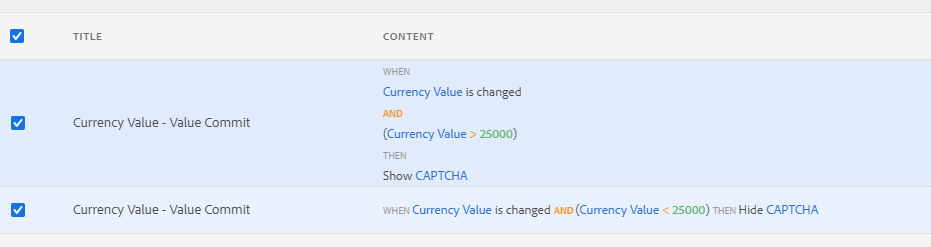

# 적응형 양식에서 CAPTCHA 사용{#using-captcha-in-adaptive-forms}

| 버전 | 문서 링크 |
| -------- | ---------------------------- |
| AEM as a Cloud Service | [여기 클릭](https://experienceleague.adobe.com/docs/experience-manager-cloud-service/content/forms/adaptive-forms-authoring/authoring-adaptive-forms-foundation-components/add-components-to-an-adaptive-form/captcha-adaptive-forms.html?lang=ko) |
| AEM 6.5 | 이 문서 |


<span class="preview"> [새 적응형 양식 만들기](/help/forms/using/create-an-adaptive-form-core-components.md) 또는 [AEM Sites 페이지에 적응형 양식 추가](/help/forms/using/create-or-add-an-adaptive-form-to-aem-sites-page.md) 작업을 할 때 현대적이고 확장 가능한 데이터 캡처 [핵심 구성 요소](https://experienceleague.adobe.com/docs/experience-manager-core-components/using/adaptive-forms/introduction.html?lang=ko)를 사용하는 것이 좋습니다. 이러한 구성 요소는 적응형 양식 만들기 작업이 대폭 개선되어 우수한 사용자 경험을 보장할 수 있게 되었음을 나타냅니다. 이 문서에서는 기초 구성 요소를 사용하여 적응형 양식을 작성하는 이전 접근법에 대해 설명합니다. </span>

CAPTCHA(컴퓨터와 인간을 구분하기 위해 완전히 자동화된 공공 튜링 테스트)는 인간과 자동화된 프로그램 또는 봇을 구별하기 위해 온라인 거래에서 일반적으로 사용되는 프로그램입니다. 문제를 제기하고 사용자 응답을 평가하여 사이트와 상호 작용하는 것이 인간인지 봇인지 판단합니다. 테스트가 실패할 경우 사용자가 진행하지 못하도록 차단하고 봇이 스팸을 게시하거나 악의적인 목적으로 상호 작용하는 것을 방지하여 온라인 거래를 안전하게 할 수 있도록 도와줍니다.

AEM Forms은 적응형 양식에서 CAPTCHA를 지원합니다. Google의 reCAPTCHA 서비스를 사용하여 CAPTCHA를 구현할 수 있습니다.

>[!NOTE]
>
>* AEM Forms은 reCAPTCHA v2 및 enterprise를 지원합니다. 다른 버전은 지원되지 않습니다.
>* 적응형 양식의 CAPTCHA는 AEM Forms 앱의 오프라인 모드에서 지원되지 않습니다.

## 적응형 Forms을 위한 Google의 reCAPTCHA 서비스 구성 {#google-reCAPTCHA}

AEM Forms 사용자는 Google의 reCAPTCHA 서비스를 사용하여 적응형 양식에서 CAPTCHA를 구현할 수 있습니다. 사이트를 보호하기 위한 고급 CAPTCHA 기능을 제공합니다. reCAPTCHA 작동 방식에 대한 자세한 내용은 [Google reCAPTCHA](https://developers.google.com/recaptcha/)을(를) 참조하십시오. reCAPTCHA v2 및 reCAPTCHA Enterprise를 포함하는 reCAPTCHA 서비스는 AEM Forms에 통합됩니다. 요구 사항에 따라 reCAPTCHA 서비스를 구성하여 다음을 활성화할 수 있습니다.

* [AEM Forms의 reCAPTCHA Enterprise](#steps-to-implement-reCAPTCHA-enterprise-in-forms)
* [AEM Forms의 reCAPTCHA v2](#steps-to-implement-reCAPTCHA-v2-in-forms)


### reCAPTCHA Enterprise 구성  {#steps-to-implement-reCAPTCHA-enterprise-in-forms}

1. [reCAPTCHA Enterprise API](https://cloud.google.com/recaptcha-enterprise/docs/set-up-non-google-cloud-environments-api-keys#enable-the-recaptcha-enterprise-api)을(를) 사용하여 [reCAPTCHA Enterprise 프로젝트](https://cloud.google.com/recaptcha-enterprise/docs/set-up-non-google-cloud-environments-api-keys#before-you-begin)을(를) 만듭니다.
1. 프로젝트 ID를 [획득](https://support.google.com/googleapi/answer/7014113?hl=en#:~:text=To%20locate%20your%20project%20ID,a%20member%20of%20are%20displayed)합니다.
1. 웹 사이트에 대한 [API 키](https://cloud.google.com/recaptcha-enterprise/docs/set-up-non-google-cloud-environments-api-keys#create_an_api_key) 및 [사이트 키](https://cloud.google.com/recaptcha-enterprise/docs/create-key#create-key)를 만듭니다.
1. 클라우드 서비스에 대한 구성 컨테이너를 만듭니다.

   1. **[!UICONTROL 도구 > 일반 > 구성 브라우저로 이동합니다]**. 자세한 내용은 [구성 브라우저](/help/sites-administering/configurations.md) 설명서를 참조하십시오.
   1. 클라우드 구성에 대한 전역 폴더를 활성화하려면 다음을 수행하거나 클라우드 서비스 구성에 대한 다른 폴더를 만들고 구성하려면 이 단계를 건너뜁니다.
      1. 구성 브라우저에서 **[!UICONTROL 전역]** 폴더를 선택한 다음 **[!UICONTROL 속성]**&#x200B;을 선택합니다.
      1. 구성 속성 대화 상자에서 **[!UICONTROL 클라우드 구성]**&#x200B;을 사용하도록 설정합니다.
      1. 구성을 저장하고 대화 상자를 종료하려면 **[!UICONTROL 저장 및 닫기]**&#x200B;를 선택하십시오.

   1. 구성 브라우저에서 **[!UICONTROL 만들기]**&#x200B;를 선택합니다.
   1. 구성 만들기 대화 상자에서 폴더의 제목을 지정하고 **[!UICONTROL 클라우드 구성]**&#x200B;을 사용하도록 설정합니다.
   1. 클라우드 서비스 구성에 사용할 수 있는 폴더를 만들려면 **[!UICONTROL 만들기]**&#x200B;를 선택하십시오.
1. reCAPTCHA Enterprise용 클라우드 서비스를 구성합니다.

   1. Experience Manager 작성자 인스턴스에서  > **[!UICONTROL Cloud Service]**(으)로 이동합니다.
   1. **[!UICONTROL reCAPTCHA]**&#x200B;을(를) 선택합니다. Configurations 페이지가 열립니다. 이전 단계에서 만든 구성 컨테이너를 선택하고 **[!UICONTROL 만들기]**&#x200B;를 선택합니다.
   1. 버전을 reCAPTCHA Enterprise로 선택하고 이름, 즉 reCAPTCHA Enterprise 서비스에 대한 프로젝트 ID, 사이트 키 및 API 키(2단계 및 3단계에서 획득)를 지정합니다.
   1. 키 유형을 선택하십시오. 키 유형은 Google Cloud 프로젝트에 구성된 사이트 키(예: **확인란 사이트 키** 또는 **점수 기반 사이트 키**)와 동일해야 합니다.
   1. 0-1 범위의 임계값 점수를 지정하십시오([점수에 대해 자세히 알아보려면 클릭](https://cloud.google.com/recaptcha-enterprise/docs/interpret-assessment#interpret_scores)). 임계값 점수보다 크거나 같은 점수는 인간 상호 작용을 식별하고, 그렇지 않으면 봇 상호 작용으로 간주됩니다.

      > 메모:
      >
      > * 양식 작성자는 중단 없는 양식 제출에 적합한 범위의 점수를 지정할 수 있습니다.

   1. 클라우드 서비스 구성을 만들려면 **[!UICONTROL 만들기]**&#x200B;를 선택하십시오.

   1. 구성 요소 편집 대화 상자에서 이름, 프로젝트 ID, 사이트 키, API 키(2단계 및 3단계에서 획득)를 지정하고 키 유형을 선택한 다음 임계값 점수를 입력합니다. **[!UICONTROL 설정 저장]**&#x200B;을 선택한 다음 **[!UICONTROL 확인]**&#x200B;을 선택하여 구성을 완료합니다.

reCAPTCHA Enterprise 서비스가 활성화되면 적응형 양식에서 사용할 수 있습니다. [적응형 양식에서 CAPTCHA 사용](#using-reCAPTCHA)을 참조하세요.


### Google reCAPTCHA v2 구성 {#steps-to-implement-reCAPTCHA-v2-in-forms}

1. Google에서 [reCAPTCHA API 키 쌍](https://www.google.com/recaptcha/admin)을(를) 가져옵니다. 여기에는 **사이트 키** 및 **암호 키**&#x200B;가 포함됩니다.
1. 클라우드 서비스에 대한 구성 컨테이너를 만듭니다.
   1. **[!UICONTROL 도구 > 일반 > 구성 브라우저로 이동합니다]**. 자세한 내용은 [구성 브라우저](/help/sites-administering/configurations.md) 설명서를 참조하십시오.
   1. 클라우드 구성에 대한 전역 폴더를 활성화하려면 다음을 수행하거나 클라우드 서비스 구성에 대한 다른 폴더를 만들고 구성하려면 이 단계를 건너뜁니다.

      1. 구성 브라우저에서 **[!UICONTROL 전역]** 폴더를 선택한 다음 **[!UICONTROL 속성]**&#x200B;을 선택합니다.

      1. 구성 속성 대화 상자에서 **[!UICONTROL 클라우드 구성]**&#x200B;을 사용하도록 설정합니다.
      1. 구성을 저장하고 대화 상자를 종료하려면 **[!UICONTROL 저장 및 닫기]**&#x200B;를 선택하십시오.

   1. 구성 브라우저에서 **[!UICONTROL 만들기]**&#x200B;를 선택합니다.
   1. 구성 만들기 대화 상자에서 폴더의 제목을 지정하고 **[!UICONTROL 클라우드 구성]**&#x200B;을 사용하도록 설정합니다.
   1. 클라우드 서비스 구성에 사용할 수 있는 폴더를 만들려면 **[!UICONTROL 만들기]**&#x200B;를 선택하십시오.

1. reCAPTCHA v2에 대한 클라우드 서비스를 구성합니다.

   1. AEM 작성자 인스턴스에서  > **Cloud Service**(으)로 이동합니다.
   1. **[!UICONTROL reCAPTCHA]**&#x200B;을(를) 선택합니다. Configurations 페이지가 열립니다. 이전 단계에서 만든 구성 컨테이너를 선택하고 **[!UICONTROL 만들기]**&#x200B;를 선택합니다.
   1. 버전을 reCAPTCHA v2로 선택하고 이름, 사이트 키 및 reCAPTCHA 서비스에 대한 비밀 키(1단계에서 획득)를 지정한 다음 **[!UICONTROL 만들기]**&#x200B;를 선택하여 클라우드 서비스 구성을 만듭니다.
   1. 구성 요소 편집 대화 상자에서 1단계에서 얻은 사이트 및 비밀 키를 지정합니다. **[!UICONTROL 설정 저장]**&#x200B;을 선택한 다음 **확인**&#x200B;을 선택하여 구성을 완료합니다.

   reCAPTCHA 서비스가 구성되면 적응형 양식에서 사용할 수 있습니다. 자세한 내용은 [적응형 양식에서 CAPTCHA 사용](#using-captcha)을 참조하세요.


## 적응형 양식에서 reCAPTCHA 사용 {#using-reCAPTCHA}

적응형 양식에서 reCAPTCHA를 사용하려면:

1. 편집 모드에서 적응형 양식을 엽니다.

   >[!NOTE]
   >
   >적응형 양식을 만들 때 선택한 구성 컨테이너에 reCAPTCHA 클라우드 서비스가 포함되어 있는지 확인합니다. 적응형 양식 속성을 편집하여 양식과 관련된 구성 컨테이너를 변경할 수도 있습니다.

1. 구성 요소 브라우저에서 **Captcha** 구성 요소를 적응형 양식으로 드래그 앤 드롭합니다.

   >[!NOTE]
   >
   >적응형 양식에서 Captcha 구성 요소를 두 개 이상 사용하는 것은 지원되지 않습니다. 또한 소극적 로드로 표시된 패널 또는 조각에서는 CAPTCHA를 사용하지 않는 것이 좋습니다.

   >[!NOTE]
   >
   >Captcha는 시간에 민감하며 약 1분 후에 만료됩니다. 따라서 적응형 양식에서 Captcha 구성 요소를 제출 단추 바로 앞에 배치하는 것이 좋습니다.

1. 추가한 Captcha 구성 요소를 선택하고 을(를) 선택하여 해당 속성을 편집합니다.
1. CAPTCHA 위젯의 제목을 지정합니다. 기본값은 **Captcha**&#x200B;입니다. 제목을 표시하지 않으려면 **제목 숨기기**&#x200B;를 선택하십시오.
1. Google의 [reCAPTCHA 서비스](#google-reCAPTCHA)에 설명된 대로 구성한 경우 **Captcha 서비스** 드롭다운에서 **reCAPTCHA**&#x200B;을(를) 선택하여 reCAPTCHA 서비스를 활성화하십시오.
1. 설정 드롭다운에서 구성을 선택합니다.
1. **선택한 구성의 버전이 reCAPTCHA Enterprise인 경우**:
   1. **키 유형**&#x200B;을(를) **확인란**(으)로 사용하는 reCAPTCHA 클라우드 구성을 선택할 수 있습니다. 확인란 키에 사용자 지정된 오류 메시지가 captcha 유효성 검사에 실패하면 인라인 메시지로 표시됩니다. 크기를 **[!UICONTROL 보통]** 및 **[!UICONTROL 작게]**&#x200B;로 선택할 수 있습니다.
   1. **키 유형**&#x200B;을(를) 사용하는 reCAPTCHA 클라우드 구성을 **점수 기반**(으)로 선택할 수 있습니다. 점수 기반 키에서 사용자 지정된 오류 메시지는 captcha 유효성 검사가 실패하면 팝업 메시지로 표시됩니다.
   1. **[!UICONTROL 바인드 참조]**&#x200B;를 선택하면 제출된 데이터는 바인딩된 데이터이고 그렇지 않으면 바인딩되지 않은 데이터입니다. 다음은 양식 제출 시 바인딩되지 않은 데이터와 바인딩된 데이터(바인드 참조를 SSN으로 사용)의 XML 예입니다.

      ```xml
          <?xml version="1.0" encoding="UTF-8" standalone="no"?>
          <afData>
          <afUnboundData>
              <data>
                  <captcha16820607953761>
                      <captchaType>reCAPTCHAEnterprise</captchaType>
                      <captchaScore>0.9</captchaScore>
                  </captcha16820607953761>
              </data>
          </afUnboundData>
          <afBoundData>
              <Root
                  xmlns:xfa="http://www.xfa.org/schema/xfa-data/1.0/"
                  xmlns:xsi="http://www.w3.org/2001/XMLSchema-instance">
                  <PersonalDetails>
                      <SSN>371237912</SSN>
                      <FirstName>Sarah </FirstName>
                      <LastName>Smith</LastName>
                  </PersonalDetails>
                  <OtherInfo>
                      <City>California</City>
                      <Address>54 Residency</Address>
                      <State>USA</State>
                      <Zip>123112</Zip>
                  </OtherInfo>
              </Root>
          </afBoundData>
          <afSubmissionInfo>
              <stateOverrides/>
              <signers/>
              <afPath>/content/dam/formsanddocuments/captcha-form</afPath>
              <afSubmissionTime>20230608034928</afSubmissionTime>
          </afSubmissionInfo>
          </afData>
      ```


      ```xml
          <?xml version="1.0" encoding="UTF-8" standalone="no"?>
          <afData>
          <afUnboundData>
              <data/>
          </afUnboundData>
          <afBoundData>
              <Root
                  xmlns:xfa="http://www.xfa.org/schema/xfa-data/1.0/"
                  xmlns:xsi="http://www.w3.org/2001/XMLSchema-instance">
                  <PersonalDetails>
                      <SSN>
                          <captchaType>reCAPTCHAEnterprise</captchaType>
                          <captchaScore>0.9</captchaScore>
                      </SSN>
                      <FirstName>Sarah</FirstName>
                      <LastName>Smith</LastName>
                  </PersonalDetails>
                  <OtherInfo>
                      <City>California</City>
                      <Address>54 Residency</Address>
                      <State>USA</State>
                      <Zip>123112</Zip>
                  </OtherInfo>
              </Root>
          </afBoundData>
          <afSubmissionInfo>
              <stateOverrides/>
              <signers/>
              <afPath>/content/dam/formsanddocuments/captcha-form</afPath>
              <afSubmissionTime>20230608035111</afSubmissionTime>
          </afSubmissionInfo>
          </afData>
      ```


   **선택한 구성의 버전이 reCAPTCHA v2인 경우**:
   1. reCAPTCHA 위젯의 크기를 **[!UICONTROL 보통]** 또는 **[!UICONTROL 작게]**(으)로 선택합니다. 의심스러운 활동이 있는 경우에만 **[!UICONTROL 보이지 않음]** 옵션을 선택하여 CAPTCHA 문제를 표시할 수도 있습니다. 아래에 표시된 **reCAPTCHA로 보호** 배지가 보호된 양식에 표시됩니다.

      


   reCAPTCHA 서비스가 적응형 양식에서 활성화됩니다. 양식을 미리 보고 CAPTCHA가 작동하는 것을 볼 수 있습니다.

1. 속성을 저장합니다.

>[!NOTE]
> 
> 기본 AEM CAPTCHA 서비스가 더 이상 사용되지 않으므로 CAPTCHA 서비스 드롭다운에서 **[!UICONTROL Default]**&#x200B;을(를) 선택하지 마십시오.

### 규칙에 따라 CAPTCHA 구성 요소 표시 또는 숨기기 {#show-hide-captcha}

적응형 양식의 구성 요소에 적용하는 규칙에 따라 CAPTCHA 구성 요소를 표시하거나 숨기도록 선택할 수 있습니다. 구성 요소를 선택하고 을 선택한 다음 **[!UICONTROL 만들기]**&#x200B;를 선택하여 규칙을 만듭니다. 규칙 만들기에 대한 자세한 내용은 [규칙 편집기](rule-editor.md)를 참조하십시오.

예를 들어 CAPTCHA 구성 요소는 양식의 통화 값 필드에 25000보다 큰 값이 있는 경우에만 적응형 양식에 표시해야 합니다.

양식에서 **[!UICONTROL 통화 값]** 필드를 선택하고 다음 규칙을 만듭니다.



>[!NOTE]
>
> * 크기가 **[!UICONTROL 보이지 않음]** 또는 reCAPTCHA Enterprise 점수 기반 키인 reCAPTCHA v2 구성을 선택하는 경우 표시/숨기기 옵션을 적용할 수 없습니다.

### CAPTCHA 유효성 검사 {#validate-captcha}

양식을 제출하거나 사용자 작업 및 조건에 대한 CAPTCHA 유효성 검사의 기초가 될 때 적응형 양식에서 CAPTCHA의 유효성을 검사할 수 있습니다.

#### 양식 제출 시 CAPTCHA 유효성 검사 {#validation-form-submission}

적응형 양식을 제출할 때 CAPTCHA의 유효성을 자동으로 검사하려면 다음 작업을 수행하십시오.

1. CAPTCHA 구성 요소를 선택하고 을(를) 선택하여 구성 요소 속성을 확인합니다.
1. **[!UICONTROL CAPTCHA 유효성 검사]** 섹션에서 **[!UICONTROL 양식 제출로 CAPTCHA 유효성 검사]**&#x200B;를 선택합니다.
1. 구성 요소 속성을 저장하려면 를 선택하십시오.

#### 사용자 작업 및 조건에 대한 CAPTCHA 유효성 검사 {#validate-captcha-user-action}

조건 및 사용자 작업을 기반으로 CAPTCHA의 유효성을 검사하려면 다음을 수행하십시오.

1. CAPTCHA 구성 요소를 선택하고 을(를) 선택하여 구성 요소 속성을 확인합니다.
1. **[!UICONTROL CAPTCHA 유효성 검사]** 섹션에서 **[!UICONTROL 사용자 작업에 대한 CAPTCHA 유효성 검사]**&#x200B;를 선택합니다.
1. 구성 요소 속성을 저장하려면 를 선택하십시오.

   >[!NOTE]
   >
   >
   > 크기가 **[!UICONTROL 보이지 않음]** 또는 reCAPTCHA Enterprise 점수 기반 키인 reCAPTCHA v2 구성을 선택하는 경우 사용자 작업에 유효한 Captcha를 적용할 수 없습니다.

[!DNL Experience Manager Forms]은(는) 사전 정의된 조건을 사용하여 CAPTCHA의 유효성을 검사하는 `ValidateCAPTCHA` API를 제공합니다. 사용자 지정 제출 액션을 사용하거나 적응형 양식의 구성 요소에 대한 규칙을 정의하여 API를 호출할 수 있습니다.

다음은 사전 정의된 조건을 사용하여 CAPTCHA의 유효성을 검사하기 위한 `ValidateCAPTCHA` API의 예입니다.

```javascript
if (slingRequest.getParameter("numericbox1614079614831").length() >= 5) {
        GuideCaptchaValidatorProvider apiProvider = sling.getService(GuideCaptchaValidatorProvider.class);
        String formPath = slingRequest.getResource().getPath();
        String captchaData = slingRequest.getParameter(GuideConstants.GUIDE_CAPTCHA_DATA);
        if (!apiProvider.validateCAPTCHA(formPath, captchaData).isCaptchaValid()){
            response.setStatus(400);
            return;
        }
    }
```

이 예제는 양식을 채우는 동안 사용자가 지정한 숫자 상자의 자릿수가 5보다 큰 경우에만 `ValidateCAPTCHA` API가 양식의 CAPTCHA를 확인함을 의미합니다.

**옵션 1: [!DNL Experience Manager Forms] ValidateCAPTCHA API를 사용하여 사용자 지정 제출 액션을 사용하여 CAPTCHA의 유효성을 검사합니다**

사용자 지정 제출 액션을 사용하여 `ValidateCAPTCHA` API를 사용하여 CAPTCHA의 유효성을 검사하려면 다음 단계를 수행하십시오.

1. 사용자 지정 제출 액션에 `ValidateCAPTCHA` API를 포함하는 스크립트를 추가합니다. 사용자 지정 제출 액션에 대한 자세한 내용은 [적응형 Forms에 대한 사용자 지정 제출 액션 만들기](custom-submit-action-form.md)를 참조하십시오.
1. 적응형 양식의 **[!UICONTROL 제출]** 속성에 있는 **[!UICONTROL 제출 액션]** 드롭다운 목록에서 사용자 지정 제출 액션의 이름을 선택합니다.
1. **[!UICONTROL 제출]**&#x200B;을 선택합니다. 사용자 지정 제출 액션의 `ValidateCAPTCHA` API에 정의된 조건을 기반으로 CAPTCHA의 유효성을 검사합니다.

**옵션 2: 양식을 제출하기 전에 사용자 작업에서 [!DNL Experience Manager Forms] ValidateCAPTCHA API를 사용하여 CAPTCHA의 유효성을 검사하십시오**

적응형 양식의 구성 요소에 규칙을 적용하여 `ValidateCAPTCHA` API를 호출할 수도 있습니다.

예를 들어 적응형 양식에 **[!UICONTROL CAPTCHA 유효성 검사]** 단추를 추가하고 단추 클릭 시 서비스를 호출하는 규칙을 만듭니다.

다음 그림은 **[!UICONTROL CAPTCHA 유효성 검사]** 단추를 클릭할 때 서비스를 호출하는 방법을 보여 줍니다.


규칙 편집기를 사용하여 `ValidateCAPTCHA` API를 포함하는 사용자 지정 서블릿을 호출하고 유효성 검사 결과에 따라 적응형 양식의 제출 단추를 활성화하거나 비활성화할 수 있습니다.

마찬가지로 규칙 편집기를 사용하여 적응형 양식에서 CAPTCHA의 유효성을 검사하는 사용자 지정 방법을 포함할 수 있습니다.

<!--
### Add custom CAPTCHA services {#add-custom-captcha-service}

[!DNL Experience Manager Forms] provides reCAPTCHA as the CAPTCHA service. However, you can add a custom service to display in the **[!UICONTROL CAPTCHA Service]** drop-down list.  

The following is a sample implementation of the interface to add additional CAPTCHA service to your Adaptive Form:

```javascript
package com.adobe.aemds.guide.service;

import org.osgi.annotation.versioning.ConsumerType;

/**
 * An interface to provide captcha validation at server side in Adaptive Form
 * This interface can be used to provide custom implementation for different captcha services.
 */
@ConsumerType
public interface GuideCaptchaValidator {
    /**
     * This method should define the actual validation logic of the captcha
     * @param captchaPropertyNodePath path to the node with CAPTCHA configurations inside form container
     * @param userResponseToken  The user response token provided by the CAPTCHA from client-side
     *
     * @return  {@link GuideCaptchaValidationResult} validation result of the captcha
     */
     GuideCaptchaValidationResult validateCaptcha(String captchaPropertyNodePath, String userResponseToken);

    /**
     * Returns the name of the captcha validator. This should be unique among the different implementations
     * @return  name of the captcha validator
     */
     String getCaptchaValidatorName();
}
```

`captchaPropertyNodePath` Refers to the resource path of the CAPTCHA component in the Sling repository. Use this property to include details specific to the CAPTCHA component. For example, `captchaPropertyNodePath` includes information for the reCAPTCHA cloud configuration configured on the CAPTCHA component. The cloud configuration information provides **[!UICONTROL Site Key]** and **[!UICONTROL Secret Key]** settings for implementing the reCAPTCHA service.

`userResponseToken` Refers to the `g_reCAPTCHA_response` that gets generated after solving a CAPTCHA in a form. -->
