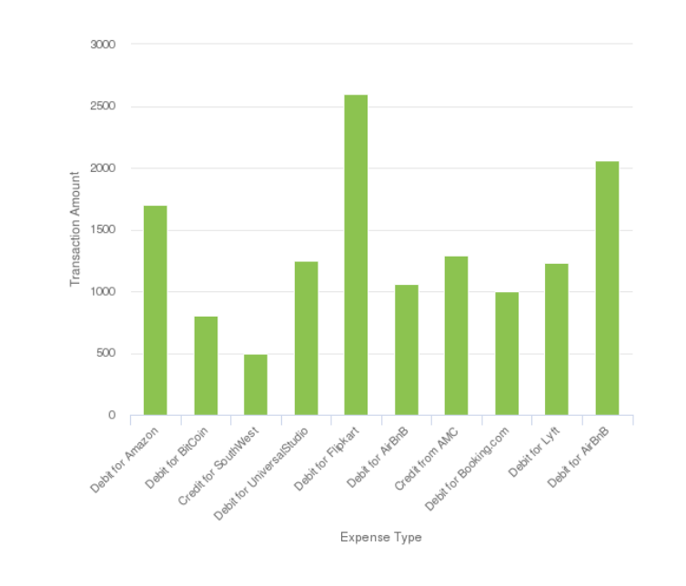

# 대화형 커뮤니케이션에서 차트 사용{#using-charts-in-interactive-communications}

차트 또는 그래프는 데이터를 시각적으로 표현한 것입니다. 많은 양의 정보를 이해하기 쉬운 시각적 형식으로 압축하여 대화형 커뮤니케이션의 수신자가 복잡한 데이터를 더 잘 시각화, 해석 및 분석할 수 있도록 합니다.

대화형 통신을 만드는 동안 대화형 통신의 양식 데이터 모델에서 2차원 데이터를 시각적으로 나타내는 차트를 추가할 수 있습니다. 차트 구성 요소를 사용하여 원형, 열, 도넛, 막대, 선, 선 및 점, 점, 영역 및 사분면 유형의 차트를 추가하고 구성할 수 있습니다.

## 대화형 통신에서 차트 추가 및 구성 {#add-and-configure-chart-in-an-interactive-communication}

대화형 통신에서 차트를 추가하고 구성하려면 다음 단계를 수행하십시오.

1. 누르기 **구성 요소** 인터랙티브 커뮤니케이션의 사이드 킥에서.
1. 을(를) 끌어다 놓습니다. **차트** 구성 요소를 다음 구성 요소 중 하나로 만듭니다.

   * 인쇄 채널: 대상 영역 또는 이미지 필드
   * 웹 채널: 패널 또는 대상 영역

1. 대화형 통신 편집기에서 차트 구성 요소를 탭하고 을 선택합니다. **[!UICONTROL 구성 (]** )을 클릭하여 제품에서 사용할 수 있습니다.

   차트 등록 정보는 왼쪽 창에 표시됩니다.

   

   인쇄 채널에서 선 유형 차트의 기본 속성

   

   웹 채널에서 선 유형 차트의 기본 속성

1. 구성 [차트 등록 정보](../../forms/using/chart-component-interactive-communications.md#configure-chart-properties) 채널 유형을 기반으로 합니다.
1. (인쇄 채널만) **[!UICONTROL 에이전트 설정]**&#x200B;이 차트를 사용하기 위해 에이전트가 필요한지 여부를 지정합니다. 다음과 같은 경우 **[!UICONTROL 이 차트를 사용하려면 에이전트가 필요합니다.]** 옵션이 선택되어 있지 않으면 에이전트는 차트의 눈 모양 아이콘을 **[!UICONTROL 콘텐츠]** 차트를 표시하거나 숨길 수 있는 에이전트 UI의 탭입니다.

   

1. 누르기  차트 등록 정보를 저장합니다.

   누르기 **[!UICONTROL 미리 보기]** 을 클릭하여 차트와 연결된 모양과 데이터를 봅니다. 누르기 **[!UICONTROL 편집]** 을 클릭하여 차트의 속성을 다시 구성합니다.

## 차트 등록 정보 구성 {#configure-chart-properties}

인쇄 및 웹 채널용 차트를 만드는 동안 다음 속성을 구성합니다.

<table>
 <tbody>
  <tr>
   <td>필드</td>
   <td>설명</td>
   <td>채널 유형</td>
  </tr>
  <tr>
   <td>이름</td>
   <td>차트 요소에 대한 식별자. 이 필드에 지정된 차트 이름은 차트에 표시되지 않습니다. 다른 구성 요소, 스크립트 및 SOM 표현식의 요소를 참조할 때 사용됩니다.</td>
   <td>인쇄 및 웹</td>
  </tr>
  <tr>
   <td>차트 유형</td>
   <td>생성하려는 차트의 유형입니다. 사용 가능한 옵션은 원형, 열, 도넛, 막대, 선, 선 및 점, 점 및 영역입니다.</td>
   <td>인쇄 및 웹</td>
  </tr>
  <tr>
   <td>시리즈 &gt; 다중 시리즈</td>
   <td>X축 및 Y축에 표시되는 양식 데이터 모델 컬렉션 항목에 대해 여러 시리즈를 추가하려면 선택합니다.</td>
   <td>인쇄 및 웹</td>
  </tr>
  <tr>
   <td>시리즈 &gt; 데이터 모델 개체</td>
   <td>차트에 여러 계열을 추가할 양식 데이터 모델 컬렉션 항목의 이름입니다.<br /> 의미 있는 계열을 만들려면 X축 및 Y축에 표시되는 속성에 대한 상위 양식 데이터 모델 개체 속성을 선택하십시오. 바인딩하는 데이터 모델 개체는 숫자, 문자열 또는 날짜 유형이어야 합니다.</td>
   <td>인쇄 및 웹</td>
  </tr>
  <tr>
   <td>겹쳐서 표시</td>
   <td>각 시리즈의 값을 차례대로 겹치도록 선택하십시오.</td>
   <td>인쇄 및 웹</td>
  </tr>
  <tr>
   <td>X축 &gt; 제목</td>
   <td>X축 제목</td>
   <td>인쇄 및 웹</td>
  </tr>
  <tr>
   <td>X축 &gt; 데이터 모델 개체</td>
   <td><p>X축에 표시되는 양식 데이터 모델 컬렉션 항목의 이름입니다.</p> <p>동일한 상위 데이터 모델 개체의 컬렉션/배열 유형 속성 두 개를 선택합니다. 이 두 속성은 차트의 X축과 Y축에 서로 관련하여 의미가 있습니다. 바인딩하는 데이터 모델 개체는 숫자, 문자열 또는 날짜 유형이어야 합니다.</p> </td>
   <td>인쇄 및 웹</td>
  </tr>
  <tr>
   <td>Y축 &gt; 제목</td>
   <td>Y축 제목 </td>
   <td>인쇄 및 웹</td>
  </tr>
  <tr>
   <td>Y축 &gt; 데이터 모델 개체</td>
   <td><p>Y축에 표시되는 양식 데이터 모델 컬렉션 항목입니다. 인쇄 채널에서 Y축의 데이터 모델 개체는 숫자 유형이어야 합니다.</p> <p>동일한 상위 데이터 모델 개체의 컬렉션/배열 유형 속성 두 개를 선택합니다. 이 두 속성은 차트의 X축과 Y축에 서로 관련하여 의미가 있습니다. </p> </td>
   <td>인쇄 및 웹</td>
  </tr>
  <tr>
   <td>Y축 &gt; 함수</td>
   <td>y축의 값을 계산하는 데 사용할 통계/사용자 지정 함수입니다.</td>
   <td>인쇄 및 웹</td>
  </tr>
  <tr>
   <td>개체 숨기기</td>
   <td>최종 출력에서 차트를 숨기려면 선택합니다.</td>
   <td>인쇄 및 웹</td>
  </tr>
  <tr>
   <td>제목</td>
   <td>차트의 제목입니다. </td>
   <td>인쇄</td>
  </tr>
  <tr>
   <td>높이</td>
   <td>차트의 픽셀 단위 높이입니다.</td>
   <td>인쇄</td>
  </tr>
  <tr>
   <td>너비</td>
   <td>차트의 픽셀 단위 폭입니다. 스타일 레이어를 사용하거나 테마를 적용하여 웹 채널에서 차트의 너비를 제어할 수 있습니다.</td>
   <td>인쇄</td>
  </tr>
  <tr>
   <td>다음 항목 앞에 필수 페이지 나누기</td>
   <td>차트 앞에 필수 페이지 나누기를 추가하고 차트를 새 페이지의 맨 위에 두려면 선택합니다. </td>
   <td>인쇄</td>
  </tr>
  <tr>
   <td>다음 항목 뒤에 필수 페이지 나누기</td>
   <td>을(를) 선택하여 차트 뒤에 필수 페이지 구분을 추가하고 차트 다음에 오는 콘텐츠를 새 페이지 맨 위에 추가합니다. </td>
   <td>인쇄</td>
  </tr>
  <tr>
   <td>들여쓰기</td>
   <td>페이지 왼쪽에서 차트 들여쓰기. </td>
   <td>인쇄</td>
  </tr>
  <tr>
   <td>툴팁</td>
   <td><p>웹 채널에서 차트의 데이터 포인트 위에 있는 마우스오버에 툴팁이 표시되는 형식입니다. 기본값은 $ 입니다.{x}(${y}). 차트 유형에 따라 차트에서 마우스가 한 지점, 막대 또는 슬라이스를 가리키면 변수가 ${x}및 ${y} 은 X축 및 Y축의 해당 값으로 동적으로 대체되고 도구 설명에 표시됩니다.</p> <p>도구 설명을 비활성화하려면 <span class="uicontrol">툴팁</code> 필드가 비어 있습니다. 이 옵션은 선 및 영역 차트에 적용할 수 없습니다. 예를 들어 다음을 참조하십시오. <a href="#chartoutputprintweb">예제 1: 인쇄 및 웹의 차트 출력</a>.</p> </td>
   <td>웹</td>
  </tr>
  <tr>
   <td>차트별 구성</td>
   <td><p>일반적인 구성 외에도 다음과 같은 차트별 구성을 사용할 수 있습니다.</p>
    <ul>
     <li><strong>범례 표시: </strong>활성화되면 파이 또는 도넛 차트에 대한 범례를 표시합니다.</li>
     <li><strong>범례 위치: </strong>차트와 관련된 범례의 위치를 지정합니다. 사용 가능한 옵션은 오른쪽, 왼쪽, 위쪽 및 아래입니다. 인쇄 채널에서 오른쪽 범례를 사용하는 것이 좋습니다.</li>
     <li><strong>내측 반경</strong>: 도넛 차트에서 차트에 있는 내부 원의 반경(픽셀 단위)을 지정할 수 있습니다.</li>
     <li><strong>선 색상</strong>: 선, 선 및 점, 영역 차트에 사용할 수 있으며 차트에서 선의 색상을 지정합니다.</li>
     <li><strong>점 색상</strong>: 점, 선 및 점 차트에서 차트의 점 색상을 지정할 수 있습니다.<br /> </li>
     <li><strong>영역 색상</strong>: 영역 차트에 사용할 수 있으며 차트의 선 아래에 있는 영역의 색상을 지정합니다.</li>
     <li><strong>참조점 &gt; 바인딩 유형: </strong>Quadrant 차트에서 사용 가능<strong> </strong>참조점의 바인딩 형식을 지정합니다. 정적 텍스트 또는 데이터 모델 개체 속성을 사용하여 참조점의 값을 정의합니다.</li>
     <li><strong>참조점 &gt; X축: </strong>다음을 선택하는 경우 Quadrant 차트에 사용 가능 <span class="uicontrol">정적</code> 참조 점의 X축 값을 지정할 수 있는 바인딩 유형 드롭다운 목록</li>
     <li><strong>참조점 &gt; Y축: </strong>다음을 선택하는 경우 Quadrant 차트에 사용 가능 <span class="uicontrol">정적</code> 참조 점의 Y축 값을 지정할 수 있는 바인딩 유형 드롭다운 목록</li>
     <li><strong>참조점 &gt; 시리즈의 데이터 모델 개체: </strong>다음을 선택하는 경우 여러 시리즈 Quadrant 차트에 사용 가능 <span class="uicontrol">데이터 모델 개체</code> 바인딩 유형 드롭다운 목록. 참조점의 시리즈를 식별하려면 양식 데이터 모델 개체 속성을 정의하십시오. </li>
     <li><strong>참조점 &gt; 시리즈의 데이터 모델 개체 값: </strong>다음을 선택하는 경우 여러 시리즈 Quadrant 차트에 사용 가능 <span class="uicontrol">데이터 모델 개체</code> 바인딩 유형 드롭다운 목록. 시리즈의 양식 데이터 모델 개체 속성 및 이 필드에 정의된 값을 사용하여 참조점의 시리즈를 식별합니다.</li>
     <li><strong>참조점 &gt; 참조점의 데이터 모델 개체: </strong>다음을 선택하는 경우 Quadrant 차트에 사용 가능 <span class="uicontrol">데이터 모델 개체</code> 바인딩 유형 드롭다운 목록. X축 및 Y축에 표시되는 속성과 동일한 양식 데이터 모델 개체 속성을 정의합니다. 또한 여러 시리즈의 경우 시리즈에 대해 정의된 데이터 모델 개체 속성의 하위 항목인 데이터 모델 개체 속성을 정의합니다.</li>
     <li><strong>참조점 &gt; 참조점의 데이터 모델 개체 값: </strong>다음을 선택하는 경우 Quadrant 차트에 사용 가능 <span class="uicontrol">데이터 모델 개체</code> 바인딩 유형 드롭다운 목록. 참조점에 대한 양식 데이터 모델 개체 등록 정보와 이 필드에 정의된 값을 사용하여 차트의 참조점을 식별합니다.<br /> <strong>사분면 레이블 &gt; 왼쪽 위:</strong> Quadrant 차트에서 왼쪽 위 사분면에 대한 이름을 지정할 수 있습니다.</li>
     <li><strong>Quadrant Labels &gt; 오른쪽 위:</strong> Quadrant 차트에서 오른쪽 위 사분면에 대한 이름을 지정할 수 있습니다.</li>
     <li><strong>사분면 레이블 &gt; 오른쪽 아래: </strong>Quadrant 차트에서 오른쪽 아래 사분면에 대한 이름을 지정할 수 있습니다.</li>
     <li><strong>사분면 레이블 &gt; 왼쪽 아래: </strong>Quadrant 차트에서 왼쪽 아래 사분면에 대한 이름을 지정할 수 있습니다.</li>
    </ul> </td>
   <td>인쇄 및 웹</td>
  </tr>
 </tbody>
</table>

## 차트에서 함수 사용 {#use-functions-in-chart}

차트에서 플로팅할 소스 데이터의 값을 계산하기 위해 통계 함수를 사용하도록 차트를 구성할 수 있습니다. 차트에서 함수를 적용하면 양식 데이터 모델에서 직접 제공하지 않는 데이터를 플롯할 수 있습니다.


차트 구성 요소에는 몇 가지 기본 제공 함수가 포함되어 있지만 [사용자 정의 함수](#customfunctionsweb) 웹 채널의 차트 구성에서 사용할 수 있도록 합니다.

차트 구성 요소에서는 기본적으로 다음 기능을 사용할 수 있습니다.

**평균** 다른 축의 주어진 값에 대한 X 또는 Y 축의 값 평균을 반환합니다.

**합계** 다른 축에 지정된 값에 대한 X 또는 Y 축의 모든 값 합계를 반환합니다.

**최대** 다른 축의 지정된 값에 대한 X 또는 Y 축의 최대 값 반환

**빈도** 다른 축에 지정된 값에 대한 X 또는 Y 축의 값 수를 반환합니다.

**범위** 다른 축의 지정된 값에 대한 X 또는 Y 축의 최대 값과 최소 값의 차이를 반환합니다.

**중간값** X축 또는 Y축에서 다른 축의 지정된 값에 대해 높은 값과 낮은 값을 반으로 구분하는 값을 반환합니다.

**최소** 다른 축의 지정된 값에 대한 X 또는 Y 축의 최소 값 반환

**모드** 다른 축에 있는 주어진 값에 대해 X 또는 Y축에서 발생 횟수가 가장 많은 값을 반환합니다.

자세한 내용은 [예제 2: 라인 차트에서 Sum 및 Frequency 함수 적용](#applicationsumfrequency).

### 웹 채널의 사용자 정의 함수 {#customfunctionsweb}

차트에서 기본 함수를 사용할 수 있을 뿐만 아니라 JavaScript로 사용자 지정 함수™ 작성하여 웹 채널용 차트 구성 요소의 함수 목록에서 사용할 수 있도록 할 수 있습니다.

함수는 배열 또는 값과 카테고리 이름을 입력으로 취하여 값을 반환합니다. 예:

```javascript
Multiply(valueArray, category) {
 var val = 1;
 _.each(valueArray, function(value) {
 val = val * value;
 });
 return val;
}
```

사용자 지정 함수를 작성했으면 다음을 수행하여 차트 구성에서 사용할 수 있도록 합니다.

1. 관련 대화형 통신에 연결된 클라이언트 라이브러리에 사용자 지정 함수를 추가합니다. 자세한 내용은 [제출 액션 구성](/help/forms/using/configuring-submit-actions.md) 및 [클라이언트측 라이브러리 사용](/help/sites-developing/clientlibs.md).

1. 함수 드롭다운의 CRXDe Lite에서 사용자 지정 함수를 표시하려면 `nt:unstructured` 다음 속성을 갖는 apps 폴더의 노드:

   * 속성 추가 `guideComponentType` 다음 값으로 사용: `fd/af/reducer`. (필수)

   * 속성 추가 `value` 사용자 지정 JavaScript™ 함수의 정규화된 이름으로. (필수) 및 값을 Multiply와 같은 사용자 지정 함수 이름으로 설정합니다.
   * 속성 추가 `jcr:description` 을 함수 드롭다운에 나타나는 사용자 지정 함수의 이름으로 표시할 값으로 설정합니다. 예를 들어, **곱하기**.

   * 속성 추가 `qtip` 사용자 지정 함수에 대한 간략한 설명이 되는 값 포함. 포인터를 의 함수 이름 위로 가져가면 도구 설명으로 표시됩니다 **함수** 드롭다운 목록입니다.

1. 클릭 **모두 저장** 구성을 저장합니다.

이제 함수를 차트에서 사용할 수 있습니다.

## 예제 1: 인쇄 및 웹의 차트 출력 {#chartoutputprintweb}

기본 탭에서 차트 유형, 데이터가 포함된 소스 양식 데이터 모델 등록 정보, 차트의 X축 및 Y축에 표시되는 레이블, 선택적으로 차트에서 플로팅할 값을 계산하는 통계 함수를 정의합니다.

대화형 통신을 사용하여 생성된 카드 구문을 사용하여 기본 속성의 최소 필요 정보에 대해 자세히 알아보겠습니다. 명세서에 서로 다른 경비의 금액을 나타내는 차트를 생성하려고 한다고 가정해 보겠습니다. 대화형 통신의 인쇄 및 웹 출력에 다양한 유형의 차트를 사용하려고 합니다.

### 인쇄용 세로 막대형 차트 {#columnchartprint}

이렇게 하려면 다음 속성을 지정합니다.

* **[!UICONTROL 이름]** - 차트 이름을 지정합니다.
* **[!UICONTROL 차트 유형]** - 선택 **열** 을 클릭합니다.
* **[!UICONTROL 제목]** - X축의 경비 유형과 Y축의 트랜잭션 금액을 지정합니다.
* **[!UICONTROL 데이터 모델 개체]** - X축(경비 유형) 및 Y축(거래 금액)에 대한 데이터 바인딩을 생성하려면 데이터 모델 개체 속성을 선택합니다.



대화형 통신의 인쇄 채널에 있는 열 차트

### 웹용 도넛 차트 {#donutchartweb}

이렇게 하려면 다음 속성을 지정합니다.

* **[!UICONTROL 이름]** - 차트 이름을 지정합니다.
* **[!UICONTROL 차트 유형]** - 선택 **[!UICONTROL 도넛]** 을 클릭합니다.
* **[!UICONTROL 데이터 모델 개체]** - X축(경비 유형) 및 Y축(거래 금액)에 대한 데이터 바인딩을 생성하려면 데이터 모델 개체 속성을 선택합니다.
* **[!UICONTROL 내부 반경]** - [내부 반경] 값을 150으로 지정하여 차트에 있는 내부 원의 반경(픽셀 단위)을 지정합니다.
* **[!UICONTROL 툴팁]** - $ 사용{x}(${y}) 도구 설명을 표시하는 기본 형식입니다. 툴팁은 비용 유형(거래 금액)으로 표시됩니다. 예: 비트코인에 대한 10000.


대화형 통신의 웹 채널에 있는 도넛 차트

## 예제 2: 라인 차트에서 Sum 및 Frequency 함수 적용 {#applicationsumfrequency}

차트에서 함수를 적용하면 양식 데이터 모델에서 직접 제공하지 않는 데이터를 플롯할 수 있습니다. 이 예에서는 신용 카드 명세서 예를 사용하여 Sum 및 Frequency 함수를 차트에 적용하는 방법을 이해합니다.


두 개의 &quot;AirBnB에 대한 차변&quot; 거래가 있는 함수가 없는 선 차트

### Sum 함수 {#sum-function}

sum 함수를 적용하여 동일한 데이터 속성의 여러 인스턴스 값을 추가하고 한 번만 표시할 수 있습니다. 예를 들어 다음 그래프에서 Y축에 Sum 함수가 적용되어 AirBnB 거래(2050 및 1050)에 대한 두 차변의 금액을 더하고 하나의 거래(3100)만 표시합니다.

Sum 함수를 사용하면 동일한 데이터 속성의 여러 인스턴스에 대한 합계를 정렬하고 표시하려는 경우 그래프가 더 유용할 수 있습니다.


### 빈도 함수 {#frequency-function}

Frequency 함수는 다른 축의 주어진 값에 대한 값의 개수 Y축을 반환합니다. Y축(거래 금액)에 Frequency 함수를 적용하면 그래프에 AirBnB 거래에 대한 두 번의 Debit 발생과 나머지 거래 유형에 대한 한 번의 Debit 발생이 표시됩니다.


## 예제 3: 웹의 다중 계열 Quadrant 차트 {#example-multi-series-quadrant-chart-in-web}

이 차트는 특정 날짜 범위에서 수행된 트랜잭션에 대한 금액을 표시합니다. Quadrant 차트는 차트 영역을 네 개의 레이블이 지정된 섹션으로 나누는 기능을 제공합니다. 이 문자에서는 X축 및 Y축에 정적 참조점을 사용합니다. 다중 시리즈 기능을 사용하여 뱅크의 이름을 기반으로 데이터를 분리합니다.

이렇게 하려면 다음 속성을 지정합니다.

* **이름:** 차트의 이름을 지정합니다.
* **차트 유형:** 선택 **사분면** 을 클릭합니다.

* 다음 항목 선택 **다중 시리즈** 확인란.
* **데이터 모델 개체**: 시리즈의 데이터 모델 개체 속성을 지정합니다. 은행 이름에 대한 데이터 모델 개체 속성은 X축 및 Y축에 표시되는 데이터 모델 개체 속성의 상위 항목입니다.
* **데이터 모델 개체:** X축(트랜잭션 날짜) 및 Y축(트랜잭션 금액)에 대한 데이터 바인딩을 생성하려면 데이터 모델 개체 속성을 선택합니다.
* 다음에서 **참조점** 섹션, 선택 **정적** 를 바인딩 유형으로 사용하십시오.

* X축 및 Y축 참조점의 값을 지정합니다.
* 상단 왼쪽, 상단 오른쪽, 하단 오른쪽 및 하단 왼쪽 사분면에 대한 사분면 레이블을 지정합니다.
* 다음 항목 선택 **범례 표시** 확인란을 선택하여 은행 이름에 대한 색상 코드를 표시합니다.


