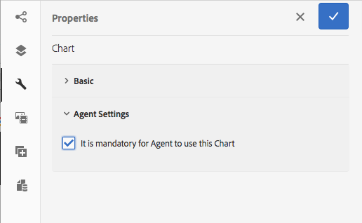

# 대화형 커뮤니케이션에서 차트 사용{#using-charts-in-interactive-communications}

차트 또는 그래프는 데이터를 시각적으로 나타냅니다. 많은 양의 정보를 쉽게 이해할 수 있는 시각적 형식으로 압축하여 대화형 커뮤니케이션의 수신자가 복잡한 데이터를 보다 효과적으로 시각화, 해석 및 분석할 수 있도록 합니다.

대화형 커뮤니케이션을 만드는 동안 Interactive Communication의 양식 데이터 모델에서 시각적으로 2차원 데이터를 나타내는 차트를 추가할 수 있습니다. 차트 구성 요소로 다음 유형의 차트를 추가하고 구성할 수 있습니다. 파이, 열, 도넛, 막대, 라인, 라인 및 포인트, 포인트, 영역 및 쿼드런트

## 대화형 커뮤니케이션에서 차트 추가 및 구성 {#add-and-configure-chart-in-an-interactive-communication}

다음 단계를 수행하여 Interactive Communication에서 차트를 추가하고 구성합니다.

1. 탭 **구성 요소** 대화형 커뮤니케이션의 사이드 킥에서 을 참조하십시오.
1. 을(를) 끌어다 놓습니다 **차트** 구성 요소를 다음 구성 요소 중 하나에 추가합니다.

   * 인쇄 채널: Target 영역 또는 이미지 필드
   * 웹 채널: 패널 또는 Target 영역

1. 대화형 통신 편집기에서 차트 구성 요소를 탭하고 을 선택합니다 **[!UICONTROL 구성 (]** )을 클릭하여 제품에서 사용할 수 있습니다.

   왼쪽 창에 차트 등록 정보가 표시됩니다.

   

   인쇄 채널에서 선 유형 차트의 기본 속성

   

   웹 채널의 선 유형 차트의 기본 속성

1. 구성 [차트 속성](../../forms/using/chart-component-interactive-communications.md#configure-chart-properties) 채널 유형에 따라 다릅니다.
1. (채널만 인쇄) **[!UICONTROL 에이전트 설정]**&#x200B;를 지정하는 경우 에이전트가 이 차트를 사용해야 하는지 지정합니다. 만약 **[!UICONTROL 에이전트가 이 차트를 사용하려면 필수입니다.]** 옵션을 선택하지 않으면 에이전트는 **[!UICONTROL 컨텐츠]** 에이전트 UI의 탭하여 차트를 표시하거나 숨깁니다.

   

1. 탭  차트 등록 정보를 저장합니다.

   탭 **[!UICONTROL 미리 보기]** 차트와 연관된 모양과 데이터를 보려면 탭 **[!UICONTROL 편집]** 차트의 속성을 재구성합니다.

## 차트 속성 구성 {#configure-chart-properties}

인쇄 및 웹 채널용 차트를 만드는 동안 다음 속성을 구성합니다.

<table>
 <tbody>
  <tr>
   <td>필드</td>
   <td>설명</td>
   <td>채널 유형</td>
  </tr>
  <tr>
   <td>이름</td>
   <td>차트 요소의 식별자입니다. 이 필드에 지정된 차트 이름이 차트에 표시되지 않습니다. 다른 구성 요소, 스크립트 및 SOM 표현식에서 요소를 참조할 때 사용됩니다.</td>
   <td>인쇄 및 웹</td>
  </tr>
  <tr>
   <td>차트 유형</td>
   <td>생성할 차트 유형입니다. 사용 가능한 옵션은 원형, 열, 도넛, 막대, 선 및 점, 점 및 영역입니다.</td>
   <td>인쇄 및 웹</td>
  </tr>
  <tr>
   <td>시리즈 &gt; 다중 시리즈</td>
   <td>X축 및 Y축에 표시되는 양식 데이터 모델 수집 항목에 대해 여러 시리즈를 추가하려면 선택합니다.</td>
   <td>인쇄 및 웹</td>
  </tr>
  <tr>
   <td>시리즈 &gt; 데이터 모델 개체</td>
   <td>차트에 여러 시리즈를 추가할 양식 데이터 모델 수집 항목의 이름입니다.<br /> X축 및 Y축에 표시되는 속성에 대한 상위 양식 데이터 모델 개체 속성을 선택하여 의미 있는 시리즈를 형성합니다. 바인딩하는 데이터 모델 개체는 Number, String 또는 Date 유형이어야 합니다.</td>
   <td>인쇄 및 웹</td>
  </tr>
  <tr>
   <td>겹쳐서 표시</td>
   <td>각 시리즈의 값을 차례대로 겹치도록 선택하십시오.</td>
   <td>인쇄 및 웹</td>
  </tr>
  <tr>
   <td>X축 &gt; 제목</td>
   <td>X축의 제목.</td>
   <td>인쇄 및 웹</td>
  </tr>
  <tr>
   <td>X축 &gt; 데이터 모델 개체</td>
   <td><p>X축에 표시할 양식 데이터 모델 수집 항목의 이름입니다.</p> <p>차트의 X축과 Y축에 플로팅할 때 서로 관련이 있는 동일한 상위 데이터 모델 개체의 두 개의 수집/배열 유형 속성을 선택합니다. 바인딩하는 데이터 모델 개체는 Number, String 또는 Date 유형이어야 합니다.</p> </td>
   <td>인쇄 및 웹</td>
  </tr>
  <tr>
   <td>Y축 &gt; 제목</td>
   <td>Y축의 제목. </td>
   <td>인쇄 및 웹</td>
  </tr>
  <tr>
   <td>Y축 &gt; 데이터 모델 개체</td>
   <td><p>Y축에 표시할 양식 데이터 모델 수집 항목입니다. 인쇄 채널에서 Y축에 대한 데이터 모델 개체는 숫자 유형이어야 합니다.</p> <p>차트의 X축과 Y축에 플로팅할 때 서로 관련이 있는 동일한 상위 데이터 모델 개체의 두 개의 수집/배열 유형 속성을 선택합니다. </p> </td>
   <td>인쇄 및 웹</td>
  </tr>
  <tr>
   <td>Y축 &gt; 함수</td>
   <td>y축의 값 계산에 사용할 통계/사용자 지정 함수입니다.</td>
   <td>인쇄 및 웹</td>
  </tr>
  <tr>
   <td>개체 숨기기</td>
   <td>최종 출력에서 차트를 숨기려면 선택합니다.</td>
   <td>인쇄 및 웹</td>
  </tr>
  <tr>
   <td>제목</td>
   <td>차트의 제목입니다. </td>
   <td>인쇄</td>
  </tr>
  <tr>
   <td>높이</td>
   <td>차트의 픽셀 단위 높이입니다.</td>
   <td>인쇄</td>
  </tr>
  <tr>
   <td>너비</td>
   <td>차트의 픽셀 단위 폭입니다. 스타일 레이어를 사용하거나 테마를 적용하여 웹 채널에서 차트의 너비를 제어할 수 있습니다.</td>
   <td>인쇄</td>
  </tr>
  <tr>
   <td>앞에 필수 페이지 나누기</td>
   <td>차트 앞에 필수 페이지 나누기를 추가하고 차트를 새 페이지의 맨 위에 놓습니다. </td>
   <td>인쇄</td>
  </tr>
  <tr>
   <td>이후 필수 페이지 나누기</td>
   <td>차트 뒤에 필수 페이지 나누기를 추가하고 차트 다음에 나오는 내용을 새 페이지 맨 위에 배치하려면 선택합니다. </td>
   <td>인쇄</td>
  </tr>
  <tr>
   <td>들여쓰기</td>
   <td>페이지 왼쪽의 차트 들여쓰기를 참조하십시오. </td>
   <td>인쇄</td>
  </tr>
  <tr>
   <td>툴팁</td>
   <td><p>웹 채널의 차트의 데이터 포인트 위에 마우스를 올려 놓을 때 나타나는 도구 설명이 나타납니다. 기본값은 ${x}(${y})입니다. 차트 유형에 따라 차트의 점, 막대 또는 슬라이스를 마우스로 가리키면 ${x}및 ${y} 변수가 X축 및 Y축에 있는 해당 값으로 동적으로 대체되고 도구 설명에 표시됩니다.</p> <p>도구 설명을 비활성화하려면 <span class="uicontrol">도구 설명</code> 필드를 비워 둡니다. 이 옵션은 선 및 영역 차트에 적용할 수 없습니다. 예를 들어 <a href="#chartoutputprintweb">예제 1: 인쇄 및 웹의 차트 출력</a>.</code></p> </td>
   <td>웹</td>
  </tr>
  <tr>
   <td>차트별 구성</td>
   <td><p>일반적인 구성 외에 다음과 같은 차트별 구성을 사용할 수 있습니다.</p>
    <ul>
     <li><strong>범례 표시: </strong>활성화되면 파이 또는 도넛 차트에 대한 범례를 표시합니다.</li>
     <li><strong>범례 위치: </strong>차트에 대한 범례 위치를 지정합니다. 사용 가능한 옵션은 오른쪽, 왼쪽, 위쪽 및 아래쪽 입니다. 인쇄 채널에서는 오른쪽 범례를 사용하는 것이 좋습니다.</li>
     <li><strong>내부 반경</strong>: 도넛 차트를 사용하여 차트에서 내부 원의 반경(픽셀 단위)을 지정할 수 있습니다.</li>
     <li><strong>선 색상</strong>: 선, 선 및 점, 영역 차트에서 차트의 선 색상을 지정할 수 있습니다.</li>
     <li><strong>점 색상</strong>: [점] 및 [선] 및 [점] 차트에서 차트의 점들에 대한 색상을 지정할 수 있습니다.<br /> </li>
     <li><strong>영역 색상</strong>: 영역 차트에서 차트의 선 아래에 있는 영역의 색상을 지정할 수 있습니다.</li>
     <li><strong>참조 점 &gt; 바인딩 유형: </strong>Quadrant 차트에서 사용 가능<strong> </strong>참조 점에 대한 바인딩 유형을 지정합니다. 정적 텍스트 또는 데이터 모델 개체 속성을 사용하여 참조 점의 값을 정의합니다.</li>
     <li><strong>참조 점 &gt; X축: </strong>선택한 경우 Quadrant 차트에 사용 가능 <span class="uicontrol">정적</code> 바인딩 유형(Binding Type) 드롭다운 목록에서 참조 점에 대한 X축 값을 지정합니다.</code></li>
     <li><strong>참조 점 &gt; Y축: </strong>선택한 경우 Quadrant 차트에 사용 가능 <span class="uicontrol">정적</code> 바인딩 유형(Binding Type) 드롭다운 목록에서 참조 점에 대한 Y축 값을 지정합니다.</code></li>
     <li><strong>참조 점 &gt; 시리즈의 데이터 모델 개체: </strong>선택한 경우 다중 시리즈 Quadrant 차트에 사용 가능 <span class="uicontrol">데이터 모델 개체</code> 바인딩 유형 드롭다운 목록에서 바인딩 유형을 선택합니다. 참조 점에 대한 시리즈를 식별할 양식 데이터 모델 개체 속성을 정의합니다. </code></li>
     <li><strong>참조 점(Reference Point) &gt; 데이터 모델 개체(Data Model Object Value for Series: </strong>선택한 경우 다중 시리즈 Quadrant 차트에 사용 가능 <span class="uicontrol">데이터 모델 개체</code> 바인딩 유형 드롭다운 목록에서 바인딩 유형을 선택합니다. 계열에 대한 양식 데이터 모델 객체 등록 정보 및 이 필드에 정의된 값을 사용하여 참조 포인트에 대한 시리즈를 식별합니다.</code></li>
     <li><strong>참조 점(Reference Point) &gt; 참조 점에 대한 데이터 모델 개체(Data Model Object): </strong>선택한 경우 Quadrant 차트에 사용 가능 <span class="uicontrol">데이터 모델 개체</code> 바인딩 유형 드롭다운 목록에서 바인딩 유형을 선택합니다. X축 및 Y축에 표시되는 등록 정보에 대한 동위 요소인 양식 데이터 모델 개체 등록 정보를 정의합니다. 또한 여러 시리즈의 경우 시리즈에 대해 정의된 데이터 모델 객체 속성의 하위 엔티티인 데이터 모델 객체 속성을 정의합니다.</code></li>
     <li><strong>참조 점(Reference Point) &gt; 참조 점에 대한 데이터 모델 개체 값: </strong>선택한 경우 Quadrant 차트에 사용 가능 <span class="uicontrol">데이터 모델 개체</code> 바인딩 유형 드롭다운 목록에서 바인딩 유형을 선택합니다. 참조 포인트에 대한 양식 데이터 모델 객체 등록 정보 및 이 필드에 정의된 값을 사용하여 차트의 참조 포인트를 식별합니다.<br /> <strong>Quadrant 레이블 &gt; 왼쪽 위:</strong> 왼쪽 위 사분면의 이름을 지정하는 Quadrant 차트에 사용할 수 있습니다.</code></li>
     <li><strong>Quadrant 레이블 &gt; 오른쪽 상단:</strong> Quadrant 차트에 Top Right Quadrant의 이름을 지정할 수 있습니다.</li>
     <li><strong>Quadrant 레이블 &gt; 오른쪽 아래: </strong>오른쪽 아래 사분면의 이름을 지정하는 Quadrant 차트에 사용할 수 있습니다.</li>
     <li><strong>Quadrant 레이블 &gt; 왼쪽 아래: </strong>왼쪽 아래 사분면의 이름을 지정하는 Quadrant 차트에 사용할 수 있습니다.</li>
    </ul> </td>
   <td>인쇄 및 웹</td>
  </tr>
 </tbody>
</table>

## 차트에서 함수 사용 {#use-functions-in-chart}

통계적 함수를 사용하여 차트의 플로팅을 위한 소스 데이터의 값을 계산하도록 차트를 구성할 수 있습니다. 차트에 함수를 적용하면 양식 데이터 모델에서 직접 제공하지 않는 데이터를 플롯할 수 있습니다.


차트 구성 요소에는 몇 가지 내장된 기능이 포함되어 있지만, [사용자 지정 함수](#customfunctionsweb) 웹 채널의 차트 구성에서 사용할 수 있도록 합니다.

차트 구성 요소에서는 기본적으로 다음 함수를 사용할 수 있습니다.

**평균(평균)** 다른 축에 지정된 값에 대한 X축 또는 Y축 값의 평균 반환

**합계** 다른 축에 지정된 값에 대해 X축이나 Y축에 있는 모든 값의 합계를 반환합니다.

**최대** 다른 축에 지정된 값에 대한 X축 또는 Y축 값의 최대값을 반환합니다.

**빈도** 다른 축에 지정된 값에 대해 X축 또는 Y축에 있는 값 수를 반환합니다.

**범위** 다른 축에 지정된 값에 대해 X축이나 Y축에 있는 값의 최대값과 최소값 간의 차이를 반환합니다.

**중간값** 다른 축에 지정된 값에 대해 X축이나 Y축에 있는 보다 높은 값과 낮은 값을 구분하는 값을 반환합니다.

**최소** 다른 축에 지정된 값에 대한 X축 또는 Y축에 있는 값의 최소값을 반환합니다.

**모드** 다른 축에 지정된 값에 대해 X축이나 Y축에 대부분의 발생 횟수가 있는 값을 반환합니다.

자세한 내용은 [예제 2: 라인 차트에서 합계 및 빈도 함수 적용](#applicationsumfrequency).

### 웹 채널의 사용자 지정 함수 {#customfunctionsweb}

차트에서 기본 함수를 사용하는 것 외에도 JavaScript™으로 사용자 지정 함수를 작성하여 웹 채널에 대한 차트 구성 요소의 함수 목록에서 사용할 수 있도록 할 수 있습니다.

함수는 배열 또는 값을 사용하고 카테고리 이름을 입력으로 사용하여 값을 반환합니다. 예:

```javascript
Multiply(valueArray, category) {
 var val = 1;
 _.each(valueArray, function(value) {
 val = val * value;
 });
 return val;
}
```

사용자 지정 함수를 작성한 후 다음을 수행하여 차트 구성에서 사용할 수 있도록 합니다.

1. 관련 대화형 커뮤니케이션과 연결된 클라이언트 라이브러리에 사용자 지정 함수를 추가합니다. 자세한 내용은 [제출 작업 구성](/help/forms/using/configuring-submit-actions.md) 및 [클라이언트측 라이브러리 사용](/help/sites-developing/clientlibs.md).

1. 함수 드롭다운에 사용자 지정 함수를 표시하려면 CRXDe Lite에서 을(를) 만듭니다 `nt:unstructured` 노드 아래에 있는 노드 아래에 나열된 속성을 사용합니다.

   * 속성 추가 `guideComponentType` 다음 값 사용 `fd/af/reducer`. (mandatory)

   * 속성 추가 `value` 를 반환합니다. (필수) 값을 곱과 같은 사용자 지정 함수의 이름으로 설정합니다.
   * 속성 추가 `jcr:description` 을 사용하여 함수 드롭다운에 표시되는 사용자 지정 함수의 이름으로 표시할 값을 지정합니다. 예, **곱하기**.

   * 속성 추가 `qtip` 과 함께 사용자 지정 함수에 대한 간단한 설명이 될 값이 있습니다. 포인터를 함수 이름 위에 두면 도구 설명으로 표시됩니다 **함수** 드롭다운 목록.

1. 클릭 **모두 저장** 구성을 저장합니다.

이제 함수를 차트에서 사용할 수 있습니다.

## 예제 1: 인쇄 및 웹의 차트 출력 {#chartoutputprintweb}

기본 탭에서 차트 유형, 데이터가 포함된 소스 양식 데이터 모델 등록 정보, 차트의 X축 및 Y축에 표시할 레이블 및 선택적으로 통계적 함수를 정의하여 차트의 플로팅에 대한 값을 계산합니다.

대화형 커뮤니케이션을 사용하여 생성된 카드 문의 도움을 받아 기본 속성에서 필요한 최소 정보에 대해 자세히 알아보겠습니다. 명세서에서 서로 다른 비용의 양을 설명하는 차트를 생성하려는 경우를 고려하십시오. 대화형 커뮤니케이션의 인쇄 및 웹 출력에 다양한 유형의 차트를 사용하려고 합니다.

### 인쇄용 열 차트 {#columnchartprint}

이를 수행하려면 다음 속성을 지정합니다.

* **[!UICONTROL 이름]** - 차트의 이름을 지정합니다.
* **[!UICONTROL 차트 유형]** - 선택 **열** 드롭다운 목록에서 을 선택합니다.
* **[!UICONTROL 제목]** - Y축에 대한 X축 및 트랜잭션 금액에 대한 비용 유형을 지정합니다.
* **[!UICONTROL 데이터 모델 개체]** - 데이터 모델 객체 등록 정보를 선택하여 X축(비용 유형) 및 Y축(트랜잭션 금액)에 대한 데이터 바인딩을 생성합니다.


대화형 커뮤니케이션의 인쇄 채널의 열 차트

### 웹용 도넛 차트 {#donutchartweb}

이를 수행하려면 다음 속성을 지정합니다.

* **[!UICONTROL 이름]** - 차트의 이름을 지정합니다.
* **[!UICONTROL 차트 유형]** - 선택 **[!UICONTROL 도넛]** 드롭다운 목록에서 을 선택합니다.
* **[!UICONTROL 데이터 모델 개체]** - 데이터 모델 객체 등록 정보를 선택하여 X축(비용 유형) 및 Y축(트랜잭션 금액)에 대한 데이터 바인딩을 생성합니다.
* **[!UICONTROL 내부 반경]** - 차트의 내부 원의 반경(픽셀 단위)을 지정하려면 [내부 반경] 값을 150으로 지정합니다.
* **[!UICONTROL 도구 설명]** - ${x}(${y}) 기본 형식을 사용하여 도구 설명을 표시합니다. 도구 설명이 다음과 같이 표시됩니다. 비용 유형(트랜잭션 금액). 예: 비트코인의 차변(10000).


대화형 커뮤니케이션의 웹 채널에 있는 도넛 차트

## 예제 2: 라인 차트에서 합계 및 빈도 함수 적용 {#applicationsumfrequency}

차트에 함수를 적용하면 양식 데이터 모델에서 직접 제공하지 않는 데이터를 플롯할 수 있습니다. 이 예에서는 차트에 Sum 및 Frequency 함수를 적용하는 방법을 이해하기 위해 신용 카드 명세서 예를 사용합니다.


두 개의 &quot;AirBnB용 차변&quot; 트랜잭션을 가진 기능이 없는 라인 차트

### Sum 함수 {#sum-function}

합계 함수를 적용하여 동일한 데이터 속성의 여러 인스턴스 값을 추가하고 한 번만 표시할 수 있습니다. 예를 들어, 다음 그래프에서 Sum 함수는 Y축에 적용되어 AirBnB 트랜잭션에 대한 2개의 차변(2050 및 1050)의 양을 추가하고 하나의 트랜잭션(3100)만 표시합니다.

Sum 함수는 동일한 데이터 속성의 여러 인스턴스에 대해 합계를 모으고 표시하려는 경우 그래프를 보다 유용하게 사용할 수 있습니다.


### 빈도 함수 {#frequency-function}

Frequency 함수는 다른 축에 있는 주어진 값에 대한 Y축 값의 수를 반환합니다. Y축(트랜잭션 금액)에 주파수 함수를 적용하여 그래프에는 AirBnB 트랜잭션에 대해 차변 발생 2개와 나머지 트랜잭션 유형의 발생 1개가 있음을 표시합니다.


## 예제 3: 웹의 멀티 시리즈 Quadrant 차트 {#example-multi-series-quadrant-chart-in-web}

이 차트는 특정 날짜 범위에서 수행된 트랜잭션에 대한 금액을 표시합니다. Quadrant 차트는 차트 영역을 4개의 레이블이 지정된 섹션으로 나누는 기능을 제공합니다. char은 X축 및 Y축에 정적 참조 점을 사용합니다. 여러 시리즈 기능을 사용하여 은행 이름에 따라 데이터를 구분합니다.

이를 수행하려면 다음 속성을 지정합니다.

* **이름:** 차트의 이름을 지정합니다.
* **차트 유형:** 선택 **Quadrant** 드롭다운 목록에서 을 선택합니다.

* 을(를) 선택합니다 **다중 시리즈** 확인란을 선택합니다.
* **데이터 모델 개체**: 계열에 대한 데이터 모델 개체 속성을 지정합니다. 은행 이름에 대한 데이터 모델 객체 등록 정보는 X축 및 Y축에 표시되는 데이터 모델 객체 등록 정보에 대한 상위입니다.
* **데이터 모델 개체:** 데이터 모델 객체 등록 정보를 선택하여 X축(트랜잭션 날짜) 및 Y축(트랜잭션 금액)에 대한 데이터 바인딩을 생성합니다.
* 에서 **참조 점** 섹션, **정적** 를 바인딩 유형으로 사용합니다.

* X축 및 Y축 참조 점의 값을 지정합니다.
* 왼쪽 위, 오른쪽 위, 오른쪽 아래 및 왼쪽 아래 사각의 사분면 레이블을 지정합니다.
* 을(를) 선택합니다 **범례 표시** 은행 이름에 대한 색상 코드를 표시하는 확인란


