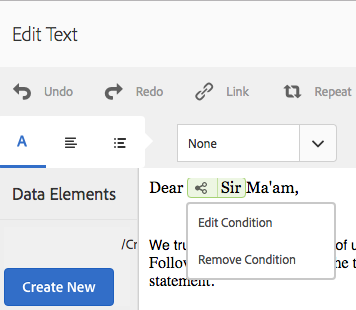

# 인라인 조건 및 대화형 통신 및 문자{#inline-condition-and-repeat-in-interactive-communications-and-letters}에서 반복

## 인라인 조건 {#inline-conditions}

AEM Forms을 사용하면 텍스트 모듈의 인라인 조건을 사용하여 양식 데이터 모델(대화형 통신)이나 데이터 사전(문자 단위)과 연결된 컨텍스트 또는 데이터에 의존하는 텍스트 렌더링을 자동화할 수 있습니다. 인라인 조건은 true 또는 false인 조건 평가를 기반으로 특정 컨텐츠를 표시합니다.

조건은 양식 데이터 모델/데이터 사전 또는 최종 사용자가 제공하는 데이터 값에 대해 계산을 수행합니다. 인라인 조건을 사용하면 시간을 절약하고 오류를 줄일 수 있을 뿐만 아니라 상황에 맞게 개인화된 인터랙티브 커뮤니케이션/문자를 만들 수 있습니다.

자세한 내용은 다음을 참조하십시오.

* [대화형 통신 만들기](../../forms/using/create-interactive-communication.md)
* [통신 관리 개요](/help/forms/using/cm-overview.md)
* [인터랙티브 커뮤니케이션의 텍스트](../../forms/using/texts-interactive-communications.md)

### 예:규칙을 사용하여 대화형 통신 {#example-using-rules-to-conditionalize-inline-text-in-interactive-communication}

인터랙티브 커뮤니케이션에서 문장, 단락 또는 텍스트 문자열을 조건화하려면 해당 텍스트 문서 조각에 규칙을 만들 수 있습니다. 다음 예에서는 인터랙티브 커뮤니케이션의 미국 수신자에게만 유료 번호를 표시하는 규칙을 사용합니다.

자세한 내용은 [Interactive Communications의 텍스트 문자 규칙 만들기](../../forms/using/texts-interactive-communications.md)를 참조하십시오.

Interactive Communication 및 Agent에 텍스트 조각을 포함하면 에이전트 UI를 사용하여 대화형 통신을 준비하면 받는 사람에 대한 (양식 데이터 모델) 데이터가 평가되고 텍스트는 미국의 받는 사람에게만 표시됩니다.

### 예:문자에서 인라인 조건을 사용하여 적절한 주소 {#example-using-inline-condition-in-a-letter-to-render-the-appropriate-address} 렌더링

해당 텍스트 모듈에 인라인 조건을 삽입하여 문자에 인라인 조건을 삽입할 수 있습니다. 다음 예제에서는 두 가지 조건을 사용하여 DD 요소 성별을 기반으로 한 서신에 해당 주소인 Sir 또는 Ma&#39;am을 평가하고 표시합니다. 유사한 단계를 사용하여 다른 조건을 만들 수 있습니다.

>[!NOTE]
>
>기존 에셋에 이전 조건/반복 표현식(6.2 SP1 CFP 4 이전)이 포함되어 있는 경우 자산은 이전 조건 구문을 표시하고 반복합니다. 하지만, 이전 상태/반복은 작동한다. 새 표현식과 이전 조건/반복 표현식은 이전 표현식과 새 조건/반복 표현식의 중첩된 혼합을 만들기 위해 서로 호환됩니다.

1. 관련 텍스트 모듈에서 조건을 지정할 텍스트 부분을 선택하고 **조건**&#x200B;을 누릅니다.

   

   조건 대화 상자가 빈 상태로 나타납니다.

   

   >[!NOTE]
   >
   >비어 있거나 잘못된 조건부 표현식을 저장할 수 없습니다. 식을 저장하려면 `${}` 내에 유효한 조건식이 있어야 합니다.

1. 선택한/조건부 텍스트가 편지에 표시되는지 여부를 평가하는 조건을 구성한 다음 확인 표시를 눌러 표현식을 저장합니다.

   DD 요소를 두 번 눌러 조건에 삽입합니다. 적절한 연산자를 삽입하고 대화 상자에 다음 조건을 구성합니다.

   ```javascript
   ${DD_creditcard_Gender=="Male"}
   ```

   표현식 만들기에 대한 자세한 내용은 [표현식 빌더](../../forms/using/expression-builder.md)의 **표현식 빌더**&#x200B;에 표현식 및 원격 함수 만들기를 참조하십시오. 표현식에 지정된 값은 데이터 사전의 요소에 대해 지원되어야 합니다. 자세한 내용은 [데이터 사전](../../forms/using/data-dictionary.md)을 참조하십시오.

   조건이 삽입되면 조건 왼쪽에 있는 핸들 위에 마우스를 올려 놓으면 조건을 볼 수 있습니다. 핸들을 눌러 조건을 편집하거나 제거할 수 있는 조건의 팝업 메뉴를 볼 수 있습니다.

    

1. 텍스트 `Ma'am`을 선택하여 유사한 조건을 삽입합니다.

   ```javascript
   ${DD_creditcard_Gender == "Female"}
   ```

1. 관련 편지를 미리 보고 텍스트가 인라인 조건에 따라 렌더링된다는 것을 확인합니다. 다음을 사용하여 DD 요소 성별 값을 입력할 수 있습니다.

   * 샘플 데이터가 있는 문자를 미리 보는 동안 관련 데이터 사전을 기반으로 만들어진 샘플 XML 데이터 파일입니다.
   * 관련 데이터 사전에 첨부된 XML 데이터 파일입니다.

   자세한 내용은 [데이터 사전](../../forms/using/data-dictionary.md)을 참조하십시오.

   

## 반복 {#repeat}

귀하는 인스턴스 또는 발생이 생성된 각 서신에 따라 변경될 수 있는 신용 카드 명세서의 트랜잭션과 같은 대화형 통신/서신에 동적 정보를 보유할 수 있습니다. 반복을 사용하여 텍스트 문서 조각에서 이러한 동적 정보의 형식을 지정하고 구조화할 수 있습니다.

또한 반복 구문에 규칙/조건을 지정하여 대화형 통신/문자로 렌더링되는 정보/항목을 조건화할 수 있습니다.

### 예:대화형 통신에서 반복을 사용하여 신용 카드 거래 목록 서식, 구조 및 표시 {#example-using-repeat-in-an-interactive-communication-to-format-structure-and-display-a-list-of-credit-card-transactions}

다음 예에서는 인터랙티브 커뮤니케이션에서 신용 카드 거래를 구조화하고 렌더링하기 위해 반복 사용을 사용하는 단계를 제공합니다.

1. 양식 데이터 모델 기반 텍스트 문서 조각에서 관련 양식 데이터 모델 객체(및 이 예제와 같이 레이블에 필요한 포함된 텍스트)를 삽입합니다.

   

   >[!NOTE]
   >
   >반복 가능한 콘텐츠에는 컬렉션 유형의 속성이 하나 이상 포함되어야 합니다.

1. 반복을 적용할 컨텐츠를 선택합니다.

   

1. 반복을 누릅니다.

   반복 대화 상자가 나타납니다.

   

1. 줄 바꿈을 구분 기호로 선택하고 필요한 경우 조건 추가를 눌러 규칙을 만듭니다. 텍스트를 구분 기호로 사용하고 구분 기호로 사용할 텍스트 문자를 지정할 수도 있습니다.

   규칙 만들기 대화 상자가 나타납니다.

1. 대화형 통신에서 3월 월에만 거래를 포함하도록 2018년 2월 28일 이후의 거래를 표시하는 규칙을 만듭니다.

   >[!NOTE]
   >
   >이 예에서는 에이전트가 2018년 3월 말에 문을 만들 것이라고 가정합니다. 그렇지 않은 경우 2018년 3월 이후 거래를 제외하기 위해 2018-04-01 전에 거래를 포함하는 다른 규칙을 만들 수 있습니다.

   

1. 조건/규칙을 저장한 다음 반복을 저장합니다. 조건부 반복은 선택한 컨텐츠에 적용됩니다.

   

   마우스를 올려 놓으면 텍스트 문서 조각은 조건에 대해 표시 및 컨텐츠에 적용된 반복에 사용된 구분 기호를 표시합니다.

1. 텍스트 문서 조각을 저장하고 관련 대화형 통신을 미리 봅니다. 양식 데이터 모델의 데이터에 따라 요소에 적용된 반복은 미리 보기의 다음과 유사한 트랜잭션 세부 사항을 렌더링합니다.

   

### 예:신용카드 거래 목록 형식 지정, 구조 및 표시에 반복 사용 {#example-using-repeat-in-a-letter-to-format-structure-and-display-a-list-of-credit-card-transactions}

다음 예에서는 반복을 사용하여 신용 카드 거래를 서신에 구조화하고 렌더링하는 절차를 제공합니다. 유사한 단계를 사용하여 다른 시나리오에서 반복을 사용할 수 있습니다.

1. 반복/동적 데이터를 렌더링하고 DD 요소 주위에 필요한 텍스트를 포함하는 DD 요소가 있는 텍스트 모듈을 열거나 편집하는 동안 엽니다. 예를 들어, 텍스트 모듈에는 신용 카드에 대한 거래 명세서를 만드는 다음 DD 요소가 있습니다.

   ```javascript
   {^DD_creditcard_TransactionDate^} {^DD_creditcard_TransactionAmount^}
   {^DD_creditcard_TransactionType^}
   ```

   이러한 DD 요소는 다음 정보와 함께 신용 카드에서 이루어진 거래 목록을 렌더링합니다.

   거래 일자, 거래 금액 및 거래 유형(차변 또는 대변)

1. 다음과 같이 DD 요소 내에 텍스트를 포함하여 문을 보다 읽기 쉽게 만듭니다.

   

   ```javascript
   Date: {^DD_creditcard_TransactionDate^} Amount (USD): {^DD_creditcard_TransactionAmount^} Transaction Type: {^DD_creditcard_TransactionType^}
   ```

   그러나 형식이 좋은 문을 렌더링하는 작업은 아직 완료되지 않았습니다. 지금까지 수행한 작업을 기반으로 편지를 렌더링하면 다음과 같이 표시됩니다.

   

   DD 요소와 함께 정적 텍스트를 반복하려면 추가 단계에서 설명한 대로 반복을 적용해야 합니다.

1. 아래에서 보듯이 반복할 DD 요소와 정적 텍스트를 선택합니다.

   

1. **반복**&#x200B;을 누릅니다. 반복 대화 상자가 빈 인라인 조건으로 나타납니다.

   

1. 필요한 경우 조건을 삽입하여 50센트 이상의 거래 금액을 렌더링하는 것과 같이 트랜잭션을 선별적으로 렌더링합니다.

   ```javascript
   ${DD_creditcard_TransactionAmount > 0.5}
   ```

   그렇지 않은 경우 정보(여기서 트랜잭션)를 선택적으로 렌더링할 필요가 없는 경우 대화 상자에서 다음을 삭제하여 조건을 비워 둡니다.`${}`. 반복 표현식 저장은 반복 표현식 창이 비어 있거나(반복이 필요하지 않은 경우 ${} 없이) 반복에 유효한 조건이 포함되어 있을 때 활성화됩니다.

1. 동적 텍스트의 서식을 지정할 구분 기호를 선택하고 체크 표시를 눌러 저장합니다.

   * **줄바꿈**:출력 서신의 각 트랜잭션 입력 뒤에 행 분리를 삽입합니다.
   * **텍스트**:출력 서신의 각 트랜잭션 항목 뒤에 지정된 텍스트 문자를 삽입합니다.

   조건이 삽입되면 반복이 있는 텍스트가 빨간색으로 강조 표시되고 핸들이 왼쪽에 표시됩니다. 반복 구문의 왼쪽에 있는 핸들 위로 마우스를 가져가면 반복 구절을 볼 수 있습니다.

   

   반복 구문을 편집하거나 제거할 수 있도록 핸들을 눌러 반복 팝업 메뉴를 볼 수 있습니다.

   

1. 관련 편지를 미리 보고 반복에 따라 텍스트가 렌더링된다는 것을 확인합니다. 다음을 사용하여 DD 요소 값을 입력할 수 있습니다.

   * 샘플 데이터가 있는 문자를 미리 보는 동안 관련 데이터 사전을 기반으로 만들어진 샘플 XML 데이터 파일입니다.
   * 관련 데이터 사전에 첨부된 XML 데이터 파일입니다.

   자세한 내용은 [데이터 사전](https://helpx.adobe.com/aem-forms/6-2/data-dictionary.html)을 참조하십시오.

   

   정적 텍스트는 트랜잭션 세부 사항과 반복됩니다. 반복적인 정적 텍스트는 이 절차의 텍스트에 적용된 반복으로 원활하게 작동됩니다. 조건 ${DD_creditcard_TransactionAmount > 0.5}은(는) USD .5 아래의 트랜잭션이 편지에서 렌더링되지 않도록 합니다.

   >[!NOTE]
   >
   >관련 텍스트 모듈을 만들거나 편집하는 동안에만 조건을 삽입하고 반복할 수 있습니다. 문자를 미리 보는 동안 텍스트 모듈을 편집할 수는 있지만 조건을 삽입하거나 반복할 수는 없습니다.

## 인라인 조건 사용 및 반복 - 일부 사용 사례 {#using-inline-condition-and-repeat-some-use-cases}

### 조건 {#repeat-within-condition} 내에서 반복

조건 내에서 반복을 사용해야 할 수도 있습니다. 통신 관리를 사용하면 인라인 조건 구문 내에서 반복을 사용할 수 있습니다.

예를 들어, 다음은 조건(녹색 형식)에서 반복(빨간색 형식 지정)입니다.

이 반복은 신용 카드 거래를 렌더링하는 동안 ${DD_creditcard_nooftransactions > 0} 조건은 하나 이상의 거래가 있는 경우에만 반복 구절이 렌더링되도록 합니다.


마찬가지로, 요구 사항에 따라 다음을 만들 수 있습니다.

* 조건 내에 하나 이상의 조건
* 반복 내의 하나 이상의 조건
* 조건 또는 반복 내에서 조건 조합과 반복

### 빈 인라인 조건 {#empty-inline-condition}

빈 인라인 조건을 삽입하고 나중에 텍스트와 DD 요소를 포함해야 할 수도 있습니다. 통신 관리에서는 그렇게 할 수 있습니다.


그러나 가능하면 텍스트 모듈에서 글머리 기호와 같은 의도한 서식과 함께 텍스트 및 DD 요소를 먼저 삽입하고 이후에 인라인 조건을 적용하는 것이 좋습니다.
