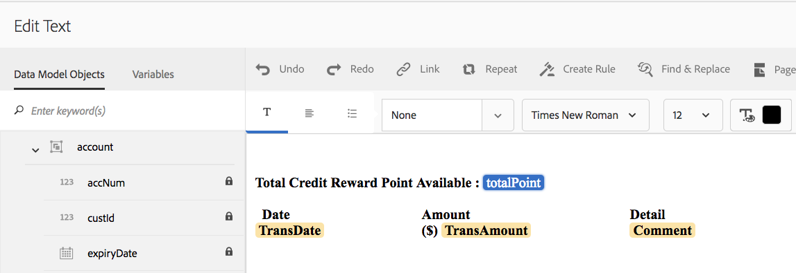
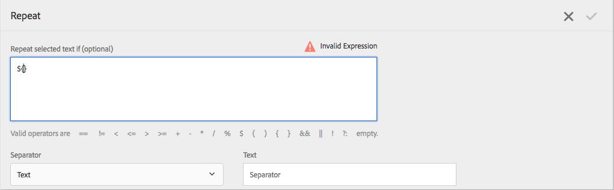

# 대화형 통신 및 편지에서 인라인 조건 및 반복{#inline-condition-and-repeat-in-interactive-communications-and-letters}

## 인라인 조건 {#inline-conditions}

AEM Forms을 사용하면 텍스트 모듈에서 인라인 조건을 사용하여 양식 데이터 모델(대화형 통신) 또는 데이터 사전(문자)과 연결된 컨텍스트 또는 데이터에 따라 달라지는 텍스트 렌더링을 자동화할 수 있습니다. 인라인 조건은 조건 평가가 true 또는 false인 경우 특정 콘텐츠를 표시합니다.

조건은 양식 데이터 모델/데이터 사전 또는 최종 사용자가 제공한 데이터 값에 대한 계산을 수행합니다. 인라인 조건을 사용하면 시간을 절약하고 사람의 실수를 줄이는 동시에 상황에 맞는 개인화된 대화형 커뮤니케이션/문자를 만들 수 있습니다.

자세한 내용은 다음 문서를 참조하십시오.

* [대화형 통신 만들기](../../forms/using/create-interactive-communication.md)
* [서신 관리 개요](/help/forms/using/cm-overview.md)
* [대화형 커뮤니케이션의 텍스트](../../forms/using/texts-interactive-communications.md)

### 예: 대화형 통신에서 규칙을 사용하여 인라인 텍스트 정규화 {#example-using-rules-to-conditionalize-inline-text-in-interactive-communication}

대화형 통신에서 문장, 단락 또는 텍스트 문자열을 조건부로 만들기 위해 적절한 텍스트 문서 조각에 규칙을 만들 수 있습니다. 다음 예에서는 규칙을 사용하여 대화형 통신의 미국 수신자에게만 수신자 부담 번호를 표시합니다.

자세한 내용은 텍스트에 규칙 만들기 를 참조하십시오 [대화형 커뮤니케이션의 텍스트](../../forms/using/texts-interactive-communications.md).

대화형 통신에 텍스트 조각을 포함하고 에이전트가 에이전트 UI를 사용하여 대화형 통신을 준비하면 수신자의 (양식 데이터 모델) 데이터가 평가되고 미국의 수신자에게만 텍스트가 표시됩니다.

### 예: 편지에 인라인 조건을 사용하여 적절한 주소 렌더링  {#example-using-inline-condition-in-a-letter-to-render-the-appropriate-address}

해당 텍스트 모듈에 인라인 조건을 삽입하여 편지에 인라인 조건을 삽입할 수 있습니다. 다음 예제에서는 두 가지 조건을 사용하여 DD 요소 Gender를 기반으로 한 편지에서 해당 주소 Sir 또는 Ma&#39;am을 평가하고 표시합니다. 유사한 단계를 사용하여 다른 조건을 만들 수 있습니다.

>[!NOTE]
>
>기존 에셋에 이전 조건/반복 표현식(6.2 SP1 CFP 4 이전)이 포함된 경우 에셋에 조건 및 반복의 이전 구문이 표시됩니다. 그러나 이전 상태/반복이 작동합니다. 새 조건/반복 표현식과 이전 조건/반복 표현식은 서로 호환되어 이전 조건/반복 표현식과 새 조건/반복 표현식의 중첩된 혼합을 만듭니다.

1. 관련 텍스트 모듈에서 조건을 지정할 텍스트 부분을 선택한 다음 탭합니다 **조건**.

   

   조건 대화 상자에 빈 조건이 표시됩니다.

   

   >[!NOTE]
   >
   >비어 있거나 잘못된 조건부 표현식은 저장할 수 없습니다. 내부에 유효한 조건부 표현식이 있어야 합니다. `${}` 표현식을 저장합니다.

1. 다음을 수행하여 선택한/조건화된 텍스트가 편지에 표시되는지 여부를 평가하는 조건을 구성한 다음 확인 표시를 탭하여 표현식을 저장합니다.

   DD 요소를 조건에 삽입하려면 두 번 탭합니다. 적절한 연산자를 삽입하고 대화 상자에서 다음 조건을 구성합니다.

   ```javascript
   ${DD_creditcard_Gender=="Male"}
   ```

   표현식 만들기에 대한 자세한 내용은 **표현식 빌더를 사용하여 표현식 및 원격 함수 만들기** 위치: [표현식 빌더](../../forms/using/expression-builder.md). 식에 지정된 값은 데이터 사전의 요소에 대해 지원되어야 합니다. 자세한 내용은 [데이터 사전](../../forms/using/data-dictionary.md).

   조건이 삽입되면 조건 왼쪽의 핸들을 마우스로 가리키면 조건이 표시됩니다. 핸들을 탭하여 조건의 팝업 메뉴를 볼 수 있으므로 조건을 편집하거나 제거할 수 있습니다.

    

1. 텍스트를 선택하여 유사한 조건 삽입 `Ma'am`.

   ```javascript
   ${DD_creditcard_Gender == "Female"}
   ```

1. 관련 편지를 미리 보고 텍스트가 인라인 조건에 따라 렌더링됨을 확인합니다. 다음을 사용하여 DD 요소 Gender 값을 입력할 수 있습니다.

   * 샘플 데이터가 있는 편지를 미리 보는 동안 관련 데이터 사전을 기반으로 만들어진 샘플 XML 데이터 파일입니다.
   * 관련 데이터 사전에 첨부된 XML 데이터 파일.

   자세한 내용은 [데이터 사전](../../forms/using/data-dictionary.md).

   

## 반복 {#repeat}

대화형 통신/편지에 신용카드 명세서에서의 거래와 같은 동적 정보가 있을 수 있으며, 이 정보의 인스턴스 또는 발생은 생성된 각 편지에 따라 계속 변경될 수 있습니다. 반복을 사용하면 텍스트 문서 조각에서 이러한 동적 정보의 서식을 지정하고 구조를 지정할 수 있습니다.

또한 반복 구문 내에 규칙/조건을 지정하여 대화형 통신/편지에서 렌더링되는 정보/항목을 조건화할 수 있습니다.

### 예: 대화형 통신에서 repeat을 사용하여 신용 카드 거래 목록의 서식, 구조 및 표시 {#example-using-repeat-in-an-interactive-communication-to-format-structure-and-display-a-list-of-credit-card-transactions}

다음 예제에서는 repeat을 사용하여 대화형 통신에서 신용 카드 거래를 구조화하고 렌더링하는 단계를 제공합니다.

1. 양식 데이터 모델 기반 텍스트 문서 조각에서 관련 양식 데이터 모델 개체(및 이 예제와 같이 레이블에 필요한 임베드된 텍스트)를 삽입합니다.

   

   >[!NOTE]
   >
   >반복 가능한 컨텐츠에는 Collection 형식의 속성이 하나 이상 포함되어야 합니다.

1. 반복을 적용할 콘텐츠를 선택합니다.

   

1. 반복을 누릅니다.

   반복 대화 상자가 나타납니다.

   

1. 구분자로 줄바꿈을 선택하고, 필요한 경우 조건 추가 를 탭하여 규칙을 만듭니다. 텍스트를 구분 기호로 사용하고 구분 기호로 사용할 텍스트 문자를 지정할 수도 있습니다.

   [규칙 생성] 대화 상자가 나타납니다.

1. 2018년 2월 28일 이후의 트랜잭션을 표시하는 규칙을 만들어 3월 월별 트랜잭션만 대화형 통신에 포함합니다.

   >[!NOTE]
   >
   >이 예에서는 에이전트가 2018년 3월 말에 문을 작성한다고 가정합니다. 그렇지 않으면 2018-04-01 이전의 거래를 포함하여 2018년 3월 이후의 거래를 제외하는 다른 규칙을 만들 수 있습니다.

   

1. 조건/규칙을 저장한 다음 반복을 저장합니다. 조건부 반복이 선택한 콘텐츠에 적용됩니다.

   

   마우스로 가리키면 텍스트 문서 조각에 콘텐츠에 적용된 반복에 사용된 조건 및 구분 기호가 표시됩니다.

1. 텍스트 문서 조각을 저장하고 관련 대화형 커뮤니케이션을 미리 봅니다. 양식 데이터 모델의 데이터에 따라 요소에 적용된 반복은 미리보기에서 다음과 유사한 트랜잭션 세부 정보를 렌더링합니다.

   

### 예: 편지에서 반복을 사용하여 신용 카드 거래 목록의 서식, 구조 및 표시 {#example-using-repeat-in-a-letter-to-format-structure-and-display-a-list-of-credit-card-transactions}

다음 예제에서는 repeat을 사용하여 편지에서 신용 카드 거래를 구조화하고 렌더링하는 단계를 제공합니다. 유사한 단계를 사용하면 다른 시나리오에서 반복을 사용할 수 있습니다.

1. 반복되는/동적 데이터를 렌더링하고 DD 요소 주위에 필요한 텍스트를 포함하는 DD 요소가 있는 텍스트 모듈을 엽니다(편집하거나 만드는 동안). 예를 들어 텍스트 모듈에는 신용 카드의 거래 명세서를 작성하기 위한 다음과 같은 DD 요소가 있습니다.

   ```javascript
   {^DD_creditcard_TransactionDate^} {^DD_creditcard_TransactionAmount^}
   {^DD_creditcard_TransactionType^}
   ```

   이러한 DD 요소는 다음 정보와 함께 신용 카드에서 수행된 거래 목록을 렌더링합니다.

   트랜잭션 일자, 트랜잭션 금액 및 트랜잭션 유형(차변 또는 대변)

1. DD 요소 내에 텍스트를 임베드하여 다음과 같이 문을 보다 읽기 쉽게 만듭니다.

   

   ```javascript
   Date: {^DD_creditcard_TransactionDate^} Amount (USD): {^DD_creditcard_TransactionAmount^} Transaction Type: {^DD_creditcard_TransactionType^}
   ```

   그러나 형식이 좋은 문을 렌더링하는 작업은 아직 완료되지 않았습니다. 지금까지 수행된 작업을 기반으로 편지를 렌더링하는 경우 다음과 같이 표시됩니다.

   

   DD 요소와 함께 정적 텍스트를 반복하려면 추가 단계에 설명된 대로 반복을 적용해야 합니다.

1. 아래와 같이 반복할 정적 텍스트 및 DD 요소를 선택합니다.

   

1. 누르기 **반복**. [반복] 대화 상자에 빈 인라인 조건이 표시됩니다.

   

1. 필요한 경우 거래 금액을 50센트보다 크게 렌더링하는 것과 같이 거래를 선택적으로 렌더링하는 조건을 삽입합니다.

   ```javascript
   ${DD_creditcard_TransactionAmount > 0.5}
   ```

   그렇지 않으면 정보(여기서 트랜잭션)를 선택적으로 렌더링할 필요가 없는 경우 대화 상자에서 다음을 삭제하여 조건을 비워 두십시오. `${}`. 반복 표현식 창이 비어 있을 때($ 없이) 반복 표현식 저장이 활성화됩니다.{} 반복이 필요하지 않거나 유효한 반복 조건이 포함된 경우.

1. 동적 텍스트 서식을 지정할 구분자를 선택하고 확인 표시를 탭하여 저장합니다.

   * **줄 바꿈**: 출력 편지의 각 트랜잭션 항목 뒤에 줄 바꿈을 삽입합니다.
   * **텍스트**: 출력 편지의 각 트랜잭션 항목 뒤에 지정된 텍스트 문자를 삽입합니다.

   조건이 삽입되면 반복이 있는 텍스트가 빨간색으로 강조 표시되고 왼쪽에 핸들이 나타납니다. 반복 왼쪽의 핸들을 마우스로 가리키면 반복 구문이 표시됩니다.

   

   핸들을 탭하여 반복 구조를 편집하거나 제거할 수 있는 반복 팝업 메뉴를 볼 수 있습니다.

   

1. 관련 편지를 미리 보고 텍스트가 반복에 따라 렌더링됨을 확인합니다. 다음을 사용하여 DD 요소의 값을 입력할 수 있습니다.

   * 샘플 데이터가 있는 편지를 미리 보는 동안 관련 데이터 사전을 기반으로 만들어진 샘플 XML 데이터 파일입니다.
   * 관련 데이터 사전에 첨부된 XML 데이터 파일.

   자세한 내용은 [데이터 사전](https://helpx.adobe.com/aem-forms/6-2/data-dictionary.html).

   

   정적 텍스트가 트랜잭션 세부 사항과 반복됩니다. 정적 텍스트 반복은 이 절차에서 텍스트에 적용된 반복에 의해 촉진됩니다. 조건, ${DD_creditcard_TransactionAmount > 0.5}는 USD .5 미만의 거래가 편지에서 렌더링되지 않도록 합니다.

   >[!NOTE]
   >
   >관련 텍스트 모듈을 만들거나 편집하는 동안에만 조건을 삽입하고 반복할 수 있습니다. 편지를 미리 보는 동안 텍스트 모듈을 편집할 수는 있지만 조건을 삽입하거나 반복할 수는 없습니다.

## 인라인 조건 및 반복 사용 - 일부 사용 사례  {#using-inline-condition-and-repeat-some-use-cases}

### 조건 내에서 반복 {#repeat-within-condition}

조건 내에서 repeat을 사용해야 할 수도 있습니다. 서신 관리를 사용하면 인라인 조건 구문 내에서 반복을 사용할 수 있습니다.

예를 들어, 다음 은 조건(녹색으로 서식 지정됨) 내에서 반복(빨간색으로 서식 지정됨)됩니다.

반복이 신용 카드 거래를 렌더링하는 동안 조건 ${DD_creditcard_nooftransactions > 0} 하나 이상의 트랜잭션이 있는 경우에만 반복 구성이 렌더링되도록 합니다.


마찬가지로 요구 사항에 따라 다음을 만들 수 있습니다.

* 조건 내 하나 이상의 조건
* 반복 내 하나 이상의 조건
* 조건 및 조건 또는 반복 내의 반복 조합

### 빈 인라인 조건 {#empty-inline-condition}

빈 인라인 조건을 삽입하고 나중에 텍스트 및 DD 요소를 임베드해야 할 수 있습니다. 서신 관리를 통해 해당 작업을 수행할 수 있습니다.


그러나 가능한 경우 글머리 기호와 같은 의도된 서식이 있는 텍스트 모듈에 먼저 텍스트 및 DD 요소를 삽입하고 그 후에 인라인 조건을 적용하는 것이 좋습니다.
