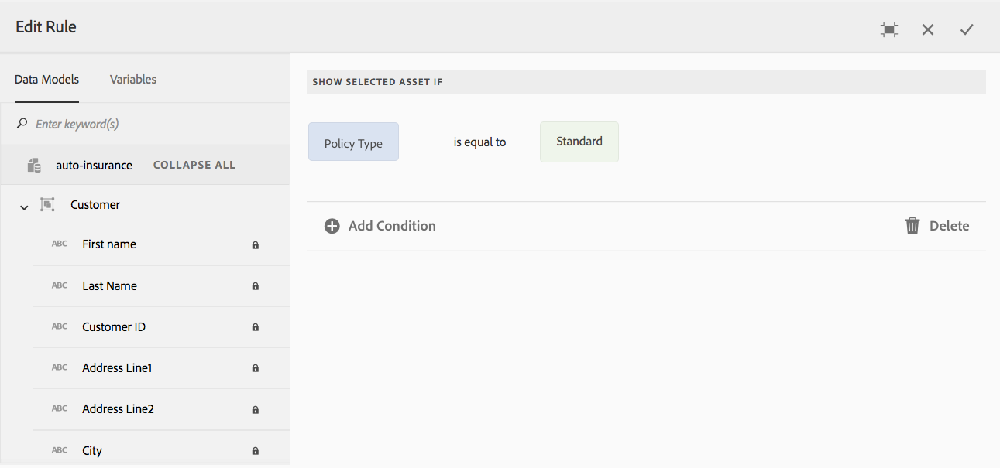

# 인터랙티브 커뮤니케이션의 조건{#conditions-in-interactive-communications}

인터랙티브 커뮤니케이션에서 사용할 조건 조각 만들기 및 편집 - 조건은 인터랙티브 커뮤니케이션을 구축하는 데 사용되는 네 가지 문서 조각 중 하나입니다. 나머지 3개는 텍스트, 목록 및 레이아웃 조각입니다.

## 개요 {#overview}

조건은 대화형 통신에 포함할 수 있는 문서 조각입니다. 다른 문서 조각은 [텍스트](../../forms/using/texts-interactive-communications.md), 목록 및 레이아웃 조각입니다. 조건을 사용하면 제공된 데이터 및 규칙을 기반으로 대화형 통신에 포함되는 하나 이상의 컨텍스트 자산을 정의할 수 있습니다.

예:

* 신용카드 명세서에 고객의 신용 카드 유형에 따라 신용 카드 연간 수수료 및 신용 카드 이미지를 표시합니다.
* 주의 세금을 기준으로 납세 계산을 나타내는 보험료 독촉장에서.

적용된 규칙과 규칙에 전달된 값을 기반으로 렌더링되는 조건의 자산. 조건의 규칙은 다음 데이터 유형의 값을 확인할 수 있습니다.

* 연결된 양식 데이터 모델의 속성
* 조건에 만드는 모든 변수
* 문자열
* 숫자
* 수학 표현식
* 날짜

## Create condition {#createcondition}

1. 양식 **[!UICONTROL > 문서]** 단편을 **[!UICONTROL 선택합니다]**.
1. 만들기 **[!UICONTROL > 조건을]** **[!UICONTROL 선택합니다]**.
1. 다음 정보를 지정합니다.

   * **[!UICONTROL 제목]**:(선택 사항) 조건의 제목을 입력합니다. 제목은 고유하지 않아도 되며 특수 문자와 영어가 아닌 문자를 사용할 수 있습니다. 조건은 축소판 및 속성과 같이 제목에 의해 참조됩니다(사용 가능한 경우).
   * **[!UICONTROL 이름]**:폴더 내의 조건에 대한 고유한 이름입니다. 모든 상태의 두 문서 조각(텍스트, 조건 또는 목록)은 폴더 내에 동일한 이름으로 존재할 수 없습니다. 이름 필드에 영어 문자, 숫자 및 하이픈만 입력할 수 있습니다. 이름 필드는 제목 필드를 기반으로 자동으로 채워집니다. 제목 필드에 입력한 특수 문자, 공백, 숫자 및 영어가 아닌 문자는 이름 필드에서 하이픈으로 대체됩니다. 제목 필드의 값이 자동으로 이름(Name)으로 복사되지만 값을 편집할 수 있습니다.

   * **[!UICONTROL 설명]**:문서 조각에 대한 설명을 입력합니다.
   * **[!UICONTROL 양식 데이터 모델]**:양식 데이터 모델 라디오 단추를 선택하여 양식 데이터 모델을 기반으로 조건을 생성합니다(선택적). 양식 데이터 모델 라디오 단추를 선택하면 양식 데이터 **[!UICONTROL 모델]** 필드가 나타납니다. 양식 데이터 모델을 찾아 선택합니다. 대화형 통신에 대한 조건을 만드는 동안 대화형 통신에 사용할 것과 동일한 데이터 모델을 사용해야 합니다. 양식 데이터 모델에 대한 자세한 내용은 데이터 [통합을 참조하십시오](../../forms/using/data-integration.md).

   * **[!UICONTROL 태그]**:원하는 경우 사용자 지정 태그를 만들려면 텍스트 필드에 값을 입력하고 Enter 키를 누릅니다. 이 조건을 저장하면 새로 추가된 태그가 생성됩니다.

1. 다음을 **[!UICONTROL 누릅니다]**.

   조건 만들기 페이지가 나타납니다.

   

1. 자산 **[!UICONTROL 추가를 누릅니다]**.

   자산 선택 페이지가 나타나고 조건에 추가할 수 있는 텍스트, 목록, 조건 및 이미지가 표시됩니다.

   >[!NOTE]
   >
   >[자산 선택] 페이지에는 새로 생성된 없음 기반 자산 및 FDM 기반 자산(생성되는 조건과 동일한 FDM을 사용하여 생성)만 표시됩니다.

1. 해당 자산을 눌러 조건에 포함할 자산을 선택한 다음 완료를 **[!UICONTROL 누릅니다]**.

   조건 만들기 페이지가 나타나고 추가된 자산이 나열됩니다.

   

   다음 옵션을 사용하여 조건에서 자산을 관리할 수 있습니다.

   

   **[거부]변경.**이 아이콘을 눌러 자산과 조건의 규칙에 대한 변경 사항을 거부합니다.   **[B]변경 수락.**이 아이콘을 눌러 자산의 변경 내용을 조건에 적용합니다.   **[C]중복된 자산.**이 아이콘을 눌러 적용된 규칙이 있는 경우 해당 조건에 있는 자산의 사본을 만듭니다. 그런 다음 중복된 자산에 대한 규칙 및 자산 편집을 계속할 수 있습니다. 자산을 복제하는 것은 특정 컨텍스트에 따라 대체 자산을 표시하는 유사한 규칙을 만드는 데 유용합니다.   **[미리]보기 표시를 참조하십시오.**이 아이콘을 눌러 조건 만들기\편집 페이지 내에 자산의 미리 보기를 표시합니다.   **&#39;server&#39; 순서 변경.** 이 아이콘을 길게 눌러 자산을 드래그하여 놓아 조건 내에서 순서를 변경할 수 있습니다.

   다음 옵션을 선택하여 조건이 런타임 시 어떻게 동작하는지를 지정할 수 있습니다.

   * **여러 결과 평가 비활성화\여러 결과 평가 활성화**:이 옵션을 활성화하면(&quot;여러 결과 평가 활성화&quot;로 표시됨) 모든 규칙이 평가되고 결과가 모든 실제 규칙의 합계입니다. 이 옵션이 비활성화된 경우(&quot;여러 결과 평가 비활성화&quot;로 표시됨) true로 확인된 첫 번째 규칙만 평가되고 조건의 출처가 됩니다.

   * **페이지 나누기**:조건의 자산 사이에 페이지 나누기를 추가하려면 이 옵션( )을 선택합니다. 이 옵션을 선택하지 않으면( ), 조건이 인쇄 출력의 다음 페이지로 넘치는 경우, 조건이 상태의 자산 간에 페이지를 나누는 대신 전체 조건이 다음 페이지로 이동합니다.

1. 규칙 **[!UICONTROL 만들기를]** 눌러 규칙을 추가하여 필요에 따라 자산을 표시하거나 숨깁니다. 규칙에서 변수를 사용하려면 변수 [만들기를](#variables)참조하십시오. 자세한 내용은 조건에 [규칙 추가를 참조하십시오](#ruleeditor).

   생성된 규칙은 조건 만들기 화면의 규칙 열에 나타납니다.

   

   >[!NOTE]
   >
   >이미 규칙이나 반복이 적용된 자산을 조건에 삽입할 수 있습니다.

1. 저장을 **[!UICONTROL 누릅니다]**.

   조건이 만들어집니다. 이제 대화형 통신을 만드는 동안 조건을 빌딩 블록으로 계속 사용할 수 있습니다.

   >[!NOTE]
   >
   >새 조건 또는 편집된 조건을 저장하려면 조건에 추가된 각 자산에 대해 하나 이상의 규칙이 있어야 합니다.

## 조건 편집 {#edit-a-condition}

다음 단계를 사용하여 조건을 편집할 수 있습니다. 팝업 메뉴에서 조각 편집을 선택하여 대화형 통신 내에서 조건을 편집할 수도 있습니다.

1. 양식 **[!UICONTROL > 문서]** 단편을 **[!UICONTROL 선택합니다]**.
1. 조건을 탐색하고 선택합니다.
1. 편집을 **[!UICONTROL 누릅니다]**.
1. 조건을 변경합니다. 조건에서 변경할 수 있는 정보에 대한 자세한 내용은 조건 [만들기를 참조하십시오](#createcondition).
1. 저장을 **[!UICONTROL 누른]** 다음 닫기를 **[!UICONTROL 누릅니다]**.

## 조건 대로 규칙 만들기 {#ruleeditor}

조건에 규칙 편집기를 사용하면 **사전 설정 조건을**&#x200B;기반으로 자산을 표시하거나 숨기는 규칙을 만들 수 있습니다. 이러한 조건은 다음을 기반으로 생성할 수 있습니다.

* 문자열
* 숫자
* 수학 표현식
* 날짜
* 연결된 양식 데이터 모델의 속성
* 만든 [변수](#variables)

### 조건 대로 규칙 만들기 {#create-rule-in-condition}

1. 조건을 만들거나 편집하는 동안 관련 자산에 대한  (규칙 편집기) 아이콘을 누릅니다.

   규칙 만들기 대화 상자가 나타납니다. 문자열, 숫자, 수학 표현식 및 날짜 외에도 규칙 편집기에서 규칙의 문을 만들기 위해 다음 사항을 사용할 수도 있습니다.

   * 연결된 양식 데이터 모델의 속성
   * 만들 수 있는 [모든 변수](#variables) .
   

   평가할 적절한 옵션을 선택합니다.

   >[!NOTE]
   >
   >컬렉션 속성은 자산을 표시하는 규칙을 만드는 데 지원되지 않습니다.

1. 같음, 포함 및 다음으로 시작 등 규칙을 평가할 적절한 연산자를 선택합니다.
1. 평가 표현식, 문자열, 데이터 모델 속성, 변수 또는 날짜를 삽입합니다.

   

   정책 유형이 표준일 때 자산을 표시하는 규칙

   * 규칙을 만들거나 편집하는 동안  (크기 조정)를 눌러 규칙 만들기/규칙 편집 대화 상자를 확장할 수도 있습니다. 확장된 전체 창 대화 상자에서는 규칙을 구성하는 [변수를](#variables) 만들 수 있습니다. 다시 크기 조정을 눌러 일반 규칙 만들기 대화 상자로 돌아갑니다.

   * 규칙에 여러 조건을 만들 수도 있습니다.

1. **[!UICONTROL Done]**&#x200B;을 누릅니다.

   규칙이 자산에 적용됩니다.

## 조건에서 변수 만들기 및 사용 {#variables}

조건에서 규칙을 만들거나 편집하는 동안  (크기 조정)를 눌러 규칙 만들기\규칙 편집 대화 상자를 확장할 수 있습니다. 확장된 전체 창 대화 상자에서는 다음을 수행할 수 있습니다.

* 규칙에서 변수 만들기 및 사용
* 규칙에 있는 양식 데이터 모델의 속성 및 변수를 드래그하여 놓기

다시 크기 조정을 눌러 규칙 만들기\규칙 편집 대화 상자로 돌아갑니다.

### 변수 만들기 {#create-variables}

1. 조건에서 규칙을 만들거나 편집하는 동안  (크기 조정)를 눌러 규칙 만들기\규칙 편집 대화 상자를 확장할 수 있습니다.

   전체 창 확장 대화 상자가 나타납니다.

   

1. 왼쪽 창에서 변수를 **[!UICONTROL 누릅니다]**.

   변수 창이 나타납니다.

   

1. 만들기를 **[!UICONTROL 누릅니다]**.

   변수 만들기 창이 나타납니다.

1. 다음 정보를 입력하고 만들기를 **[!UICONTROL 누릅니다]**.

   * **[!UICONTROL 이름]**:변수의 이름입니다.
   * **[!UICONTROL 설명]**:변수에 대한 설명을 선택적으로 입력합니다.
   * **[!UICONTROL 유형]**:변수 유형을 선택합니다.문자열, 숫자, 부울 또는 날짜입니다.
   * **[!UICONTROL 특정 값만 허용]**:문자열 및 숫자 변수의 경우 에이전트가 에이전트 UI의 자리 표시자에 대한 특정 값 세트에서 선택하도록 할 수 있습니다. 값 집합을 지정하려면 이 옵션을 선택한 다음 값 필드에 허용되는 쉼표로 구분된 값을 **[!UICONTROL 지정합니다]** .

1. 만들기를 **[!UICONTROL 누릅니다]**.

   변수가 만들어져 변수 창에 나열됩니다.

1. 규칙에 변수를 삽입하려면 변수를 규칙의 옵션에 대한 자리 표시자로 드래그하여 놓습니다.
1. 유효한 규칙을 만든 후 완료를 **[!UICONTROL 누릅니다]**.

   필요한 경우 조건을 변경하여 저장합니다.

