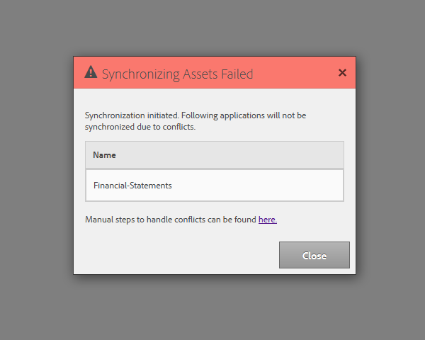

# 동기화 스케줄러 구성 {#configuring-the-synchronization-scheduler}

기본적으로 동기화 스케줄러는 3분마다 실행되어 LiveCycle 워크벤치 11을 통해 저장소에서 수정 및 업데이트된 모든 자산을 동기화합니다. 양식 및 리소스가 포함된 애플리케이션은 동기화 프로세스가 완료되면 AEM Forms 사용자 인터페이스에 표시됩니다.

## 동기화 스케줄러 간격 변경 {#change-interval-of-the-synchronization-scheduler}

동기화 스케줄러의 간격을 변경하려면 다음 단계를 수행하십시오.

1. AEM 구성 관리자에 로그인합니다. 구성 관리자의 URL은 `https://'[server]:[port]'/lc/system/console/configMgr`입니다.

1. **FormsManagerConfiguration** 번들을 찾아 엽니다.

1. **동기화 스케줄러 빈도** 옵션에 새 값을 지정합니다.

   주파수 단위는 분입니다. 예를 들어 60분마다 실행되도록 스케줄러를 구성하려면 60을 지정합니다.

## 자산 동기화 {#synchronizing-assets}

**저장소에서 자산 동기화** 옵션을 사용하여 자산을 수동으로 동기화할 수 있습니다. 자산을 수동으로 동기화하려면 다음 단계를 수행하십시오.

1. AEM Forms에 로그인합니다. 기본 URL은 `https://'[server]:[port]'/lc/aem/forms/`.

   

   **그림:** *AEM Forms 사용자 인터페이스*

1. 도구 모음에서  아이콘을 클릭합니다. 마지막으로 구성된 경로에 자산이 없으면 아래에 표시된 대로 대화 상자가 표시됩니다. **시작**&#x200B;을 클릭하여 동기화를 시작합니다.

   

   **그림:** *동기화 대화 상자*

## 동기화 문제 해결 오류 {#troubleshooting-synchronization-error}

워크플로우 디자이너(LiveCycle 워크벤치)에서 새 응용 프로그램을 만들 수 있습니다.

새로 만든 응용 프로그램과 /content/dam/formsanddocuments의 폴더가 동일한 이름을 갖는 경우 &quot;*이 응용 프로그램과 동일한 이름을 가진 자산이 루트 수준에 이미 있습니다.*&quot;이(가) 기록됩니다.

충돌을 해결하려면 애플리케이션 이름을 변경하고 자산을 수동으로 동기화합니다.

**그림:** *자산 동기화 대화 상자의 충돌*
