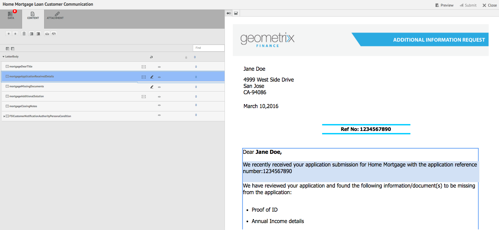
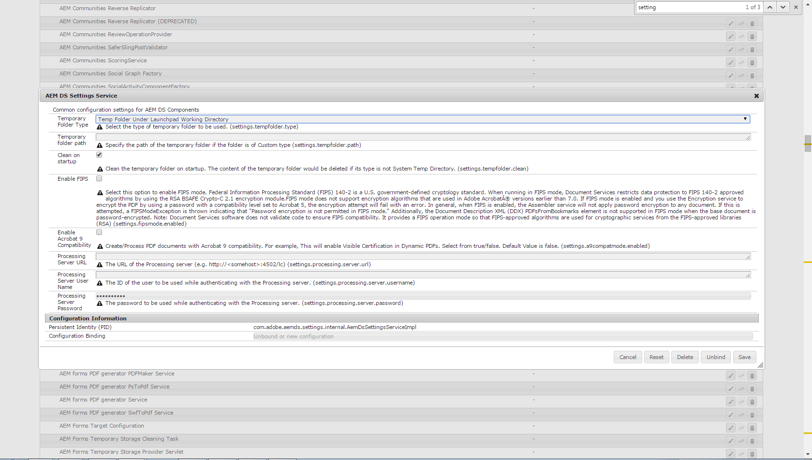

# 서신 만들기{#create-correspondence}

## 서신 만들기 사용자 인터페이스에서 서신 만들기 {#create-correspondence-in-the-create-correspondence-user-interface}

다음 이후 [편지 템플릿이 서신 관리에서 생성됨](../../forms/using/create-letter.md), 최종 사용자/에이전트/클레임 조정자는 서신 작성 사용자 인터페이스에서 문자를 열고 데이터를 입력하고, 콘텐츠를 설정하고, 첨부 파일을 관리하여 서신을 작성할 수 있습니다. 마지막으로, 청구 조정자 또는 에이전트는 미리보기 모드에서 콘텐츠를 관리하고 편지를 제출할 수 있습니다.

### 서신 미리 보기 {#preview-a-correspondence}

다음 단계를 사용하여 미리 볼 문자를 선택합니다.

1. 편지 페이지에서 을 누릅니다 **선택**.
1. 적절한 편지를 탭하여 선택합니다.

   

   편지 선택

1. 데이터 사전 기반 편지의 경우 다음을 선택합니다 **미리 보기** > **미리 보기**. 또는 데이터 사전을 기반으로 하지 않는 편지의 경우 다음을 선택합니다 **미리 보기**. 문자를 선택하지 않고 마우스로 가리킨 다음 편지 미리 보기 아이콘을 탭하여 미리 볼 수도 있습니다.

   >[!NOTE]
   >
   >데이터 사전이 편지와 연결되어 있지 않으면 편지 미리 보기가 열립니다. 그렇지 않으면 편지가 데이터 사전을 기반으로 하는 경우 서신 관리에서는 미리 보기 메뉴에 미리 보기 및 사용자 지정 옵션을 표시하며 두 옵션 중 하나를 선택할 수 있습니다. 테스트 데이터를 데이터 사전에 연결할 수도 있습니다. 다음의 경우 [데이터 사전에 연결된 테스트 데이터가 있습니다.](../../forms/using/data-dictionary.md#p-working-with-test-data-p)를 선택한 다음 미리보기 옵션을 선택하면 테스트 데이터가 채워진 일반 미리보기가 열립니다.

1. 서신을 미리 보는 동안 서신을 렌더링하려면 관리자이거나 다음 그룹 중 하나의 일부여야 합니다.

   * forms-users(작성자 인스턴스에서 미리 보기)
   * cm-agent-users(게시 인스턴스의 렌디션용)

   필요한 권한이 없는 경우 관리자에게 적절한 액세스 권한을 요청하십시오. 사용자를 그룹에 만들고 추가하는 방법에 대한 자세한 내용은 [그룹에 사용자 또는 그룹 추가](/help/sites-administering/security.md). 적절한 권한이 없는 상태에서 서신을 렌더링하려고 하면 404 오류 페이지가 나타납니다.

1. 다음을 선택한 경우 **미리 보기** > **사용자 정의**&#x200B;대화 상자가 열립니다. 대화 상자에서 데이터 사전에 해당하는 데이터 파일을 선택하여 편지와 함께 미리 본 다음 을 선택합니다 **미리 보기**. 데이터 파일은 특정 문자에 대한 데이터 사전을 기반으로 만들어집니다. 데이터 파일에 대한 자세한 내용은 [데이터 사전](../../forms/using/data-dictionary.md#p-working-with-test-data-p).

   

1. 편지 HTML 미리 보기(모바일 양식 미리 보기)는 기본적으로 데이터 탭에 초점이 맞춰져 열립니다.

   모바일 양식 및 모바일 양식에서 지원하는 기능에 대한 자세한 내용은 [Mobile Forms과 PDF forms 간의 차별화된 기능](https://helpx.adobe.com/livecycle/help/mobile-forms/feature-differentiation-mobile-forms-pdf.html).

   탭에는 데이터, 컨텐트 및 첨부 파일의 세 가지가 있습니다. 데이터 요소(자리 표시자 변수 및 레이아웃 필드)가 없는 경우 문자가 콘텐츠 탭이 표시된 로 직접 열립니다. 첨부 파일 탭은 첨부 파일이 있거나 라이브러리 액세스가 활성화된 경우에만 사용할 수 있습니다.

   >[!NOTE]
   >
   >편지 미리 보기의 HTML 또는 PDF 렌디션 모드 간 전환에 대한 자세한 내용은 [편지의 렌디션 모드 변경](#changerenditionmode). 서신 관리 및 AEM의 PDF 지원에 대한 자세한 내용은 다음을 참조하십시오. [NPAPI 브라우저 플러그인 중단 및 영향](https://helpx.adobe.com/acrobat/kb/change-in-support-for-acrobat-and-reader-plug-ins-in-modern-web-.html). <!-- and [PDF Forms to HTML5 Forms](https://helpx.adobe.com/aem-forms/kb/pdf-forms-to-html5-forms.html). THIS URL IS A 404 AND NO SUITABLE REPLACEMENT TOPIC WAS FOUND. CONSIDER DELETING OR ADDING NEW LINK. COMMENTING OUT SO USERS DON'T CLICK IT. -->

### 데이터 입력 {#enterdata}

데이터 탭에서 사용 가능한 레이아웃 필드 및 자리 표시자를 채웁니다.

1. 필요에 따라 필드에 데이터 및 콘텐츠 변수를 입력합니다. 별표( )로 표시된 모든 필수 필드를 채웁니다.&#42;)을 클릭하여 활성화합니다. **제출** 단추를 클릭합니다.

   HTML 편지 미리 보기에서 데이터 필드 값을 탭하여 데이터 탭에서 해당 데이터 필드를 강조 표시합니다.

    

### 컨텐츠 관리 {#managecontent}

콘텐츠 탭에서 편지의 문서 조각 및 콘텐츠 변수와 같은 콘텐츠를 관리합니다.

1. 선택 **콘텐츠**. 서신 관리에는 편지의 콘텐츠 탭이 표시됩니다.

   

1. 콘텐츠 탭에서 필요에 따라 콘텐츠 모듈을 편집합니다. 컨텐츠 계층의 관련 컨텐츠 모듈에 초점을 맞추기 위해 편지 미리 보기에서 관련 줄이나 단락을 탭하거나 컨텐츠 계층에서 직접 컨텐츠 모듈을 탭할 수 있습니다.

   예를 들어 아래 그래픽에서 &quot;검토해 보았습니다...&quot;라는 줄이 선택되어 있고 콘텐츠 탭에서 관련 콘텐츠 모듈이 선택되어 있습니다.

   

   컨텐츠 또는 데이터 탭에서 선택한 모듈 강조 표시( ) 편지 미리 보기에서 관련 텍스트, 단락 또는 데이터 필드를 선택할 때 HTML/데이터 모듈로 이동하는 기능을 비활성화하거나 활성화할 수 있습니다.

   응답 만들기 사용자 인터페이스의 다양한 모듈에서 사용할 수 있는 작업에 대한 자세한 내용은 다음을 참조하십시오. [서신 만들기 사용자 인터페이스에서 사용할 수 있는 작업 및 정보](#actions-and-info-available-in-the-create-correspondence-content-tab).

1. 콘텐츠 모듈을 찾으려면 찾기 필드를 사용하십시오. 콘텐츠에서 검색할 콘텐츠 모듈의 전체 또는 일부 이름 또는 제목을 입력합니다.
1. 표시 아이콘( )을 누릅니다. )를 클릭하여 편지 내에서 표시하거나 숨길 수 있습니다.
1. 인라인 또는 편집 가능한 텍스트 모듈을 편집하려면 관련 항목을 누르십시오 **편집** 아이콘( ) 또는 편지 미리 보기에서 관련 텍스트 모듈을 두 번 클릭합니다.

   시스템은 텍스트를 편집하고 서식을 지정하는 텍스트 편집기를 표시합니다.

   브라우저의 기본 맞춤법 검사기는 텍스트 편집기에서 맞춤법을 검사합니다. 맞춤법 및 문법 검사를 관리하기 위해 브라우저의 맞춤법 검사기 설정을 편집하거나 브라우저 플러그인/추가 기능을 설치하여 맞춤법 및 문법 검사를 수행할 수 있습니다.

   텍스트 편집기의 다양한 키보드 단축키를 사용하여 텍스트를 관리, 편집 및 서식 지정할 수도 있습니다. 에 대한 자세한 내용 [텍스트 편집기](/help/forms/using/keyboard-shortcuts.md#correspondence-management) 서신 관리 키보드 단축키 의 키보드 단축키.

   

   문서의 다른 응용 프로그램에 있는 하나 이상의 텍스트 단락 중 하나를 재사용할 수 있습니다. MS Word, HTML 페이지 또는 기타 응용 프로그램과 같은 텍스트를 직접 복사하여 붙여넣을 수 있습니다.

   편집 가능한 텍스트 모듈에 하나 이상의 텍스트 단락을 복사하여 붙여넣을 수 있습니다. 예를 들어 다음과 같이 거주 증명에 대한 글머리 기호 목록이 있는 MS Word 문서가 있을 수 있습니다.

   

   MS Word 문서의 텍스트를 직접 복사하여 편집 가능한 텍스트 모듈에 붙여넣을 수 있습니다. 글머리 기호 목록, 글꼴 및 텍스트 색상과 같은 서식은 텍스트 모듈에 유지됩니다.

   

   >[!NOTE]
   >
   >그러나 붙여넣은 텍스트의 서식에는 몇 가지 내용이 있습니다 [제한 사항](https://helpx.adobe.com/aem-forms/kb/cm-copy-paste-text-limitations.html).

   Tab 키를 사용하여 편지에 있는 텍스트와 숫자를 들여쓸 수 있습니다. 예를들어 Tab 키를 사용하여 목록의 여러 텍스트 열을 표 형식으로 정렬할 수 있습니다.

   

   예: Tab 키를 사용하여 텍스트 여러 열을 표 형식으로 정렬

   >[!NOTE]
   >
   >텍스트 모듈 및 문자의 탭 간격 설정에 대한 자세한 내용은 [텍스트 정렬에 탭 간격 사용에 대한 자세한 정보](https://helpx.adobe.com/aem-forms/kb/cm-tab-spacing-limitations.html).

1. 필요한 경우 서신에 특수 문자를 삽입합니다. 예를 들어 특수 문자 팔레트를 사용하여 다음을 삽입할 수 있습니다.

   * 통화 기호(예: €,, £)
   * ∑, √, ∂ 및 ^ 등의 수학 기호
   * 및 와 같은 ‟ 구두점 기호

   

   서신 관리는 210개의 특수 문자를 지원합니다. 관리자는 다음을 수행할 수 있습니다. [사용자 정의별로 추가/사용자 정의 특수 문자에 대한 지원 추가](../../forms/using/custom-special-characters.md).

1. 편집 가능한 인라인 모듈에서 텍스트 일부를 강조\강조하려면 텍스트를 선택하고 [강조 색상]을 누릅니다.

   

   기본 색상을 직접 탭하거나 `**[A]**` 기본 색상 팔레트에 표시 또는 탭 **선택** 슬라이더 사용 후 `**[B]**` 을 눌러 해당 색상의 적절한 음영을 선택합니다.

   필요한 경우 고급 탭으로 이동하여 해당 색조, 밝기 및 채도를 선택할 수도 있습니다 `**[C]**` 정확한 색상을 만들려면 [선택]을 누릅니다 `**[D]**` 텍스트를 강조 표시하는 색상을 적용합니다.

   

1. 적절한 콘텐츠와 포맷을 변경한 다음 탭합니다 **저장**. 누르기( )을 클릭하여 편집 가능한 텍스트 모듈 사이를 이동하거나 **저장 후 다음** 를 클릭하여 변경 내용을 저장하고 편집 가능한 다음 텍스트 모듈로 이동합니다.
1. 각 분기에 대해 채워지지 않은 변수도 표시됩니다. 채워지지 않은 변수가 없으면 채워지지 않은 변수가 0으로 표시됩니다. 채워지지 않은 변수가 있는 경우 분기를 탭하여 확장하고 채워지지 않은 변수를 찾을 수 있습니다. 콘텐츠 도구 모음을 사용하여 콘텐츠를 삭제하고, 콘텐츠의 들여쓰기를 늘리거나 줄이고, 콘텐츠의 앞/뒤에 페이지 나누기를 삽입합니다.

   목록 및 조건에 속하는 경우에도 데이터 모듈의 위와 아래에 페이지 나누기를 삽입할 수 있습니다.

1. 컨텐츠 변수 열기/닫기 탭( )를 클릭하여 콘텐츠 변수를 열고 적절히 채웁니다.
1. 채워지지 않은 변수를 올바르게 채우면 채워지지 않은 변수의 수가 0으로 설정됩니다.

   응답 만들기 사용자 인터페이스에서 채워지지 않은 변수 개수는 하나 이상의 변수가 포함된 모든 모듈의 계층 구조의 각 수준에 표시됩니다. 모듈에 채워지지 않은 변수가 포함되어 있으면 카운트가 변수, 모듈, 대상 영역 및 편지 템플릿 수준에서 표시됩니다.

   채워지지 않은 변수 수에는 다음이 포함됩니다.

   * 보호되지 않은 데이터 사전 및 자리 표시자 변수만 해당됩니다. 변수 개수에는 레이아웃 또는 보호된 데이터 사전 변수가 포함되지 않습니다.
   * 필수 필드.
   * 필수 필드이고 사용자에게 바인딩된 경우 필드를 레이아웃합니다.
   * 고유 변수 인스턴스만 해당됩니다. 모듈, 대상 영역 또는 편지 템플릿에 동일한 변수의 인스턴스가 두 개 이상 포함되어 있으면 카운트가 1로 표시됩니다. 그러나 각 인스턴스에 대해 카운트는 1로 표시됩니다.

   채워지지 않은 변수 수에는 선택 취소된 모듈이 포함되지 않습니다. 모듈이 편지 템플릿에 포함되어 있지만 편지에 없는 경우 이 모듈에서 채워지지 않은 변수의 수가 표시되지 않습니다.

   대상 영역, 모듈 및 변수의 경우 문자 템플릿의 각 개체 오른쪽에 카운트가 표시됩니다. 그러나 전체 템플릿의 경우 카운트가 서신 만들기 상태 표시줄에 표시됩니다.

   편지 템플릿의 모듈에 아래에 설명된 대로 채워지지 않은 변수 수가 표시됩니다.

   * **텍스트** 텍스트 모듈에 포함된 비어 있는 고유한 자리 표시자 변수와 데이터 사전 요소의 합계를 표시합니다.
   * **조건** 조건에 포함된 고유한 채워지지 않은 조건 변수와 결과 모듈에 포함된 변수의 합계를 표시합니다.
   * **목록** 목록에 할당된 모듈에 포함된 비어 있는 모든 변수의 합계를 표시합니다.
   * **대상 영역** 대상 영역에 할당된 모듈에 포함된 비어 있는 모든 변수의 합계를 표시합니다.

   기본값이 있는 변수와 관련하여 다음 사항에 유의하십시오.

   * 부울 변수 필드의 기본값은 입니다 *false*. 그러나 변수는 채워지지 않은 것으로 간주됩니다. 이는 변수 카운트에 값이 있는 모든 부울 변수 필드가 포함되어 있음을 의미합니다 *false*.

   * 숫자 변수 필드의 기본값은 입니다. *0(영)*. 그러나 변수는 채워지지 않은 것으로 간주됩니다. 이는 변수 카운트에 값이 있는 모든 숫자 변수 필드가 포함되어 있음을 의미합니다 *0(영)*.

#### 응답 콘텐츠 만들기 탭에서 사용할 수 있는 작업 및 정보 {#actions-and-info-available-in-the-create-correspondence-content-tab}

**대상 영역**

* 빈 줄 삽입: 새 빈 줄을 삽입합니다.
* 인라인 텍스트 삽입: 새 텍스트 모듈을 삽입합니다.
* 순서 잠금(정보): 컨텐츠의 순서를 변경할 수 없음을 나타냅니다.
* 채워지지 않은 값(정보): 대상 영역에 채워지지 않은 변수의 수를 나타냅니다.

**모듈**

* 선택(눈 모양 아이콘): 편지에서 모듈을 포함합니다\제외합니다.
* 글머리 기호 건너뛰기(목록 모듈 및 하위 모듈에 적용 가능): 특정 모듈에서 글머리 기호를 건너뜁니다.
* 다음 항목 앞에 페이지 나누기(대상 영역의 하위 모듈에 적용 가능): 모듈 앞에 페이지 나누기를 삽입합니다.
* 다음 항목 뒤에 페이지 나누기(대상 영역의 하위 모듈에 적용 가능): 모듈 앞에 페이지 나누기를 삽입합니다.
* 채워지지 않은 값(정보): 대상 영역에 채워지지 않은 변수의 수를 나타냅니다.
* 편집(텍스트 모듈만): 텍스트 모듈을 편집하려면 리치 텍스트 편집기를 엽니다.
* 데이터 패널(텍스트 및 조건 모듈): 모듈의 모든 변수를 엽니다.

**목록 모듈**

* 빈 줄 삽입: 새 빈 줄을 삽입합니다.
* 컨텐츠 라이브러리: 목록에 모듈을 추가할 컨텐츠 라이브러리를 엽니다.
* 목록 설정(중첩된 목록만):
* 순서 잠금(정보): 목록 항목의 순서를 변경할 수 없음을 나타냅니다.

### 첨부 파일 관리 {#manage-attachments}

1. 선택 **첨부 파일**. 서신 관리는 편지 템플리트를 생성하는 동안 설정된 대로 사용 가능한 첨부를 표시합니다.
1. 보기 아이콘을 탭하여 편지와 함께 첨부 파일을 제출하지 않도록 선택할 수 있으며 첨부 파일에서 십자가를 탭하여 편지에서 삭제할 수 있습니다. 편지 템플릿을 만드는 동안 지정된 첨부 파일의 경우 필수 항목으로 보기 및 삭제 아이콘이 비활성화됩니다.
1. 라이브러리 액세스( )를 누릅니다. ) 아이콘을 클릭하여 컨텐츠 라이브러리에 액세스하여 DAM 자산을 첨부 파일로 삽입할 수 있습니다.

   >[!NOTE]
   >
   >라이브러리 액세스 아이콘은 편지를 작성하는 동안 라이브러리 액세스가 활성화되었을 때만 사용할 수 있습니다.

1. 서신을 작성하는 동안 첨부 순서가 잠기지 않은 경우 첨부 파일을 선택하고 아래쪽 및 위쪽 화살표를 눌러 첨부 파일 순서를 변경할 수 있습니다.

   자세한 내용은 [첨부 파일 게재](#attachmentdelivery).

### 미리 보기에서 콘텐츠를 관리하고 편지 제출 {#manage-content-in-preview-and-submit-the-letter}

레이아웃 및 콘텐츠 관련 변경 작업을 수행하여 편지가 의도한 대로 보이도록 하고 다양한 사후 프로세스에 제출할 수 있습니다.

1. 편지에서 편집 가능한 모든 콘텐츠를 강조 표시하려면 을 누릅니다 **편집 가능한 섹션 강조 표시**.

   편지의 편집 가능한 내용은 회색 배경으로 강조 표시됩니다.

   

1. 콘텐츠 탭에서 필요에 따라 콘텐츠 모듈을 편집합니다. 컨텐츠 계층의 관련 컨텐츠 모듈에 초점을 맞추기 위해 편지 미리 보기에서 관련 줄이나 단락을 탭하거나 컨텐츠 계층에서 직접 컨텐츠 모듈을 탭할 수 있습니다.

   예를 들어 아래 그래픽에서 &quot;To allow us to access...&quot; 줄을 선택하고 컨텐츠 탭에서 해당 컨텐츠 모듈을 선택합니다.

   컨텐츠에서 선택한 모듈 강조 표시 를 탭하여( )편지 미리 보기에서 관련 텍스트, 단락 또는 데이터 필드를 탭할 때 컨텐츠 탭에서 컨텐츠 모듈을 강조 표시하는 기능을 비활성화하거나 활성화할 수 있습니다.

   응답 만들기 사용자 인터페이스의 다양한 모듈에서 사용할 수 있는 작업에 대한 자세한 내용은 다음을 참조하십시오. [서신 만들기 사용자 인터페이스에서 사용할 수 있는 작업 및 정보](#actions-and-info-available-in-the-create-correspondence-content-tab).

1. 편지에 페이지 나누기를 추가하려면 페이지 나누기를 삽입할 위치를 탭하고 다음 페이지 나누기 전 또는 다음 페이지 나누기를 선택합니다( ).

   명시적 페이지 나누기 자리 표시자가 편지에 삽입됩니다. 명시적 페이지 나누기가 문자에 미치는 영향을 보려면 병합된 PDF 미리 보기를 참조하십시오.

   >[!NOTE]
   >
   >모바일 Forms에서는 페이지 나누기를 지원하지 않으므로 머리글과 바닥글은 한 번만 표시됩니다. 그러나 레이아웃에서(페이지당) 머리글 및 바닥글을 모바일 양식 미리 보기에 나타나도록 명시적으로 설정할 수 있습니다. 또한 편지의 빈 페이지가 있는 경우 모바일 양식 미리 보기에 표시되지 않습니다.

   

1. 편지를 초안으로 저장하고 나중에 계속 작업할 수 있도록 하려면 초안으로 저장을 탭합니다. 이 옵션을 사용하려면 편지가 [게시됨](../../forms/using/publishing-unpublishing-forms.md#publishanasset). 자세한 내용은 아래의 초안 인스턴스 를 참조하십시오. [초안 저장 및 편지 인스턴스 제출](#savingdrafts).

   

   편지 인스턴스 ID가 포함된 초안 편지 이름 대화 상자가 나타납니다. 선택적으로 이 ID를 편집할 수 있습니다. 편지 ID를 메모한 다음 탭합니다 **완료**. 나중에 이 ID를 사용하여 다음을 수행할 수 있습니다 [초안 편지 다시 로드](submit-letter-topostprocess.md#reloaddraft).

1. 편지를 제출할 때 정확한 레이아웃과 PDF 나누기를 사용하여 편지가 병합된 페이지로 미리 보려면 ( ) 미리 보기.

   편지는 병합된 PDF으로 나타납니다. 병합된 PDF은 올바른 글자 모양, 줄바꿈 및 레이아웃으로 제출될 때 글자를 정확하게 표현한 것입니다.

   >[!NOTE]
   >
   >Mozilla Firefox 및 HTML 렌디션 유형을 사용하는 경우 편지를 병합된 PDF으로 미리 보려면 Acrobat 플러그인이 아닌 기본 브라우저 플러그인을 사용해야 합니다. 기본 브라우저 플러그인을 선택하려면 Mozilla Firefox의 설정으로 이동하고 컨텐츠 유형 PDF에 대해 Firefox에서 미리 보기 를 선택합니다.

1. 병합된 PDF 미리보기가 만족스럽다면 을 누릅니다 **제출** 편지를 제출합니다. 또는 문자를 변경하려면 을 누릅니다 **미리 보기 종료** 를 클릭하여 편지의 서신 만들기 UI 미리보기로 돌아갑니다. 제출 을 탭할 때 게시 인스턴스에서 편지 인스턴스 관리 구성을 사용할 수 있는 경우 제출 편지 인스턴스가 생성됩니다.

   자세한 내용은 초안 저장 및 편지 인스턴스 제출의 초안 인스턴스 를 참조하십시오.

   편지를 초안으로 저장하여 나중에 편지를 변경할 수도 있습니다.

   필요한 변경 작업을 수행한 후 HTML5 미리보기에서 문자를 제출하거나 미리보기 를 다시 탭하여 병합된 PDF 출력을 검토할 수 있습니다.

   HTML5 양식과 PDF forms 간의 차이에 대한 자세한 내용은 [HTML 5 양식과 PDF forms 간의 차별화된 기능](../../forms/using/feature-differentiation-html5-forms-pdf-forms.md).

## 초안 저장 및 편지 인스턴스 제출 {#savingdrafts}

서신 만들기 사용자 인터페이스에서 문자가 렌더링되면 편지를 보이는 그대로 저장할 수 있습니다.

저장할 수 있는 문자 인스턴스에는 초안 인스턴스와 제출 인스턴스의 두 가지 유형이 있습니다.

* **초안 인스턴스**: 초안 인스턴스는 미리 보고 있는 편지의 현재 상태를 캡처합니다. 초안 인스턴스를 저장하려면 먼저 편지와 그 편지가 참조하는 모든 에셋이 게시됨 상태인지 확인하십시오. 편지 게시에 대한 자세한 내용은 [자산 게시](../../forms/using/publishing-unpublishing-forms.md#publishanasset). 편지를 게시하면 해당 시점에 편지 버전, 해당 종속 에셋 및 데이터가 만들어지므로 초안으로 저장하려면 먼저 편지를 게시해야 합니다. 편지의 게시된 버전은 사용자 또는 다른 사용자가 편집할 수 없으며 나중에 게시된 버전과 예기치 않은 불일치 없이 복원할 수 있습니다. 나중에 이 인스턴스로 돌아가서 이전 위치에서 계속 진행할 수 있습니다.

* **인스턴스 제출**: 제출 인스턴스는 제출되는 편지 상태를 캡처합니다. 제출 인스턴스는 사용자가 서신 작성 사용자 인터페이스에서 입력한 데이터와 함께 게시물이 처리된 후 편지 인스턴스의 PDF 상태를 저장합니다.

게시 인스턴스에서 편지를 보고 있는 경우에만 이러한 인스턴스를 저장할 수 있습니다. 기본적으로 인스턴스 저장은 해제되어 있습니다. 편지 인스턴스 저장을 활성화하려면 다음 단계를 수행하십시오.

1. AEM에서 다음 URL을 사용하여 서버에 대한 Adobe Experience Manager 웹 콘솔 구성을 엽니다. https://&lt;server>:&lt;port>/&lt;contextpath>/system/console/configMgr
1. 찾기 **[!UICONTROL 서신 관리 구성]** 을(를) 클릭합니다.
1. 확인 **[!UICONTROL 게시할 때 편지 인스턴스 관리]** 구성을 선택한 다음 **[!UICONTROL 저장]**.

### 초안 저장 기능 활성화 {#enable-save-draft-feature}

편지를 게시하거나 게시 인스턴스에 초안을 저장하기 전에 작성자 및 게시 인스턴스에서 다음 단계를 수행하여 초안으로 저장 기능을 활성화합니다.

다음 *cq:lastReplicationAction*, *cq:lastreplicated* 및 *cq:lastReplicatedBy* 속성은 기본적으로 게시 인스턴스로 이월되지 않습니다. 이월하다 *cq:lastReplicationAction*, *cq:lastreplicated* 및 *cq:lastReplicatedBy* 게시 인스턴스에 대한 속성을 설정합니다. [!UICONTROL com.day.cq.replication.impl.ReplicationPropertiesFilterFactory] 구성 요소. 구성 요소를 비활성화하려면 다음을 수행하십시오.

1. 작성자 인스턴스에서 Adobe Experience Manager 웹 콘솔 구성 요소 콘솔을 엽니다. 기본 URL은 `http://author-server:port/system/console/components`

1. 검색 **[!UICONTROL com.day.cq.replication.impl.ReplicationPropertiesFilterFactory]** 구성 요소.

1. 클릭  비활성화하는 아이콘 [!UICONTROL com.day.cq.replication.impl.ReplicationPropertiesFilterFactory] 구성 요소.

초안으로 저장 기능을 활성화하려면 의 기존 URL을 바꿉니다. [!UICONTROL VersionRestoreManager 작성자 URL] (작성자 인스턴스의 URL 포함) URL을 바꾸려면:

1. 게시 인스턴스에서 을 엽니다. [!UICONTROL Aode Manager 웹 콘솔 구성]. 기본 URL은 `https://publish-server:port/system/console/configMgr`

1. 검색 후 열기 **[!UICONTROL 서신 관리 - 작성자 인스턴스 버전 복원 구성]** 구성 요소.

1. 를 찾습니다. **[!UICONTROL VersionRestoreManager 작성자 URL]** 필드를 지정하고 작성자 인스턴스의 URL을 지정합니다.

1. 저장을 클릭합니다.

편지 인스턴스 저장이 활성화되면 편지 인스턴스를 저장할 위치를 선택할 수 있습니다. 편지 인스턴스를 저장하는 방법에는 로컬 저장 또는 원격 저장의 두 가지가 있습니다.

### 로컬 저장 {#local-save}

편지 인스턴스는 게시 인스턴스에 저장되고 작성자 인스턴스에 역복제됩니다.

### 원격 저장 {#remote-save}

이 옵션은 일반적으로 회사 방화벽 외부에 있는 게시 인스턴스에 사용자 데이터를 저장할 우려가 있는 사용자를 위해 제공됩니다. 원격 저장이 켜지면 편지 인스턴스가 게시 인스턴스에 저장되지 않지만 LiveCycle 클라이언트 SDK 구성을 통해 지정된 처리 작성자에 원격으로 저장됩니다.

#### 원격 저장 사용 {#enable-remote-save}

1. AEM에서 다음 URL을 사용하여 서버에 대한 Adobe Experience Manager 웹 콘솔 구성을 엽니다. `https://<server>:<port>/<contextpath>/system/console/configMgr`
1. 검색 대상 **[!UICONTROL 서신 관리 구성]** 을(를) 클릭합니다.
1. 를 찾습니다. **[!UICONTROL 원격 저장]** 구성을 확인하고 다음을 클릭합니다. **[!UICONTROL 저장]**.

#### 처리 작성자 설정 지정 {#specify-processing-author-settings}

1. AEM에서 다음 URL을 사용하여 서버에 대한 Adobe Experience Manager 웹 콘솔 구성을 엽니다. `https://<server>:<port>/system/console/configMgr`

   

1. 이 페이지에서 Adobe LiveCycle 클라이언트 SDK 구성을 찾아 클릭하여 확장합니다.

1. 처리 서버 URL에서 LiveCycle 서버의 이름을 입력하고 로그인 정보를 제공한 다음 을 클릭합니다 **저장**.

   

1. 필요한 경우 서버에 액세스할 사용자 이름과 암호를 설정합니다.

#### 첨부 파일 게재 {#attachmentdelivery}

* 편지 첨부는 편지 제출 후 생성되는 PDF에서 사후 프로세스를 사용할 수 있습니다.
* 서버측 API를 사용하여 편지를 대화형 또는 비대화형 PDF으로 렌더링하면 렌더링된 PDF에 첨부 파일이 PDF 첨부 파일로 포함됩니다.
* 편지 템플릿과 연관된 사후 프로세스가 서신 작성 사용자 인터페이스를 사용하여 서신 제출 또는 전체 작업의 일부로 로드되면 첨부 파일이 목록으로 전달됩니다&lt;com.adobe.idp.document> AttachmentDocs 매개 변수에 포함된 모든 URL이 삭제되었습니다.
* 전자 메일 및 인쇄와 같은 기본 제공 게재 메커니즘에서도 생성된 서신의 PDF과 함께 첨부 파일을 게재합니다.

## 편지 미리 보기의 렌디션 모드: 모바일 양식 미리 보기 및 PDF 미리 보기 {#rendition-modes-of-letter-preview-mobile-forms-preview-and-pdf-preview}

AEM Forms 서신 관리에서 서신 만들기 UI에 편지를 HTML으로 표시합니다. 하지만 서신 관리에서는 여전히 HTML 미리 보기 대신 PDF 미리 보기로 되돌릴 수 있습니다. 미리 보기의 HTML 모드와 PDF 모드 간 전환에 대한 자세한 내용은 [편지의 렌디션 모드 변경](#changerenditionmode).

다음은 HTML 및 PDF 미리 보기에서 사용할 수 있는 이점 및 기능입니다.

**모바일 양식/HTML 미리 보기의 이점**

* **데이터 필드 값을 탭하여 해당 데이터 필드 강조 표시**: 서신 만들기 사용자 인터페이스에서 편지의 데이터 필드 값을 탭하여 데이터 탭에서 해당 데이터 필드를 강조 표시할 수 있습니다. 자세한 내용은 [데이터 입력](#enterdata).

* **브라우저 지원**: 브라우저는 NPAPI에 대한 지원을 점진적으로 철회하고 있으며, 이는 편지의 PDF 미리보기에 영향을 줍니다. 편지의 HTML/모바일 양식 미리 보기는 이 영향을 받지 않습니다.
* **편지에서 편집 가능한 컨텐츠 강조 표시**: 서신 만들기 사용자 인터페이스에서 편집 가능한 콘텐츠 강조 표시 를 탭하여 편지에 있는 편집 가능한 모든 콘텐츠를 회색으로 강조 표시할 수 있습니다. 자세한 내용은 [콘텐츠 관리](#managecontent).

`<li>` `<li>Benefits of HTML preview  <ul>   <li>Right to left</li>   <li>NPAPI</li>   <li>Highlight Editable Content</li>  </ul> </li>` `<li>Benefits of PDF preview  <ul>   <li>Page Break</li>   <li>Final Preview</li>  </ul> </li>`
`<li>` `<li>Benefits of HTML preview  <ul>   <li>Right to left</li>   <li>NPAPI</li>   <li>Highlight Editable Content</li>  </ul> </li>` `<li>Benefits of PDF preview  <ul>   <li>Page Break</li>   <li>Final Preview</li>  </ul> </li>`  **PDF 미리보기의 이점**

* **페이지 나누기**: PDF 미리 보기에서 편지에 있는 페이지 나누기가 출력에 미치는 영향을 정확히 볼 수 있습니다.
* **최종 미리 보기**: PDF 미리보기에서 편지가 출력에 표시될 정확한 서식과 모양을 볼 수 있습니다.

PDF forms의 스크립팅 지원에 대한 자세한 내용은 [스크립팅 지원](https://help.adobe.com/en_US/livecycle/11.0/ScriptingSupport/index.html).

HTML5 양식의 스크립팅 지원에 대한 자세한 내용은 [HTML5 양식에 대한 스크립팅 지원](/help/forms/using/scripting-support.md).

### 편지의 렌디션 모드 변경 {#changerenditionmode}

기본적으로 서신 만들기 UI는 HTML 또는 모바일 양식을 사용하여 편지 미리 보기를 렌더링합니다. 모바일 양식 미리 보기는 브라우저의 기본 플러그인을 사용하며 추가 플러그인이 필요하지 않으므로 어떤 브라우저에서도 렌더링하는 데 문제가 없습니다. 편지 미리 보기 모드를 PDF으로 변경할 수 있습니다. 그러나 브라우저 제한은 편지의 대화형 PDF 미리보기의 다양한 기능에 대한 문제를 생성할 수 있습니다.

편지 미리 보기와의 브라우저 호환성에 대한 자세한 내용은 [NPAPI 브라우저 플러그인 중단 및 영향](https://helpx.adobe.com/acrobat/kb/change-in-support-for-acrobat-and-reader-plug-ins-in-modern-web-.html).

편지의 미리보기 모드를 변경하려면 다음 단계를 완료하십시오.

1. 다음으로 이동 `https://[system]:'port'/system/console/configMgr` 필요한 경우 관리자로 로그인합니다.
1. 다음으로 이동 **[!UICONTROL 서신 관리 구성]** > **[!UICONTROL 렌디션 유형]** 및 선택 **HTML 렌디션** (기본값) 또는 **PDF 렌디션**.
1. **[!UICONTROL 저장]**&#x200B;을 클릭합니다.
