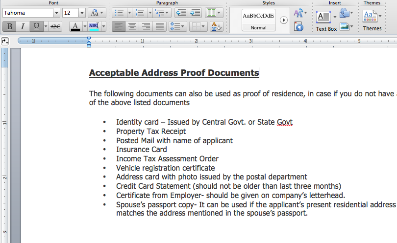
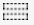

# 서신 만들기{#create-correspondence}

## 서신 만들기 사용자 인터페이스에서 서신 만들기 {#create-correspondence-in-the-create-correspondence-user-interface}

[편지 템플릿이 Correspondence Management](../../forms/using/create-letter.md)에 작성되면 최종 사용자/에이전트/클레임 조정자는 서신 작성 사용자 인터페이스에서 편지를 열고 데이터를 입력하고, 콘텐츠를 설정하고, 첨부 파일을 관리하여 서신을 작성할 수 있습니다. 마지막으로, 청구 조정자나 에이전트는 미리 보기 모드에서 컨텐츠를 관리하고 편지를 제출할 수 있습니다.

### 서신 미리 보기 {#preview-a-correspondence}

다음 단계를 사용하여 미리 볼 문자를 선택합니다.

1. 문자 페이지에서 **선택**&#x200B;을 누릅니다.
1. 해당 문자를 탭하여 선택합니다.

   

   문자 선택

1. 데이터 사전 기반 문자의 경우 **미리 보기** > **미리 보기**&#x200B;를 선택합니다. 또는 비 데이터 사전 기반 문자의 경우 **미리 보기**&#x200B;를 선택합니다. 편지 위에 마우스를 놓고(선택하지 않고) 편지 미리 보기 아이콘을 탭하여 미리 볼 수도 있습니다.

   >[!NOTE]
   >
   >데이터 사전이 편지에 연결되어 있지 않으면 편지 미리 보기가 열립니다. 그렇지 않으면 문자가 데이터 사전을 기반으로 하는 경우, 서신 관리에서는 미리 보기 메뉴에 미리 보기 및 사용자 지정 옵션이 표시되고 두 옵션 중 하나를 선택할 수 있습니다. 테스트 데이터를 데이터 사전에 연결할 수도 있습니다. [데이터 사전이 테스트 데이터](../../forms/using/data-dictionary.md#p-working-with-test-data-p)를 연결한 다음 미리 보기 옵션을 선택하면 테스트 데이터가 채워져 일반 미리 보기가 열립니다.

1. 미리 보는 동안 서신 렌더링을 수행하려면 관리자 또는 다음 그룹 중 하나의 일부여야 합니다.

   * forms 사용자(작성자 인스턴스에서 미리 보기)
   * cm-agent-users(게시 인스턴스의 렌디션용)

   필요한 권한이 없는 경우 관리자에게 적절한 액세스 권한을 요청하십시오. 사용자를 그룹에 만들고 추가하는 방법에 대한 자세한 내용은 [그룹에 사용자 또는 그룹 추가](/help/sites-administering/security.md)를 참조하십시오. 적절한 권한이 없는 경우 404 오류 페이지가 표시됩니다.

1. **미리 보기** > **사용자 지정**&#x200B;을 선택한 경우 대화 상자가 열립니다. 대화 상자에서 데이터 사전에 해당하는 데이터 파일을 선택하여 문자를 미리 본 다음 **미리 보기**&#x200B;를 선택합니다. 데이터 파일은 특정 문자의 데이터 사전을 기반으로 만들어집니다. 데이터 파일에 대한 자세한 내용은 [데이터 사전](../../forms/using/data-dictionary.md#p-working-with-test-data-p)을 참조하십시오.

   

1. 편지 HTML 미리 보기(모바일 양식 미리 보기)가 기본적으로 데이터 탭에 초점이 맞춰져 열립니다.

   모바일 양식 및 모바일 양식 지원 기능에 대한 자세한 내용은 [모바일 Forms과 PDF forms 간의 기능 차별화](https://helpx.adobe.com/livecycle/help/mobile-forms/feature-differentiation-mobile-forms-pdf.html)를 참조하십시오.

   세 개의 탭이 있습니다.데이터, 컨텐츠 및 첨부 파일 데이터 요소(자리 표시자 변수 및 레이아웃 필드)가 없으면 문자가 콘텐츠 탭이 표시된 채 직접 열립니다. 첨부 파일 탭은 첨부 파일이 있거나 라이브러리 액세스가 활성화된 경우에만 사용할 수 있습니다.

   >[!NOTE]
   >
   >편지 미리 보기의 HTML 또는 PDF 변환 모드 간을 전환하는 방법에 대한 자세한 내용은 [편지](#changerenditionmode)의 변환 모드 변경 을 참조하십시오. 서신 관리 및 AEM의 PDF 지원에 대한 자세한 내용은 [NPAPI 브라우저 플러그인의 중단과 그 영향](https://helpx.adobe.com/aem-forms/kb/discontinuation-of-npapi-plugins-impact-on-aem-forms.html) 및 [PDF forms을 HTML5 Forms으로](https://helpx.adobe.com/aem-forms/kb/pdf-forms-to-html5-forms.html)을 참조하십시오.

### 데이터 입력 {#enterdata}

데이터 탭에서 사용 가능한 레이아웃 필드와 자리 표시자를 채웁니다.

1. 필요에 따라 필드에 데이터 및 콘텐츠 변수를 입력합니다. 별표(*)로 표시된 모든 필수 필드를 채워 **Submit** 단추를 활성화합니다.

   HTML 문자 미리 보기에서 데이터 필드 값을 탭하여 데이터 탭에서 해당 데이터 필드를 강조 표시합니다.

    

### 컨텐츠 관리 {#managecontent}

콘텐츠 탭에서 편지에 문서 조각 및 콘텐츠 변수와 같은 콘텐츠를 관리합니다.

1. **컨텐츠**&#x200B;를 선택합니다. 서신 관리에는 편지에 대한 콘텐츠 탭이 표시됩니다.

   

1. 필요에 따라 컨텐츠 탭에서 컨텐츠 모듈을 편집합니다. 컨텐츠 계층 구조에서 관련 컨텐츠 모듈에 초점을 맞추기 위해 편지 미리 보기에서 관련 라인 또는 단락을 탭하거나 컨텐츠 계층 구조에서 바로 컨텐츠 모듈을 탭할 수 있습니다.

   예를 들어, 아래 그래픽에서 &quot;We have reviewed...&quot; 행이 선택되고 관련 컨텐츠 모듈이 컨텐츠 탭에서 선택됩니다.

   

   콘텐츠 또는 데이터 탭의 HTML 문자 미리 보기 왼쪽 상단에 있는 선택한 모듈 강조 표시( )를 탭하여 편지 미리 보기에서 관련 텍스트, 단락 또는 데이터 필드를 선택하면 콘텐츠/데이터 모듈로 이동하는 기능을 비활성화하거나 활성화할 수 있습니다.

   서신 만들기 사용자 인터페이스의 여러 모듈에 사용할 수 있는 작업에 대한 자세한 내용은 서신 사용자 만들기 인터페이스](#actions-and-info-available-in-the-create-correspondence-content-tab)에서 사용할 수 있는 작업 및 정보를 참조하십시오.[

1. 컨텐츠 모듈을 찾으려면 찾기 필드를 사용합니다. 서신 시 검색할 컨텐츠 모듈의 전체 또는 일부 이름 또는 제목을 입력합니다.
1. 목록, 텍스트, 조건 또는 대상 영역 앞에 있는 표시 아이콘( )을 탭하여 편지에 표시하거나 숨깁니다.
1. 인라인 또는 편집 가능한 텍스트 모듈을 편집하려면 관련 **편집** 아이콘( )을 누르거나 편지 미리 보기에서 관련 텍스트 모듈을 두 번 클릭합니다.

   텍스트를 편집하고 서식을 지정할 텍스트 편집기가 표시됩니다.

   브라우저의 기본 맞춤법 검사기에서 텍스트 편집기에서 맞춤법을 검사합니다. 맞춤법 및 문법 검사를 관리하기 위해 브라우저의 맞춤법 검사기 설정을 편집하거나 브라우저 플러그인/추가 기능을 설치하여 맞춤법 및 문법을 검사할 수 있습니다.

   텍스트 편집기의 다양한 키보드 단축키를 사용하여 텍스트를 관리, 편집 및 서식을 지정할 수도 있습니다. 서신 관리 키보드 단축키의 [텍스트 편집기](/help/forms/using/keyboard-shortcuts.md#correspondence-management) 키보드 단축키에 대한 자세한 정보.

   

   문서의 다른 응용 프로그램에 있는 하나 이상의 텍스트 단락을 다시 사용할 수 있습니다. MS Word, HTML 페이지 또는 기타 애플리케이션과 같은 텍스트를 직접 복사하여 붙여넣을 수 있습니다.

   하나 이상의 텍스트 단락을 편집 가능한 텍스트 모듈에 복사하여 붙여넣을 수 있습니다. 예를 들어 다음과 같이 거주할 수 있는 증명에 대한 글머리 기호 목록이 있는 MS Word 문서가 있을 수 있습니다.

   

   MS Word 문서의 텍스트를 직접 복사하여 편집 가능한 텍스트 모듈에 붙여넣을 수 있습니다. 글머리 기호 목록, 글꼴, 텍스트 색상 등의 서식이 텍스트 모듈에 유지됩니다.

   

   >[!NOTE]
   >
   >그러나 붙여넣은 텍스트의 형식에는 [제한 사항](https://helpx.adobe.com/aem-forms/kb/cm-copy-paste-text-limitations.html)이 있습니다.

   Tab 키를 사용하여 편지의 텍스트와 숫자를 들여쓸 수 있습니다. 예를 들어 Tab 키를 사용하여 목록의 여러 텍스트 열을 표 형식으로 정렬할 수 있습니다.

   

   예:Tab 키를 사용하여 여러 텍스트 열을 표 형식으로 정렬

   >[!NOTE]
   >
   >텍스트 모듈 및 문자의 탭 간격 설정에 대한 자세한 내용은 [텍스트](https://helpx.adobe.com/aem-forms/kb/cm-tab-spacing-limitations.html)을 정렬하기 위한 탭 간격 사용에 대한 자세한 내용을 참조하십시오.

1. 필요한 경우 서신에 특수 문자를 삽입합니다. 예를 들어 특수 문자 팔레트를 사용하여 삽입할 수 있습니다.

   * 통화 기호(예:, ¥, £)
   * ∑, √, ∂ 및 과 같은 수학 기호
   * 및‟과 같은 구두점 기호

   

   서신 관리는 210개의 특수 문자를 지원합니다. 관리자는 [사용자 지정](../../forms/using/custom-special-characters.md)을 통해 추가/사용자 지정 특수 문자에 대한 지원을 추가할 수 있습니다.

1. 편집 가능한 인라인 모듈에서 텍스트의 일부를 강조 표시하려면 텍스트를 선택하고 [강조 색상]을 탭합니다.

   

   기본 색상 팔레트에 있는 기본 색상 `**[A]**`을 직접 탭하거나 슬라이더 `**[B]**`을 사용하여 **선택**&#x200B;을 탭하여 해당 색상 음영을 선택할 수 있습니다.

   원할 경우 고급 탭으로 이동하여 적절한 색조, 밝기 및 채도 `**[C]**`를 선택하여 정확한 색상을 만든 다음 선택 `**[D]**` 을 탭하여 색상을 적용하여 텍스트를 강조 표시할 수도 있습니다.

   

1. 적절한 내용과 형식을 변경하고 **저장**&#x200B;을 탭합니다. 편집 가능한 텍스트 모듈 간을 이동하려면 ( )을 누르거나, **저장 및 다음**&#x200B;을 눌러 변경 사항을 저장하고 다음 편집 가능한 텍스트 모듈로 이동합니다.
1. 각 분기에 대해 채워지지 않은 변수도 표시됩니다. 채우지 않은 변수가 없으면 채우지 않은 변수가 0으로 표시됩니다. 채워지지 않은 변수가 있는 경우 분기를 탭하여 확장하고 채워지지 않은 변수를 찾을 수 있습니다. 컨텐츠 도구 모음을 사용하여 컨텐츠를 삭제하고, 컨텐츠를 늘리거나 줄이며, 컨텐츠 앞/뒤에 페이지 나누기를 삽입합니다.

   목록 및 조건에 속하더라도 데이터 모듈 위 및 아래에 페이지 나누기를 삽입할 수 있습니다.

1. 컨텐츠 변수 열기/닫기( )를 탭하여 컨텐츠 변수를 열고 적절하게 채웁니다.
1. 채우지 않은 변수를 올바르게 입력했으면 채우지 않은 변수의 수가 0으로 설정됩니다.

   서신 사용자 인터페이스에서 하나 이상의 변수를 포함하는 모든 모듈의 계층 구조의 각 수준에 채워진 변수 카운트가 표시됩니다. 모듈에 채워진 변수가 있으면 개수가 변수, 모듈, 대상 영역 및 문자 템플릿 수준에 표시됩니다.

   채워지지 않은 변수 수는 다음과 같습니다.

   * 보호되지 않은 데이터 사전 및 자리 표시자 변수만 사용됩니다. 변수 개수에 레이아웃 또는 보호된 데이터 사전 변수가 포함되지 않습니다.
   * 필수 필드입니다.
   * 레이아웃 필드가 필수이고 사용자에게 바인딩된 경우 이러한 필드를 사용할 수 있습니다.
   * 고유 변수 인스턴스만. 모듈, 대상 영역 또는 문자 템플릿에 동일한 변수의 인스턴스가 두 개 이상 있는 경우 개수가 1(하나)으로 표시됩니다. 그러나 각 인스턴스에 대해 카운트가 1로 표시됩니다.

   채워지지 않은 변수 개수는 선택되지 않은 모듈을 포함하지 않습니다. 모듈이 편지 템플릿에 포함되어 있지만 편지에 없는 경우 이 모듈의 입력되지 않은 변수에 대한 카운트가 표시되지 않습니다.

   대상 영역, 모듈 및 변수에 대해 문자 템플릿의 각 개체 오른쪽에 개수가 표시됩니다. 그러나 전체 템플릿의 경우 서신 만들기 상태 표시줄에 카운트가 표시됩니다.

   편지 템플릿의 모듈은 아래 설명된 대로 채워지지 않은 변수 수를 표시합니다.

   * **** 텍스트입력되지 않은 고유한 자리 표시자 변수와 텍스트 모듈에 포함된 데이터 사전 요소의 합계를 표시합니다.
   * **** 조건조건에 포함된 채워지지 않은 고유한 조건 변수와 결과 모듈에 포함된 변수의 합계를 표시합니다.
   * **** 목록목록에 지정된 모듈에 포함된 모든 고유 미입력 변수의 합계를 표시합니다.
   * **Target** 영역대상 영역에 지정된 모듈에 포함된 모든 채워진 고유 변수의 합계를 표시합니다.

   기본값이 있는 변수와 관련하여 다음 사항을 참고하십시오.

   * 부울 변수 필드는 기본적으로 *false*&#x200B;입니다. 하지만 변수는 채워지지 않은 것으로 간주됩니다. 이것은 변수 카운트에 값이 *false*&#x200B;인 모든 부울 변수 필드가 포함됨을 의미합니다.

   * 숫자 변수 필드는 기본적으로 *0(영)*&#x200B;입니다. 하지만 변수는 채워지지 않은 것으로 간주됩니다. 이것은 변수 카운트가 값이 *0(영)*&#x200B;인 모든 숫자 변수 필드를 포함함을 의미합니다.

#### 서신 컨텐츠 만들기 탭 {#actions-and-info-available-in-the-create-correspondence-content-tab}에서 사용할 수 있는 작업 및 정보

**대상 영역**

* 빈 행 삽입:새 빈 행을 삽입합니다.
* 인라인 텍스트 삽입:새 텍스트 모듈을 삽입합니다.
* 주문 잠금(정보):컨텐츠의 순서를 변경할 수 없음을 나타냅니다.
* 입력되지 않은 값(정보):대상 영역에서 채워지지 않은 변수의 수를 나타냅니다.

**모듈**

* 선택(눈 모양 아이콘):문자에서 모듈을 포함\제외합니다.
* 글머리 기호 건너뛰기(목록 모듈 및 하위 모듈에 적용 가능):특정 모듈에서 글머리 기호를 건너뜁니다.
* 이전 페이지 브레이크(대상 영역의 하위 모듈에 적용 가능):모듈 앞에 페이지 나누기를 삽입합니다.
* 페이지 브레이크 후(대상 영역의 하위 모듈에 적용 가능):모듈 앞에 페이지 나누기를 삽입합니다.
* 입력되지 않은 값(정보):대상 영역에서 채워지지 않은 변수의 수를 나타냅니다.
* 편집(텍스트 모듈만):텍스트 모듈을 편집할 리치 텍스트 편집기를 엽니다.
* 데이터 패널(텍스트 및 조건 모듈):모듈의 모든 변수를 엽니다.

**목록 모듈**

* 빈 행 삽입:새 빈 행을 삽입합니다.
* 컨텐츠 라이브러리:목록에 모듈을 추가할 컨텐츠 라이브러리를 엽니다.
* 목록 설정(중첩된 목록만):
* 주문 잠금(정보):목록 항목의 순서를 변경할 수 없음을 나타냅니다.

### 첨부 파일 관리 {#manage-attachments}

1. **첨부 파일**&#x200B;을 선택합니다. 편지 템플릿을 만드는 동안 설정된 대로 서신 관리에서 사용 가능한 첨부 파일을 표시합니다.
1. 보기 아이콘을 탭하여 첨부 파일과 함께 첨부 파일을 제출하지 않도록 선택할 수 있으며 첨부 파일에서 십자를 탭하여 편지에서 삭제할 수 있습니다. 지정된 첨부 파일의 경우 편지 템플릿을 생성하는 동안 [필수]로 보기 및 삭제 아이콘이 비활성화됩니다.
1. 라이브러리 액세스( ) 아이콘을 탭하여 콘텐츠 라이브러리에 액세스하여 DAM 자산을 첨부 파일로 삽입합니다.

   >[!NOTE]
   >
   >Library Access 아이콘은 편지를 작성하는 동안 라이브러리 액세스 권한만 사용할 수 있습니다.

1. 서신 작성 중에 첨부 파일의 순서가 잠기지 않은 경우 첨부 파일을 선택하고 아래쪽 및 위쪽 화살표를 탭하여 첨부 파일의 순서를 변경할 수 있습니다.

   자세한 내용은 [첨부 파일 배달](#attachmentdelivery)을 참조하십시오.

### 미리 보기에서 컨텐츠를 관리하고 {#manage-content-in-preview-and-submit-the-letter} 편지를 제출합니다.

레이아웃과 콘텐츠 관련 변경 작업을 수행하여 문자가 의도한 대로 보이도록 하고 다양한 게시물 프로세스에 제출할 수 있습니다.

1. 편지에서 편집 가능한 모든 컨텐츠를 강조 표시하려면 **편집 가능한 섹션 강조 표시**&#x200B;를 누릅니다.

   편집 가능한 문자의 내용은 회색 배경으로 강조 표시됩니다.

   

1. 필요에 따라 컨텐츠 탭에서 컨텐츠 모듈을 편집합니다. 컨텐츠 계층 구조에서 관련 컨텐츠 모듈에 초점을 맞추기 위해 편지 미리 보기에서 관련 라인 또는 단락을 탭하거나 컨텐츠 계층 구조에서 바로 컨텐츠 모듈을 탭할 수 있습니다.

   예를 들어 &quot;To allow us to access...&quot; 라인이 이 아래 그래픽에서 선택되고 컨텐츠 탭에서 해당 컨텐츠 모듈이 선택됩니다.

   컨텐츠 ( )에서 선택한 모듈 강조 을 탭하여 편지 미리 보기에서 관련 텍스트, 단락 또는 데이터 필드를 탭하면 컨텐츠 탭에서 컨텐츠 모듈을 강조 표시하는 기능을 비활성화하거나 활성화할 수 있습니다.

   서신 만들기 사용자 인터페이스의 여러 모듈에 사용할 수 있는 작업에 대한 자세한 내용은 서신 사용자 만들기 인터페이스](#actions-and-info-available-in-the-create-correspondence-content-tab)에서 사용할 수 있는 작업 및 정보를 참조하십시오.[

1. 편지에 페이지 나누기를 추가하려면, 페이지 나누기를 삽입할 위치를 탭하고 다음 페이지 나누기 전에 또는 다음 페이지 나누기( )를 선택합니다.

   편지에 명시적 페이지 나누기 자리 표시자가 삽입됩니다. 명시적 페이지 나누기가 편지에 미치는 영향을 보려면 병합된 PDF 미리 보기를 참조하십시오.

   >[!NOTE]
   >
   >모바일 양식에서는 페이지 나누기를 지원하지 않으므로 머리글과 바닥글은 한 번만 표시됩니다. 그러나 레이아웃에 머리글 및 바닥글을 명시적으로 설정하여(페이지당) 모바일 양식 미리 보기에 표시할 수 있습니다. 또한 편지의 빈 페이지가 있을 경우 모바일 양식 미리 보기에 표시되지 않습니다.

   

1. 나중에 계속 작업할 수 있는 초안으로 편지를 저장하려면 초안으로 저장을 누릅니다. 이 옵션을 사용하려면 문자가 [published](../../forms/using/publishing-unpublishing-forms.md#publishanasset)여야 합니다. 자세한 내용은 [초안 저장 및 편지 인스턴스 제출](#savingdrafts)에서 초안 인스턴스를 참조하십시오.

   

   편지 인스턴스 ID가 있는 초안 문자 이름 대화 상자가 나타납니다. 선택적으로 이 ID를 편집할 수 있습니다. 편지 ID를 메모한 다음 **완료**&#x200B;를 탭합니다. 나중에 이 ID를 사용하여 초안 문자](submit-letter-topostprocess.md#reloaddraft)를 다시 로드할 수 있습니다.[

1. 편지를 제출할 때 정확한 레이아웃과 페이지 나누기가 있는 병합된 PDF로 미리 보려면 ( ) 미리 보기 를 누릅니다.

   편지는 플랫 PDF로 표시됩니다. 병합된 PDF는 정확한 글꼴, 줄바꿈 및 편지 레이아웃과 함께 제출될 문자의 정확한 표현입니다.

   >[!NOTE]
   >
   >Mozilla Firefox 및 HTML 표현물 유형을 사용하는 경우, 편자를 병합된 PDF로 미리 보려면 Acrobat 플러그인이 아닌 기본 브라우저 플러그인을 사용해야 합니다. 기본 브라우저 플러그인을 선택하려면 Mozilla Firefox의 설정으로 이동하고 컨텐츠 유형 PDF에 대해 Firefox에서 미리 보기 를 선택합니다.

1. 병합된 PDF 미리 보기가 만족스러우면 **제출**&#x200B;을 눌러 편지를 제출하십시오. 또는 문자를 변경하려면 **미리 보기 종료**&#x200B;를 탭하여 문자의 Create Correspondence UI 미리 보기로 돌아가서 문자를 변경합니다. 제출 을 탭할 때 게시 인스턴스에서 편지 인스턴스 관리 구성이 활성화되면 전송 편지 인스턴스가 생성됩니다.

   자세한 내용은 초안 저장 및 편지 인스턴스 제출에서 초안 인스턴스를 참조하십시오.

   편지를 초안으로 저장하여 나중에 변경할 수도 있습니다.

   필요한 변경 작업을 수행한 후 HTML5 미리 보기에서 편지를 제출하거나 미리 보기 를 다시 탭하여 병합된 PDF 출력을 검토할 수 있습니다.

   HTML5 양식과 PDF forms 간의 차이에 대한 자세한 내용은 [HTML5 양식과 PDF forms 간의 기능 차별화](../../forms/using/feature-differentiation-html5-forms-pdf-forms.md)를 참조하십시오.

## 초안 저장 및 편지 인스턴스 제출 {#savingdrafts}

서신 만들기 사용자 인터페이스에서 편지를 렌더링하면 편지를 보이는 대로 저장할 수 있습니다.

저장할 수 있는 문자 인스턴스에는 두 가지 유형이 있습니다.초안 인스턴스 및 제출 인스턴스입니다.

* **초안 인스턴스**:초안 인스턴스는 미리 보고 있는 문자의 현재 상태를 캡처합니다. 초안 인스턴스를 저장하려면 먼저 편지 및 편지 참조가 있는 모든 자산이 게시됨 상태인지 확인합니다. 편지 게시에 대한 자세한 내용은 [자산 게시](../../forms/using/publishing-unpublishing-forms.md#publishanasset)를 참조하십시오. 편지를 초안으로 저장하려면 먼저 편지를 게시 해야 합니다. 편지를 게시할 때 편지 버전, 종속 자산 및 데이터가 해당 시점에 만들어지기 때문입니다. 게시된 편지 버전은 사용자나 다른 사용자가 편집할 수 없으며 게시된 버전과 예기치 않은 불일치없이 나중에 복원할 수 있습니다. 나중에 이 인스턴스로 돌아가서 를 나간 곳에서 계속 진행할 수 있습니다.

* **제출 인스턴스**:제출 인스턴스는 제출되는 편지 상태를 캡처합니다. 전송 인스턴스는 게시 처리 후 편지 인스턴스의 PDF 상태를 서신 만들기 사용자 인터페이스에서 사용자가 입력한 데이터와 함께 저장합니다.

이러한 인스턴스는 게시 인스턴스에서 편지를 보고 있는 경우에만 저장할 수 있습니다. 기본적으로 인스턴스 저장은 꺼져 있습니다. 편지 인스턴스 저장을 활성화하려면 다음 단계를 수행하십시오.

1. AEM에서 다음 URL을 사용하여 서버에 대한 Adobe Experience Manager 웹 콘솔 구성 을 엽니다.https://&lt;server>:&lt;port>/&lt;contextpath>/system/console/configMgr
1. **[!UICONTROL 서신 관리 구성]**&#x200B;을 찾아 클릭합니다.
1. 게시&#x200B;]**구성에서**[!UICONTROL &#x200B;편지 인스턴스 관리 를 선택한 다음 **[!UICONTROL 저장]**&#x200B;을 클릭합니다.

편지 인스턴스 저장을 켜면 편지 인스턴스를 저장할 위치를 선택할 수 있습니다. 편지 인스턴스를 저장하는 두 가지 옵션이 있습니다.로컬 저장 또는 원격 저장.

### 로컬 저장 {#local-save}

편지 인스턴스는 게시 인스턴스에 저장되고 작성자 인스턴스에서 다시 복제됩니다.

### 원격 저장 {#remote-save}

이 옵션은 일반적으로 회사 방화벽 외부의 경우 게시 인스턴스에 사용자 데이터를 저장할 수 없는 문제가 있는 사용자용입니다. 원격 저장을 설정하면 편지 인스턴스가 게시 인스턴스에 저장되지 않지만 LiveCycle 클라이언트 SDK 구성을 통해 지정된 처리 작성자에 원격으로 저장됩니다.

#### 원격 저장 사용 {#enable-remote-save}

1. AEM에서 다음 URL을 사용하여 서버에 대한 Adobe Experience Manager 웹 콘솔 구성 을 엽니다.`https://<server>:<port>/<contextpath>/system/console/configMgr`
1. **[!UICONTROL 서신 관리 구성]**&#x200B;을 검색하고 클릭합니다.
1. **[!UICONTROL 원격 저장]** 구성을 찾은 다음 **[!UICONTROL 저장]**&#x200B;을 클릭합니다.

#### 처리 작성자 설정 지정 {#specify-processing-author-settings}

1. AEM에서 다음 URL을 사용하여 서버에 대한 Adobe Experience Manager 웹 콘솔 구성 을 엽니다.`https://<server>:<port>/<contextpath>/system/console/configMgr`

   

1. 이 페이지에서 Adobe LiveCycle 클라이언트 SDK 구성 을 찾아 클릭하여 확장합니다.

1. 처리 서버 URL에 LiveCycle 서버의 이름을 입력하고 로그인 정보를 제공한 다음 **저장**&#x200B;을 클릭합니다.

   

1. 필요한 경우 서버에 액세스할 사용자 이름과 암호를 설정합니다.

#### 첨부 파일 게재 {#attachmentdelivery}

* 편지 첨부 파일은 PDF에서 사후 프로세스를 사용할 수 있으며 편지 제출 후 작성됩니다.
* 편지를 서버측 API를 대화형 또는 비대화형 PDF로 사용하여 렌더링하면 렌더링된 PDF에 첨부 파일이 PDF 첨부 파일로 포함됩니다.
* 편지 템플릿과 연결된 사후 프로세스가 서신 작성 사용자 인터페이스를 사용하여 제출 또는 작성 서신 작업의 일부로 로드되면 첨부 파일은 AttachmentDocs 매개 변수에서 List&lt;com.adobe.idp.Document>로 전달됩니다.
* 전자 메일 및 인쇄와 같은 기본 제공 게재 메커니즘도 생성된 서신의 PDF와 함께 첨부 파일을 제공합니다.

## 편지 미리 보기 변환 모드:모바일 양식 미리 보기 및 PDF 미리 보기 {#rendition-modes-of-letter-preview-mobile-forms-preview-and-pdf-preview}

AEM Forms 서신 관리에서는 서신 작성 UI에서 편지를 HTML로 표시합니다. 하지만 서신 관리에서는 여전히 HTML 미리 보기 대신 PDF 미리 보기로 되돌리는 것을 지원합니다. 미리 보기의 HTML과 PDF 모드 간을 전환하는 방법에 대한 자세한 내용은 [편지](#changerenditionmode)의 변환 모드 변경 을 참조하십시오.

다음은 HTML 및 PDF 미리 보기에서 사용할 수 있는 이점 및 기능입니다.

**모바일 양식/HTML 미리 보기의 이점**

* **데이터 필드 값을 탭하여 해당 데이터 필드를 강조 표시합니다**.서신 만들기 사용자 인터페이스에서 편지에 있는 데이터 필드 값을 탭하여 데이터 탭의 해당 데이터 필드를 강조 표시할 수 있습니다. 자세한 내용은 [데이터 입력](#enterdata)을 참조하십시오.

* **브라우저 지원**:브라우저는 NPAPI에 대한 지원을 단계적으로 철회하며 이는 편지의 PDF 미리 보기에 영향을 줍니다. 문자의 HTML/모바일 양식 미리 보기는 영향을 받지 않습니다.
* **편지에서 편집 가능한 컨텐츠를 강조 표시합니다**.서신 작성 사용자 인터페이스에서 편집 가능한 컨텐츠 강조 표시 를 탭하여 문자의 편집 가능한 모든 컨텐츠를 회색으로 강조 표시할 수 있습니다. 자세한 내용은 [콘텐츠 관리](#managecontent)를 참조하십시오.

`<li>` `<li>Benefits of HTML preview  <ul>   <li>Right to left</li>   <li>NPAPI</li>   <li>Highlight Editable Content</li>  </ul> </li>` `<li>Benefits of PDF preview  <ul>   <li>Page Break</li>   <li>Final Preview</li>  </ul> </li>`
`<li>` `<li>Benefits of HTML preview  <ul>   <li>Right to left</li>   <li>NPAPI</li>   <li>Highlight Editable Content</li>  </ul> </li>` `<li>Benefits of PDF preview  <ul>   <li>Page Break</li>   <li>Final Preview</li>  </ul> </li>`  **PDF의 이점 미리 보기**

* **페이지 나누기**:PDF 미리 보기에서는 편지의 페이지 나누기가 출력에 미치는 영향을 정확히 확인할 수 있습니다.
* **최종 미리 보기**:PDF 미리 보기에서는 문자가 출력에 나타나도록 문자의 정확한 서식과 모양을 볼 수 있습니다.

PDF forms의 스크립팅 지원에 대한 자세한 내용은 [스크립팅 지원](https://help.adobe.com/en_US/livecycle/11.0/ScriptingSupport/index.html)을 참조하십시오.

HTML5 양식의 스크립팅 지원에 대한 자세한 내용은 [HTML5 양식에 대한 스크립팅 지원](/help/forms/using/scripting-support.md)을 참조하십시오.

### 편지 변환 모드 변경 {#changerenditionmode}

기본적으로 서신 작성 UI는 HTML 또는 모바일 양식을 사용하여 편지 미리 보기를 렌더링합니다. 모바일 양식 미리 보기에는 브라우저의 기본 플러그인을 사용하고 추가 플러그인이 필요 없으므로 브라우저에서 렌더링하는 데 문제가 없습니다. 편지 미리 보기 모드를 PDF로 변경할 수 있습니다. 그러나 브라우저 제한으로 인해 편지의 대화형 PDF 미리 보기의 여러 기능에 대한 문제가 발생할 수 있습니다.

편지 미리 보기와의 브라우저 호환성에 대한 자세한 내용은 [NPAPI 브라우저 플러그인의 중단 및 그 영향](https://helpx.adobe.com/aem-forms/kb/discontinuation-of-npapi-plugins-impact-on-aem-forms.html)을 참조하십시오.

문자의 미리 보기 모드를 변경하려면 다음 단계를 완료하십시오.

1. `https://[system]:'port'/system/console/configMgr` 로 이동한 다음, 필요한 경우 관리자로 로그인합니다.
1. **[!UICONTROL 서신 관리 구성]** > **[!UICONTROL 변환 유형]**&#x200B;으로 이동하고 **HTML 표현물**(기본값) 또는 **PDF 표현물**&#x200B;을 선택합니다.
1. **[!UICONTROL 저장]**&#x200B;을 클릭합니다.
