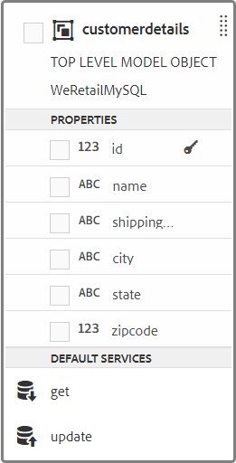

# Tutorial: Create form data model {#tutorial-create-form-data-model}

이 자습서는 첫 번째 적응형 [양식 만들기 시리즈의](../../forms/using/create-your-first-adaptive-form.md) 단계입니다. 전체 자습서 사용 사례를 이해하고, 실행하고, 시연하기 위해 시리즈를 시간 순서대로 따르는 것이 좋습니다.

## 자습서 정보 {#about-the-tutorial}

AEM Forms 데이터 통합 모듈을 사용하면 AEM 사용자 프로필, RESTful 웹 서비스, SOAP 기반 웹 서비스, OData 서비스 및 관계형 데이터베이스와 같은 서로 다른 백엔드 데이터 소스에서 양식 데이터 모델을 만들 수 있습니다. 데이터 모델 개체 및 서비스를 양식 데이터 모델로 구성하고 적응형 양식과 연결할 수 있습니다. 적응형 양식 필드는 데이터 모델 개체 속성에 바인딩됩니다. 이 서비스를 사용하면 적응형 양식을 미리 채우고 제출된 양식 데이터를 다시 데이터 모델 개체에 쓸 수 있습니다.

양식 데이터 통합 및 양식 데이터 모델에 대한 자세한 내용은 AEM [Forms 데이터 통합을 참조하십시오](../../forms/using/data-integration.md).

이 자습서에서는 양식 데이터 모델을 준비, 생성, 구성 및 적응형 양식과 연결하는 단계를 안내합니다. 이 튜토리얼의 끝에서 다음 작업을 수행할 수 있습니다.

* [MySQL 데이터베이스를 데이터 소스로 구성](#config-database)
* [MySQL 데이터베이스를 사용하여 양식 데이터 모델 만들기](#create-fdm)
* [양식 데이터 모델 구성](#config-fdm)
* [양식 데이터 모델 테스트](#test-fdm)

양식 데이터 모델은 다음과 비슷합니다.

**A.** 구성된 데이터 소스 **B.** 데이터 소스 스키마 **C.** 사용 가능한 서비스 **D.** 데이터 모델 개체 **E.** 구성된 서비스

## 전제 조건 {#prerequisites}

시작하기 전에 다음을 확인하십시오.

* 첫 번째 적응형 양식 만들기의 전제 조건 섹션에 명시된 샘플 데이터가 [있는 MySQL 데이터베이스](../../forms/using/create-your-first-adaptive-form.md)
* JDBC 데이터베이스 드라이버 번들로 묶음에 설명된 대로 MySQL JDBC 드라이버용 [OSGi 번들](/help/sites-developing/jdbc.md#bundling-the-jdbc-database-driver)
* 첫 번째 튜토리얼에서 설명한 적응형 [양식 만들기](/help/forms/using/create-adaptive-form.md)

## 1단계:MySQL 데이터베이스를 데이터 소스로 구성 {#config-database}

양식 데이터 모델을 만들도록 여러 유형의 데이터 소스를 구성할 수 있습니다. 이 자습서의 경우 샘플 데이터로 구성되고 채워진 MySQL 데이터베이스를 구성합니다. 지원되는 다른 데이터 소스에 대한 자세한 내용 및 구성 방법은 AEM Forms [데이터 통합을 참조하십시오](../../forms/using/data-integration.md).

MySQL 데이터베이스를 구성하려면 다음을 수행합니다.

1. MySQL 데이터베이스에 대한 JDBC 드라이버를 OSGi 번들로 설치합니다.

   1. AEM Forms 작성자 인스턴스에 관리자로 로그인하고 AEM 웹 콘솔 번들로 이동합니다. 기본 URL은 https://localhost:4502/system/console/bundles [입니다](https://localhost:4502/system/console/bundles).

   1. 설치/ **업데이트를 누릅니다**. [ **번들 업로드/설치** ] 대화 상자가 나타납니다.

   1. 파일 **선택을** 눌러 MySQL JDBC 드라이버 OSGi 번들을 찾아 선택합니다. [ **번들 시작** 및 패키지 **새로 고침**]을 선택하고 **설치 또는 업데이트를**&#x200B;누릅니다. Oracle Corporation의 MySQL용 JDBC 드라이버가 활성화되어 있는지 확인합니다. 드라이버가 설치되어 있습니다.

1. MySQL 데이터베이스를 데이터 소스로 구성:

   1. https://localhost:4502/system/console/configMgr의 AEM 웹 콘솔로 [이동합니다](https://localhost:4502/system/console/configMgr).
   1. Apache **Sling 연결 풀링된 DataSource 구성을** 찾습니다. 을 눌러 편집 모드에서 구성을 엽니다.
   1. 구성 대화 상자에서 다음 세부 정보를 지정합니다.

      * **데이터 소스 이름:** 원하는 이름을 지정할 수 있습니다. 예를 들어 WeRetailMySQL **을 지정합니다**.
      * **DataSource 서비스 속성 이름**:DataSource 이름을 포함하는 서비스 속성의 이름을 지정합니다. 데이터 소스 인스턴스를 OSGi 서비스로 등록하는 동안 지정됩니다. 예: **datasource.name**.
      * **JDBC 드라이버 클래스**:JDBC 드라이버의 Java 클래스 이름을 지정합니다. MySQL 데이터베이스의 경우 **com.mysql.jdbc.Driver를 지정합니다**.
      * **JDBC 연결 URI**:데이터베이스의 연결 URL을 지정합니다. 포트 3306 및 스키마 웹 소매에서 실행되는 MySQL 데이터베이스의 경우 URL은 다음과 같습니다. `jdbc:mysql://'server':3306/weretail?autoReconnect=true&useUnicode=true&characterEncoding=utf-8`
      * **사용자 이름:** 데이터베이스의 사용자 이름입니다. JDBC 드라이버를 사용하여 데이터베이스와 연결을 설정해야 합니다.
      * **암호:** 데이터베이스의 암호입니다. JDBC 드라이버를 사용하여 데이터베이스와 연결을 설정해야 합니다.
      * **차입 시 테스트:** [차입시 **테스트] 옵션을** 활성화합니다.
      * **반환 테스트:** 반환 **시 테스트** 옵션을 활성화합니다.
      * **유효성 검사 쿼리:** SQL SELECT 쿼리를 지정하여 풀의 연결을 확인합니다. 쿼리는 하나 이상의 행을 반환해야 합니다. 예를 들어 고객 세부 정보에서 *를 **선택합니다**.
      * **트랜잭션 격리**:값을 READ_COMMITTED로 **설정합니다**.
      다른 속성을 기본값으로  두고 저장을 **탭합니다**.
   다음과 유사한 구성이 만들어집니다.

   

## Step 2: Create form data model {#create-fdm}

AEM Forms는 구성된 데이터 소스로부터 양식 데이터 [모델을](../../forms/using/data-integration.md#main-pars-header-1524967585)만들 수 있는 직관적인 사용자 인터페이스를 제공합니다. 양식 데이터 모델에서 여러 데이터 소스를 사용할 수 있습니다. 사용 사례를 위해 구성된 MySQL 데이터 소스를 사용합니다.

양식 데이터 모델을 만들려면 다음을 수행합니다.

1. AEM 작성자 인스턴스에서 양식 > 데이터 **통합으로** **이동합니다**.
1. Tap **Create** > **Form Data Model**.
1. 양식 데이터 모델 만들기 대화 상자에서 양식 데이터 모델의 **이름을** 지정합니다. 예를 들어 **고객 배송 청구 세부**&#x200B;사항 다음을 **누릅니다**.
1. 데이터 소스 선택 화면에는 구성된 모든 데이터 소스가 나열됩니다. WeRetail **MySQL** 데이터 소스를 선택하고 만들기를 **탭합니다**.

   

고객 **배송 청구 세부 정보** 양식 데이터 모델이 생성됩니다.

## 3단계:양식 데이터 모델 구성 {#config-fdm}

양식 데이터 모델 구성에는 다음이 포함됩니다.

* 데이터 모델 개체 및 서비스 추가
* 데이터 모델 개체에 대한 읽기 및 쓰기 서비스 구성

양식 데이터 모델을 구성하려면 다음을 수행합니다.

1. AEM 작성자 인스턴스에서 양식 > **데이터 통합으로** **이동합니다**. 기본 URL은 https://localhost:4502/aem/forms.html/content/dam/formsanddocuments-fdm [입니다](https://localhost:4502/aem/forms.html/content/dam/formsanddocuments-fdm).
1. 앞서 **만든 고객 배송 청구 세부 정보** 양식 데이터 모델은 여기에 나와 있습니다. 편집 모드에서 엽니다.

   선택한 데이터 소스 **WeRetailMySQL은** 양식 데이터 모델에서 구성됩니다.

   

1. WeRailMySQL 데이터 소스 트리를 확장합니다. 웹 소매 **> 고객 세부 정보****** 스키마에서 데이터 모델을 형성할 데이터 모델 개체 및 서비스를 선택합니다.

   * **데이터 모델 개체**:

      * id
      * 이름
      * shippingAddress
      * 도시
      * 상태
      * 우편 번호
   * **서비스:**

      * get
      * 업데이트
   선택한 **데이터 모델 개체** 및 서비스를 양식 데이터 모델에 추가하려면 선택한 항목 추가를 누릅니다.

   

   >[!NOTE]
   >
   >JDBC 데이터 소스에 대한 기본 get, update 및 insert 서비스는 양식 데이터 모델과 함께 즉시 제공됩니다.

1. 데이터 모델 개체에 대한 읽기 및 쓰기 서비스를 구성합니다.

   1. 사용자 **지정 세부** 데이터 모델 개체를 선택하고 속성 **편집을 누릅니다**.
   1. 읽기 서비스 **드롭다운에서 가져오기를** 선택합니다. customerdetails 데이터 모델 개체의 기본 키인 **id** 인수는 자동으로 추가됩니다. aem_  및 인수를 다음과 같이 구성합니다.

      

   1. 마찬가지로 쓰기 서비스로 **업데이트를** 선택합니다. customerdetails **개체는** 인수로 자동으로 추가됩니다. 인수는 다음과 같이 구성됩니다.

      

      다음과 같이 **id** 인수를 추가하고 구성합니다.

      

   1. 완료를 **눌러** 데이터 모델 개체 속성을 저장합니다. 그런 다음 저장을 **눌러** 양식 데이터 모델을 저장합니다.

      get **** 및 **update** 서비스는 데이터 모델 개체에 대한 기본 서비스로 추가됩니다.

      

1. 서비스 **탭으로** 이동하여 **서비스** 가져오기 **및** 업데이트를구성합니다.

   1. 서비스 **가져오기를** 선택하고 속성 **편집을 누릅니다**. 속성 대화 상자가 열립니다.
   1. 속성 편집 대화 상자에서 다음을 지정합니다.

      * **제목**:서비스의 제목을 지정합니다. 예:배송 주소를 검색합니다.
      * **설명**:서비스의 세부 기능이 포함된 설명을 지정합니다. 예:

         이 서비스는 MySQL 데이터베이스에서 배송 주소 및 기타 고객 세부 사항을 검색합니다.

      * **출력 모델 개체**:고객 데이터가 포함된 스키마를 선택합니다. 예:

         사용자 정의 세부 정보 스키마

      * **반환 배열**:반환 **배열** 옵션을 비활성화합니다.
      * **인수**:ID라는 인수를 **선택합니다**.
      **Done**&#x200B;을 누릅니다. MySQL 데이터베이스에서 고객 세부 정보를 검색하는 서비스가 구성되어 있습니다.

      

   1. 업데이트 **서비스를 선택하고 속성** 편집을 누릅니다 ****. 속성 대화 상자가 열립니다.

   1. 속성 편집 대화 상자에서 다음을 지정합니다.

      * **제목**:서비스의 제목을 지정합니다. 예: 배송 주소 업데이트.
      * **설명**:서비스의 세부 기능이 포함된 설명을 지정합니다. 예:

         이 서비스는 MySQL 데이터베이스의 배송 주소 및 관련 필드를 업데이트합니다.

      * **입력 모델 개체**:고객 데이터가 포함된 스키마를 선택합니다. 예:

         사용자 정의 세부 정보 스키마

      * **출력 유형**:BOOLEAN **을 선택합니다**.

      * **인수**:ID 및 **customerdetails** 인수를 **선택합니다**.
      **Done**&#x200B;을 누릅니다. MySQL 데이터베이스의 고객 세부 사항을 업데이트하기 위한 **업데이트** 서비스가 구성되어 있습니다.

      

양식 데이터 모델의 데이터 모델 개체 및 서비스가 구성됩니다. 이제 양식 데이터 모델을 테스트할 수 있습니다.

## Step 4: Test form data model {#test-fdm}

데이터 모델 개체 및 서비스를 테스트하여 양식 데이터 모델이 제대로 구성되어 있는지 확인할 수 있습니다.

테스트를 실행하려면 다음을 수행합니다.

1. 모델( **Model** ) 탭으로 **이동하여** 사용자 정의 세부 **데이터 모델 개체를 선택한 다음 테스트 모델**&#x200B;개체를누릅니다.
1. 모델 **/서비스 테스트** 창의 모델 **선택** 드롭다운에서 모델 **개체** 읽기를선택합니다.
1. customerdetails **** 섹션에서 구성된 MySQL 데이터베이스에 있는 **id** 인수의 값을 지정하고 테스트를 **누릅니다**.

   지정된 ID와 연결된 고객 세부 정보는 아래와 같이 출력 **섹션에** 가져와 표시됩니다.

   

1. 마찬가지로 Write 모델 개체 및 서비스를 테스트할 수 있습니다.

   다음 예에서 업데이트 서비스는 데이터베이스의 ID 7102715에 대한 주소 세부 사항을 성공적으로 업데이트합니다.

   

   이제 ID 7107215에 대해 읽기 모델 서비스를 다시 테스트하면 아래와 같이 업데이트된 고객 세부 정보를 가져와 표시합니다.

   
