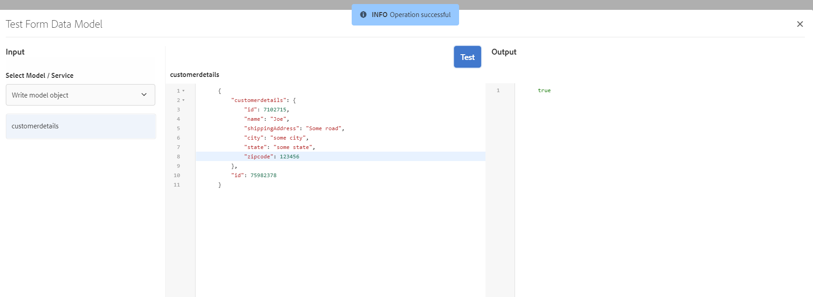

# 자습서: 양식 데이터 모델 만들기 {#tutorial-create-form-data-model}

이 튜토리얼의 단계는 다음과 같습니다. [첫 번째 적응형 양식 만들기](../../forms/using/create-your-first-adaptive-form.md) 시리즈. 전체 자습서 사용 사례를 이해하고, 수행하고, 시연하려면 연대순으로 시리즈를 따르는 것이 좋습니다.

## 튜토리얼 기본 정보 {#about-the-tutorial}

AEM [!DNL Forms] 데이터 통합 모듈을 사용하면 AEM 사용자 프로필, RESTful 웹 서비스, SOAP 기반 웹 서비스, OData 서비스 및 관계형 데이터베이스와 같은 서로 다른 백엔드 데이터 소스에서 양식 데이터 모델을 만들 수 있습니다. 양식 데이터 모델에서 데이터 모델 개체 및 서비스를 구성하고 적응형 양식과 연결할 수 있습니다. 적응형 양식 필드는 데이터 모델 개체 속성에 바인딩됩니다. 이 서비스를 사용하면 적응형 양식을 미리 채우고 제출된 양식 데이터를 데이터 모델 개체에 다시 쓸 수 있습니다.

양식 데이터 통합 및 양식 데이터 모델에 대한 자세한 내용은 [AEM Forms 데이터 통합](../../forms/using/data-integration.md).

이 튜토리얼에서는 양식 데이터 모델을 적응형 양식과 준비, 만들기, 구성 및 연결하는 단계를 안내합니다. 이 자습서를 마치면 다음을 수행할 수 있습니다.

* [MySQL 데이터베이스를 데이터 소스로 구성](#config-database)
* [MySQL 데이터베이스를 사용하여 양식 데이터 모델 만들기](#create-fdm)
* [양식 데이터 모델 구성](#config-fdm)
* [양식 데이터 모델 테스트](#test-fdm)

양식 데이터 모델은 다음과 유사합니다.

**A.** 구성된 데이터 소스 **B.** 데이터 소스 스키마 **C.** 사용 가능한 서비스 **D.** 데이터 모델 개체 **E.** 구성된 서비스

## 사전 요구 사항 {#prerequisites}

시작하기 전에 다음을 확인하십시오.

* [!DNL MySQL] 의 사전 요구 사항 섹션에 명시된 샘플 데이터가 포함된 데이터베이스 [첫 번째 적응형 양식 만들기](../../forms/using/create-your-first-adaptive-form.md)
* 에 대한 OSGi 번들 [!DNL MySQL] 에 설명된 대로 JDBC 드라이버 [JDBC 데이터베이스 드라이버 번들](/help/sites-developing/jdbc.md#bundling-the-jdbc-database-driver)
* 첫 번째 자습서에서 설명한 대로 적응형 양식 [적응형 양식 만들기](/help/forms/using/create-adaptive-form.md)

## 1단계: MySQL 데이터베이스를 데이터 소스로 구성 {#config-database}

다양한 유형의 데이터 소스를 구성하여 양식 데이터 모델을 만들 수 있습니다. 이 자습서에서는 샘플 데이터로 구성하고 채운 MySQL 데이터베이스를 구성하겠습니다. 지원되는 다른 데이터 소스 및 이러한 소스를 구성하는 방법에 대한 자세한 내용은 [AEM Forms 데이터 통합](../../forms/using/data-integration.md).

다음을 수행하여 을 구성합니다 [!DNL MySQL] 데이터베이스:

1. 데이터베이스용 [!DNL MySQL] JDBC 드라이버를 OSGi 번들로 설치합니다.

   1. 에서 JDBC 드라이버 OSGi 번들을 `http://www.java2s.com/ref/jar/download-orgosgiservicejdbc100jar-file.html`다운로드합니다[!DNL MySQL].<!-- This URL is an insecure link but using https is not possible -->
   1. AEM에 로그인 [!DNL Forms] 작성자 인스턴스: 관리자 자격으로 AEM 웹 콘솔 번들로 이동합니다. 기본 URL은 [https://localhost:4502/system/console/bundles](https://localhost:4502/system/console/bundles).

   1. 누르기 **[!UICONTROL 설치/업데이트]**. An [!UICONTROL 번들 업로드/설치] 대화 상자가 나타납니다.

   1. 누르기 **[!UICONTROL 파일 선택]** 을(를) 찾아 선택하려면 [!DNL MySQL] JDBC 드라이버 OSGi 번들. 선택 **[!UICONTROL 번들 시작]** 및 **[!UICONTROL 패키지 새로 고침]**, 및 탭 **[!UICONTROL 설치 또는 업데이트]**. 다음을 확인합니다. [!DNL Oracle Corporation's] 용 JDBC 드라이버 [!DNL MySQL] 이(가) 활성 상태입니다. 드라이버가 설치되어 있습니다.

1. 데이터베이스를 데이터 소스로 구성 [!DNL MySQL] :

   1. https://localhost:4502/system/console/configMgr](https://localhost:4502/system/console/configMgr) 에서 AEM 웹 콘솔로 [이동합니다.
   1. Apache Sling 연결 풀링된 데이터 소스&#x200B;**구성을 찾습니다**. 편집 모드에서 구성을 열려면 누릅니다.
   1. 구성 대화 상자에서 다음 세부 사항을 지정합니다.

      * **데이터 소스 이름:** 원하는 이름을 지정할 수 있습니다. 예를 들어 을 지정합니다 **WeRetailMySQL**.
      * **DataSource 서비스 속성 이름**: DataSource 이름이 포함된 서비스 속성의 이름을 지정합니다. 데이터 소스 인스턴스를 OSGi 서비스로 등록하는 동안 지정됩니다. 예를 들어, **datasource.name**.
      * **JDBC 드라이버 클래스**: JDBC 드라이버의 Java 클래스 이름을 지정합니다. 대상 [!DNL MySQL] 데이터베이스, 지정 **com.mysql.jdbc.Driver**.
      * **JDBC 연결 URI**: 데이터베이스의 연결 URL을 지정합니다. 포트 3306 및 스키마 weretail에서 실행되는 데이터베이스의 경우 [!DNL MySQL] URL은 다음과 같습니다. `jdbc:mysql://'server':3306/weretail?autoReconnect=true&useUnicode=true&characterEncoding=utf-8`

      >[!NOTE]
      >
      > [!DNL MySQL] 데이터베이스가 방화벽 뒤에 있는 경우 데이터베이스 호스트 이름은 공용 DNS가 아닙니다. 데이터베이스의 IP 주소를 AEM 호스트 시스템의 /etc/hosts *파일에 추가해야*&#x200B;합니다.

      * **사용자 이름:** 데이터베이스의 사용자 이름. JDBC 드라이버가 데이터베이스와의 연결을 설정할 수 있도록 해야 합니다.
      * **암호:** 데이터베이스의 암호입니다. JDBC 드라이버가 데이터베이스와의 연결을 설정할 수 있도록 해야 합니다.

      >[!NOTE]
      >
      >AEM Forms은에 대한 NT 인증을 지원하지 않습니다. [!DNL MySQL]. https://localhost:4502/system/console/configMgr](https://localhost:4502/system/console/configMgr) AEM 웹 콘솔로 [이동하여 &quot;Apache Sling 연결 풀링된 데이터 소스&quot;를 검색합니다. &quot;JDBC 연결 URI&quot; 속성의 경우 &quot;integratedSecurity&quot; 값을 False로 설정하고 생성된 사용자 이름과 암호를 사용하여 데이터베이스와 [!DNL MySQL] 연결합니다.

      * **대여 시 테스트:** 대여&#x200B;]**시 테스트 옵션을 활성화합니다**[!UICONTROL .
      * **반환 시 테스트:** 반환&#x200B;]**시 테스트 옵션을 활성화합니다**[!UICONTROL .
      * **유효성 검사 쿼리:** SQL SELECT 쿼리를 지정하여 풀에서 연결의 유효성을 검사합니다. 쿼리는 하나 이상의 행을 반환해야 합니다. 예를 들어, **선택 &#42; 보낸 사람 customerdetails**.
      * **트랜잭션 격리**: 값을 로 설정합니다. **READ_COMMIT**.

        다른 속성을 기본값으로 유지 [값](https://tomcat.apache.org/tomcat-7.0-doc/jdbc-pool.html) 및 탭 **[!UICONTROL 저장]**.

        다음과 유사한 구성이 만들어집니다.

        

## 2단계: 양식 데이터 모델 만들기 {#create-fdm}

AEM [!DNL Forms] 는 다음과 같은 직관적인 사용자 인터페이스를 제공합니다 [양식 데이터 모델 만들기](data-integration.md) 구성된 데이터 소스. 양식 데이터 모델에서 여러 데이터 소스를 사용할 수 있습니다. 사용 사례에서는 구성된 를 사용합니다 [!DNL MySQL] 데이터 소스.

양식 데이터 모델을 만들려면 다음을 수행하십시오.

1. AEM 작성자 인스턴스에서 **[!UICONTROL Forms]** > **[!UICONTROL 데이터 통합]**.
1. 누르기 **[!UICONTROL 만들기]** > **[!UICONTROL 양식 데이터 모델]**.
1. 양식 데이터 모델 만들기 대화 상자에서 **이름** (양식 데이터 모델) 예를 들어, **고객 운송 청구 세부 정보**. 누르기 **[!UICONTROL 다음]**.
1. 데이터 소스 선택 화면에 구성된 모든 데이터 소스가 나열됩니다. 선택 **WeRetailMySQL** 데이터 소스 및 탭 **[!UICONTROL 만들기]**.

   

다음 **고객 운송 청구 세부 정보** 양식 데이터 모델이 만들어집니다.

## 3단계: 양식 데이터 모델 구성 {#config-fdm}

양식 데이터 모델 구성은 다음과 같습니다.

* 데이터 모델 개체 및 서비스 추가
* 데이터 모델 개체에 대한 읽기 및 쓰기 서비스 구성

양식 데이터 모델을 구성하려면 다음을 수행합니다.

1. AEM 작성자 인스턴스에서 **[!UICONTROL Forms]** > **[!UICONTROL 데이터 통합]**. 기본 URL은 [https://localhost:4502/aem/forms.html/content/dam/formsanddocuments-fdm](https://localhost:4502/aem/forms.html/content/dam/formsanddocuments-fdm).
1. 다음 **고객 운송 청구 세부 정보** 이전에 만든 양식 데이터 모델이 여기에 나열됩니다. 편집 모드로 엽니다.

   선택한 데이터 소스 **WeRetailMySQL** 양식 데이터 모델에서 구성됩니다.

   

1. WeRailMySQL 데이터 소스 트리를 확장합니다. 에서 다음 데이터 모델 개체 및 서비스를 선택하십시오. **weretail** > **customerdetails** 양식 데이터 모델에 스키마:

   * **데이터 모델 개체**:

      * id
      * name
      * shippingAddress
      * 도시
      * 상태
      * 우편번호

   * **서비스:**

      * get
      * 업데이트

   누르기 **선택 항목 추가** 선택한 데이터 모델 개체 및 서비스를 양식 데이터 모델에 추가합니다.

   

   >[!NOTE]
   >
   >JDBC 데이터 소스에 대한 기본 가져오기, 업데이트 및 삽입 서비스는 양식 데이터 모델 을 통해 즉시 제공됩니다.

1. 데이터 모델 개체에 대한 읽기 및 쓰기 서비스를 구성합니다.

   1. 다음 항목 선택 **customerdetails** 데이터 모델 개체 및 탭 **[!UICONTROL 속성 편집]**.
   1. 선택 **[!UICONTROL get]** [읽기 서비스] 드롭다운에서 참조할 수 있습니다. 다음 **id** customerdetails 데이터 모델 개체의 기본 키인 인수가 자동으로 추가됩니다. 누르기  인수를 다음과 같이 구성합니다.

      

   1. 마찬가지로 을 선택합니다. **[!UICONTROL 업데이트]** 를 쓰기 서비스로 사용하십시오. 다음 **customerdetails** 개체가 자동으로 인수로 추가됩니다. 인수는 다음과 같이 구성됩니다.

      

      다음과 같이 id **인수를**&#x200B;추가하고 구성합니다.

      

   1. 완료&#x200B;]**를 눌러**[!UICONTROL &#x200B;데이터 모델 개체 속성을 저장합니다. 그런 다음 저장을&#x200B;]**눌러**[!UICONTROL &#x200B;양식 데이터 모델을 저장합니다.

      **[!UICONTROL 가져오기]** 및 **[!UICONTROL 업데이트]** 서비스는 데이터 모델 개체에 대한 기본 서비스로 추가됩니다.

      

1. 로 이동 **[!UICONTROL 서비스]** 탭 및 구성 **[!UICONTROL get]** 및 **[!UICONTROL 업데이트]** 서비스.

   1. **[!UICONTROL get]** 서비스를 선택하고 속성&#x200B;]**편집을 누릅니다**[!UICONTROL . 속성 대화 상자가 열립니다.
   1. [속성 편집] 대화 상자에서 다음을 지정합니다.

      * **제목**: 서비스의 제목을 지정합니다. 예: 배송 주소 검색.
      * **설명**: 서비스의 자세한 기능이 포함된 설명을 지정합니다. 예:

        이 서비스는에서 배송 주소 및 기타 고객 세부 정보를 검색합니다. [!DNL MySQL] 데이터베이스

      * **출력 모델 개체**: 고객 데이터가 포함된 스키마를 선택합니다. 예:

        customerdetail 스키마

      * **배열 반환**: 비활성화 **배열 반환** 옵션을 선택합니다.
      * **인수**: 다음 이름의 인수 선택 **ID**.

      누르기 **[!UICONTROL 완료]**. MySQL 데이터베이스에서 고객 세부 정보를 검색하는 서비스가 구성되어 있습니다.

      

   1. 다음 항목 선택 **[!UICONTROL 업데이트]** 서비스 및 탭 **[!UICONTROL 속성 편집]**. 속성 대화 상자가 열립니다.

   1. 다음에서 다음을 지정합니다. [!UICONTROL 속성 편집] 대화 상자:

      * **제목**: 서비스 제목을 지정합니다. 예를 들어 배송 주소를 업데이트합니다.
      * **설명**: 서비스의 세부 기능이 포함된 설명을 지정합니다. 예:

        이 서비스는 MySQL 데이터베이스의 배송 주소 및 관련 필드를 업데이트합니다.

      * **입력 모델 개체**: 고객 데이터가 포함된 스키마를 선택합니다. 예:

        customerdetail 스키마

      * **출력 유형**: 선택 **부울**.

      * **인수**: 다음 이름의 인수 선택 **ID** 및 **customerdetails**.

      누르기 **[!UICONTROL 완료]**. 다음 **[!UICONTROL 업데이트]** 에서 고객 세부 정보를 업데이트하는 서비스 [!DNL MySQL] 데이터베이스가 구성되었습니다.

      

데이터 모델 개체 및 양식 데이터 모델의 서비스가 구성됩니다. 이제 양식 데이터 모델을 테스트할 수 있습니다.

## 4단계: 양식 데이터 모델 테스트 {#test-fdm}

데이터 모델 개체 및 서비스를 테스트하여 양식 데이터 모델이 올바르게 구성되었는지 확인할 수 있습니다.

테스트를 실행하려면 다음을 수행하십시오.

1. 로 이동 **[!UICONTROL 모델]** 탭에서 **customerdetails** 데이터 모델 개체 및 탭 **[!UICONTROL 테스트 모델 개체]**.
1. 다음에서 [!UICONTROL 테스트 모델/서비스] 창, 선택 **[!UICONTROL 모델 개체 읽기]** 다음에서 **[!UICONTROL 모델/서비스 선택]** 드롭다운.
1. 다음에서 **customerdetails** 섹션, 다음에 대한 값 지정 **id** 가 구성된 내에 존재하는 인수 [!DNL MySQL] 데이터베이스 및 탭 **[!UICONTROL 테스트]**.

   지정된 ID와 연결된 고객 세부 정보를 가져와서 **[!UICONTROL 출력]** 섹션에 있는 마지막 항목이 될 필요가 없습니다.

   

1. 마찬가지로 쓰기 모델 개체 및 서비스를 테스트할 수 있습니다.

   다음 예에서는 업데이트 서비스가 데이터베이스에 있는 ID에 대한 주소 세부 7102715을 성공적으로 업데이트했습니다.

   

   이제 ID 7107215에 대해 모델 읽기 서비스를 다시 테스트하면 아래에 표시된 대로 업데이트된 고객 세부 정보를 가져와서 표시합니다.

   
