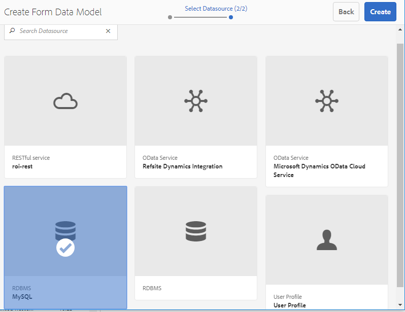
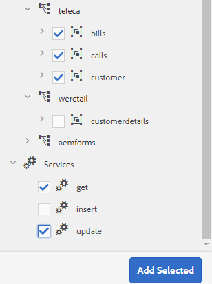
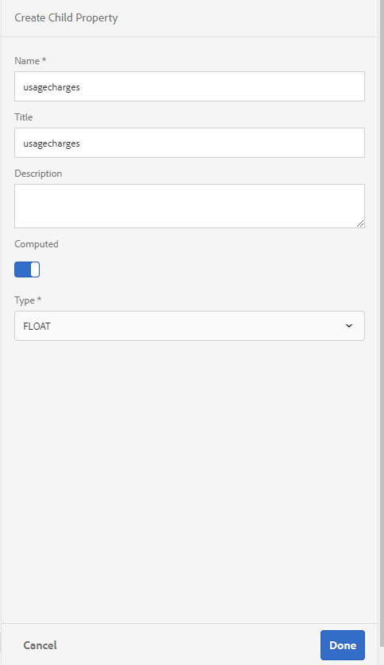
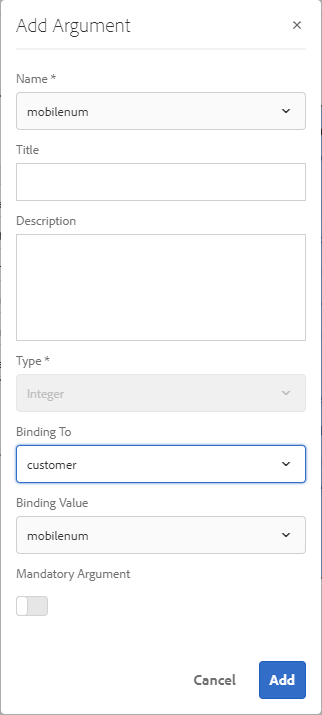

# 자습서:양식 데이터 모델 만들기{#tutorial-create-form-data-model}


이 자습서는 [첫 번째 대화형 통신 만들기](/help/forms/using/create-your-first-interactive-communication.md) 시리즈의 한 단계입니다. 전체 자습서 사용 사례를 이해하고, 실행하고, 시연하기 위해 시리즈를 시간순으로 따르는 것이 좋습니다.

## 자습서 {#about-the-tutorial} 정보

AEM Forms 데이터 통합 모듈을 사용하면 AEM 사용자 프로필, RESTful 웹 서비스, SOAP 기반 웹 서비스, OData 서비스 및 관계형 데이터베이스와 같은 다양한 백엔드 데이터 소스에서 양식 데이터 모델을 만들 수 있습니다. 양식 데이터 모델에서 데이터 모델 개체 및 서비스를 구성하고 이를 적응형 양식에 연결할 수 있습니다. 응용 양식 필드는 데이터 모델 개체 속성에 바인딩됩니다. 서비스를 사용하면 적응형 양식을 미리 작성하고 제출된 양식 데이터를 다시 데이터 모델 개체에 쓸 수 있습니다.

양식 데이터 통합 및 양식 데이터 모델에 대한 자세한 내용은 [AEM Forms 데이터 통합](https://helpx.adobe.com/experience-manager/6-3/forms/using/data-integration.html)을 참조하십시오.

이 자습서에서는 양식 데이터 모델을 인터랙티브한 커뮤니케이션과 준비, 생성, 구성 및 연결하는 단계를 안내합니다. 이 튜토리얼의 끝에서 다음 작업을 수행할 수 있습니다.

* [데이터베이스 설정](../../forms/using/create-form-data-model0.md#step-set-up-the-database)
* [MySQL 데이터베이스를 데이터 소스로 구성](../../forms/using/create-form-data-model0.md#step-configure-mysql-database-as-data-source)
* [양식 데이터 모델 만들기](../../forms/using/create-form-data-model0.md#step-create-form-data-model)
* [양식 데이터 모델 구성](../../forms/using/create-form-data-model0.md#step-configure-form-data-model)
* [양식 데이터 모델 테스트](../../forms/using/create-form-data-model0.md#step-test-form-data-model-and-services)

양식 데이터 모델은 다음과 비슷합니다.


**A.** 구성된 데이터 소스  **B.** 데이터 소스 스키마  **C.** Available services  **D.**   **** Data 모델 개체E.구성된 서비스

## 전제 조건 {#prerequisites}

시작하기 전에 다음을 확인하십시오.

* [데이터베이스](../../forms/using/create-form-data-model0.md#step-set-up-the-database) 섹션에 명시된 샘플 데이터가 있는 MySQL 데이터베이스
* [JDBC 데이터베이스 드라이버 번들링](https://helpx.adobe.com/experience-manager/6-3/help/sites-developing/jdbc.html#bundling-the-jdbc-database-driver)에 설명된 MySQL JDBC 드라이버용 OSGi 번들

## 1단계:데이터베이스 {#step-set-up-the-database} 설정

대화형 통신을 만들려면 데이터베이스가 필요합니다. 이 자습서에서는 데이터베이스를 사용하여 Interactive Communications의 양식 데이터 모델 및 지속성 기능을 표시합니다. 고객, 청구서 및 호출 테이블을 포함하는 데이터베이스를 설정합니다.
다음 이미지는 고객 테이블의 샘플 데이터를 보여 줍니다.


다음 DDL 문을 사용하여 데이터베이스에 **customer** 테이블을 만듭니다.

```sql
CREATE TABLE `customer` (
   `mobilenum` int(11) NOT NULL,
   `name` varchar(45) NOT NULL,
   `address` varchar(45) NOT NULL,
   `alternatemobilenumber` int(11) DEFAULT NULL,
   `relationshipnumber` int(11) DEFAULT NULL,
   `customerplan` varchar(45) DEFAULT NULL,
   PRIMARY KEY (`mobilenum`),
   UNIQUE KEY `mobilenum_UNIQUE` (`mobilenum`)
 ) ENGINE=InnoDB DEFAULT CHARSET=utf8
```

다음 DDL 문을 사용하여 데이터베이스에 **bills** 테이블을 만듭니다.

```sql
CREATE TABLE `bills` (
   `billplan` varchar(45) NOT NULL,
   `latepayment` decimal(4,2) NOT NULL,
   `monthlycharges` decimal(4,2) NOT NULL,
   `billdate` date NOT NULL,
   `billperiod` varchar(45) NOT NULL,
   `prevbal` decimal(4,2) NOT NULL,
   `callcharges` decimal(4,2) NOT NULL,
   `confcallcharges` decimal(4,2) NOT NULL,
   `smscharges` decimal(4,2) NOT NULL,
   `internetcharges` decimal(4,2) NOT NULL,
   `roamingnational` decimal(4,2) NOT NULL,
   `roamingintnl` decimal(4,2) NOT NULL,
   `vas` decimal(4,2) NOT NULL,
   `discounts` decimal(4,2) NOT NULL,
   `tax` decimal(4,2) NOT NULL,
   PRIMARY KEY (`billplan`)
 ) ENGINE=InnoDB DEFAULT CHARSET=utf8
```

다음 DDL 문을 사용하여 데이터베이스에 **호출** 테이블을 만듭니다.

```sql
CREATE TABLE `calls` (
   `mobilenum` int(11) DEFAULT NULL,
   `calldate` date DEFAULT NULL,
   `calltime` varchar(45) DEFAULT NULL,
   `callnumber` int(11) DEFAULT NULL,
   `callduration` varchar(45) DEFAULT NULL,
   `callcharges` decimal(4,2) DEFAULT NULL,
   `calltype` varchar(45) DEFAULT NULL
 ) ENGINE=InnoDB DEFAULT CHARSET=utf8
```

**calls** 테이블에는 호출 날짜, 호출 시간, 호출 번호, 호출 기간 및 호출 요금 등의 통화 세부 정보가 포함되어 있습니다. **customer** 테이블이 모바일 번호(mobilenum) 필드를 사용하여 호출 테이블에 연결됩니다. **customer** 테이블에 나열된 각 모바일 번호에 대해 **호출** 테이블에 여러 개의 레코드가 있습니다. 예를 들어 **호출** 테이블을 참조하여 **1457892541** 모바일 번호에 대한 호출 세부 정보를 검색할 수 있습니다.

**청구서** 테이블에는 청구 날짜, 청구 기간, 월별 요금 및 콜카드와 같은 청구 세부 정보가 포함되어 있습니다. **customer** 테이블은 청구 계획 필드를 사용하여 **청구서** 테이블에 연결되어 있습니다. **customer** 테이블에 각 고객과 연관된 플랜이 있습니다. **bills** 테이블에는 모든 기존 플랜에 대한 가격 세부 정보가 포함됩니다. 예를 들어 **customer** 테이블에서 **Sarah**&#x200B;에 대한 플랜 세부 정보를 검색하고 이러한 세부 정보를 사용하여 **bills** 테이블에서 가격 세부 정보를 검색할 수 있습니다.

## 2단계:MySQL 데이터베이스를 데이터 소스 {#step-configure-mysql-database-as-data-source}로 구성

양식 데이터 모델을 만들도록 서로 다른 유형의 데이터 소스를 구성할 수 있습니다. 이 자습서에서는 샘플 데이터로 구성되고 채워진 MySQL 데이터베이스를 구성합니다. 지원되는 다른 데이터 소스에 대한 정보 및 구성 방법은 [AEM Forms 데이터 통합](https://helpx.adobe.com/experience-manager/6-3/forms/using/data-integration.html)을 참조하십시오.

MySQL 데이터베이스를 구성하려면 다음을 수행합니다.

1. MySQL 데이터베이스의 JDBC 드라이버를 OSGi 번들로 설치합니다.

   1. AEM Forms 작성자 인스턴스에 관리자로 로그인하고 AEM 웹 콘솔 번들로 이동합니다. 기본 URL은 [https://localhost:4502/system/console/bundles](https://localhost:4502/system/console/bundles)입니다.
   1. **설치/업데이트**&#x200B;를 누릅니다. **업로드/설치 번들** 대화 상자가 나타납니다.

   1. **파일**&#x200B;을 눌러 MySQL JDBC 드라이버 OSGi 번들을 찾아 선택합니다. **시작 번들** 및 **패키지 새로 고침**&#x200B;을 선택하고 **설치** 또는 **업데이트**&#x200B;를 누릅니다. MySQL용 Oracle Corporation의 JDBC 드라이버가 활성화되어 있는지 확인합니다. 드라이버가 설치되어 있습니다.

1. MySQL 데이터베이스를 데이터 소스로 구성:

   1. [https://localhost:4502/system/console/configMgr](https://localhost:4502/system/console/configMgr)의 AEM 웹 콘솔로 이동합니다.
   1. **Apache Sling 연결 풀링된 DataSource** 구성을 찾습니다. 을 눌러 편집 모드에서 구성을 엽니다.
   1. 구성 대화 상자에서 다음 세부 정보를 지정합니다.

      * **데이터 소스 이름:** 모든 이름을 지정할 수 있습니다. 예를 들어 **MySQL**&#x200B;을 지정합니다.

      * **DataSource 서비스 속성 이름**:DataSource 이름을 포함하는 서비스 속성의 이름을 지정합니다. 데이터 소스 인스턴스를 OSGi 서비스로 등록하는 동안 지정됩니다. 예: **datasource.name**.

      * **JDBC 드라이버 클래스**:JDBC 드라이버의 Java 클래스 이름을 지정합니다. MySQL 데이터베이스의 경우 **com.mysql.jdbc.Driver**&#x200B;를 지정합니다.

      * **JDBC 연결 URI**:데이터베이스의 연결 URL을 지정합니다. 포트 3306 및 스키마 텔레아에서 실행되는 MySQL 데이터베이스의 경우 URL은 다음과 같습니다.`jdbc:mysql://'server':3306/teleca?autoReconnect=true&useUnicode=true&characterEncoding=utf-8`
      * **사용자 이름:** 데이터베이스의 사용자 이름입니다. 데이터베이스와 연결을 설정하려면 JDBC 드라이버를 활성화해야 합니다.
      * **암호:** 데이터베이스의 암호입니다. 데이터베이스와 연결을 설정하려면 JDBC 드라이버를 활성화해야 합니다.
      * **차입시 테스트:** 차입시  **테스트 옵션을** 활성화합니다.

      * **반환 시 테스트:** 반환 시  **테스트를** 활성화합니다.

      * **유효성 검사 쿼리:** SQL SELECT 쿼리를 지정하여 풀의 연결을 확인합니다. 쿼리는 하나 이상의 행을 반환해야 합니다. 예를 들어 **customer**&#x200B;에서 *를 선택합니다.

      * **트랜잭션 격리**:값을 READ_COMMITTED **로 설정합니다**.
   다른 속성을 기본값 [값](https://tomcat.apache.org/tomcat-7.0-doc/jdbc-pool.html)으로 두고 **저장**&#x200B;을 탭합니다.

   다음과 유사한 구성이 만들어집니다.

   

## 3단계:양식 데이터 모델 {#step-create-form-data-model} 만들기

AEM Forms은 구성된 데이터 소스에서 양식 데이터 모드](https://helpx.adobe.com/experience-manager/6-3/forms/using/data-integration.html#main-pars_header_1524967585)l을 만들기 위해 직관적인 사용자 인터페이스를 제공합니다. [ 양식 데이터 모델에서 여러 데이터 소스를 사용할 수 있습니다. 이 자습서의 사용 사례는 MySQL을 데이터 소스로 사용합니다.

양식 데이터 모델을 만들려면 다음을 수행합니다.

1. AEM 작성자 인스턴스에서 **Forms** > **데이터 통합**&#x200B;으로 이동합니다.
1. **만들기** > **양식 데이터 모델**&#x200B;을 누릅니다.
1. 양식 데이터 모델 만들기 마법사에서 양식 데이터 모델에 대해 **name**&#x200B;을 지정합니다. 예: **FDM_Create_First_IC**. **다음**&#x200B;을 누릅니다.
1. 데이터 소스 선택 화면에는 구성된 모든 데이터 소스가 나열됩니다. **MySQL** 데이터 소스를 선택하고 **만들기**&#x200B;를 탭합니다.

   

1. **완료**&#x200B;를 클릭합니다. **FDM_Create_First_IC** 양식 데이터 모델이 생성됩니다.

## 4단계:양식 데이터 모델 {#step-configure-form-data-model} 구성

양식 데이터 모델 구성에는 다음이 포함됩니다.

* [데이터 모델 개체 및 서비스 추가](#add-data-model-objects-and-services)
* [데이터 모델 개체에 대한 계산된 자식 속성 만들기](#create-computed-child-properties-for-data-model-object)
* [데이터 모델 개체 간 연결 추가](#add-associations-between-data-model-objects)
* [데이터 모델 개체 속성 편집](#edit-data-model-object-properties)
* [데이터 모델 개체에 대한 서비스 구성](#configure-services)

### 데이터 모델 개체 및 서비스 {#add-data-model-objects-and-services} 추가

1. AEM 작성자 인스턴스에서 **Forms** > **데이터 통합**&#x200B;으로 이동합니다. 기본 URL은 [https://localhost:4502/aem/forms.html/content/dam/formsanddocuments-fdm](https://localhost:4502/aem/forms.html/content/dam/formsanddocuments-fdm)입니다.
1. 이전에 만든 **FDM_Create_First_IC** 양식 데이터 모델이 여기에 나열됩니다. 선택하고 **편집**&#x200B;을 누릅니다.

   선택한 데이터 소스 **MySQL**&#x200B;이 **데이터 소스** 창에 표시됩니다.

   

1. **MySQL** 데이터 소스 트리를 확장합니다. **텔레카** 스키마에서 다음 데이터 모델 개체 및 서비스를 선택합니다.

   * **데이터 모델 개체**:

      * 청구서
      * 호출
      * 고객
   * **서비스:**

      * get
      * 업데이트

   **선택한 항목 추가**&#x200B;를 눌러 선택한 데이터 모델 개체 및 서비스를 양식 데이터 모델에 추가합니다.

   

   청구서, 호출 및 고객 데이터 모델 개체는 **모델** 탭의 오른쪽 창에 표시됩니다. get 및 update 서비스는 **서비스** 탭에 표시됩니다.

   

### 데이터 모델 개체 {#create-computed-child-properties-for-data-model-object}에 대해 계산된 자식 속성 만들기

계산된 속성은 규칙이나 식을 기반으로 값을 계산하는 속성입니다. 규칙을 사용하여 계산된 속성의 값을 문자 문자열, 숫자, 수학 표현식의 결과 또는 양식 데이터 모델에 있는 다른 속성의 값으로 설정할 수 있습니다.

사용 사례에 따라 다음 수학 표현식을 사용하여 **bills** 데이터 모델 개체에 **usagecharges** 자식 계산 속성을 만듭니다.

* 사용 요금 = 전화 요금 + 컨퍼런스 콜 요금 + SMS 요금 + 모바일 인터넷 요금 + 로밍 국가 + 로밍 국제 + VAS(이러한 모든 속성은 청구 데이터 모델 개체에 있음)
**사용자 지정 특성** 자식 계산 속성에 대한 자세한 내용은 [대화형 통신 계획](/help/forms/using/planning-interactive-communications.md)을 참조하십시오.

다음 단계를 실행하여 BOM 데이터 모델 객체에 대해 계산된 하위 속성을 생성합니다.

1. **bills** 데이터 모델 개체의 맨 위에 있는 확인란을 선택하여 선택하고 **하위 속성 만들기**&#x200B;를 탭합니다.
1. **하위 속성 만들기** 창에서:

   1. 하위 속성의 이름으로 **usagecharges**&#x200B;를 입력합니다.
   1. **계산된**&#x200B;을(를) 활성화합니다.
   1. **부동**&#x200B;을 유형으로 선택하고 **완료**&#x200B;를 눌러 자식 속성을 **bills** 데이터 모델 개체에 추가합니다.

   

1. **규칙 편집**&#x200B;을 눌러 규칙 편집기를 엽니다.
1. **만들기**&#x200B;를 누릅니다. **값 설정** 규칙 창이 열립니다.
1. 옵션 선택 드롭다운에서 **수학 표현식**&#x200B;을 선택합니다.

   

1. 수학 표현식에서 각각 첫 번째 및 두 번째 개체로 **calcharts** 및 **confcalcharts**&#x200B;를 선택합니다. **plus**&#x200B;를 연산자로 선택합니다. 수학 표현식 내에서 **표현식 확장**&#x200B;을 눌러 **smscharts**, **internetcharts**, **roamingnational**, **roamingintenl** 및 **vas** 객체를 표현식에 추가합니다.

   다음 이미지는 규칙 편집기의 수학 표현식을 보여 줍니다.

   

1. **Done**&#x200B;을 누릅니다. 규칙 편집기에서 규칙을 만듭니다.
1. **닫기**&#x200B;를 눌러 규칙 편집기 창을 닫습니다.

### 데이터 모델 개체 {#add-associations-between-data-model-objects} 간 연결 추가

데이터 모델 객체가 정의되면 해당 객체 간의 연결을 구축할 수 있습니다. 이러한 연결은 일대일 또는 일대다 관계가 될 수 있습니다. 예를 들어, 직원과 연관된 여러 개의 종속 항목이 있을 수 있습니다. 이 연결을 일 대 다 연결이라고 하며 연결된 데이터 모델 개체를 연결하는 줄에 1:n로 묘사합니다. 하지만, 한 협회에서 특정 직원 ID에 대한 고유한 직원 이름을 반환하면 이를 1대1 연결이라고 합니다.

데이터 소스의 관련 데이터 모델 객체를 양식 데이터 모델에 추가하면 해당 연관성이 유지되고 화살표 줄에 연결된 것으로 표시됩니다.

사용 사례에 따라 데이터 모델 객체 간에 다음 연결을 만듭니다.

| Association | 데이터 모델 개체 |
|---|---|
| 1:n | 고객:호출(월별 청구서에서 고객과 여러 호출을 연결할 수 있음) |
| 1:1 | 고객:청구서(특정 달에 대해 고객과 연관된 청구) |

데이터 모델 객체 간의 연결을 생성하려면 다음 단계를 수행합니다.

1. **customer** 데이터 모델 개체의 맨 위에 있는 확인란을 선택하여 선택하고 **연결 추가**&#x200B;를 탭합니다. **연결 추가** 속성 창이 열립니다.
1. **연결 추가** 창에서:

   * 연결의 제목을 지정합니다. 선택 필드입니다.
   * **유형** 드롭다운 목록에서 **One to Many**&#x200B;을 선택합니다.

   * **모델 개체** 드롭다운 목록에서 **호출**&#x200B;을 선택합니다.

   * **서비스** 드롭다운 목록에서 **get**&#x200B;을 선택합니다.

   * **추가**&#x200B;를 눌러 **고객** 데이터 모델 개체를 속성을 사용하여 **호출** 데이터 모델 개체에 연결합니다. 사용 사례에 따라 호출 데이터 모델 개체는 고객 데이터 모델 개체의 모바일 번호 속성에 연결되어 있어야 합니다. **인수 추가** 대화 상자가 열립니다.

   

1. **인수 추가** 대화 상자에서 다음을 수행합니다.

   * **이름** 드롭다운 목록에서 **mobilenum**을 선택합니다. mobile number 속성은 고객이 사용할 수 있는 공통 속성으로, 데이터 모델 개체를 호출합니다. 그 결과, 고객과 호출 데이터 모델 개체 간의 연결을 만드는 데 사용됩니다.
고객 데이터 모델 개체에서 사용할 수 있는 각 모바일 번호에 대해 호출 표에 사용할 수 있는 호출 레코드가 여러 개 있습니다.

   * 인수에 사용할 선택적 제목과 설명을 지정합니다.
   * **바인딩 대상** 드롭다운 목록에서 **고객**&#x200B;을 선택합니다.

   * **바인딩 값** 드롭다운 목록에서 **mobilenum**&#x200B;을 선택합니다.

   * **추가**&#x200B;를 누릅니다.

   

   mobilenum 속성은 **Arguments** 섹션에 표시됩니다.

   

1. **완료**&#x200B;를 눌러 고객과 데이터 모델 개체 호출 사이의 1:n 연결을 만듭니다.

   고객과 호출 데이터 모델 객체 간의 연관성을 생성한 후 고객과 BOM 데이터 모델 객체 간의 1:1 연관성을 생성합니다.

1. **customer** 데이터 모델 개체의 맨 위에 있는 확인란을 선택하여 선택하고 **연결 추가**&#x200B;를 탭합니다. **연결 추가** 속성 창이 열립니다.
1. **연결 추가** 창에서:

   * 연결의 제목을 지정합니다. 선택 필드입니다.
   * **유형** 드롭다운 목록에서 **One to One**&#x200B;을 선택합니다.

   * **모델 개체** 드롭다운 목록에서 **청구서**&#x200B;를 선택합니다.

   * **서비스** 드롭다운 목록에서 **get**&#x200B;을 선택합니다. 청구서 테이블의 기본 키인 **billplan** 속성은 이미 **인수** 섹션에서 사용할 수 있습니다.
청구서 및 고객 데이터 모델 개체는 각각 청구 계획(청구서) 및 고객 계획(고객) 속성을 사용하여 연결됩니다. MySQL 데이터베이스에서 사용할 수 있는 모든 고객에 대한 계획 세부 정보를 검색하려면 이러한 속성 사이에 바인딩을 만듭니다.

   * **바인딩 대상** 드롭다운 목록에서 **고객**&#x200B;을 선택합니다.

   * **바인딩 값** 드롭다운 목록에서 **customerplan**&#x200B;을 선택합니다.

   * 청구 계획과 사용자 지정 플랜 속성 간에 바인딩을 만들려면 **완료**&#x200B;를 누릅니다.

   

   다음 이미지는 데이터 모델 객체와 이러한 객체 간의 연관성을 생성하는 데 사용되는 속성을 보여 줍니다.

   

### 데이터 모델 개체 속성 편집 {#edit-data-model-object-properties}

고객과 다른 데이터 모델 개체 간 연결을 만든 후 고객 속성을 편집하여 데이터 모델 개체에서 데이터를 검색하는 속성을 정의합니다. 사용 사례에 따라 모바일 번호는 고객 데이터 모델 개체에서 데이터를 검색하는 속성으로 사용됩니다.

1. **customer** 데이터 모델 개체의 맨 위에 있는 확인란을 선택하여 선택하고 **속성 편집**&#x200B;을 탭합니다. **속성 편집** 창이 열립니다.
1. **고객**&#x200B;을 **최상위 수준 모델 개체**&#x200B;로 지정합니다.
1. **서비스 읽기** 드롭다운 목록에서 **get**&#x200B;을 선택합니다.
1. **인수** 섹션에서 다음을 수행합니다.

   * **바인딩 대상** 드롭다운 목록에서 **요청 특성**&#x200B;을 선택합니다.

   * **mobilenum**&#x200B;을 바인딩 값으로 지정합니다.

1. **서비스 쓰기** 드롭다운 목록에서 **업데이트**&#x200B;를 선택합니다.
1. **인수** 섹션에서 다음을 수행합니다.

   * **mobilenum** 속성의 경우 **바인딩 대상** 드롭다운 목록에서 **고객**&#x200B;을 선택합니다.

   * **바인딩 값** 드롭다운 목록에서 **mobilenum**&#x200B;을 선택합니다.

1. **완료**&#x200B;를 눌러 속성을 저장합니다.

   

1. **호출** 데이터 모델 개체를 선택하고 **속성 편집**&#x200B;을 탭합니다. **속성 편집** 창이 열립니다.
1. **호출** 데이터 모델 개체에 대해 **최상위 모델 개체**&#x200B;를 비활성화합니다.
1. **Done**&#x200B;을 누릅니다.

   **bills** 데이터 모델 개체에 대한 속성을 구성하려면 8 - 10단계를 반복합니다.

### 서비스 {#configure-services} 구성

1. **서비스** 탭으로 이동합니다.
1. **get** 서비스를 선택하고 **속성 편집**&#x200B;을 누릅니다. **속성 편집** 창이 열립니다.
1. **속성 편집** 창에서:

   * 선택적인 제목과 설명을 입력합니다.
   * **출력 모델 개체** 드롭다운 목록에서 **고객**&#x200B;을 선택합니다.

   * **완료**&#x200B;를 눌러 속성을 저장합니다.

   

1. **업데이트** 서비스를 선택하고 **속성 편집**&#x200B;을 누릅니다. **속성 편집** 창이 열립니다.
1. **속성 편집** 창에서:

   * 선택적인 제목과 설명을 입력합니다.
   * **입력 모델 개체** 드롭다운 목록에서 **고객**&#x200B;을 선택합니다.

   * **Done**&#x200B;을 누릅니다.
   * **저장**&#x200B;을 눌러 양식 데이터 모델을 저장합니다.

   

## 5단계:양식 데이터 모델 및 서비스 테스트 {#step-test-form-data-model-and-services}

데이터 모델 개체 및 서비스를 테스트하여 양식 데이터 모델이 제대로 구성되었는지 확인할 수 있습니다.

테스트를 실행하려면 다음을 수행합니다.

1. **모델** 탭으로 이동하여 **고객** 데이터 모델 개체를 선택하고 **테스트 모델 개체**&#x200B;를 탭합니다.
1. **양식 데이터 모델 테스트** 창의 **모델/서비스 선택** 드롭다운 목록에서 **모델 개체 읽기**&#x200B;를 선택합니다.
1. **입력** 섹션에서 구성된 MySQL 데이터베이스에 있는 **mobilenum** 속성의 값을 지정하고 **테스트**&#x200B;를 누릅니다.

   지정된 mobilenum 속성과 연결된 고객 세부 사항을 아래와 같이 [출력] 섹션에 가져와 표시합니다. 대화 상자를 닫습니다.

   

1. **서비스** 탭으로 이동합니다.
1. **get** 서비스를 선택하고 **Test Service를 누릅니다.**
1. **입력** 섹션에서 구성된 MySQL 데이터베이스에 있는 **mobilenum** 속성의 값을 지정하고 **테스트**&#x200B;를 누릅니다.

   지정된 mobilenum 속성과 연결된 고객 세부 사항을 아래와 같이 [출력] 섹션에 가져와 표시합니다. 대화 상자를 닫습니다.

   

### 샘플 데이터 편집 및 저장 {#edit-and-save-sample-data}

양식 데이터 모델 편집기를 사용하면 계산된 속성을 비롯한 모든 데이터 모델 개체 속성에 대한 샘플 데이터를 양식 데이터 모델에서 생성할 수 있습니다. 각 속성에 대해 구성된 데이터 유형을 준수하는 임의 값 집합입니다. 샘플 데이터를 다시 생성해도 유지된 데이터를 편집하고 저장할 수도 있습니다.

샘플 데이터를 생성, 편집 및 저장하려면 다음을 수행합니다.

1. 양식 데이터 모델 페이지에서 **샘플 데이터 편집**&#x200B;을 탭합니다. 샘플 데이터 편집 창에서 샘플 데이터를 생성하고 표시합니다.

   

1. **샘플 데이터 편집** 창에서 필요에 따라 데이터를 편집하고 **저장**&#x200B;을 탭합니다. 창을 닫습니다.


