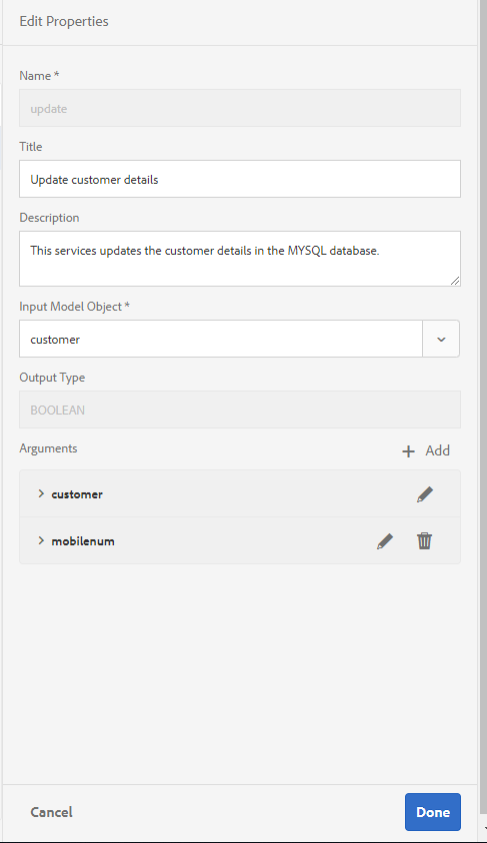
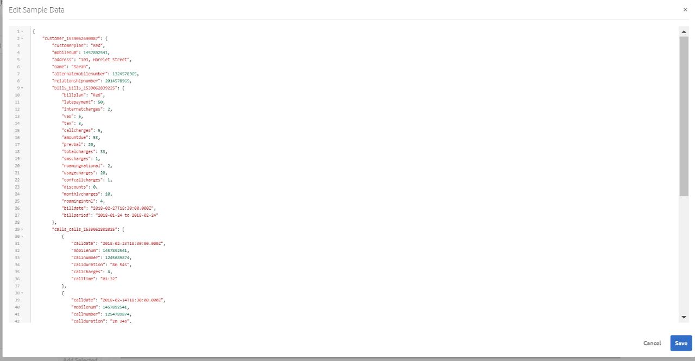

# 자습서: AEM Forms에서 양식 데이터 모델 만들기{#tutorial-create-form-data-model}


이 튜토리얼의 단계는 다음과 같습니다. [첫 번째 대화형 통신 만들기](/help/forms/using/create-your-first-interactive-communication.md) 시리즈. 전체 자습서 사용 사례를 이해하고, 수행하고, 시연하려면 연대순으로 시리즈를 따르는 것이 좋습니다.

## 튜토리얼 기본 정보 {#about-the-tutorial}

AEM Forms 데이터 통합 모듈을 사용하면 AEM 사용자 프로필, RESTful 웹 서비스, SOAP 기반 웹 서비스, OData 서비스 및 관계형 데이터베이스와 같은 서로 다른 백엔드 데이터 소스에서 양식 데이터 모델을 만들 수 있습니다. 양식 데이터 모델에서 데이터 모델 개체 및 서비스를 구성하고 적응형 양식과 연결할 수 있습니다. 적응형 양식 필드는 데이터 모델 개체 속성에 바인딩됩니다. 이 서비스를 사용하면 적응형 양식을 미리 채우고 제출된 양식 데이터를 데이터 모델 개체에 다시 쓸 수 있습니다.

양식 데이터 통합 및 양식 데이터 모델에 대한 자세한 내용은 [AEM Forms 데이터 통합](https://helpx.adobe.com/experience-manager/6-3/forms/using/data-integration.html).

이 자습서에서는 양식 데이터 모델을 대화형 통신과 준비, 만들기, 구성 및 연결하는 단계를 안내합니다. 이 자습서를 마치면 다음을 수행할 수 있습니다.

* [데이터베이스 설정](../../forms/using/create-form-data-model0.md#step-set-up-the-database)
* [MySQL 데이터베이스를 데이터 소스로 구성](../../forms/using/create-form-data-model0.md#step-configure-mysql-database-as-data-source)
* [양식 데이터 모델 만들기](../../forms/using/create-form-data-model0.md#step-create-form-data-model)
* [양식 데이터 모델 구성](../../forms/using/create-form-data-model0.md#step-configure-form-data-model)
* [양식 데이터 모델 테스트](../../forms/using/create-form-data-model0.md#step-test-form-data-model-and-services)

양식 데이터 모델은 다음과 유사합니다.


**A.** 구성된 데이터 소스 **B.** 데이터 소스 스키마 **C.** 사용 가능한 서비스 **D.** 데이터 모델 개체 **E.** 구성된 서비스

## 사전 요구 사항 {#prerequisites}

시작하기 전에 다음을 확인하십시오.

* 에 명시된 샘플 데이터가 있는 MySQL 데이터베이스 [데이터베이스 설정](../../forms/using/create-form-data-model0.md#step-set-up-the-database) 섹션.
* 에 설명된 대로 MySQL JDBC 드라이버용 OSGi 번들 [JDBC 데이터베이스 드라이버 번들](https://helpx.adobe.com/experience-manager/6-3/help/sites-developing/jdbc.html#bundling-the-jdbc-database-driver)

## 1단계: 데이터베이스 설정 {#step-set-up-the-database}

대화형 통신을 만들려면 데이터베이스가 필수적입니다. 이 자습서에서는 데이터베이스를 사용하여 대화형 통신의 양식 데이터 모델 및 지속성 기능을 표시합니다. 고객, 청구서 및 호출 테이블을 포함하는 데이터베이스를 설정합니다.
다음 이미지는 customer 테이블에 대한 샘플 데이터를 보여 줍니다.


다음 DDL 문을 사용하여 **고객** 데이터베이스의 테이블입니다.

```sql
CREATE TABLE `customer` (
   `mobilenum` int(11) NOT NULL,
   `name` varchar(45) NOT NULL,
   `address` varchar(45) NOT NULL,
   `alternatemobilenumber` int(11) DEFAULT NULL,
   `relationshipnumber` int(11) DEFAULT NULL,
   `customerplan` varchar(45) DEFAULT NULL,
   PRIMARY KEY (`mobilenum`),
   UNIQUE KEY `mobilenum_UNIQUE` (`mobilenum`)
 ) ENGINE=InnoDB DEFAULT CHARSET=utf8
```

다음 DDL 문을 사용하여 **청구서** 데이터베이스의 테이블입니다.

```sql
CREATE TABLE `bills` (
   `billplan` varchar(45) NOT NULL,
   `latepayment` decimal(4,2) NOT NULL,
   `monthlycharges` decimal(4,2) NOT NULL,
   `billdate` date NOT NULL,
   `billperiod` varchar(45) NOT NULL,
   `prevbal` decimal(4,2) NOT NULL,
   `callcharges` decimal(4,2) NOT NULL,
   `confcallcharges` decimal(4,2) NOT NULL,
   `smscharges` decimal(4,2) NOT NULL,
   `internetcharges` decimal(4,2) NOT NULL,
   `roamingnational` decimal(4,2) NOT NULL,
   `roamingintnl` decimal(4,2) NOT NULL,
   `vas` decimal(4,2) NOT NULL,
   `discounts` decimal(4,2) NOT NULL,
   `tax` decimal(4,2) NOT NULL,
   PRIMARY KEY (`billplan`)
 ) ENGINE=InnoDB DEFAULT CHARSET=utf8
```

다음 DDL 문을 사용하여 **호출** 데이터베이스의 테이블입니다.

```sql
CREATE TABLE `calls` (
   `mobilenum` int(11) DEFAULT NULL,
   `calldate` date DEFAULT NULL,
   `calltime` varchar(45) DEFAULT NULL,
   `callnumber` int(11) DEFAULT NULL,
   `callduration` varchar(45) DEFAULT NULL,
   `callcharges` decimal(4,2) DEFAULT NULL,
   `calltype` varchar(45) DEFAULT NULL
 ) ENGINE=InnoDB DEFAULT CHARSET=utf8
```

다음 **호출** 이 표에는 통화 날짜, 통화 시간, 통화 번호, 통화 시간 및 통화 요금 등 통화 세부 정보가 포함되어 있습니다. 다음 **고객** 테이블이 모바일 번호(mobileenum) 필드를 사용하여 호출 테이블에 연결됩니다. 에 나열된 각 모바일 번호에 대해 **고객** 테이블에 여러 레코드가 있습니다. **호출** 테이블. 예를 들어 의 호출 세부 사항을 검색할 수 있습니다. **1457892541** 다음을 참조하는 모바일 번호 **호출** 테이블.

다음 **청구서** 테이블에는 청구 일자, 청구 기간, 월별 수수료 및 전화 요금과 같은 청구 상세내역이 포함됩니다. 다음 **고객** 테이블이 다음에 연결되어 있습니다. **청구서** BOM 계획 필드를 사용하는 테이블입니다. 의 각 고객과 연관된 플랜이 있습니다. **고객** 테이블. 다음 **청구서** 테이블에는 모든 기존 플랜에 대한 가격 세부 정보가 포함되어 있습니다. 예를 들어 다음에 대한 플랜 세부 정보를 가져올 수 있습니다. **Sarah** 다음에서 **고객** 테이블을 참조하고 이러한 세부 정보를 사용하여 **청구서** 테이블.

## 2단계: MySQL 데이터베이스를 데이터 소스로 구성 {#step-configure-mysql-database-as-data-source}

다양한 유형의 데이터 소스를 구성하여 양식 데이터 모델을 만들 수 있습니다. 이 자습서에서는 샘플 데이터로 구성되고 채워진 MySQL 데이터베이스를 구성합니다. 지원되는 다른 데이터 소스 및 이러한 소스를 구성하는 방법에 대한 자세한 내용은 [AEM Forms 데이터 통합](https://helpx.adobe.com/experience-manager/6-3/forms/using/data-integration.html).

다음을 수행하여 MySQL 데이터베이스를 구성합니다.

1. MySQL 데이터베이스용 JDBC 드라이버를 OSGi 번들로 설치합니다.

   1. AEM Forms 작성자 인스턴스에 관리자로 로그인하고 AEM 웹 콘솔 번들로 이동합니다. 기본 URL은 [https://localhost:4502/system/console/bundles](https://localhost:4502/system/console/bundles).
   1. 누르기 **설치/업데이트**. An **번들 업로드/설치** 대화 상자가 나타납니다.

   1. 누르기 **파일 선택** MySQL JDBC 드라이버 OSGi 번들을 찾아 선택합니다. 선택 **번들 시작** 및 **패키지 새로 고침**, 및 탭 **설치** 또는 **업데이트**. MySQL에 대한 Oracle 공사의 JDBC 드라이버가 활성화되어 있는지 확인합니다. 드라이버가 설치되었습니다.

1. MySQL 데이터베이스를 데이터 소스로 구성:

   1. 다음 위치에서 AEM 웹 콘솔로 이동 [https://localhost:4502/system/console/configMgr](https://localhost:4502/system/console/configMgr).
   1. 찾기 **Apache Sling 연결의 풀링된 데이터 소스** 구성. 을 눌러 구성을 편집 모드로 엽니다.
   1. 구성 대화 상자에서 다음 세부 사항을 지정합니다.

      * **데이터 소스 이름:** 원하는 이름을 지정할 수 있습니다. 예를 들어 을 지정합니다 **MySQL**.

      * **DataSource 서비스 속성 이름**: DataSource 이름이 포함된 서비스 속성의 이름을 지정합니다. 데이터 소스 인스턴스를 OSGi 서비스로 등록하는 동안 지정됩니다. 예를 들어, **datasource.name**.

      * **JDBC 드라이버 클래스**: JDBC 드라이버의 Java 클래스 이름을 지정합니다. MySQL 데이터베이스의 경우 **com.mysql.jdbc.Driver**.

      * **JDBC 연결 URI**: 데이터베이스의 연결 URL을 지정합니다. 포트 3306 및 스키마 텔레카에서 실행되는 MySQL 데이터베이스의 경우 URL은 다음과 같습니다. `jdbc:mysql://'server':3306/teleca?autoReconnect=true&useUnicode=true&characterEncoding=utf-8`
      * **사용자 이름:** 데이터베이스의 사용자 이름. JDBC 드라이버가 데이터베이스와의 연결을 설정할 수 있도록 해야 합니다.
      * **암호:** 데이터베이스의 암호입니다. JDBC 드라이버가 데이터베이스와의 연결을 설정할 수 있도록 해야 합니다.
      * **차입 시 테스트:** 활성화 **차입 시 테스트** 옵션을 선택합니다.

      * **반환 시 테스트:** 활성화 **반환 시 테스트** 옵션을 선택합니다.

      * **유효성 검사 쿼리:** SQL SELECT 쿼리를 지정하여 풀로부터의 연결을 검증하십시오. 쿼리는 하나 이상의 행을 반환해야 합니다. 예를 들어, **선택 &#42; 출처: 고객**.

      * **트랜잭션 격리**: 값을 로 설정합니다. **READ_COMMIT**.

   다른 속성을 기본값으로 유지 [값](https://tomcat.apache.org/tomcat-7.0-doc/jdbc-pool.html) 및 탭 **저장**.

   다음과 유사한 구성이 만들어집니다.

   

## 3단계: 양식 데이터 모델 만들기 {#step-create-form-data-model}

AEM Forms은 다음과 같은 직관적인 사용자 인터페이스를 제공합니다. [양식 데이터 모드 만들기](https://helpx.adobe.com/experience-manager/6-3/forms/using/data-integration.html#main-pars_header_1524967585)구성된 데이터 소스의 l. 양식 데이터 모델에서 여러 데이터 소스를 사용할 수 있습니다. 이 자습서의 사용 사례에서는 MySQL을 데이터 소스로 사용합니다.

양식 데이터 모델을 만들려면 다음을 수행하십시오.

1. AEM 작성자 인스턴스에서 **Forms** > **데이터 통합**.
1. 누르기 **만들기** > **양식 데이터 모델**.
1. 양식 데이터 모델 만들기 마법사에서 **이름** (양식 데이터 모델) 예를 들어, **FDM_Create_First_IC**. 누르기 **다음**.
1. 데이터 소스 선택 화면에 구성된 모든 데이터 소스가 나열됩니다. 선택 **MySQL** 데이터 소스 및 탭 **만들기**.

   

1. **완료**&#x200B;를 클릭합니다. 다음 **FDM_Create_First_IC** 양식 데이터 모델이 만들어집니다.

## 4단계: 양식 데이터 모델 구성 {#step-configure-form-data-model}

양식 데이터 모델 구성에는 다음이 포함됩니다.

* [데이터 모델 개체 및 서비스 추가](#add-data-model-objects-and-services)
* [데이터 모델 객체에 대해 계산된 하위 등록 정보 생성](#create-computed-child-properties-for-data-model-object)
* [데이터 모델 개체 간 연결 추가](#add-associations-between-data-model-objects)
* [데이터 모델 개체 속성 편집](#edit-data-model-object-properties)
* [데이터 모델 개체에 대한 서비스 구성](#configure-services)

### 데이터 모델 개체 및 서비스 추가 {#add-data-model-objects-and-services}

1. AEM 작성자 인스턴스에서 **Forms** > **데이터 통합**. 기본 URL은 [https://localhost:4502/aem/forms.html/content/dam/formsanddocuments-fdm](https://localhost:4502/aem/forms.html/content/dam/formsanddocuments-fdm).
1. 다음 **FDM_Create_First_IC** 이전에 만든 양식 데이터 모델이 여기에 나열됩니다. 선택하고 탭합니다. **편집**.

   선택한 데이터 소스 **MySQL** 다음에표시됨: **데이터 소스** 창.

   

1. 확장 **MySQL** 데이터 소스 트리. 에서 다음 데이터 모델 개체 및 서비스를 선택하십시오. **텔레카** 스키마:

   * **데이터 모델 개체**:

      * 청구서
      * 호출
      * 고객

   * **서비스:**

      * get
      * 업데이트

   누르기 **선택 항목 추가** 선택한 데이터 모델 개체 및 서비스를 양식 데이터 모델에 추가합니다.

   

   BOM, 호출 및 고객 데이터 모델 개체는 의 오른쪽 창에 표시됩니다 **모델** 탭. get 및 update 서비스가 **서비스** 탭.

   

### 데이터 모델 개체에 대해 계산된 하위 속성 만들기 {#create-computed-child-properties-for-data-model-object}

계산된 등록 정보는 규칙이나 표현식을 기반으로 값이 계산되는 등록 정보입니다. 규칙을 사용하여 계산된 속성의 값을 리터럴 문자열, 숫자, 수학 표현식의 결과 또는 양식 데이터 모델의 다른 속성 값으로 설정할 수 있습니다.

사용 사례를 기반으로 다음을 만듭니다. **usagecharges** 의 하위 계산 속성 **청구서** 다음 수학 표현식을 사용하는 데이터 모델 개체:

* 사용 요금 = 통화 요금 + 전화 회의 통화 요금 + SMS 요금 + 모바일 인터넷 요금 + 로밍 국가 + 로밍 국제 + VAS(이러한 모든 속성은 청구서 데이터 모델 개체에 있음) **usagecharges** 하위 계산 속성, 참조 [대화형 통신 계획](/help/forms/using/planning-interactive-communications.md).

다음 단계를 실행하여 BOM 데이터 모델 객체에 대해 계산된 1차 하위 구성요소 등록 정보를 생성합니다.

1. 상단의 확인란을 선택합니다. **청구서** 데이터 모델 개체를 선택하여 탭합니다. **하위 속성 만들기**.
1. 다음에서 **하위 속성 만들기** 창:

   1. 입력 **usagecharges** 를 하위 속성의 이름으로 사용하십시오.
   1. 사용 **계산됨**.
   1. 선택 **부동** 를 입력하고 탭합니다. **완료** 에 하위 속성을 추가하려면 **청구서** 데이터 모델 개체입니다.

   

1. 누르기 **규칙 편집** 규칙 편집기를 엽니다.
1. **만들기**&#x200B;를 탭합니다. 다음 **값 설정** 규칙 창이 열립니다.
1. Select Option 드롭다운에서 **수학 표현식**.

   

1. 수학 표현식에서 을 선택합니다. **호출 요금** 및 **충돌 전하** 각각 첫 번째 및 두 번째 객체로 사용됩니다. 선택 **플러스** 를 연산자로 사용하십시오. 수학 표현식 내에서 탭한 다음 탭합니다. **표현식 확장** 추가하려면 **smschares**, **상호 전하**, **임신-**, **roamingintnl**, 및 **vas** 개체를 표현식에 추가합니다.

   다음 이미지는 규칙 편집기의 수학 표현식을 보여 줍니다.

   

1. 누르기 **완료**. 규칙이 규칙 편집기에서 만들어집니다.
1. 누르기 **닫기** 을 눌러 규칙 편집기 창을 닫습니다.

### 데이터 모델 개체 간 연결 추가 {#add-associations-between-data-model-objects}

데이터 모델 개체가 정의되면 개체 간에 연결을 작성할 수 있습니다. 연결은 일대일 또는 일대다일 수 있습니다. 예를 들어 한 직원에 여러 개의 종속 항목이 연결되어 있을 수 있습니다. 일대다 연결이라고 하며 연결된 데이터 모델 개체를 연결하는 선에 1:n으로 표시됩니다. 그러나 연관이 지정된 직원 ID에 대해 고유한 직원 이름을 반환하는 경우 이를 일대일 연관이라고 합니다.

데이터 소스의 연관된 데이터 모델 객체를 양식 데이터 모델에 추가하면 해당 연관이 유지되어 화살표 선으로 연결된 상태로 표시됩니다.

사용 사례에 따라 데이터 모델 개체 간에 다음과 같은 연결을 만듭니다.

| 연결 | 데이터 모델 개체 |
|---|---|
| 1:n | customer:calls(여러 번의 호출이 월별 청구서에서 고객과 연결될 수 있음) |
| 1:1 | 고객:청구서(한 개의 청구서가 특정 달의 고객과 연관되어 있음) |

데이터 모델 개체 간의 연결을 만들려면 다음 단계를 수행하십시오.

1. 상단의 확인란을 선택합니다. **고객** 데이터 모델 개체를 선택하여 탭합니다. **연결 추가**. 다음 **연결 추가** 속성 창이 열립니다.
1. 다음에서 **연결 추가** 창:

   * 연결의 제목을 지정합니다. 선택 필드입니다.
   * 선택 **일대다** 다음에서 **유형** 드롭다운 목록입니다.

   * 선택 **호출** 다음에서 **모델 개체** 드롭다운 목록입니다.

   * 선택 **get** 다음에서 **서비스** 드롭다운 목록입니다.

   * 누르기 **추가** 을(를) 연결하려면 **고객** 데이터 모델 개체 대상 **호출** 속성을 사용하는 데이터 모델 개체입니다. 사용 사례에 따라 호출 데이터 모델 개체는 고객 데이터 모델 개체의 모바일 번호 속성에 연결되어 있어야 합니다. 다음 **인수 추가** 대화 상자가 열립니다.

   

1. 다음에서 **인수 추가** 대화 상자:

   * 선택 **mobileenum** 다음에서 **이름** 드롭다운 목록입니다. 모바일 번호 속성은 고객이 사용할 수 있고 데이터 모델 개체를 호출하는 공통 속성입니다. 따라서 이 데이터 모델은 고객과 호출 데이터 모델 개체 간의 연결을 만드는 데 사용됩니다.
고객 데이터 모델 개체에서 사용할 수 있는 각 모바일 번호에 대해 호출 테이블에서 사용할 수 있는 여러 호출 레코드가 있습니다.

   * 인수에 대한 선택적 제목 및 설명을 지정합니다.
   * 선택 **고객** 다음에서 **바인딩 대상** 드롭다운 목록입니다.

   * 선택 **mobileenum** 다음에서 **바인딩 값** 드롭다운 목록입니다.

   * 누르기 **추가**.

   

   mobileenum 속성은 다음에 표시됩니다. **인수** 섹션.

   

1. 누르기 **완료** 고객 및 호출 데이터 모델 개체 간에 1:n 연결을 만듭니다.

   고객과 호출 데이터 모델 객체 간의 연관을 생성했으면 고객과 청구서 데이터 모델 객체 간의 1:1 연관을 생성합니다.

1. 상단의 확인란을 선택합니다. **고객** 데이터 모델 개체를 선택하여 탭합니다. **연결 추가**. 다음 **연결 추가** 속성 창이 열립니다.
1. 다음에서 **연결 추가** 창:

   * 연결의 제목을 지정합니다. 선택 필드입니다.
   * 선택 **일대일** 다음에서 **유형** 드롭다운 목록입니다.

   * 선택 **청구서** 다음에서 **모델 개체** 드롭다운 목록입니다.

   * 선택 **get** 다음에서 **서비스** 드롭다운 목록입니다. 다음 **요금 플랜** bom 테이블의 기본 키인 속성은에서 이미 사용할 수 있습니다. **인수** 섹션.
BOM 및 고객 데이터 모델 개체는 각각 BOM(청구서) 및 customerplan(고객) 속성을 사용하여 연결됩니다. 이러한 속성 사이에 바인딩을 만들어 MySQL 데이터베이스에서 사용 가능한 고객에 대한 계획 세부 정보를 검색합니다.

   * 선택 **고객** 다음에서 **바인딩 대상** 드롭다운 목록입니다.

   * 선택 **customerplan** 다음에서 **바인딩 값** 드롭다운 목록입니다.

   * 누르기 **완료** billplan 및 customerplan 속성 간에 바인딩을 만듭니다.

   

   다음 이미지는 데이터 모델 개체와 이들 개체 간의 연결을 만드는 데 사용된 속성 간의 연결을 보여 줍니다.

   

### 데이터 모델 개체 속성 편집 {#edit-data-model-object-properties}

고객과 다른 데이터 모델 개체 간의 연결을 만든 후 고객 속성을 편집하여 데이터 모델 개체에서 데이터를 검색할 기준 속성을 정의합니다. 사용 사례에 따라 모바일 번호는 고객 데이터 모델 개체에서 데이터를 검색하는 속성으로 사용됩니다.

1. 상단의 확인란을 선택합니다. **고객** 데이터 모델 개체를 선택하여 탭합니다. **속성 편집**. 다음 **속성 편집** 창이 열립니다.
1. 지정 **고객** (으)로 **최상위 수준 모델 개체**.
1. 선택 **get** 다음에서 **읽기 서비스** 드롭다운 목록입니다.
1. 다음에서 **인수** 섹션:

   * 선택 **요청 속성** 다음에서 **바인딩 대상** 드롭다운 목록입니다.

   * 지정 **mobileenum** 를 바인딩 값으로 설정합니다.

1. 선택 **업데이트** 다음에서 **쓰기** 서비스 드롭다운 목록입니다.
1. 다음에서 **인수** 섹션:

   * 대상 **mobileenum** 속성, 선택 **고객** 다음에서 **바인딩 대상** 드롭다운 목록입니다.

   * 선택 **mobileenum** 다음에서 **바인딩 값** 드롭다운 목록입니다.

1. 누르기 **완료** 속성을 저장합니다.

   

1. 상단의 확인란을 선택합니다. **호출** 데이터 모델 개체를 선택하여 탭합니다. **속성 편집**. 다음 **속성 편집** 창이 열립니다.
1. 비활성화 **최상위 수준 모델 개체** 대상 **호출** 데이터 모델 개체입니다.
1. 누르기 **완료**.

   8~10단계를 반복하여 의 속성을 구성합니다. **청구서** 데이터 모델 개체입니다.

### 서비스 구성 {#configure-services}

1. 로 이동 **서비스** 탭.
1. 다음 항목 선택 **get** 서비스 및 탭 **속성 편집**. 다음 **속성 편집** 창이 열립니다.
1. 다음에서 **속성 편집** 창:

   * 선택적 제목 및 설명을 입력합니다.
   * 선택 **고객** 다음에서 **출력 모델 개체** 드롭다운 목록입니다.

   * 누르기 **완료** 속성을 저장합니다.

   

1. 다음 항목 선택 **업데이트** 서비스 및 탭 **속성 편집**. 다음 **속성 편집** 창이 열립니다.
1. 다음에서 **속성 편집** 창:

   * 선택적 제목 및 설명을 입력합니다.
   * 선택 **고객** 다음에서 **입력 모델 개체** 드롭다운 목록입니다.

   * 누르기 **완료**.
   * 누르기 **저장** 을 클릭하여 양식 데이터 모델을 저장합니다.

   

## 5단계: 양식 데이터 모델 및 서비스 테스트 {#step-test-form-data-model-and-services}

데이터 모델 개체 및 서비스를 테스트하여 양식 데이터 모델이 올바르게 구성되었는지 확인할 수 있습니다.

테스트를 실행하려면 다음을 수행하십시오.

1. 로 이동 **모델** 탭에서 **고객** 데이터 모델 개체 및 탭 **테스트 모델 개체**.
1. 다음에서 **양식 데이터 모델 테스트** 창, 선택 **모델 개체 읽기** 다음에서 **모델/서비스 선택** 드롭다운 목록입니다.
1. 다음에서 **입력** 섹션, 다음에 대한 값 지정 **mobileenum** 구성된 MySQL 데이터베이스에 있는 속성을 선택하고 **테스트**.

   지정된 mobileenum 속성과 연결된 고객 세부 정보를 가져와서 아래와 같이 출력 섹션에 표시합니다. 대화 상자를 닫습니다.

   

1. 로 이동 **서비스** 탭.
1. 다음 항목 선택 **get** 서비스 및 탭 **테스트 서비스.**
1. 다음에서 **입력** 섹션, 다음에 대한 값 지정 **mobileenum** 구성된 MySQL 데이터베이스에 있는 속성을 선택하고 **테스트**.

   지정된 mobileenum 속성과 연결된 고객 세부 정보를 가져와서 아래와 같이 출력 섹션에 표시합니다. 대화 상자를 닫습니다.

   

### 샘플 데이터 편집 및 저장 {#edit-and-save-sample-data}

양식 데이터 모델 편집기를 사용하면 양식 데이터 모델에서 계산된 속성을 포함한 모든 데이터 모델 개체 속성에 대한 샘플 데이터를 생성할 수 있습니다. 각 속성에 대해 구성된 데이터 유형을 준수하는 무작위 값 세트입니다. 또한 샘플 데이터를 재생성하더라도 보존되는 데이터를 편집하고 저장할 수 있습니다.

샘플 데이터를 생성, 편집 및 저장하려면 다음을 수행합니다.

1. 양식 데이터 모델 페이지에서 을 누릅니다 **샘플 데이터 편집**. 샘플 데이터 편집 창에서 샘플 데이터를 생성하고 표시합니다.

   

1. 위치 **샘플 데이터 편집** 창, 필요에 따라 데이터 편집 및 탭 **저장**. 창을 닫습니다.
