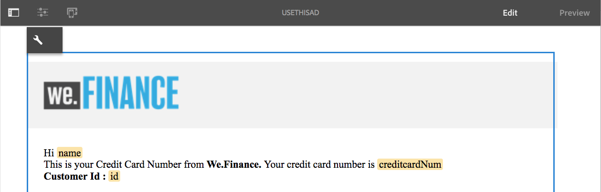
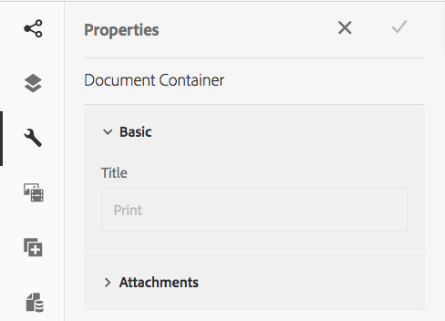
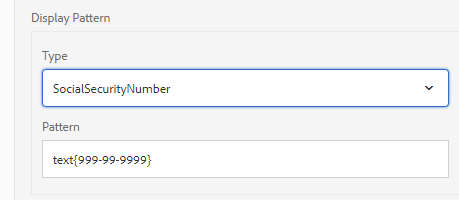
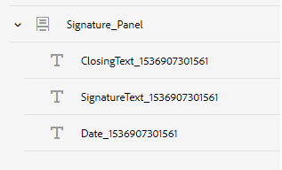

# 대화형 통신 만들기{#create-an-interactive-communication}

## 개요 {#overview}

Interactive Communications는 개인화되고 인터랙티브한 커뮤니케이션의 작성, 조합 및 전달을 중앙에서 관리하고 관리합니다. 인쇄를 웹용 마스터 채널로 활용하면 인터랙티브 커뮤니케이션의 웹 출력을 만들 때 중복 작업을 최소화할 수 있습니다.

### 전제 조건 {#prerequisites}

다음은 대화형 통신을 만들기 위한 사전 요구 사항입니다.

* 테스트 데이터를 포함하거나 Microsoft® Dynamics 인스턴스와 같은 실제 데이터 소스를 사용하여 [양식 데이터 모델](/help/forms/using/data-integration.md)을 설정합니다.
* [문서 조각](/help/forms/using/document-fragments.md)이(가) 있는지 확인합니다.
* 인쇄 및 웹 채널용 [템플릿이 있는지 확인합니다](/help/forms/using/web-channel-print-channel.md).
* 웹 채널에 필요한 [테마](/help/forms/using/themes.md)가 있는지 확인합니다.

## 대화형 통신 만들기 {#createic}

1. AEM 작성자 인스턴스에 로그인하고 **[!UICONTROL Adobe Experience Manager]** > **[!UICONTROL Forms]** > **[!UICONTROL Forms &amp; 문서]**&#x200B;로 이동합니다.
1. **[!UICONTROL 만들기]**&#x200B;를 누르고 **[!UICONTROL 대화형 통신]**&#x200B;을 선택합니다. [대화형 통신 만들기] 페이지가 나타납니다.

   

1. 다음 정보를 입력합니다. :

   * **[!UICONTROL 제목]**:대화형 통신 제목을 입력합니다.
   * **[!UICONTROL 이름]**:대화형 통신 이름은 입력한 제목에서 파생됩니다. 필요한 경우 편집합니다.
   * **[!UICONTROL 설명]**:대화형 통신에 대한 설명을 입력합니다.
   * **[!UICONTROL 양식 데이터 모델]**:양식 데이터 모델을 찾아 선택합니다. 양식 데이터 모델에 대한 자세한 내용은 [AEM Forms 데이터 통합](/help/forms/using/data-integration.md)을 참조하십시오.

   * **[!UICONTROL 자동 완성 서비스]**:데이터를 검색하고 대화형 통신을 미리 입력할 자동 채우기 서비스를 선택합니다.
   * **[!UICONTROL 게시 프로세스 유형]**:대화형 통신이 전송될 때 트리거할 AEM 또는 Forms 워크플로우를 선택할 수 있습니다. 트리거할 워크플로우의 유형을 선택합니다.

   * **[!UICONTROL 게시 프로세스]**:트리거할 워크플로우의 이름을 선택합니다. AEM 워크플로우를 선택하면 첨부 파일 경로, 레이아웃 경로, PDF 경로, 인쇄 데이터 경로 및 웹 데이터 경로를 제공합니다.
   * **[!UICONTROL 태그]**:대화형 통신에 적용할 태그를 선택합니다. 새/사용자 지정 태그 이름을 입력하고 Enter 키를 눌러 작성할 수도 있습니다.
   * **[!UICONTROL 작성자]**: 작성자 이름은 로그인한 사용자의 사용자 이름에서 자동으로 가져옵니다.
   * **[!UICONTROL 게시 날짜:]** 대화형 통신을 게시할 날짜를 입력합니다.
   * **[!UICONTROL 게시 취소 날짜]**:대화형 통신을 게시 취소할 날짜를 입력합니다.

1. **[!UICONTROL 다음]**&#x200B;을 누릅니다. 인쇄 및 웹 채널 세부 사항을 지정하는 화면이 나타납니다.
1. 다음을 입력합니다.

   * **[!UICONTROL 인쇄]**:대화형 통신 인쇄 채널을 생성하려면 이 옵션을 선택합니다.
   * **[!UICONTROL 인쇄 템플릿]**:인쇄 템플릿으로 XDP를 찾아보고 선택합니다.
   * **[!UICONTROL 웹]**:웹 채널 또는 대화형 통신 응답형 출력을 생성하려면 이 옵션을 선택합니다.
   * **[!UICONTROL 대화형 통신 웹 템플릿]**:웹 템플릿을 찾아 선택합니다.
   * **[!UICONTROL 테마]** 및 테마  **[!UICONTROL 선택]**:인터랙티브 커뮤니케이션의 웹 채널의 스타일을 지정할 테마를 찾아보고 선택합니다. 자세한 내용은 AEM Forms](/help/forms/using/themes.md)의 [테마를 참조하십시오.

   * **[!UICONTROL 웹 채널에 기본 다른 이름으로 인쇄]**:인쇄 채널과 동기화된 웹 채널을 만들려면 이 옵션을 선택합니다. 웹 채널의 마스터로 인쇄 채널을 사용하면 웹 채널의 컨텐츠 및 데이터 바인딩이 인쇄 채널에서 파생되고 동기화를 누를 때 인쇄 채널의 변경 사항이 웹 채널에 반영됩니다. 그러나 작성자는 필요에 따라 웹 채널의 특정 구성 요소에 대한 상속을 중단할 수 있습니다. 자세한 내용은 [웹 채널을 인쇄 채널과 동기화](../../forms/using/create-interactive-communication.md#synchronize)를 참조하십시오.
**[!UICONTROL 웹 채널에 기본 다른 이름으로 인쇄 사용]** 옵션을 선택한 경우 다음 모드를 선택하여 웹 채널을 생성할 수 있습니다.

      * **[!UICONTROL 자동 레이아웃]**:인쇄 채널에서 웹 채널에 대한 자리 표시자, 콘텐트 및 데이터 바인딩을 자동으로 생성하려면 이 모드를 선택합니다.
      * **[!UICONTROL 수동 구성]**:데이터 소스 탭에서 사용할 수 있는 마스터 컨텐츠를 사용하여 수동으로 채널 요소 인쇄를 선택하고 웹 채널에 추가하려면 이  **[!UICONTROL 모드를]** 선택합니다. 자세한 내용은 [채널 요소 인쇄를 선택하여 웹 채널 컨텐츠 만들기](#selectprintchannelelements)를 참조하십시오.

   인쇄 채널 및 웹 채널에 대한 자세한 내용은 [인쇄 채널 및 웹 채널](/help/forms/using/web-channel-print-channel.md)을 참조하십시오.

1. **[!UICONTROL 만들기]**&#x200B;를 누릅니다. [대화형 통신]이 생성되고 경고 상자가 나타납니다. [Add contents using Interactive Communication authoring user interface](#step2)에 설명된 대로 **[!UICONTROL 편집]**&#x200B;을 눌러 대화형 커뮤니케이션의 컨텐츠를 작성하기 시작합니다. 또는 **[!UICONTROL 완료]**&#x200B;를 탭하고 나중에 대화형 통신을 편집하도록 선택할 수 있습니다.

## 대화형 통신 {#step2}에 콘텐트 추가

대화형 통신을 만든 후 대화형 통신 제작 인터페이스를 사용하여 내용을 구성할 수 있습니다.

대화형 통신 제작 인터페이스에 대한 자세한 내용은 [대화형 통신 제작 소개](/help/forms/using/introduction-interactive-communication-authoring.md)를 참조하십시오.

1. [대화형 통신 만들기](#createic)에 언급된 대로 편집을 탭하면 대화형 통신 제작 인터페이스가 시작됩니다. 또는 AEM의 기존 대화형 통신 자산으로 이동하여 선택한 다음 **[!UICONTROL 편집]**&#x200B;을 눌러 대화형 통신 작성 인터페이스를 시작할 수 있습니다.

   대화형 통신이 웹 채널 전용인 경우를 제외하고 기본적으로 대화형 통신의 인쇄 채널이 표시됩니다. 선택한 XDP/인쇄 채널 템플릿에서 사용할 수 있는 대화형 커뮤니케이션의 인쇄 채널에는 대상 영역이 표시됩니다. 이러한 대상 영역 및 필드에서 구성 요소나 자산을 추가할 수 있습니다.

1. 인쇄 채널을 선택한 상태에서 **[!UICONTROL 구성 요소]** 탭을 선택합니다. 다음 구성 요소는 인쇄 채널에서 사용할 수 있습니다.

   | **구성 요소** | **기능** |
   |---|---|
   | Chart | 양식 데이터 모델 컬렉션에서 검색된 2차원 데이터를 시각적으로 표시하기 위해 대화형 커뮤니케이션에서 사용할 수 있는 차트를 추가합니다. 자세한 내용은 [Interactive Communications에서 차트 사용](/help/forms/using/chart-component-interactive-communications.md)을 참조하십시오. |
   | 문서 단편 | 텍스트, 목록 또는 조건 등의 재사용 가능한 구성 요소를 대화형 통신에 추가할 수 있습니다. 추가된 구성 요소는 양식 데이터 모델 기반이거나 양식 데이터 모델이 없을 수 있습니다. |
   | 이미지 | 이미지를 삽입할 수 있습니다. |

   구성 요소를 대화형 통신에 드래그하여 놓고 필요에 따라 구성합니다.

   또한 인쇄 및 웹 채널 모두에 대한 대화형 통신을 작성하는 동안 실행 취소 및 다시 실행 작업을 사용할 수도 있습니다.

   실행 취소 작업을 사용하여 마지막으로 수행한 작업을 취소하고 다시 실행 작업을 다시 포함시킵니다. 예를 들어, 이미지를 삽입하거나 대화형 통신에 데이터 바인딩을 만든 경우 이를 폐기해야 하는 경우 실행 취소 작업을 사용합니다.

   

   실행 취소 및 다시 실행 옵션은 작성 UI 페이지 도구 모음에 표시됩니다. 실행 취소 옵션은 작업을 수행한 후에만 표시됩니다. 다시 실행 옵션은 실행 취소 작업을 수행한 후에만 페이지 도구 모음에 표시됩니다. 이러한 작업은 페이지를 새로 고칠 때 재설정됩니다.

1. 인쇄 채널이 선택된 상태에서 **[!UICONTROL 자산]** 탭으로 이동하여 보려는 자산만 표시하도록 필터를 적용합니다.

   자산 브라우저를 사용하여 대화형 통신 대상 영역에 자산을 직접 드래그하여 놓을 수도 있습니다.

   

1. 문서 조각을 대화형 통신에 드래그하여 놓습니다. 다음은 대화형 통신 인쇄 채널에서 사용할 수 있는 문서 조각 유형입니다.

<table>
 <tbody>
  <tr>
   <td><strong>문서 단편 유형</strong></td>
   <td><strong>목적 예</strong></td>
  </tr>
  <tr>
   <td><a href="/help/forms/using/texts-interactive-communications.md" target="_blank">텍스트</a></td>
   <td>문자의 주소, 수신자 이메일 및 본문 텍스트를 추가하는 텍스트 </td>
  </tr>
  <tr>
   <td><a href="/help/forms/using/conditions-interactive-communications.md" target="_blank">조건</a></td>
   <td>정책 유형에 따라 커뮤니케이션에 적절한 헤더 이미지를 추가하는 조건:Standard 또는 Premium.  </td>
  </tr>
  <tr>
   <td>목록</td>
   <td>텍스트, 조건, 기타 목록 및 이미지를 비롯한 문서 조각 그룹입니다.  </td>
  </tr>
 </tbody>
</table>

**[!UICONTROL 자산]** 탭을 사용하여 대상 영역에 새 조각을 드롭하여 대상 영역과 문서 조각 간 바인딩을 바꿀 수도 있습니다. 조각을 드래그하는 동안 대상 영역의 파란색 색상 음영은 문서 조각을 대상 영역으로 드롭할 수 있음을 나타냅니다.

문서 조각에 대한 자세한 내용은 [문서 조각](/help/forms/using/document-fragments.md)을 참조하십시오.

작성 인터페이스를 사용하면 언바운드 필드와 바인딩된 필드 및 대화형 통신 내의 변수를 구분할 수 있습니다. 인터페이스는 언바운드 필드와 주황색 테두리를 사용하여 변수를 강조 표시합니다.

또한 이러한 요소 위로 마우스를 가져가면 필드(언바운드) 또는 변수(언바운드) 메시지와 함께 도구 설명이 표시됩니다.

문서 조각에 사용된 언바운드 변수는 작성 인터페이스에 표시되지 않을 수 있습니다. 문서 조각 내의 인라인 텍스트 규칙 또는 조건 조각의 경우 이러한 규칙이 발생할 수 있습니다. 이 경우 파란색으로 강조 표시된 도구 설명이 문서 조각의 일부로 표시됩니다. 도구 설명에 문서 조각 내에 사용된 언바운드 변수의 수가 표시됩니다.

문서 조각을 탭하고 (구성)을 탭한 다음 대화형 통신 사이드 킥의 **[!UICONTROL 속성]**&#x200B;을 탭합니다. **[!UICONTROL 변수 및 데이터 모델 개체]** 섹션에는 숨겨진 변수 및 문서 조각에 사용된 데이터 모델 개체를 포함한 변수가 나열됩니다. 각 데이터 모델 개체 또는 변수 옆에 있는  (편집) 아이콘을 사용하여 속성을 편집합니다.

1. 변수의 바인딩을 설정하려면 변수를 누르고 (구성)을 선택한 다음 세로 막대의 속성 패널에서 바인딩 속성을 설정합니다.

   * **없음**:에이전트가 변수의 값을 채웁니다.
   * **텍스트 조각**:이 옵션을 선택하면 컨텐츠를 필드에 렌더링하는 텍스트 문서 조각을 찾아 선택할 수 있습니다. 이러한 텍스트 문서 조각만 안에 변수가 없는 변수에 바인딩할 수 있습니다.
   * **데이터 모델 개체**:필드에 값이 채워지는 양식 데이터 모델 속성을 선택합니다.
   * **기본값:** 이 필드를 사용하여 변수의 기본값을 정의할 수 있습니다. 이 값은 대화형 통신 또는 에이전트 UI를 미리 볼 때 표시됩니다.
   * **표시 패턴:** 변수의 표시 형식을 정의할 수도 있습니다. 표시 형식을 변수에 적용하려면 **유형** 드롭다운 목록에서 사전 정의된 옵션을 선택합니다. 목록에서 사용할 수 없는 표시 패턴을 정의하려면 **사용자 지정**&#x200B;을 선택합니다. 자세한 내용은 [데이터 표시 패턴](../../forms/using/create-interactive-communication.md#datadisplaypatterns)을 참조하십시오.

   [변수 및 데이터 모델 개체](../../forms/using/create-interactive-communication.md#hiddenvariables)로 이동하여 문서 조각에서 숨겨진 변수의 바인딩을 설정합니다.

   데이터 소스 요소 또는 텍스트 문서 조각을 드래그 앤 드롭하여 변수 바인딩을 설정할 수도 있습니다.  데이터 소스 요소를 사용하여 바인딩을 만들려면 **데이터 소스** 탭을 선택하고 요소를 변수 이름으로 드래그하여 놓습니다. 바인딩을 성공적으로 설정하려면 데이터 소스 요소 및 변수가 같은 유형이어야 합니다. 데이터 소스 요소를 이미 바인딩된 변수에 드래그 앤 드롭하는 경우 새 요소는 이전 요소를 대체하여 새 바인딩을 변수로 만듭니다. 마찬가지로 **자산** 탭을 선택하고 텍스트 문서 조각을 변수 이름으로 드래그하여 놓아 둘 사이의 바인딩을 설정합니다. 텍스트 문서 조각에는 변수가 없어야 합니다.

1. 표를 추가하려면 인쇄 채널이 선택된 상태로 **[!UICONTROL 자산]** 탭에서 필터를 적용하여 레이아웃 조각만 표시합니다. 필요한 레이아웃 조각을 대화형 통신에 드래그하여 놓습니다. 레이아웃 조각은 XDP를 기반으로 하며 동적 데이터로 채워진 대화형 커뮤니케이션에서 그래픽 레이아웃 또는 정적 및 동적 표를 만드는 데 사용할 수 있습니다.

   예:이전 및 새로운 정책에 대한 총보험료, 충성도 할인 % 및 긴급 노변 지원을 표시할 수 있는 레이아웃 표입니다.

   레이아웃 조각에 대한 자세한 내용은 [문서 조각](/help/forms/using/document-fragments.md)을 참조하십시오.

1. 인쇄 채널이 선택된 상태에서 **[!UICONTROL 자산]** 탭에서 필터를 표시 이미지에 적용합니다. 필요한 이미지를 회사 로고 등 인터랙티브 커뮤니케이션에 드래그하여 놓습니다.

   또한 대화형 통신에서 다음을 관리합니다.

   * [차트 추가 및 구성](/help/forms/using/chart-component-interactive-communications.md)
   * [웹 채널을 인쇄 채널과 동기화](../../forms/using/create-interactive-communication.md#synchronize)

      * 자동 동기화
      * 상속 취소
      * 상속 다시 활성화
      * 동기화
   * [첨부 파일 및 라이브러리 액세스](../../forms/using/create-interactive-communication.md#attachmentslibrary)
   * [XDP/레이아웃 필드 속성](../../forms/using/create-interactive-communication.md#xdplayoutfieldproperties)
   * [구성 요소에 규칙 추가](../../forms/using/create-interactive-communication.md#rules)

1. **[!UICONTROL 웹 채널]**&#x200B;으로 전환합니다. 웹 채널이 대화형 통신 편집기에 나타납니다. 인쇄 채널에서 웹 채널로 처음으로 전환하는 경우 자동 동기화가 발생합니다. 자세한 내용은 인쇄 채널에서 [웹 채널 동기화를 참조하십시오](../../forms/using/create-interactive-communication.md#synchronize).

   이 예에서는 웹용 마스터로 인쇄를 사용하고 있으므로 인쇄 채널 자리 표시자, 콘텐츠 및 데이터 바인딩이 웹 채널에 동기화됩니다. 그러나 웹 채널의 특정 컨텐츠를 변경하고 사용자 지정할 수 있습니다. [컨텐츠](#cancelinheritance) 를 사용자 정의할 수 있도록 인쇄 채널을 사용하여 생성된 대상 영역 및 변수의 상속을 취소합니다.

   

   문서 조각을 탭하고 (구성)을 탭한 다음 대화형 통신 사이드 킥의 **[!UICONTROL 속성]**&#x200B;을 탭합니다. **[!UICONTROL 변수 및 데이터 모델 개체]** 섹션에는 숨겨진 변수 및 문서 조각에 사용된 데이터 모델 개체를 포함한 변수가 나열됩니다. 각 데이터 모델 개체 또는 변수 옆에 있는  (편집) 아이콘을 사용하여 속성을 편집합니다. 또한 인쇄 채널을 사용하는 웹 채널에서 [자동 생성된](#synchronize)인 문서 조각의 경우 각 데이터 모델 개체 및 변수 옆에 있는 (상속 취소) 아이콘을 사용하고 [상속 취소](#cancelinheritance)에서 해당 조각을 편집할 수 있습니다.

1. 웹 채널을 선택하고 웹 채널에 구성 요소를 추가하려면 **[!UICONTROL 구성 요소]**&#x200B;를 누릅니다. 필요에 따라 대화형 커뮤니케이션의 웹 채널에서 구성 요소를 드래그하여 놓고 구성한 다음 계속 진행합니다.

   | 구성 요소 | 기능 |
   |---|---|
   | 차트 | 양식 데이터 모델 컬렉션에서 검색된 2차원 데이터를 시각적으로 표시하기 위해 대화형 커뮤니케이션에서 사용할 수 있는 차트를 추가합니다. 자세한 내용은 [차트 구성 요소 사용](../../forms/using/chart-component-interactive-communications.md)을 참조하십시오. |
   | 문서 단편 | 재사용 가능한 구성 요소, 텍스트, 목록 또는 조건을 대화형 통신에 추가할 수 있습니다. 대화형 통신에 추가하는 재사용 가능한 구성 요소는 양식 데이터 모델 기반 또는 양식 데이터 모델 없이 구성할 수 있습니다. |
   | 이미지 | 이미지를 삽입할 수 있습니다. |
   | 패널 | 대화형 통신에 [패널](../../forms/using/create-interactive-communication.md#add-panel-component-to-the-web-channel)을 추가할 수 있습니다. |
   | 표 | 행 및 열에 데이터를 구성할 수 있는 표를 추가합니다. |
   | 대상 영역 | 웹 채널에서 대상 영역을 삽입하여 웹 채널별 구성 요소를 구성합니다. Target 영역은 웹 채널 특정 구성 요소를 그룹화할 수 있는 일반 컨테이너입니다. |
   | 텍스트 | 대화형 커뮤니케이션의 웹 채널에 리치 텍스트를 추가합니다. 또한 텍스트는 양식 데이터 모델 개체를 사용하여 내용을 동적으로 만들 수도 있습니다. |
   | 단추 | 대화형 통신에 [Button](../../forms/using/create-interactive-communication.md#add-button-component-to-the-web-channel)을 추가할 수 있습니다. Button 구성 요소를 사용하여 다른 Interactive Communications, 적응형 양식, 이미지나 문서 조각 같은 기타 자산 또는 외부 URL로 이동할 수 있습니다. |
   | 분리자 | 대화형 통신 내에 가로 선을 삽입할 수 있습니다. 이 구성 요소를 사용하여 통신 시 섹션을 구별합니다. 예를 들어 구분자 구성 요소를 사용하여 신용카드 명세서에서 고객 세부 정보와 신용 카드 세부 사항 섹션을 구분할 수 있습니다. |

1. 필요에 따라 웹 채널에 에셋을 삽입합니다.

   [대화형 통신](#previewic)을 미리 보고 대화형 통신의 인쇄 및 웹 출력이 어떻게 표시되는지 확인하고 필요에 따라 계속 변경할 수 있습니다.

## 대화형 통신 미리 보기 {#previewic}

**미리 보기 옵션**&#x200B;을 사용하여 대화형 통신 모양을 평가할 수 있습니다. 또한 인터랙티브 커뮤니케이션의 웹 채널은 다양한 디바이스에 대한 인터랙티브 커뮤니케이션의 경험을 에뮬레이션하는 옵션을 제공합니다. 예: iPhone, iPad 및 Desktop. **미리 보기** 및 **에뮬레이터**  옵션을 모두 함께 사용하여 서로 다른 화면 크기의 장치에 대한 웹 출력을 미리 볼 수 있습니다. 미리 보기의 샘플 데이터는 지정된 양식 데이터 모델에서 채워집니다.

1. 미리 보기를 미리 보고 탭할(인쇄 또는 웹) 채널을 선택합니다. [대화형 통신]이 나타납니다.

   >[!NOTE]
   >
   >미리 보기는 지정된 양식 데이터 모델의 샘플 데이터로 채워집니다. 다른 데이터와 대화형 통신을 미리 보거나 프리플라이트 서비스를 사용하는 방법에 대한 자세한 내용은 [양식 데이터 모델 사용](/help/forms/using/using-form-data-model.md) 및 [양식 데이터 모델 사용](/help/forms/using/work-with-form-data-model.md)을 참조하십시오.

1. 웹 채널의 경우 를 사용하여 다양한 장치에서 대화형 통신이 어떻게 보이는지 확인합니다.

   

또한 에이전트 UI](/help/forms/using/prepare-send-interactive-communication.md)를 사용하여 [대화형 통신을 준비하고 전송할 수 있습니다.

## 대화형 통신 {#configure-properties-in-interactive-communication}에서 속성 구성

### 첨부 파일 및 라이브러리 액세스 {#attachmentslibrary}

인쇄 채널에서 에이전트가 대화형 통신용 에이전트 UI의 첨부 파일을 관리하도록 첨부 파일 및 라이브러리 액세스를 구성할 수 있습니다.

1. 인쇄 채널에서 문서 컨테이너를 선택하고 **속성**&#x200B;을 누릅니다.

   

   [속성] 패널이 사이드바에 나타납니다.

   

1. **첨부 파일**&#x200B;을 확장하고 다음 속성을 지정합니다.

   * **[!UICONTROL 라이브러리 액세스 허용]**:에이전트 UI에서 에이전트에 대한 라이브러리 액세스를 활성화하려면 선택합니다. 활성화된 경우 에이전트는 대화형 통신을 준비하는 동안 라이브러리에서 파일을 추가할 수 있습니다.
   * **[!UICONTROL 첨부 파일 순서 재지정 허용]**:Interactive Communication을 사용하여 첨부 파일의 순서를 재지정할 수 있도록 하려면 선택합니다.
   * **[!UICONTROL 허용되는 최대 첨부 파일 수]**:대화형 통신에서 허용되는 최대 첨부 파일 수를 지정합니다.
   * **[!UICONTROL 첨부할]** 파일:추가 **** 를 눌러 첨부할 파일을 선택하고 다음을 지정합니다.

      * **[!UICONTROL 기본적으로 이 파일을 문서에 첨부합니다]**.첨부 파일만 필수가 아닌 경우 이 옵션을 변경할 수 있습니다.
      * **[!UICONTROL 필수:]** 에이전트가 에이전트 UI에서 첨부 파일을 제거할 수 없습니다.

   

1. **[!UICONTROL Done]**&#x200B;을 누릅니다.

### XDP/레이아웃 필드 속성 {#xdplayoutfieldproperties}

1. 대화형 통신의 인쇄 채널을 편집하는 동안 인쇄 채널 템플릿에 내장된 필드를 마우스로 가리키고  (구성)을 선택합니다.

   세로 막대에 [속성] 대화 상자가 나타납니다.

   

1. 다음을 지정합니다.

   * **[!UICONTROL 이름]**:JCR 노드 이름입니다.
   * **[!UICONTROL 제목]**:에이전트 UI와 문서 컨테이너 트리에서 에이전트가 볼 수 있는 제목을 입력합니다.
   * **[!UICONTROL 바인딩 유형]**:필드에 대해 다음 바인딩 유형 중 하나를 선택합니다.

      * 없음:에이전트가 속성 값을 채웁니다.
      * 텍스트 조각:이 옵션을 선택하면 컨텐츠를 필드에 렌더링하는 텍스트 문서 조각을 찾아 선택할 수 있습니다. 또는 텍스트 문서 조각을 필드 이름으로 드래그하여 놓아 둘 사이의 바인딩을 설정합니다. 텍스트 문서 조각에는 변수가 없어야 합니다.
      * 데이터 모델 개체:필드에 값이 채워지는 양식 데이터 모델 속성을 선택합니다. 또는 **Data Sources** 탭을 선택하고 속성을 필드에 드래그하여 놓습니다.
   * **[!UICONTROL 기본값]**:기본값을 사용하면 지정된 데이터 모델 개체 또는 텍스트 조각에서 제공하는 값이 없을 때 필드가 비어 있지 않습니다. 데이터 바인딩 유형이 none이면 필드에 기본값이 미리 채워집니다.
   * **[!UICONTROL 표시 패턴]**:필드의 표시 형식을 정의할 수도 있습니다. 표시 형식을 필드에 적용하려면 **유형** 드롭다운 목록에서 사전 정의된 옵션을 선택합니다. 목록에서 사용할 수 없는 표시 패턴을 정의하려면 **사용자 지정**&#x200B;을 선택합니다. 자세한 내용은 [데이터 표시 패턴](../../forms/using/create-interactive-communication.md#datadisplaypatterns)을 참조하십시오.

   * **[!UICONTROL 에이전트가 편집 가능]**:에이전트가 에이전트 UI의 필드에 값을 편집할 수 있도록 허용하려면 선택합니다. 바인딩 유형이 텍스트 조각인 경우에는 이 설정을 적용할 수 없습니다.
   * **[!UICONTROL 레이블]**:에이전트 UI에서 에이전트에 필드에 표시되는 텍스트 문자열을 지정합니다. 바인딩 유형이 텍스트 조각인 경우에는 이 설정을 적용할 수 없습니다.
   * **[!UICONTROL 도구 설명]**:에이전트 UI에서 마우스로 에이전트 위에 표시할 텍스트 문자열을 입력합니다. 바인딩 유형이 텍스트 조각인 경우에는 이 설정을 적용할 수 없습니다.
   * **[!UICONTROL 필수]**:에이전트를 위해 필드를 필수 항목으로 지정하려면 선택합니다. 바인딩 유형이 텍스트 조각인 경우에는 이 설정을 적용할 수 없습니다.
   * **[!UICONTROL 여러 줄 허용]**:여러 줄의 텍스트를 필드에 입력하도록 허용하려면 이 필드를 선택합니다. 바인딩 유형이 텍스트 조각인 경우에는 이 설정을 적용할 수 없습니다.

1. 을 누릅니다.

### 데이터 표시 패턴 {#datadisplaypatterns}

제작 인터페이스를 사용하면 인쇄 및 웹 채널에 대한 대화형 통신을 만드는 동안 사용할 수 있는 필드, 변수 및 양식 데이터 모델 요소에 대한 데이터 표시 패턴을 정의할 수 있습니다.

데이터 표시 패턴을 구성하려면 요소를 탭하고 (구성)을 선택하고 사이드바의 **[!UICONTROL 속성]** 패널에서 표시 패턴을 설정합니다. **[!UICONTROL 유형]** 드롭다운 목록에서 사전 정의된 옵션을 선택하여 선택한 유형과 연관된 패턴을 봅니다. 목록에서 사용할 수 없는 패턴을 정의하려면 **[!UICONTROL 유형]** 드롭다운 목록에서 **[!UICONTROL 사용자 지정]**&#x200B;을 선택합니다. **[!UICONTROL 패턴]** 필드에서 값을 편집하면 유형이 자동으로 **[!UICONTROL 사용자 지정]**&#x200B;으로 수정됩니다.

표시 패턴을 적용하려면 패턴 필드에 정의된 문자 또는 자릿수가 필드, 변수 및 양식 데이터 모델 요소의 값에 정의된 문자 또는 자릿수와 일치하거나 초과해야 합니다. 자세한 내용은 [예제](../../forms/using/create-interactive-communication.md#greaternumberofdigits)를 참조하십시오.

인쇄 채널에서 웹 컨텐츠를 생성한 후 필드, 변수 또는 양식 데이터 모델 요소에 대한 표시 패턴을 다시 정의할 수 있습니다. 따라서 요소에는 인쇄 및 웹 채널에 대해 정의된 표시 패턴이 다를 수 있습니다. 인쇄 채널의 요소에 대한 표시 패턴을 정의하지 않고 인쇄 채널을 사용하여 웹 컨텐츠를 자동으로 생성하는 경우 인쇄 채널의 요소에 대해 정의된 데이터 바인딩은 **[!UICONTROL 유형]** 드롭다운 목록에서 사용할 수 있는 표시 패턴 옵션을 정의합니다. 요소에 대해 정의된 바인딩이 없는 경우 요소의 데이터 유형은 사용 가능한 표시 패턴 옵션을 정의합니다. 예를 들어 인쇄 채널의 요소에 대해 숫자 유형의 데이터 바인딩을 만드는 경우 **[!UICONTROL 유형]** 드롭다운 목록에서 사용할 수 있는 표시 패턴 옵션은 다양한 형식의 숫자 유형입니다.

**미리 보기** 모드로 전환하거나 에이전트 UI를 열어 이러한 요소에 적용된 표시 패턴을 봅니다.

다음 표에는 변수에 대한 데이터 표시 패턴을 설정한 결과로 표시되는 값의 예가 나와 있습니다.

| 유형 | 기본값 | 표시 패턴 | 표시 값 | 설명 |
|---|---|---|---|---|
| 사회보장번호 | 123456789 | 텍스트{999-99-9999} | 123-45-6789 | 기본 값 필드의 자릿수는 패턴 필드의 자릿수와 일치합니다. 패턴을 기반으로 하는 값이 성공적으로 표시됩니다. |
| 사회보장번호 | 1234567 | 텍스트{999-99-9999} | 1-23-4567 | 기본 값 필드의 자릿수가 [패턴] 필드의 숫자 수보다 적습니다. 패턴은 사용 가능한 7자리 숫자에 적용됩니다. |
| 사회보장번호 | 1234567890 | 텍스트{999-99-9999} | 1234567890 | 기본값 필드의 자릿수가 패턴 필드의 자릿수보다 큽니다. 따라서 표시 값은 변경되지 않습니다. |

변수 또는 양식 데이터 모델 요소에 대해 표시 패턴이 지정되지 않은 경우 기본적으로 [글로벌 문서 조각 구성](https://helpx.adobe.com//experience-manager/6-5/forms/using/interactive-communication-configuration-properties.html)이 사용됩니다.

숫자 데이터 유형의 변수에 표시 패턴을 적용하지 않는 경우 인쇄 미리 보기에는 글로벌 문서 조각 구성에 따라 패턴이 표시됩니다. 기본 글로벌 문서 조각 구성에 변경 사항을 적용하는 경우, 로케일에 대해 정의된 기본 구분자에 따라 에이전트 UI에 여전히 패턴이 표시됩니다.

마찬가지로 필드의 경우 표시 패턴이 지정되지 않으면 XDP(인쇄 템플릿)를 만들 때 정의된 패턴이 필드에 적용됩니다. 인쇄 템플릿을 만드는 동안 패턴이 없는 경우 XFA 사양을 기반으로 하는 기본 패턴이 필드에 적용됩니다.

또한 지정된 표시 패턴이 잘못되거나 적용될 수 없는 경우 XFA 사양에 따른 기본 패턴이 필드, 변수 또는 양식 데이터 모델 요소에 적용됩니다.

## 대화형 통신 구성 요소에 규칙 적용 {#rules}

대화형 커뮤니티에서 구성 요소 또는 컨텐트를 조건화하려면 구성 요소/컨텐트를 누르고 (규칙 만들기)을 선택하여 규칙 편집기를 실행합니다.

자세한 내용은 다음을 참조하십시오.

* [규칙 편집기](/help/forms/using/rule-editor.md)
* [인터랙티브 커뮤니케이션 제작 소개](/help/forms/using/introduction-interactive-communication-authoring.md)

## {#tables} 테이블 사용

### 대화형 통신 {#dynamic-tables-in-interactive-communication}의 동적 표

레이아웃 조각을 사용하여 대화형 통신에 동적 표를 추가할 수 있습니다. 다음 단계에서는 신용카드 명세서의 예를 사용하여 대화형 커뮤니케이션에서 동적 테이블을 생성하기 위해 레이아웃 조각을 사용하는 방법을 보여 줍니다.

1. 표를 만드는 데 필요한 레이아웃 조각을 AEM에서 사용할 수 있는지 확인합니다.
1. 대화형 커뮤니케이션의 인쇄 채널에서 자산 브라우저의 Target 영역에 있는 레이아웃 조각(다중 열 테이블 포함)을 드래그하여 놓습니다.

   

   [대화형 통신] 레이아웃 영역에 표가 나타납니다.

   

1. 표의 각 셀에 대한 데이터 바인딩을 지정합니다. 반복 가능한 행을 만들려면 공통 컬렉션 속성에 속하는 행에 양식 데이터 모델 속성을 삽입합니다.

   1. 테이블의 셀을 누르고  (구성)을 선택합니다.

      세로 막대에 [속성] 대화 상자가 나타납니다.

      

   1. 속성을 구성합니다.

      * **[!UICONTROL 이름]**:JCR 노드 이름입니다.
      * **[!UICONTROL 제목]**:대화형 통신 편집기에서 볼 제목을 입력합니다.
      * **[!UICONTROL 바인딩 유형]**:필드에 대해 다음 바인딩 유형 중 하나를 선택합니다.

         * **[!UICONTROL 없음]**
         * **[!UICONTROL 데이터 모델 개체]**:양식 데이터 모델 속성의 값이 필드에 채워집니다. 또는 **Data Sources** 탭을 선택하고 속성을 필드에 드래그하여 놓습니다.
      * **[!UICONTROL 데이터 모델 개체]**:필드에 값이 채워지는 양식 데이터 모델 속성입니다.
      * **[!UICONTROL 기본값]**:기본값을 사용하면 지정된 데이터 모델 개체에 의해 제공된 값이 없을 때 필드가 비어 있지 않습니다. 기본값은 필드에 미리 채워집니다.

      * **[!UICONTROL 에이전트가 편집 가능]**:에이전트가 에이전트 UI의 필드에 값을 편집할 수 있도록 허용하려면 선택합니다.
   1. 을 누릅니다.

1. 데이터를 사용하여 렌더링된 표를 보려면 대화형 통신을 미리 봅니다.

   

### 웹 채널 전용 테이블 {#webchanneltables}

웹 템플릿의 루트 패널을 누르고 **+**&#x200B;을 눌러 **표** 구성 요소를 대화형 통신에 추가합니다. 2개의 행이 포함된 표가 대화형 통신에 삽입됩니다. 표의 첫 번째 행은 표 헤더를 나타냅니다.

#### {#addrowscolumnstable} 표에 행 및 열 추가

**열을 추가하거나 삭제하려면 다음을 수행하십시오.**

1. 구성 요소 도구 모음을 보려면 표 머리글 행의 기본 텍스트 상자를 누릅니다.
1. 테이블 열을 각각 추가하거나 삭제하려면 **열 추가** 또는 **열 삭제**&#x200B;를 선택합니다.

**행을 추가하거나 삭제하려면 다음을 수행하십시오.**

1. 구성 요소 도구 모음을 보려면 표 행을 누릅니다. 대화형 통신 사이드 킥의 컨텐츠 브라우저를 사용하여 표 행을 선택할 수도 있습니다.
1. 표 행을 각각 추가하거나 삭제하려면 **행 추가** 또는 **행 삭제**&#x200B;를 선택합니다. 도구 모음에서 사용할 수 있는 **위로 이동** 및 **아래로 이동** 옵션을 사용하여 표의 행을 다시 정렬합니다.

**A.행** 추가  **B.** 삭제 행  **C.** 위로  **이동.** 아래로 이동

#### 표 셀의 텍스트 추가 또는 편집 {#addedittexttable}

1. 표 셀의 기본 텍스트 상자를 선택하고  (편집)을 누릅니다.
1. 표 셀에 텍스트를 입력하고 을 눌러 저장합니다.

#### 테이블 셀과 데이터 모델 개체 요소 {#createbindingtablecells} 간 바인딩 만들기

1. 표 행에서 기본 텍스트 상자를 선택하고  (편집)을 누릅니다.
1. 데이터 모델 개체 드롭다운 목록을 누르고 속성을 선택합니다.
1. 을 눌러 표 셀과 데이터 모델 객체 속성 사이의 바인딩을 저장하고 만듭니다.

#### 표 셀 {#createhyperlinktable}에 있는 텍스트에 대한 하이퍼링크를 만듭니다.

1. 표 셀의 기본 텍스트 상자를 선택하고  (편집)을 누릅니다.
1. 표 셀의 텍스트를 선택하고 하이퍼링크 아이콘을 누릅니다.
1. **경로** 필드에 URL을 지정합니다.
1. 하이퍼링크 속성을 저장하려면 을 누릅니다.

#### 동적 표 만들기 {#createdynamictables}

유형 컬렉션의 데이터 모델 속성을 사용하여 대화형 통신에 웹 채널 전용 동적 테이블을 만들 수 있습니다. 이러한 표는 컬렉션 속성의 자식 속성을 나타냅니다. 표에 있는 다양한 셀의 서식 속성만 편집할 수 있습니다.

1. 웹 채널로 전환한 다음 Data Sources 브라우저를 표시하도록 선택합니다.
1. 컬렉션 속성을 하위 폼으로 드래그하여 놓습니다. 하위 폼에서 표가 만들어집니다.
1. 대화형 통신의 웹 미리 보기에서 표를 미리 봅니다.

#### {#sortcolumns} 테이블의 열 정렬

대화형 통신 테이블의 열을 기반으로 데이터를 정렬할 수 있습니다. 열의 값은 오름차순이나 내림차순으로 정렬할 수 있습니다.

정렬은 다음을 포함하는 표 열에 적용할 수 있습니다.

* 정적 텍스트
* 데이터 모델 개체 속성
* 정적 텍스트와 데이터 모델 개체 속성의 조합

정렬을 활성화하려면:

1. 테이블을 선택하고 (구성)을 누릅니다. 대화형 통신 사이드 킥의 **컨텐트** 브라우저를 사용하여 표를 선택할 수도 있습니다.
1. **정렬 활성화를 선택합니다.**
1. 을 눌러 표 속성을 저장합니다. 열 머리글의 위쪽 및 아래쪽 화살표는 정렬이 활성화되었음을 나타냅니다.

   

1. 출력을 보려면 **미리 보기** 모드로 전환합니다. 표는 표의 첫 번째 열을 기준으로 자동으로 정렬됩니다.
1. 열 헤더를 클릭하여 열을 기준으로 값을 정렬합니다.

   위쪽 화살표가 있는 열 헤더는 다음을 나타냅니다.

   * 표는 해당 열을 기준으로 정렬됩니다.
   * 열의 값은 오름차순으로 표시됩니다.

   

   마찬가지로 아래쪽 화살표가 있는 열 헤더는 열의 값이 내림차순으로 표시됨을 나타냅니다.

## 대화형 통신 속성 편집 {#edit-interactive-communication-properties}

대화형 통신을 만든 후에는 이후 단계에서 해당 속성을 편집할 수 있습니다.

**속성** 페이지를 사용하여 다음을 수행할 수 있습니다.

* [제목] 및 [설명]과 같은 대화형 통신을 만드는 동안 지정한 필드의 값을 편집합니다.
* 기존 대화형 통신에 대한 웹 채널을 추가하거나 삭제합니다.
* 대화형 통신 미리 보기, 다운로드 또는 삭제
* [에이전트 UI](/help/forms/using/prepare-send-interactive-communication.md)을(를) 엽니다.

**속성** 페이지에 액세스하려면:

1. AEM 작성자 인스턴스에 로그인하고 **Adobe Experience Manager** > **Forms** > **Forms &amp; 문서**&#x200B;로 이동합니다.
1. 대화형 통신을 선택하고 **속성**&#x200B;을 누릅니다.
1. **일반** 탭을 선택하여 **제목** 및 **설명** 필드를 편집합니다.

### 웹 채널 {#add-or-delete-the-web-channel} 추가 또는 삭제

기존 대화형 통신에 대한 웹 채널을 추가하려면 다음 단계를 수행합니다.

1. **속성** 페이지에서 **채널** 탭을 선택합니다.
1. **웹** 확인란을 선택하고 웹 채널의 템플릿을 선택합니다.
1. 웹 채널과 인쇄 채널 간에 동기화를 활성화하려면 **웹 채널에 대해 인쇄 기본 사용**&#x200B;을 선택합니다.
1. **저장 및 닫기**&#x200B;를 눌러 변경 내용을 저장합니다.

   마찬가지로 **채널** 탭에서 **웹** 확인란을 탭하여 대화형 통신에서 웹 채널을 삭제할 수 있습니다.

## 웹 채널 {#add-button-component-to-the-web-channel}에 단추 구성 요소 추가

대화형 통신 웹 채널에 단추를 구성 요소로 추가할 수 있습니다. [규칙 편집기](../../forms/using/rule-editor.md)를 사용하여 규칙을 정의하여 다른 인터랙티브 커뮤니케이션, 적응형 양식, 이미지나 문서 조각과 같은 기타 자산, 또는 단추를 누를 때 외부 URL로 이동할 수 있습니다.

단추를 추가하고 이 단추에 대한 규칙을 정의하려면:

1. 웹 템플릿의 루트 패널을 누르고 **+**&#x200B;을 눌러 **Button** 구성 요소를 대화형 통신에 추가합니다.
1. 단추 구성 요소를 탭하고 을 탭하여 단추를 누를 때 규칙을 정의합니다.
1. **When** 섹션의 버튼 드롭다운 목록 상태에서 **클릭한**&#x200B;을 선택합니다.
1. **Then** 섹션에서 다음을 수행합니다.

   1. 드롭다운 목록에서 작업을 선택합니다. 예를 들어 **작업 유형으로**&#x200B;로 이동합니다.

   1. 대화형 통신, 응용 양식, 자산 또는 웹 페이지의 URL을 지정합니다. 예를 들어 다음 형식으로 URL을 지정하여 다른 대화형 통신으로 이동합니다.https://&lt;server-name>:&lt;port>/editor.html/content/forms/af/&lt;대화형 통신 이름>/channels/&lt;채널 이름 - 인쇄 또는 웹>.html
   1. 동일한 탭, 새 탭 또는 새 창에서 자산을 여는 옵션을 지정합니다.
   1. **완료**&#x200B;를 누른 다음 **닫기**&#x200B;를 눌러 규칙을 저장합니다.

   마찬가지로 작업 유형 드롭다운 목록에서 서비스 호출 및 양식 제출 등의 사용 가능한 다른 옵션을 선택할 수 있습니다. 자세한 내용은 [규칙 편집기](../../forms/using/rule-editor.md)를 참조하십시오.

1. 대화형 통신을 미리 보고 단추를 눌러 4단계에서 지정한 대화형 통신, 응용 양식, 자산 또는 웹 페이지를 봅니다.

## 웹 채널 {#add-panel-component-to-the-web-channel}에 패널 구성 요소 추가

패널 구성 요소는 다른 구성 요소를 함께 그룹화하기 위한 자리 표시자이며, 아코디언 및 탭과 같은 구성 요소 그룹이 대화형 통신에 어떻게 배치되는지 제어합니다. 또한 패널 구성 요소를 사용하면 교육 자격 증명을 채우는 데 필요한 여러 항목을 포함하여 최종 사용자를 위해 반복 가능한 구성 요소 그룹을 만들 수 있습니다.

웹 채널에 패널 구성 요소를 추가하려면 다음 단계를 수행하십시오.

1. 다음 옵션 중 하나를 사용하여 웹 채널에 **Panel** 구성 요소를 삽입합니다.

   * 구성 요소를 누르고 **+**&#x200B;을 누르고 **패널** 구성 요소를 선택합니다.

   * **구성 요소** 브라우저 패널에서 대화형 통신 시 **패널** 구성 요소를 드래그하여 놓습니다.

   * **컨텐트** 브라우저 패널에서 **패널**&#x200B;을 누르고 **하위 패널 추가**&#x200B;를 누릅니다. **하위 패널 추가** 옵션을 선택하면 **하위 패널 추가** 대화 상자가 표시됩니다. 패널 구성 요소의 제목과 선택적 설명 및 이름을 입력합니다.

1. 구성 요소 구성, 편집 규칙, 복사, 삭제 및 삽입과 같은 패널에서 추가 작업을 수행하려면 **컨텐트** 브라우저의 패널을 누릅니다.

   오른쪽 창에서 **컨텐트** 브라우저 내에 패널을 드래그하여 놓아 대화형 통신 구조의 변경 사항을 반영할 수도 있습니다.

## 웹 채널을 인쇄 채널 {#synchronize}과 동기화

대화형 통신을 만들 때 기본 웹 채널용으로 인쇄를 선택하면 웹 채널이 인쇄 채널과 동기화되고 웹 채널의 컨텐츠 및 데이터 바인딩이 인쇄 채널에서 파생되며, 동기화를 탭하면 인쇄 채널에서 수행된 변경 사항이 웹 채널에 반영될 수 있습니다.

그러나 작성자는 필요에 따라 웹 채널의 구성 요소에 대한 상속을 중단할 수 있습니다.

 

### 자동 동기화 {#autosync}

**[!UICONTROL 웹 채널에 기본 다른 이름으로 인쇄 사용]** 옵션을 선택한 경우 다음 모드를 선택하여 웹 채널을 생성할 수 있습니다.

* **[!UICONTROL 자동 레이아웃]**:인쇄 채널에서 웹 채널에 대한 자리 표시자, 콘텐트 및 데이터 바인딩을 자동으로 생성하려면 이 모드를 선택합니다.
* **[!UICONTROL 수동 구성]**:Data Sources 탭에서 사용할 수 있는 마스터 컨텐츠를 사용하여 수동으로 채널 요소 인쇄를 선택하고 웹 채널에 추가하려면 이 모드를 선택합니다. 자세한 내용은 [채널 요소 인쇄를 선택하여 웹 채널 컨텐츠 만들기](#selectprintchannelelements)를 참조하십시오.

>[!NOTE]
>
>채널을 동기화하면 문서 조각, 이미지, 조건, 목록 및 레이아웃 조각만 인쇄 채널의 웹 채널에 동기화됩니다. 이러한 요소를 포함하는 하위 양식 또는 상위 노드는 동기화되지 않습니다.

### 채널 요소 인쇄를 선택하여 웹 채널 컨텐츠 {#selectprintchannelelements} 만들기

대화형 통신을 만들 때 마스터로 인쇄를 선택하고 자동 동기화 옵션을 선택하지 않으면 인쇄 채널 요소를 웹 채널 작성 인터페이스로 드래그하여 놓을 수도 있습니다.

인쇄 채널 요소를 보려면 **Data Sources** > **기본 Content**&#x200B;로 이동합니다. 대상 영역, 필드 또는 표를 웹 채널 작성 인터페이스로 드래그하여 놓습니다. 요소 이름 옆에 있는 파란색 원 아이콘은 인쇄 채널 요소가 이미 웹 채널에 포함되었음을 나타냅니다.

### 상속 취소 {#cancelinheritance}

웹 채널에서 구성 요소는 대상 영역에 포함됩니다.

웹 채널에서 관련 대상 영역 또는 변수 위로 마우스를 가져간 후 (상속 취소)을 선택한 다음 상속 취소 대화 상자에서 **[!UICONTROL Yes]**&#x200B;를 탭합니다.

대상 영역 내의 구성 요소 상속은 취소되며 이제 필요에 따라 편집할 수 있습니다.

### 상속 다시 사용 {#re-enable-inheritance}

웹 채널에서 구성 요소의 상속을 취소한 경우 다시 활성화할 수 있습니다. 상속을 다시 활성화하려면 구성 요소를 포함하는 관련 대상 영역의 경계를 가리키고 을 탭합니다.

상속 되돌리기 대화 상자가 나타납니다.

필요한 경우 **[!UICONTROL 상속을 되돌린 후 페이지 동기화]**&#x200B;를 선택합니다. 전체 대화형 통신을 동기화하려면 이 옵션을 선택합니다. 이 옵션을 선택하지 않으면 상속을 재활성화할 때 관련 대상 영역만 동기화됩니다.

**[!UICONTROL Yes]**&#x200B;을 누릅니다.

### 동기화 {#synchronize-1}

웹 채널용으로 인쇄기본을 사용하고 인쇄 채널을 변경하는 경우 컨텐츠를 동기화하여 웹 채널에 새로 변경된 내용을 가져올 수 있습니다.

1. 웹 채널을 인쇄 채널과 동기화하려면 웹 채널로 전환하고 추가 옵션 아이콘을 누릅니다.

   

1. 다음 중 하나를 누릅니다.

   * **[!UICONTROL 인쇄물과 동기화]**:상속이 취소되지 않은 대상 영역에만 컨텐츠를 동기화합니다.
   * **[!UICONTROL 재설정]**:웹 채널 컨텐츠를 인쇄 채널과 동기화하고 웹 채널의 모든 변경 사항을 삭제합니다.

### 구성 요소 도구 모음을 사용하여 상속된 구성 요소 {#componenttoolbar}에 대해 작업을 수행합니다.

동기화 옵션을 사용하여 웹 채널에 자동으로 생성된 컨텐츠가 있으면 상속을 취소하지 않고 구성 요소에 대해 더 많은 작업을 수행할 수 있습니다.

다음 옵션을 보려면 구성 요소를 누릅니다.

* **복사:** 구성 요소를 복사하여 대화형 커뮤니케이션의 다른 위치에 붙여 넣습니다.
* **잘라내기:** 대화형 커뮤니케이션에서 구성 요소를 한 위치에서 다른 위치로 이동합니다.
* **구성 요소 삽입:** 선택한 구성 요소 위에 구성 요소를 삽입합니다.
* **붙여넣기:** 위에 설명된 옵션을 사용하여 잘라내거나 복사한 구성 요소를 붙여넣습니다.
* **그룹:** 둘 이상의 구성 요소를 함께 잘라내거나 복사하거나 붙여 넣으려면 여러 구성 요소를 선택합니다.
* **상위:** 구성 요소의 상위 항목을 선택합니다.
* **SOM 표현식 보기:** 구성  [요소에 ](../../forms/using/using-som-expressions-adaptive-forms.md) 대한 SOM 표현식을 봅니다.

* **패널에서 개체 그룹:** 패널에서 구성 요소를 그룹화하여 해당 구성 요소에 대한 작업을 동시에 수행할 수 있습니다. 자세한 내용은 패널[의 그룹 개체를 참조하십시오.](#groupobjectspanel)

* **상속 취소:** [대상 ](#cancelinheritance) 영역 내의 구성 요소 상속을 취소하여 편집합니다.

### 패널 {#groupobjectspanel}의 개체 그룹화

웹 채널 작성 인터페이스는 패널에서 구성 요소를 쉽게 그룹화하여 해당 구성 요소에 대한 작업을 동시에 수행할 수 있도록 합니다. **컨텐트** 탭에는 그룹화된 구성 요소가 컨텐트 트리의 패널의 하위 요소로 나열됩니다.

1. 구성 요소를 누르고 그룹( ) 작업을 선택합니다.
1. 여러 구성 요소를 선택하고 패널&#x200B;**에서**&#x200B;그룹 개체를 누릅니다.

   

1. **패널의 그룹 개체** 대화 상자에서 패널 이름을 입력합니다.
1. 패널에 대한 제목 및 설명을 선택적으로 입력합니다.
1. 를 클릭합니다.

   그룹화된 구성 요소는 컨텐츠 트리에 패널의 하위 요소로 표시됩니다.

   

