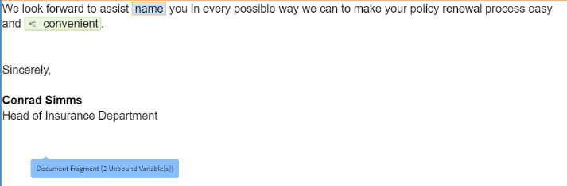
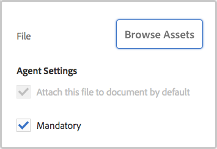
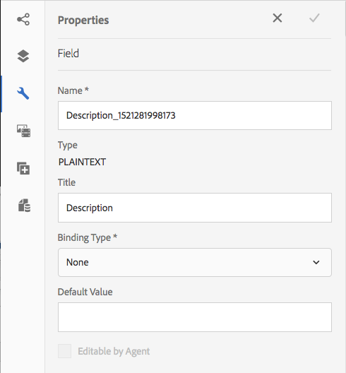

# 대화형 통신 만들기{#create-an-interactive-communication}

## 개요 {#overview}

대화형 커뮤니케이션은 개인화되고 인터랙티브한 통신의 작성, 조립 및 전달을 중앙 집중화하고 관리합니다. 인쇄를 웹용 마스터 채널로 활용하십시오. 대화형 통신의 웹 출력을 만들 때 노력이 중복되는 것을 최소화할 수 있습니다.

### 사전 요구 사항 {#prerequisites}

대화형 통신을 만들기 위한 사전 요구 사항은 다음과 같습니다.

* 설정 [양식 데이터 모델](/help/forms/using/data-integration.md) 테스트 데이터를 포함하거나, Microsoft® Dynamics 인스턴스와 같은 실제 데이터 소스를 사용합니다.
* 다음을 보유하는지 확인합니다. [문서 단편](/help/forms/using/document-fragments.md).
* 다음을 수행했는지 확인: [인쇄 및 웹 채널용 템플릿](/help/forms/using/web-channel-print-channel.md).
* 필요한 사항이 있는지 확인합니다 [테마](/help/forms/using/themes.md) 웹 채널용입니다.

## 대화형 통신 만들기 {#createic}

1. AEM 작성자 인스턴스에 로그인하고 다음으로 이동합니다. **[!UICONTROL Adobe Experience Manager]** > **[!UICONTROL Forms]** > **[!UICONTROL Forms 및 문서]**.
1. 누르기 **[!UICONTROL 만들기]** 및 선택 **[!UICONTROL 대화형 통신]**. 대화형 통신 만들기 페이지가 나타납니다.

   

1. 다음 정보를 입력합니다. :

   * **[!UICONTROL 제목]**: 대화형 통신의 제목을 입력합니다.
   * **[!UICONTROL 이름]**: 대화형 통신의 이름은 사용자가 입력한 제목에서 파생됩니다. 필요한 경우 편집합니다.
   * **[!UICONTROL 설명]**: 대화형 통신에 대한 설명을 입력합니다.
   * **[!UICONTROL 양식 데이터 모델]**: 양식 데이터 모델을 찾아 선택합니다. 양식 데이터 모델에 대한 자세한 내용은 [AEM Forms 데이터 통합](/help/forms/using/data-integration.md).

   * **[!UICONTROL 미리 채우기 서비스]**: 미리 채우기 서비스를 선택하여 데이터를 검색하고 대화형 통신을 미리 채웁니다.
   * **[!UICONTROL 사후 프로세스 유형]**: 대화형 통신이 제출될 때 트리거할 AEM 또는 Forms 워크플로우를 선택할 수 있습니다. 트리거할 워크플로 유형을 선택합니다.

   * **[!UICONTROL 사후 프로세스]**: 트리거할 워크플로우의 이름을 선택합니다. AEM 워크플로를 선택하는 경우 첨부 파일 경로, 레이아웃 경로, PDF 경로, 인쇄 데이터 경로 및 웹 데이터 경로를 제공합니다.
   * **[!UICONTROL 태그]**: 대화형 통신에 적용할 태그를 선택합니다. 새/사용자 지정 태그 이름을 입력하고 Enter 키를 눌러 만들 수도 있습니다.
   * **[!UICONTROL 작성자]**:로그인한 사용자의 사용자 이름에서 작성자 이름을 자동으로 가져옵니다.
   * **[!UICONTROL 게시 날짜:]** 대화형 통신을 게시할 날짜를 입력합니다.
   * **[!UICONTROL 게시 취소 날짜]**: 대화형 통신 게시를 취소할 날짜를 입력합니다.

1. 누르기 **[!UICONTROL 다음]**. 인쇄 및 웹 채널 세부 사항을 지정하는 화면이 나타납니다.
1. 다음을 입력합니다.

   * **[!UICONTROL 인쇄]**: 대화형 통신의 인쇄 채널을 생성하려면 이 옵션을 선택합니다.
   * **[!UICONTROL 인쇄 템플릿]**: XDP를 검색하여 인쇄 템플릿으로 선택합니다.
   * **[!UICONTROL 웹]**: 이 옵션을 선택하여 웹 채널 또는 대화형 통신의 반응형 출력을 생성합니다.
   * **[!UICONTROL 대화형 통신 웹 템플릿]**: 웹 템플릿을 찾아보고 선택합니다.
   * **[!UICONTROL 테마]** 및 **[!UICONTROL 테마 선택]**: 대화형 통신의 웹 채널 스타일을 지정할 테마를 찾아보고 선택합니다. 자세한 내용은 [AEM Forms의 테마](/help/forms/using/themes.md).

   * **[!UICONTROL 웹 채널에 대해 기본으로 인쇄 사용]**: 이 옵션을 선택하여 인쇄 채널과 동기화된 웹 채널을 만듭니다. 인쇄 채널을 웹 채널에 대한 마스터로 사용하면 동기화 를 누를 때 웹 채널의 콘텐츠 및 데이터 바인딩이 인쇄 채널에서 파생되고 인쇄 채널에서 수행된 변경 사항이 웹 채널에 반영됩니다. 그러나 작성자는 필요에 따라 웹 채널에서 특정 구성 요소에 대한 상속을 중단할 수 있습니다. 자세한 내용은 [웹 채널과 인쇄 채널 동기화](../../forms/using/create-interactive-communication.md#synchronize).
을(를) 선택하는 경우 **[!UICONTROL 웹 채널에 대해 기본으로 인쇄 사용]** 옵션을 선택하면 다음 모드 중 하나를 선택하여 웹 채널을 생성할 수 있습니다.

      * **[!UICONTROL 자동 레이아웃]**: 인쇄 채널에서 웹 채널에 대한 자리 표시자, 콘텐츠 및 데이터 바인딩을 자동으로 생성하려면 이 모드를 선택합니다.
      * **[!UICONTROL 수동으로 구성]**: 이 모드에서 사용할 수 있는 마스터 컨텐츠를 사용하여 인쇄 채널 요소를 수동으로 선택하고 웹 채널에 추가하려면 이 모드를 선택합니다. **[!UICONTROL 데이터 소스]** 탭. 자세한 내용은 [인쇄 채널 요소를 선택하여 웹 채널 콘텐츠를 만듭니다.](#selectprintchannelelements).

   인쇄 채널 및 웹 채널에 대한 자세한 내용은 [인쇄 채널 및 웹 채널](/help/forms/using/web-channel-print-channel.md).

1. 누르기 **[!UICONTROL 만들기]**. 대화형 통신이 만들어지고 경고 상자가 나타납니다. 누르기 **[!UICONTROL 편집]** 에 설명된 대로 대화형 통신의 콘텐츠 작성을 시작하려면 [대화형 통신 작성 사용자 인터페이스를 사용하여 콘텐츠 추가](#step2). 또는 을 누를 수 있습니다. **[!UICONTROL 완료]** 나중에 [대화형 통신]을 편집하도록 선택합니다.

## 대화형 통신에 콘텐츠 추가 {#step2}

대화형 통신을 만든 후에는 대화형 통신 작성 인터페이스를 사용하여 해당 콘텐츠를 구성할 수 있습니다.

대화형 통신 작성 인터페이스에 대한 자세한 내용은 [대화형 통신 작성 소개](/help/forms/using/introduction-interactive-communication-authoring.md).

1. 대화형 통신 작성 인터페이스는에 언급된 대로 편집 을 탭할 때 실행됩니다 [대화형 통신 만들기](#createic). 또는 AEM에서 기존 대화형 통신 에셋으로 이동하여 선택하고 을 누를 수 있습니다 **[!UICONTROL 편집]** 대화형 통신 작성 인터페이스를 시작합니다.

   대화형 통신이 웹 채널 전용이 아닌 경우 기본적으로 대화형 통신의 인쇄 채널이 나타납니다. 대화형 통신의 인쇄 채널에는 선택한 XDP/인쇄 채널 템플릿에서 사용할 수 있는 대상 영역이 표시됩니다. 이러한 대상 영역 및 필드에서 구성 요소 또는 에셋을 추가할 수 있습니다.

1. 인쇄 채널을 선택한 상태에서 **[!UICONTROL 구성 요소]** 탭. 인쇄 채널에서는 다음 구성 요소를 사용할 수 있습니다.

   | **구성 요소** | **기능** |
   |---|---|
   | Chart | 양식 데이터 모델 컬렉션에서 검색한 2차원 데이터의 시각적 표현을 위해 대화형 통신에서 사용할 수 있는 차트를 추가합니다. 자세한 내용은 [대화형 커뮤니케이션에서 차트 사용](/help/forms/using/chart-component-interactive-communications.md). |
   | 문서 조각 | 대화형 통신에 텍스트, 목록 또는 조건과 같은 재사용 가능한 구성 요소를 추가할 수 있습니다. 추가된 구성 요소는 양식 데이터 모델 기반이거나 양식 데이터 모델이 없을 수 있습니다. |
   | 이미지 | 이미지를 삽입할 수 있습니다. |

   구성 요소를 대화형 통신에 드래그 앤 드롭한 다음 필요에 따라 구성합니다.

   인쇄 채널과 웹 채널 모두에 대해 대화형 통신을 작성하는 동안 실행 취소 및 재실행 작업을 사용할 수도 있습니다.

   실행 취소 작업을 사용하여 마지막으로 수행된 작업을 삭제하고 재실행 작업을 사용하여 삭제된 작업을 다시 통합합니다. 예를 들어, 대화형 통신에서 이미지를 삽입하거나 데이터 바인딩을 만들었으며 이를 삭제해야 하는 경우 실행 취소 작업을 사용하십시오.

   

   실행 취소 및 재실행 옵션이 작성 UI 페이지 도구 모음에 표시됩니다. 실행 취소 옵션은 작업을 수행한 후에만 표시됩니다. 실행 취소 작업을 수행한 후에만 페이지 도구 모음에 다시 실행 옵션이 표시됩니다. 이러한 작업은 페이지를 새로 고칠 때 재설정됩니다.

1. 인쇄 채널을 선택한 상태에서 **[!UICONTROL 에셋]** 탭을 탭하고 필터를 적용하여 보려는 자산만 표시합니다.

   에셋 브라우저를 사용하여 에셋을 대화형 통신 대상 영역으로 직접 끌어다 놓을 수도 있습니다.

   

1. 문서 조각을 대화형 통신으로 드래그 앤 드롭합니다. 다음은 대화형 통신의 인쇄 채널에서 사용할 수 있는 문서 조각 유형입니다.

<table>
 <tbody>
  <tr>
   <td><strong>문서 단편 유형</strong></td>
   <td><strong>예제 목적</strong></td>
  </tr>
  <tr>
   <td><a href="/help/forms/using/texts-interactive-communications.md" target="_blank">텍스트</a></td>
   <td>주소, 수신자 이메일 및 서신의 본문을 추가하기 위한 텍스트 </td>
  </tr>
  <tr>
   <td><a href="/help/forms/using/conditions-interactive-communications.md" target="_blank">조건</a></td>
   <td>정책 유형(표준 또는 프리미엄)을 기반으로 통신에 적절한 헤더 이미지를 추가하는 조건. <br /> </td>
  </tr>
  <tr>
   <td>목록</td>
   <td>텍스트, 조건, 기타 목록 및 이미지를 포함한 문서 단편 그룹. <br /> </td>
  </tr>
 </tbody>
</table>

를 사용하여 대상 영역에 새 조각을 드롭하여 대상 영역과 문서 조각 간의 바인딩을 바꿀 수도 있습니다. **[!UICONTROL 에셋]** 탭. 조각을 드래그하는 동안 대상 영역의 파란색 색상 음영은 문서 조각을 대상 영역으로 놓을 수 있음을 나타냅니다.

문서 조각에 대한 자세한 내용은 [문서 단편](/help/forms/using/document-fragments.md).

작성 인터페이스를 사용하면 대화형 통신 내에서 바인딩되지 않은 필드와 바인딩된 필드 및 변수를 구별할 수 있습니다. 인터페이스는 주황색 테두리를 사용하여 바인딩되지 않은 필드 및 변수를 강조 표시합니다.


또한 이러한 요소 위로 마우스를 가져가면 필드(바인딩되지 않음) 또는 변수(바인딩되지 않음) 메시지와 함께 도구 설명이 표시됩니다.

문서 조각에 사용된 언바운드 변수가 작성 인터페이스에 표시되지 않는 경우가 있습니다. 문서 조각 내의 인라인 텍스트 규칙 또는 조건 조각의 경우 발생할 수 있습니다. 이러한 경우 파란색으로 강조 표시된 도구 설명이 문서 조각의 일부로 표시됩니다. 툴팁은 문서 단편 내에 사용된 바인딩되지 않은 변수 수를 표시합니다.



문서 조각을 탭하고 을 탭합니다.  (구성), 을 차례로 누릅니다. **[!UICONTROL 속성]** 인터랙티브 커뮤니케이션의 사이드 킥에서. 다음 **[!UICONTROL 변수 및 데이터 모델 개체]** 섹션에는 숨겨진 변수를 포함한 변수와 문서 조각에 사용된 데이터 모델 개체가 나열됩니다. 사용  (편집) 아이콘을 클릭하면 각 데이터 모델 개체 또는 변수 옆에 있는 속성을 편집할 수 있습니다.

1. 변수의 바인딩을 설정하려면 변수를 탭하고 선택합니다.  (구성)을 선택한 다음 사이드바의 속성 패널에서 바인딩 속성을 설정합니다.

   * **없음**: 에이전트가 변수의 값을 채웁니다.
   * **텍스트 단편**: 선택한 경우, 필드에서 콘텐츠가 렌더링되는 텍스트 문서 조각을 찾아 선택할 수 있습니다. 해당 텍스트 문서 조각만 내에 변수가 없는 변수에 바인딩할 수 있습니다.
   * **데이터 모델 개체**: 필드에 값이 채워진 양식 데이터 모델 속성을 선택합니다.
   * **기본값:** 이 필드를 사용하여 변수의 기본값을 정의할 수 있습니다. 대화형 통신을 미리 볼 때 또는 Agent UI에서 값이 표시됩니다.
   * **표시 패턴:** 변수에 대한 표시 형식을 정의할 수도 있습니다. 에서 사전 정의된 옵션을 선택합니다. **유형** 드롭다운 목록을 사용하여 변수에 표시 형식을 적용합니다. 선택 **사용자 정의** 목록에서 사용할 수 없는 표시 패턴을 정의합니다. 자세한 내용은 [데이터 표시 패턴](../../forms/using/create-interactive-communication.md#datadisplaypatterns).

   다음으로 이동 [변수 및 데이터 모델 개체](../../forms/using/create-interactive-communication.md#hiddenvariables) 문서 조각에 숨겨진 변수의 바인딩을 설정합니다.

   데이터 소스 요소나 텍스트 문서 조각을 드래그 앤 드롭하여 변수의 바인딩을 설정할 수도 있습니다.  데이터 소스 요소를 사용하여 바인딩을 만들려면 **데이터 소스** 을 탭하고 요소를 변수 이름으로 드래그 앤 드롭합니다. 바인딩을 성공적으로 설정하려면 데이터 소스 요소와 변수의 형식이 같아야 합니다. 데이터 소스 요소를 이미 바인딩된 변수로 드래그 앤 드롭하면 새 요소가 이전 요소를 대체하여 변수로 새 바인딩을 만듭니다. 마찬가지로 **에셋** 텍스트 문서 조각을 탭하고 변수 이름으로 드래그 앤 드롭하여 둘 사이의 바인딩을 설정합니다. 텍스트 문서 조각에는 변수가 없어야 합니다.

1. 인쇄 채널을 선택한 상태로 테이블을 추가하려면 **[!UICONTROL 에셋]** 탭 필터를 적용하여 레이아웃 단편만 표시합니다. 필요한 레이아웃 조각을 대화형 통신에 드래그 앤 드롭합니다. 레이아웃 조각은 XDP를 기반으로 하며 동적 데이터로 채워지는 대화형 통신에서 그래픽 레이아웃 또는 정적 및 동적 테이블을 만드는 데 사용할 수 있습니다.

   예: 이전 및 새 정책에 대한 총 프리미엄, 로열티 할인 % 및 긴급 도로변 지원 가용성을 표시하는 레이아웃 테이블입니다.

   레이아웃 단편에 대한 자세한 내용은 [문서 단편](/help/forms/using/document-fragments.md).

1. 인쇄 채널을 선택한 상태에서 **[!UICONTROL 에셋]** 탭은 필터를 적용하여 이미지를 표시합니다. 회사 로고와 같이 필요한 이미지를 대화형 통신에 드래그 앤 드롭합니다.

   또한 대화형 커뮤니케이션에서 다음을 관리합니다.

   * [차트 추가 및 구성](/help/forms/using/chart-component-interactive-communications.md)
   * [인쇄 채널과 웹 채널 동기화](../../forms/using/create-interactive-communication.md#synchronize)

      * 자동 동기화
      * 상속 취소
      * 상속 다시 활성화
      * 동기화
   * [첨부 파일 및 라이브러리 액세스](../../forms/using/create-interactive-communication.md#attachmentslibrary)
   * [XDP/레이아웃 필드 속성](../../forms/using/create-interactive-communication.md#xdplayoutfieldproperties)
   * [구성 요소에 규칙 추가](../../forms/using/create-interactive-communication.md#rules)


1. 다음으로 전환 **[!UICONTROL 웹 채널]**. 웹 채널이 대화형 통신 편집기에 나타납니다. 처음으로 인쇄 채널에서 웹 채널로 전환하면 자동 동기화가 발생합니다. 자세한 내용은 [인쇄 채널에서 웹 채널 동기화](../../forms/using/create-interactive-communication.md#synchronize).

   이 예제에서는 웹용 마스터로 인쇄를 사용하고 있으므로 인쇄 채널 자리 표시자, 콘텐츠 및 데이터 바인딩이 웹 채널에 동기화됩니다. 하지만 웹 채널에서 특정 콘텐츠를 변경하고 사용자 지정할 수 있습니다. [상속 취소](#cancelinheritance) 인쇄 채널을 사용하여 생성된 대상 영역 및 변수에서 콘텐츠를 사용자 지정할 수 있습니다.

   

   문서 조각을 탭하고 을 탭합니다.  (구성), 을 차례로 누릅니다. **[!UICONTROL 속성]** 인터랙티브 커뮤니케이션의 사이드 킥에서. 다음 **[!UICONTROL 변수 및 데이터 모델 개체]** 섹션에는 숨겨진 변수를 포함한 변수와 문서 조각에 사용된 데이터 모델 개체가 나열됩니다. 사용  (편집) 아이콘을 클릭하면 각 데이터 모델 개체 또는 변수 옆에 있는 속성을 편집할 수 있습니다. 또한 다음을 수행한 문서 조각의 경우 [자동 생성됨](#synchronize) 인쇄 채널을 사용하는 웹 채널에서  (상속 취소) 아이콘을 클릭하면 각 데이터 모델 개체와 변수 옆에 [상속 취소](#cancelinheritance) 편집할 수 있습니다.

1. 웹 채널을 선택한 상태로 웹 채널에 구성 요소를 추가하려면 을 누릅니다 **[!UICONTROL 구성 요소]**. 필요에 따라 대화형 통신의 웹 채널에서 구성 요소를 드래그 앤 드롭한 다음 구성을 계속합니다.

   | 구성 요소 | 기능 |
   |---|---|
   | Chart | 양식 데이터 모델 컬렉션에서 검색한 2차원 데이터의 시각적 표현을 위해 대화형 통신에서 사용할 수 있는 차트를 추가합니다. 자세한 내용은 [차트 구성 요소 사용](../../forms/using/chart-component-interactive-communications.md). |
   | 문서 조각 | 재사용 가능한 구성 요소, 텍스트, 목록 또는 조건을 대화형 통신에 추가할 수 있습니다. 대화형 통신에 추가하는 재사용 가능한 구성 요소는 양식 데이터 모델 기반이거나 양식 데이터 모델이 없을 수 있습니다. |
   | 이미지 | 이미지를 삽입할 수 있습니다. |
   | 패널 | 다음을 추가할 수 있습니다. [패널](../../forms/using/create-interactive-communication.md#add-panel-component-to-the-web-channel) 를 입력합니다. |
   | 표 | 행 및 열에 데이터를 구성할 수 있는 표를 추가합니다. |
   | 대상 영역 | 웹 채널에 대상 영역을 삽입하여 웹 채널별 구성 요소를 구성합니다. Target 영역은 웹 채널별 구성 요소를 그룹화할 수 있는 일반 컨테이너입니다. |
   | 텍스트 | 대화형 통신의 웹 채널에 서식 있는 텍스트를 추가합니다. 또한 텍스트는 양식 데이터 모델 개체를 사용하여 콘텐츠를 동적으로 만들 수도 있습니다. |
   | 버튼 | 다음을 추가할 수 있습니다. [단추](../../forms/using/create-interactive-communication.md#add-button-component-to-the-web-channel) 를 입력합니다. Button 구성 요소를 사용하여 다른 대화형 통신, 적응형 양식, 이미지 또는 문서 조각과 같은 기타 에셋 또는 외부 URL로 이동할 수 있습니다. |
   | 분리자 | 대화형 통신 내에 가로줄을 삽입할 수 있습니다. 이 구성 요소를 사용하여 서신의 섹션을 구분합니다. 예를 들어 구분 기호 구성 요소를 사용하여 신용 카드 명세서에서 고객 세부 정보 및 신용 카드 세부 정보 섹션을 구분할 수 있습니다. |

1. 필요에 따라 웹 채널에 자산을 삽입합니다.

   다음을 수행할 수 있습니다. [대화형 통신 미리 보기](#previewic) 인터랙티브 커뮤니케이션의 인쇄 및 웹 출력이 어떻게 보이는지 확인하고 필요에 따라 계속 변경합니다.

## 대화형 통신 미리 보기 {#previewic}

다음을 사용할 수 있습니다. **미리 보기 옵션** 대화형 통신의 모양을 평가할 수 있습니다. 대화형 통신의 웹 채널은 또한 다양한 디바이스를 위한 대화형 통신의 경험을 에뮬레이트하기 위한 옵션을 제공한다. 예를 들어 iPhone, iPad 및 데스크톱이 있습니다. 두 가지를 모두 사용할 수 있습니다. **미리 보기** 및 **에뮬레이터**  화면 크기가 다른 장치에 대한 웹 출력을 미리 보기 위해 서로 함께 사용하는 옵션입니다. 미리 보기의 샘플 데이터는 지정된 양식 데이터 모델에서 채워집니다.

1. 미리 볼 (인쇄 또는 웹) 채널을 선택하고 미리 보기를 누릅니다. 대화형 통신이 나타납니다.

   >[!NOTE]
   >
   >미리 보기는 지정된 양식 데이터 모델의 샘플 데이터로 채워집니다. 다른 데이터를 사용하여 대화형 통신을 미리 보거나 미리 채우기 서비스를 사용하는 방법에 대한 자세한 내용은 다음을 참조하십시오. [양식 데이터 모델 사용](/help/forms/using/using-form-data-model.md) 및 [양식 데이터 모델 작업](/help/forms/using/work-with-form-data-model.md).

1. 웹 채널의 경우 다음을 사용하십시오.  다양한 장치에서 대화형 통신이 어떻게 보이는지 봅니다.

   

또한 다음과 같은 작업을 수행할 수 있습니다 [에이전트 UI를 사용하여 대화형 통신 준비 및 보내기](/help/forms/using/prepare-send-interactive-communication.md).

## 대화형 통신에서 속성 구성  {#configure-properties-in-interactive-communication}

### 첨부 파일 및 라이브러리 액세스 {#attachmentslibrary}

인쇄 채널에서는 에이전트가 대화형 통신을 위한 에이전트 UI에서 첨부 파일을 관리하도록 첨부 파일 및 라이브러리 액세스를 구성할 수 있습니다.

1. 인쇄 채널에서 문서 컨테이너를 강조 표시하고 을 누릅니다 **속성**.

   

   사이드바에 속성 패널이 나타납니다.

   

1. 확장 **첨부 파일** 및 다음 속성을 지정합니다.

   * **[!UICONTROL 라이브러리 액세스 허용]**: 에이전트 UI에서 에이전트에 대한 라이브러리 액세스를 활성화하려면 선택합니다. 활성화된 경우 에이전트는 대화형 통신을 준비하는 동안 라이브러리에서 파일을 추가할 수 있습니다.
   * **[!UICONTROL 첨부 파일 재정렬 허용]**: 에이전트가 대화형 통신을 사용하여 첨부 파일을 다시 정렬할 수 있도록 하려면 선택합니다.
   * **[!UICONTROL 허용되는 최대 첨부 파일 수]**: 대화형 통신에서 허용되는 최대 첨부 파일 수를 지정합니다.
   * **[!UICONTROL 첨부할 파일]**: 탭 **[!UICONTROL 추가]** 을 클릭하고 첨부할 파일을 찾아 선택한 후 다음을 지정합니다.

      * **[!UICONTROL 기본으로 이 파일을 문서에 첨부]**: 첨부 파일이 필수가 아닌 경우에만 이 옵션을 변경할 수 있습니다.
      * **[!UICONTROL 필수:]** 에이전트가 에이전트 UI에서 첨부 파일을 제거할 수 없습니다.

   

1. **[!UICONTROL Done]**&#x200B;을 누릅니다.

### XDP/레이아웃 필드 속성 {#xdplayoutfieldproperties}

1. 대화형 통신의 인쇄 채널을 편집하는 동안 인쇄 채널 템플릿에 빌드된 필드를 마우스로 가리킨 다음 을 선택합니다  (구성).

   사이드바에 속성 대화 상자가 나타납니다.

   

1. 다음을 지정합니다.

   * **[!UICONTROL 이름]**: JCR 노드 이름입니다.
   * **[!UICONTROL 제목]**: 에이전트 UI와 문서 컨테이너 트리에서 에이전트가 볼 수 있는 제목을 입력합니다.
   * **[!UICONTROL 바인딩 유형]**: 필드에 대해 다음 바인딩 유형 중 하나를 선택합니다.

      * 없음: 에이전트가 속성 값을 채웁니다.
      * 텍스트 조각: 선택한 경우 필드에서 콘텐츠가 렌더링되는 텍스트 문서 조각을 찾아 선택할 수 있습니다. 또는 텍스트 문서 조각을 필드 이름으로 드래그 앤 드롭하여 둘 사이의 바인딩을 설정합니다. 텍스트 문서 조각에는 변수가 없어야 합니다.
      * 데이터 모델 개체: 필드에 값이 채워진 양식 데이터 모델 속성을 선택합니다. 또는 **데이터 소스** 속성을 탭하고 필드에 드래그 앤 드롭합니다.
   * **[!UICONTROL 기본값]**: 기본값은 지정된 데이터 모델 개체 또는 텍스트 조각에서 제공하는 값이 없는 경우 필드가 비어 있지 않은지 확인합니다. 데이터 바인딩 유형이 none이면 기본값이 필드에 미리 채워집니다.
   * **[!UICONTROL 패턴 표시]**: 필드의 표시 형식을 정의할 수도 있습니다. 에서 사전 정의된 옵션을 선택합니다. **유형** 필드에 표시 형식을 적용하는 드롭다운 목록입니다. 선택 **사용자 정의** 목록에서 사용할 수 없는 표시 패턴을 정의합니다. 자세한 내용은 [데이터 표시 패턴](../../forms/using/create-interactive-communication.md#datadisplaypatterns)

   * **[!UICONTROL 에이전트에서 편집 가능]**: 에이전트가 에이전트 UI의 필드에서 값을 편집할 수 있도록 하려면 선택합니다. 바인딩 유형이 텍스트 조각인 경우에는 이 설정을 적용할 수 없습니다.
   * **[!UICONTROL 레이블]**: 에이전트 UI에서 에이전트에 대한 필드와 함께 표시되는 텍스트 문자열을 지정합니다. 바인딩 유형이 텍스트 조각인 경우에는 이 설정을 적용할 수 없습니다.
   * **[!UICONTROL 툴팁]**: 마우스로 에이전트 UI의 에이전트에 표시할 텍스트 문자열을 입력합니다. 바인딩 유형이 텍스트 조각인 경우에는 이 설정을 적용할 수 없습니다.
   * **[!UICONTROL 필수]**: 에이전트의 필수 필드를 만들려면 선택합니다. 바인딩 유형이 텍스트 조각인 경우에는 이 설정을 적용할 수 없습니다.
   * **[!UICONTROL 여러 줄 허용]**: 이 필드를 선택하여 여러 줄의 텍스트를 필드에 입력할 수 있습니다. 바인딩 유형이 텍스트 조각인 경우에는 이 설정을 적용할 수 없습니다.


1. 누르기 .

### 데이터 표시 패턴 {#datadisplaypatterns}

작성 인터페이스를 사용하면 인쇄 및 웹 채널용 대화형 통신을 만드는 동안 사용할 수 있는 필드, 변수 및 양식 데이터 모델 요소에 대한 데이터 표시 패턴을 정의할 수 있습니다.

데이터 표시 패턴을 구성하려면 요소를 누르고 다음을 선택합니다.  (구성)을 선택하고 **[!UICONTROL 속성]** 패널을 사이드바에 표시합니다. 에서 사전 정의된 옵션을 선택합니다. **[!UICONTROL 유형]** 드롭다운 목록을 통해 선택한 유형과 연관된 패턴을 볼 수 있습니다. 선택 **[!UICONTROL 사용자 정의]** 다음에서 **[!UICONTROL 유형]** 드롭다운 목록에서 사용할 수 없는 패턴을 정의합니다. 에서 값 편집 **[!UICONTROL 패턴]** 필드는 형식을 자동으로 다음으로 수정합니다. **[!UICONTROL 사용자 정의]**.

표시 패턴을 적용하려면 패턴 필드에 정의된 문자 또는 자릿수가 필드, 변수 및 양식 데이터 모델 요소의 값에 정의된 문자 또는 자릿수와 일치하거나 초과해야 합니다. 자세한 내용은 [예](../../forms/using/create-interactive-communication.md#greaternumberofdigits).


인쇄 채널에서 웹 컨텐츠를 생성한 후 필드, 변수 또는 양식 데이터 모델 요소의 표시 패턴을 다시 정의할 수 있습니다. 그 결과, 요소는 인쇄 채널과 웹 채널에 대해 정의된 상이한 디스플레이 패턴을 가질 수 있다. 인쇄 채널의 요소에 대한 표시 패턴을 정의하지 않고 인쇄 채널을 사용하여 웹 컨텐츠를 자동 생성하는 경우 인쇄 채널의 요소에 대해 정의된 데이터 바인딩은에서 사용할 수 있는 표시 패턴 옵션을 정의합니다. **[!UICONTROL 유형]** 드롭다운 목록입니다. 요소에 대해 정의된 바인딩이 없으면 요소의 데이터 형식은 사용 가능한 표시 패턴 옵션을 정의합니다. 예를 들어, 인쇄 채널의 요소에 대해 숫자 유형의 데이터 바인딩을 만드는 경우 **[!UICONTROL 유형]** 드롭다운 목록은 다양한 형식의 숫자 유형입니다.

다음으로 전환 **미리 보기** 이러한 요소에 적용된 표시 패턴을 보려면 Agent UI를 탭하거나 여십시오.

다음 표에는 변수에 대한 데이터 표시 패턴을 설정한 결과로 표시되는 값의 예가 나와 있습니다.

| 유형 | 기본값 | 패턴 표시 | 값 표시 | 설명 |
|---|---|---|---|---|
| 사회보장번호 | 123456789 | 텍스트{999-99-9999} | 123-45-6789 | 기본값 필드의 자릿수는 패턴 필드의 자릿수와 일치합니다. 패턴을 기반으로 한 값이 성공적으로 표시됩니다. |
| 사회보장번호 | 1234567 | 텍스트{999-99-9999} | 1-23-4567 | 기본값 필드의 자릿수가 패턴 필드의 자릿수보다 적습니다. 패턴은 사용 가능한 7자리 숫자에 적용됩니다. |
| 사회보장번호 | 1234567890 | 텍스트{999-99-9999} | 1234567890 | 기본값 필드의 자릿수가 패턴 필드의 자릿수보다 큽니다. 결과적으로 표시 값에는 변경 사항이 없습니다. |

변수 또는 양식 데이터 모델 요소에 대해 표시 패턴이 지정되지 않은 경우 [글로벌 문서 단편 구성](https://helpx.adobe.com//experience-manager/6-5/forms/using/interactive-communication-configuration-properties.html) 는 기본적으로 사용됩니다.

숫자 데이터 유형의 변수에 표시 패턴을 적용하지 않는 경우 인쇄 미리 보기에는 글로벌 문서 조각 구성에 따라 패턴이 표시됩니다. 기본 전역 문서 조각 구성에 변경 사항을 적용하면 로케일에 대해 정의된 기본 구분 기호에 따라 에이전트 UI에 패턴이 표시됩니다.

마찬가지로 필드의 경우 표시 패턴이 지정되지 않으면 인쇄 템플릿(XDP)을 생성하는 동안 정의된 패턴이 필드에 적용됩니다. 인쇄 템플릿을 만드는 동안 패턴이 없으면 XFA 사양을 기반으로 하는 기본 패턴이 필드에 적용됩니다.

또한 지정된 표시 패턴이 올바르지 않거나 적용할 수 없는 경우 XFA 사양을 기반으로 하는 기본 패턴이 필드, 변수 또는 양식 데이터 모델 요소에 적용됩니다.

## 대화형 통신 구성 요소에 규칙 적용 {#rules}

대화형 통신에서 구성 요소 또는 컨텐츠를 조건화하려면 구성 요소/컨텐츠를 탭하고 을 선택합니다  (규칙 만들기) 를 클릭하여 규칙 편집기를 실행합니다.

자세한 내용은 다음을 참조하십시오.

* [규칙 편집기](/help/forms/using/rule-editor.md)
* [대화형 통신 작성 소개](/help/forms/using/introduction-interactive-communication-authoring.md)

## 표 사용 {#tables}

### 대화형 통신의 다이내믹 테이블 {#dynamic-tables-in-interactive-communication}

레이아웃 조각을 사용하여 대화형 통신에서 동적 테이블을 추가할 수 있습니다. 다음 단계에서는 대화형 통신에서 동적 테이블을 생성하기 위한 레이아웃 조각의 사용을 설명하기 위해 신용 카드 문의 예를 사용합니다.

1. 테이블 작성에 필요한 레이아웃 조각을 AEM에서 사용할 수 있는지 확인합니다.
1. 대화형 통신의 인쇄 채널에서 에셋 브라우저의 Target 영역에 레이아웃 조각(다중 열 테이블 포함)을 끌어다 놓습니다.

   

   대화형 통신 레이아웃 영역에 테이블이 나타납니다.

   

1. 표의 각 셀에 대한 데이터 바인딩을 지정합니다. 반복 가능한 행을 만들려면 일반 컬렉션 속성에 속하는 행에 양식 데이터 모델 속성을 삽입합니다.

   1. 테이블에서 셀을 탭하고 선택  (구성).

      사이드바에 속성 대화 상자가 나타납니다.

      

   1. 속성을 구성합니다.

      * **[!UICONTROL 이름]**: JCR 노드 이름입니다.
      * **[!UICONTROL 제목]**: 대화형 통신 편집기에 표시되는 제목을 입력합니다.
      * **[!UICONTROL 바인딩 유형]**: 필드에 대해 다음 바인딩 유형 중 하나를 선택합니다.

         * **[!UICONTROL 없음]**
         * **[!UICONTROL 데이터 모델 개체]**: 양식 데이터 모델 속성의 값이 필드에 채워집니다. 또는 **데이터 소스** 속성을 탭하고 필드에 드래그 앤 드롭합니다.
      * **[!UICONTROL 데이터 모델 개체]**: 값이 필드에 채워지는 양식 데이터 모델 속성입니다.
      * **[!UICONTROL 기본값]**: 기본값은 지정된 데이터 모델 개체에서 제공하는 값이 없을 때 필드가 비어 있지 않음을 의미합니다. 기본값은 필드에 미리 채워져 있습니다.

      * **[!UICONTROL 에이전트에서 편집 가능]**: 에이전트가 에이전트 UI의 필드에서 값을 편집할 수 있도록 하려면 선택합니다.
   1. 누르기 .


1. 대화형 통신을 미리 보고 데이터로 렌더링된 테이블을 확인합니다.

   

### 웹 채널 전용 테이블 {#webchanneltables}

웹 템플릿에서 루트 패널을 탭하고 을 누릅니다. **+** 추가 **표** 구성 요소를 대화형 통신에 추가합니다. 대화형 통신에는 두 개의 행을 포함하는 테이블이 삽입됩니다. 테이블의 첫 행은 테이블 헤더를 나타냅니다.

#### 표에 행 및 열 추가 {#addrowscolumnstable}

**열을 추가 또는 삭제하려면 다음을 수행합니다.**

1. 표 머리글 행에서 기본 텍스트 상자를 탭하여 구성 요소 도구 모음을 확인합니다.
1. 선택 **열 추가** 또는 **열 삭제** 테이블 열을 각각 추가하거나 삭제합니다.


**행을 추가하거나 삭제하려면 다음을 수행합니다.**

1. 테이블 행을 탭하여 구성 요소 도구 모음을 봅니다. 대화형 통신의 사이드 킥에서 콘텐츠 브라우저를 사용하여 테이블 행을 선택할 수도 있습니다.
1. 선택 **행 추가** 또는 **행 삭제** 테이블 행을 각각 추가 또는 삭제합니다. 사용 **위로 이동** 및 **아래로 이동** 도구 모음에서 테이블에서 행을 재배열하는 데 사용할 수 있는 옵션입니다.


**A.** 행 추가 **B.** 행 삭제 **C.** 위로 이동 **D.** 아래로 이동

#### 표 셀에서 텍스트 추가 또는 편집 {#addedittexttable}

1. 표 셀에서 기본 텍스트 상자를 선택하고  (편집).
1. 표 셀에 텍스트를 입력하고 를 누릅니다  저장하려고.

#### 테이블 셀과 데이터 모델 개체 요소 간의 바인딩 만들기 {#createbindingtablecells}

1. 표 행에서 기본 텍스트 상자를 선택하고 을 누릅니다  (편집).
1. 데이터 모델 개체 드롭다운 목록을 탭하고 속성을 선택합니다.
1. 를 탭하여 테이블 셀과 데이터 모델 개체 속성 간에 바인딩을 저장하고 만듭니다.


#### 표 셀에서 텍스트에 대한 하이퍼링크 만들기 {#createhyperlinktable}

1. 표 셀에서 기본 텍스트 상자를 선택하고  (편집).
1. 테이블 셀에서 텍스트를 선택하고 하이퍼링크 아이콘을 누릅니다.
1. 에서 URL을 지정합니다. **경로** 필드.
1. 누르기  하이퍼링크 속성을 저장합니다.


#### 동적 표 만들기 {#createdynamictables}

유형 컬렉션의 데이터 모델 속성을 사용하여 대화형 통신에서 웹 채널 전용 동적 테이블을 만들 수 있습니다. 이러한 테이블은 컬렉션 속성의 하위 속성을 나타냅니다. 표에 있는 여러 셀의 서식 속성만 편집할 수 있습니다.

1. 웹 채널로 전환한 다음 데이터 소스 브라우저를 표시하도록 선택합니다.
1. 컬렉션 속성을 하위 양식으로 끌어서 놓습니다. 하위 폼에 테이블이 만들어집니다.
1. 대화형 통신의 웹 미리 보기에서 표를 미리 봅니다.

#### 테이블의 열 정렬 {#sortcolumns}

대화형 통신에서 테이블의 열을 기준으로 데이터를 정렬할 수 있습니다. 열의 값을 오름차순 또는 내림차순으로 정렬할 수 있습니다.

정렬은 다음을 포함하는 테이블 열에 적용할 수 있습니다.

* 정적 텍스트
* 데이터 모델 개체 속성
* 정적 텍스트 및 데이터 모델 개체 속성의 조합

정렬을 활성화하려면

1. 표를 선택하고 을 누릅니다  (구성). 다음을 사용하여 테이블을 선택할 수도 있습니다. **콘텐츠** 대화형 통신의 사이드 킥에 있는 브라우저.
1. 선택 **정렬을 활성화합니다.**
1. 누르기  테이블 속성을 저장합니다. 열 헤더의 정렬 아이콘 위쪽 및 아래쪽 화살표는 정렬이 활성화되었음을 나타냅니다.

   

1. 다음으로 전환 **미리 보기** 모드 를 클릭하여 출력을 확인합니다. 테이블은 테이블의 첫 번째 열을 기준으로 자동으로 정렬됩니다.
1. 열 헤더를 클릭하여 열을 기준으로 값을 정렬합니다.

   위쪽 화살표가 있는 열 머리글은 다음을 나타냅니다.

   * 테이블은 해당 열을 기준으로 정렬됩니다.
   * 열의 값은 오름차순으로 표시됩니다.

   

   마찬가지로 아래쪽 화살표가 있는 열 머리글은 열의 값이 내림차순으로 표시됨을 나타냅니다.

## 대화형 통신 속성 편집 {#edit-interactive-communication-properties}

대화형 통신을 만들면 나중에 해당 속성을 편집할 수 있습니다.

사용 **속성** 페이지 위치:

* 대화형 통신을 만드는 동안 지정된 필드(예: 제목 및 설명)의 값을 편집합니다.
* 기존 대화형 커뮤니케이션에 대한 웹 채널을 추가하거나 삭제합니다.
* 대화형 통신 미리 보기, 다운로드 또는 삭제
* 를 엽니다. [에이전트 UI](/help/forms/using/prepare-send-interactive-communication.md).

에 액세스하려면 **속성** 페이지:

1. AEM 작성자 인스턴스에 로그인하고 다음으로 이동합니다. **Adobe Experience Manager** > **Forms** > **Forms 및 문서**.
1. 대화형 통신을 선택하고 을 누릅니다 **속성**.
1. 다음 항목 선택 **일반** 탭을 사용하여 편집 **제목** 및 **설명** 필드.

### 웹 채널 추가 또는 삭제 {#add-or-delete-the-web-channel}

다음 단계를 실행하여 기존 대화형 커뮤니케이션에 대한 웹 채널을 추가합니다.

1. 다음에서 **속성** 페이지에서 **채널** 탭.
1. 다음 항목 선택 **웹** 확인란을 선택하고 웹 채널의 템플릿을 선택합니다.
1. 선택 **웹 채널에 대해 기본으로 인쇄 사용** 웹 채널과 인쇄 채널 간의 동기화를 활성화하십시오.
1. 누르기 **저장 및 닫기** 변경 내용을 저장합니다.

   마찬가지로 **웹** 의 확인란 **채널** 탭으로 이동하여 대화형 통신에서 웹 채널을 삭제합니다.

## 웹 채널에 버튼 구성 요소 추가 {#add-button-component-to-the-web-channel}

단추를 대화형 통신의 웹 채널에 구성 요소로 추가할 수 있습니다. 다음을 사용하여 규칙 정의 [규칙 편집기](../../forms/using/rule-editor.md) 단추를 탭하여 다른 대화형 통신, 적응형 양식, 이미지 또는 문서 조각과 같은 기타 에셋 또는 외부 URL로 이동할 수 있습니다.

버튼을 추가하고 규칙을 정의하려면 다음을 수행합니다.

1. 웹 템플릿에서 루트 패널을 탭하고 을 누릅니다. **+** 을(를) 추가하려면 **단추** 구성 요소를 대화형 통신에 추가합니다.
1. 버튼 구성 요소를 탭하고 을 탭합니다  을 클릭하여 버튼을 누를 때 규칙을 정의합니다.
1. 다음에서 **날짜** 섹션, 선택 **클릭함** 을 클릭합니다.
1. 다음에서 **그러면** 섹션:

   1. 드롭다운 목록에서 작업을 선택합니다. 예를 들어 을 선택합니다. **다음으로 이동** 를 작업 유형으로 사용하십시오.

   1. 대화형 통신, 적응형 양식, 에셋 또는 웹 페이지의 URL을 지정합니다. 예를 들어 다른 대화형 통신으로 이동하려면 다음 형식으로 URL을 지정하십시오. https://&lt;server-name>:&lt;port>/editor.html/content/forms/af/&lt;interactive communication=&quot;&quot; name=&quot;&quot;>/channels/&lt;channel name=&quot;&quot; print=&quot;&quot; or=&quot;&quot; web=&quot;&quot;>.html
   1. 동일한 탭, 새 탭 또는 새 창에서 에셋을 여는 옵션을 지정합니다.
   1. 누르기 **완료** 그런 다음 을 누릅니다 **닫기** 을 눌러 규칙을 저장합니다.

   마찬가지로 작업 유형 드롭다운 목록에서 서비스 호출 및 양식 제출과 같은 다른 사용 가능한 옵션을 선택할 수 있습니다. 자세한 내용은 [규칙 편집기](../../forms/using/rule-editor.md).

1. 대화형 통신을 미리 보고 버튼을 탭하여 대화형 통신, 적응형 양식, 에셋 또는 4단계(b)에서 지정된 웹 페이지를 봅니다.

## 웹 채널에 패널 구성 요소 추가 {#add-panel-component-to-the-web-channel}

패널 구성 요소는 다른 구성 요소를 함께 그룹화하기 위한 자리 표시자이며 아코디언 및 탭과 같은 구성 요소 그룹을 대화형 통신에서 배열하는 방법을 제어합니다. 또한 패널 구성 요소를 사용하면 교육 자격 증명을 채우는 데 필요한 여러 항목에 포함하여 최종 사용자가 반복적으로 사용할 수 있는 구성 요소 그룹을 만들 수 있습니다.

웹 채널에 패널 구성 요소를 추가하려면 다음 단계를 수행하십시오.

1. 삽입 **패널** 다음 옵션 중 하나를 사용하는 웹 채널의 구성 요소:

   * 구성 요소를 탭하고 을 탭합니다. **+** 및 선택 **패널** 구성 요소.

   * 다음에서 **구성 요소** 브라우저 패널에서 를 드래그 앤 드롭합니다. **패널** 구성 요소를 사용할 수 있습니다.

   * 탭 **패널** 다음에서 **콘텐츠** 브라우저 패널 및 탭 **하위 패널 추가**. 선택 **하위 패널 추가** 옵션이 다음을 표시합니다 **하위 패널 추가** 대화 상자. 패널 구성 요소의 제목과 설명(선택 사항) 및 이름을 입력합니다.

1. 에서 패널을 탭합니다. **콘텐츠** 구성, 규칙 편집, 복사, 삭제 및 구성 요소 삽입과 같은 추가 작업을 패널에서 수행할 수 있는 브라우저입니다.

   내에서 패널을 드래그 앤 드롭할 수도 있습니다. **콘텐츠** 브라우저는 오른쪽 창의 대화형 통신 구조 변경을 반영합니다.

## 웹 채널과 인쇄 채널 동기화 {#synchronize}

대화형 통신을 만드는 동안 웹 채널에 대해 기본으로 인쇄를 선택하면 웹 채널이 인쇄 채널과 동기화되어 만들어지고 웹 채널의 콘텐츠 및 데이터 바인딩이 인쇄 채널에서 파생되며 동기화 를 누를 때 인쇄 채널에서 수행한 변경 사항이 웹 채널에 반영될 수 있습니다.

그러나 작성자는 필요에 따라 웹 채널에서 구성 요소에 대한 상속을 중단할 수 있습니다.

 

### 자동 동기화 {#autosync}

을(를) 선택하는 경우 **[!UICONTROL 웹 채널에 대해 기본으로 인쇄 사용]** 옵션을 선택하면 다음 모드 중 하나를 선택하여 웹 채널을 생성할 수 있습니다.

* **[!UICONTROL 자동 레이아웃]**: 인쇄 채널에서 웹 채널에 대한 자리 표시자, 콘텐츠 및 데이터 바인딩을 자동으로 생성하려면 이 모드를 선택합니다.
* **[!UICONTROL 수동으로 구성]**: 데이터 소스 탭에서 사용할 수 있는 마스터 콘텐츠를 사용하여 인쇄 채널 요소를 수동으로 선택하고 웹 채널에 추가하려면 이 모드를 선택하십시오. 자세한 내용은 [인쇄 채널 요소를 선택하여 웹 채널 콘텐츠를 만듭니다.](#selectprintchannelelements).


>[!NOTE]
>
>채널을 동기화하면 인쇄 채널의 문서 단편, 이미지, 조건, 목록 및 레이아웃 단편만 웹 채널에 동기화됩니다. 이러한 요소를 포함하는 하위 양식 또는 상위 노드는 동기화되지 않습니다.

### 인쇄 채널 요소를 선택하여 웹 채널 콘텐츠를 만듭니다. {#selectprintchannelelements}

대화형 통신을 만드는 동안 마스터로 인쇄를 선택하고 자동 동기화 옵션을 선택하지 않은 경우 인쇄 채널 요소를 웹 채널 작성 인터페이스로 드래그 앤 드롭할 수도 있습니다.

다음으로 이동 **데이터 소스** > **기본 콘텐츠** 인쇄 채널 요소를 봅니다. 대상 영역, 필드 또는 테이블을 웹 채널 작성 인터페이스로 드래그 앤 드롭합니다. 요소 이름 옆에 있는 파란색 원 아이콘은 Print channel 요소가 이미 웹 채널에 포함되어 있음을 나타냅니다.


### 상속 취소 {#cancelinheritance}

웹 채널에서는 구성 요소가 대상 영역에 포함됩니다.

웹 채널에서 관련 대상 영역 또는 변수 위로 마우스를 가져간 다음 을 선택합니다  (상속 취소) 을 선택한 다음 상속 취소 대화 상자에서 을 누릅니다. **[!UICONTROL 예]**.

대상 영역 내의 구성 요소 상속이 취소되므로 이제 필요에 따라 편집할 수 있습니다.

### 상속 다시 사용 {#re-enable-inheritance}

웹 채널에서 구성 요소의 상속을 취소한 경우 다시 활성화할 수 있습니다. 상속을 다시 활성화하려면 구성 요소를 포함하는 관련 대상 영역의 경계를 마우스로 가리킨 다음 을 누릅니다 .

[상속 되돌리기] 대화 상자가 나타납니다.


필요한 경우 다음을 선택합니다 **[!UICONTROL 상속을 되돌린 후 페이지 동기화]**. 전체 대화형 통신을 동기화하려면 이 옵션을 선택합니다. 이 옵션을 선택하지 않으면 상속을 복원할 때 관련 대상 영역만 동기화됩니다.

누르기 **[!UICONTROL 예]**.

### 동기화 {#synchronize-1}

웹 채널에 대해 기본으로 인쇄를 사용하고 인쇄 채널을 변경하는 경우 콘텐츠를 동기화하여 새로 만든 변경 사항을 웹 채널에 적용할 수 있습니다.

1. 웹 채널을 인쇄 채널과 동기화하려면 웹 채널로 전환하고 추가 옵션 아이콘을 탭합니다.

   

1. 다음 중 하나를 탭합니다.

   * **[!UICONTROL 인쇄와 동기화]**: 상속이 취소되지 않은 대상 영역에 대해서만 콘텐츠를 동기화합니다.
   * **[!UICONTROL 재설정]**: 웹 채널 컨텐츠를 인쇄 채널과 동기화하고 웹 채널에 대한 모든 변경 사항을 무시합니다.

### 구성 요소 도구 모음을 사용하여 상속된 구성 요소에 대해 작업을 수행합니다 {#componenttoolbar}

동기화 옵션을 사용하여 웹 채널에 컨텐츠를 자동 생성한 후에는 상속을 취소하지 않고 구성 요소에 대해 더 많은 작업을 수행할 수 있습니다.


구성 요소를 탭하여 다음 옵션을 봅니다.

* **복사:** 구성 요소를 복사하여 대화형 통신의 다른 위치에 붙여넣습니다.
* **잘라내기:** Interactive Communication에서 구성 요소를 한 위치에서 다른 위치로 이동합니다.
* **구성 요소 삽입:** 선택한 구성 요소 위에 구성 요소를 삽입합니다.
* **붙여넣기:** 위에서 설명한 옵션을 사용하여 잘라내거나 복사한 구성 요소를 붙여넣습니다.
* **그룹:** 둘 이상의 구성 요소를 함께 잘라내거나 복사하거나 붙여넣으려면 여러 구성 요소를 선택합니다.
* **상위:** 구성 요소의 상위 항목을 선택합니다.
* **SOM 표현식 보기:** 보기 [SOM 표현식](../../forms/using/using-som-expressions-adaptive-forms.md) 구성 요소에 사용됩니다.

* **패널의 그룹 개체:** 해당 구성 요소에 대한 작업을 동시에 수행할 수 있도록 패널의 구성 요소를 그룹화합니다. 자세한 내용은 [패널의 그룹 개체](#groupobjectspanel).

* **상속 취소:** [상속 취소](#cancelinheritance) 대상 영역 내에 있는 구성 요소를 편집할 수 있습니다.

### 패널의 그룹 개체 {#groupobjectspanel}

웹 채널 작성 인터페이스를 사용하면 패널에서 구성 요소를 쉽게 그룹화하여 해당 구성 요소에 대한 작업을 동시에 수행할 수 있습니다. 다음 **콘텐츠** 탭에는 그룹화된 구성 요소가 콘텐츠 트리에 있는 패널의 하위 요소로 나열됩니다.

1. 구성 요소를 탭하고 그룹( ) 작업.
1. 여러 구성 요소를 선택하고 을 누릅니다. **패널의 그룹 개체**.

   

1. 다음에서 **패널의 그룹 개체** 대화 상자에서 패널 이름을 입력합니다.
1. 패널에 대한 선택적 제목 및 설명을 입력합니다.
1. 클릭 .

   그룹화된 구성 요소는 콘텐츠 트리에 패널의 하위 요소로 표시됩니다.

   

## 인쇄 채널의 출력 형식 {#output-format-print-channel}

PrintChannel API를 사용하여 대화형 통신의 인쇄 채널에 대한 출력 형식을 정의합니다. 출력 형식을 정의하지 않으면 AEM Forms에서 PDF 형식으로 출력을 생성합니다.

```javascript
//options for rendering print channel of a multi-channel document
PrintChannelRenderOptions renderOptions = new PrintChannelRenderOptions();
PrintDocument printDocument = printChannel.render(renderOptions);
```

다른 형식으로 출력을 생성하려면 출력 형식 유형을 지정합니다. 을(를) 참조하십시오 [PrintChannel API](https://helpx.adobe.com/experience-manager/6-5/forms/javadocs/com/adobe/fd/output/api/PrintConfig.html) 지원되는 출력 형식 유형 목록입니다.

예를 들어 다음 샘플을 사용하여 대화형 커뮤니케이션의 출력 형식으로 PCL을 정의할 수 있습니다.

```javascript
//options for rendering print channel of a multi-channel document
PrintChannelRenderOptions renderOptions = new PrintChannelRenderOptions();
renderOptions.setRenderFormat(PrintConfig.HP_PCL_5e);
PrintDocument printDocument = printChannel.render(renderOptions);
```
