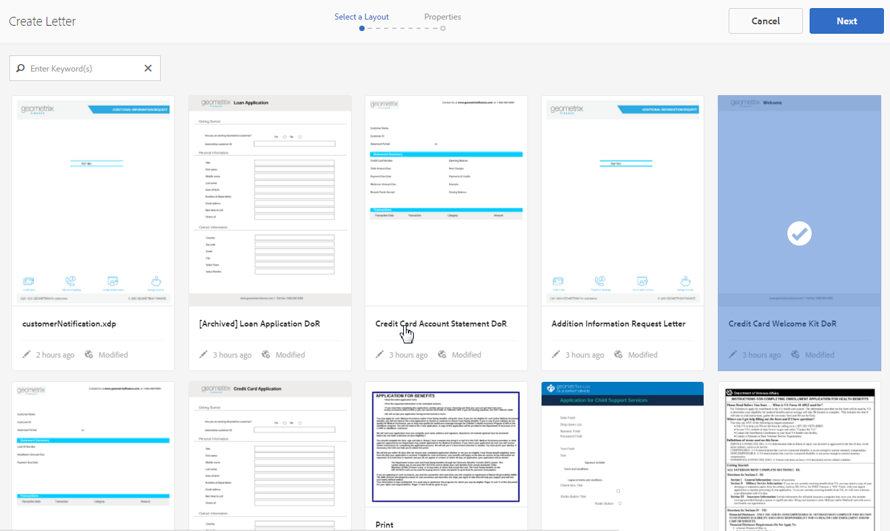

# 편지 만들기 {#create-letter}

## 서신 관리 워크플로우 {#correspondence-management-workflow}

서신 관리 워크플로우는 다음 네 가지 단계로 구성됩니다.

1. 템플릿 만들기
1. 문서 조각 만들기
1. 편지 만들기
1. 사후 처리

### 템플릿 만들기 {#template-creation}

다음 그래픽은 서신 템플릿을 만드는 일반적인 워크플로우를 보여줍니다.

이 워크플로우에서:

1. 양식 디자이너는 Adobe Forms 디자이너를 사용하여 레이아웃 및 조각 레이아웃을 만들고 CRX 리포지토리에 업로드합니다. 레이아웃에는 일반적인 양식 필드, 머리글 및 바닥글과 같은 레이아웃 기능 및 컨텐츠 배치를 위한 빈 &quot;대상 영역&quot;이 포함되어 있습니다. 나중에 응용 프로그램 전문가가 이러한 대상 영역에 필요한 컨텐츠를 매핑합니다. [레이아웃 디자인](/help/forms/using/layout-design-details.md)에 대한 자세한 정보.
1. 법률, 재무 또는 마케팅 부서의 주제 전문가가 다양한 서신 템플릿에서 재사용되는 텍스트 조항, 약관 및 로고와 같은 이미지와 같은 컨텐츠를 작성하고 업로드합니다.
1. 응용 프로그램 전문가가 서신 템플릿을 만듭니다. 응용 프로그램 전문가

   * 텍스트 절 및 이미지를 레이아웃 템플릿의 대상 영역에 매핑합니다
   * 컨텐츠 포함에 대한 조건/규칙을 정의합니다
   * 레이아웃 필드 및 변수를 기본 데이터 모델에 바인딩합니다

1. 작성자는 편지를 미리 보고 사후 처리를 위해 제출합니다. [사후 처리](/help/forms/using/submit-letter-topostprocess.md)에 대한 자세한 정보.

#### 서신 관리 {#using-letter-templates-provided-with-correspondence-management}에서 제공된 편지 템플릿 사용

레이아웃 템플릿을 처음부터 만드는 대신 서신 관리에서 제공하는 템플릿을 수정하고 재사용하도록 선택할 수 있습니다. 디자이너를 사용하여 조직의 요구 사항에 맞게 템플릿의 브랜딩 및 데이터 및 콘텐츠 필드를 빠르게 수정할 수 있습니다. 서신 관리 템플릿에 대한 자세한 내용은 [참조 문자 템플릿](/help/forms/using/reference-cm-layout-templates.md)을 참조하십시오.

### 문서 조각 만들기 {#document-fragment-creation}

문서 조각은 편지\서신을 작성할 수 있는 서신의 재사용 가능한 부분\구성 요소입니다.

문서 조각은 다음 유형의 조각입니다.

#### 텍스트 {#text}

텍스트 자산은 하나 이상의 텍스트 단락으로 구성된 컨텐츠의 일부입니다. 단락은 정적 또는 동적일 수 있습니다. 동적 단락에는 런타임 시 값이 제공되는 데이터 요소에 대한 참조가 포함되어 있습니다.

#### 목록 {#list}

목록은 텍스트, 목록(동일한 목록을 &quot;자체에 추가할 수 없음), 조건 및 이미지를 포함한 일련의 문서 조각입니다. 목록 요소의 순서를 수정하거나 편집할 수 있습니다. 편지를 만드는 동안 일부 또는 모든 목록 요소를 사용하여 재사용 가능한 요소 패턴을 복제할 수 있습니다.

#### 조건 {#condition}

조건을 사용하면 제공된 데이터를 기반으로 서신 생성 시 포함되는 콘텐츠를 정의할 수 있습니다. 조건은 제어 변수 용어로 설명되어 있습니다. 변수는 데이터 사전 요소 또는 자리 표시자일 수 있습니다. 조건을 추가할 때 컨트롤 변수에 있는 값을 기반으로 자산을 포함하도록 선택할 수 있습니다. 조건에는 표현식을 기반으로 한 단일 출력이 있습니다. 현재 조건 변수를 기반으로 한 첫 번째 표현식이 true인 것으로 확인되었습니다. 해당 값이 조건의 출력이 됩니다.

#### 레이아웃 조각 {#layout-fragment}

레이아웃 조각은 하나 이상의 문자 내에서 사용할 수 있는 레이아웃입니다. 레이아웃 조각은 반복 가능한 패턴(특히 다이내믹 테이블)을 만드는 데 사용됩니다. 레이아웃에는 &quot;주소&quot; 및 &quot;참조 번호&quot;와 같은 일반적인 양식 필드가 포함될 수 있습니다. 또한 대상 영역을 나타내는 빈 하위 양식이 포함되어 있습니다. XDP(레이아웃)는 디자이너에서 만들어진 다음 [Forms 및 Documents](/help/forms/using/get-xdp-pdf-documents-aem.md)에 업로드됩니다.

### 편지 만들기 {#letter-creation}

고객에게 전송되는 서신을 생성하는 방법에는 두 가지가 있습니다.사용자 중심의 시스템 제어

#### 사용자 구동 {#user-driven}

청구 조정자나 사례 담당자와 같은 고객 지원 담당자들은 맞춤형 서신을 작성할 수 있습니다. 간단하고 직관적인 편지 채우기 인터페이스를 사용하는 비즈니스 사용자는 서신에 선택적 텍스트를 추가하고 실시간으로 서신을 미리 보는 동안 편집 가능한 콘텐츠를 개인화할 수 있습니다. 그런 다음 사용자 지정된 응답을 백엔드 프로세스에 제출할 수 있습니다.

#### 시스템 구동 {#system-driven}

서신 생성은 이벤트 트리거에 의해 자동화됩니다. 예를 들어, 사전 세금 신고를 요청하는 시민에게 발송된 미리 알림 알림은 사전 정의된 템플릿을 시민 데이터와 병합하여 생성됩니다. 최종 편지는 이메일, 인쇄, 팩스 또는 보관할 수 있습니다.

### 사후 처리 {#post-processing}

최종 서신은 사후 처리를 위해 백엔드 프로세스에 전송될 수 있습니다. 서신은 다음과 같습니다.

1. 전자 메일, 팩스 또는 일괄 인쇄를 위해 처리되거나 인쇄 또는 전자 우편을 위해 폴더에 배치됩니다.
1. 검토 및 승인을 위해 제출됩니다.
1. 디지털 서명, 인증, 암호화 또는 권한 관리를 적용하여 보안됩니다.
1. 보관 및 감사를 위해 필요한 모든 메타데이터를 포함하는 검색 가능한 PDF 문서로 변환됩니다.
1. 마케팅 자료와 같은 더 많은 문서가 포함된 PDF Portfolio에 포함되어 있습니다. 그런 다음 PDF Portfolio을 최종 서신으로 보낼 수 있습니다.

### 서신 관리 솔루션 아키텍처 {#correspondence-management-solution-architecture}

다음 그래픽에서는 문자 솔루션의 예제 아키텍처에 대한 개요를 제공합니다.

## 문자 {#deconstructing-a-letter} 정리

이 취소 통지 문서는 일반적인 서신의 예입니다.

<table> 
 <tbody> 
  <tr> 
   <td><strong>편지 요소</strong></td> 
   <td><strong>설명</strong></td> 
   <td><strong>다음 포함</strong></td> 
  </tr> 
  <tr> 
   <td>백엔드 엔터프라이즈 시스템의 데이터</td> 
   <td>백엔드 엔터프라이즈 시스템에서 가져온 데이터. 데이터는 서신 템플릿과 동적으로 병합됩니다.</td> 
   <td>데이터 사전을 기반으로 만든 데이터 파일 </td> 
  </tr> 
  <tr> 
   <td>Data  프런트엔드 직원이 입력</td> 
   <td>편지를 보내기 전에 문자를 사용자 지정하는 프런트 라인 직원이 제공할 수 있는 데이터입니다.  </td> 
   <td>
보호되지 않는 DD 요소  편집 가능한 텍스트 단락  변수/자리 표시자  
 </td> 
  </tr> 
  <tr> 
   <td>사전 승인된   텍스트 단락</td> 
   <td>사전 승인된 텍스트 컨텐츠입니다. 편지의 비즈니스 컨텍스트를 이해하는 법률, 재무 또는 기업 라인의 전문가가 일반적으로 텍스트 컨텐츠를 작성합니다. 머리글, 바닥글, 면책조항 및 인사말 등의 컨텐츠는 대부분의 문장에서 일반적입니다. 그러나 "종료 이유"와 같은 내용은 특정 서신에 따라 다릅니다.</td> 
   <td>
Text\Lists\  조건\레이아웃
 
 
 </td> 
  </tr> 
  <tr> 
   <td>데이터  사용자 지정 로직을 기반으로 합니까?</td> 
   <td>청구 관련 추가 정보를 요청하기 위한 서신 등의 일부 편지에 대해, 청구 조정기와 같은 사용자는 사용자 정의 텍스트 컨텐츠를 추가할 수 있습니다.</td> 
   <td>Document  유형 조건 조각 </td> 
  </tr> 
  <tr> 
   <td>중앙 리포지토리의 저장  이미지</td> 
   <td>로고 및 서명 이미지와 같은 이미지. 회사 로고와 같은 이미지는 대부분의 또는 모든 서신에 표시됩니다. 서명 이미지는 편지와 편지를 대신하는 사람에게 적용됩니다.</td> 
   <td>
AEM Assets(DAM)에 저장된 이미지  
 
 
 </td> 
  </tr> 
 </tbody> 
</table>

## 편지를 구성하기 전에 편지 분석 {#analyze-a-letter-before-you-construct-it}

편지를 다 분석하여 그 편지를 구성하는 다양한 조각들을 찾아낸다. 응용 프로그램 전문가는 생성된 해당 대상을 분석합니다.

* 어떤 서신 부분이 정적이고 역동적입니다. 백엔드 데이터 소스 또는 최종 사용자가 채우는 변수입니다.
* 비즈니스 사용자가 서신 작성 중에 단락을 변경할 수 있는지 여부와 같이 서신에 다양한 텍스트 단락이 표시되는 순서입니다.
* 서신 시스템이 생성됩니까, 아니면 최종 사용자가 서신을 편집해야 합니까? 시스템 생성 대상은 몇 개이며 사용자 개입이 필요한 수는 몇 개입니까?
* 서신 템플릿은 얼마나 자주 변경됩니까? 연간, 분기별 또는 특정 법안이 변경될 때만 업데이트됩니까? 어떤 유형의 변경이 예상됩니까? 타이포그래피 오류, 레이아웃 변경, 필드 추가, 단락 추가 등을 수정하기 위한 변경입니까?
* 서신 요구 사항을 계획할 때 새로운 서신 템플릿 목록을 어셈블합니다. 각 서신 템플릿에 대해 다음 항목이 필요합니다.

   * 텍스트 절, 이미지 및 표
   * 백엔드 시스템의 데이터 값
   * 서신의 레이아웃 및 조각 레이아웃
   * 컨텐츠가 컨텐츠의 포함 및 제외를 위한 문자 및 규칙에 표시되는 순서

* 청구 조정자나 사례 작업자와 같은 비즈니스 사용자가 편지에 있는 내용이나 부분을 수정하는 조건입니다.
* 시나리오는 문자 솔루션을 사용하여 얻을 수 있는 사용자 경험, 요구 사항 및 이점을 설명하는 내레이션입니다.
* 시나리오에서는 프로젝트에 필요한 기술 세트와 도구를 제공합니다.
* 구현 계획에 대한 우수 사례 &quot;고급 구현 개요.

## 분석 {#benefits-of-performing-the-analysis} 을 수행하면 얻을 수 있는 이점

**컨텐츠** 재사용: 서신 생성에 필요한 새 컨텐츠 목록이 통합되었습니다. 머리글, 바닥글, 면책 사항 및 소개와 같은 많은 컨텐츠는 많은 문자에 공통되며 다양한 문장에서 재사용할 수 있습니다. 이러한 모든 공통 컨텐츠는 전문가들이 한 번 작성하여 승인한 다음 여러 서신 시 재사용할 수 있습니다.

**데이터 사전 작성** 여러 편지에 일반적으로 사용되는 &quot;고객 ID&quot; 및 &quot;고객 이름&quot;과 같은 데이터 값이 있습니다. 이러한 모든 데이터 값의 통합 목록을 준비할 수 있습니다. 일반적으로 엔터프라이즈 미들웨어 팀의 누군가가 구조를 계획할 때 상담합니다. 이는 데이터 사전 빌드의 기반이 됩니다.

**백엔드 엔터프라이즈** 시스템의 데이터 소싱 필요한 모든 데이터 값과 엔터프라이즈 시스템 데이터를 가져오는 위치도 알게 됩니다. 그런 다음 구현을 설계하여 엔터프라이즈 시스템에서 데이터를 추출하고 Letters 솔루션에 제공할 수 있습니다.

**편지의 복잡도** 추정특정 서신을 만드는 것이 얼마나 복잡한지 결정하는 것이 중요합니다. 이 분석은 문자 템플릿을 만드는 데 필요한 시간과 기술 세트를 결정하는 데 도움이 됩니다. 따라서 Letters 솔루션을 구현하는 데 필요한 리소스 및 비용을 계산하는 데 도움이 됩니다.

## 서신 복잡도 {#correspondence-complexity}

서신의 복잡성은 다음 매개 변수를 분석하여 결정할 수 있습니다.

**레이아웃** 복잡도레이아웃은 얼마나 복잡합니까? 취소 통지와 같은 문자는 간단한 레이아웃이 있습니다. 반면에 청구 범위 확인과 같은 글자에는 여러 표와 60개 이상의 양식 필드가 있는 복잡한 레이아웃이 있습니다. 복잡한 레이아웃을 만드는 데 시간이 더 오래 걸리고 고급 레이아웃 디자인 기술 세트가 필요합니다.

**텍스트 단락 및 조건 수** 대출 계약의 길이는 10페이지이고 40개 이상의 텍스트 절을 포함할 수 있습니다. 이 조항 중 상당수는 &#39;대출 파라미터&#39;에 달린다. 정확한 약관을 기준으로 약관 조항은 계약서에 포함되어 있거나 제외됩니다. 그런 문자를 만드는 것은 복잡한 조건에 대한 철저한 계획과 신중한 정의가 필요합니다.

이 표에는 문자를 분류하는 데 사용할 수 있는 몇 가지 지침이 나와 있습니다.

<table> 
 <tbody> 
  <tr> 
   <td>
<strong>복잡성 수준</strong>
 </td> 
   <td>
<strong>레이아웃 복잡도(주관적)</strong>
 </td> 
   <td>
<strong>텍스트 단락 수</strong>
 </td> 
   <td>
<strong>조건부 텍스트 또는 이미지 수</strong>
 </td> 
   <td>
<strong>필수 기술 집합</strong>
 </td> 
  </tr> 
  <tr> 
   <td>
낮은 복잡성
 </td> 
   <td>
낮음. 레이아웃에 양식 필드가 거의 없습니다(&lt;15).
 
일반적으로 한 페이지입니다.
 </td> 
   <td>
8
 </td> 
   <td>
1
 </td> 
   <td>
중급 디자이너 기술.
 </td> 
  </tr> 
  <tr> 
   <td>
중간 복잡성
 </td> 
   <td>
중간 복잡성 레이아웃. 테이블과 같은 구조를 포함합니다. 일반적으로 페이지 길이가 두 페이지 이상입니다.
 </td> 
   <td>
16
 </td> 
   <td>
2
 </td> 
   <td>
중급 디자이너 기술.
 
 
 
사용자 인터페이스를 사용하여 복잡한 표현식을 만드는 기능입니다.
 </td> 
  </tr> 
  <tr> 
   <td>
높은 복잡성
 </td> 
   <td>
복잡한 레이아웃. 3페이지보다 클 수 있습니다. 표와 60개 이상의 양식 필드를 포함합니다.
 </td> 
   <td>
40
 </td> 
   <td>
8
 </td> 
   <td>
전문가 디자이너 기술.
 
 
 
사용자 인터페이스를 사용하여 복잡한 표현식을 만드는 기능입니다.
 </td> 
  </tr> 
 </tbody> 
</table>

## 문자 만들기 개요 {#overview-of-creating-a-letter}

1. 문자의 기본 역할을 하는 적절한 레이아웃을 선택하고 문자를 만듭니다.
1. 데이터 모듈 또는 레이아웃 조각을 편지에 추가하고 구성합니다.
1. 서신 미리 보기를 선택합니다.
1. 필드, 변수, 콘텐츠 및 첨부 파일을 편집하고 설정합니다.

### 전제 조건 {#prerequisites}

서신을 만들려면 먼저 다음 내용이 필요합니다.

* [호환성 패키지](compatibility-package.md). **Forms** 페이지에서 **문자** 옵션을 보려면 호환성 패키지를 설치하십시오.
* XDP([레이아웃](/help/forms/using/document-fragments.md))입니다.
* 편지의 일부를 구성하는 다른 XDP([레이아웃 조각](document-fragments.md#document-fragments))입니다. XDP\Layout은 [Designer](https://help.adobe.com/en-US/AEMForms/6.1/DesignerHelp/)에서 만들어집니다.
* 관련 [데이터 사전](/help/forms/using/data-dictionary.md)(선택 사항)
* 서신에 사용할 [데이터 모듈](/help/forms/using/document-fragments.md)
* [테스트 ](/help/forms/using/data-dictionary.md#p-working-with-test-data-p) 데이터에는 테스트 데이터가 포팅된 XML 파일이 있습니다. 데이터 사전을 사용하는 경우 테스트 데이터가 필요합니다.

## 문자 템플릿 {#create-a-letter-template} 만들기

### 레이아웃을 선택하고 문자 속성 {#select-a-layout-and-enter-the-letter-properties}을 입력합니다.

1. **Forms** > **문자**&#x200B;를 선택합니다.

1. **만들기 > 문자**&#x200B;를 선택합니다. 서신 관리에 사용 가능한 레이아웃(XDP)이 표시됩니다. 이러한 레이아웃은 디자이너에서 가져옵니다. 또한 레이아웃에는 Correspondence Management에서 즉시 제공하는 편지 템플릿도 포함되어 있습니다. 서신 관리 템플릿에 대한 자세한 내용은 [참조 문자 템플릿](/help/forms/using/reference-cm-layout-templates.md)을 참조하십시오. 고유한 레이아웃을 추가하려면 Designer에서 XDP(레이아웃) 파일을 만든 다음 [AEM Forms](/help/forms/using/get-xdp-pdf-documents-aem.md)에 업로드합니다.

   

1. 레이아웃을 탭하여 선택하고 **다음**&#x200B;을 누릅니다.

   

1. 서신 속성을 입력하고 **저장:**

   * **제목(선택 사항):** 문자의 제목을 입력합니다. 제목은 고유해야 하며 특수 문자와 비영어 문자가 있을 수 있습니다.
   * **이름:** 편지에 대한 고유한 이름입니다. 어떤 상태에서도 같은 이름의 두 글자가 존재할 수 없습니다. 이름 필드에 영어 문자, 숫자 및 하이픈만 입력할 수 있습니다. 이름 필드는 제목 필드를 기반으로 자동으로 채워집니다. 제목 필드에 입력한 특수 문자, 공백, 숫자 및 비영어 문자는 이름 필드에서 하이픈으로 바뀝니다. 제목 필드의 값이 자동으로 이름에 복사되지만 값을 편집할 수 있습니다.
   * **설명(선택 사항):** 참조에 사용할 문자를 설명합니다.
   * **데이터 사전(선택 사항)**:데이터 사전은 서신에 연결될 수 있습니다. 나중에 이 서신에 삽입하는 자산에는 여기에서 서신에 대해 선택하는 것과 동일한 데이터 사전이 있거나 데이터 사전이 없어야 합니다.
   * **태그(선택 사항):** 서신에 적용할 태그를 선택합니다. 새/사용자 지정 태그 이름을 입력하고 Enter 키를 눌러 만들 수도 있습니다.
   * **사후 프로세스(선택 사항):**  편지 템플릿에 적용할 사후 프로세스를 선택합니다. 즉시 사용 가능한 게시 프로세스와 전자 메일 및 인쇄와 같은 AEM을 사용하여 만든 게시 프로세스가 있습니다.

   

1. 시스템에 다음과 같은 메시지가 표시됩니다.&quot;편지를 만들었습니다.&quot; (경고 메시지에서) **열기**&#x200B;를 눌러 데이터 모듈 및 레이아웃 조각을 구성합니다. 또는 **완료**&#x200B;를 탭하여 이전 페이지로 돌아갑니다.

   

   **다음**:열기 ****&#x200B;를 탭하면 서신 관리에 나열된 레이아웃(XDP)의 모든 구성 요소가 있는 레이아웃의 표현이 표시됩니다. [데이터 모듈 및 레이아웃 조각 삽입과 구성](/help/forms/using/create-letter.md#p-insert-data-modules-and-layout-fragments-in-a-letter-and-configure-them-p)을 계속 진행합니다.

### 데이터 모듈 및 레이아웃 조각을 편지에 삽입하고 {#insert-data-modules-and-layout-fragments-in-a-letter-and-configure-them} 구성

서신 작성 후 열기 를 탭하면 서신 관리 가 나열된 레이아웃(XDP)에서 모든 하위 양식/대상 영역이 있는 레이아웃의 표현을 표시합니다. 각 대상 영역에서 데이터 모듈 또는 레이아웃 조각(및 레이아웃 조각의 데이터 모듈)을 삽입하도록 선택할 수 있습니다.

>[!NOTE]
>
>편지 페이지에서 편지에 대한 편집 아이콘을 탭하여 문자로 데이터 모듈 및 레이아웃 조각을 삽입하고 구성할 수도 있습니다.

1. 각 하위 양식에 대해 **삽입**&#x200B;을 탭하고 각 하위 양식에 삽입할 데이터 모듈 또는 레이아웃 조각 을 선택합니다.

   

1. 각 하위 양식에 대해 이러한 옵션에 대해 데이터 모듈 또는 레이아웃 조각 을 선택한 다음 삽입할 데이터 모듈 또는 레이아웃 조각을 선택합니다. 레이아웃 조각을 사용하면 디자인에 따라 데이터 모듈 또는 레이아웃 조각을 추가로 삽입할 수 있습니다(최대 4개 수준).

   

1. 레이아웃 조각을 삽입하면 레이아웃 조각의 이름이 하위 양식에 나타납니다. 선택한 조각에 따라 중첩된 하위 양식이 하위 양식에 나타납니다.
1. 선택한 데이터 모듈이 레이아웃에 삽입되면 구성 모드를 탭하고 각 모듈에 대해 편집 아이콘을 탭한 후 다음을 설정할 수 있습니다.

   1. **편집 가능**:이 옵션을 선택하면 서신 사용자 만들기 인터페이스에서 콘텐츠를 편집할 수 있습니다. 비즈니스 사용자(예: 클레임 조정자)가 내용을 수정해야 하는 경우에만 컨텐츠를 편집 가능한 상태로 표시합니다.
   1. **필수**:이 옵션을 선택하면 서신 사용자 인터페이스에 콘텐츠가 필요합니다.
   1. **선택**:이 옵션을 선택하면 서신 사용자 만들기 인터페이스에서 기본적으로 콘텐츠가 선택됩니다.
   1. **들여쓰기**:편지에서 모듈/컨텐츠의 들여쓰기를 늘리거나 줄입니다. 들여쓰기는 0부터 시작하여 수준 단위로 지정됩니다. 각 레벨은 36pts를 나타냅니다. 양식 사용자 지정에 대한 자세한 내용은 [Forms 워크플로우](submit-letter-topostprocess.md#formsworkflow)에서 **[!UICONTROL 서신 관리 구성]**&#x200B;을 참조하십시오.
   1. **다음 사이** 페이지 나누기:다음 시기 이전에 페이지 나누기 를 켜기로 설정하면 이 모듈의 내용이 항상 새 페이지에 표시됩니다.
   1. **** 후 페이지 나누기:특정 모듈에 대해 Page Break After를 로 설정하면 NEXT 모듈의 컨텐츠가 항상 새 페이지에 표시됩니다.

   

1. 모듈을 편집하려면 모듈 옆에 있는 편집 아이콘을 누릅니다. 모듈을 편집한 후 **저장**&#x200B;을 누릅니다.

   이 페이지에서 하위 양식에 대해 다음을 수행할 수도 있습니다.

   1. **자유 텍스트 허용**:자유 텍스트 허용 이 활성화되어 있으면 사용자는 CCR 보기에서 편지에 인라인 텍스트를 추가할 수 있습니다. CCR 보기에서는 자유 텍스트 허용이 활성화된 대상 영역에 대해 &#39;T&#39; 작업이 활성화되어 있고, 사용자가 탭하면 텍스트의 이름과 설명을 요청한 다음, 확인을 탭하면 사용자가 텍스트를 추가할 수 있는 편집 모드에서 해당 텍스트가 열립니다. 따라서 이것은 다른 텍스트 모듈처럼 작동합니다
   1. **잠금 순서**:편지에 하위 양식의 순서를 잠급니다. 작성자는 문자를 만드는 동안 하위 양식/구성 요소의 순서를 변경할 수 없습니다.

   이 페이지에서 하위 양식의 각 자산에 대해 다음 작업을 수행할 수도 있습니다.

   1. **자산의 순서를 변경합니다**.자산에 대한 재정렬 아이콘을 포함하는 자산을 끌어다  ).
   1. **자산 삭제**:자산 옆에 있는 삭제 아이콘을 탭하여 삭제합니다.
   1. **자산 미리 보기**:자산 옆에 있는 미리 보기  )을 탭합니다.

1. **다음**&#x200B;을 누릅니다.
1. 데이터 페이지에서는 템플릿에 데이터 필드와 변수를 사용하는 방법에 대해 자세히 설명합니다. 데이터는 데이터 사전 또는 사용자 입력과 같은 데이터 소스에 연결할 수 있습니다. 각 필드는 데이터 사전이 데이터를 매핑하거나 사용자 입력 필드에 대해 표시되는 캡션의 속성을 정의합니다.

   링크:

   * **필드** 요소는 리터럴, 데이터 사전 요소, 자산 또는 사용자가 지정한 값에 연결할 수 있습니다. 필드 요소를 무시 옵션에 결합하여 무시할 수도 있습니다.
   * **변수** 요소는 리터럴, 데이터 사전 요소, 필드, 변수, 자산 또는 사용자가 지정한 값에 연결할 수 있습니다.

   다음은 링크의 몇 가지 기본 필드입니다.

   * **여러 줄**:필드나 변수에 대한 데이터 항목이 여러 라인인지 지정할 수 있습니다. 이 옵션을 선택하면 필드나 변수에 대한 입력 상자가 데이터 편집 보기에서 여러 줄 입력 상자로 표시됩니다. 필드나 변수는 서신 만들기 사용자 인터페이스의 데이터 및 컨텐츠 보기에서 여러 줄로 표시됩니다. 여러 줄 입력 필드는 TextModule에 주석을 입력하는 필드와 유사합니다. 여러 줄 옵션은 링크 유형이 사용자 또는 보호되지 않은 데이터 사전 요소가 있는 필드 및 변수만 사용할 수 있습니다.
   * **선택** 사항:필드 또는 변수의 값이 선택 사항인지 여부를 지정할 수 있습니다. 옵션 필드 옵션은 링크 유형이 사용자 또는 보호되지 않는 데이터 사전 요소가 있는 필드 및 변수에 사용할 수 있습니다.

   * **필드/변수 유효성 검사**:필드 또는 변수 값에 대한 향상된 유효성 검사를 제공하기 위해 필드 또는 변수에 유효성 검사기를 할당할 수 있습니다. 이 옵션은 링크 유형이 사용자 또는 보호되지 않는 데이터 사전 요소가 있는 필드 및 변수만 사용할 수 있습니다.
   * **** 캡션 및  **도구 설명**:캡션은 CCR 사용자 인터페이스의 필드 앞에 표시되는 필드의 레이블입니다. 이 옵션은 링크 유형이 사용자 또는 보호되지 않는 데이터 사전 요소가 있는 필드 및 변수에 사용할 수 있습니다.

   다음은 필드에 사용할 수 있는 유효성 검사 유형입니다.

   * **문자열 유효성 검사기**:문자열 유효성 검사기를 사용하여 필드나 변수에 입력한 문자열의 최소 및 최대 길이를 지정합니다. 문자열 유효성 검사기를 만들 때 유효한 유효성 검사 매개 변수를 지정했는지 확인하십시오. 최소값과 최대값 모두에 유효한 길이를 입력하십시오. 문자열 유효성 검사기의 경우 입력할 수 있는 값의 최소 및 최대 길이를 지정할 수 있습니다. 입력한 값이 지정된 최소값과 최대값에 따라 표시되지 않으면 CCR 사용자 인터페이스의 관련 필드가 빨간색으로 표시됩니다.

   * **Number Validator**:숫자 유효성 검사기를 사용하여 필드나 변수에 입력한 최소 및 최대 숫자 값을 지정합니다. 숫자 유효성 검사기를 만들 때 유효한 유효성 검사 매개 변수를 지정해야 합니다. 최소값과 최대값 모두에 숫자 값을 입력합니다.

   * **정규 표현식 유효성 검사기**:정규 표현식 유효성 검사기를 사용하여 필드나 변수의 값을 확인하는 데 사용되는 정규 표현식을 정의합니다. 또한 오류 메시지를 사용자 지정할 수 있습니다. 정규 표현식 유효성 검사기를 만들 때 유효한 정규 표현식을 지정하는지 확인합니다.
   >[!NOTE]
   >
   >필드 및 변수 유효성 검사기는 링크 유형이 사용자 또는 보호되지 않은 데이터 사전 요소가 있는 필드 또는 변수만 사용할 수 있습니다.

   

1. 연결을 지정한 후 **다음**&#x200B;을 누릅니다. Correspondence Management에 첨부 화면이 표시됩니다.

### 첨부 파일 {#set-up-the-attachments} 설정

1. **자산 추가**&#x200B;를 선택합니다.
1. 자산 선택 화면에서 문자로 연결할 자산을 탭하고 **완료**&#x200B;를 탭합니다. 자산을 먼저 Assets에 업로드해야 합니다. PDF 및 Microsoft Office 문서만 첨부하는 것이 좋지만 이미지를 첨부할 수도 있습니다. DAM에서 자산을 업로드하는 방법에 대한 자세한 내용은 [자산 업로드](/help/assets/manage-assets.md)를 참조하십시오.
1. 클레임 조정자가 순서를 변경할 수 없도록 목록에 있는 자산의 순서를 잠그려면 **순서 잠금**&#x200B;을 누릅니다. 이 옵션을 선택하지 않으면 청구 조정자는 목록 항목의 순서를 변경할 수 있습니다.
1. 자산의 순서를 변경하려면 자산에 대한 순서 조정 아이콘을 포함하는 자산을 드래그하여 놓습니다( ).
1. 첨부 파일 앞에 있는 **편집**&#x200B;을 탭하고 작성자가 삭제할 수 없도록 하려면 첨부 파일을 필수로 지정합니다. CCR 인터페이스에서 첨부 파일을 미리 선택하려면 첨부 파일을 선택됨으로 지정합니다.
1. 라이브러리에 액세스할 수 있도록 하려면 **라이브러리 액세스** 를 선택합니다. 라이브러리 액세스가 활성화된 경우 클레임 조정자는 편지를 만들고 첨부 파일을 삽입하는 동안 콘텐츠 라이브러리에 액세스할 수 있습니다.
1. **첨부 구성**&#x200B;을 선택하고 최대 첨부 파일 수를 지정합니다.

1. **저장**&#x200B;을 누릅니다. 서신이 만들어지고 편지 페이지에 나열됩니다.

서신 관리에서 편지 템플릿이 작성되면 최종 사용자/에이전트/청구 조정자는 CCR 사용자 인터페이스에서 편지를 열고 데이터를 입력하고, 컨텐츠를 설정하고, 첨부 파일을 관리하여 서신을 작성할 수 있습니다. 자세한 내용은 [서신 만들기](/help/forms/using/create-correspondence.md)를 참조하십시오.

## 각 필드에 사용할 수 있는 링크 유형 {#types-of-linkage-available-for-each-of-the-fields}

다음 표에서는 다양한 유형의 필드에 사용할 수 있는 링크 유형을 설명합니다.

테이블의 다음 값

* **예**:맨 왼쪽 열의 필드 유형은 해당 유형의 매핑을 지원합니다
* **아니요**:맨 왼쪽 열의 필드 유형은 해당 유형의 매핑을 지원하지 않습니다
* **해당 사항 없음**:맨 왼쪽 열에 있는 필드 유형을 적용할 수 없습니다

<table> 
 <tbody> 
  <tr> 
   <td> </td> 
   <td><strong>리터럴</strong></td> 
   <td><strong>자산</strong></td> 
   <td><strong>데이터 사전</strong></td> 
   <td><strong>무시</strong></td> 
   <td><strong>사용자</strong></td> 
   <td><strong>필드</strong></td> 
   <td><strong>변수</strong></td> 
  </tr> 
  <tr> 
   <td><strong>날짜</strong></td> 
   <td>예</td> 
   <td>아니오</td> 
   <td>예</td> 
   <td>예</td> 
   <td>예</td> 
   <td>N/A</td> 
   <td>해당 없음</td> 
  </tr> 
  <tr> 
   <td><strong>시간</strong></td> 
   <td>예</td> 
   <td>아니오</td> 
   <td>예</td> 
   <td>예</td> 
   <td>예</td> 
   <td>해당 없음</td> 
   <td>해당 없음</td> 
  </tr> 
  <tr> 
   <td><strong>datetime</strong></td> 
   <td>예</td> 
   <td>아니오</td> 
   <td>예</td> 
   <td>예</td> 
   <td>예</td> 
   <td>해당 없음</td> 
   <td>해당 없음</td> 
  </tr> 
  <tr> 
   <td><strong>정수</strong></td> 
   <td>예</td> 
   <td>아니오</td> 
   <td>예</td> 
   <td>예</td> 
   <td>예  </td> 
   <td>해당 없음</td> 
   <td>해당 없음</td> 
  </tr> 
  <tr> 
   <td><strong>float</strong></td> 
   <td>예</td> 
   <td>아니오</td> 
   <td>예</td> 
   <td>예</td> 
   <td>예  </td> 
   <td>해당 없음</td> 
   <td>N/A  </td> 
  </tr> 
  <tr> 
   <td><strong>richtext</strong></td> 
   <td>예</td> 
   <td>텍스트만</td> 
   <td>예</td> 
   <td>예</td> 
   <td>예</td> 
   <td>해당 없음</td> 
   <td>해당 없음</td> 
  </tr> 
  <tr> 
   <td><strong></strong> <strong>일반 텍스트</strong></td> 
   <td>예</td> 
   <td>텍스트만</td> 
   <td>예</td> 
   <td>예</td> 
   <td>예</td> 
   <td>해당 없음</td> 
   <td>해당 없음</td> 
  </tr> 
  <tr> 
   <td><strong>이미지</strong></td> 
   <td>아니오</td> 
   <td>이미지 전용</td> 
   <td>아니오</td> 
   <td>예</td> 
   <td>아니오</td> 
   <td>해당 없음</td> 
   <td>해당 없음</td> 
  </tr> 
  <tr> 
   <td><strong>서명</strong></td> 
   <td>아니오</td> 
   <td>아니오</td> 
   <td>아니오  </td> 
   <td>예</td> 
   <td>아니오</td> 
   <td>해당 없음</td> 
   <td>N/A  </td> 
  </tr> 
 </tbody> 
</table>

## 편지 템플릿의 사본 만들기 {#createcopylettertemplate}

기존 편지 템플릿을 사용하여 문서 조각 및 데이터 사전과 같은 속성, 콘텐츠 및 상속된 자산으로 편지 템플릿을 신속하게 만들 수 있습니다. 이렇게 하려면 편지를 복사하여 붙여넣습니다.

1. 문자 페이지에서 문자를 하나 이상 선택합니다. UI에 복사 아이콘이 표시됩니다.
1. 복사 를 누릅니다. UI에 붙여넣기 아이콘이 표시됩니다. 붙여넣기 전에 폴더 내부로 이동하도록 선택할 수도 있습니다. 서로 다른 폴더에는 동일한 이름의 자산이 포함될 수 있습니다. 폴더에 대한 자세한 내용은 [폴더 및 자산 구성](/help/forms/using/import-export-forms-templates.md#folders-and-organizing-assets)을 참조하십시오.
1. 붙여넣기 를 누릅니다. 붙여넣기 대화 상자가 나타납니다. 같은 위치에 문자를 복사하여 붙여넣을 경우 이름 및 제목을 자동으로 새 문자 사본에 지정하지만 문자의 제목 및 이름을 편집할 수 있습니다.
1. 필요한 경우 편지 사본을 저장할 제목 및 이름 을 편집합니다.
1. 붙여넣기 를 누릅니다. 편지 복사본이 만들어집니다. 이제 새로 만든 편지에서 필요한 사항을 변경할 수 있습니다.
