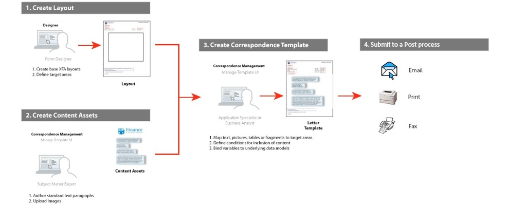

# 편지 만들기 {#create-letter}

## 통신 관리 워크플로 {#correspondence-management-workflow}

통신 관리 워크플로우는 다음 4단계로 구성됩니다.

1. 템플릿 만들기
1. 문서 조각 만들기
1. 편지 만들기
1. 사후 처리

### 템플릿 만들기 {#template-creation}

다음 그래픽은 통신 템플릿을 만들기 위한 일반적인 워크플로우를 보여줍니다.

이 워크플로우에서:

1. 양식 디자이너는 Adobe Forms Designer를 사용하여 레이아웃 및 조각 레이아웃을 만들고 CRX 저장소에 업로드합니다. 레이아웃에는 일반적인 양식 필드, 머리글 및 바닥글과 같은 레이아웃 기능, 컨텐츠 배치를 위한 빈 &quot;대상 영역&quot;이 포함됩니다. 나중에 애플리케이션 전문가가 이러한 대상 영역에 필요한 컨텐츠를 매핑합니다. [레이아웃](/help/forms/using/layout-design-details.md)을(를) 디자인하는 방법에 대한 자세한 정보입니다.
1. 법률, 재무 또는 마케팅 부서의 주제 관련 전문가는 다양한 서신 템플릿에서 재사용 가능한 텍스트 조항, 조항 및 조건, 로고와 같은 이미지 등의 컨텐츠를 제작하고 업로드할 수 있습니다.
1. 애플리케이션 전문가가 서신 템플릿을 만듭니다. 애플리케이션 전문가

   * 레이아웃 템플릿의 대상 영역에 텍스트 절 및 이미지를 매핑합니다.
   * 컨텐츠 포함에 대한 조건/규칙을 정의합니다.
   * 레이아웃 필드와 변수를 기본 데이터 모델에 바인딩합니다.

1. 작성자는 편지를 미리 보고 후처리를 위해 제출합니다. [사후 처리](/help/forms/using/submit-letter-topostprocess.md)에 대한 자세한 정보입니다.

#### 통신 관리 {#using-letter-templates-provided-with-correspondence-management}에서 제공하는 편지 템플릿 사용

레이아웃 템플릿을 처음부터 만드는 대신 통신 관리에서 제공하는 템플릿을 수정 및 재사용할 수 있습니다. 디자이너를 사용하여 조직의 요구에 맞게 템플릿의 브랜드와 데이터 및 컨텐츠 필드를 신속하게 수정할 수 있습니다. 메일 관리 템플릿에 대한 자세한 내용은 [참조 문자 템플릿](/help/forms/using/reference-cm-layout-templates.md)을 참조하십시오.

### 문서 조각 만들기 {#document-fragment-creation}

문서 조각은 편지\통신을 작성할 수 있는 통신 부분의 재사용 가능한 부분\구성 요소입니다.

문서 조각은 다음과 같은 유형입니다.

#### 텍스트 {#text}

텍스트 에셋은 하나 이상의 텍스트 단락으로 구성된 컨텐츠 조각입니다. 단락은 정적이거나 동적일 수 있습니다. 동적 단락은 런타임에 값을 제공하는 데이터 요소에 대한 참조를 포함합니다.

#### 목록 {#list}

List는 텍스트, 목록(동일한 목록을 &quot;자체에 추가할 수 없음), 조건 및 이미지를 비롯한 일련의 문서 조각입니다. 목록 요소의 순서를 수정하거나 편집할 수 있습니다. 편지를 만드는 동안 일부 또는 모든 목록 요소를 사용하여 재사용 가능한 요소 패턴을 복제할 수 있습니다.

#### 조건 {#condition}

조건을 사용하면 통신 생성 시 제공된 데이터를 기반으로 어떤 컨텐츠가 포함되는지 정의할 수 있습니다. 이 조건은 제어 변수에 대해 설명합니다. 변수는 데이터 사전 요소 또는 자리 표시자일 수 있습니다. 조건을 추가할 때 제어 변수에 있는 값을 기반으로 자산을 포함하도록 선택할 수 있습니다. 조건에는 표현식에 따라 단일 출력이 있습니다. 현재 조건 변수를 기반으로 첫 번째 표현식이 true로 발견되었습니다. 값이 조건의 출력이 됩니다.

#### 레이아웃 조각 {#layout-fragment}

레이아웃 조각은 하나 이상의 문자 내에서 사용할 수 있는 레이아웃입니다. 레이아웃 조각은 반복 가능한 패턴(특히 동적 표)을 만드는 데 사용됩니다. 레이아웃에는 &quot;주소&quot; 및 &quot;참조 번호&quot;와 같은 일반적인 양식 필드가 포함될 수 있습니다. 대상 영역을 나타내는 빈 하위 양식도 포함되어 있습니다. XDP(레이아웃)는 Designer에서 만든 다음 Forms 및 문서](/help/forms/using/get-xdp-pdf-documents-aem.md)에 [업로드됩니다.

### 문자 만들기 {#letter-creation}

고객에게 발송되는 메시지를 생성하는 방법에는 두 가지가 있습니다.사용자 중심의 시스템 제어

#### 사용자 중심 {#user-driven}

클레임 조정자나 케이스 인부자와 같은 고객 접견 직원은 맞춤형 메시지를 만들 수 있습니다. 간단하고 직관적인 편지 채우기 인터페이스를 사용하면 커뮤니케이션에 선택적 텍스트를 추가하고 실시간으로 메시지를 미리 보면서 편집 가능한 컨텐츠를 개인화할 수 있습니다. 그런 다음 원하는 메시지를 백엔드 프로세스에 제출할 수 있습니다.

#### 시스템 기반 {#system-driven}

통신 생성은 이벤트 트리거에 의해 자동화됩니다. 예를 들어 사전 세금 신고를 요청하는 시민에게 발송된 미리 알림 메시지는 사전 정의된 템플릿을 시민 데이터와 병합하여 생성됩니다. 최종 서신은 이메일로 전송, 인쇄, 팩스 또는 보관할 수 있습니다.

### 사후 처리 {#post-processing}

마지막 통신문을 후처리를 위해 백엔드 프로세스로 보낼 수 있다. 다음과 같은 방법을 사용할 수 있습니다.

1. 이메일, 팩스 또는 일괄 인쇄를 위해 처리되거나 인쇄 또는 전자 우편을 위해 폴더에 보관됩니다.
1. 검토 및 승인을 위해 제출되었습니다.
1. 디지털 서명, 인증, 암호화 또는 권한 관리를 적용하여 안전하게 보호할 수 있습니다.
1. 보관 및 감사를 위해 필요한 모든 메타데이터를 포함하는 검색 가능한 PDF 문서로 변환되었습니다.
1. 마케팅 자료와 같은 더 많은 문서가 포함된 PDF Portfolio에 포함되어 있습니다. 그런 다음 PDF Portfolio을 최종 서신으로 보낼 수 있습니다.

### 통신 관리 솔루션 아키텍처 {#correspondence-management-solution-architecture}

다음 그래픽에서는 문자 솔루션의 예제 아키텍처에 대한 개요를 제공합니다.

## 문자 {#deconstructing-a-letter} 정리

이 취소 통지서는 일반적인 통신문의 예입니다.

<table> 
 <tbody> 
  <tr> 
   <td><strong>문자 요소</strong></td> 
   <td><strong>설명</strong></td> 
   <td><strong>형식 지정</strong></td> 
  </tr> 
  <tr> 
   <td>백엔드 엔터프라이즈 시스템의 데이터</td> 
   <td>백엔드 엔터프라이즈 시스템에서 가져온 데이터입니다. 데이터는 통신 템플릿과 동적으로 병합됩니다.</td> 
   <td>데이터 사전을 기반으로 만든 데이터 파일 </td> 
  </tr> 
  <tr> 
   <td>데이터  라인 직원이 입력</td> 
   <td>편지를 발송하기 전에 문자를 맞춤화하는 프런트 라인 직원이 제공할 수 있는 데이터입니다.  </td> 
   <td>
보호되지 않은 DD 요소  편집 가능한 텍스트 단락  변수/자리 표시자  
 </td> 
  </tr> 
  <tr> 
   <td>사전 승인된   텍스트 단락</td> 
   <td>사전 승인된 텍스트 컨텐츠. 편지의 비즈니스 컨텍스트를 이해하는 법률, 재무 또는 사업 부문의 전문가는 일반적으로 텍스트 컨텐츠를 작성합니다. 머리글, 바닥글, 부인 및 인사말 등의 내용은 대부분의 문자에 공통으로 적용됩니다. 그러나 "종료 이유"와 같은 내용은 특정 문자에 따라 다릅니다.</td> 
   <td>
Text\Lists\  조건\레이아웃
 
 
 </td> 
  </tr> 
  <tr> 
   <td>데이터  사용자 지정 로직을 기반으로 합니까?</td> 
   <td>클레임 관련 정보를 요청하는 서신과 같은 일부 서신의 경우, 클레임 조정사와 같은 사용자는 사용자 지정 텍스트 컨텐트를 추가할 수 있습니다.</td> 
   <td>문서  유형 조건의 조각 </td> 
  </tr> 
  <tr> 
   <td>중앙 저장소에서 저장  이미지</td> 
   <td>로고 및 서명 이미지와 같은 이미지. 회사 로고와 같은 이미지는 대부분의 또는 모든 통신물에 표시됩니다. 서명 이미지는 편지와 편지를 대신하여 보낸 사람에게 적용됩니다.</td> 
   <td>
AEM 에셋(DAM) 에 저장된 이미지 
 
 
 </td> 
  </tr> 
 </tbody> 
</table>

## 편지를 만들기 전에 분석 {#analyze-a-letter-before-you-construct-it}

모든 편지를 분석하여 그 편지를 구성하는 다양한 작품을 발견합니다. 응용 프로그램 전문가는 생성된 메시지를 분석합니다.

* 어떤 통신 부분이 정적이고 역동적이다. 백엔드 데이터 소스 또는 최종 사용자가 채운 변수.
* 비즈니스 사용자가 편지 작성 시 단락을 변경할 수 있는지 여부 등 서신에 다양한 텍스트 단락이 표시되는 순서.
* 통신 시스템이 생성됩니까 아니면 최종 사용자가 메시지를 편집해야 합니까? 시스템에서 생성되는 메시지는 몇 개이며 사용자의 개입이 필요한 경우는 몇 개입니까?
* 통신 템플릿이 얼마나 자주 변경됩니까? 연간, 분기별 또는 특정 법안이 변경될 때에만 업데이트됩니까? 어떤 유형의 변경이 예상됩니까? 타이포그래피 오류, 레이아웃 변경 사항, 추가 필드, 단락 추가 등의 수정 사항이 변경됩니까?
* 통신 요구 사항을 계획할 때 새로운 서신 템플릿 목록을 조합합니다. 각 메일 템플릿에 대해 다음 사항이 필요합니다.

   * 텍스트 절, 이미지 및 표
   * 백엔드 시스템의 데이터 값
   * 서신의 레이아웃 및 조각 레이아웃
   * 컨텐츠의 포함 및 제외에 대한 내용 표시 순서 및 규칙

* 청구 조정자나 사례 작성자와 같은 비즈니스 사용자가 편지의 내용이나 부분을 변경하는 조건.
* 시나리오는 문자 솔루션을 사용할 때의 사용자 경험, 요구 사항 및 이점에 대해 설명하는 나레이션입니다.
* 시나리오에서는 프로젝트에 필요한 기술 세트와 도구를 제공합니다.
* 구현을 계획하기 위한 모범 사례 &quot;고급 구현 개요.

## 분석 수행 이점 {#benefits-of-performing-the-analysis}

**컨텐츠** 재사용 메시지를 생성하는 데 필요한 새로운 컨텐츠 목록이 통합되어 있습니다. 머리말, 꼬리말, 면책 조항 및 소개와 같은 많은 컨텐츠는 많은 글자에 공통으로 사용되고 다양한 글자에서 다시 사용할 수 있습니다. 이러한 모든 일반적인 컨텐츠는 한 번 전문가의 승인을 받은 후 여러 번에 걸쳐 다시 사용할 수 있습니다.

**데이터** 사전 작성많은 글자에 공통으로 사용되는 &quot;고객 ID&quot; 및 &quot;고객 이름&quot;과 같은 데이터 값이 있습니다. 이러한 모든 데이터 값의 통합 목록을 준비할 수 있습니다. 일반적으로 엔터프라이즈 미들웨어 팀의 사람은 구조를 계획할 때 상담합니다. 데이터 사전을 작성하는 기반이 됩니다.

**백엔드 엔터프라이즈 시스템의 데이터** 소싱 필요한 모든 데이터 값과 엔터프라이즈 시스템 데이터를 얻는 위치도 알게 됩니다. 그런 다음 구현을 설계하여 엔터프라이즈 시스템에서 데이터를 추출하고 Letters 솔루션에 피드를 추가할 수 있습니다.

**글자의 복잡성을** 계산특정 편지를 만드는 것이 얼마나 복잡한지를 결정하는 것이 중요합니다. 이 분석은 문자 템플릿을 만드는 데 필요한 시간과 기술을 결정하는 데 도움이 됩니다. 따라서 Letters 솔루션 구현에 소요되는 리소스와 비용을 계산하는 데 도움이 됩니다.

## 통신 복잡도 {#correspondence-complexity}

통신 복잡성은 다음 매개 변수를 분석하여 확인할 수 있습니다.

**레이아웃** 복잡도 레이아웃은 얼마나 복잡합니까? 취소 통지 등의 편지에는 간단한 레이아웃이 있습니다. 반면에 클레임 적용 범위 확인과 같은 글자에는 여러 개의 테이블과 60개 이상의 양식 필드가 있는 복잡한 레이아웃이 있습니다. 복잡한 레이아웃을 만드는 데 시간이 더 걸리고 고급 레이아웃 디자인 기술이 필요합니다.

**텍스트 단락 및 조건 수** 대출 계약은 길이가 10페이지이고 40개 이상의 텍스트 절을 포함할 수 있습니다. 이러한 조항 중 다수는 &quot;대출 매개 변수&quot;에 의존할 것이다. 정확한 조건에 따라, 조항들은 계약에 포함되거나 제외될 것이다. 그런 문자를 만드는 것은 복잡한 상황에 대한 치밀한 계획과 신중한 정의가 필요하다.

이 표는 문자를 분류하는 데 사용할 수 있는 몇 가지 지침을 제공합니다.

<table> 
 <tbody> 
  <tr> 
   <td>
<strong>복잡성 수준</strong>
 </td> 
   <td>
<strong>레이아웃 복잡도(주관적)</strong>
 </td> 
   <td>
<strong>텍스트 단락 수</strong>
 </td> 
   <td>
<strong>조건부 텍스트 또는 이미지 수</strong>
 </td> 
   <td>
<strong>필수 기술 세트</strong>
 </td> 
  </tr> 
  <tr> 
   <td>
낮은 복잡성
 </td> 
   <td>
낮음. 레이아웃에는 양식 필드가 거의 없습니다(&lt;15).
 
일반적으로 한 페이지입니다.
 </td> 
   <td>
8
 </td> 
   <td>
1
 </td> 
   <td>
중급 디자이너 스킬
 </td> 
  </tr> 
  <tr> 
   <td>
중간 복잡성
 </td> 
   <td>
복잡한 중간 레이아웃을 만들 수 있습니다. 표와 같은 구조를 포함합니다. 일반적으로 페이지 길이가 두 페이지 이상입니다.
 </td> 
   <td>
16
 </td> 
   <td>
2
 </td> 
   <td>
중급 디자이너 스킬
 
 
 
사용자 인터페이스를 사용하여 복잡한 표현식을 만드는 기능입니다.
 </td> 
  </tr> 
  <tr> 
   <td>
높은 복잡성
 </td> 
   <td>
복잡한 레이아웃. 3페이지보다 클 수 있습니다. 표와 60개 이상의 양식 필드를 포함합니다.
 </td> 
   <td>
40
 </td> 
   <td>
8
 </td> 
   <td>
전문가 디자이너 스킬
 
 
 
사용자 인터페이스를 사용하여 복잡한 표현식을 만드는 기능입니다.
 </td> 
  </tr> 
 </tbody> 
</table>

## 문자 만들기 개요 {#overview-of-creating-a-letter}

1. 문자의 기초로 사용할 적절한 레이아웃을 선택하고 문자를 만듭니다.
1. 데이터 모듈 또는 레이아웃 조각을 서신에 추가하고 구성합니다.
1. 통신 내용을 미리 봅니다.
1. 필드, 변수, 컨텐츠 및 첨부 파일을 편집하고 설정합니다.

### 전제 조건 {#prerequisites}

편지를 작성하려면 먼저 다음 사항을 적소에 제공해야 합니다.

* [호환성 패키지](compatibility-package.md). 호환성 패키지를 설치하여 **Forms** 페이지에서 **문자** 옵션을 봅니다.
* 문자 XDP([레이아웃](/help/forms/using/document-fragments.md)).
* 문자의 일부를 구성하는 다른 XDP([레이아웃 조각](document-fragments.md#document-fragments)). XDP\Layouts는 [Designer](https://help.adobe.com/en-US/AEMForms/6.1/DesignerHelp/)에서 만들어집니다.
* 관련 [데이터 사전](/help/forms/using/data-dictionary.md)(선택 사항).
* 통신문에 사용할 [데이터 모듈](/help/forms/using/document-fragments.md)입니다.
* [테스트 날짜](/help/forms/using/data-dictionary.md#p-working-with-test-data-p) 는 XML 파일에 포팅된 테스트 데이터가 있습니다. 데이터 사전을 사용하는 경우 테스트 데이터가 필요합니다.

## 문자 템플릿 {#create-a-letter-template} 만들기

### 레이아웃을 선택하고 문자 속성 {#select-a-layout-and-enter-the-letter-properties}을 입력합니다.

1. **Forms** > **문자**&#x200B;를 선택합니다.

1. **만들기 > 문자**&#x200B;를 선택합니다. 통신 관리에는 사용 가능한 레이아웃(XDP)이 표시됩니다. 이러한 레이아웃은 Designer에서 가져옵니다. 또한 편지 관리에서 제공하는 문자 템플릿도 레이아웃에 포함되어 있습니다. 메일 관리 템플릿에 대한 자세한 내용은 [참조 문자 템플릿](/help/forms/using/reference-cm-layout-templates.md)을 참조하십시오. 레이아웃을 추가하려면 Designer에서 XDP(레이아웃) 파일을 만든 다음 [AEM Forms](/help/forms/using/get-xdp-pdf-documents-aem.md)에 업로드합니다.

   

1. 레이아웃을 눌러 선택하고 **다음**&#x200B;을 누릅니다.

   

1. 통신 속성을 입력하고 **저장:**&#x200B;을 탭합니다.

   * **제목(선택 사항):** 문자의 제목을 입력합니다. 제목은 고유하지 않아야 하며 특수 문자와 영어가 아닌 문자를 사용할 수 있습니다.
   * **이름:** 문자의 고유한 이름입니다. 어떤 상태에서도 같은 이름의 두 글자는 존재할 수 없습니다. 이름 필드에 영어 문자, 숫자 및 하이픈만 입력할 수 있습니다. 이름 필드는 제목 필드를 기반으로 자동으로 채워집니다. 제목 필드에 입력한 특수 문자, 공백, 숫자 및 영어가 아닌 문자는 이름 필드에서 하이픈으로 대체됩니다. [제목] 필드의 값이 자동으로 [이름]에 복사되지만 값을 편집할 수 있습니다.
   * **설명(선택 사항):** 참조의 문자를 설명합니다.
   * **데이터 사전(선택 사항)**:데이터 사전은 서신에 연결할 수 있습니다. 나중에 이 통신문에 삽입하는 자산은 여기에서 편지를 보내는 것과 같은 데이터 사전을 가지고 있거나 데이터 사전이 없어야 합니다.
   * **태그(선택 사항):** 서신에 적용할 태그를 선택합니다. 새/사용자 지정 태그 이름을 입력하고 Enter 키를 눌러 작성할 수도 있습니다.
   * **게시물 프로세스(선택 사항):** 편지 템플릿에 적용할 게시물 프로세스를 선택합니다. 즉시 사용 가능한 게시물 프로세스와 AEM을 사용하여 만든 이메일 및 인쇄 프로세스가 있습니다.

   

1. 다음과 같은 메시지가 표시됩니다.&quot;편지가 성공적으로 생성되었습니다.&quot; (경고 메시지에서) **열기**&#x200B;를 눌러 데이터 모듈 및 레이아웃 조각을 구성합니다. 또는 **완료**&#x200B;를 눌러 이전 페이지로 돌아갑니다.

   

   **다음**:[ **열기**]를 탭하면 XDP(레이아웃)에 있는 모든 구성 요소가 나열된 레이아웃이 표시됩니다. [데이터 모듈 및 레이아웃 조각 삽입 및 구성](/help/forms/using/create-letter.md#p-insert-data-modules-and-layout-fragments-in-a-letter-and-configure-them-p)을 계속 진행합니다.

### 데이터 모듈 및 레이아웃 조각을 문자로 삽입하고 {#insert-data-modules-and-layout-fragments-in-a-letter-and-configure-them} 구성

통신문을 만든 후 [열기]를 누르면 편지 관리에서 나열된 레이아웃(XDP)의 모든 하위 양식/대상 영역이 있는 레이아웃의 표현을 표시합니다. 각 대상 영역에서 데이터 모듈 또는 레이아웃 조각을 삽입하도록 선택한 다음 레이아웃 조각의 데이터 모듈을 삽입할 수 있습니다.

>[!NOTE]
>
>편지 페이지의 문자 편집 아이콘을 눌러 데이터 모듈 및 레이아웃 조각을 서신에 삽입하고 구성할 수도 있습니다.

1. 각 하위 양식에 대해 **삽입**&#x200B;을 누르고 데이터 모듈 또는 레이아웃 조각을 선택하여 각 하위 양식에 삽입합니다.

   

1. 각 하위 양식에 대해 이러한 옵션에 대해 데이터 모듈 또는 레이아웃 조각을 선택한 다음 삽입할 데이터 모듈 또는 레이아웃 조각을 선택합니다. 레이아웃 조각을 사용하면 디자인에 따라 데이터 모듈 또는 레이아웃 조각을 추가로 삽입할 수 있습니다(최대 4개 수준).

   

1. 레이아웃 조각을 삽입하면 레이아웃 조각의 이름이 하위 양식에 나타납니다. 선택한 단편에 따라 하위 양식에 중첩된 하위 양식이 나타납니다.
1. 선택한 데이터 모듈이 레이아웃에 삽입되면 구성 모드를 탭하고 각 모듈에 대한 편집 아이콘을 탭한 후 다음을 설정할 수 있습니다.

   1. **편집 가능**:이 옵션을 선택하면 통신 사용자 인터페이스 만들기에서 컨텐츠를 편집할 수 있습니다. 비즈니스 사용자(예: 클레임 조정)가 컨텐츠를 수정해야 하는 경우에만 내용을 편집 가능한 상태로 표시합니다.
   1. **필수**:이 옵션을 선택하면 통신 사용자 인터페이스 만들기에 컨텐츠가 필요합니다.
   1. **선택됨**:이 옵션을 선택하면 [통신 만들기] 사용자 인터페이스에서 기본적으로 컨텐츠가 선택됩니다.
   1. **들여쓰기**:문자에서 모듈/컨텐츠의 들여쓰기를 늘리거나 줄입니다. 들여쓰기는 0부터 시작하여 수준 측면에서 지정됩니다. 각 수준은 36pts를 나타냅니다. 양식 사용자 지정에 대한 자세한 내용은 [Forms 워크플로](submit-letter-topostprocess.md#formsworkflow)의 **[!UICONTROL 메일 관리 구성]**&#x200B;을 참조하십시오.
   1. **페이지 나누기 이전**:이전 페이지 나누기를 켜짐으로 설정하면 THIS 모듈의 내용이 항상 새 페이지에 표시됩니다.
   1. **페이지 나누기**:특정 모듈에 대해 Page Break After를 켜기로 설정하면 NEXT 모듈의 내용이 항상 새 페이지에 표시됩니다.

   

1. 모듈을 편집하려면 옆에 있는 편집 아이콘을 누릅니다. 모듈을 편집한 후 **저장**&#x200B;을 누릅니다.

   이 페이지에서 하위 양식에 대해 다음을 수행할 수도 있습니다.

   1. **무료 텍스트 허용**:[무료 텍스트 허용]이 활성화되어 있으면 사용자는 CCR 보기에서 문자로 인라인 텍스트를 추가할 수 있습니다. CCR 보기에서는 [무료 텍스트 허용]이 활성화된 대상 영역에 대해 &#39;T&#39; 작업이 활성화되고 사용자가 해당 영역을 탭하면 텍스트의 이름과 설명을 요구하는 다음 확인을 탭하면 편집 모드에서 텍스트를 추가할 수 있는 텍스트가 열립니다. 따라서 이것은 다른 텍스트 모듈처럼 동작합니다
   1. **잠금 순서**:편지에 하위 양식의 순서를 잠급니다. 작성자는 문자를 만드는 동안 하위 양식/구성 요소의 순서를 변경할 수 없습니다.

   이 페이지에서 하위 양식의 각 자산에 대해 다음을 수행할 수도 있습니다.

   1. **자산의 순서를 변경합니다**.자산에 대한 순서 변경 아이콘을 누른 자산을 끌어다  ).
   1. **자산 삭제**:자산 옆에 있는 삭제 아이콘을 눌러 삭제합니다.
   1. **자산 미리 보기**:자산 옆에 있는 미리 보기 표시 아이콘(   미리 보기)을 누릅니다.

1. **다음**&#x200B;을 누릅니다.
1. 데이터 페이지는 데이터 필드와 변수가 템플릿에서 사용되는 방식을 자세히 설명합니다. 데이터는 데이터 사전 또는 사용자 입력과 같은 데이터 소스에 연결할 수 있습니다. 각 필드는 데이터 사전이 데이터를 매핑하는 속성 또는 사용자 입력 필드에 대해 표시되는 캡션을 정의합니다.

   링크:

   * **field** 요소는 리터럴, 데이터 사전 요소, 자산 또는 사용자 지정 값에 연결할 수 있습니다. [무시] 옵션에 바인딩하여 필드 요소를 무시할 수도 있습니다.
   * **변수** 요소는 리터럴, 데이터 사전 요소, 필드, 변수, 자산 또는 사용자 지정 값에 연결할 수 있습니다.

   다음은 링크의 일부 기본 필드입니다.

   * **여러 줄**:필드나 변수에 대한 데이터 항목이 여러 줄인지 지정할 수 있습니다. 이 옵션을 선택하면 필드 또는 변수에 대한 입력 상자가 데이터 편집 보기에 여러 줄의 입력 상자로 표시됩니다. 이 필드나 변수는 편지 작성 사용자 인터페이스의 데이터 및 컨텐츠 보기에서 여러 줄로 표시됩니다. 여러 줄의 입력 필드는 TextModule에 주석을 입력하는 필드와 유사합니다. 여러 줄 옵션은 링크 유형이 사용자 또는 보호되지 않은 데이터 사전 요소가 있는 필드 및 변수만 사용할 수 있습니다.
   * **옵션**:필드 또는 변수 값이 선택 사항인지 여부를 지정할 수 있습니다. 선택적 필드 옵션은 링크 유형이 사용자 또는 보호되지 않은 데이터 사전 요소가 있는 필드 및 변수에 사용할 수 있습니다.

   * **필드/변수 유효성 검사**:필드 또는 변수 값에 대한 향상된 유효성 검사를 제공하기 위해 필드 또는 변수에 유효성 검사기를 할당할 수 있습니다. 이 옵션은 링크 유형이 사용자 또는 보호되지 않은 데이터 사전 요소가 있는 필드 및 변수만 사용할 수 있습니다.
   * **** 캡션 및  **도구 설명**:캡션은 CCR 사용자 인터페이스의 필드 앞에 표시되는 필드의 레이블입니다. 이 옵션은 링크 유형 사용자 또는 보호되지 않은 데이터 사전 요소가 있는 필드 및 변수에 사용할 수 있습니다.

   필드에 사용할 수 있는 유효성 검사 유형은 다음과 같습니다.

   * **문자열 유효성 검사기**:문자열 유효성 검사기를 사용하여 필드 또는 변수에 입력한 문자열의 최소 및 최대 길이를 지정합니다. 문자열 유효성 검사기를 만들 때 유효한 유효성 검사 매개 변수를 지정해야 합니다. 최소값과 최대값에 모두 유효한 길이를 입력합니다. 문자열 유효성 검사기의 경우 입력할 수 있는 값의 최소 및 최대 길이를 지정할 수 있습니다. 입력한 값이 지정된 최소 및 최대 값에 따라 지정되지 않으면 CCR 사용자 인터페이스의 관련 필드가 빨간색 색상으로 표시됩니다.

   * **Number Validator**:Number Validator를 사용하여 필드나 변수에 입력된 최소 및 최대 숫자 값을 지정합니다. Number Validator를 만들 때 유효한 유효성 검사 매개 변수를 지정해야 합니다. 최소값과 최대값에 모두 숫자 값을 입력합니다.

   * **정규 표현식 유효성 검사기**:정규 표현식 유효성 검사기를 사용하여 필드나 변수의 값을 확인하는 데 사용되는 정규 표현식을 정의합니다. 또한 오류 메시지를 사용자 정의할 수 있습니다. 정규 표현식 유효성 검사기를 만들 때 유효한 정규 표현식을 지정해야 합니다.
   >[!NOTE]
   >
   >필드 및 변수 유효성 검사기는 링크 유형이 사용자 또는 보호되지 않은 데이터 사전 요소가 있는 필드나 변수만 사용할 수 있습니다.

   

1. 링크를 지정한 후 **다음**&#x200B;을(를) 누릅니다. 통신 관리에는 첨부 화면이 표시됩니다.

### 첨부 파일 {#set-up-the-attachments} 설정

1. **자산 추가**&#x200B;를 선택합니다.
1. 자산 선택 화면에서 문자를 사용하여 첨부할 자산을 탭하고 **완료**&#x200B;를 탭합니다. 자산을 먼저 자산에 업로드해야 합니다. PDF 및 Microsoft Office 문서만 첨부하는 것이 좋지만 이미지를 첨부할 수도 있습니다. DAM에서의 자산 업로드에 대한 자세한 내용은 [자산 업로드](/help/assets/manage-assets.md)를 참조하십시오.
1. 클레임 조정자가 주문을 변경할 수 없도록 목록에 있는 자산의 순서를 잠그려면 **주문 잠금**&#x200B;을 탭합니다. 이 옵션을 선택하지 않으면 클레임 조정자가 목록 항목의 순서를 변경할 수 있습니다.
1. 자산의 순서를 변경하려면 자산에 대한 순서 변경 아이콘( )을 포함하는 자산을 드래그하여 놓습니다.
1. 첨부 파일 앞에 있는 **편집**&#x200B;을 누르고 작성자가 이를 삭제할 수 없도록 하려면 첨부 파일을 필수로 지정합니다. CCR 인터페이스에서 첨부 파일을 미리 선택하려면 첨부 파일을 선택됨으로 지정합니다.
1. 라이브러리에 대한 액세스 권한을 부여하려면 **라이브러리 액세스**&#x200B;를 선택합니다. 라이브러리 액세스가 활성화되어 있으면 클레임 조정자는 편지를 만들고 첨부 파일을 삽입하는 동안 콘텐트 라이브러리에 액세스할 수 있습니다.
1. **첨부 파일 구성**&#x200B;을 선택하고 최대 첨부 파일 수를 지정합니다.

1. **저장**&#x200B;을 누릅니다. 편지를 작성하여 편지 페이지에 나열합니다.

편지 템플릿이 Correspondence Management에서 작성되면 최종 사용자/에이전트/클레임 조정자는 데이터를 입력하고 컨텐츠를 설정하며 첨부 파일을 관리하여 CCR 사용자 인터페이스에서 편지를 열어 메시지를 작성할 수 있습니다. 자세한 내용은 [메일 만들기](/help/forms/using/create-correspondence.md)를 참조하십시오.

## 각 필드 {#types-of-linkage-available-for-each-of-the-fields}에 사용할 수 있는 링크 유형

다음 표에서는 다양한 유형의 필드에 사용할 수 있는 링크 유형을 설명합니다.

표의 다음 값

* **예**:맨 왼쪽 열의 필드 유형은 해당 유형의 매핑을 지원합니다
* **아니오**:맨 왼쪽 열의 필드 유형은 해당 유형의 매핑을 지원하지 않습니다.
* **해당 없음**:맨 왼쪽 열의 필드 유형을 적용할 수 없습니다.

<table> 
 <tbody> 
  <tr> 
   <td> </td> 
   <td><strong>리터럴</strong></td> 
   <td><strong>자산</strong></td> 
   <td><strong>데이터 사전</strong></td> 
   <td><strong>무시</strong></td> 
   <td><strong>사용자</strong></td> 
   <td><strong>필드</strong></td> 
   <td><strong>변수</strong></td> 
  </tr> 
  <tr> 
   <td><strong>날짜</strong></td> 
   <td>예</td> 
   <td>아니오</td> 
   <td>예</td> 
   <td>예</td> 
   <td>예</td> 
   <td>N/A</td> 
   <td>해당 없음</td> 
  </tr> 
  <tr> 
   <td><strong>time</strong></td> 
   <td>예</td> 
   <td>아니오</td> 
   <td>예</td> 
   <td>예</td> 
   <td>예</td> 
   <td>해당 없음</td> 
   <td>해당 없음</td> 
  </tr> 
  <tr> 
   <td><strong>datetime</strong></td> 
   <td>예</td> 
   <td>아니오</td> 
   <td>예</td> 
   <td>예</td> 
   <td>예</td> 
   <td>해당 없음</td> 
   <td>해당 없음</td> 
  </tr> 
  <tr> 
   <td><strong>정수</strong></td> 
   <td>예</td> 
   <td>아니오</td> 
   <td>예</td> 
   <td>예</td> 
   <td>예  </td> 
   <td>해당 없음</td> 
   <td>해당 없음</td> 
  </tr> 
  <tr> 
   <td><strong>float</strong></td> 
   <td>예</td> 
   <td>아니오</td> 
   <td>예</td> 
   <td>예</td> 
   <td>예  </td> 
   <td>해당 없음</td> 
   <td>N/A  </td> 
  </tr> 
  <tr> 
   <td><strong>richtext</strong></td> 
   <td>예</td> 
   <td>텍스트만</td> 
   <td>예</td> 
   <td>예</td> 
   <td>예</td> 
   <td>해당 없음</td> 
   <td>해당 없음</td> 
  </tr> 
  <tr> 
   <td><strong></strong> <strong>일반 텍스트</strong></td> 
   <td>예</td> 
   <td>텍스트만</td> 
   <td>예</td> 
   <td>예</td> 
   <td>예</td> 
   <td>해당 없음</td> 
   <td>해당 없음</td> 
  </tr> 
  <tr> 
   <td><strong>이미지</strong></td> 
   <td>아니오</td> 
   <td>이미지 전용</td> 
   <td>아니오</td> 
   <td>예</td> 
   <td>아니오</td> 
   <td>해당 없음</td> 
   <td>해당 없음</td> 
  </tr> 
  <tr> 
   <td><strong>서명</strong></td> 
   <td>아니오</td> 
   <td>아니오</td> 
   <td>아니오  </td> 
   <td>예</td> 
   <td>아니오</td> 
   <td>해당 없음</td> 
   <td>해당 없음  </td> 
  </tr> 
 </tbody> 
</table>

## 문자 템플릿 {#createcopylettertemplate} 복사본 만들기

기존 편지 템플릿을 사용하여 문서 조각 및 데이터 사전과 같은 비슷한 속성, 컨텐트 및 상속된 에셋이 있는 편지 템플릿을 빠르게 만들 수 있습니다. 이렇게 하려면 편지를 복사하여 붙여 넣습니다.

1. 문자 페이지에서 하나 이상의 문자를 선택합니다. UI에 복사 아이콘이 표시됩니다.
1. 복사를 누릅니다. UI에 붙여넣기 아이콘이 표시됩니다. 붙여넣기 전에 폴더 안으로 들어가도록 선택할 수도 있습니다. 다른 폴더에는 이름이 같은 자산이 포함될 수 있습니다. 폴더에 대한 자세한 내용은 [폴더 및 자산 구성](/help/forms/using/import-export-forms-templates.md#folders-and-organizing-assets)을 참조하십시오.
1. 붙여넣기를 누릅니다. 붙여넣기 대화 상자가 나타납니다. 같은 위치에서 문자를 복사하여 붙여넣을 경우 새 문자 사본에 이름과 제목을 자동으로 지정하지만 문자의 제목과 이름을 편집할 수 있습니다.
1. 필요한 경우 편지 사본을 저장할 제목 및 이름을 편집합니다.
1. 붙여넣기를 누릅니다. 편지 복사본이 만들어집니다. 이제 새로 만든 편지에 필요한 사항을 변경할 수 있습니다.

