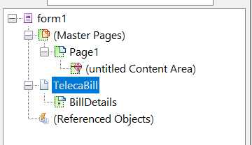

# 자습서:템플릿 만들기{#tutorial-create-templates}

이 자습서는 첫 번째 인터랙티브 커뮤니케이션 [시리즈 만들기의 단계입니다](/help/forms/using/create-your-first-interactive-communication.md) . 전체 자습서 사용 사례를 이해하고, 실행하고, 시연하기 위해 시리즈를 시간 순서대로 따르는 것이 좋습니다.

대화형 통신을 만들려면 인쇄 및 웹 채널용 AEM 서버에서 사용할 수 있는 템플릿이 있어야 합니다.

인쇄 채널의 템플릿은 Adobe Forms Designer에서 만들고 AEM 서버에 업로드됩니다. 그런 다음 대화형 통신을 만들 때 이러한 템플릿을 사용할 수 있습니다.

웹 채널에 대한 템플릿은 AEM에서 만들어집니다. 템플릿 작성자 및 관리자는 웹 템플릿을 만들고 편집하고 활성화할 수 있습니다. 작성 및 활성화된 템플릿은 대화형 통신을 만들 때 사용할 수 있습니다.

이 자습서에서는 대화형 통신을 만드는 동안 사용할 수 있도록 인쇄 및 웹 채널에 대한 템플릿을 만드는 단계를 안내합니다. 이 튜토리얼의 끝에서 다음 작업을 수행할 수 있습니다.

* Adobe Forms Designer를 사용하여 인쇄 채널용 XDP 템플릿 만들기
* XDP 템플릿을 AEM Forms 서버에 업로드
* 웹 채널에 대한 템플릿 만들기 및 활성화

## 인쇄 채널용 템플릿 만들기 {#create-template-for-print-channel}

다음 작업을 사용하여 인터랙티브 커뮤니케이션의 인쇄 채널에 대한 템플릿을 만들고 관리할 수 있습니다.

* [Forms Designer를 사용하여 XDP 템플릿 만들기](../../forms/using/create-templates-print-web.md#create-xdp-template-using-forms-designer)
* [XDP 템플릿을 AEM Forms 서버에 업로드](../../forms/using/create-templates-print-web.md#upload-xdp-template-to-the-aem-forms-server)
* [레이아웃 조각에 대한 XDP 템플릿 만들기](../../forms/using/create-templates-print-web.md#create-xdp-template-for-layout-fragments)

### Forms Designer를 사용하여 XDP 템플릿 만들기 {#create-xdp-template-using-forms-designer}

사용 사례 [및](/help/forms/using/create-your-first-interactive-communication.md) 분석을 기반으로 XDP 템플릿에서 다음 하위 양식을 만듭니다.

* 청구서 세부 정보:문서 조각 포함
* 고객 세부 정보:문서 조각 포함
* 청구 요약:문서 조각 포함
* 요약:문서 조각(요금 하위 폼) 및 차트(차트 하위 폼) 포함
* 항목별 호출:표(레이아웃 조각) 포함
* 지금 지불:이미지 포함
* 부가 가치 서비스:이미지 포함

이러한 하위 양식은 Forms 서버에 XDP 파일을 업로드한 후 인쇄 템플릿에서 대상 영역으로 표시됩니다. 문서 조각, 차트, 레이아웃 조각 및 이미지와 같은 모든 엔티티가 인터랙티브 커뮤니케이션을 만드는 동안 대상 영역에 추가됩니다.

인쇄 채널에 대한 XDP 템플릿을 만들려면 다음 단계를 수행하십시오.

1. 양식 디자이너를 열고 **파일** > 새로 **만들기** > **빈 양식 사용** , 다음 **탭,**&#x200B;마침 을 탭한 다음 양식을 열어 템플릿 작성을 **** 수행할 수 있습니다.

   [창] 메뉴에서 **[개체 라이브러리** ] 및 **[개체** ] **옵션을** 선택해야합니다.

1. 개체 라이브러리에서 **하위** 구성 요소를 **폼으로 드래그하여** 놓습니다.
1. 오른쪽 창의 개체 창에 하위 폼의 **옵션을** 표시하려면 하위 폼을 선택합니다.
1. 하위 **폼** 탭을 선택하고 **콘텐츠** 드롭다운 **목록에서** 흐름을선택합니다. 하위 폼의 왼쪽 끝점을 드래그하여 길이를 조정합니다.
1. 바인딩 **탭에서** 다음을 수행합니다.

   1. 이름 **필드에 BillDetails** 를 **지정합니다** .

   1. 데이터 **바인딩** 드롭다운 목록에서 데이터 **바인딩** 없음을 선택합니다.
   

1. 마찬가지로 루트 하위 양식을 선택하고 하위 **폼** 탭을 선택한 다음 **콘텐츠** **** 드롭다운 목록에서흐름도를선택합니다. 바인딩 **탭에서** 다음을 수행합니다.

   1. 이름 **필드에 텔레카** 빌을 **지정합니다** .

   1. 데이터 **바인딩** 드롭다운 목록에서 데이터 **바인딩** 없음을 선택합니다.
   

1. 2 - 5단계를 반복하여 다음 하위 양식을 만듭니다.

   * BillDetails
   * 고객 세부 사항
   * BillSummary
   * 요약 - 하위 **폼** 탭을 선택하고 **이** 하위 **폼의** 콘텐츠 드롭다운 목록에서위치를 선택합니다. 요약 하위 양식에 다음 하위 **양식을** 삽입합니다.

      * 요금
      * 차트
   * ItemisedCalls
   * PayNow
   * ValueAddedServices
   시간을 절약하기 위해 기존 하위 양식을 복사하여 붙여 넣어 새 하위 양식을 만들 수도 있습니다.

   차트 **하위** 하위 양식을 [비용 **]의 오른쪽으로 이동하려면 왼쪽 창에서 차트** 차트를 **선택하고** [레이아웃 **] 탭을 선택한 다음** AnchorX 하위 폼 필드에 대한 값을지정합니다. 값은 Charts 하위 폼의 **Width** 필드 값보다 커야 **합니다** . Charges **하위** 양식을 선택하고 **레이아웃** 탭을 선택하여 Width **필드의 값을** 봅니다.

1. 개체 라이브러리에서 **Text** 개체를 **양식으로 드래그하여** 놓고 **Dial XXXX를 입력하여** 상자에 텍스트를 구독하십시오.
1. 왼쪽 창에서 텍스트 개체를 마우스 오른쪽 단추로 클릭하고 개체 **이름 변경을**&#x200B;선택한 다음 텍스트 개체의 이름을 구독으로 **입력합니다**.

   

1. 파일 **** > **다른** 이름으로 저장을 선택하여 로컬 파일 시스템에 파일을 저장합니다.

   1. 파일을 저장할 위치로 이동하여 이름을 **create_first_ic_print_template**&#x200B;로 지정합니다.
   1. 다른 이름으로 **저장** 형식 **** 드롭다운 목록에서 .xdp를 선택합니다.

   1. 저장을 **누릅니다**.

### XDP 템플릿을 AEM Forms 서버에 업로드 {#upload-xdp-template-to-the-aem-forms-server}

양식 디자이너를 사용하여 XDP 템플릿을 만든 후에는 AEM Forms 서버에 업로드하여 대화형 통신을 만드는 동안 템플릿을 사용할 수 있도록 해야 합니다.

1. [ **[!UICONTROL 양식]** ] > [ **[!UICONTROL 양식 및 문서]를 선택합니다]**.
1. 만들기 **> 파일** 업로드를 **누릅니다**.

   XDP( **create_first_ic_print_template** 템플릿)를 탐색하여 선택하고 **열기를** 눌러 XDP 템플릿을 AEM Forms 서버로 가져옵니다.

### 레이아웃 조각에 대한 XDP 템플릿 만들기 {#create-xdp-template-for-layout-fragments}

Interactive Communication의 인쇄 채널에 대한 레이아웃 조각을 만들려면 Forms Designer를 사용하여 XDP를 만들고 AEM Forms 서버에 업로드합니다.

1. 양식 디자이너를 열고 **파일** > 새로 **만들기** > **빈 양식 사용** , 다음 **탭,**&#x200B;마침 을 탭한 다음 양식을 열어 템플릿 작성을 **** 수행할 수 있습니다.

   [창] 메뉴에서 **[개체 라이브러리** ] 및 **[개체** ] **옵션을** 선택해야합니다.

1. 개체 라이브러리에서 **표** 구성 요소를 **** 양식으로 드래그하여 놓습니다.
1. 표 삽입 대화 상자에서 다음을 수행합니다.

   1. 열 수를 **5**&#x200B;로 지정합니다.
   1. 본문 행 수를 **1로 지정합니다**.
   1. 테이블에 **머리글 행 포함 확인란을** 선택합니다.
   1. Tab **OK**.

1. 표 1 옆에 있는 왼쪽 창에서 **을** **누르고** 마우스 오른쪽 단추로 **셀1을** 클릭한 다음 개체 이름 바꾸기를 선택하여 **** ****&#x200B;날짜 바꾸기를 선택합니다.

   마찬가지로, Cell2 ******,** Cell3 **, Cell****의 이름을 바꾸고, Cell4** 의 이름을 바꾸고, Cell4 **Time 및 Cell5 To************** Time, Number, Number Number, Duration Duration, Duration 및 ChargesEach Prime의 이름을 변경합니다.

1. 디자이너 보기에서 **시간** , **번호**, **기간**, 머리글 **내어쓰기 및******&#x200B;내어쓰기 텍스트 필드를 클릭하고 이름을 변경합니다.

   

1. 왼쪽 **창에서 행 1** 을 **선택하고** 개체 **>** 바인딩 **> 각**&#x200B;데이터 항목에 대해반복 행을 선택합니다.

   

1. 개체 라이브러리에서 **텍스트 필드** 구성 요소를 **디자이너** 보기로 드래그하여 **놓습니다**.

   

   마찬가지로 텍스트 필드 구성 요소를 **시간** , **시간**, **숫자**, 지속 시간, **간격 및**&#x200B;전각 **추가** 행 등으로 드래그하여 놓습니다.

1. 파일 **** > **다른** 이름으로 저장을 선택하여 로컬 파일 시스템에 파일을 저장합니다.

   1. 파일을 저장할 위치로 이동하여 이름을 **table_lf로 지정합니다**.
   1. 다른 이름으로 **저장** 형식 **** 드롭다운 목록에서 .xdp를 선택합니다.

   1. 저장을 **누릅니다**.
   양식 디자이너를 사용하여 레이아웃 조각에 대한 XDP 템플릿을 만든 후에는 레이아웃 조각을 만드는 동안 템플릿을 사용할 수 있도록 AEM Forms 서버에 [업로드해야](../../forms/using/create-templates-print-web.md#upload-xdp-template-to-the-aem-forms-server) 합니다.

## 웹 채널용 템플릿 만들기 {#create-template-for-web-channel}

다음 작업을 사용하여 대화형 통신 웹 채널에 대한 템플릿을 만들고 관리합니다.

* [템플릿 폴더 만들기](../../forms/using/create-templates-print-web.md#create-folder-for-templates)
* [템플릿 만들기](../../forms/using/create-templates-print-web.md#create-the-template)
* [템플릿 활성화](../../forms/using/create-templates-print-web.md#enable-the-template)
* [인터랙티브 커뮤니케이션에서 단추 활성화](../../forms/using/create-templates-print-web.md#enabling-buttons-in-interactive-communications)

### 템플릿 폴더 만들기 {#create-folder-for-templates}

웹 채널 템플릿을 만들려면 만든 템플릿을 저장할 수 있는 폴더를 정의합니다. 해당 폴더 내에 템플릿을 만들면 양식 사용자가 템플릿을 기반으로 대화형 커뮤니케이션의 웹 채널을 만들 수 있도록 템플릿을 활성화합니다.

다음 단계를 수행하여 편집 가능한 템플릿의 폴더를 만듭니다.

1. 도구 **> 구성** 브라우저를  누릅니다 ****.
1. 구성 브라우저 페이지에서 만들기를 **탭합니다**.
1. 구성 **만들기 대화 상자에서** Create_First_IC_templates **를** 폴더의 제목으로 지정하고 편집 가능한 템플릿을 **확인하고 만들기를******&#x200B;누릅니다.

   

   Create_ **First_IC_templates** 폴더가 생성되어 구성 브라우저 **페이지에** 나열됩니다.

### 템플릿 만들기 {#create-the-template}

사용 사례 [및](/help/forms/using/create-your-first-interactive-communication.md) 분석을 기반으로 웹 템플릿에서 다음 패널을 만듭니다.

* 청구서 세부 정보:문서 조각 포함
* 고객 세부 정보:문서 조각 포함
* 청구 요약:문서 조각 포함
* 비용 요약:문서 조각 및 차트(두 열 레이아웃) 포함
* 항목별 호출:표 포함
* 지금 지불:지금 **지불** 단추 및 이미지 포함
* 부가 가치 서비스:이미지 및 구독 **단추가** 포함되어 있습니다.

문서 조각, 차트, 표, 이미지 및 버튼과 같은 모든 엔티티가 인터랙티브 커뮤니케이션을 만드는 동안 추가됩니다.

다음 단계를 수행하여 Create_First_IC_templates **** 폴더에서 웹 채널에 대한 템플릿을 만듭니다.

1. 도구 > 템플릿 > **Create** _First_IC_ **templates** 폴더를 선택하여 해당 템플릿 **폴더로 이동합니다** .
1. 만들기를 **누릅니다**.
1. 템플릿 **유형 선택** 구성 마법사에서 대화형 통신 - 웹 **채널을 선택하고** 다음을 **탭합니다**.
1. 템플릿 세부 **사항** 구성 마법사에서 **Create_First_IC_Web_Template** 을 템플릿 제목으로 지정합니다. 선택적 설명을 지정하고 만들기를 **누릅니다**.

   Create_First_IC_ **Web_Template이** 표시된다는 확인 메시지가 표시됩니다.

1. 열기를 **눌러** 템플릿 편집기에서 템플릿을 엽니다.
1. 미리 **보기** 옵션 옆의 드롭다운 목록에서 초기 컨텐츠를 **선택합니다** .

   

1. 루트 **패널을** 누른 다음 **+** 를 눌러 템플릿에 추가할 수 있는 구성 요소 목록을 봅니다.
1. 목록에서 **패널을** 선택하여 루트 패널 위에 패널을 **추가합니다**.
1. 왼쪽 **창에서** 콘텐트 탭을 선택합니다. 8단계에서 추가된 새 패널은 컨텐츠 **트리의 루트** 패널 아래에 표시됩니다.

   

1. 패널을 선택하고  (구성)을 누릅니다.
1. 속성 창에서:

   1. 이름 **필드에 청구** 정보를 지정합니다.
   1. 제목 **필드에서** 청구 상세내역을 지정합니다.
   1. 열 **수** **드롭다운 목록에서** 1을 선택합니다.

   1. 속성을  저장하려면 을 누릅니다.
   패널의 이름이 컨텐츠 **트리의 [BOM 세부 정보** ]로 업데이트됩니다.

1. 템플릿에 다음 속성이 있는 패널을 추가하려면 7 - 11단계를 반복합니다.

   | 이름 | 제목 | 열 수 |
   |---|---|---|
   | 고객 정보 | 고객 세부 정보 | 1 |
   | billsummary | 청구 요약 | 1 |
   | 요약 요금 | 비용 요약 | 2 |
   | itemishcalls | 항목별 호출 | 1 |
   | paynow | 지금 지불 | 2 |
   | vas | 부가 가치 서비스 | 1 |

   다음 이미지는 템플릿에 모든 패널을 추가한 후 컨텐츠 트리를 보여 줍니다.

   

### 템플릿 활성화 {#enable-the-template}

웹 템플릿을 만든 후에는 대화형 통신을 만들 때 템플릿을 사용하도록 설정해야 합니다.

웹 템플릿을 활성화하려면 다음 단계를 수행하십시오.

1. 도구 **> 템플릿을** 누릅니다 ****.
1. Create_First_ **IC_Web_Template** 템플릿으로 이동하여 선택한 다음 활성화를 **누릅니다**.
1. Tab **다시** 활성화하여 확인합니다.

   템플릿이 활성화되고 상태는 활성화됨으로 표시됩니다. 웹 채널에 대한 대화형 통신을 만드는 동안 이 템플릿을 사용할 수 있습니다.

### 인터랙티브 커뮤니케이션에서 단추 활성화 {#enabling-buttons-in-interactive-communications}

사용 사례에 따라 Interactive Communication에 **지금** 지불 및 **구독** 버튼(적응형 양식 구성 요소)을포함해야 합니다. 대화형 통신에서 이러한 단추를 사용하려면 다음 단계를 실행합니다.

1. 미리 **보기** 옵션 옆에 있는 드롭다운 목록에서 구조를 **선택합니다** .
1. 컨텐츠 **트리를 사용하여 문서 컨테이너** 루트 패널을 선택하고 **정책을** 눌러 대화형 통신에 사용할 수 있는 구성 요소를 선택합니다.

   

1. 속성 **섹션의 [허용된 구성 요소** ] **탭의** Adaptive **Form** 구성 요소에서 **단추를** 선택합니다.

   

1. 속성을  저장하려면 을 누릅니다.