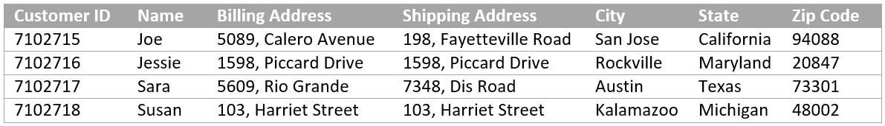

# 자습서:첫 번째 적응형 양식 {#tutorial-create-your-first-adaptive-form} 만들기

## 소개 {#introduction}

등록을 간소화하고 참여를 유도하며 소요 시간을 단축하는 모바일용 **양식 경험**&#x200B;을 찾고 계십니까? **적응형 양식**&#x200B;은 귀하에게 가장 적합한 제품입니다. 적응형 양식을 통해 모바일, 자동화 및 분석에 최적화된 양식 경험을 제공할 수 있습니다. 응답 속도가 빠르고 인터랙티브한 양식을 손쉽게 작성할 수 있고 자동화된 프로세스를 통해 관리 및 반복적인 작업을 줄일 수 있으며 데이터 분석을 통해 고객이 양식을 사용하는 경험을 개선하고 개인화할 수 있습니다.

이 자습서에서는 적응형 양식을 만드는 엔드 투 엔드 프레임워크를 제공합니다. 이 자습서는 사용 사례와 여러 안내선으로 구성됩니다. 각 안내서는 이 튜토리얼에서 만든 적응형 양식에 새로운 기능을 배우고 추가하는 데 도움이 됩니다. 모든 안내서의 작업 적응형 양식이 있습니다. 적응형 양식을 만드는 안내서를 사용할 수 있습니다. 후속 가이드가 곧 제공될 예정입니다. 이 튜토리얼의 끝에서 다음 작업을 수행할 수 있습니다.

* 적응형 양식 및 양식 데이터 모델을 만듭니다.
* 적응형 양식의 스타일을 지정할 수 있습니다.
* 적응형 양식 규칙 편집기를 사용하여 비즈니스 규칙을 만들 수 있습니다.
* 적응형 양식을 테스트하고 게시합니다.

여정은 사용 사례를 배움으로써 시작됩니다.

웹 사이트에서는 다양한 고객을 위한 다양한 제품을 제공합니다. 고객은 포털을 검색하고 제품을 선택하고 주문할 수 있습니다. 모든 고객은 계정을 만들고 배송 및 청구 주소를 제공합니다. 기존 고객인 Sara Rose는 웹사이트에 그녀의 배송 주소를 추가하기를 기대하고 있다. 웹 사이트에서는 배송 주소를 추가하고 업데이트하는 온라인 양식을 제공합니다.

이 웹 사이트는 AEM(Adobe Experience Manager)에서 실행되며 데이터 캡처 및 처리를 위해 AEM [!DNL Forms]을 사용합니다. 주소 추가 및 업데이트 양식은 적응형 양식입니다. 웹 사이트에는 고객 세부 정보가 데이터베이스에 저장됩니다. 주소 추가 및 업데이트 양식을 사용하여 사용 가능한 주소를 검색하고 표시합니다. 또한 적응형 양식을 사용하여 업데이트된 주소와 새 주소를 적용합니다.

### 전제 조건 {#prerequisite}

* AEM 작성자 인스턴스를 설정합니다.
* 작성자 인스턴스에 [AEM Forms add-on](../../forms/using/installing-configuring-aem-forms-osgi.md)을(를) 설치합니다.
* 데이터베이스 공급자로부터 JDBC 데이터베이스 드라이버(JAR 파일)를 가져옵니다. 자습서의 예는 [!DNL MySQL] 데이터베이스를 기반으로 하며 [!DNL Oracle's] [MySQL JDBC 데이터베이스 드라이버](https://dev.mysql.com/downloads/connector/j/5.1.html)을(를) 사용합니다.

* 아래 필드를 사용하여 고객 데이터가 포함된 데이터베이스를 설정합니다. 적응형 양식을 만드는 데 데이터베이스가 반드시 필요한 것은 아닙니다. 이 자습서에서는 데이터베이스를 사용하여 AEM [!DNL Forms]의 양식 데이터 모델 및 지속성 기능을 표시합니다.

## 1단계:응용 양식 {#step-create-an-adaptive-form} 만들기

적응형 양식은 자연에서 새로운 세대, 매력적이고 반응형, 동적이며 적응형 양식을 제공합니다. 적응형 양식을 사용하여 개인화된 대상화된 경험을 제공할 수 있습니다. AEM [!DNL Forms]은(는) 드래그 앤 드롭 WYSIWYG 편집기를 제공하여 적응형 양식을 만듭니다. 적응형 양식에 대한 자세한 내용은 [적응형 양식 작성 소개](../../forms/using/introduction-forms-authoring.md)를 참조하십시오.

목표:

* 고객이 배송 주소를 추가할 수 있는 적응형 양식 만들기
* 고객의 정보를 표시하고 수락하는 적응형 양식의 레이아웃 필드
* 양식 컨텐츠가 포함된 이메일을 보내기 위한 제출 작업 만들기
* 적응형 양식 미리 보기 및 제출

## 2단계:양식 데이터 모델 만들기 {#step-create-form-data-model}

양식 데이터 모델을 사용하면 적응형 양식을 서로 다른 데이터 소스에 연결할 수 있습니다. 예를 들어 AEM 사용자 프로필, RESTful 웹 서비스, SOAP 기반 웹 서비스, OData 서비스 및 관계형 데이터베이스를 들 수 있습니다. 양식 데이터 모델은 연결된 데이터 소스에서 사용할 수 있는 비즈니스 엔티티 및 서비스의 통합 데이터 표현 스키마입니다. 적응형 양식이 있는 양식 데이터 모델을 사용하여 연결된 데이터 소스를 검색, 업데이트, 삭제 및 추가할 수 있습니다.

목표:

* 웹 사이트의 데이터베이스 인스턴스([!DNL MySQL] 데이터베이스)를 데이터 소스로 구성
* [!DNL MySQL] 데이터베이스를 데이터 소스로 사용하여 양식 데이터 모델을 만듭니다.
* 양식 데이터 모델에 데이터 모델 개체 추가
* 양식 데이터 모델에 대한 읽기 및 쓰기 서비스 구성
* 테스트 데이터를 사용하여 양식 데이터 모델 및 구성된 서비스 테스트

## 3단계:적응형 양식 필드 {#step-apply-rules-to-adaptive-form-fields}에 규칙 적용

적응형 양식에서는 적응형 양식 개체에 대한 규칙을 작성할 수 있는 편집기를 제공합니다. 이러한 규칙은 양식의 사전 설정 조건, 사용자 입력 및 사용자 작업을 기반으로 양식 객체를 트리거하는 작업을 정의합니다. 정확성을 보장하고 양식 채우기 경험을 신속하게 진행할 수 있습니다.

목표:

* 적응형 양식 필드에 규칙 만들기 및 적용
* 규칙을 사용하여 양식 데이터 모델 서비스를 트리거하여 데이터를 데이터베이스로 업데이트

## 4단계:적응형 양식 스타일 지정 {#step-style-your-adaptive-form}

적응형 양식은 적응형 양식의 테마를 만들기 위해 테마와 [편집기](../../forms/using/themes.md)를 제공합니다. 테마에는 구성 요소 및 패널에 대한 스타일 세부 사항이 포함되어 있으며 테마를 다른 형식으로 재사용할 수 있습니다. 스타일은 배경색, 상태 색상, 투명도, 정렬 및 크기와 같은 속성을 포함합니다. 양식에 테마를 적용하면 지정된 스타일이 양식의 해당 구성 요소에 반영됩니다. 적응형 양식은 양식 전용 스타일에 대한 인라인 스타일링을 지원합니다.

목표:

* 적응형 양식에 즉시 사용 가능한 테마 적용
* 테마 편집기를 사용하여 적응형 양식의 테마 만들기
* 사용자 정의 테마에 웹 글꼴 사용

## 5단계:응용 양식 {#step-test-your-adaptive-form} 테스트

적응형 양식은 고객과의 상호 작용에 없어서는 안 될 요소입니다. 변경 사항이 있을 때마다 적응형 양식을 테스트하는 것이 중요합니다. 양식의 모든 필드를 테스트하는 것은 번거로운 작업입니다. AEM [!DNL Forms]은 적응형 양식 테스트를 자동화하는 SDK(Calvin SDK)를 제공합니다. Calvin을 사용하면 웹 브라우저에서 적응형 양식 테스트를 자동화할 수 있습니다.

목표:

* 적응형 양식에 대한 테스트 세트 만들기
* 적응형 양식에 대한 테스트 케이스 만들기
* 테스트 케이스 실행

## 6단계:적응형 양식 {#step-publish-your-adaptive-form} 게시

적응형 양식을 독립 실행형 양식(단일 페이지 애플리케이션)으로 게시하거나, AEM [사이트 페이지](/help/forms/using/embed-adaptive-form-aem-sites.md)에 포함하거나, [Forms Portal](../../forms/using/introduction-publishing-forms.md)을 사용하여 AEM [!DNL Site]에 목록을 게시할 수 있습니다.

목표:

* 적응형 양식을 AEM 페이지로 게시
* AEM [!DNL Sites] 페이지에 적응형 양식 포함
* 외부 웹 페이지에 적응형 양식 포함(AEM 외부에 호스팅되는 AEM이 아닌 웹 페이지)

