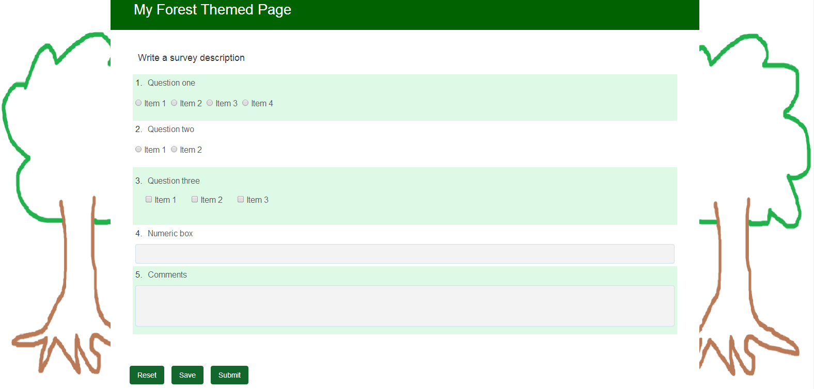

# 사용자 정의 적응형 양식 테마 만들기 {#creating-custom-adaptive-form-themes}

>[!CAUTION]
>
>AEM Forms는 적응형 [양식](/help/forms/using/themes.md) 테마를 [만들고 수정하는 테마 편집기 기능을 제공합니다](/help/forms/using/themes.md). 테마 편집기가 없는 버전에서 업그레이드했으며 Less/CSS [파일을 사용하여 만든 테마에](/help/forms/using/themes.md) 대한 기존 투자를 받은 경우에만 이 문서에 나열된 단계를 수행하십시오(사전 테마 편집기 방법).

## 전제 조건 {#prerequisites}

* LESS(Leaner CSS 파섹) 프레임워크에 대한 지식
* Adobe Experience Manager에서 클라이언트 라이브러리를 만드는 방법
* [만드는 테마를 사용하기 위한 적응형 양식 템플릿](/help/forms/using/custom-adaptive-forms-templates.md) 만들기

## Adaptive form theme {#adaptive-form-theme}

적응형 **양식 테마는** 적응형 양식의 스타일(모양 및 느낌)을 정의하는 데 사용하는 AEM 클라이언트 라이브러리입니다.

응용 **템플릿을** 만들고 테마를 템플릿에 적용합니다. 그런 다음 이 사용자 지정 템플릿을 사용하여 **적응형 양식을**&#x200B;만듭니다.


## 적응형 양식 테마를 만들려면 {#to-create-an-adaptive-form-theme}

>[!NOTE]
>
>다음 절차는 노드, 속성 및 폴더와 같은 AEM 객체의 샘플 이름을 사용하는 방법에 대해 설명합니다.
>
>이름을 사용하여 이러한 단계를 수행하면 결과 템플릿이 다음 스냅샷과 유사하게 나타납니다.

 숲 테마 적응형 양식 스냅샷&#x200B;****&#x200B;그림:포리스트 *테마 샘플*

1. 노드 `cq:ClientLibraryFolder` 아래에 유형 노드를 `/apps`만듭니다.

   예를 들어 다음 노드를 만듭니다.

   `/apps/myAfThemes/forestTheme`

1. 노드에 다중값 문자열 속성을 `categories` 추가하고 값을 적절하게 설정합니다.

   예를 들어 속성을 다음으로 설정합니다. `af.theme.forest`Adobe

   

1. 1단계에서 만든 노드에 두 개의 폴더 `less` 및 `css`파일을 `css.txt` 추가합니다.

   * `less` 폴더:변수를 정의하는 `less` 변수 파일과 .css 스타일을 관리하는 `less` `less mixins` 데 사용되는 변수 파일을 포함합니다.

      이 폴더는 `less` 변수 파일, 파일 `less` 믹싱, 믹스와 변수를 사용하여 스타일을 정의하는 `less` 파일로 구성됩니다. 이렇게 적은 파일은 모두 styles.less로 가져옵니다.

   * `css`폴더:테마에 사용할 정적 스타일을 정의하는 .css 파일이 포함되어 있습니다.
   **적은 변수 파일**:CSS 스타일을 정의하는 데 사용되는 변수를 정의하거나 재정의하는 파일입니다.

   적응형 양식은 다음 .less 파일에 정의된 OOTB 변수를 제공합니다.

   * `/apps/clientlibs/fd/af/guidetheme/common/less/globalvariables.less`
   * `/apps/clientlibs/fd/af/guidetheme/common/less/layoutvariables.less`
   적응형 양식은 다음에 정의된 타사 변수를 제공합니다.

   `/apps/clientlibs/fd/af/third-party/less/variables.less`

   적응형 양식과 함께 제공되는 변수 수를 줄이고, 이러한 변수를 재정의하거나, 변수를 새로 만들 수 있습니다.

   >[!NOTE]
   >
   >더 적은 사전 프로세서의 파일을 가져오는 동안 가져오기 문에서 파일의 상대 경로를 지정합니다.

   변수 재정의 샘플:

   ```
   @button-background-color: rgb(19, 102, 44);
   @button-border-color: rgb(19, 102, 44);
   @button-border-size: 0px;
   @button-padding: 10px 15px;
   @button-font-color: #ffffff;
   ```

   변수를 재정의하려면 `less`다음을 수행합니다.

   1. 기본 적응형 양식 변수 가져오기:

      `/apps/clientlibs/fd/af/guidetheme/common/less/globalvariables.less/apps/clientlibs/fd/af/guidetheme/common/less/layoutvariables.less`

   1. 그런 다음 재정의된 변수가 포함된 파일을 더 적게 가져옵니다.
   새 변수 정의 샘플:

   ```
   @button-focus-bg-color: rgb(40, 208, 90);
   @button-hover-bg-color: rgb(30, 156, 67);
   ```

   **** 파일 믹싱 감소:변수를 인수로 허용하는 함수를 정의할 수 있습니다. 이러한 함수의 출력은 결과 스타일입니다. 이러한 혼합을 다른 스타일 내에서 사용하여 CSS 스타일을 반복하지 않도록 할 수 있습니다.

   적응형 양식은 다음에 정의된 OOTB 믹스를 제공합니다.

   * `/apps/clientlibs/fd/af/guidetheme/common/less/adaptiveforms-mixins.less`
   적응형 양식은 에 정의된 타사 믹스도 제공합니다.

   * `/apps/clientlibs/fd/af/third-party/less/mixins.less`
   샘플 혼합 정의:

   ```
   .rounded-corners (@radius) {
     -webkit-border-radius: @radius;
     -moz-border-radius: @radius;
     -ms-border-radius: @radius;
     -o-border-radius: @radius;
     border-radius: @radius;
   }
   
   .border(@color, @type, @size) {
      border: @color @size @type;
   }
   ```

   **** Styles.less 파일:이 파일을 사용하여 클라이언트 라이브러리에서 사용해야 하는 모든 파일(변수, 믹싱, 스타일)을 포함합니다.

   다음 샘플 `styles.less` 파일에서 import 문을 임의의 순서대로 배치할 수 있습니다.

   다음 .less 파일을 가져오기 위한 문은 필수입니다.

   * `globalvariables.less`
   * `layoutvariables.less`
   * `components.less`
   * `layouts.less`

   ```
   @import "../../../clientlibs/fd/af/guidetheme/common/less/globalvariables.less";
   @import "../../../clientlibs/fd/af/guidetheme/common/less/layoutvariables.less";
   @import "forestTheme-variables";
   @import "../../../clientlibs/fd/af/guidetheme/common/less/components.less";
   @import "../../../clientlibs/fd/af/guidetheme/common/less/layouts.less";
   
   /* custom styles */
   
   .guidetoolbar {
     input[type="button"], button, .button {
       .rounded-corners (@button-radius);
       &:hover {
         background-color: @button-hover-bg-color;
       }
       &:focus {
         background-color: @button-focus-bg-color;
       }
     }
   }
   
   form {
       background-image: url(../images/forest.png);
    background-repeat: no-repeat;
    background-size: 100%;
   }
   ```

   에는 `css.txt` 라이브러리에 다운로드할 .css 파일의 경로가 포함되어 있습니다.

   예:

   ```
   #base=/apps/clientlibs/fd/af/third-party/css
   bootstrap.css
   
   #base=less
   styles.less
   
   #base=/apps/clientlibs/fd/xfaforms/xfalib/css
   datepicker.css
   listboxwidget.css
   scribble.css
   dialog.css
   ```

   >[!NOTE]
   >
   >styles.less 파일은 필수가 아닙니다. 즉, 사용자 정의 스타일, 변수 또는 혼합을 정의하지 않은 경우 이 파일을 만들 필요가 없습니다.
   >
   >그러나 style.less 파일을 만들지 않는 경우 css.txt 파일에서 다음 줄의 주석을 해제해야 합니다.
   >
   >**`#base=less`**
   >
   >그리고 다음 줄에 주석을 답니다.
   >
   >**`styles.less`**

## 적응형 양식에서 테마를 사용하려면 {#to-use-a-theme-in-an-adaptive-form}

적응형 양식 테마를 만든 후 다음 단계를 수행하여 이 테마를 적응형 양식으로 사용합니다.

1. 적응형 양식 테마 [섹션을 만들기](/help/forms/using/creating-custom-adaptive-form-themes.md#p-to-create-an-adaptive-form-theme-p) 위해 에서 만든 테마를 포함하려면 사용자 정의 유형 페이지를 `cq:Component`만듭니다.

   예, `/apps/myAfCustomizations/myAfPages/forestPage`

   1. 속성을 `sling:resourceSuperType` 추가하고 값을 로 설정합니다 `fd/af/components/page/base`.

      

   1. 페이지에서 테마를 사용하려면 노드에 overriding file library.jsp를 추가해야 합니다.

      그런 다음 이 아티클의 적응형 양식 테마 섹션을 만들려면 에서 만든 테마를 가져옵니다.

      다음 샘플 코드 조각은 `af.theme.forest` 테마를 가져옵니다.

      ```
      <%@include file="/libs/fd/af/components/guidesglobal.jsp"%>
      <cq:includeClientLib categories="af.theme.forest"/>
      ```

   1. **선택 사항**:사용자 지정 페이지에서 필요에 따라 header.jsp, footer.jsp 및 body.jsp를 재정의합니다.

1. 사용자 지정 템플릿 만들기(예:jcr:content가 이전 단계에서 만든 사용자 지정 페이지를 가리키는 `/apps/myAfCustomizations/myAfTemplates/forestTemplate`) 페이지(예: `myAfCustomizations/myAfPages/forestPage)`Adobe

   

1. 이전 단계에서 만든 템플릿을 사용하여 적응형 양식을 만듭니다. 적응형 양식의 모양과 느낌은 이 문서의 적응형 양식 테마 만들기 섹션에서 만든 테마에 의해 정의됩니다.

