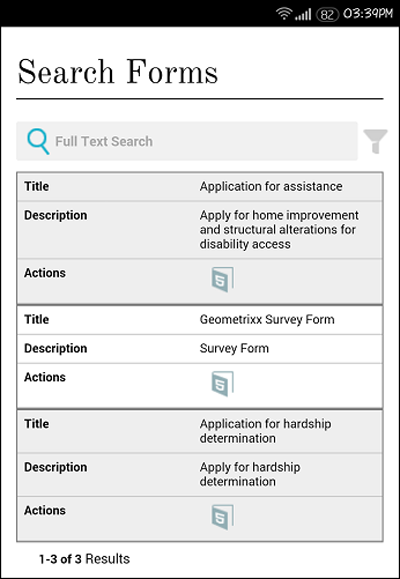

# 양식 포털 페이지 만들기{#creating-a-forms-portal-page}

Forms 포털 구성 요소는 웹 개발자에게 AEM(Adobe Experience Manager)을 사용하여 제작한 웹 사이트에서 양식 포털을 만들고 사용자 정의하는 구성 요소를 제공합니다. 양식 포털에 대한 빠른 개요를 보려면 [포털 양식 게시 소개](../../forms/using/introduction-publishing-forms.md)를 참조하십시오.

## 전제 조건 {#prerequisites}

Forms 포털 구성 요소는 기본적으로 사용할 수 없습니다. 다음 양식 포털 구성 요소 범주가 [양식 포털 구성 요소 활성화](/help/forms/using/enabling-forms-portal-components.md)에 설명된 대로 활성화되었는지 확인합니다.

**문서** 서비스검색 및 목록, 링크, 초안 및 제출 구성 요소를 포함합니다.

**문서 서비스** 조건자날짜 설명, 전체 텍스트 설명, 속성 설명 및 태그 설명 구성 요소를 포함합니다. 이러한 구성 요소는 검색 및 작성자 구성 요소에서 검색을 구성하는 데 사용됩니다.

AEM 사이트 페이지에서 활성화되면 이러한 구성 요소 카테고리를 구성 요소 브라우저에서 사용할 수 있습니다.

Forms 포털 구성 요소 범주

## 검색 및 라이브러리 구성 요소 {#search-amp-lister-component}

문서 서비스 구성 요소 카테고리 아래에서 사용할 수 있는 검색 및 작성자 구성 요소는 페이지의 양식을 나열하고 나열된 양식에서 검색을 구현하는 데 사용됩니다. 구성 요소에는 2개의 창이 있습니다.

* 양식이 나열되는 목록 창.
* 검색 기능을 추가할 검색 창입니다.

구성 요소 브라우저의 Document Services 구성 요소 범주에서 검색 및 작성자 구성 요소를 페이지로 드래그하여 놓을 수 있습니다. 구성 요소를 추가할 때 다음과 비슷한 모양이 됩니다.

격자 레이아웃이 있는 페이지의 검색 및 목록 구성 요소

### 목록 창 {#list-pane}

목록 창은 양식이 나열되는 영역입니다. 검색 및 작성자 구성 요소는 목록 창에서 양식 표시를 제어하는 데 사용할 수 있는 다양한 구성 옵션을 제공합니다.

목록 창을 구성하려면 검색 및 작성자 구성 요소를 탭한 다음 을(를) 탭합니다. **[!UICONTROL 구성 요소 편집]** 대화 상자가 열립니다.

편집 모드의 목록 창

**편집** 대화 상자에는 아래 표에 설명된 구성 옵션을 제공하는 여러 탭이 포함되어 있습니다. 완료 시 **확인**&#x200B;을 눌러 구성을 저장합니다.

<table>
 <tbody>
  <tr>
   <th>탭</th>
   <th>구성</th>
   <th>설명</th>
  </tr>
  <tr>
   <td><strong>자산 폴더</strong></code></td>
   <td>항목 추가</td>
   <td>AEM Forms UI를 사용하여 자산을 업로드하는 폴더를 구성합니다. 기본적으로 업로드된 모든 자산이 나열됩니다. AEM Forms UI에 대한 자세한 내용은 <a href="../../forms/using/introduction-managing-forms.md" target="_blank">양식 관리 소개</a>를 참조하십시오.</td>
  </tr>
  <tr>
   <td>
<strong>표시</strong></code>
 </td>
   <td>제목 텍스트</td>
   <td>검색 및 라이브러리 구성 요소의 제목입니다. 기본 제목은 <strong>Forms Portal입니다.</strong></td>
  </tr>
  <tr>
   <td> </td>
   <td>레이아웃 템플릿</td>
   <td>자산의 레이아웃. </td>
  </tr>
  <tr>
   <td> </td>
   <td>고급 검색 비활성화</td>
   <td>활성화되면 고급 검색 아이콘을 숨깁니다.</td>
  </tr>
  <tr>
   <td> </td>
   <td>텍스트 검색 비활성화</td>
   <td>활성화된 경우 전체 텍스트 검색 막대를 숨깁니다.</td>
  </tr>
  <tr>
   <td><strong>결과</strong></code></td>
   <td>페이지당 결과 수</td>
   <td>페이지에 표시할 최대 양식 수를 구성합니다.</td>
  </tr>
  <tr>
   <td> </td>
   <td>결과 텍스트</td>
   <td>
결과 텍스트를 구성합니다(예: 601개 중 1-12개 <strong>결과</strong>). 기본값은 <strong>Results</strong>입니다.
 
예를 들어 이 필드에 <strong>Forms </strong>을 지정하고 총 601개의 양식이 있는 경우 결과 텍스트가 601 <strong>Forms 중 1-12로 변경됩니다.</strong>
 </td>
  </tr>
  <tr>
   <td> </td>
   <td>페이지 텍스트</td>
   <td>
페이지 텍스트를 구성합니다(예: <strong>페이지 </strong>1/51). 기본값은 <strong>Page</strong>입니다.
 
예를 들어 이 필드에 <strong>응용 프로그램 양식 </strong>을 지정하고 51페이지가 있는 경우 페이지 텍스트가 <strong>응용 프로그램 양식 </strong>1/51로 변경됩니다.
 </td>
  </tr>
  <tr>
   <td> </td>
   <td>/ 텍스트</td>
   <td>
</strong>의 단어 <strong>을 지정된 텍스트(페이지 1 </strong>51의 <strong>페이지)로 바꿉니다. 기본값은 <strong>of</strong>입니다.</strong></strong>
 
예를 들어 이 필드에서 </strong>중에서 <strong>을 지정하면 텍스트가 </strong>51 중 <strong>1페이지로 변경됩니다.</strong></strong>
 </td>
  </tr>
  <tr>
   <td><strong>양식 링크</strong></code></td>
   <td>렌더링 유형</td>
   <td>지정된 렌더링 유형에 따라 양식 목록을 제어합니다. 사용 가능한 옵션은 PDF 및 HTML입니다. 예를 들어 렌더링 유형으로 HTML만 선택하면 PDF forms이 필터링됩니다.</td>
  </tr>
  <tr>
   <td> </td>
   <td>HTML 프로필</td>
   <td>렌더링에 사용할 HTML 프로필을 구성합니다. 사용 가능한 모든 프로파일이 드롭다운 목록에 나열됩니다.</td>
  </tr>
  <tr>
   <td> </td>
   <td>URL 제출</td>
   <td>
양식 데이터가 제출되는 서블릿을 구성합니다.
 
<strong>참고: 양식에 대한 </strong> <em>제출 URL은 여러 위치에서 지정할 수 있으며 우선 순위는 다음과 같습니다.</em>

    <ol>
     <li><em>제출 단추에서 양식에 포함된 제출 URL의 우선 순위가 가장 높습니다.</em></li>
     <li><em>AEM Forms UI에 언급된 제출 URL의 우선 순위가 두 번째로 높습니다.</em></li>
     <li><em>양식 포털에 명시된 제출 URL의 우선 순위가 가장 낮습니다.</em></li>
    </ol> </td>
  </tr>
  <tr>
   <td> </td>
   <td>HTML 렌더링 동작 도구 팁</td>
   <td>포인터를 (HTML5 아이콘) 위에 놓을 때 표시되는 도구 팁의 텍스트를 구성합니다.</td>
  </tr>
  <tr>
   <td> </td>
   <td>PDF 렌더링 동작 도구 팁</td>
   <td>포인터를 (PDF 아이콘) 위에 놓을 때 표시되는 도구 설명에 대한 텍스트를 구성합니다.</td>
  </tr>
  <tr>
   <td><strong>스타일</strong></code></td>
   <td>스타일 유형</td>
   <td>양식을 나열하기 위해 <strong>스타일 없음, 기본 스타일</strong> 또는 <strong>사용자 지정 스타일 </strong>을 지정할 수 있습니다.</td>
  </tr>
  <tr>
   <td> </td>
   <td>사용자 지정 스타일 경로</td>
   <td>[스타일 유형]으로 [사용자 정의]를 선택한 경우 사용자 정의 CSS의 경로를 찾아 지정하고 그렇지 않은 경우 [기본값]을 선택합니다.</td>
  </tr>
 </tbody>
</table>

### 검색 창 {#search-pane}

검색 창에서 AEM 사이드 킥의 문서 서비스 예측 범주에서 날짜 설명, 전체 텍스트 설명, 속성 설명 및 태그 설명 구성 요소를 추가할 수 있습니다. 이러한 구성 요소는 사용자가 나열된 양식에서 검색을 수행할 수 있도록 검색 기능을 구현합니다.

**팁:** *사전 설정 기준을 기반으로 양식 포털에 표시되는 양식 목록을 제어하고 최종 사용자의 검색 기능을 숨길 수 있습니다. 양식 목록을 제어하려면 설명 구성 요소를 사용하여 검색 필터를 적용합니다. 기본 필터 값을 지정하고 [구성 요소 편집] 대화 상자의 [표시] 탭에서 검색을 비활성화할 수도 있습니다.*

날짜, 전체 텍스트, 속성 및 태그 조건자가 있는 검색 패널

#### 날짜 설명 {#date-predicate}

날짜 설명 구성 요소를 추가하면 지정된 기간 동안 수정된 나열된 양식에서 검색을 사용할 수 있습니다.

날짜 설명 구성 요소를 구성하려면:

1. 구성 요소를 누른 다음 을(를) 누릅니다. 편집 대화 상자가 열립니다.
1. 다음을 지정합니다.

   * **유형:** 사용 가능한 유일한 옵션은  **마지막 수정 날짜입니다.**

   * **텍스트: 날짜** 설명 구성 요소에 대한 레이블 또는 캡션입니다. 기본값은 **마지막 수정 날짜입니다.**

   * **시작 날짜 레이블:** 시작 날짜 필드의 레이블 또는 캡션
   * **종료 날짜 레이블:** 종료 날짜 필드에 대한 레이블 또는 캡션
   * **숨기기:** 양식을 나열하기 위해 기본 날짜 필터를 적용하려면

1. **OK**&#x200B;을 누릅니다.

#### 전체 텍스트 설명 {#full-text-predicate}

전체 텍스트 설명 구성 요소는 이름 및 설명과 같은 양식 데이터에 대한 전체 텍스트 검색을 구현합니다. 사용자는 텍스트 문자열을 검색하여 이름 또는 설명에 텍스트를 포함하는 양식을 반환할 수 있습니다.

전체 텍스트 설명 구성 요소를 구성하려면:

1. 구성 요소를 누른 다음 을(를) 누릅니다. 편집 대화 상자가 열립니다.
1. **기본 제목** 필드에 제목을 지정합니다.
1. **확인**&#x200B;을 누릅니다.

#### 속성 설명 {#properties-predicate}

속성 설명 구성 요소는 제목, 작성자 및 설명과 같은 양식 속성을 기반으로 양식 검색을 구현합니다.

속성 설명 구성 요소를 구성하려면:

1. 구성 요소를 누른 다음 을(를) 누릅니다. 편집 대화 상자가 열립니다.
1. 일반 탭에서 검색 레이블을 지정합니다. 기본값은 **Properties**&#x200B;입니다.

1. 옵션 탭에서 **항목 추가를 누릅니다.**
1. 드롭다운 목록에서 속성을 선택하고 드롭다운 목록 아래의 필드에 속성 검색 레이블을 지정합니다.
1. 속성을 추가하려면 4단계를 반복합니다. 지정된 기준을 기반으로 양식을 나열하고 최종 사용자가 검색할 속성을 숨기도록 기본 필터 값을 지정할 수도 있습니다. 속성에 대한 숨기기 확인란을 선택하고 기본 필터 값을 지정합니다.
예를 들어 제목에 &quot;여행&quot;이 포함된 양식을 표시하려면 제목 속성 옆에 있는 숨기기를 선택합니다. 또한 기본 필터 값 텍스트 상자에 여행을 지정합니다.

1. **OK**&#x200B;을 누릅니다.

#### 태그 설명 {#tags-predicate}

태그 설명 구성 요소는 Forms Manager에 정의된 태그를 기반으로 양식 검색을 구현합니다.

태그 설명 구성 요소를 구성하려면:

1. 구성 요소를 누른 다음 을(를) 누릅니다. 편집 대화 상자가 열립니다.
1. 태그 필드 옆에 있는 아래쪽 화살표 단추를 누릅니다.
1. 적절한 태그 선택
1. **OK**&#x200B;을 누릅니다.

선택한 태그가 선택 확인란 과 함께 검색 창에 나타납니다. 이제 태그를 기준으로 검색 범위를 좁힐 수 있습니다.

## 페이지 {#list-forms-on-a-page-br}에 양식 나열

페이지에 양식을 나열하려면 **[!UICONTROL 검색 및 작성자]** 구성 요소를 페이지에 추가하고 **[!UICONTROL 목록 창]**&#x200B;을 구성합니다. 최종 사용자가 날짜, 텍스트 및 태그가 있는 양식을 검색할 수 있도록 하려면 **[!UICONTROL 검색 창]** 구성 요소를 추가합니다.

페이지의 아무 곳에서나 양식을 연결하려면 링크 구성 요소를 사용합니다. 링크 구성 요소에 대한 자세한 내용은 [페이지에 링크 구성 요소 포함](../../forms/using/embedding-link-component-page.md)을 참조하십시오.

초안 상태의 양식과 이미 제출한 양식을 나열하려면 **[!UICONTROL 초안 및 제출]** 구성 요소를 사용합니다. 자세한 내용은 [초안 및 제출 구성 요소 사용자 지정](../../forms/using/draft-submission-component.md)을 참조하십시오.

## 모바일 장치 친화성 {#mobile-device-friendliness}

Forms Portal 검색 및 라이브러리 구성 요소는 모바일 장치에 적합하며 그에 따라 조정됩니다. 3개의 기본 보기 모두:사이트를 연 장치에 따른 격자, 카드, 패널 레이아웃은 웹 페이지도 적응한다는 사실을 제공합니다. 간단한 사실은 Search &amp; Lister는 구성 요소일 뿐이며 페이지 수준 스타일링을 제어하지 않는다는 것입니다.

다음 이미지는 모바일 장치에서 열 때 검색 및 라이브러리 구성 요소를 보여 줍니다.

검색 및 라이브러리 구성 요소

## 양식 포털 페이지 {#customizing-a-forms-portal-page-br} 사용자 정의

양식 포털 페이지를 사용자 지정하여 페이지에 고유한 모양을 제공할 수 있습니다. 또한 메타데이터를 추가하여 검색 경험을 향상시키고, 페이지 레이아웃을 변경하고, 사용자 정의 CSS 스타일을 추가할 수도 있습니다. 자세한 내용은 [Forms 포털 구성 요소에 대한 템플릿 사용자 지정](../../forms/using/customizing-templates-forms-portal-components.md)을 참조하십시오.

AEM Forms UI를 사용하여 양식에 사용자 정의 메타데이터를 추가할 수 있습니다. 사용자 지정 메타데이터는 최종 사용자에게 양식 목록 및 검색 환경을 제공하는 데 유용합니다. 사용자 지정 메타데이터에 대한 자세한 내용은 [Forms 포털 구성 요소에 대한 템플릿 사용자 지정](../../forms/using/customizing-templates-forms-portal-components.md)을 참조하십시오.

즉시 사용 가능한 양식 포털은 렌더링 작업을 제공합니다. 양식 포털을 맞춤화하여 추가 작업을 추가할 수 있습니다. 자세한 내용은 양식 라이브러리 항목에 사용자 정의 작업 추가[를 참조하십시오.](../../forms/using/add-custom-action-form-lister.md)

## 관련 문서

* [양식 포털 구성 요소 활성화](/help/forms/using/enabling-forms-portal-components.md)
* [양식 포털 페이지 만들기](/help/forms/using/creating-form-portal-page.md)
* [API를 사용하여 웹 페이지에 양식 목록 표시](/help/forms/using/listing-forms-webpage-using-apis.md)
* [초안 및 제출 구성 요소 사용](/help/forms/using/draft-submission-component.md)
* [초안 및 제출된 양식의 저장 영역 사용자 정의](/help/forms/using/draft-submission-component.md)
* [초안 및 제출 구성 요소를 데이터베이스와 통합하는 샘플](/help/forms/using/integrate-draft-submission-database.md)
* [양식 포털 구성 요소에 대한 템플릿 사용자 정의](/help/forms/using/customizing-templates-forms-portal-components.md)
* [포털에서 양식 게시 소개](/help/forms/using/introduction-publishing-forms.md)
