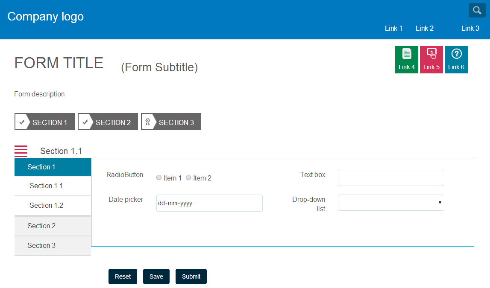

# 적응형 양식의 사용자 지정 레이아웃 구성 요소 만들기{#creating-custom-layout-components-for-adaptive-forms}

## 전제 조건 {#prerequisite}

사용자 정의 레이아웃을 제작/사용할 수 있는 레이아웃에 대한 지식입니다. [패널 레이아웃 변경](../../forms/using/layout-capabilities-adaptive-forms.md)을 참조하십시오.

## 응용 양식 패널 레이아웃 구성 요소 {#adaptive-form-panel-layout-component}

응용 양식 패널 레이아웃 구성 요소는 사용자 인터페이스를 기준으로 패널에 적응형 양식 구성 요소를 배치하는 방식을 제어합니다.

## 사용자 정의 패널 레이아웃 만들기 {#creating-a-custom-panel-layout}

1. `/crx/de` 위치로 이동합니다.
1. `/libs/fd/af/layouts/panel` 위치(예: `tabbedPanelLayout`)에서 `/apps`(예: `/apps/af-custom-layout`)로 패널 레이아웃을 복사합니다.
1. 복사한 레이아웃의 이름을 `customPanelLayout`에 변경합니다. `qtip` 및 `jcr:description` 노드의 속성을 변경합니다. 예를 들어 `Custom layout - Toggle tabs`으로 변경합니다.

qtip


>[!NOTE]
>
>`guideComponentType` 속성을 `fd/af/layouts/panel` 값으로 설정하면 레이아웃이 패널 레이아웃임을 결정합니다.

1. 새 레이아웃 아래의 `tabbedPanelLayout.jsp` 파일의 이름을 customPanelLayout.jsp로 바꿉니다.
1. 새 스타일과 비헤이비어를 도입하려면 `etc` 노드 아래에 클라이언트 라이브러리를 만듭니다. 예를 들어 /etc/af-custom-layout-clientlib 위치에서 node client-library를 만듭니다. 노드에 categories 속성 af.panel.custom이 있도록 합니다. 여기에는 다음과 같은 .css 및 .js 파일이 있습니다.

   ```css
   /** CSS defining new styles used by custom layout **/
   
   .menu-nav {
       background-color: rgb(198, 38, 76);
       height: 30px;
    width: 30px;
    font-size: 2em;
    color: white;
       -webkit-transition: -webkit-transform 1s;  /* For Safari 3.1 to 6.0 */
    transition: transform 1s;
   }
   
   .tab-content {
    border: 1px solid #08b1cf;
   }
   
   .custom-navigation {
       -webkit-transition: width 1s, height 1s, -webkit-transform 1s;  /* For Safari 3.1 to 6.0 */
    transition: width 1s, height 1s, transform 1s;
   }
   
   .panel-name {
       padding-left: 30px;
       font-size: 20px;
   }
   
   @media (min-width: 992px) {
    .nav-close {
     width: 0px;
       }
   }
   
   @media (min-width: 768px) and (max-width: 991px) {
    .nav-close {
     height: 0px;
       }
   }
   
   @media (max-width: 767px) {
    .menu-nav, .custom-navigation {
        display: none;
       }
   }
   ```

   ```javascript
   /** function for toggling the navigators **/
   var toggleNav = function () {
   
       var nav = $('.custom-navigation');
       if (nav) {
           nav.toggleClass('nav-close');
       }
   }
   
   /** function to populate the panel title **/
   $(window).on('load', function() {
       if (window.guideBridge) {
           window.guideBridge.on("elementNavigationChanged",
           function (evntName, evnt) {
                       var activePanelSom = evnt.newText,
                           activePanel = window.guideBridge._guideView.getView(activePanelSom);
                       $('.panel-name').html(activePanel.$itemNav.find('a').html());
                   }
           );
       }
   });
   ```

1. 모양과 비헤이비어를 향상시키기 위해 `client library`을(를) 포함할 수 있습니다.

   또한 .jsp 파일에 포함된 스크립트의 경로를 업데이트합니다. 예를 들어 `customPanelLayout.jsp` 파일을 다음과 같이 업데이트합니다.

   ```html
   <%-- jsp encapsulating navigator container and panel container divs --%>
   
   <%@include file="/libs/fd/af/components/guidesglobal.jsp"%>
   <cq:includeClientLib categories="af.panel.custom"/>
   <div>
       <div class="row">
           <div class="col-md-2 col-sm-2 hidden-xs menu-nav glyphicon glyphicon-align-justify" onclick="toggleNav();"></div>
           <div class="col-md-10 col-sm-10 hidden-xs panel-name"></div>
       </div>
       <div class="row">
           <div class="col-md-2 hidden-xs guide-tab-stamp-list custom-navigation">
               <cq:include script = "/apps/af-custom-layout/customPanelLayout/defaultNavigatorLayout.jsp" />
           </div>
           <div  class="col-md-10">
               <c:if test="${fn:length(guidePanel.description) > 0}">
                   <div class="<%=GuideConstants.GUIDE_PANEL_DESCRIPTION%>">
                       ${guide:encodeForHtml(guidePanel.description,xssAPI)}
                           <cq:include script="/libs/fd/af/components/panel/longDescription.jsp"/>
                   </div>
               </c:if>
               <cq:include script = "/apps/af-custom-layout/customPanelLayout/panelContainer.jsp"/>
           </div>
       </div>
   </div>
   ```

   `/apps/af-custom-layout/customPanelLayout/defaultNavigatorLayout.jsp` 파일:

   ```html
   <%-- jsp governing the navigation part --%>
   
   <%@include file="/libs/fd/af/components/guidesglobal.jsp"%>
   <%@ page import="com.adobe.aemds.guide.utils.StyleUtils" %>
   <%-- navigation tabs --%>
   <ul id="${guidePanel.id}_guide-item-nav-container" class="tab-navigators tab-navigators-vertical in"
       data-guide-panel-edit="reorderItems" role="tablist">
       <c:forEach items="${guidePanel.items}" var="panelItem">
           <c:set var="isNestedLayout" value="${guide:hasNestablePanelLayout(guidePanel,panelItem)}"/>
           <li id="${panelItem.id}_guide-item-nav" title="${guide:encodeForHtmlAttr(panelItem.navTitle,xssAPI)}" data-path="${panelItem.path}" role="tab" aria-controls="${panelItem.id}_guide-item">
               <c:set var="panelItemCss" value="${panelItem.cssClassName}"/>
               <% String panelItemCss = (String) pageContext.getAttribute("panelItemCss");%>
               <a data-guide-toggle="tab" class="<%= StyleUtils.addPostfixToClasses(panelItemCss, "_nav") %> guideNavIcon nested_${isNestedLayout}">${guide:encodeForHtml(panelItem.navTitle,xssAPI)}</a>
               <c:if test="${isNestedLayout}">
                   <guide:initializeBean name="guidePanel" className="com.adobe.aemds.guide.common.GuidePanel"
                       resourcePath="${panelItem.path}" restoreOnExit="true">
                       <sling:include path="${panelItem.path}"
                                      resourceType="/apps/af-custom-layout/customPanelLayout/defaultNavigatorLayout.jsp"/>
                   </guide:initializeBean>
               </c:if>
               <em></em>
           </li>
       </c:forEach>
   </ul>
   ```

   업데이트된 `/apps/af-custom-layout/customPanelLayout/panelContainer.jsp`:

   ```html
   <%-- jsp governing the panel content --%>
   
   <%@include file="/libs/fd/af/components/guidesglobal.jsp"%>
   
   <div id="${guidePanel.id}_guide-item-container" class="tab-content">
       <c:if test="${guidePanel.hasToolbar && (guidePanel.toolbarPosition == 'Top') }">
           <sling:include path="${guidePanel.toolbar.path}"/>
       </c:if>
   
   <c:forEach items="${guidePanel.items}" var="panelItem">
       <div class="tab-pane" id="${panelItem.id}_guide-item" role="tabpanel">
           <c:set var="isNestedLayout" value="${guide:hasNestablePanelLayout(guidePanel,panelItem)}"/>
           <c:if test="${isNestedLayout}">
               <c:set var="guidePanelResourceType" value="/apps/af-custom-layout/customPanelLayout/panelContainer.jsp" scope="request"/>
           </c:if>
           <sling:include path="${panelItem.path}" resourceType="${panelItem.resourceType}"/>
       </div>
   </c:forEach>
   <c:if test="${guidePanel.hasToolbar && (guidePanel.toolbarPosition == 'Bottom')}">
       <sling:include path="${guidePanel.toolbar.path}"/>
   </c:if>
   </div>
   ```

1. 작성 모드에서 응용 양식을 엽니다. 정의한 패널 레이아웃이 패널 레이아웃을 구성하기 위한 목록에 추가됩니다.

     

사용자 정의 패널 레이아웃용 샘플 ZIP 및 이를 사용하는 적응형 양식입니다.

[파일 가져오기](assets/af-custom-layout.zip)
