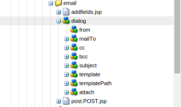

# 적응형 양식에 대한 사용자 지정 제출 작업 쓰기{#writing-custom-submit-action-for-adaptive-forms}

적응형 양식에서는 사용자가 지정한 데이터를 처리하기 위해 제출 작업이 필요합니다. 제출 작업은 적응형 양식을 사용하여 제출하는 데이터에 대해 수행되는 작업을 결정합니다. Adobe Experience Manager(AEM)에는 다음이 포함됩니다 [OOTB 작업 제출](../../forms/using/configuring-submit-actions.md) 사용자가 제출한 데이터를 사용하여 수행할 수 있는 사용자 지정 작업을 보여 줍니다. 예를 들어 이메일 전송 또는 데이터 저장과 같은 작업을 수행할 수 있습니다.

## 제출 작업에 대한 워크플로우 {#workflow-for-a-submit-action}

순서도는 **[!UICONTROL 제출]** 적응형 양식의 단추. 첨부 파일 구성 요소의 파일이 서버에 업로드되고 양식 데이터는 업로드된 파일의 URL로 업데이트됩니다. 클라이언트 내에서 데이터는 JSON 형식으로 저장됩니다. 클라이언트는 지정된 데이터를 마사지 하고 XML 형식으로 반환하는 내부 서블릿에 Ajax 요청을 보냅니다. 클라이언트는 이 데이터를 작업 필드로 수집합니다. 양식 제출 작업을 통해 데이터를 최종 서블릿(안내서 제출 서블릿)에 제출합니다. 그런 다음 서블릿은 컨트롤을 Submit 작업에 전달합니다. 제출 작업은 요청을 다른 sling 리소스에 전달하거나 브라우저를 다른 URL로 리디렉션할 수 있습니다.


### XML 데이터 형식 {#xml-data-format}

XML 데이터는 **`jcr:data`** 요청 매개 변수. 작업을 제출하면 매개 변수에 액세스하여 데이터를 처리할 수 있습니다. 다음 코드는 XML 데이터의 형식을 설명합니다. 양식 모델에 바인딩된 필드가 **`afBoundData`** 섹션을 참조하십시오. 바인딩되지 않은 필드는 `afUnoundData`섹션을 참조하십시오. 의 형식에 대한 자세한 내용은 `data.xml` 파일, [적응형 양식 필드 미리 채우기 소개](../../forms/using/prepopulate-adaptive-form-fields.md).

```xml
<?xml ?>
<afData>
<afUnboundData>
<data>
<field1>value</field2>
<repeatablePanel>
    <field2>value</field2>
</repeatablePanel>
<repeatablePanel>
    <field2>value</field2>
</repeatablePanel>
</data>
</afUnboundData>
<afBoundData>
<!-- xml corresponding to the Form Model /XML Schema -->
</afBoundData>
</afData>
```

### 작업 필드 {#action-fields}

제출 작업은 HTML을 사용하여 숨겨진 입력 필드를 추가할 수 있습니다 [입력](https://developer.mozilla.org/en-US/docs/Web/HTML/Element/Input) 태그)를 클릭하여 렌더링된 양식 HTML에 추가할 수 있습니다. 이러한 숨김 필드에는 양식 제출을 처리하는 동안 필요한 값이 포함될 수 있습니다. 양식을 제출할 때 이러한 필드 값은 제출 처리 중에 사용할 수 있는 요청 매개 변수로서 다시 게시됩니다. 입력 필드를 작업 필드라고 합니다.

예를 들어 양식을 채우는 데 걸린 시간도 캡처하는 제출 작업에서는 숨겨진 입력 필드를 추가할 수 있습니다 `startTime` 및 `endTime`.

스크립트는 `startTime` 및 `endTime` 양식이 렌더링될 때와 양식 제출 전에 각각 필드를 작성합니다. 제출 ActionScript `post.jsp` 그런 다음 요청 매개 변수를 사용하여 이러한 필드에 액세스하고 양식을 채우는 데 필요한 총 시간을 계산할 수 있습니다.

### 파일 첨부 파일 {#file-attachments}

첨부 파일 구성 요소를 사용하여 업로드하는 첨부 파일을 사용하여 작업을 제출할 수도 있습니다. 제출 작업 스크립트는 sling을 사용하여 이러한 파일에 액세스할 수 있습니다 [RequestParameter API](https://sling.apache.org/apidocs/sling5/org/apache/sling/api/request/RequestParameter.html). 다음 [isFormField](https://sling.apache.org/apidocs/sling5/org/apache/sling/api/request/RequestParameter.html#isFormField()) api의 메서드는 요청 매개 변수가 파일인지 양식 필드인지를 식별하는 데 도움이 됩니다. 제출 작업에서 요청 매개 변수를 반복하여 파일 첨부 매개 변수를 식별할 수 있습니다.

다음 샘플 코드는 요청에서 첨부 파일을 식별합니다. 그런 다음 를 사용하여 데이터를 파일에 읽습니다. [API 가져오기](https://sling.apache.org/apidocs/sling5/org/apache/sling/api/request/RequestParameter.html#get()). 마지막으로 데이터를 사용하여 Document 객체를 만들어 목록에 추가합니다.

```java
RequestParameterMap requestParameterMap = slingRequest.getRequestParameterMap();
for (Map.Entry<String, RequestParameter[]> param : requestParameterMap.entrySet()) {
    RequestParameter rpm = param.getValue()[0];
    if(!rpm.isFormField()) {
        fileAttachments.add(new Document(rpm.get()));
    }
}
```

### 전달 경로 및 리디렉션 URL {#forward-path-and-redirect-url}

필요한 작업을 수행한 후 Submit 서블릿은 요청을 전달 경로에 전달합니다. 작업은 setForwardPath API를 사용하여 Guide Submit 서블릿에 전달 경로를 설정합니다.

작업에서 전달 경로를 제공하지 않으면 제출 서블릿은 리디렉션 URL을 사용하여 브라우저를 리디렉션합니다. 작성자는 적응형 양식 편집 대화 상자에서 감사 인사 페이지 구성을 사용하여 리디렉션 URL을 구성합니다. Submit 작업 또는 Guide Submit 서블릿의 setRedirectUrl API를 통해 리디렉션 URL을 구성할 수도 있습니다. 안내서 제출 서블릿에서 setRedirectParameters API를 사용하여 리디렉션 URL에 전송되는 요청 매개 변수를 구성할 수도 있습니다.

>[!NOTE]
>
>작성자가 리디렉션 URL(감사 페이지 구성 사용)을 제공합니다. [OOTB 제출 작업](../../forms/using/configuring-submit-actions.md) 리디렉션 URL 을 사용하여 전달 경로가 참조하는 리소스에서 브라우저를 리디렉션합니다.
>
>요청을 리소스 또는 서블릿에 전달하는 사용자 지정 제출 작업을 작성할 수 있습니다. Adobe은 전달 경로에 대해 리소스 처리를 수행하는 스크립트가 처리가 완료되면 요청을 리디렉션 URL로 리디렉션하는 것을 권장합니다.

## 제출 액션 {#submit-action}

제출 작업은 다음을 포함하는 sling:Folder입니다.

* **addfields.jsp**: 이 스크립트는 변환 중에 HTML 파일에 추가되는 작업 필드를 제공합니다. 이 스크립트를 사용하여 post.POST.jsp 스크립트에서 전송하는 동안 필요한 숨겨진 입력 매개 변수를 추가합니다.
* **dialog.xml**: 이 스크립트는 CQ 구성 요소 대화 상자와 유사합니다. 작성자가 사용자 지정하는 구성 정보를 제공합니다. 제출 작업을 선택하면 적응형 양식 편집 대화 상자의 제출 작업 탭에 필드가 표시됩니다.
* **post.POST.jsp**: 제출 서블릿은 제출한 데이터와 이전 섹션의 추가 데이터를 사용하여 이 스크립트를 호출합니다. 이 페이지에서 작업을 실행하는 것에 대한 언급은 post.POST.jsp 스크립트를 실행하는 것을 의미합니다. 적응형 양식 편집 대화 상자에 표시할 적응형 양식에 제출 작업을 등록하려면 이러한 속성을 sling에 추가합니다:Folder:

   * **guideComponentType** 유형 및 값 **fd/af/components/guidesubmittype**
   * **guideDataModel** Submit 작업을 적용할 수 있는 적응형 양식의 유형을 지정하는 문자열 유형 **xfa** 은 XFA 기반 적응형 양식에 대해 지원되는 반면 **xsd** 은 XSD 기반 적응형 양식에 대해 지원됩니다. **기본** XDP 또는 XSD를 사용하지 않는 적응형 양식에 대해 가 지원됩니다. 여러 유형의 적응형 양식에 작업을 표시하려면 해당 문자열을 추가합니다. 각 문자열을 쉼표로 구분합니다. 예를 들어 XFA 및 XSD 기반 적응형 양식에 작업을 표시하려면 값을 지정합니다 **xfa** 및 **xsd** 각각 사용할 수 있습니다.

   * **jcr:description** 유형 String. 이 속성의 값은 적응형 양식 편집 대화 상자의 작업 제출 탭에 있는 제출 작업 목록에 표시됩니다. OOTB 작업은 CRX 저장소의 위치에 있습니다 **/libs/fd/af/components/guidesubmittype**.

## 사용자 지정 제출 작업 만들기 {#creating-a-custom-submit-action}

다음 단계를 수행하여 CRX 저장소에 데이터를 저장한 다음 이메일을 보내는 사용자 지정 제출 작업을 만듭니다. 적응형 양식에는 CRX 저장소에 데이터를 저장하는 OOTB 제출 작업 저장소 컨텐츠(더 이상 사용되지 않음)가 포함되어 있습니다. 또한 CQ에서는 [메일](https://experienceleague.adobe.com/docs/experience-manager-release-information/aem-release-updates/previous-updates/aem-previous-versions.html?lang=ko-KR) 이메일을 전송하는 데 사용할 수 있는 API입니다. Mail API를 사용하기 전에 [구성](https://experienceleague.adobe.com/docs/experience-manager-release-information/aem-release-updates/previous-updates/aem-previous-versions.html?lang=ko-KR&amp;wcmmode=disabled) 시스템 콘솔을 통한 일 CQ 메일 서비스. 컨텐츠 저장(더 이상 사용되지 않음) 작업을 다시 사용하여 데이터를 저장소에 저장할 수 있습니다. 컨텐츠 저장(더 이상 사용되지 않음) 작업은 CRX 저장소의 /libs/fd/af/components/guidesubmittype/store 위치에서 사용할 수 있습니다.

1. URL https://에서 CRXDE Lite에 로그인합니다.&lt;server>:&lt;port>/crx/de/index.jsp /apps/custom_submit_action 폴더에 sling:Folder 및 name store_and_mail 속성을 사용하여 노드를 만듭니다. custom_submit_action 폴더가 아직 없는 경우 만듭니다.

   

1. **필수 구성 필드를 제공합니다.**

   저장 작업에 필요한 구성을 추가합니다. 를 복사합니다. **cq:dialog** /libs/fd/af/components/guidesubmittype/store에서 /apps/custom_submit_action/store_and_email의 작업 폴더로 저장 작업의 노드입니다.

   

1. **작성자에게 이메일 구성을 묻는 메시지를 표시하는 구성 필드를 제공합니다.**

   적응형 양식은 사용자에게 이메일을 보내는 이메일 작업도 제공합니다. 요구 사항에 따라 이 작업을 사용자 지정합니다. /libs/fd/af/components/guidesubmittype/email/dialog로 이동합니다. cq:dialog 노드 내의 노드를 제출 작업의 cq:dialog 노드(/apps/custom_submit_action/store_and_email/dialog)에 복사합니다.

   

1. **해당 작업을 적응형 양식 편집 대화 상자에서 사용할 수 있도록 합니다.**

   store_and_email 노드에 다음 속성을 추가합니다.

   * **guideComponentType** 유형 **문자열** 및 값 **fd/af/components/guidesubmittype**

   * **guideDataModel** 유형 **문자열** 및 값 **xfa, xsd, 기본**

   * **jcr:description** 유형 **문자열** 및 값 **저장 및 이메일 작업**

1. 적응형 양식을 엽니다. 을(를) 클릭합니다. **편집** 다음 단추 **시작** 열다 **편집** 적응형 양식 컨테이너의 대화 상자. 새 작업은 **작업 제출** 탭. 선택 **저장 및 이메일 작업** 대화 상자 노드에 추가된 구성을 표시합니다.

   

1. **작업을 사용하여 작업을 완료합니다.**

   post.POST.jsp 스크립트를 작업에 추가합니다. (/apps/custom_submit_action/store_and_mail/).

   OOTB 저장소 작업(post.POST.jsp 스크립트)을 실행합니다. 를 사용하십시오 [FormsHelper.runAction](https://experienceleague.adobe.com/docs/experience-manager-release-information/aem-release-updates/previous-updates/aem-previous-versions.html?lang=ko-KR)(java.lang.String, java.lang.String, org.apache.sling.api.resource.Resource, org.apache.sling.api.SlingHttpServletRequest, org.apache.sling.api.SlingHttpServletResponse) CQ가 코드에 제공하는 Store 작업을 실행하는 API입니다. JSP 파일에 다음 코드를 추가합니다.

   `FormsHelper.runAction("/libs/fd/af/components/guidesubmittype/store", "post", resource, slingRequest, slingResponse);`

   이메일을 보내려면 코드에서 구성에서 수신자의 이메일 주소를 읽습니다. 작업 스크립트에서 구성 값을 가져오려면 다음 코드를 사용하여 현재 리소스의 속성을 읽습니다. 마찬가지로 다른 구성 파일을 읽을 수 있습니다.

   `ValueMap properties = ResourceUtil.getValueMap(resource);`

   `String mailTo = properties.get("mailTo");`

   마지막으로 CQ Mail API를 사용하여 이메일을 보냅니다. 를 사용하십시오 [SimpleEmail](https://commons.apache.org/proper/commons-email/apidocs/org/apache/commons/mail/SimpleEmail.html) 아래 표시된 대로 이메일 개체를 만드는 클래스입니다.

   >[!NOTE]
   >
   >JSP 파일의 이름이 post.POST.jsp인지 확인합니다.

   ```java
   <%@include file="/libs/fd/af/components/guidesglobal.jsp" %>
   <%@page import="com.day.cq.wcm.foundation.forms.FormsHelper,
          org.apache.sling.api.resource.ResourceUtil,
          org.apache.sling.api.resource.ValueMap,
                   com.day.cq.mailer.MessageGatewayService,
     com.day.cq.mailer.MessageGateway,
     org.apache.commons.mail.Email,
                   org.apache.commons.mail.SimpleEmail" %>
   <%@taglib prefix="sling"
                   uri="https://sling.apache.org/taglibs/sling/1.0" %>
   <%@taglib prefix="cq"
                   uri="https://www.day.com/taglibs/cq/1.0"
   %>
   <cq:defineObjects/>
   <sling:defineObjects/>
   <%
           String storeContent =
                       "/libs/fd/af/components/guidesubmittype/store";
           FormsHelper.runAction(storeContent, "post", resource,
                                   slingRequest, slingResponse);
    ValueMap props = ResourceUtil.getValueMap(resource);
    Email email = new SimpleEmail();
    String[] mailTo = props.get("mailto", new String[0]);
    email.setFrom((String)props.get("from"));
           for (String toAddr : mailTo) {
               email.addTo(toAddr);
      }
    email.setMsg((String)props.get("template"));
    email.setSubject((String)props.get("subject"));
    MessageGatewayService messageGatewayService =
                       sling.getService(MessageGatewayService.class);
    MessageGateway messageGateway =
                   messageGatewayService.getGateway(SimpleEmail.class);
    messageGateway.send(email);
   %>
   ```

   적응형 양식에서 작업을 선택합니다. 작업은 이메일을 전송하고 데이터를 저장합니다.
