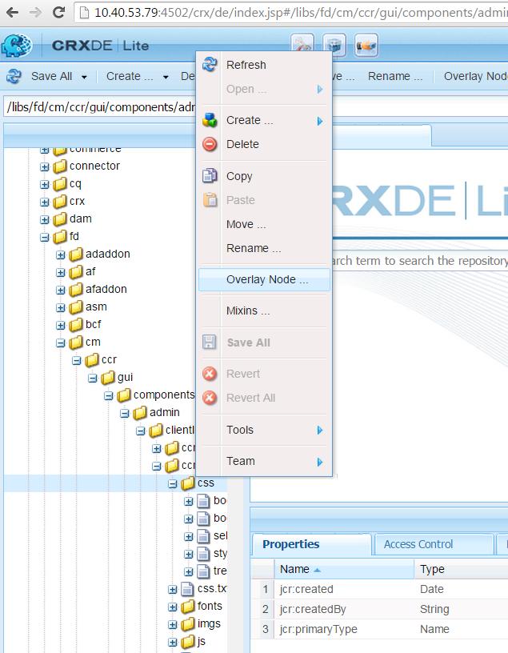

# 서신 만들기 UI 맞춤화{#customize-create-correspondence-ui}

## 개요 {#overview}

서신 관리를 사용하면 솔루션 템플릿을 다시 브랜딩하여 브랜드 가치를 높이고 조직의 브랜딩 표준을 준수할 수 있습니다. 사용자 인터페이스를 리브랜딩하면 서신 만들기 UI의 왼쪽 상단에 표시되는 조직 로고 변경이 포함됩니다.

서신 만들기 UI에서 로고를 조직의 로고와 함께 변경할 수 있습니다.


서신 만들기 UI의 사용자 지정 아이콘

### 서신 만들기 UI에서 로고 변경 {#changing-the-logo-in-the-create-correspondence-ui}

선택한 로고 이미지를 설정하려면 다음 작업을 수행하십시오.

1. 적절한 항목 만들기 [crx의 폴더 구조](#creatingfolderstructure).
1. [새 로고 파일 업로드](#uploadlogo) CRX에서 생성한 폴더의 URL을 덮어씁니다.

1. [CSS 설정](#createcss) crx에서 새 로고를 참조합니다.
1. 브라우저 기록 지우기 및 [서신 만들기 UI 새로 고침](#refreshccrui).

## 필요한 폴더 구조 만들기 {#creatingfolderstructure}

사용자 정의 로고 이미지와 스타일시트를 호스팅하려면 아래 설명된 대로 폴더 구조를 만듭니다. 루트 폴더 /apps가 있는 새 폴더 구조는 /libs 폴더 구조와 유사합니다.

사용자 지정의 경우 /apps 분기에 아래 설명된 대로 병렬 폴더 구조를 만듭니다.

다음 `/apps` 분기(폴더 구조):

* 시스템에 업데이트가 있는 경우 파일이 안전한지 확인합니다. 업그레이드, 기능 팩 또는 핫픽스가 있는 경우 `/libs` 분기가 업데이트되고에서 변경 사항을 호스트하는 경우 `/libs` 분기, 덮어쓰여집니다.
* 사용자 지정 파일을 저장하기 위해 기본 위치를 사용하는 경우 실수로 해결할 수 있는 현재 시스템/분기를 방해하지 않도록 도와줍니다.
* AEM이 리소스를 검색할 때 리소스의 우선 순위가 높아지도록 지원합니다. AEM이 다음을 검색하도록 구성되었습니다. `/apps` 먼저 분기한 다음 `/libs` 분기 를 클릭하여 리소스를 찾습니다. 이 메커니즘은 시스템이 오버레이(및 여기에 정의된 사용자 정의)를 사용함을 의미합니다.

다음 단계에 따라 필요한 폴더 구조를 `/apps` 분기:

1. 다음으로 이동 `https://'[server]:[port]'/[ContextPath]/crx/de` 관리자로 로그인합니다.
1. 앱 폴더에서 이라는 폴더를 만듭니다. `css` (ccrui 폴더의) css 폴더와 유사한 경로/구조를 사용합니다.

   css 폴더를 만드는 단계:

   1. 마우스 오른쪽 단추 클릭 **css** 다음 경로에 있는 폴더를 선택하고 **오버레이 노드**: `/libs/fd/cm/ccr/gui/components/admin/clientlibs/ccrui/css`

      

   1. 오버레이 노드 대화 상자에 다음 값이 있는지 확인합니다.

      **경로:** `/libs/fd/cm/ccr/gui/components/admin/clientlibs/ccrui/css`

      **오버레이 위치:** `/apps/`

      **노드 유형 일치:** 선택됨

      

      >[!NOTE]
      >
      >을(를) 변경하지 마십시오 `/libs` 분기입니다. 이 분기는 다음과 같은 모든 변경 사항에 영향을 받기 때문에 변경한 사항이 손실될 수 있습니다.
      >
      >    
      >    
      >    * 인스턴스에서 업그레이드
      >    * 핫픽스 적용
      >    * 기능 팩 설치
      >    
      >

   1. **확인**&#x200B;을 클릭합니다. 지정된 경로에 css 폴더가 만들어집니다.

1. 앱 폴더에서 이라는 폴더를 만듭니다. `imgs` 와 유사한 경로/구조 `imgs` 폴더(ccrui 폴더).

   1. 마우스 오른쪽 단추 클릭 **imgs** 다음 경로에 있는 폴더를 선택하고 **오버레이 노드**: `/libs/fd/cm/ccr/gui/components/admin/clientlibs/ccrui/imgs`
   1. 오버레이 노드 대화 상자에 다음 값이 있는지 확인합니다.

      **경로:** /libs/fd/cm/ccr/gui/components/admin/clientlibs/ccrui/imgs

      **오버레이 위치:** /apps/

      **노드 유형 일치:** 선택됨

   1. **확인**&#x200B;을 클릭합니다.

      >[!NOTE]
      >
      >/apps 폴더에 폴더 구조를 수동으로 만들 수도 있습니다.

1. 클릭 **모두 저장** 변경 사항을 서버에 저장합니다.

## CRX에 새 로고 업로드 {#uploadlogo}

사용자 지정 로고 파일을 CRX에 업로드합니다. 표준 HTML 규칙은 로고 렌더링을 제어합니다. 지원되는 이미지 파일 형식은 AEM Forms에 액세스하는 데 사용하는 브라우저에 따라 다릅니다. 모든 브라우저는 JPEG, GIF 및 PNG를 지원합니다. 자세한 내용은 지원되는 이미지 형식에 대한 브라우저별 설명서를 참조하십시오.

* 로고 이미지의 기본 치수는 48픽셀입니다 &#42; 48픽셀. 이미지가 이 크기와 유사한지 또는 48픽셀보다 큰지 확인하십시오 &#42; 48픽셀.
* 로고 이미지의 높이가 50px를 초과하는 경우, 서신 만들기 사용자 인터페이스는 이 머리글의 높이이므로 이미지를 최대 50px 높이까지 축소합니다. 이미지 크기를 축소하는 동안 응답 만들기 사용자 인터페이스는 이미지의 종횡비를 유지합니다.
* 응답 만들기 사용자 인터페이스는 작은 경우 이미지의 크기를 조절하지 않으므로 명확하게 하기 위해 높이 48px 이상의 로고 이미지를 사용해야 합니다.

다음 단계를 사용하여 사용자 지정 로고 파일을 CRX에 업로드합니다.

1. `https://'[server]:[port]'/[contextpath]/crx/de`로 이동합니다. 필요한 경우 관리자로 로그인합니다.
1. CRXDE에서 **imgs** 다음 경로에 있는 폴더를 선택하고 **만들기 > 파일 만들기**:

   `/apps/fd/cm/ccr/gui/components/admin/clientlibs/ccrui/imgs/`

   

1. 파일 만들기 대화 상자에서 파일 이름을 CustomLogo.png(또는 로고 파일 이름)로 입력합니다.

   

1. **모두 저장**&#x200B;을 클릭합니다.

   만든 새 파일(여기서는 CustomLogo.png) 아래에 jcr:content 속성이 나타납니다.

1. 폴더 구조에서 jcr:content 를 클릭합니다.

   jcr:content의 속성이 나타납니다.

   

1. 를 두 번 클릭합니다. **jcr:data** 속성.

   jcr:data 편집 대화 상자가 나타납니다.

   이제 newlogo.png 폴더를 클릭한 다음 jcr:content(dim 옵션)를 두 번 클릭하고 nt:resource 유형을 설정합니다. 속성이 없으면 jcr:content라는 이름의 속성을 만듭니다.

1. jcr:data 편집 대화 상자에서 **찾아보기** 로고로 사용할 이미지 파일을 선택합니다(여기서 CustomLogo.png).

   지원되는 이미지 파일 형식은 AEM Forms에 액세스하는 데 사용하는 브라우저에 따라 다릅니다. 모든 브라우저는 JPEG, GIF 및 PNG를 지원합니다. 자세한 내용은 지원되는 이미지 형식에 대한 브라우저별 설명서를 참조하십시오.

   

   예: 사용자 정의 로고로 사용할 CustomLogo.png

1. **모두 저장**&#x200B;을 클릭합니다.

## UI로 로고를 렌더링하기 위한 CSS 만들기 {#createcss}

사용자 지정 로고 이미지를 사용하려면 컨텐츠 컨텍스트에 추가 스타일 시트를 로드해야 합니다.

다음 단계를 사용하여 UI로 로고를 렌더링하기 위한 스타일 시트를 만듭니다.

1. `https://'[server]:[port]'/[contextpath]/crx/de`로 이동합니다. 필요한 경우 관리자로 로그인합니다.
1. 다음 위치에 customcss.css라는 파일(다른 파일 이름을 사용할 수 없음)을 만듭니다.

   `/apps/fd/cm/ccr/gui/components/admin/clientlibs/ccrui/css/`

   customcss.css 파일을 만드는 단계:

   1. 마우스 오른쪽 단추 클릭 **css** 폴더 및 선택 **만들기 > 파일 만들기**.
   1. 새 파일 대화 상자에서 CSS 이름을 로 지정합니다. `customcss.css`(다른 파일 이름을 사용할 수 없음) **확인**.
   1. 새로 만든 css 파일에 다음 코드를 추가합니다. 코드의 content:url에서 CRXDE의 imgs 폴더에 업로드한 이미지 이름을 지정합니다.

      ```css
      .logo, .logo:after {
      content:url("../imgs/CustomLogo.png");
      }
      ```

   1. **모두 저장**&#x200B;을 클릭합니다.

## 사용자 정의 로고를 볼 수 있도록 서신 만들기 UI를 새로 고칩니다. {#refreshccrui}

브라우저 캐시를 지운 다음, 사용자 지정 로고를 볼 수 있도록 브라우저에서 서신 UI 만들기 인스턴스를 엽니다.


서신 만들기 UI의 사용자 지정 아이콘
