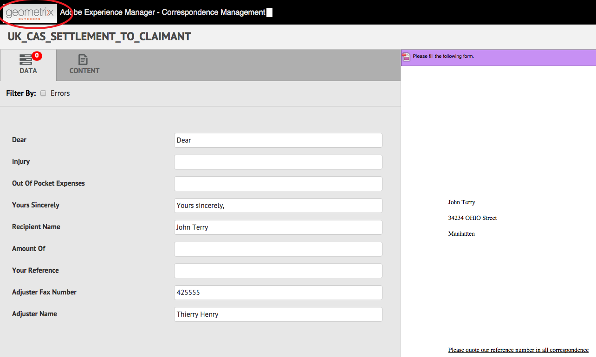

# 서신 UI 만들기{#customize-create-correspondence-ui} 사용자 지정

## 개요 {#overview}

서신 관리를 사용하면 솔루션 템플릿을 재브랜딩하여 더 나은 브랜드 가치를 제공하고 조직의 브랜딩 표준을 준수할 수 있습니다. 사용자 인터페이스를 다시 브랜딩하면 서신 UI 만들기의 왼쪽 위 모서리에 표시되는 조직 로고를 변경할 수 있습니다.

서신 UI 작성에서 조직의 로고로 로고를 변경할 수 있습니다.


서신 UI 만들기의 사용자 지정 아이콘

### 서신 만들기 UI {#changing-the-logo-in-the-create-correspondence-ui}에서 로고 변경

원하는 로고 이미지를 설정하려면 다음을 수행하십시오.

1. CRX](#creatingfolderstructure)에서 적절한 [폴더 구조를 만듭니다.
1. [CRX에서 ](#uploadlogo) 만든 폴더에 새 로고 파일을 업로드합니다.

1. [새 ](#createcss) 로고를 참조하도록 CRX에 CSS를 설정합니다.
1. 브라우저 기록을 지우고 [서신 만들기 UI](#refreshccrui)를 새로 고칩니다.

## 필요한 폴더 구조 만들기 {#creatingfolderstructure}

사용자 정의 로고 이미지 및 스타일시트를 호스팅하기 위해 아래 설명된 대로 폴더 구조를 만듭니다. 루트 폴더 /apps 가 있는 새 폴더 구조는 /libs 폴더의 구조와 유사합니다.

사용자 지정을 위해 /apps 분기에서 아래에 설명된 대로 병렬 폴더 구조를 만듭니다.

/apps 분기(폴더 구조):

* 시스템을 업데이트하는 경우 파일이 안전한지 확인합니다. 업그레이드, 기능 팩 또는 핫픽스의 경우 /libs 분기가 업데이트되고 /libs 분기에서 변경 내용을 호스팅하면 해당 분기가 덮어쓰여집니다.
* 현재 시스템/분기를 방해하지 않도록 도와줍니다. 이 분기는 사용자 정의 파일을 저장하는 기본 위치를 사용하는 경우 실수로 해결 취소할 수 있습니다.
* AEM에서 리소스를 검색할 때 리소스의 우선 순위가 더 높습니다. AEM은 /apps 분기를 먼저 검색한 다음 /libs 분기를 사용하여 리소스를 찾도록 구성되어 있습니다. 이 메커니즘은 시스템이 오버레이(및 여기에 정의된 사용자 지정)를 사용함을 의미합니다.

다음 단계를 사용하여 /apps 분기에서 필요한 폴더 구조를 만듭니다.

1. `https://'[server]:[port]'/[ContextPath]/crx/de`(으)로 이동하여 관리자로 로그인합니다.
1. apps 폴더에서 css 폴더(ccrui 폴더에 있음)와 유사한 경로/구조를 사용하여 `css`라는 폴더를 만듭니다.

   css 폴더를 만드는 단계:

   1. 다음 경로에서 **css** 폴더를 마우스 오른쪽 단추로 클릭하고 **오버레이 노드**&#x200B;를 선택합니다.`/libs/fd/cm/ccr/gui/components/admin/clientlibs/ccrui/css`

      

   1. 오버레이 노드 대화 상자에 다음 값이 있는지 확인합니다.

      **경로:** /libs/fd/cm/ccr/gui/components/admin/clientlibs/crui/css

      **오버레이 위치:** /apps/

      **일치 노드 유형:** 선택됨

      

      >[!NOTE]
      >
      >/libs 분기에서 변경하지 마십시오. 이 분기는 사용자가 변경할 때마다 변경되므로 변경한 내용이 손실될 수 있습니다.
      >
      >    
      >    
      >    * 인스턴스에서 업그레이드
      >    * 핫픽스 적용
      >    * 기능 팩 설치


   1. **확인**&#x200B;을 클릭합니다. css 폴더가 지정된 경로에 생성됩니다.


1. apps 폴더에서 imgs 폴더(ccrui 폴더에 있음)와 유사한 경로/구조를 가진 `imgs` 폴더를 만듭니다.

   1. 다음 경로에서 **imgs** 폴더를 마우스 오른쪽 단추로 클릭하고 **오버레이 노드**&#x200B;를 선택합니다.`/libs/fd/cm/ccr/gui/components/admin/clientlibs/ccrui/imgs`
   1. 오버레이 노드 대화 상자에 다음 값이 있는지 확인합니다.

      **경로:** /libs/fd/cm/ccr/gui/components/admin/clientlibs/crui/imgs

      **오버레이 위치:** /apps/

      **일치 노드 유형:** 선택됨

   1. **확인**&#x200B;을 클릭합니다.

      >[!NOTE]
      >
      >/apps 폴더에 폴더 구조를 수동으로 만들 수도 있습니다.

1. **모두 저장** 을 클릭하여 서버에 변경 사항을 저장합니다.

## 새 로고를 CRX에 업로드합니다 {#uploadlogo}

사용자 지정 로고 파일을 CRX에 업로드합니다. 표준 HTML 규칙은 로고의 렌더링을 관리합니다. 지원되는 이미지 파일 형식은 AEM Forms에 액세스하는 데 사용하는 브라우저에 따라 다릅니다. 모든 브라우저는 JPEG, GIF 및 PNG를 지원합니다. 자세한 내용은 지원되는 이미지 형식에 대한 브라우저 전용 설명서를 참조하십시오.

* 로고 이미지의 기본 차원은 48px * 48px입니다. 이미지가 이 크기와 유사하거나 48px * 48px보다 커야 합니다.
* 로고 이미지 높이가 50px를 초과하는 경우 헤더의 높이로 이미지를 최대 높이 50px까지 확장하십시오. 이미지 크기를 축소하는 동안 서신 만들기 사용자 인터페이스는 이미지의 종횡비를 유지합니다.
* 서신 사용자 인터페이스 만들기는 이미지가 작은 경우 확대되지 않으므로 로고 이미지를 높이 48px 이상, 충분한 폭을 사용하여 명확성을 보장합니다.

다음 단계를 사용하여 사용자 지정 로고 파일을 CRX에 업로드합니다.

1. 이동 `https://'[server]:[port]'/[contextpath]/crx/de`. 필요한 경우 관리자로 로그인합니다.
1. CRXDE에서 다음 경로의 **imgs** 폴더를 마우스 오른쪽 단추로 클릭하고 **만들기 > 파일 만들기**&#x200B;를 선택합니다.

   `/apps/fd/cm/ccr/gui/components/admin/clientlibs/ccrui/imgs/`

   

1. 파일 만들기 대화 상자에서 파일 이름을 CustomLogo.png(또는 로고 파일의 이름)로 입력합니다.

   

1. **모두 저장**&#x200B;을 클릭합니다.

   만든 새 파일(여기서 CustomLogo.png) 아래에 jcr:content 속성이 나타납니다.

1. 폴더 구조에서 jcr:content 를 클릭합니다.

   jcr:content의 속성이 나타납니다.

   

1. **jcr:data** 속성을 두 번 클릭합니다.

   jcr:data 편집 대화 상자가 나타납니다.

   이제 newlogo.png 폴더를 클릭하고 jcr:content (dim option)를 두 번 클릭하고 nt:resource 유형을 설정하십시오. 이 없으면 jcr:content라는 이름의 속성을 만듭니다.

1. jcr:data 편집 대화 상자에서 **찾아보기**&#x200B;를 클릭하고 로고로 사용할 이미지 파일(여기서는 CustomLogo.png)을 선택합니다.

   지원되는 이미지 파일 형식은 AEM Forms에 액세스하는 데 사용하는 브라우저에 따라 다릅니다. 모든 브라우저는 JPEG, GIF 및 PNG를 지원합니다. 자세한 내용은 지원되는 이미지 형식에 대한 브라우저 전용 설명서를 참조하십시오.

   

   예:사용자 지정 로고로 사용할 CustomLogo.png

1. **모두 저장**&#x200B;을 클릭합니다.

## CSS를 만들어 로고와 UI 통합 {#createcss}

사용자 지정 로고 이미지에는 컨텐츠 컨텍스트에 추가 스타일 시트를 로드해야 합니다.

다음 단계를 사용하여 로고를 렌더링할 스타일 시트를 설정합니다.

1. 이동 `https://'[server]:[port]'/[contextpath]/crx/de`. 필요한 경우 관리자로 로그인합니다.
1. 다음 위치에서 customcss.css라는 파일(다른 파일 이름을 사용할 수 없음)을 만듭니다.

   `/apps/fd/cm/ccr/gui/components/admin/clientlibs/ccrui/css/`

   사용자 지정 css.css 파일을 만드는 절차:

   1. **css** 폴더를 마우스 오른쪽 단추로 클릭하고 **만들기 > 파일 만들기**&#x200B;를 선택합니다.
   1. 새 파일 대화 상자에서 CSS의 이름을 `customcss.css`(다른 파일 이름을 사용할 수 없음)로 지정하고 **확인**&#x200B;을 클릭합니다.
   1. 새로 만든 css 파일에 다음 코드를 추가합니다. content:url 코드에서 CRXDE의 imgs 폴더에 업로드한 이미지 이름을 지정합니다.

      ```css
      .logo, .logo:after {
      content:url("../imgs/CustomLogo.png");
      }
      ```

   1. **모두 저장**&#x200B;을 클릭합니다.

## 서신 만들기 UI를 새로 고쳐 사용자 지정 로고를 확인합니다 {#refreshccrui}

브라우저 캐시를 지우고 브라우저에서 서신 UI 만들기 인스턴스를 엽니다. 사용자 정의 로고가 표시됩니다.



서신 UI 만들기의 사용자 지정 아이콘
