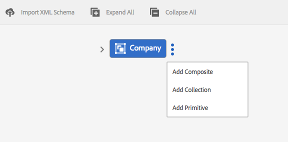

# 데이터 사전{#data-dictionary}

## 소개 {#introduction}

데이터 사전은 비즈니스 사용자가 기본 데이터 모델에 대한 기술적 세부 사항을 알지 않고도 백엔드 데이터 소스의 정보를 사용할 수 있도록 해줍니다. 데이터 사전은 데이터 사전 요소(DDE)로 구성됩니다. 이러한 데이터 요소를 사용하여 백엔드 데이터를 고객 커뮤니케이션에서 사용할 입력으로 문서에 통합합니다.

데이터 사전은 기본 데이터 구조 및 관련 특성을 설명하는 메타데이터의 독립적인 표현입니다. 데이터 사전은 비즈니스 용어를 사용하여 만들어집니다. 하나 이상의 기본 데이터 모델에 매핑할 수 있습니다.

데이터 사전은 다음 3가지 유형의 요소로 구성됩니다.단순, 합성 및 컬렉션 요소 단순 DDE는 도시 이름과 같은 정보를 포함하는 문자열, 숫자, 날짜 및 부울 값과 같은 프리미티브 요소입니다. 복합 DDE에는 프리미티브, 합성 또는 컬렉션 유형일 수 있는 다른 DDE가 포함되어 있습니다. 예를 들어 주소, 구/군/시, 도, 국가 및 우편 번호로 구성되는 주소. 컬렉션은 유사한 단순 또는 복합 DDE 목록입니다. 예를 들어, 여러 위치 또는 서로 다른 청구 및 배송 주소가 있는 고객.

Correspondence Management는 데이터 사전의 구조에 따라 저장된 백엔드, 고객 또는 수신자별 데이터를 사용하여 서로 다른 고객을 위한 메시지를 생성합니다. 예를 들어 &quot;친애하는 {First Name}&quot;,&quot;Mr.&quot;과 같은 친숙한 이름으로 문서를 만들 수 있습니다. {성}&quot;.

일반적으로 비즈니스 사용자는 XSD(XML 스키마) 및 Java 클래스와 같은 메타데이터 표현에 대한 지식이 필요하지 않습니다. 그러나 일반적으로 솔루션을 구축하려면 이러한 데이터 구조 및 속성에 액세스해야 합니다.

### 데이터 사전 작업 과정 {#data-dictionary-workflow}

1. 작성자 [는 스키마를 업로드하거나 처음부터 데이터 사전](#createdatadictionary)을 만듭니다.
1. 작성자는 데이터 사전을 기반으로 서신 및 대화형 커뮤니케이션을 만들고 필요한 경우 편지 및 대화형 통신에서 데이터 사전 요소를 연결합니다.
1. 작성자는 데이터 사전의 스키마를 기반으로 하는 샘플 데이터 XML 파일을 다운로드할 수 있습니다. 작성자는 데이터 사전과 테스트 데이터로 연결할 수 있는 샘플 데이터 XML 파일을 수정할 수 있습니다. 편지 미리 보기 중에 동일한 내용이 사용됩니다.
1. [편지](../../forms/using/create-letter.md#p-types-of-linkage-available-for-each-of-the-fields-p)를 미리 보는 동안 작성자는 데이터가 있는 문자를 미리 보기(사용자 정의 미리 보기)로 선택합니다. 작성자가 제공한 데이터로 미리 채워진 편지가 열립니다. 통신 만들기 인터페이스에서 열립니다. 이 편지를 미리 보고 있는 에이전트는 이 서신의 컨텐트, 데이터 및 첨부 파일을 수정할 수 있으며 최종 편지를 제출할 수 있습니다. 문자 만들기에 대한 자세한 내용은 [편지 만들기](../../forms/using/create-letter.md)를 참조하십시오.

## 전제 조건 {#prerequisite}

**Forms** 페이지에서 **데이터 사전** 옵션을 보려면 [호환성 패키지](compatibility-package.md)을 설치합니다.

## 데이터 사전 만들기 {#createdatadictionary}

데이터 사전 편집기를 사용하여 데이터 사전을 만들거나 XSD 스키마 파일을 업로드하여 데이터 사전을 만들 수 있습니다. 그런 다음 필드를 포함하여 필요한 정보를 더 추가하여 데이터 사전을 확장할 수 있습니다. 데이터 사전이 생성된 방식에 관계없이 비즈니스 프로세스 소유자는 백엔드 시스템에 대한 지식이 필요하지 않습니다. 비즈니스 프로세스 소유자는 해당 프로세스에 대해 도메인 개체에 대한 지식과 그 정의만 있으면 됩니다.

>[!NOTE]
>
>유사한 요소가 필요한 여러 글자의 경우 공통 데이터 사전을 만들 수 있습니다. 하지만 많은 수의 요소가 있는 빅데이터 사전은 데이터 사전을 사용하고 편지 및 문서 조각과 같은 요소를 로드하는 동안 성능 문제를 초래할 수 있습니다. 성능 문제가 발생하는 경우 문자별로 별도의 데이터 사전을 만들어 보십시오.

1. **Forms** > **데이터 사전**&#x200B;을 선택합니다.
1. **데이터 사전 만들기**&#x200B;를 누릅니다.
1. [속성] 화면에서 다음을 추가합니다.

   * **제목:** (선택 사항) 데이터 사전의 제목을 입력합니다. 제목에는 고유하지 않아야 하며 특수 문자와 영어 이외의 문자가 포함될 수 있습니다. 문자 및 기타 문서 조각은 축소판 및 자산 속성과 같이 해당 제목(사용 가능한 경우)으로 참조됩니다. 데이터 사전은 제목이 아니라 해당 이름으로 참조됩니다.
   * **이름:** 데이터 사전의 고유한 이름입니다. 이름 필드에 영어 문자, 숫자 및 하이픈만 입력할 수 있습니다. 이름 필드는 제목 필드를 기반으로 자동으로 채워지며 제목 필드에 입력한 특수 문자, 공백, 숫자 및 영어가 아닌 문자는 하이픈으로 바뀝니다. [제목] 필드의 값이 자동으로 [이름]에 복사되지만 값을 편집할 수 있습니다.

   * **설명**:(선택 사항) 데이터 사전의 설명입니다.
   * **태그:** (선택 사항) 사용자 정의 태그를 만들려면 텍스트 필드에 값을 입력하고 Enter 키를 누릅니다. 태그 텍스트 필드 아래에 태그가 표시됩니다. 이 텍스트를 저장하면 새로 추가된 태그도 생성됩니다.
   * **확장 속성**:(선택 사항)  **필드 추가** 를 눌러 데이터 사전의 메타데이터 속성을 지정합니다. 속성 이름 열에 고유한 속성 이름을 입력합니다. 값 열에서 속성과 연결할 값을 입력합니다.

   

1. (선택 사항) 데이터 사전에 대한 XSD 스키마 정의를 업로드하려면 데이터 사전 구조 창에서 **XML 스키마 업로드**&#x200B;를 탭합니다. XSD 파일을 찾아 선택한 다음 **열기**&#x200B;를 누릅니다. 데이터 사전은 업로드된 XML 스키마를 기반으로 생성됩니다. 데이터 사전의 요소 표시 이름과 설명을 수정해야 합니다. 이렇게 하려면 요소를 탭하여 요소 이름을 선택하고 오른쪽 창의 필드에 있는 설명, 표시 이름 및 기타 세부 사항을 편집합니다.

   계산된 DD 요소에 대한 자세한 내용은 [계산된 데이터 사전 요소](#computedddelements)를 참조하십시오.

   >[!NOTE]
   >
   >스키마 파일 업로드를 건너뛰고 사용자 인터페이스를 사용하여 데이터 사전을 처음부터 구축할 수 있습니다. 이렇게 하려면 이 단계를 건너뛰고 다음 단계를 계속 진행하십시오.

1. **다음**&#x200B;을 누릅니다.
1. 속성 추가 화면에서 데이터 사전에 요소를 추가합니다. 스키마를 업로드하여 데이터 사전의 기본 구조를 가져온 경우 요소를 추가/삭제하고 해당 세부 사항을 편집할 수도 있습니다.

   요소의 오른쪽에 있는 세 개의 점을 누르고 데이터 사전 구조에 요소를 추가할 수 있습니다.

   

   복합 요소, 수집 요소 또는 프리미티브 요소 중 하나를 선택합니다.

   * 복합 DDE에는 프리미티브, 합성 또는 컬렉션 유형일 수 있는 다른 DDE가 포함되어 있습니다. 예를 들어 주소, 구/군/시, 도, 국가 및 우편 번호로 구성되는 주소.
   * 프리미티브 DDE는 도시 이름과 같은 정보를 포함하는 문자열, 숫자, 날짜 및 부울 값과 같은 요소입니다.
   * 컬렉션은 유사한 단순 또는 복합 DDE 목록입니다. 예를 들어, 여러 위치 또는 서로 다른 청구 및 배송 주소가 있는 고객.

   다음은 데이터 사전을 만들기 위한 몇 가지 규칙입니다.

   * 데이터 사전에는 최상위 수준 DDE로 합성 유형만 사용할 수 있습니다.
   * 이름, 참조 이름 및 요소 유형은 데이터 사전 및 DDE에 대한 필수 필드입니다.
   * 참조 이름은 고유해야 합니다.
   * 부모 DDE(합성)는 같은 이름의 두 자식을 가질 수 없습니다.
   * 열거형에는 기본 문자열 유형만 포함됩니다.

   복합, 수집 및 프리미티브 요소 및 데이터 사전 요소 작업에 대한 자세한 내용은 [데이터 사전 요소를 XML 스키마](#mappingddetoschema)에 매핑을 참조하십시오.

   데이터 사전의 유효성 검사에 대한 자세한 내용은 [데이터 사전 편집기 유효성 검사](#ddvalidations)를 참조하십시오.

   

1. (선택 사항) 요소를 선택한 후 고급 탭에서 속성(속성)을 추가할 수 있습니다. **필드 추가**&#x200B;를 탭하고 DD 요소의 속성을 확장할 수도 있습니다.

   

1. (선택 사항) 요소의 오른쪽에 있는 세 개의 점을 탭하고 **삭제**&#x200B;를 선택하여 모든 요소를 제거할 수 있습니다.

   

   >[!NOTE]
   >
   >하위 노드가 있는 합성/컬렉션 요소를 삭제하면 하위 노드도 삭제됩니다.

1. (선택 사항) [데이터 사전 구조] 창과 [필드] 및 [변수 목록] 패널에서 요소를 선택합니다. 요소에 연결된 필수 속성을 변경하거나 추가합니다.
1. **저장**&#x200B;을 누릅니다.

### 하나 이상의 데이터 사전 {#create-copies-of-one-or-more-data-dictionary} 복사본 만들기

기존 데이터 사전과 유사한 속성 및 요소를 사용하여 하나 이상의 데이터 사전을 신속하게 만들려면 해당 사전을 복사하여 붙여넣을 수 있습니다.

1. 데이터 사전 목록에서 적절한 데이터 사전을 선택합니다. UI에 복사 아이콘이 표시됩니다.
1. 복사를 누릅니다. UI에 붙여넣기 아이콘이 표시됩니다.
1. 붙여넣기를 누릅니다. 붙여넣기 대화 상자가 나타납니다. 새 데이터 사전에 이름과 제목을 자동으로 할당합니다.
1. 필요한 경우 데이터 사전의 사본을 저장할 제목 및 이름을 편집합니다.
1. 붙여넣기를 누릅니다. 데이터 사전의 복사본이 만들어집니다. 이제 새로 만든 데이터 사전에서 필요한 사항을 변경할 수 있습니다.

## 데이터 사전 요소 {#see-the-document-fragments-or-documents-that-refer-to-a-data-dictionary-element}를 참조하는 문서 조각 또는 문서를 참조하십시오.

데이터 사전을 편집하거나 보는 동안 데이터 사전에서 텍스트, 조건, 문자 및 인터랙티브 커뮤니케이션을 지칭하는 요소를 확인할 수 있습니다.

1. 데이터 사전을 편집하려면 다음 중 하나를 수행합니다.

   * 데이터 사전 위로 마우스를 가져간 다음 편집을 누릅니다.
   * 데이터 사전을 선택한 다음 헤더에서 편집을 누릅니다.
   * 데이터 사전 위로 마우스를 가져간 다음 선택을 누릅니다. 그런 다음 헤더에서 편집을 누릅니다.

   또는 데이터 사전을 눌러 표시합니다.

1. 데이터 사전에서 간단한 요소를 눌러 선택합니다. 합성 및 컬렉션 요소에는 참조가 없습니다.

   요소의 [기본] 및 [고급] 속성과 함께 [대여 콘텐트]도 나타납니다.

1. 대여 컨텐츠를 누릅니다.

   대여 내용 탭이 다음과 같이 표시됩니다.문자, 조건, 문자 및 인터랙티브 커뮤니케이션 또한 각 머리글에는 선택한 요소에 대한 참조 수도 표시됩니다.

1. 요소를 참조하는 자산의 이름을 보려면 머리글을 누릅니다.

   

1. 다른 요소에 대한 대여된 내용을 보려면 요소를 누릅니다.
1. 요소를 참조하는 자산을 표시하려면 해당 이름을 누릅니다. 브라우저에 자산, 문자 또는 대화형 통신이 표시됩니다.

## 테스트 데이터 작업 {#working-with-test-data}

1. 데이터 사전 페이지에서 **선택**&#x200B;을 탭합니다.
1. 테스트 데이터를 다운로드할 데이터 사전을 누른 다음 **샘플 XML 데이터 다운로드**&#x200B;를 누릅니다.
1. 경고 메시지에서 **OK**&#x200B;을 누릅니다. XML 파일이 다운로드됩니다.
1. 메모장 또는 다른 XML 편집기를 사용하여 XML 파일을 엽니다. XML 파일은 요소의 데이터 사전 및 자리 표시자 문자열과 동일한 구조를 갖습니다. 자리 표시자 문자열을 문자를 테스트할 데이터로 바꿉니다.

   ```xml
   <?xml version="1.0" encoding="UTF-8" standalone="no"?>
   <Company>
   <Name>string</Name>
   <Type>string</Type>
   <HeadOfficeAddress>
   <Street>string</Street>
   <City>string</City>
   <State>string</State>
   <Zip>string</Zip>
   </HeadOfficeAddress>
   <SalesOfficeAddress>
   <Street>string</Street>
   <City>string</City>
   <State>string</State>
   <Zip>string</Zip>
   </SalesOfficeAddress>
   <HeadCount>1.0</HeadCount>
   <CEO>
   <PersonName>
   <FirstName>string</FirstName>
   <MiddleName>string</MiddleName>
   <LastName>string</LastName>
   </PersonName>
   <DOB>string</DOB>
   <CurrAddress>
   <Street>string</Street>
   <City>string</City>
   <State>string</State>
   <Zip>string</Zip>
   </CurrAddress>
   <DOJ>14-04-1973</DOJ>
   <Phone>1.0</Phone>
   </CEO>
   </Company>
   ```

   >[!NOTE]
   >
   >이 예제에서 XML은 컬렉션 요소에 대해 세 개의 값 공간을 만들지만 요구 사항에 따라 값 수를 늘리거나 줄일 수 있습니다.

1. 데이터 항목을 만든 후 테스트 데이터가 포함된 문자를 미리 볼 때 이 XML 파일을 사용할 수 있습니다.

   DD를 사용하여 이 테스트 데이터를 추가할 수 있습니다(추가 선택 및 테스트 데이터 업로드를 탭하고 이 xml 파일 업로드).
이렇게 하면 사용자 정의가 아닌 일반 문자를 미리 볼 때 이 XML 데이터가 문자로 사용됩니다. 사용자 지정을 누른 다음 이 XML을 업로드할 수도 있습니다.

## 샘플 {#samples}

다음 코드 샘플은 데이터 사전에 대한 구현 세부 사항을 보여줍니다.

### 데이터 사전 {#sample-schema-that-can-be-uploaded-to-the-data-dictionary}에 업로드할 수 있는 샘플 스키마

```xml
<?xml version="1.0" encoding="utf-8"?>
<xs:schema xmlns="DCT" targetNamespace="DCT" xmlns:xs="https://www.w3.org/2001/XMLSchema"
  elementFormDefault="qualified" attributeFormDefault="unqualified">
  <xs:element name="Company">
    <xs:complexType>
      <xs:sequence>
        <xs:element name="Name" type="xs:string"/>
        <xs:element name="Type" type="xs:anySimpleType"/>
        <xs:element name="HeadOfficeAddress" type="Address"/>
        <xs:element name="SalesOfficeAddress" type="Address" minOccurs="0"/>
        <xs:element name="HeadCount" type="xs:integer"/>
        <xs:element name="CEO" type="Employee"/>
        <xs:element name="Workers" type="Employee" maxOccurs="unbounded"/>
      </xs:sequence>
    </xs:complexType>
  </xs:element>
  <xs:complexType name="Employee">
    <xs:complexContent>
      <xs:extension  base="Person">
        <xs:sequence>
          <xs:element name="CurrAddress" type="Address"/>
          <xs:element name="DOJ" type="xs:date"/>
          <xs:element name="Phone" type="xs:integer"/>
        </xs:sequence>
      </xs:extension>
    </xs:complexContent>
  </xs:complexType>
  <xs:complexType name="Person">
    <xs:sequence>
      <xs:element name="PersonName" type="Name"/>
      <xs:element name="DOB" type="xs:dateTime"/>
    </xs:sequence>
  </xs:complexType>
  <xs:complexType name="Name">
    <xs:sequence>
      <xs:element name="FirstName" type="xs:string"/>
      <xs:element name="MiddleName" type="xs:string"/>
      <xs:element name="LastName" type="xs:string"/>
    </xs:sequence>
  </xs:complexType>
  <xs:complexType name="Address">
    <xs:sequence>
      <xs:element name="Street" type="xs:string"/>
      <xs:element name="City" type="xs:string"/>
      <xs:element name="State" type="xs:string"/>
      <xs:element name="Zip" type="xs:string"/>
    </xs:sequence>
  </xs:complexType>
</xs:schema>
```

## DDE {#common-attributes-associated-with-a-dde}에 연결된 공통 속성

다음 표에서는 DDE와 연관된 공통 속성에 대해 자세히 설명합니다.

<table>
 <tbody>
  <tr>
   <td><strong>특성</strong></td>
   <td><strong>유형</strong></td>
   <td><strong>설명</strong></td>
  </tr>
  <tr>
   <td>이름</td>
   <td>문자열</td>
   <td>필수.<br /> DDE의 이름입니다. 이 작업은 고유해야 합니다.</td>
  </tr>
  <tr>
   <td>참조<br /> 이름</td>
   <td>문자열</td>
   <td>필수. 데이터 사전의 계층 또는 구조 변경과 독립적인 DDE에 대한 참조를 허용하는 DDE의 고유 참조 이름입니다. 텍스트 모듈은 이 이름을 사용하여 매핑됩니다.</td>
  </tr>
  <tr>
   <td>displayname</td>
   <td>문자열</td>
   <td>DDE의 사용자 친화적인 이름(선택 사항).</td>
  </tr>
  <tr>
   <td>설명</td>
   <td>문자열</td>
   <td>DDE에 대한 설명입니다.</td>
  </tr>
  <tr>
   <td>elementType</td>
   <td>문자열</td>
   <td>필수. DDE 유형:문자열, 숫자, 날짜, 부울, 합성, 컬렉션.</td>
  </tr>
  <tr>
   <td>elementSubType</td>
   <td>문자열</td>
   <td>DDE의 하위 유형:열거형. STRING 및 NUMBER elementType에만 사용할 수 있습니다.</td>
  </tr>
  <tr>
   <td>키</td>
   <td>부울</td>
   <td>DDE가 키 요소인지 나타내는 부울 필드입니다.</td>
  </tr>
  <tr>
   <td>계산됨</td>
   <td>부울</td>
   <td>DDE가 계산되었는지 여부를 나타내는 부울 필드입니다. 계산된 DDE 값은 다른 DDE 값의 함수입니다. 기본적으로 jsp 표현식은 지원됩니다.</td>
  </tr>
  <tr>
   <td>표현식</td>
   <td>문자열</td>
   <td>"computed" DDE의 표현식. 기본적으로 제공되는 표현식 평가 서비스는 JSP EL 표현식을 지원합니다. 표현식 서비스를 사용자 지정 구현으로 바꿀 수 있습니다.</td>
  </tr>
  <tr>
   <td>valueSet</td>
   <td>목록</td>
   <td>열거형 형식 DDE에 대해 허용되는 값 집합. 예를 들어 계정 유형에는 (저장, 현재) 값만 있을 수 있습니다.</td>
  </tr>
  <tr>
   <td>extendedProperties</td>
   <td>개체</td>
   <td>DDE에 추가된 사용자 지정 속성 맵(사용자 인터페이스 관련 또는 기타 정보).</td>
  </tr>
  <tr>
   <td>필수</td>
   <td>부울</td>
   <td>플래그는 데이터 사전에 해당하는 인스턴스 데이터의 소스에 이 특정 DDE의 값이 포함되어야 함을 나타냅니다.</td>
  </tr>
  <tr>
   <td>바인딩</td>
   <td>BindingElement</td>
   <td>요소의 XML 또는 Java 바인딩입니다.</td>
  </tr>
 </tbody>
</table>

### 계산된 데이터 사전 요소 {#computedddelements}

데이터 사전에는 계산된 요소를 포함할 수도 있습니다. 계산된 데이터 사전 요소는 항상 표현식과 연결됩니다. 이 표현식은 런타임에 데이터 사전 요소의 값을 가져오기 위해 평가됩니다. 계산된 DDE 값은 다른 DDE 값 또는 리터럴의 함수입니다. 기본적으로 EL(JSP Expression Language) 표현식이 지원됩니다. EL 표현식은 ${ } 문자를 사용하고 유효한 표현식은 리터럴, 연산자, 변수(데이터 사전 요소 참조) 및 함수 호출을 포함할 수 있습니다. 표현식에서 데이터 사전 요소를 참조하는 동안 DDE의 참조 이름이 사용됩니다. 참조 이름은 데이터 사전 내의 모든 데이터 사전 요소에 대해 고유합니다.

계산된 DDE PersonFullName은 ${PersonFirstName} ${PersonLastName}과(와) 같은 EL 연결 식과 연결할 수 있습니다.

## XSD와 데이터 사전 {#data-type-mapping-between-xsd-and-data-dictionary-br} 간의 데이터 유형 매핑

XSD를 내보내려면 다음 표에 자세히 설명된 특정 데이터 매핑이 필요합니다. DDI 열은 DDI에서 사용할 수 있는 DDE 값의 유형을 나타냅니다.

<table>
 <tbody>
  <tr>
   <td>XSD <br /> </td>
   <td><p>데이터 사전 <br /> </p> </td>
   <td>DDI(인스턴스 값 데이터 유형)<br /> </p> </td>
  </tr>
  <tr>
   <td><p>xs:element of type - 합성 유형<br /> </p> </td>
   <td>DDE of type - COMPOSITE<br /> </p> </td>
   <td>java.util.Map<br /> </td>
  </tr>
  <tr>
   <td><p>xs:element where maxOccurs &gt; 1<br /> </p> </td>
   <td>DDE of type - COLLECTION-<br /> DDE 노드가 부모 COLLECTION 노드의 정보를 캡처하는 COLLECTION DDE 옆에 만들어집니다. 단순/합성 데이터 유형의 두 컬렉션에 대해 동일한 항목이 생성됩니다. 복합 유형의 COLLECTION이 있을 때마다 데이터 사전 트리는 유형 정보를 캡처하기 위해 만든 DDE의 자식의 구성 필드를 캡처합니다.<br /> - DDE (컬렉션)<br /> - DDE(유형 정보에 대한 합성)<br /> - DDE(문자열) field1<br /> - DDE(문자열) 필드2<br /> <br /> </p> </td>
   <td>java.util.List<br /> </td>
  </tr>
  <tr>
   <td>유형 특성 - xs:id <br /> </p> </td>
   <td>DDE of type - STRING <br /> </td>
   <td>java.lang.String<br /> </td>
  </tr>
  <tr>
   <td>xs:attribute /xs:element of type - xs:string</p> </td>
   <td>DDE of type - STRING<br /> </td>
   <td>java.lang.String<br /> </td>
  </tr>
  <tr>
   <td>xs:attribute /xs:element of type - xs:boolean <br /> </td>
   <td>유형의 DDE - Boolean <br /> </td>
   <td>java.lang.Boolean<br /> </td>
  </tr>
  <tr>
   <td>xs:attribute /xs:element of type - xs:date </td>
   <td>유형 DDE - 날짜 </td>
   <td>java.lang.String</td>
  </tr>
  <tr>
   <td>xs:attribute /xs:type - xs:integer </td>
   <td>DDE of type - NUMBER </td>
   <td>java.lang.Double</td>
  </tr>
  <tr>
   <td>xs:attribute /xs:element of type - xs:long</td>
   <td>DDE of type - NUMBER </td>
   <td>java.lang.Double</td>
  </tr>
  <tr>
   <td>xs:attribute /xs:type - xs:double</td>
   <td>DDE of type - NUMBER </td>
   <td>java.lang.Double</td>
  </tr>
  <tr>
   <td>열거형 유형 및 baseType 요소 - xs:string</td>
   <td><br /> 유형의 DDE - STRING<br /> 하위 유형 - ENUM<br /> valueSet - ENUM<br />에 대해 허용되는 값 </td>
   <td>java.lang.String</td>
  </tr>
 </tbody>
</table>

## 데이터 사전 {#download-a-sample-data-file-from-a-data-dictionary}에서 샘플 데이터 파일 다운로드

데이터 사전을 만든 후 XML 샘플 데이터 파일로 다운로드하여 텍스트 항목을 포함할 수 있습니다.

1. 데이터 사전 페이지에서 **선택**&#x200B;을 누른 다음 데이터 사전을 눌러 선택합니다.
1. **샘플 XML 데이터 다운로드**&#x200B;를 선택합니다.
1. 경고 메시지에서 **OK**&#x200B;을 누릅니다.

   통신 관리는 선택한 데이터 사전의 구조를 기반으로 XML 파일을 만들고 &lt;data-dictionary-name>-SampleData라는 이름으로 컴퓨터에 다운로드합니다. 이제 [편지](../../forms/using/create-letter.md)를 만드는 동안 XML 또는 텍스트 편집기에서 이 파일을 편집하여 데이터 항목을 만들 수 있습니다.

## 메타 데이터의 국제화 {#internationalization-of-meta-data}

동일한 문자를 다른 언어로 고객에게 보내려면 데이터 사전 및 데이터 사전 요소의 표시 이름, 설명 및 열거 값 세트를 현지화할 수 있습니다.

### 데이터 사전 현지화 {#localize-data-dictionary}

1. 데이터 사전 페이지에서 **선택**&#x200B;을 누른 다음 데이터 사전을 눌러 선택합니다.
1. **현지화 데이터 다운로드**&#x200B;를 누릅니다.
1. 경고에서 **OK**&#x200B;을 누릅니다. 통신 관리는 DataDictionary-&lt;DDname>.zip이라는 이름의 zip 파일을 컴퓨터에 다운로드합니다.
1. Zip 파일에는 .properties 파일이 포함되어 있습니다. 이 파일은 다운로드한 데이터 사전을 정의합니다. 속성 파일의 내용은 다음과 유사합니다.

   ```ini
   #Wed May 20 16:06:23 BST 2015
   DataDictionary.EmployeeDD.description=
   DataDictionary.EmployeeDD.displayName=EmployeeDataDictionary
   DataDictionaryElement.name.description=
   DataDictionaryElement.name.displayName=name
   DataDictionaryElement.person.description=
   DataDictionaryElement.person.displayName=person
   ```

   속성 파일의 구조는 데이터 사전의 설명 및 데이터 사전의 표시 이름과 데이터 사전의 각 데이터 사전 요소에 대해 각각 한 줄을 정의합니다. 또한 속성 파일은 각 데이터 사전 요소에 대해 설정된 열거형 값에 대해 한 줄을 정의합니다. 데이터 사전과 마찬가지로 해당 속성 파일에는 여러 데이터 사전 요소 정의가 있을 수 있습니다. 또한 하나 이상의 열거형 값 집합에 대한 정의를 파일에 포함할 수 있습니다.

1. 다른 로케일에서 .properties 파일을 업데이트하려면 파일의 표시 이름 및 설명 값을 업데이트합니다. 현지화할 각 언어에 대한 파일 인스턴스를 더 만듭니다. 프랑스어, 독일어, 일본어 및 영어로만 지원됩니다.

1. 다음과 같은 이름으로 업데이트된 여러 속성 파일을 저장합니다.

   _fr_FR.properties 프랑스어

   _de_DE.properties 독일어

   _ja_JA.properties 일본어

   _en_EN.properties 영어

1. .properties 파일(또는 여러 로케일의 파일)을 하나의 .zip 파일로 보관합니다.

1. 데이터 사전 페이지에서 **자세히** > **현지화 데이터 업로드**&#x200B;를 선택하고 지역화된 속성 파일이 포함된 zip 파일을 선택합니다.
1. 현지화 변경 사항을 보려면 브라우저 로케일을 변경하십시오.

## 데이터 사전 유효성 검사 {#ddvalidations}

데이터 사전 편집기는 데이터 사전을 만들거나 업데이트할 때 다음 유효성 검사를 적용합니다.

* 데이터 사전의 최상위 수준 요소로 합성 유형만 사용할 수 있습니다.
* 리프 수준에서 합성 및 컬렉션 요소를 사용할 수 없습니다. 리프 수준에서는 프리미티브(문자열, 날짜, 숫자, 부울) 요소만 사용할 수 있습니다. 이러한 유효성 검사를 통해 자식 DDE가 없는 합성 및 컬렉션 요소가 없습니다.
* 데이터 사전을 만들기 위해 XSD 파일을 업로드하는 동안 데이터 사전 편집기에 데이터 사전을 만들기 위해 최상위 수준 요소(여러 개 있는 경우)를 묻는 메시지가 표시됩니다.
* 이름은 데이터 사전의 유일한 필수 매개 변수입니다.
* 부모 DDE(합성)는 같은 이름의 두 자식을 가질 수 없습니다.
* DDE가 필수 매개 변수가 아닌 경우에만 DDE가 계산됨으로 표시되도록 합니다. 필수 요소를 계산할 수 없으며 계산된 요소를 사용할 수 없습니다. 또한 컬렉션 및 합성 요소는 계산 요소일 수 없습니다.
* DDE가 계산되지 않은 경우에만 필수 항목으로 표시되도록 합니다. 또한 컬렉션 유형(컬렉션 요소의 유일한 하위)을 나타내는 &quot;collectionElement&quot;가 아닌지 확인합니다.
* 데이터 사전 또는 DDE의 extendedProperties에서는 빈 키 또는 복제 키를 사용할 수 없습니다.
* 확장 속성의 키 또는 값에 콜론(:) 또는 세로 막대(|) 문자를 사용하지 마십시오. 이러한 금지된 문자를 사용할 수 있는지 확인할 수 없습니다.

데이터 사전 수준에서 적용되는 유효성 검사

* 데이터 사전 이름은 null일 수 없습니다.
* 데이터 사전 이름에는 영숫자만 포함되어야 합니다.
* 데이터 사전의 자식 요소 목록은 null이거나 비워 둘 수 없습니다.
* 데이터 사전에는 최상위 데이터 사전 요소를 두 개 이상 포함할 수 없습니다.
* 데이터 사전의 최상위 수준 요소로 합성 유형만 사용할 수 있습니다.

데이터 사전 요소 수준에서 적용되는 유효성 검사.

* 모든 DDE 이름은 null이 아니어야 하며 공백을 포함할 수 없습니다.
* 모든 DDE에는 &quot;null/null 아님&quot; 요소 유형이 있어야 합니다.
* 모든 DDE 참조 이름은 null일 수 없습니다.
* 모든 DDE 참조 이름은 고유해야 합니다.
* 모든 DDE 참조에는 영숫자 및 &quot;_&quot;만 포함되어야 합니다.
* 모든 DDE 표시 이름에는 영숫자 및 &quot;_&quot;만 포함되어야 합니다.
* 리프 수준에서 합성 및 컬렉션 요소를 사용할 수 없습니다. 리프 수준에서는 프리미티브(문자열, 날짜, 숫자, 부울) 요소만 사용할 수 있습니다. 이러한 유효성 검사를 통해 자식 DDE가 없는 합성 및 컬렉션 요소가 없습니다.
* 복합 부모 DDE에는 이름이 같은 두 개의 자식 요소가 있으면 안 됩니다.
* ENUM 하위 유형은 String 및 Number 요소에만 사용됩니다.
* 컬렉션 및 합성 요소를 계산할 수 없습니다.
* DDE를 계산할 수 없으며 반드시 입력해야 합니다.
* 계산된 DDE에는 유효한 표현식이 포함되어야 합니다.
* 계산된 DDE에는 XML 바인딩이 없어야 합니다.
* 컬렉션 DDE의 유형을 나타내는 DDE는 계산하거나 사용할 수 없습니다.
* 하위 유형 ENUM의 DDE에는 null 또는 빈 값 세트가 들어 있지 않아야 합니다.
* 컬렉션 DDE의 XML 바인딩은 특성에 매핑할 수 없습니다.
* XML 바인딩 구문은 유효해야 합니다. 예를 들어 @ 하나만 나타나고 @ 다음에 특성 이름이 오는 경우에만 @ 가 허용됩니다.

## 데이터 사전 요소를 XML 스키마 {#mappingddetoschema}에 매핑

XML 스키마에서 데이터 사전을 만들거나 데이터 사전 사용자 인터페이스를 사용하여 이를 만들 수 있습니다. 데이터 사전 내의 모든 데이터 사전 요소(DDE)에는 DDE의 바인딩을 XML 스키마의 요소에 저장하는 XML 바인딩 필드가 있습니다. 각 DDE의 바인딩은 부모 DDE를 기준으로 합니다.

다음 세부 사항은 데이터 사전에 대한 구현 세부 사항을 보여주는 샘플 모델 및 코드 샘플입니다.

## 단순(프리미티브) 요소 매핑 {#mapping-simple-primitive-elements}

원시 DDE는 자연에서 원자인 필드 또는 속성을 나타냅니다. 복합 유형(복합 DDE) 또는 반복 요소(컬렉션 DDE)의 범위를 벗어나는 프리미티브 DDE는 XML 스키마 내의 모든 위치에 저장할 수 있습니다. 원시 DDE에 해당하는 데이터의 위치는 부모 DDE의 매핑에 따라 달라지지 않습니다. 프리미티브 DDE는 XML 바인딩 필드의 매핑 정보를 사용하여 해당 값을 확인하고 매핑이 다음 중 하나로 변환됩니다.

* 속성
* 요소
* 텍스트 컨텍스트
* nothing(무시된 DDE)

다음 예는 간단한 스키마를 보여줍니다.

```xml
<?xml version="1.0" encoding="UTF-8"?>
<xs:schema xmlns:xs="https://www.w3.org/2001/XMLSchema">
  <xs:element name='age' type='integer'/>
  <xs:element name='price' type='decimal'/>
</xs:schema>
```

| **데이터 사전 요소** | **기본 XML 바인딩** |
|---|---|
| 나이 | /나이 |
| 가격 | /가격 |

### 합성 요소 매핑 {#mapping-composite-elements}

바인딩이 제공되면 Composite 요소에 대해 바인딩이 지원되지 않으며 무시됩니다. 원시 형식의 모든 구성 하위 DDE에 대한 바인딩은 절대값이어야 합니다. 합성 DDE의 하위 요소에 대한 절대 매핑을 허용하면 XPath 바인딩 측면에서 더 유연하게 대처할 수 있습니다. 복합 DDE를 XML 스키마의 복잡한 유형 요소에 매핑하면 자식 요소에 대한 바인딩 범위가 제한됩니다.

다음 예제는 메모의 스키마를 보여줍니다.

```xml
<xs:element name="note">
    <xs:complexType>
        <xs:sequence>
            <xs:element name="to" type="xs:string"/>
            <xs:element name="from" type="xs:string"/>
            <xs:element name="heading" type="xs:string"/>
            <xs:element name="body" type="xs:string"/>
        </xs:sequence>
    </xs:complexType>
</xs:element>
```

<table>
 <tbody>
  <tr>
   <td><strong>데이터 사전 요소</strong></td>
   <td><strong>기본 XML 바인딩</strong></td>
  </tr>
  <tr>
   <td>메모</td>
   <td>empty(null)<br /> </td>
  </tr>
  <tr>
   <td>끝</td>
   <td>/note/to</td>
  </tr>
  <tr>
   <td>변환 전: </td>
   <td>/note/from</td>
  </tr>
  <tr>
   <td>제목</td>
   <td>/note/heading</td>
  </tr>
  <tr>
   <td>몸</td>
   <td>/note/body</td>
  </tr>
 </tbody>
</table>

### 컬렉션 요소 매핑 {#mapping-collection-elements}

컬렉션 요소는 기수가 1보다 많은 다른 컬렉션 요소에만 매핑됩니다. DDE 컬렉션의 자식 DDE에는 부모 XML 바인딩과 관련하여 상대(로컬) XML 바인딩이 있습니다. 컬렉션 요소의 자식 DDE는 부모 DDE와 같은 기수가 있어야 하므로 자식 DDE가 반복되지 않는 XML 스키마 요소를 가리키지 않도록 기수 제약 조건을 확실히 하기 위해서는 상대 바인딩이 필수적입니다. 아래 예에서 &quot;TokenID&quot;의 기수는 부모 컬렉션 DDE인 &quot;토큰&quot;과 같아야 합니다.

컬렉션 DDE를 XML 스키마 요소에 매핑하는 경우:

* 컬렉션 요소에 해당하는 DDE의 바인딩은 절대 XPath여야 합니다.

* 컬렉션 요소의 유형을 나타내는 DDE에 대한 바인딩을 제공하지 않습니다. 제공된 경우 바인딩은 무시됩니다.

* 컬렉션 요소의 모든 자식 DDE에 대한 바인딩은 상위 컬렉션 요소에 상대적이어야 합니다.

아래의 XML 스키마는 이름이 Tokens이고 maxOccurs 특성이 &quot;unbounded&quot;인 요소를 선언합니다. 따라서 토큰은 컬렉션 요소입니다.

```xml
<?xml version="1.0" encoding="utf-8"?>
<Root>
  <Tokens>
    <TokenID>string</TokenID>
    <TokenText>
      <TextHeading>string</TextHeading>
      <TextBody>string</TextBody>
    </TokenText>
  </Tokens>
  <Tokens>
    <TokenID>string</TokenID>
    <TokenText>
      <TextHeading>string</TextHeading>
      <TextBody>string</TextBody>
    </TokenText>
  </Tokens>
  <Tokens>
    <TokenID>string</TokenID>
    <TokenText>
      <TextHeading>string</TextHeading>
      <TextBody>string</TextBody>
    </TokenText>
  </Tokens>
</Root>
```

이 샘플에 연결된 Token.xsd는 다음과 같습니다.

```xml
<xs:element name="Root">
  <xs:complexType>
    <xs:sequence>
      <xs:element name="Tokens" type="TokenType" maxOccurs="unbounded"/>
    </xs:sequence>
  </xs:complexType>
</xs:element>

<xs:complexType name="TokenType">
  <xs:sequence>
    <xs:element name="TokenID" type="xs:string"/>
    <xs:element name="TokenText">
      <xs:complexType>
        <xs:sequence>
          <xs:element name="TextHeading" type="xs:string"/>
          <xs:element name="TextBody" type="xs:string"/>
        </xs:sequence>
      </xs:complexType>
    </xs:element>
  </xs:sequence>
</xs:complexType>
```

| **데이터 사전 요소** | **기본 XML 바인딩** |
|---|---|
| 루트 | empty(null) |
| 토큰 | /루트/토큰 |
| 합성 | empty(null) |
| TokenID | TokenID |
| TokenText | empty(null) |
| TokenHeading | TokenText/TextHeading |
| TokenBody | TokenText/TextBody |

