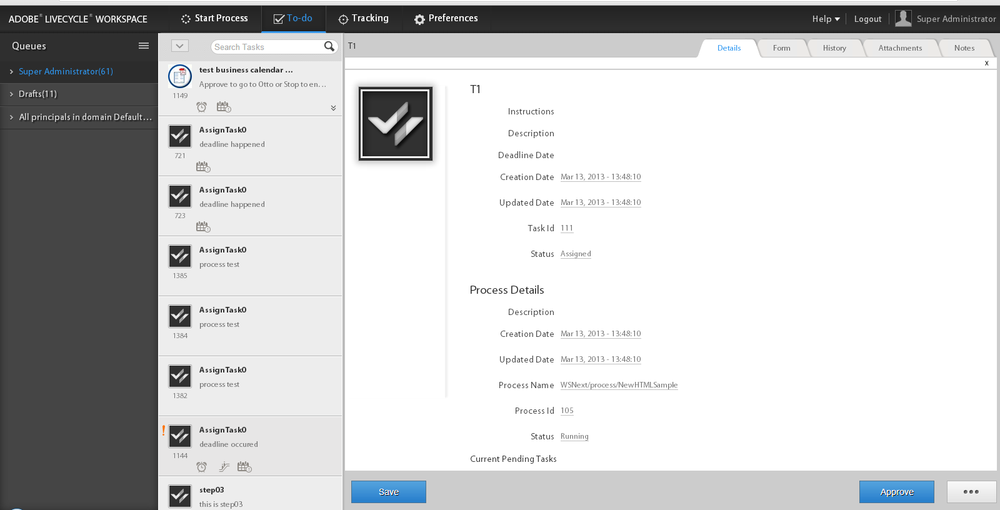

# 할 일 목록에 추가 데이터 표시{#displaying-additional-data-in-todo-list}

기본적으로 AEM Forms 작업 영역 할 일 목록에는 작업 표시 이름과 설명이 표시됩니다. 그러나 생성 날짜, 기한 날짜 등 다른 정보를 추가할 수 있습니다. 아이콘을 추가하고 디스플레이 스타일을 변경할 수도 있습니다.



이 문서에서는 할 일 목록의 각 작업에 대해 표시할 정보를 추가하는 단계에 대해 자세히 설명합니다.

## 추가할 수 있는 사항 {#what-can-be-added}

서버에서 보낸 `task.json`에서 사용할 수 있는 정보를 추가할 수 있습니다. 정보를 일반 텍스트로 추가하거나 스타일을 사용하여 정보 서식을 지정할 수 있습니다.

JSON 개체 설명에 대한 자세한 내용은 [this](/help/forms/using/html-workspace-json-object-description.md) 문서를 참조하십시오.

## 작업에 대한 정보 표시 {#displaying-information-on-a-task}

1. [AEM Forms 작업 영역 사용자 지정에 대한 일반 단계](../../forms/using/generic-steps-html-workspace-customization.md)를 따릅니다.
1. 작업에 대한 추가 정보를 표시하려면 해당 키-값 쌍을 `translation.json`의 작업 블록 내에 추가해야 합니다.

   예를 들어 영어의 경우 `/apps/ws/locales/en-US/translation.json`을(를) 변경합니다.

   ```json
   "task" : {
           "reminder" : {
               "value" : "Reminder",
               "tooltip" : "This is reminder __reminderCount__, for this task."
           },
           "deadlined" : {
               "value" : "Deadlined",
               "tooltip" : "This task has deadlined"
           },
           "save" : {
               "message" : "Task has been saved successfully"
           },
           "status" : {
               "deadlined" : "Deadlined",
               "created" : "Created",
               "assignedsaved" : "Draft from assigned task",
               "terminated" : "Terminated",
               "assigned" : "Assigned",
               "unknown" : "Unknown",
               "createdsaved" : "Draft from created task",
               "completed" : "Completed"
           },
           "draft" : {
               "value" : "Saved",
               "tooltip" : "This task is marked as a draft"
           },
           "escalated" : {
               "value" : "Escalated",
               "tooltip" : "This task has been escalated"
           },
           "forward" : {
               "value" : "Forwarded",
               "tooltip" : "This task was forwarded"
           },
           "priority" : {
               "highest" : "Highest priority",
               "normal" : "Normal priority",
               "high" : "High priority",
               "low" : "Low priority",
               "lowest" : "Lowest priority"
           },
           "claimed" : {
               "value" : "Claimed",
               "tooltip" : "This task has been claimed"
           },
           "locked" : {
               "value" : "Locked",
               "tooltip" : "This task is locked"
           },
           "consulted" : {
               "value" : "Consulted",
               "tooltip" : "This task has been consulted"
           },
           "returned" : {
               "value" : "Returned",
               "tooltip" : "This task was returned back"
           },
           "multiplesubmitbuttons" : {
               "message" : "The form associated with this task has multiple submit buttons so the Workspace Complete button will be disabled. Click the appropriate button on the form to submit it."
           },
           "nosubmitbutton" : {
               "message" : "The form associated with this task does not appear to have submit buttons. You may need to upgrade your Adobe Reader version to 9.1 or greater and enable the Reader Submit option in your process."
           },
           "icon" : {
               "tooltip" : "open the task __taskName__"
           }
       }
   ```

   >[!NOTE]
   >
   >지원되는 모든 언어에 해당하는 키-값 쌍을 추가합니다.

1. 예를 들어 작업 블록 내에 정보를 추가합니다.

   ```json
   "stepname" : {
               "value" : "Step Name",
               "tooltip" : "This task belongs to __stepName__ step"
   }
   ```

## 새 속성에 대한 CSS 정의 {#defining-css-for-the-new-property}

1. 작업에 추가된 정보(속성)에 스타일을 적용할 수 있습니다. 이 작업을 수행하려면 `/apps/ws/css/newStyle.css`에 추가된 새 속성에 대한 스타일 정보를 추가해야 합니다.

   예를 들어 다음을 추가합니다.

   ```css
   .task .taskProperties .stepname{
       width: 25px;
       background: url(../images/stepname.png) no-repeat; /*-------- Or just reuse background image / image-sprite defined .task .taskProperties span of style.css---------------------*/
       background-position: 0px 0px; /*-------- Dummy values, need to be configured as per user background image / image-sprite ---------------------*/
   }
   ```

## HTML 템플릿에 항목 추가 {#adding-entry-in-the-html-template}

마지막으로 작업에 추가할 각 속성에 대한 항목을 개발 패키지에 포함해야 합니다. 만들려면 AEM Forms 작업 공간 코드 작성 을 참조하십시오.

1. `task.html` 복사:

   * 보낸 사람: `/libs/ws/js/runtime/templates/`
   * 받는 사람: `/apps/ws/js/runtime/templates/`

1. `/apps/ws/js/runtime/templates/task.html`에 새 정보를 추가합니다.

   예를 들어 `div class="taskProperties"` 아래에 을 추가합니다.

   ```jsp
   <span class="stepname" alt="<%= $.t('task.stepname.value')%>" title = '<%= $.t("task.stepname.tooltip",{stepName:stepName})%>'/>
   ```
