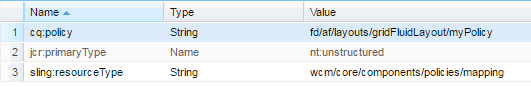

# 사용된 템플릿을 기반으로 구성 요소 표시{#displaying-components-based-on-the-template-used}

양식 작성자가 [템플릿](../../forms/using/template-editor.md)양식 작성자는 템플릿 정책을 기반으로 한 특정 구성 요소를 보고 사용할 수 있습니다. 양식 작성 시 양식 작성자에게 표시되는 구성 요소 그룹을 선택할 수 있는 템플릿 컨텐츠 정책을 지정할 수 있습니다.

## 템플릿의 컨텐츠 정책 변경 {#changing-the-content-policy-of-a-template}

템플릿을 만들면 아래에 만들어집니다 `/conf` 컨텐츠 리포지토리에서 생성합니다. 에서 만든 폴더 기반 `/conf` 디렉토리, 템플릿의 경로는 다음과 같습니다. `/conf/<your-folder>/settings/wcm/templates/<your-template>`.

템플릿의 컨텐츠 정책에 따라 사이드바에 구성 요소를 표시하려면 다음 단계를 수행하십시오.

1. CRXDE Lite를 엽니다.\
   URL: `https://<server>:<port>/crx/de/index.jsp`
1. CRXDE에서 템플릿을 만들 폴더로 이동합니다.

   예를 들어`/conf/<your-folder>/`

1. CRXDE에서 다음 위치로 이동합니다. `/conf/<your-folder>/settings/wcm/policies/fd/af/layouts/gridFluidLayout/`

   구성 요소 그룹을 선택하려면 새 컨텐츠 정책이 필요합니다. 새 정책을 만들려면 기본 정책을 복사하여 붙여넣은 다음 이름을 바꿉니다.

   기본 컨텐츠 정책의 경로는 다음과 같습니다. `/conf/<your-folder>/settings/wcm/policies/fd/af/layouts/gridFluidLayout/default`

   에서 `gridFluidLayout` 폴더에서 기본 정책을 복사하여 붙여넣고 이름을 바꿉니다. (예: `myPolicy`)

   

1. 작성한 새 정책을 선택하고 **구성 요소** 형식이 있는 오른쪽 패널의 속성 `string[]`.

   구성 요소 속성을 선택하고 열면 구성 요소 편집 대화 상자가 표시됩니다. 구성 요소 편집 대화 상자에서는 **+** 및 **-** 단추. 작성자가 사용할 구성 요소를 포함하는 구성 요소 그룹을 추가할 수 있습니다.

   

   구성 요소 그룹을 추가한 후 **확인** 목록을 업데이트하려면 **모두 저장** 위의 CRXDE 주소 표시줄 및 새로 고침.

1. 템플릿에서 컨텐츠 정책을 기본값에서 만든 새 정책으로 변경합니다. ( `myPolicy` 이 예에서 )

   정책을 변경하려면 CRXDE에서 `/conf/<your-folder>/settings/wcm/templates/<your-template>/policies/jcr:content/guideContainer/rootPanel/items`.

   에서 `cq:policy` 속성, 변경 `default` 새 정책 이름( `myPolicy`).

   

   템플릿을 사용하여 양식을 작성할 때 사이드바에서 추가된 구성 요소를 볼 수 있습니다.
