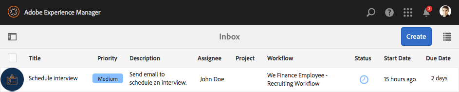
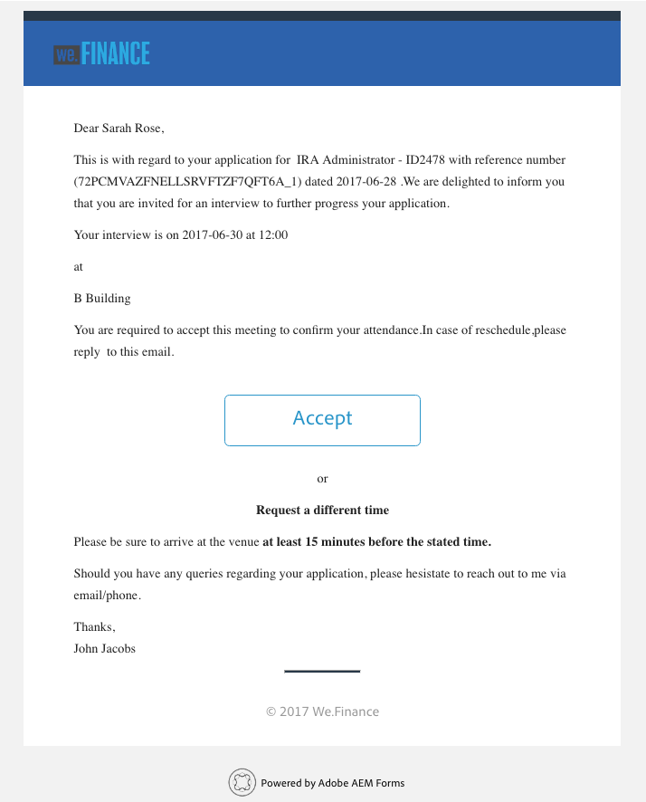
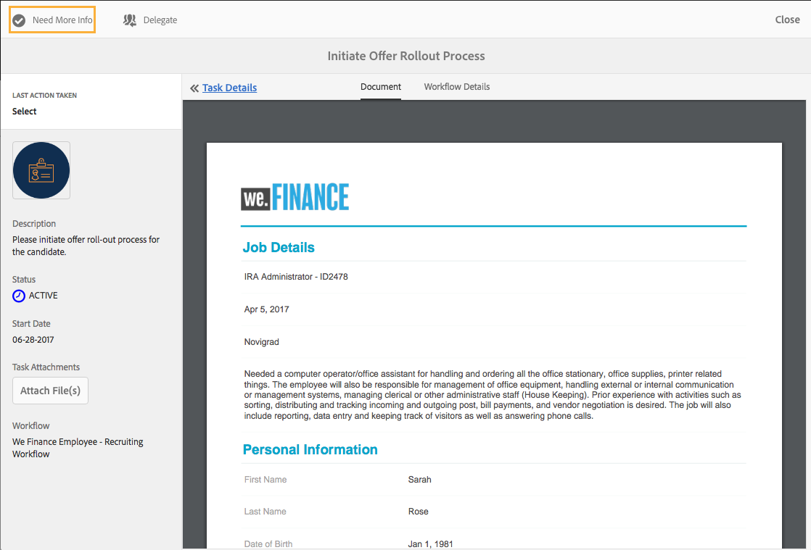

# 직원 채용 참조 사이트 연습 {#employee-recruitment-reference-site-walkthrough}

## 개요 {#overview}

We.Finance는 지원자들이 참조 사이트 포털을 통해 취업신청을 할 수 있는 조직이다. 또한 이 조직은 포털을 사용하여 지원자 면접 일정, 미팅 목록 및 내부 커뮤니케이션을 관리합니다. 사이트는 다음을 관리합니다.

* 일자리 검색 및 지원 후보
* 후보자 심사 및 낙찰
* 인터뷰 과정
* 후보 세부 정보 수집
* 후보 배경 확인
* 선택한 지원자에게 오퍼 롤아웃

>[!NOTE]
>
>신입사원 모집 사용 사례는 We.Finance 및 We.Gov 참조 사이트에서 모두 사용할 수 있습니다. 이 연습에서 사용되는 예제, 이미지 및 설명은 We.Finance 참조 사이트를 사용합니다. 그러나 We.Gov를 사용하여 이러한 사용 사례를 실행하고 아티팩트를 검토할 수도 있습니다. 이렇게 하려면, 언급된 URL에서 **we-finance**&#x200B;을 **we-gov**&#x200B;로 바꾸십시오.

### 워크플로 모델에 {#workflow-models-involved} 포함

직원 채용 사용 사례에는 두 가지 워크플로우가 포함됩니다.

* 인터뷰 전 - We Finance 직원 채용 워크플로우
* 인터뷰 후 - We Finance Employee Recruiting Post Statement 워크플로우

이러한 워크플로우는 AEM에서 만들어지며 다음 위치에서 찾을 수 있습니다.

`https://[authorHost]:[authorPort]/libs/cq/workflow/admin/console/content/models.html/etc/workflow/models/`

#### We Finance Employee Recruiting 워크플로 {#we-finance-employee-recruiting-workflow}

다음은 이 문서에 뒤따르는 We Finance 직원 채용 워크플로우 모델입니다.

#### We Finance Employee Recruiting Post 인터뷰 워크플로 {#we-finance-employee-recruiting-post-interview-workflow}

다음은 이 문서에 뒤따르는 We Finance Employee Post Interrenting 워크플로우의 모델입니다.

### 페르소나 {#personas}

이 시나리오에는 다음과 같은 페르소나가 포함됩니다.

* 그 단체에서 지원중인 후보 사라 로즈
* 채용 담당자 John Jacobs
* 채용 관리자 Gloria Rios
* John Doe, HR 담당자

## Sarah는 {#sarah-applies-for-a-job} 작업에 지원한다.

사라 로즈는 이 조직에서 일자리 기회를 찾고 있다. 웹 포털을 방문하여 취업 후 경력 페이지에 기재되어 있는 취업 정보를 찾아볼 수 있습니다. 그녀는 합격 채용목록을 찾아 그것을 신청했다.

We.Finance 홈 페이지

We.Finance 경력 페이지

Sarah가 Job 게시물에 적용을 클릭합니다. 작업 응용 프로그램 양식이 열립니다. 그녀는 신청서에 있는 모든 세부 사항을 기입하고 제출한다.

### 작동 방식 {#how-it-works}

We.Finance 홈 페이지와 경력 페이지는 AEM Sites 페이지입니다. 경력 페이지에는 반복 가능한 패널을 사용하여 서비스를 사용하여 일자리 오프닝을 가져오고 페이지에 나열하는 적응형 양식이 포함됩니다. 응용 양식을 `https://[authorHost]:[authorPort]/editor.html/content/forms/af/we-finance/employee/recruitment/jobs.html`에서 검토할 수 있습니다.

### 직접 보기 {#see-it-yourself}

`https://[publishHost]:[publishPort]/content/we-finance/global/en.html`으로 이동하고 **[!UICONTROL 경력]**&#x200B;을 클릭합니다. **[!UICONTROL 검색]**&#x200B;을 클릭하여 작업 목록을 채운 다음 작업을 위해 **[!UICONTROL 적용]**&#x200B;을 클릭합니다. 양식에 세부 사항을 채우고 신청서를 제출합니다.

이 연습을 통한 통신이 지정된 이메일 ID로 전송되므로 응용 프로그램에서 올바른 이메일 ID를 지정하십시오.

## 존 제이콥스는 고용 매니저의 심사에서 사라 로즈의 프로필 {#john-jacobs-shortlists-sarah-rose-s-profile-for-the-hiring-manager-s-screening}을 유의한다.

그 조직은 사라가 제출한 구직 신청서를 받았다. 리쿠르트 직원인 존 제이콥스는 사라의 프로필을 검토할 임무를 맡았다. 그는 AEM 받은 편지함에서 작업을 검토하고, 작업 요구 사항과 일치하는 프로필을 찾은 다음, 바로 가기 목록을 클릭합니다. 사라의 프로필은 고용 관리자인 글로리아 리오스에게 승인을 위해 보내졌다.

John의 AEM 받은 편지함

존 제이콥스 씨는 고용 매니저 선발에 대한 사라 로즈의 프로필을 유의한다

**사용 방법**

작업 애플리케이션 양식의 제출 작업은 John Jacob의 받은 편지함에서 애플리케이션을 심사하기 위한 작업을 생성하는 워크플로우를 트리거합니다. John이 애플리케이션을 검토하고 제한하면 워크플로우가 채용 관리자인 Gloria의 받은 편지함에 작업을 생성합니다.

### 직접 보기 {#see-it-yourself-1}

`https://[publishHost]:[publishPort]/content/we-finance/global/en/login.html?resource=/aem/inbox.html`으로 이동하여 John Jacobs의 사용자 이름/암호로 jjacobs/password를 사용하여 로그인합니다. 후보자 프로필 검토 작업을 열고 지원자를 바로 나열합니다.

## Gloria는 지원서를 검토하고 지원자 면접을 승인합니다 {#gloria-reviews-the-application-and-approves-the-applicant-for-an-interview}

고용 관리자인 Gloria는 그녀의 AEM 받은 편지함에서 바로 기재되어 있는 프로필을 받았습니다. 그녀는 그것을 검토하고 인터뷰를 위해 사라 로즈를 승인하였다.

Gloria의 AEM 받은 편지함

글로리아, 사라 로즈 씨의 인터뷰 승인

**사용 방법**

Gloria가 면접 후보를 승인하면 워크플로우는 We.Finance 채용 담당자 John Doe의 AEM 받은 편지함에 작업을 만듭니다.

### 직접 보기 {#see-it-yourself-2}

`https://[publishHost]:[publishPort]/content/we-finance/global/en/login.html?resource=/aem/inbox.html`으로 이동하여 John Jacobs의 사용자 이름/암호로 jjacobs/password를 사용하여 로그인합니다. 후보자 프로필 검토 작업을 열고 지원자를 바로 나열합니다.

`https://[publishHost]:[publishPort]/content/we-finance/global/en/login.html?resource=/aem/inbox.html`으로 가서 Gloria Rios의 사용자 이름/암호로 그리스/암호를 사용하여 로그인합니다. 후보 프로필 검토 작업을 열고 인터뷰 예약을 클릭합니다.

## John Doe가 {#john-doe-schedules-an-interview} 인터뷰를 예약합니다.

John Doe는 받은 편지함에서 인터뷰를 예약하는 작업을 받습니다. John Doe는 작업을 선택 및 열고 인터뷰 날짜, 시간, 위치, 인터뷰를 담당하는 HR 담당자를 존 제이콥으로 수정합니다. John Doe가 초대 이메일 전송을 클릭합니다. 사라에게 이메일이 보내지고, 사라를 인터뷰하기 위해 고용 매니저 글로리아에게 업무가 할당되었다.

John Doe의 AEM 받은 편지함

John Doe는 인터뷰를 예약하고 자세한 내용을 사라 로즈에게 보냅니다

## Sarah Rose는 인터뷰 일정 {#sarah-rose-receives-the-email-with-interview-schedule}(으)로 이메일을 수신합니다.

Sarah Rose는 인터뷰 일정, 장소 및 기타 세부 정보가 있는 이메일을 받았다. 그녀는 면접 일정과 장소에 대해 괜찮다고 나타내기 위해 수락을 클릭합니다. 정확한 정보에 따라, 사라는 인터뷰에 응한다.

사라 로즈는 인터뷰 일정을 받았다

## 인터뷰 후에 고용 관리자는 사라 로즈를 {#after-the-interviews-the-hiring-manager-shortlists-sarah-rose} 유보로 지명합니다.

사라 로즈가 인터뷰를 통해 작품을 정리하면, 고용 관리자인 글로리아 리오스는 그녀의 받은 편지함에서 후보자 선택 작업을 열고 선택을 클릭한다. Gloria Rios의 결정은 추가 처리를 위해 인사 담당자인 John Doe에게 전달되었습니다.

Gloria의 AEM 받은 편지함

Gloria Rios가 인터뷰 후에 Sarah Rose를 선발하다

## John Doe가 추가 정보 {#john-doe-requests-more-information} 요청

입사 지원자를 신청하기 전에, 그녀의 경력을 확인해야 한다. John Doe는 선택된 지원자의 세부 사항을 열어 검토하고, 그녀의 고용 및 교육 세부 사항 중 일부가 아직 채워지지 않은 것으로 파악합니다. John Doe 클릭에 추가 정보가 필요합니다.

 

John Doe는 Sarah Rose로부터 그녀의 교육과 근무 경험에 대한 더 많은 정보를 요청한다

## Sarah Rose가 {#sarah-rose-receives-an-email-requesting-further-information} 추가 정보를 요청하는 이메일을 수신합니다.

사라 로즈는 그녀의 고용 신청을 처리하는 데 더 많은 정보가 필요하다는 것을 그녀에게 알리는 이메일을 받았다. 이메일에는 필요한 정보를 채우는 데 사용할 수 있는 링크가 포함되어 있습니다.

Sarah Rose는 그녀의 취업 신청서를 처리하는 데 더 많은 정보가 필요함을 알리는 이메일을 받았다

Sarah는 이메일에서 세부 정보 제공 링크를 클릭합니다. 양식이 나타납니다. Sarah는 John Doe의 요청에 따라 필요한 교육 및 고용 세부 사항을 채우고 [제출]을 클릭합니다.

Sarah는 이메일의 링크를 클릭하여 추가 정보 양식을 엽니다

Sarah는 John Doe의 요청에 따라 추가 정보를 채우고 [제출]을 클릭합니다

## John Doe는 {#john-doe-reviews-the-selected-candidate-profile-for-the-additional-information-provided} 제공된 추가 정보를 위해 선택한 후보 프로필을 검토합니다.

John Doe는 후보 검토 요청을 선택하고 엽니다. John Doe는 Sarah가 필요에 따라 모든 정보를 채웠음을 발견하였다. 애플리케이션을 검토한 후 John Doe가 승인을 클릭합니다. 존 도어의 승인을 받고, 사라 로즈에 대한 신원조회를 하기 위한 요청은 존 제이콥스에게 전달됩니다.

John Doe의 AEM 받은 편지함

John Doe는 Sarah가 제공하는 추가 정보를 검토하고 승인합니다

## John Jacobs가 백그라운드 확인 요청 {#john-jacobs-receives-a-background-check-request} 수신

John Jacobs는 그의 받은 편지함에서 배경 확인 요청을 봅니다. John Jacobs는 일을 시작하고 Sarah Rose가 제공한 정보를 검토합니다. 백그라운드 검사를 수행한 후 John Jacobs가 Go Ahead를 클릭하여 배경 확인이 성공했음을 나타냅니다.

존 제이콥스의 AEM 받은 편지함

백그라운드 검사를 수행한 후 John Jacobs는 Go Ahead를 클릭합니다.

## John Doe는 Sarah Rose {#john-doe-sends-out-the-joining-letter-to-sarah-rose}(으)로 입사하는 편지를 보냅니다.

John Doe는 연결된 편지를 보내는 데 대한 요청을 AEM 받은 편지함에서 수신합니다. John은 요청을 열고 세부 사항을 봅니다. John Doe는 연결된 문자 PDF를 첨부한 다음 [첨부 및 결합 편지 보내기]를 클릭합니다.

John Doe의 AEM 받은 편지함

John Doe가 서명을 위해 조인 편지를 보냅니다.

## Sarah Rose는 합작 문자 {#sarah-rose-receives-and-signs-the-joining-letter}를 수신하고 서명합니다.

새라 로즈는 서명하기 위해 함께 보내는 편지를 받았다. Sarah가 여기를 클릭하여 편지를 검토하고 서명합니다. 연결된 문자 PDF에 문서에 서명할 필드가 표시됩니다.

새라 로즈는 서명하기 위한 입회서를 받는다

Sarah는 입력, 직접 쓰기에 그리거나, 서명 이미지를 삽입하거나, 모바일 터치스크린을 사용하여 서명을 그릴 수 있습니다. Sarah는 이름을 입력하고 [서명하려면 클릭]을 클릭한 다음, 연결된 문자의 서명된 사본을 다운로드합니다.

사라가 같이 쓴 편지에 서명하기 위해 이름을 입력한다

Sarah를 클릭하여 서명 편지 서명을 완료합니다.

